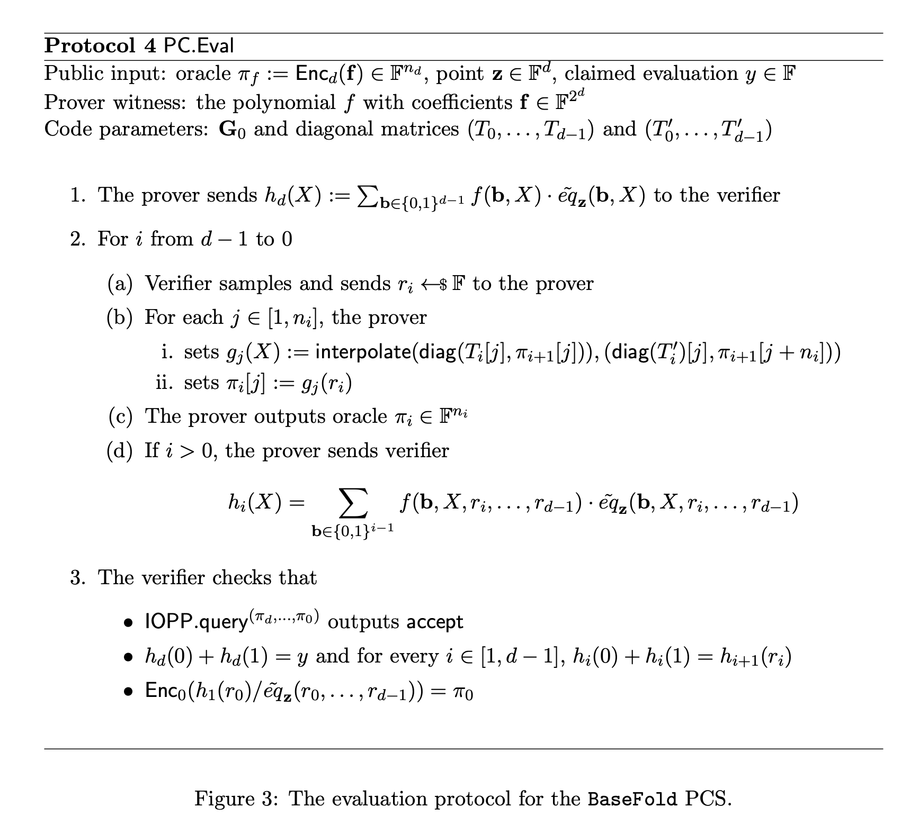

# Basefold Protocol Algorithm Complexity Analysis

- Jade Xie <jade@secbit.io>
- Yu Guo <yu.guo@secbit.io>

## Protocol

The following complexity analysis is based on the Basefold paper [Basefold](https://eprint.iacr.org/2023/1705.pdf) Protocol 4, [Basefold Evaluation Argument Protocol Based on the Evaluation Form](https://github.com/sec-bit/mle-pcs/blob/main/basefold/basefold-03.md#basefold-evaluation-argument-protocol-based-on-the-evaluation-form) protocol description, and code implementation [Basefold.py](https://github.com/sec-bit/mle-pcs/blob/main/src/Basefold.py).

The protocol description for evaluation in the paper is as follows:



## Parameters

- Let $N = 2^d$

**Public Inputs**

1. Commitment of $\tilde{f}$: $\pi_d = \mathsf{Enc}_d(\mathbf{a})$. In practice, this is implemented using a Merkle Tree commitment, denoted as:
$$
\pi_d = \mathsf{Enc}_d(\mathbf{a}) = \mathsf{MT.commit}(\mathsf{Enc}_d(\mathbf{a}))
$$

2. Evaluation point $\mathbf{u}$
3. Computed value $v = \tilde{f}(\mathbf{u})$
4. Number of repeated queries in IOPP.query phase: $l$
5. Blow-up factor in FRI protocol: $\mathcal{R}$

**Witness**

- Evaluation Form vector of MLE $\tilde{f}$: $\mathbf{a} = (a_0, a_1, \ldots, a_{N-1})$, where $a_i = \tilde{f}(\mathsf{bits}(i))$,

satisfying
$$
\tilde{f}(X_0, X_1, X_2, \ldots, X_{d-1}) = \sum_{\mathbf{b}\in\{0,1\}^d} \tilde{f}(\mathbf{b})\cdot eq_{\mathbf{b}}(X_0, X_1, X_2, \ldots, X_{d-1})
$$

The corresponding parameters passed in the code implementation are:

```python
proof = prove_basefold_evaluation_arg_multilinear_basis(f_code=ff_code, f_evals=ff, us=point, v=eval, k=log_n - log_k0, k0=2**log_k0, T=T, blowup_factor=blowup_factor, num_verifier_queries=4, transcript=transcript, debug=False); proof
verify_basefold_evaluation_arg_multilinear_basis(len(ff_code), commit=commit, proof=proof, us=point, v=eval, d=2, k=log_n - log_k0, T=T, blowup_factor=blowup_factor, num_verifier_queries=4)
```

## Prover

### Encoding

Input: Values of $\tilde{f}$ on the boolean hypercube, $\mathbf{a} = (a_0, a_1, \ldots, a_{N-1})$. First encode it into a foldable code, then use basefold's evaluation protocol.


- The computational complexity of the encoding process is $\frac{\mathcal{R}}{2} \cdot dN ~ \mathbb{F}_{\mathsf{mul}}$.

### Round 1

Prover sends the values of $h^{(d)}(X)$: $(h^{(d)}(0), h^{(d)}(1), h^{(d)}(2))$
$$
h^{(d)}(X) = \sum_{b_1,b_2, \ldots, b_d\in\{0,1\}^2}f(X, b_1, b_2, \ldots, b_d)\cdot \tilde{eq}((X, b_1, b_2, \ldots, b_d), \mathbf{u})
$$

#### Prover Cost Round 1

Analyzing the algorithmic complexity of Round 1:

1. Compute $\vec{c} = \tilde{eq}_{\bf{u}}(\vec{b})$, where $\vec{b} = \{0,1\}^d$, which means calculating values on the hypercube, a total of $2^d$ values.

```python
eq = MLEPolynomial.eqs_over_hypercube(us)
```

The specific implementation of this function is:

```python
@classmethod
def eqs_over_hypercube(cls, rs):
    k = len(rs)
    n = 1 << k
    evals = [1] * n
    half = 1
    for i in range(k):
        for j in range(half):
            evals[j+half] = evals[j] * rs[i]
            evals[j] = evals[j] - evals[j+half]
        half *= 2
    return evals
```

The complexity analysis here is consistent with the analysis in ph23, and borrowing the analysis result directly, the complexity is $(2^d - 1) ~ \mathbb{F}_{\mathsf{mul}}$.

2. Prover computes $h_d(X)$ and sends it to the Verifier.

Since $h_d(X)$ is a polynomial of degree 2, the Prover computes the values $h_d(0)$, $h_d(1)$, and $h_d(2)$ and sends them to the Verifier.

For example, when $d = 3$:

$$
\begin{split}
h^{(d)}(0) &= a_0\cdot e_0 + a_1\cdot e_1 + a_2\cdot e_2 + a_3\cdot e_3 \\
h^{(d)}(1) &= a_4\cdot e_4 + a_5\cdot e_5 + a_6\cdot e_6 + a_7\cdot e_7 \\
h^{(d)}(2) &= \sum_{i=0}^{3} (2\cdot a_{i+4} - a_i)\cdot (2\cdot e_{i+4} - e_i) \\
& = \sum_{i=0}^{3} (4 a_{i+4} \cdot e_{i+4}  + a_ie_i - 2 \cdot a_{i}e_{i + 4} - 2 a_{i+4}e_i)\\
& = 4 \cdot h^{(d)}(1) + h^d(0) - 2 \cdot \sum_{i=0}^{3} a_{i}e_{i + 4} - 2 \cdot \sum_{i=0}^{3} a_{i + 4}e_{i}
\end{split}
$$

```python
h_eval_at_0 = sum([f_low[j] * eq_low[j] for j in range(half)])
h_eval_at_1 = sum([f_high[j] * eq_high[j] for j in range(half)])
h_eval_at_2 = sum([ (2 * f_high[j] - f_low[j]) * (2 * eq_high[j] - eq_low[j]) for j in range(half)])
h_poly_vec.append([h_eval_at_0, h_eval_at_1, h_eval_at_2])
```

For the calculation of $h^{(d)}(X)$, the decomposition must satisfy:

$$
\begin{align}
 & 1 - X = a \cdot (1 - 1) + b \cdot (1 - 0)  \\
 & X = a \cdot 1 + b \cdot (1 - 0)
\end{align}
$$

resulting in:

$$
a = X, \quad b = 1 - X
$$

Therefore, for $X = 2$, we have $a = 2, b = -1$, so:

$$
\begin{align}
 & \tilde{eq}((u_0, u_1, u_2), (b_0, b_1, 2)) = 2 \times \tilde{eq}((u_0, u_1, u_2), (b_0, b_1, 1)) - \tilde{eq}((u_0, u_1, u_2), (b_0, b_1, 0))  \\
\end{align}
$$

The general formula is:
$$
h^{(d)}(X) = \sum_{\mathbf{b} \in \{0,1\}^{d - 1}} (X \cdot f(\mathsf{b},1) + (1 - X) \cdot f(\mathsf{b}, 0)) \cdot  (X \cdot \tilde{eq}(\mathsf{b},1) + (1 - X) \cdot \tilde{eq}(\mathsf{b}, 0))
$$

- Complexity of computing $h^{(d)}(0)$ is $2^{d - 1} ~ \mathbb{F}_{\mathsf{mul}}$
- Complexity of computing $h^{(d)}(1)$ is $2^{d - 1} ~ \mathbb{F}_{\mathsf{mul}}$
- Complexity of computing $h^{(d)}(2)$ is $(2 \cdot 2^{d - 1} + 3) ~ \mathbb{F}_{\mathsf{mul}}$

Total complexity:

$$
(4 \cdot 2^{d - 1} + 3)  ~ \mathbb{F}_{\mathsf{mul}} = (2N + 3)  ~ \mathbb{F}_{\mathsf{mul}}
$$

Therefore, the total complexity for this round is:

$$
(3N + 2)  ~ \mathbb{F}_{\mathsf{mul}}
$$

The Prover sends:

$$
(h^{(d)}(0), h^{(d)}(1), h^{(d)}(2))
$$

### Round 2

For $i = d-1, d-2, \ldots, 1$:

1. Verifier sends challenge $\alpha_i \stackrel{\$}{\leftarrow} \mathbb{F}_p$

2. Prover simultaneously conducts the Basefold-IOPP protocol and the Sumcheck protocol:

- Prover sends the folded vector encoding: $\pi_i = \mathsf{fold}^*_{\alpha_i}(\pi_{i+1})$. In practice, the corresponding Merkle Tree commitment is sent:
$$
\mathsf{cm}(\pi_i) = \mathsf{cm}(\mathsf{fold}^*_{\alpha_i}(\pi_{i+1})) = \mathsf{MT.commit}(\mathsf{fold}^*_{\alpha_i}(\pi_{i+1}))
$$

- Prover computes $h^{(i)}(\alpha_i)$ as the sum for the next round of the Sumcheck protocol
- Prover computes the Evaluations of $f^{(i)}(X_0, X_1, \ldots, X_{i-1})$ as $\mathbf{a}^{(i)} = \mathsf{fold}^*_{\alpha_i}(\mathbf{a}^{(i+1)})$
- Prover computes and sends $h^{(i)}(X)$:

$$
h^{(i)}(X) = \sum_{\vec{b}\in\{0,1\}^{i-1}}f(\vec{b}, X, \alpha_i, \alpha_{i+1}, \ldots, \alpha_{d-1})\cdot \tilde{eq}((\vec{b}, X, \alpha_i, \ldots, \alpha_{d-1}), \vec{u})
$$

The right side of the equation is also a Univariate Polynomial of degree 2 in $X$, so the Prover can compute the values of $h^{(i)}(X)$ at $X=0,1,2$: $(h^{(i)}(0), h^{(i)}(1), h^{(i)}(2))$ based on $\mathbf{a}^{(i)}$.

#### Prover Cost Round 2

Analyzing the complexity of the above process for the $i$-th iteration:

1. Prover computes and sends $\pi_i = \mathsf{fold}^*_{\alpha_i}(\pi_{i+1})$:

```python
f_code = basefold_fri_multilinear_basis(f_code, T[k-i-1], alpha, debug=debug)
```

```python
def basefold_fri_multilinear_basis(vs, table, c, debug=False):
    assert len(table) == len(vs)/2, "len(table) is not double len(vs), len(table) = %d, len(vs) = %d" % (len(table), len(vs))
    n = len(vs)
    half = int(n / 2)
    new_vs = []
    left = vs[:half]
    right = vs[half:]

    for i in range(0, half):
        if debug: print("(left[i] + right[i])/2=", (left[i] + right[i])/2)
        new_vs.append((1 - c) * (left[i] + right[i])/2 + (c) * (left[i] - right[i])/(2*table[i]))
    return new_vs
```

The function parameter `f_code` represents $\pi_i$, so the length of $\pi_i$ is $2^i \cdot \mathcal{R}$, also denoted as $n_i$.

The loop `for i in range(0, half)` iterates $n_i/2$ times. In each iteration, the finite field operations involved are:
$$
2 ~ \mathbb{F}_{\mathsf{mul}} + \mathbb{F}_{\mathsf{inv}} + 3 ~ \mathbb{F}_{\mathsf{mul}} + \mathbb{F}_{\mathsf{inv}} = 5 ~ \mathbb{F}_{\mathsf{mul}} + 2~\mathbb{F}_{\mathsf{inv}}
$$

Therefore, the overall computational complexity of this function is:
$$
(5 \cdot \frac{n_i}{2}) ~ \mathbb{F}_{\mathsf{mul}} + (2 \cdot \frac{n_i}{2} )~\mathbb{F}_{\mathsf{inv}} = \frac{5n_i}{2} ~ \mathbb{F}_{\mathsf{mul}} + n_i~\mathbb{F}_{\mathsf{inv}}
$$

2. Prover computes $h^{(i)}(\alpha_i)$ as the sum for the next round of the Sumcheck protocol:

```python
# compute the new sum = h(alpha)
sumcheck_sum = UniPolynomial.uni_eval_from_evals([h_eval_at_0, h_eval_at_1, h_eval_at_2], alpha, [Fp(0),Fp(1),Fp(2)])
```

```python
@classmethod
def uni_eval_from_evals(cls, evals, z, D):
    n = len(evals)
    if n != len(D):
        raise ValueError("Domain size should be equal to the length of evaluations")
    if z in D:
        return evals[D.index(z)]
    weights = cls.barycentric_weights(D)
    # print("weights={}".format(weights))
    e_vec = [weights[i] / (z - D[i]) for i in range(n)]
    numerator = sum([e_vec[i] * evals[i] for i in range(n)])
    denominator = sum([e_vec[i] for i in range(n)])
    return (numerator / denominator)
```

> [!note] 
> The value $h^{(i)}(\alpha_i)$ should be computed by the Verifier, not the Prover.

3. Prover computes the Evaluations of $f^{(i)}(X_0, X_1, \ldots, X_{i-1})$ as $\mathbf{a}^{(i)} = \mathsf{fold}^*_{\alpha_i}(\mathbf{a}^{(i+1)})$:

```python
f = [(1 - alpha) * f_low[i] + alpha * f_high[i] for i in range(half)]
```

Here, the length of `half` is $2^i$, so the complexity is:
$$
2 \cdot 2^{i} ~ \mathbb{F}_{\mathsf{mul}} = 2^{i+1} ~ \mathbb{F}_{\mathsf{mul}}
$$

4. Prover computes and sends $h^{(i)}(X)$:

$$
h^{(i)}(X) = \sum_{\vec{b}\in\{0,1\}^{i-1}}f(\vec{b}, X, \alpha_i, \alpha_{i+1}, \ldots, \alpha_{d-1})\cdot \tilde{eq}((\vec{b}, X, \alpha_i, \ldots, \alpha_{d-1}), \vec{u})
$$

The right side is a Univariate Polynomial of degree 2 in $X$, so the Prover can compute the values at $X=0,1,2$: $(h^{(i)}(0), h^{(i)}(1), h^{(i)}(2))$ based on $\mathbf{a}^{(i)}$.

```python
eq_low = eq[:half]
eq_high = eq[half:]

eq = [(1 - alpha) * eq_low[i] + alpha * eq_high[i] for i in range(half)]

h_eval_at_0 = sum([f_low[j] * eq_low[j] for j in range(half)])
h_eval_at_1 = sum([f_high[j] * eq_high[j] for j in range(half)])
h_eval_at_2 = sum([ (2 * f_high[j] - f_low[j]) * (2 * eq_high[j] - eq_low[j]) for j in range(half)])
h_poly_vec.append([h_eval_at_0, h_eval_at_1, h_eval_at_2])
```

- The complexity of computing `eq = [(1 - alpha) * eq_low[i] + alpha * eq_high[i] for i in range(half)]` is the same as computing `f`, which is $2^{i+1} ~ \mathbb{F}_{\mathsf{mul}}$
- The complexity of computing $(h^{(i)}(0), h^{(i)}(1), h^{(i)}(2))$ is similar to the analysis of $h_d(X)$, which is:

$$
(2 \cdot 2^{i} + 3) ~ \mathbb{F}_{\mathsf{mul}}
$$

Thus, the complexity for this step is:
$$
2^{i+1} ~ \mathbb{F}_{\mathsf{mul}} + (4 \cdot 2^{i-1} + 3)  ~ \mathbb{F}_{\mathsf{mul}} =(4 \cdot 2^{i} + 3) ~ \mathbb{F}_{\mathsf{mul}}
$$

Adding the complexities of all the steps:
$$
\frac{5n_i}{2} ~ \mathbb{F}_{\mathsf{mul}} + n_i~\mathbb{F}_{\mathsf{inv}} + 2^{i+1} ~ \mathbb{F}_{\mathsf{mul}} + (4 \cdot 2^i + 3)  ~ \mathbb{F}_{\mathsf{mul}} = (\frac{5n_i}{2} + 6 \cdot 2^{i} + 3) ~ \mathbb{F}_{\mathsf{mul}} +  n_i~\mathbb{F}_{\mathsf{inv}}
$$

Substituting $n_i = 2^i \cdot \mathcal{R}$, the complexity becomes:
$$
(\frac{5\cdot 2^i \cdot \mathcal{R}}{2} + 6 \cdot 2^{i} + 3) ~ \mathbb{F}_{\mathsf{mul}} + (2^i \cdot \mathcal{R})~\mathbb{F}_{\mathsf{inv}} = ((\frac{5}{2} \mathcal{R} + 6) \cdot 2^i + 3) ~ \mathbb{F}_{\mathsf{mul}} + (2^i \cdot \mathcal{R})~\mathbb{F}_{\mathsf{inv}}
$$

Summing up the complexities for all $i = d-1, \ldots, 1$:

$$
\begin{align}
 & \sum_{i = 1}^{d - 1}((\frac{5}{2} \mathcal{R} + 6) \cdot 2^i + 3) ~ \mathbb{F}_{\mathsf{mul}} + (2^i \cdot \mathcal{R})~\mathbb{F}_{\mathsf{inv}} \\
 = & ((\frac{5}{2} \mathcal{R} + 6) (N - 2) + 3(d - 1)) ~ \mathbb{F}_{\mathsf{mul}} +  \mathcal{R}(N - 2)~\mathbb{F}_{\mathsf{inv}} \\
=  & ((\frac{5}{2} \mathcal{R} + 6) N + 3d - 5 \mathcal{R} - 15) ~ \mathbb{F}_{\mathsf{mul}} +  (\mathcal{R}N - 2 \mathcal{R})~\mathbb{F}_{\mathsf{inv}}
\end{align}
$$

Additionally, for the Merkle Tree computation, for $i = d-1, \ldots, 1$, the Prover sends the Merkle Tree commitment of the folded vector encoding:
$$
\mathsf{cm}(\pi_i) = \mathsf{cm}(\mathsf{fold}^*_{\alpha_i}(\pi_{i+1})) = \mathsf{MT.commit}(\mathsf{fold}^*_{\alpha_i}(\pi_{i+1}))
$$

Here, the Merkle Tree has $2^i \cdot \mathcal{R}$ leaf nodes, denoted as $\mathsf{MT.commit}(2^i \cdot \mathcal{R})$, totaling:

$$
\sum_{i = 1}^{d - 1} \mathsf{MT.commit}(2^{i} \cdot \mathcal{R}) 
$$

### Round 3

1. Verifier sends challenge $\alpha_0 \leftarrow \mathbb{F}_p$
2. Prover continues with the Basefold-IOPP protocol:
   - Prover sends the folded vector encoding $\pi_0 = \mathsf{fold}^*_{\alpha_0}(\pi_1)$. Since the Verifier will check if $\pi_0$ is a valid encoding, all values are sent to the Verifier instead of their Merkle commitment.
   
#### Prover Cost Round 3

The complexity is consistent with the analysis of $\pi_i$:

$$
\frac{5n_0}{2} ~ \mathbb{F}_{\mathsf{mul}} + n_0~\mathbb{F}_{\mathsf{inv}} = \frac{5}{2} \mathcal{R}~ \mathbb{F}_{\mathsf{mul}} + \mathcal{R} ~ \mathbb{F}_{\mathsf{inv}}
$$

### Round 4

This round involves the Verifier performing IOPP.query to check the correctness of the folding. The protocol description from the paper is:


Repeated $l$ times:

1. Verifier randomly selects an index $\mu \stackrel{\$}{\leftarrow} [1, n_{d-1}]$
2. For $i = d-1, \ldots, 0$:
   - Prover sends $\pi_{i+1}[\mu], \pi_{i+1}[\mu + n_i]$ and the Merkle Path corresponding to $\pi_{i+1}[\mu]$.
   $$
    \{\pi_{i+1}[\mu], \pi_{\pi_{i+1}}(\mu)\} \leftarrow \mathsf{MT.open}(\pi_{i+1}, \mu)
   $$
   - If $i > 0$ and $\mu > n_{i-1}$, Prover computes new $\mu$, $\mu \leftarrow \mu - n_{i-1}$

#### Prover Cost Round 4

Since the Prover is only sending values already computed, there's no additional computational cost in this round.

### Prover Cost

Summing up the computational complexities:

$$
\begin{aligned}
& (3N + 2)  ~ \mathbb{F}_{\mathsf{mul}} \\
& + ((\frac{5}{2} \mathcal{R} + 6) N + 3d - 5 \mathcal{R} - 15) ~ \mathbb{F}_{\mathsf{mul}} +  (\mathcal{R}N - 2 \mathcal{R})~\mathbb{F}_{\mathsf{inv}} \\
& + \frac{5 }{2}  \mathcal{R}~ \mathbb{F}_{\mathsf{mul}} + \mathcal{R} ~ \mathbb{F}_{\mathsf{inv}}\\
= & \left((\frac{5}{2} \mathcal{R} + 9) \cdot N + 3d - \frac{5}{2} \mathcal{R} - 13 \right) ~ \mathbb{F}_{\mathsf{mul}} + (\mathcal{R} \cdot N - \mathcal{R}) ~ \mathbb{F}_{\mathsf{inv}}
\end{aligned}
$$

Adding the complexity of Merkle Tree commitments:

$$
\begin{aligned}
\left((\frac{5}{2} \mathcal{R} + 9) \cdot N + 3d - \frac{5}{2} \mathcal{R} - 13 \right) ~ \mathbb{F}_{\mathsf{mul}} + (\mathcal{R} \cdot N - \mathcal{R}) ~ \mathbb{F}_{\mathsf{inv}} + \sum_{i = 1}^{d - 1} \mathsf{MT.commit}(2^{i} \cdot \mathcal{R}) 
\end{aligned}
$$

If we include the complexity of computing the encoding $\pi_d$, the total complexity is:

$$
\left(\frac{\mathcal{R}}{2} \cdot dN + (\frac{5}{2} \mathcal{R} + 9) \cdot N + 3d - \frac{5}{2} \mathcal{R} - 13 \right) ~ \mathbb{F}_{\mathsf{mul}} + (\mathcal{R} \cdot N - \mathcal{R}) ~ \mathbb{F}_{\mathsf{inv}} + \sum_{i = 1}^{d - 1} \mathsf{MT.commit}(2^{i} \cdot \mathcal{R}) 
$$

## Proof

The proof sent by the Prover is:

$$
\begin{aligned}
    \pi = & ((h^{(d)}(0), h^{(d)}(1), h^{(d)}(2)), \mathsf{cm}(\pi_{d - 1}), \mathsf{cm}(\pi_{d - 2}), \ldots, \mathsf{cm}(\pi_{1}),\\
    & \quad  h^{(d-1)}(0), h^{(d-1)}(1), h^{(d-1)}(2), \ldots, h^{(1)}(0), h^{(1)}(1), h^{(1)}(2), \pi_0 \\
    & \quad \{\pi_{d}[\mu^{(d)}], \pi_{d}[\mu^{(d)} + n_{d-1}], \pi_{\pi_{d}}(\mu^{(d)}), \ldots, \pi_{1}[\mu^{(1)}], \pi_{1}[\mu^{(1)} + n_{0}], \pi_{\pi_{1}}(\mu^{(1)}) \}^l ) 
\end{aligned}
$$

In the above representation, $\mu^{(d)}, \ldots, \mu^{(1)}$ denote the random indices in the IOPP.query phase, with their update process as described in Prover Round 4. $\{\cdot\}^l$ indicates repeating $l$ rounds, where the proof may differ in each round.

#### Proof Size

- $\mathsf{cm}(\pi_{i})$ represents a Merkle Tree commitment, which is the root node of the Merkle Tree (a hash value), denoted as $H$.
- $\pi_{\pi_{i}}(\mu^{(i)})$ represents a Merkle Tree path. The height of this tree is $\log n_i$, so the Merkle Path sends $\log n_i$ hash values, denoted as $\log n_i ~ H$.

The proof size is:

$$
\begin{aligned}
    & \quad 3 ~ \mathbb{F} + d ~ H + (3 \cdot (d - 1))~ \mathbb{F} + n_0 ~ \mathbb{F} + l \cdot (2d ~ \mathbb{F} + (\log n_d + \ldots + \log n_1) ~ H) \\
    & = (3d + \mathcal{R} + 2dl) ~ \mathbb{F} +  d ~ H + l (d + \log \mathcal{R} + \ldots + 1 + \log \mathcal{R}) ~ H \\
    & = (3d + \mathcal{R} + 2dl) ~ \mathbb{F} + \left(d + l  \cdot \left(\frac{d (d + 1)}{2} + d \cdot \log \mathcal{R} \right) \right) ~ H \\
	& = ((2l + 3)d + \mathcal{R}) ~ \mathbb{F} + \left( \frac{l}{2} \cdot d^2 + \left(\log \mathcal{R} \cdot l +\frac{1}{2} \cdot l + 1\right) \cdot d \right) ~ H 
\end{aligned}
$$

> [!note] 
> The code sends each encoding $\pi_i$, which is not actually needed. The code sends each computed encoding $\pi_0, \pi_1, \ldots, \pi_d$, but only needs to send the values corresponding to the IOPP.query and the commitments to these encodings.

## Verification

The Verifier verifies the following equations:

1. Verifier sends several rounds of Queries, $Q=\{q_i\}$

2. Verifier checks the correctness of each folding step in Sumcheck:

   - Verify
     $$
     h^{(d)}(0) + h^{(d)}(1) \overset{?}{=} v
     $$
     
   - For $i = 1, \ldots, d-1$, verify
   $$
   \begin{split}
   h^{(i)}(0) + h^{(i)}(1) &\overset{?}{=} h^{(i+1)}(\alpha_i) \\
   \end{split}
   $$

3. Verifier checks if the final encoding $\pi_0$ is correct:

$$
\pi_0 \overset{?}{=} \mathsf{enc}_0\left(\frac{h^{(1)}(\alpha_0)}{\tilde{eq}((\alpha_0,\ldots,\alpha_{d-1}), \mathbf{u})}\right)
$$

#### Verifier Cost Analysis

Analyzing the algorithmic complexity of the verification phase:

1. Verifier verifies the IOPP.query, repeated $l$ times:

For $i = d-1,\ldots, 0$, Verifier checks the correctness of the folding:

- First verify the correctness of the sent $\pi_{i+1}[\mu]$:

$$
\mathsf{MT.verify}(\mathsf{cm}(\pi_{i+1}), \pi_{i+1}[\mu], \pi_{\pi_{i+1}}(\mu)) \stackrel{?}{=} 1
$$

The complexity is denoted as $\mathsf{MTV}(\log n_{i+1})$, where the parameter indicates the height of the Merkle Tree. The main computational cost is calculating hash values; the Verifier needs to compute as many hash values as the height of the tree, denoted as $\log n_{i+1} ~ H$.

- Verifier computes the folded value:

$$
\mathsf{fold} = (1 - \alpha) \cdot \frac{\pi_{i+1}[\mu] + \pi_{i+1}[\mu + n_i]}{2} + \alpha \cdot \frac{\pi_{i+1}[\mu] - \pi_{i+1}[\mu + n_i]}{2 \cdot x[\mu]}
$$

```python
assert f_code_folded == ((1 - alpha) * (code_left + code_right)/2 + (alpha) * (code_left - code_right)/(2*table[x0])), "failed to check multilinear base fri"
```

The computational complexity is:
$$
5 ~ \mathbb{F}_{\mathsf{mul}} + 2~\mathbb{F}_{\mathsf{inv}}
$$

- Verifier compares the computed folded value with the value sent by the Prover:

$$
\mathsf{fold} \stackrel{?}{=} \pi_{i}[\mu]
$$

- Finally, Verifier verifies if $\pi_0$ is a valid encoding, which for RS encoding means checking if $\pi_0$ is an encoding of a constant polynomial by verifying that all values are equal.

```python
# check the final code
final_code = f_code_vec[i]
assert len(final_code) == blowup_factor, "len(final_code) != blowup_factor, len(final_code) = %d, blowup_factor = %d" % (len(final_code), blowup_factor)
for i in range(len(final_code)):
    assert final_code[0] == final_code[i], "final_code is not a repetition code"
```

Summing up the complexity for the IOPP.query step:
$$
l \cdot \sum_{i=1}^{d}\mathsf{MTV}(\log n_{i}) + 5dl ~ \mathbb{F}_{\mathsf{mul}} + 2dl~\mathbb{F}_{\mathsf{inv}} = l \cdot\sum_{i=1}^{d}\mathsf{MTV}(i + \log \mathcal{R}) + 5dl ~ \mathbb{F}_{\mathsf{mul}} + 2dl~\mathbb{F}_{\mathsf{inv}}
$$

2. Verifier checks the correctness of each folding step in Sumcheck. This step's computational complexity comes from the Verifier needing to compute $h^{(i+1)}(\alpha_i)$ for $i = 1, \ldots, d-1$:

```python
sumcheck_sum = UniPolynomial.uni_eval_from_evals(h_evals, alpha, [Fp(0),Fp(1),Fp(2)])
```

```python
@classmethod
def uni_eval_from_evals(cls, evals, z, D):
    n = len(evals)
    if n != len(D):
        raise ValueError("Domain size should be equal to the length of evaluations")
    if z in D:
        return evals[D.index(z)]
    weights = cls.barycentric_weights(D)
    # print("weights={}".format(weights))
    e_vec = [weights[i] / (z - D[i]) for i in range(n)]
    numerator = sum([e_vec[i] * evals[i] for i in range(n)])
    denominator = sum([e_vec[i] for i in range(n)])
    return (numerator / denominator)
```

This uses barycentric interpolation to compute the value of $h^{(i+1)}(\alpha_i)$.

$$
h(\alpha) = \frac{\sum \frac{\omega_i \cdot y_i}{\alpha - x_i}}{\sum \frac{\omega_i}{\alpha - x_i}}
$$

where $y_i = h(x_i)$, and $\omega_i$ are barycentric interpolation weights that can be precomputed:

$$
\omega_i = \frac{1}{\prod_{j=1, j \neq i}^n (x_i - x_j)}
$$

If $|D| = n$, the computational complexity is:

$$
(2n + 3) ~ \mathbb{F}_{\mathsf{mul}} + (n + 2) ~ \mathbb{F}_{\mathsf{inv}}
$$

This conclusion is based on the ph23-analysis. The analysis method is similar to the first step of the verification process.

When computing $h^{(i+1)}(\alpha_i)$, we know $h^{(i+1)}(0), h^{(i+1)}(1), h^{(i+1)}(2)$, so substituting $n = 3$ in the above formula, the complexity of computing $h^{(i+1)}(\alpha_i)$ is:

$$
9 ~ \mathbb{F}_{\mathsf{mul}} + 5 ~ \mathbb{F}_{\mathsf{inv}}
$$

Since $i = 1, \ldots, d-1$, there are $d-1$ times, so the total complexity is:

$$
9(d-1) ~ \mathbb{F}_{\mathsf{mul}} + 5(d-1) ~ \mathbb{F}_{\mathsf{inv}}
$$

3. Verifier checks if the final encoding $\pi_0$ is correct:

$$
\pi_0 \overset{?}{=} \mathsf{enc}_0\left(\frac{h^{(1)}(\alpha_0)}{\tilde{eq}((\alpha_0,\ldots,\alpha_{d-1}), \mathbf{u})}\right)
$$

- Computing $\tilde{eq}((\alpha_0,\ldots,\alpha_{d-1}), \mathbf{u})$:

$$
\tilde{eq}((\alpha_0,\ldots,\alpha_{d-1}), \mathbf{u}) = \prod_{i=0}^{d-1} \big( (1-\alpha_i)(1-u_i) + \alpha_i u_i\big)
$$

Each term $(1-\alpha_i)(1-u_i) + \alpha_i u_i$ requires $2 ~\mathbb{F}_{\mathsf{mul}}$, so computing all $d$ terms requires $2d ~\mathbb{F}_{\mathsf{mul}}$. Then $d$ numbers need to be multiplied, for a total complexity of:

$$
2d ~\mathbb{F}_{\mathsf{mul}} + (d-1) ~\mathbb{F}_{\mathsf{mul}} = (3d-1) ~\mathbb{F}_{\mathsf{mul}}
$$

> [!bug]
> The way the Verifier computes $\tilde{eq}((\alpha_0,\ldots,\alpha_{d-1}), \mathbf{u})$ in the code can be improved:
> ```python
> eq_evals = MLEPolynomial.eqs_over_hypercube(us)
> for i in range(k):
>   alpha = challenge_vec[i]
>   eq_low = eq_evals[:half]
>   eq_high = eq_evals[half:]
>   if debug: print("eq_low={}, eq_high={}".format(eq_low, eq_high))
>   eq_evals = [(1-alpha) * eq_low[i] + alpha * eq_high[i] for i in range(half)]
>
> # check f(alpha_vec)
> f_eval_at_random = sumcheck_sum/eq_evals[0]
> ```
> This calculation method has a complexity of $O(N)$.
>
> It can be changed to use a product calculation method with a complexity of $O(d)$:
>
> ```python
> # use another way to compute eq_evals[0]
> challenge_vec_test = challenge_vec[::-1]
> print(f"challenge_vec_test = {challenge_vec_test}")
>
> eq_evals_test = 1
> for i in range(k):
>     eq_evals_test *= (1 - challenge_vec_test[i]) * (1 - us[i]) + challenge_vec_test[i] * us[i]
> print(f"eq_evals_test = {eq_evals_test}")
> ```

- Verifier computes $h^{(1)}(\alpha_0)$:

The complexity is similar to the above analysis:

$$
9 ~ \mathbb{F}_{\mathsf{mul}} + 5 ~ \mathbb{F}_{\mathsf{inv}}
$$

- Computing $\frac{h^{(1)}(\alpha_0)}{\tilde{eq}((\alpha_0,\ldots,\alpha_{d-1}), \mathbf{u})}$ involves division and multiplication in the finite field, with a complexity of $\mathbb{F}_{\mathsf{mul}} + \mathbb{F}_{\mathsf{inv}}$.

- Computing the encoding $\mathsf{enc}_0\left(\frac{h^{(1)}(\alpha_0)}{\tilde{eq}((\alpha_0,\ldots,\alpha_{d-1}), \mathbf{u})}\right)$:

```python
# check f(alpha_vec)
f_eval_at_random = sumcheck_sum/eq_evals[0]
if debug: print("f_eval_at_random={}".format(f_eval_at_random))
if debug: print("rs_encode([f_eval_at_random], k0=1, c=blowup_factor)=", rs_encode([f_eval_at_random], k0=1, c=blowup_factor))
assert rs_encode([f_eval_at_random], k0=1, c=blowup_factor) == f_code_folded, "❌: Encode(f(rs)) != f_code_0"
```

Since this is already a constant polynomial, the encoding is just $\mathcal{R}$ copies of the constant, which doesn't involve computation by the Verifier.

### Verifier Cost

Summing up the Verifier's computational cost:

$$
\begin{aligned}
    & l \cdot\sum_{i=1}^{d}\mathsf{MTV}(i + \log \mathcal{R}) + 5dl ~ \mathbb{F}_{\mathsf{mul}} + 2dl~\mathbb{F}_{\mathsf{inv}} \\ 
    & \quad + 9(d-1) ~ \mathbb{F}_{\mathsf{mul}} + 5(d-1) ~ \mathbb{F}_{\mathsf{inv}} \\
    & \quad + (3d-1) ~ \mathbb{F}_{\mathsf{mul}} + 9 ~ \mathbb{F}_{\mathsf{mul}} + 5 ~ \mathbb{F}_{\mathsf{inv}} + \mathbb{F}_{\mathsf{mul}} + \mathbb{F}_{\mathsf{inv}} \\
    = & l \cdot\sum_{i=1}^{d}\mathsf{MTV}(i + \log \mathcal{R}) + (5dl + 12d) ~ \mathbb{F}_{\mathsf{mul}} + (2dl + 5d + 1) ~ \mathbb{F}_{\mathsf{inv}} \\
    = & l \cdot\sum_{i=1}^{d}(i + \log \mathcal{R}) ~ H + (5dl + 12d) ~ \mathbb{F}_{\mathsf{mul}} + (2dl + 5d + 1) ~ \mathbb{F}_{\mathsf{inv}} \\
    = &  l \cdot \left(\frac{d(d+1)}{2} + d \cdot \log \mathcal{R} \right) ~ H + (5dl + 12d) ~ \mathbb{F}_{\mathsf{mul}} + (2dl + 5d + 1) ~ \mathbb{F}_{\mathsf{inv}} \\
	= & \left(\frac{l}{2} \cdot d^2 + (l\log \mathcal{R} + \frac{l}{2})d \right) ~ H + (5l + 12)d ~ \mathbb{F}_{\mathsf{mul}} + ((2l + 5)d + 1) ~ \mathbb{F}_{\mathsf{inv}}
\end{aligned}
$$

## Summary

Prover's cost:

$$
\begin{aligned}
\left((\frac{5}{2} \mathcal{R} + 9) \cdot N + 3d - \frac{5}{2} \mathcal{R} - 13 \right) ~ \mathbb{F}_{\mathsf{mul}} + (\mathcal{R} \cdot N - \mathcal{R}) ~ \mathbb{F}_{\mathsf{inv}} + \sum_{i=1}^{d-1} \mathsf{MT.commit}(2^{i} \cdot \mathcal{R}) 
\end{aligned}
$$

If we include the complexity of computing the encoding $\pi_d$, the total complexity is:

$$
\left(\frac{\mathcal{R}}{2} \cdot dN + (\frac{5}{2} \mathcal{R} + 9) \cdot N + 3d - \frac{5}{2} \mathcal{R} - 13 \right) ~ \mathbb{F}_{\mathsf{mul}} + (\mathcal{R} \cdot N - \mathcal{R}) ~ \mathbb{F}_{\mathsf{inv}} + \sum_{i=1}^{d-1} \mathsf{MT.commit}(2^{i} \cdot \mathcal{R}) 
$$

Proof size:

$$
\begin{align}
((2l + 3)d + \mathcal{R}) ~ \mathbb{F} + \left(\frac{l}{2} \cdot d^2 + \left(\log \mathcal{R} \cdot l +\frac{1}{2} \cdot l + 1\right) \cdot d \right) ~ H 
\end{align}
$$

Verifier's cost:

$$
\begin{align}
\left(\frac{l}{2} \cdot d^2 + (l\log \mathcal{R} + \frac{l}{2})d \right) ~ H + (5l + 12)d ~ \mathbb{F}_{\mathsf{mul}} + ((2l + 5)d + 1) ~ \mathbb{F}_{\mathsf{inv}}
\end{align}
$$