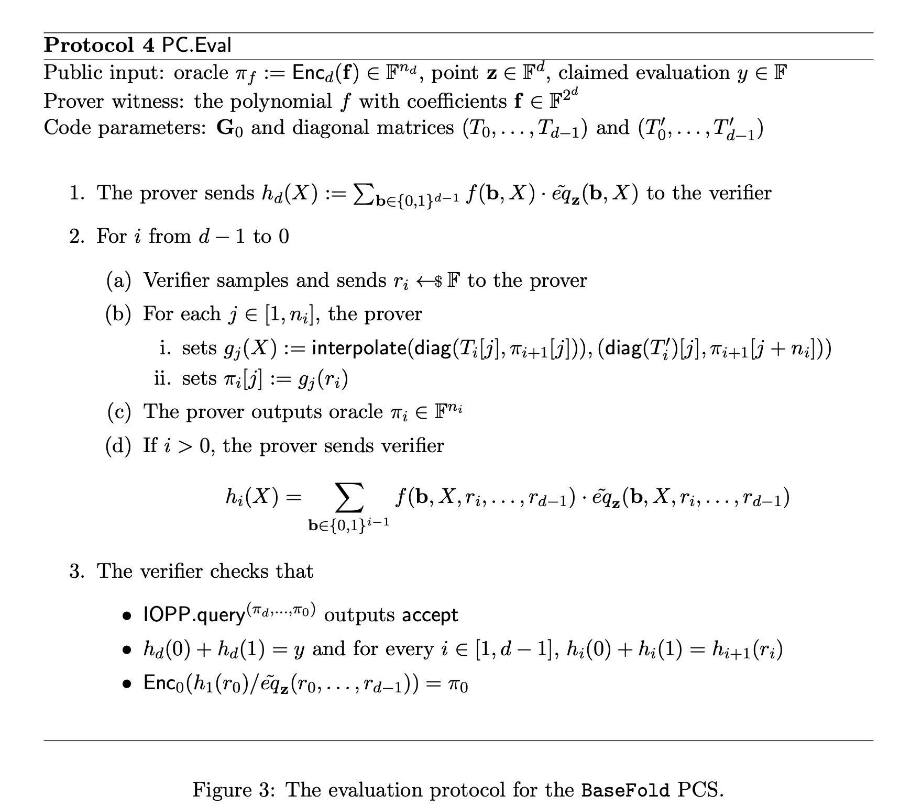
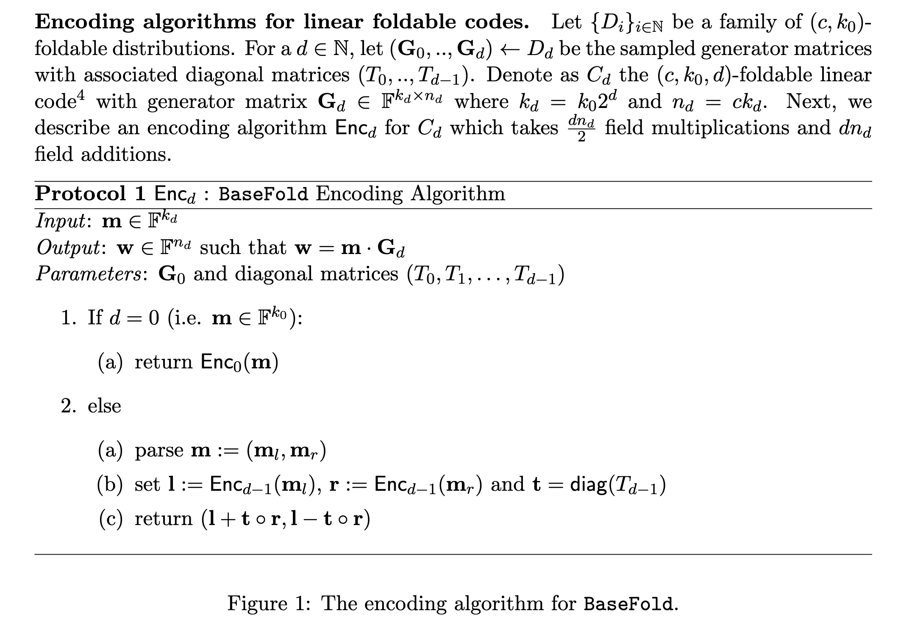
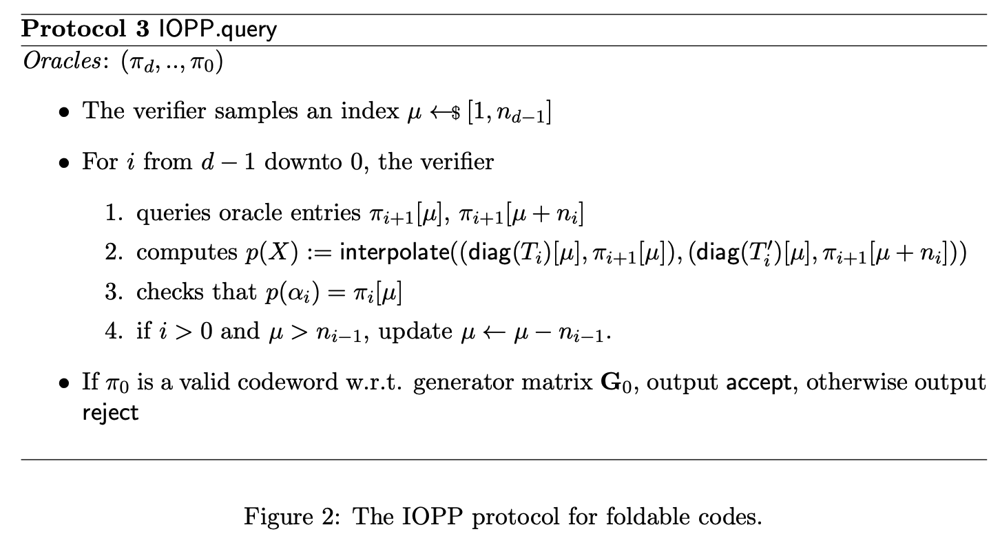

# Basefold 协议算法复杂度分析

- Jade Xie <jade@secbit.io>
- Yu Guo <yu.guo@secbit.io>

## 协议

下面复杂度的分析结合论文 [Basefold](https://eprint.iacr.org/2023/1705.pdf) Protocol 4， [Basefold Evaluation Argument Protocol Based on the Evaluation Form](https://github.com/sec-bit/mle-pcs/blob/main/basefold/basefold-03.md#basefold-evaluation-argument-protocol-based-on-the-evaluation-form) 协议描述以及代码实现 [Basefold.py](https://github.com/sec-bit/mle-pcs/blob/main/src/Basefold.py)。

论文中 evaluation 的协议描述如下：



## 参数

- 设 $N =2^d$

**公共输入**

1. $\tilde{f}$ 的 Commitment $\pi_d=\mathsf{Enc}_d(\mathbf{a})$ ，实际实现中会用 Merkle Tree 进行 commit，记为

$$
\pi_d=\mathsf{Enc}_d(\mathbf{a}) = \mathsf{MT.commit}(\mathsf{Enc}_d(\mathbf{a}))
$$

2. 求值点 $\mathbf{u}$
3. 运算值 $v=\tilde{f}(\mathbf{u})$
4. IOPP.query 阶段的重复查询次数 $l$
5. FRI 协议中的 blow up factor: $\mathcal{R}$

**Witness** 

- MLE  $\tilde{f}$ 的 Evaluation Form 向量 $\mathbf{a}=(a_0, a_1, \ldots, a_{N - 1})$ ，即 $a_i = \tilde{f}(\mathsf{bits}(i))$ ，

满足
$$
\tilde{f}(X_0, X_1, X_2, \ldots, X_{d - 1}) = \sum_{\mathbf{b}\in\{0,1\}^d} \tilde{f}(\mathbf{b})\cdot eq_{\mathbf{b}}(X_0, X_1, X_2, \ldots, X_{d - 1})
$$


对应代码实现中传入的参数为

```python
proof = prove_basefold_evaluation_arg_multilinear_basis(f_code=ff_code, f_evals=ff, us=point, v=eval, k=log_n - log_k0, k0=2**log_k0, T=T, blowup_factor=blowup_factor, commit=commit, num_verifier_queries=4, transcript=transcript, debug=False); proof
verify_basefold_evaluation_arg_multilinear_basis(len(ff_code), commit=commit, proof=proof, us=point, v=eval, d=2, k=log_n - log_k0, T=T, blowup_factor=blowup_factor, num_verifier_queries=4)
```

## Prover

### Encoding

输入：$\tilde{f}$ 的在 boolean hypercube 上的值， $\mathbf{a}=(a_0, a_1, \ldots, a_{N - 1})$ 。先将其编码成 foldable code，再用 basefold 的 eval 协议。



- 编码过程的计算复杂度为 $\frac{\mathcal{R}}{2} \cdot dN ~ \mathbb{F}_{\mathsf{mul}}$ 。

### Round 1

Prover 发送 $h^{(d)}(X)$ 的取值，$(h^{(d)}(0), h^{(d)}(1), h^{(d)}(2))$
$$
h^{(d)}(X) = \sum_{b_1,b_2, \ldots, b_d\in\{0,1\}^2}f(X, b_1, b_2, \ldots, b_d)\cdot \tilde{eq}((X, b_1, b_2, \ldots, b_d), \mathbf{u})
$$

#### Prover Cost Round 1

分析 Round 1 的算法复杂度：

1. 计算 $\vec{c} = \tilde{eq}_{\bf{u}}(\vec{b})$ ，其中 $\vec{b} = \{0,1\}^d$ ，也就是计算在 hypercube 上的取值，总共计算 $2^d$ 个值。

```python
eq = MLEPolynomial.eqs_over_hypercube(us)
```

该函数具体实现方法为

```python
@classmethod
def eqs_over_hypercube(cls, rs):
    k = len(rs)
    n = 1 << k
    evals = [1] * n
    half = 1
    for i in range(k):
        for j in range(half):
            evals[j+half] = evals[j] * rs[i]
            evals[j] = evals[j] - evals[j+half]
        half *= 2
    return evals
```

这里复杂度的具体分析与 ph23 中分析一致，直接借用分析结果，复杂度为 $(2^d - 1) ~ \mathbb{F}_{\mathsf{mul}}$ 。

2. Prover 计算 $h_d(X)$ 并发送给 Verifier。

由于 $h_d(X)$ 是一个 $2$ 次的多项式，因此计算 $h_d(0), h_d(1), h_d(2)$ 的值并发送给 Verifier 。

例如 $d = 3$ ，则

$$
\begin{split}
h^{(d)}(0) &= a_0\cdot e_0 + a_1\cdot e_1 + a_2\cdot e_2 + a_3\cdot e_3 \\
h^{(d)}(1) &= a_4\cdot e_4 + a_5\cdot e_5 + a_6\cdot e_6 + a_7\cdot e_7 \\
h^{(d)}(2) &= \sum_{i=0}^{3} (2\cdot a_{i+4} - a_i)\cdot (2\cdot e_{i+4} - e_i) \\
& = \sum_{i=0}^{3} (4 a_{i+4} \cdot e_{i+4}  + a_ie_i - 2 \cdot a_{i}e_{i + 4} - 2 a_{i+4}e_i)\\
& = 4 \cdot h^{(d)}(1) + h^d(0) - 2 \cdot \sum_{i=0}^{3} a_{i}e_{i + 4} - 2 \cdot \sum_{i=0}^{3} a_{i + 4}e_{i}
\end{split}
$$

```python
h_eval_at_0 = sum([f_low[j] * eq_low[j] for j in range(half)])
h_eval_at_1 = sum([f_high[j] * eq_high[j] for j in range(half)])
h_eval_at_2 = sum([ (2 * f_high[j] - f_low[j]) * (2 * eq_high[j] - eq_low[j]) for j in range(half)])
h_poly_vec.append([h_eval_at_0, h_eval_at_1, h_eval_at_2])
```

对于求 $h^{(d)}(X)$ ，进行分解要满足

$$
\begin{align}
 & 1 - X = a \cdot (1 - 1) + b \cdot (1 - 0)  \\
 & X = a \cdot 1 + b \cdot (1 - 0)
\end{align}
$$
得到

$$
a = X, \quad b = 1 - X
$$
因此对于 $X = 2$ ，有 $a = 2, b = -1$ ，因此

$$
\begin{align}
 & \tilde{eq}((u_0, u_1, u_2), (b_0, b_1, 2)) = 2 \times \tilde{eq}((u_0, u_1, u_2), (b_0, b_1, 1)) - \tilde{eq}((u_0, u_1, u_2), (b_0, b_1, 0))  \\
\end{align}
$$

一般通用公式为
$$
h^{(d)}(X) = \sum_{\mathbf{b} \in \{0,1\}^{d - 1}} (X \cdot f(\mathsf{b},1) + (1 - X) \cdot f(\mathsf{b}, 0)) \cdot  (X \cdot \tilde{eq}(\mathsf{b},1) + (1 - X) \cdot \tilde{eq}(\mathsf{b}, 0))
$$

- 计算 $h^{(d)}(0)$ 复杂度为 $2^{d - 1} ~ \mathbb{F}_{\mathsf{mul}}$
- 计算 $h^{(d)}(1)$ 复杂度为 $2^{d - 1} ~ \mathbb{F}_{\mathsf{mul}}$
- 计算 $h^{(d)}(2)$ 复杂度为 $(2 \cdot 2^{d - 1} + 3) ~ \mathbb{F}_{\mathsf{mul}}$

总计复杂度为：

$$
(4 \cdot 2^{d - 1} + 3)  ~ \mathbb{F}_{\mathsf{mul}} = (2N + 3)  ~ \mathbb{F}_{\mathsf{mul}}
$$

因此这一轮的总复杂度为

$$
(3N + 2)  ~ \mathbb{F}_{\mathsf{mul}}
$$

Prover 发送的有

$$
(h^{(d)}(0), h^{(d)}(1), h^{(d)}(2))
$$

### Round 2

对于 $i = d - 1, d - 2, \ldots, 1$ ，

1. Verifier 发送挑战数 $\alpha_i \stackrel{\$}{\leftarrow} \mathbb{F}_p$

2. Prover 同时进行 Basefold-IOPP 协议和 Sumcheck 协议：

- Prover 发送折叠后的向量编码： $\pi_i = \mathsf{fold}^*_{\alpha_i}(\pi_{i + 1})$ ，实际实现中，会发送对应的 Merkle Tree 承诺
$$
\mathsf{cm}(\pi_i) = \mathsf{cm}(\mathsf{fold}^*_{\alpha_i}(\pi_{i + 1})) = \mathsf{MT.commit}(\mathsf{fold}^*_{\alpha_i}(\pi_{i + 1}))
$$

- Prover 计算 $h^{(i)}(\alpha_i)$ 作为下一轮 Sumcheck 协议的求和值
- Prover 计算 $f^{(i)}(X_0, X_1, \ldots, X_{i - 1})$ 的 Evaluations 为 $\mathbf{a}^{(i)} = \mathsf{fold}^{*}_{\alpha_i}(\mathbf{a}^{(i + 1)})$
- Prover 计算并发送 $h^{(i)}(X)$

$$
h^{(i)}(X) = \sum_{\vec{b}\in\{0,1\}^{i - 1}}f(\vec{b}, X, \alpha_i, \alpha_{i + 1}, \ldots, \alpha_{d - 1})\cdot \tilde{eq}((\vec{b}, X, \alpha_i, \ldots, \alpha_{d-1}), \vec{u})
$$
等式右边同样是一个关于 $X$ 次数为 2 的 Univariate Polynomial，因此 Prover 可以根据 $\mathbf{a}^{(i)}$ 计算出 $h^{(i)}(X)$ 在 $X=0,1,2$ 处的取值： $(h^{(i)}(0), h^{(i)}(1), h^{(i)}(2))$ 。 

#### Prover Cost Round 2

下面分析上述流程的复杂度，对于第 $i$ 次

1. Prover 计算并发送 $\pi_i = \mathsf{fold}^*_{\alpha_i}(\pi_{i + 1})$

```python
f_code = basefold_fri_multilinear_basis(f_code, T[k-i-1], alpha, debug=debug)
```

```python
def basefold_fri_multilinear_basis(vs, table, c, debug=False):
    assert len(table) == len(vs)/2, "len(table) is not double len(vs), len(table) = %d, len(vs) = %d" % (len(table), len(vs))
    n = len(vs)
    half = int(n / 2)
    new_vs = []
    left = vs[:half]
    right = vs[half:]

    for i in range(0, half):
        if debug: print("(left[i] + right[i])/2=", (left[i] + right[i])/2)
        new_vs.append((1 - c) * (left[i] + right[i])/2 + (c) * (left[i] - right[i])/(2*table[i]))
    return new_vs
```

函数传入的参数 `f_code` 表示的就是 $\pi_i$ ，那么传入的 $\pi_i$ 的长度为 $2^i \cdot \mathcal{R}$ ，也记为 $n_i$ 。

`for i in range(0, half)` 总共循环 $n_i /2$ 次，在每一次循环中涉及到的有限域操作为
$$
2 ~ \mathbb{F}_{\mathsf{mul}} + \mathbb{F}_{\mathsf{inv}} + 3 ~ \mathbb{F}_{\mathsf{mul}} + \mathbb{F}_{\mathsf{inv}} = 5 ~ \mathbb{F}_{\mathsf{mul}} + 2~\mathbb{F}_{\mathsf{inv}}
$$
因此这个函数的整体计算复杂度为
$$
(5 \cdot \frac{n_i}{2}) ~ \mathbb{F}_{\mathsf{mul}} + (2 \cdot \frac{n_i}{2} )~\mathbb{F}_{\mathsf{inv}} = \frac{5n_i}{2} ~ \mathbb{F}_{\mathsf{mul}} + n_i~\mathbb{F}_{\mathsf{inv}}
$$
2. Prover 计算 $h^{(i)}(\alpha_i)$ 作为下一轮 Sumcheck 协议的求和值

```python
# compute the new sum = h(alpha)
sumcheck_sum = UniPolynomial.uni_eval_from_evals([h_eval_at_0, h_eval_at_1, h_eval_at_2], alpha, [Fp(0),Fp(1),Fp(2)])
```

```python
@classmethod
def uni_eval_from_evals(cls, evals, z, D):
    n = len(evals)
    if n != len(D):
        raise ValueError("Domain size should be equal to the length of evaluations")
    if z in D:
        return evals[D.index(z)]
    weights = cls.barycentric_weights(D)
    # print("weights={}".format(weights))
    e_vec = [weights[i] / (z - D[i]) for i in range(n)]
    numerator = sum([e_vec[i] * evals[i] for i in range(n)])
    denominator = sum([e_vec[i] for i in range(n)])
    return (numerator / denominator)
```

> [!note] 
>
> 这里的 $h^{(i)}(\alpha_i)$ 应该是 Verifier 自己进行计算，Prover 不需要进行计算。
>

3. Prover 计算 $f^{(i)}(X_0, X_1, \ldots, X_{i - 1})$ 的 Evaluations 为 $\mathbf{a}^{(i)} = \mathsf{fold}^{*}_{\alpha_i}(\mathbf{a}^{(i + 1)})$

```python
f = [(1 - alpha) * f_low[i] + alpha * f_high[i] for i in range(half)]
```

这里 `half` 长度为 $2^i$ ，因此复杂度为 
$$
2 \cdot 2^{i} ~ \mathbb{F}_{\mathsf{mul}} = 2^{i + 1} ~ \mathbb{F}_{\mathsf{mul}}
$$

4. Prover 计算并发送 $h^{(i)}(X)$

$$
h^{(i)}(X) = \sum_{\vec{b}\in\{0,1\}^{i - 1}}f(\vec{b}, X, \alpha_i, \alpha_{i + 1}, \ldots, \alpha_{d - 1})\cdot \tilde{eq}((\vec{b}, X, \alpha_i, \ldots, \alpha_{d-1}), \vec{u})
$$

等式右边同样是一个关于 $X$ 次数为 2 的 Univariate Polynomial，因此 Prover 可以根据 $\mathbf{a}^{(i)}$ 计算出 $h^{(i)}(X)$ 在 $X=0,1,2$ 处的取值： $(h^{(i)}(0), h^{(i)}(1), h^{(i)}(2))$ 。 

```python
eq_low = eq[:half]
eq_high = eq[half:]

eq = [(1 - alpha) * eq_low[i] + alpha * eq_high[i] for i in range(half)]

h_eval_at_0 = sum([f_low[j] * eq_low[j] for j in range(half)])
h_eval_at_1 = sum([f_high[j] * eq_high[j] for j in range(half)])
h_eval_at_2 = sum([ (2 * f_high[j] - f_low[j]) * (2 * eq_high[j] - eq_low[j]) for j in range(half)])
h_poly_vec.append([h_eval_at_0, h_eval_at_1, h_eval_at_2])
```

- 计算 `eq = [(1 - alpha) * eq_low[i] + alpha * eq_high[i] for i in range(half)]` 的复杂度与前面计算 `f` 一样，复杂度为 $2^{i + 1} ~ \mathbb{F}_{\mathsf{mul}}$ 
- 计算 $(h^{(i)}(0), h^{(i)}(1), h^{(i)}(2))$ 复杂度的分析与前面分析 $h_d(X)$ 一样，这里直接套用结果，复杂度为

$$
(2 \cdot 2^{i} + 3) ~ \mathbb{F}_{\mathsf{mul}}
$$
因此这一步的复杂度为
$$
2^{i + 1} ~ \mathbb{F}_{\mathsf{mul}} + (4 \cdot 2^{i - 1} + 3)  ~ \mathbb{F}_{\mathsf{mul}} =(4 \cdot 2^{i} + 3) ~ \mathbb{F}_{\mathsf{mul}}
$$
将前面所有步骤的复杂度相加为
$$
\frac{5n_i}{2} ~ \mathbb{F}_{\mathsf{mul}} + n_i~\mathbb{F}_{\mathsf{inv}} + 2^{i + 1} ~ \mathbb{F}_{\mathsf{mul}} + (4 \cdot 2^i + 3)  ~ \mathbb{F}_{\mathsf{mul}} = (\frac{5n_i}{2} + 6 \cdot 2^{i} + 3) ~ \mathbb{F}_{\mathsf{mul}} +  n_i~\mathbb{F}_{\mathsf{inv}}
$$
代入 $n_i = 2^i \cdot \mathcal{R}$ ，复杂度为
$$
(\frac{5\cdot 2^i \cdot \mathcal{R}}{2} + 6 \cdot 2^{i} + 3) ~ \mathbb{F}_{\mathsf{mul}} + (2^i \cdot \mathcal{R})~\mathbb{F}_{\mathsf{inv}} = ((\frac{5}{2} \mathcal{R} + 6) \cdot 2^i + 3) ~ \mathbb{F}_{\mathsf{mul}} + (2^i \cdot \mathcal{R})~\mathbb{F}_{\mathsf{inv}}
$$

将所有 $i = d - 1, \ldots, 1$ 的复杂度相加，为

$$
\begin{align}
 & \sum_{i = 1}^{d - 1}((\frac{5}{2} \mathcal{R} + 6) \cdot 2^i + 3) ~ \mathbb{F}_{\mathsf{mul}} + (2^i \cdot \mathcal{R})~\mathbb{F}_{\mathsf{inv}} \\
 = & ((\frac{5}{2} \mathcal{R} + 6) (N - 2) + 3(d - 1)) ~ \mathbb{F}_{\mathsf{mul}} +  \mathcal{R}(N - 2)~\mathbb{F}_{\mathsf{inv}} \\
=  & ((\frac{5}{2} \mathcal{R} + 6) N + 3d - 5 \mathcal{R} - 15) ~ \mathbb{F}_{\mathsf{mul}} +  (\mathcal{R}N - 2 \mathcal{R})~\mathbb{F}_{\mathsf{inv}}
\end{align}
$$

补充增加关于 Merkle Tree 的计算，对于 $i = d - 1, \ldots, 1$ ， Prover 发送折叠后的向量编码： $\pi_i = \mathsf{fold}^*_{\alpha_i}(\pi_{i + 1})$ ，实际实现中，会发送对应的 Merkle Tree 承诺
$$
\mathsf{cm}(\pi_i) = \mathsf{cm}(\mathsf{fold}^*_{\alpha_i}(\pi_{i + 1})) = \mathsf{MT.commit}(\mathsf{fold}^*_{\alpha_i}(\pi_{i + 1}))
$$
这里 Merkle Tree 的叶子节点有 $2^i \cdot \mathcal{R}$ 个，记为 $\mathsf{MT.commit}(2^{i} \cdot \mathcal{R})$ ，总记为

$$
\sum_{i = 1}^{d - 1} \mathsf{MT.commit}(2^{i} \cdot \mathcal{R}) 
$$


### Round 3

1. Verifier 发送挑战数 $\alpha_0\leftarrow \mathbb{F}_p$
2. Prover 继续进行 Basefold-IOPP 协议：
   - Prover 发送折叠后的向量编码 $\pi_0 = \mathsf{fold}^*_{\alpha_0}(\pi_1)$ ，由于这一步最后 Verifier 会检查 $\pi_0$ 是否是合法的编码，因此这里会将所有的值发送给 Verifier，而不是其 Merkle 承诺。
   
#### Prover Cost Round 3

复杂度与前面分析 $\pi_i$ 是一致的，复杂度为

$$
\frac{5n_0}{2} ~ \mathbb{F}_{\mathsf{mul}} + n_0~\mathbb{F}_{\mathsf{inv}} = \frac{5 }{2}  \mathcal{R}~ \mathbb{F}_{\mathsf{mul}} + \mathcal{R} ~ \mathbb{F}_{\mathsf{inv}}
$$

### Round 4

这一轮是 Verifier 进行 IOPP.query ，主要是为了后面 verifier 来检查折叠的正确性。论文中的协议描述如下：



重复 $l$ 次：

1. Verifier 随机选取一个索引值 $\mu \stackrel{\$}{\leftarrow} [1, n_{d - 1}]$
2. 对于 $i = d - 1, \ldots, 0$ :
   - Prover 发送 $\pi_{i + 1}[\mu], \pi_{i + 1}[\mu + n_i]$ 以及  $\pi_{i + 1}[\mu]$ 对应的 Merkle Path。
   $$
    \{\pi_{i + 1}[\mu], \pi_{\pi_{i + 1}}(\mu)\} \leftarrow \mathsf{MT.open}(\pi_{i + 1}, \mu)
   $$
   - 如果 $i >0$ 并且 $\mu > n_{i - 1}$ ，Prover 计算新的 $\mu$ ，$\mu \leftarrow \mu - n_{i - 1}$

#### Prover Cost Round 4

由于这一轮 Prover 发送的都是之前已经计算过的值，因此没有额外的计算消耗。

### Prover Cost

将上面的计算复杂度相加，为

$$
\begin{aligned}
& (3N + 2)  ~ \mathbb{F}_{\mathsf{mul}} \\
& + ((\frac{5}{2} \mathcal{R} + 6) N + 3d - 5 \mathcal{R} - 15) ~ \mathbb{F}_{\mathsf{mul}} +  (\mathcal{R}N - 2 \mathcal{R})~\mathbb{F}_{\mathsf{inv}} \\
& + \frac{5 }{2}  \mathcal{R}~ \mathbb{F}_{\mathsf{mul}} + \mathcal{R} ~ \mathbb{F}_{\mathsf{inv}}\\
= & \left((\frac{5}{2} \mathcal{R} + 9) \cdot N + 3d - \frac{5}{2} \mathcal{R} - 13 \right) ~ \mathbb{F}_{\mathsf{mul}} + (\mathcal{R} \cdot N - \mathcal{R}) ~ \mathbb{F}_{\mathsf{inv}}
\end{aligned}
$$
加上关于 Merkle Tree 进行承诺的复杂度，为

$$
\begin{aligned}
\left((\frac{5}{2} \mathcal{R} + 9) \cdot N + 3d - \frac{5}{2} \mathcal{R} - 13 \right) ~ \mathbb{F}_{\mathsf{mul}} + (\mathcal{R} \cdot N - \mathcal{R}) ~ \mathbb{F}_{\mathsf{inv}} + \sum_{i = 1}^{d - 1} \mathsf{MT.commit}(2^{i} \cdot \mathcal{R}) 
\end{aligned}
$$

若加上 Prover 计算编码 $\pi_d$ 的算法复杂度，则总复杂度为

$$
\left(\frac{\mathcal{R}}{2} \cdot dN + (\frac{5}{2} \mathcal{R} + 9) \cdot N + 3d - \frac{5}{2} \mathcal{R} - 13 \right) ~ \mathbb{F}_{\mathsf{mul}} + (\mathcal{R} \cdot N - \mathcal{R}) ~ \mathbb{F}_{\mathsf{inv}} + \sum_{i = 1}^{d - 1} \mathsf{MT.commit}(2^{i} \cdot \mathcal{R}) 
$$

## Proof

Prover 发送的证明为

$$
\begin{aligned}
    \pi = & ((h^{(d)}(0), h^{(d)}(1), h^{(d)}(2)), \mathsf{cm}(\pi_{d - 1}), \mathsf{cm}(\pi_{d - 2}), \ldots, \mathsf{cm}(\pi_{1}),\\
    & \quad  h^{(d-1)}(0), h^{(d-1)}(1), h^{(d-1)}(2), \ldots, h^{(1)}(0), h^{(1)}(1), h^{(1)}(2), \pi_0 \\
    & \quad \{\pi_{d}[\mu^{(d)}], \pi_{d}[\mu^{(d)} + n_{d-1}], \pi_{\pi_{d}}(\mu^{(d)}), \ldots, \pi_{1}[\mu^{(1)}], \pi_{1}[\mu^{(1)} + n_{0}], \pi_{\pi_{1}}(\mu^{(1)}) \}^l ) 
\end{aligned}
$$

在上面的表示中，$\mu^{(d)}, \ldots, \mu^{(1)}$ 表示的是在 IOPP.query 阶段的随机指标，其更新计算过程如 Prover Round 4 中的描述。$\{ \cdot \}^l$ 表示重复 $l$ 轮，每次其中的证明可能不同。

#### Proof size

- $\mathsf{cm}(\pi_{i})$ 这种表示的是 Merkle Tree 承诺，实际是 Merkle Tree 的根节点，为一个哈希值，用 $H$ 表示。
- $\pi_{\pi_{i}}(\mu^{(i)})$ 表示的是 Merkle Tree 的路径，这棵树的高度是 $\log n_i$ ，因此 Merkle Path 中会发送 $\log n_i$ 个哈希值，记为 $\log n_i ~ H$ 。

Proof 大小为

$$
\begin{aligned}
    & \quad 3 ~ \mathbb{F} + d ~ H + (3 \cdot (d - 1))~ \mathbb{F} + n_0 ~ \mathbb{F} + l \cdot (2d ~ \mathbb{F} + (\log n_d + \ldots + \log n_1) ~ H) \\
    & = (3d + \mathcal{R} + 2dl) ~ \mathbb{F} +  d ~ H + l (d + \log \mathcal{R} + \ldots + 1 + \log \mathcal{R}) ~ H \\
    & = (3d + \mathcal{R} + 2dl) ~ \mathbb{F} + \left(d + l  \cdot \left(\frac{d (d + 1)}{2} + d \cdot \log \mathcal{R} \right) \right) ~ H \\
	& = ((2l + 3)d + \mathcal{R}) ~ \mathbb{F} + \left( \frac{l}{2} \cdot d^2 + \left(\log \mathcal{R} \cdot l +\frac{1}{2} \cdot l + 1\right) \cdot d \right) ~ H 
\end{aligned}
$$

> [!note] 
>代码中发送了每次的编码 $\pi_i$ ，实际上并不需要。代码中发送了每次求得的编码，$\pi_0, \pi_1, \ldots, \pi_d$ ，实际只用发送要进行 IOPP.query 处对应的值，以及这些编码的承诺。

## Verification

Verifier 验证下面的等式：

1. Verifier 发送若干轮的 Query, $Q=\{q_i\}$

2. Verifier 检验 Sumcheck 的每一步折叠的正确性，

   - 验证
     $$
     h^{(d)}(0) + h^{(d)}(1) \overset{?}{=} v
     $$
     
- 对于 $i = 1, \ldots, d - 1$ ，验证
$$
\begin{split}
h^{(i)}(0) + h^{(i)}(1) &\overset{?}{=} h^{(i+1)}(\alpha_i) \\
\end{split}
$$
3. Verifier 验证最后的编码 $\pi_0$ 是否正确

$$
\pi_0 \overset{?}{=} \mathsf{enc}_0\left(\frac{h^{(1)}(\alpha_0)}{\tilde{eq}((\alpha_0,\ldots,\alpha_{d-1}), \mathbf{u})}\right)
$$

#### Verifier Cost Analysis

下面分析 verification 阶段的算法复杂度。

1. Verifier 进行 IOPP.query 的验证，重复 $l$ 次：

对于 $i = d- 1,\ldots, 0$ ，Verifier 验证折叠的正确性：

- 先验证发送的 $\pi_{i + 1}[\mu]$ 的正确性

$$
\mathsf{MT.verify}(\mathsf{cm}(\pi_{i + 1}), \pi_{i + 1}[\mu], \pi_{\pi_{i + 1}}(\mu)) \stackrel{?}{=} 1
$$

这里的复杂度记为 $\mathsf{MTV}(\log n_{i+1})$ ，括号里的参数表示 Merkle Tree 的高度，这里的计算消耗主要是计算哈希值，一棵树的高度是多少，Verifier 就需要计算多少的哈希值，这里记为 $\log n_{i+1} ~ H$ 。

- Verifier 计算折叠之后的值

$$
\mathsf{fold} = (1 - \alpha) \cdot \frac{\pi_{i + 1}[\mu] + \pi_{i + 1}[\mu + n_i]}{2} + \alpha \cdot \frac{\pi_{i + 1}[\mu] - \pi_{i + 1}[\mu + n_i]}{2 \cdot x[\mu]}
$$

```python
assert f_code_folded == ((1 - alpha) * (code_left + code_right)/2 + (alpha) * (code_left - code_right)/(2*table[x0])), "failed to check multilinear base fri"
```

这里计算的复杂度为
$$
5 ~ \mathbb{F}_{\mathsf{mul}} + 2~\mathbb{F}_{\mathsf{inv}}
$$

- Verifier 拿到自己计算的折叠后的值与 Prover 发送的值进行比较

$$
\mathsf{fold} \stackrel{?}{=} \pi_{i}[\mu]
$$

- Verifier 最后还会对 $\pi_0$ 进行验证，验证是否是合法的编码，对于 RS 编码来说，就是验证 $\pi_0$ 是一个常数多项式对应的编码，验证每个值都相等。

```python
# check the final code
final_code = f_code_vec[i]
assert len(final_code) == blowup_factor, "len(final_code) != blowup_factor, len(final_code) = %d, blowup_factor = %d" % (len(final_code), blowup_factor)
for i in range(len(final_code)):
    assert final_code[0] == final_code[i], "final_code is not a repetition code"
```

汇总这一步进行 IOPP.query 的复杂度为
$$
l \cdot \sum_{i = 1}^{d}\mathsf{MTV}(\log n_{i}) + 5dl ~ \mathbb{F}_{\mathsf{mul}} + 2dl~\mathbb{F}_{\mathsf{inv}} = l \cdot\sum_{i = 1}^{d}\mathsf{MTV}(i + \log \mathcal{R}) + 5dl ~ \mathbb{F}_{\mathsf{mul}} + 2dl~\mathbb{F}_{\mathsf{inv}}
$$

2. Verifier 检验 Sumcheck 的每一步折叠的正确性，这一步的计算复杂度来自 Verifier 需要自己计算 $h^{(i+1)}(\alpha_i)$ ，对于 $i = 1, \ldots, d - 1$，

```python
sumcheck_sum = UniPolynomial.uni_eval_from_evals(h_evals, alpha, [Fp(0),Fp(1),Fp(2)])
```

```python
@classmethod
def uni_eval_from_evals(cls, evals, z, D):
    n = len(evals)
    if n != len(D):
        raise ValueError("Domain size should be equal to the length of evaluations")
    if z in D:
        return evals[D.index(z)]
    weights = cls.barycentric_weights(D)
    # print("weights={}".format(weights))
    e_vec = [weights[i] / (z - D[i]) for i in range(n)]
    numerator = sum([e_vec[i] * evals[i] for i in range(n)])
    denominator = sum([e_vec[i] for i in range(n)])
    return (numerator / denominator)
```

这里是用重心插值来计算得到 $h^{(i+1)}(\alpha_i)$ 的值。

$$
h(\alpha) = \frac{\sum \frac{\omega_i \cdot y_i}{\alpha - x_i}}{\sum \frac{\omega_i}{\alpha - x_i}}
$$

其中 $y_i = h(x_i)$ ，$\omega_i$ 是重心插值权重，可以通过预计算得到，

$$
\omega_i = \frac{1}{\prod_{j = 1, j \neq i}^n (x_i - x_j)}
$$

如果 $|D| = n$ ，那么这里计算复杂度为

$$
(2n + 3) ~ \mathbb{F}_{\mathsf{mul}} + (n + 2) ~ \mathbb{F}_{\mathsf{inv}}
$$

该结论具体来自 ph23-analysis 分析，在验证过程的第一步，分析方法类似。

在计算 $h^{(i+1)}(\alpha_i)$  时，已知的有 $h^{(i+1)}(0),h^{(i+1)}(1),h^{(i+1)}(2)$ ， 在上面的计算式中代入 $n = 3$ ，因此这里计算 $h^{(i+1)}(\alpha_i)$ 的复杂度为

$$
9 ~ \mathbb{F}_{\mathsf{mul}} + 5 ~ \mathbb{F}_{\mathsf{inv}}
$$

这里 $i = 1, \ldots, d - 1$ ，总共有 $d - 1$ 次，因此总复杂度为

$$
9(d - 1) ~ \mathbb{F}_{\mathsf{mul}} + 5(d - 1) ~ \mathbb{F}_{\mathsf{inv}}
$$

3. Verifier 验证最后的编码 $\pi_0$ 是否正确

$$
\pi_0 \overset{?}{=} \mathsf{enc}_0\left(\frac{h^{(1)}(\alpha_0)}{\tilde{eq}((\alpha_0,\ldots,\alpha_{d-1}), \mathbf{u})}\right)
$$

- 计算 $\tilde{eq}((\alpha_0,\ldots,\alpha_{d-1}), \mathbf{u})$ ，

$$
\tilde{eq}((\alpha_0,\ldots,\alpha_{d-1}), \mathbf{u}) = \prod_{i = 0}^{d- 1} \big( (1 - \alpha_i)(1 - u_i) + \alpha_i u_i\big)
$$
每一项 $(1 - \alpha_i)(1 - u_i) + \alpha_i u_i$ 计算量是 $2 ~\mathbb{F}_{\mathsf{mul}}$ ，计算这 $d$  项的复杂度为 $2d ~\mathbb{F}_{\mathsf{mul}}$  ，最后有 $d$ 个数相乘，总复杂度为 

$$
2d ~\mathbb{F}_{\mathsf{mul}} + (d - 1) ~\mathbb{F}_{\mathsf{mul}} = (3d - 1) ~\mathbb{F}_{\mathsf{mul}} 
$$

> [!bug] 
> 代码中 Verifier 计算 $\tilde{eq}((\alpha_0,\ldots,\alpha_{d-1}), \mathbf{u})$ 的方式可以进行更改。
> ```python
> eq_evals = MLEPolynomial.eqs_over_hypercube(us)
> for i in range(k):
 >  alpha = challenge_vec[i]
 >  eq_low = eq_evals[:half]
 >  eq_high = eq_evals[half:]
 >  if debug: print("eq_low={}, eq_high={}".format(eq_low, eq_high))
 >  eq_evals = [(1-alpha) * eq_low[i] + alpha * eq_high[i] for i in range(half)]
 >
> # check f(alpha_vec)
> f_eval_at_random = sumcheck_sum/eq_evals[0]
> ```
> 这种计算方式的复杂度为 $O(N)$
> 
> 可以改为使用连乘的计算方式，复杂度为 $O(d)$ 。
> 
> ```python
> # use another way to compute eq_evals[0]
> challenge_vec_test = challenge_vec[::-1]
> print(f"challenge_vec_test = {challenge_vec_test}")
> 
> eq_evals_test = 1
> for i in range(k):
> 	eq_evals_test *= (1 - challenge_vec_test[i]) * (1 - us[i]) + challenge_vec_test[i] * us[i]
> print(f"eq_evals_test = {eq_evals_test}")
> ```

- Verifier 自己计算 $h^{(1)}(\alpha_0)$

复杂度分析与上面类似，为
 
$$
9 ~ \mathbb{F}_{\mathsf{mul}} + 5 ~ \mathbb{F}_{\mathsf{inv}}
$$

- 计算 $\frac{h^{(1)}(\alpha_0)}{\tilde{eq}((\alpha_0,\ldots,\alpha_{d-1}), \mathbf{u})}$ ，涉及有限域中的求逆和相乘操作，复杂度为 $\mathbb{F}_{\mathsf{mul}} + \mathbb{F}_{\mathsf{inv}}$ 。

- 计算编码 

$$
\mathsf{enc}_0\left(\frac{h^{(1)}(\alpha_0)}{\tilde{eq}((\alpha_0,\ldots,\alpha_{d-1}), \mathbf{u})}\right)
$$

```python
# check f(alpha_vec)
f_eval_at_random = sumcheck_sum/eq_evals[0]
if debug: print("f_eval_at_random={}".format(f_eval_at_random))
if debug: print("rs_encode([f_eval_at_random], k0=1, c=blowup_factor)=", rs_encode([f_eval_at_random], k0=1, c=blowup_factor))
assert rs_encode([f_eval_at_random], k0=1, c=blowup_factor) == f_code_folded, "❌: Encode(f(rs)) != f_code_0"
```

其实这里已经是常数多项式了，因此编码后也是 $\mathcal{R}$ 个常数，不涉及 Verifier 的计算消耗。

### Verifier Cost

汇总 verifier 的计算量为

$$
\begin{aligned}
    & l \cdot\sum_{i = 1}^{d}\mathsf{MTV}(i + \log \mathcal{R}) + 5dl ~ \mathbb{F}_{\mathsf{mul}} + 2dl~\mathbb{F}_{\mathsf{inv}} \\ 
    & \quad + 9(d - 1) ~ \mathbb{F}_{\mathsf{mul}} + 5(d - 1) ~ \mathbb{F}_{\mathsf{inv}} \\
    & \quad + (3 d - 1) ~ \mathbb{F}_{\mathsf{mul}} + 9 ~ \mathbb{F}_{\mathsf{mul}} + 5 ~ \mathbb{F}_{\mathsf{inv}} + \mathbb{F}_{\mathsf{mul}} + \mathbb{F}_{\mathsf{inv}} \\
    = & l \cdot\sum_{i = 1}^{d}\mathsf{MTV}(i + \log \mathcal{R}) + (5dl + 12d) ~ \mathbb{F}_{\mathsf{mul}} + (2dl + 5d + 1) ~ \mathbb{F}_{\mathsf{inv}} \\
    = & l \cdot\sum_{i = 1}^{d}(i + \log \mathcal{R}) ~ H + (5dl + 12d) ~ \mathbb{F}_{\mathsf{mul}} + (2dl + 5d + 1) ~ \mathbb{F}_{\mathsf{inv}} \\
    = &  l  \cdot \left(\frac{d (d + 1)}{2} + d \cdot \log \mathcal{R} \right)  ~ H + (5dl + 12d) ~ \mathbb{F}_{\mathsf{mul}} + (2dl + 5d + 1) ~ \mathbb{F}_{\mathsf{inv}} \\
	= & \left( \frac{l}{2} \cdot d^2 + (l\log \mathcal{R} + \frac{l}{2})d \right)  ~ H + (5l + 12)d ~ \mathbb{F}_{\mathsf{mul}} + ((2l + 5)d + 1) ~ \mathbb{F}_{\mathsf{inv}}
\end{aligned}
$$

## 汇总

Prover's cost:

$$
\begin{aligned}
\left((\frac{5}{2} \mathcal{R} + 9) \cdot N + 3d - \frac{5}{2} \mathcal{R} - 13 \right) ~ \mathbb{F}_{\mathsf{mul}} + (\mathcal{R} \cdot N - \mathcal{R}) ~ \mathbb{F}_{\mathsf{inv}} + \sum_{i = 1}^{d - 1} \mathsf{MT.commit}(2^{i} \cdot \mathcal{R}) 
\end{aligned}
$$

若加上 Prover 计算编码 $\pi_d$ 的算法复杂度，则总复杂度为

$$
\left(\frac{\mathcal{R}}{2} \cdot dN + (\frac{5}{2} \mathcal{R} + 9) \cdot N + 3d - \frac{5}{2} \mathcal{R} - 13 \right) ~ \mathbb{F}_{\mathsf{mul}} + (\mathcal{R} \cdot N - \mathcal{R}) ~ \mathbb{F}_{\mathsf{inv}} + \sum_{i = 1}^{d - 1} \mathsf{MT.commit}(2^{i} \cdot \mathcal{R}) 
$$

Proof size:

$$
\begin{align}
((2l + 3)d + \mathcal{R}) ~ \mathbb{F} + \left( \frac{l}{2} \cdot d^2 + \left(\log \mathcal{R} \cdot l +\frac{1}{2} \cdot l + 1\right) \cdot d \right) ~ H 
\end{align}
$$

Verifier's cost:

$$
\begin{align}
\left( \frac{l}{2} \cdot d^2 + (l\log \mathcal{R} + \frac{l}{2})d \right)  ~ H + (5l + 12)d ~ \mathbb{F}_{\mathsf{mul}} + ((2l + 5)d + 1) ~ \mathbb{F}_{\mathsf{inv}}
\end{align}
$$

