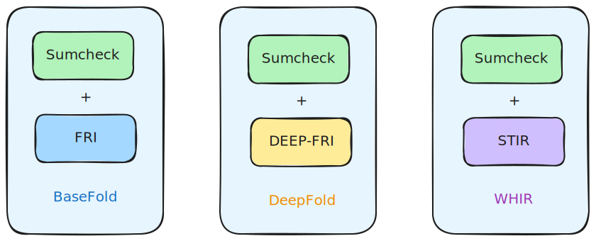
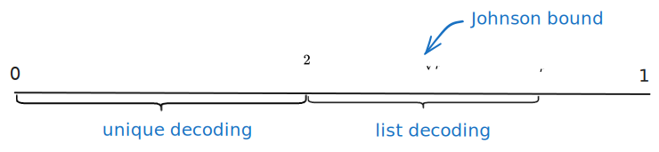

# BaseFold vs DeepFold vs WHIR

- Jade Xie <jade@secbit.io>
- Yu Guo <yu.guo@secbit.io>

This article introduces and compares three similar multilinear polynomial commitment schemes (PCS): BaseFold [ZCF23], DeepFold [GLHQTZ24], and WHIR [ACFY24b].

The FRI [BBHR18] protocol is an Interactive Oracle Proof of Proximity (IOPP) protocol used to determine if a univariate polynomial is close to a predefined Reed-Solomon code space, which can be used to perform a low degree test on a polynomial. The FRI protocol naturally supports univariate polynomials rather than multilinear polynomials, so constructing an efficient multilinear polynomial commitment scheme based on the FRI protocol is not easy. The Basefold protocol achieves this by utilizing the sumcheck protocol.

For a univariate polynomial, applying the FRI protocol is essentially a process of repeatedly folding the polynomial using random numbers until it is folded into a constant. The Basefold protocol cleverly discovered that this constant corresponds to the value of a multilinear polynomial at a random point. The last step of the Sumcheck protocol also requires an Oracle to obtain the value of a multilinear polynomial at a random point. If the FRI protocol and sumcheck protocol are performed synchronously, using the same random numbers during the protocol process, then the constant from the last step of the FRI protocol can naturally serve as the oracle function in the last step of the sumcheck protocol to complete the entire sumcheck protocol. The overall approach of the Basefold protocol is very concise and clever, combining sumcheck and FRI protocols to construct an efficient multilinear polynomial commitment scheme. The Basefold protocol actually applies not only to Reed-Solomon codes but to all codes that satisfy the definition of foldable code. In this article, for ease of comparison between these three protocols, we only consider Reed-Solomon codes.

The DeepFold protocol improves upon the Basefold protocol by replacing the FRI protocol in Basefold with the DEEP-FRI [BGKS20] protocol. Compared to the FRI protocol, the DEEP-FRI protocol sacrifices a small amount of Prover's computation to reduce the number of Verifier's queries, thereby reducing the overall proof size and Verifier's computational cost.

The WHIR protocol goes a step further than the DeepFold protocol, replacing the FRI protocol in the Basefold protocol with the STIR [ACFY24a] protocol. Compared to the FRI and DEEP-FRI protocols, the STIR protocol requires fewer queries from the Verifier. Its idea is to reduce the code rate in each round of the protocol, thus increasing redundancy in the encoding. This allows the Verifier to have more information to determine whether the received message belongs to a code space, thereby reducing the number of queries.

In summary, the overall framework of the three protocols is shown in the following diagram.

## From Multilinear Polynomials to Univariate Polynomials

Before introducing these three multilinear polynomial commitment schemes in detail, let's first discuss the correspondence between a multilinear polynomial and a univariate polynomial. Only after establishing this correspondence can we boldly invoke the FRI, DEEP-FRI, and STIR protocols that are only applicable to univariate polynomials.

For an n-variable linear polynomial $\tilde{f}(X_0, \ldots, X_{n-1})$, expressed in coefficient form as:

$$
\tilde{f}(X_0,\ldots,X_{n-1}) = a_0 + a_1 X_0 + a_2 X_1 + a_3 X_0X_1 + \ldots + a_{2^n - 1} \cdot X_0X_1 \cdots X_{n-1}
$$

where the basis of the multilinear polynomial $(1, X_0, X_1, X_0X_1, \ldots, X_0X_1\cdots X_{n-1})$ is arranged in lexicographic order.

By directly corresponding the coefficients of the multilinear polynomial to the coefficients of a univariate polynomial, the univariate polynomial corresponding to $\tilde{f}(X_0, \ldots, X_{n-1})$ is:

$$
f(X) = a_0 + a_1 X + a_2 X^2 + a_3 X^3 + \ldots + a_{2^n - 1} X^{2^n - 1}
$$

If we let $X_0 = X^{2^0}, X_1 = X^{2^1}, \ldots , X_{n-1} = X^{2^{n - 1}}$ in the multilinear polynomial $\tilde{f}(X_0, \ldots, X_{n-1})$, we can find:

$$
\begin{align}
\tilde{f}(X^{2^0},X^{2^1},\ldots,X^{2^{n-1}})  & = a_0 + a_1 \cdot X + a_2 \cdot X^2 + a_3 \cdot X \cdot X^2 + \ldots + a_{2^n - 1} \cdot X^{2^0} \cdot X^{2^1} \cdot X^{2^{n - 1}} \\
 & = a_0 + a_1 X + a_2 X^2 + a_3 X^3 + \ldots + a_{2^n - 1} X^{2^n - 1} \\
 & = f(X)
\end{align}
$$

The above equation $\tilde{f}(X^{2^0},X^{2^1},\ldots,X^{2^{n-1}}) = f(X)$ profoundly reveals the intrinsic connection between multilinear polynomials and univariate polynomials. This can also be seen as a conversion relationship between the basis of multilinear polynomials $(1, X_0, X_1, \ldots , X_0X_1\cdots X_{n-1})$ and the basis of univariate polynomials $(1, X, X^2, X^3, \ldots , X^{2^{n} - 1})$. After establishing such a relationship, univariate polynomials and multilinear polynomials can be freely converted, essentially just differing in their basis.

For example, to find the value of a univariate polynomial $f(X)$ at a point $\alpha$, $f(\alpha)$, it is equal to $\tilde{f}(\alpha, \alpha^2, \alpha^4, \ldots, \alpha^{2^n - 1})$.

Now let's look at the folding process in the FRI protocol applicable to univariate polynomials. First, split $f(X)$ into odd and even terms:

$$
\begin{align}
f(X)  & = a_0 + a_1 X + a_2 X^2 + a_3 X^3 +  \ldots + a_{2^n - 1} X^{2^n - 1} \\
 & = (a_0 + a_2 X^2 + \ldots + a_{2^{n}-2}X^{2^n - 2}) + X \cdot (a_1 + a_3 X^2 + \ldots + a_{2^n - 1} X^{2^n - 2}) \\
 & := f_{even}(X^2) + X \cdot f_{odd}(X^2)
\end{align}
$$

At this point, the degree bounds of $f_{even}(X)$ and $f_{odd}(X)$ are $2^{n - 1}$, which is already half of the original polynomial $f(X)$'s degree bound $2^n$. Use a random number $\alpha_1$ to fold these two polynomials together:

$$
\begin{align}
f^{(1)}(X)  & = f_{even}(X) + \alpha_1 \cdot f_{odd}(X) \\
 & = (a_0 + a_2 X + \ldots + a_{2^{n}-2}X^{2^{n - 1} - 1}) + \alpha_1 \cdot (a_1 + a_3 X + \ldots + a_{2^n - 1} X^{2^{n - 1} - 1}) 
\end{align}
$$

Now let's look at this folding process from the perspective of multilinear polynomials. The process of splitting $f(X)$ into odd and even terms is equivalent to factoring out the $X$ term, which corresponds to factoring out terms containing $X_0$ in the multilinear polynomial:

$$
\begin{align}
f(X)   & = \tilde{f}(X^{2^0},X^{2^1},\ldots,X^{2^{n-1}})   \\
 & = \tilde{f}(X_0,\ldots,X_{n-1})  \\
 & = a_0 + a_1 X_0 + a_2 X_1 + \ldots + a_{2^n - 1} X_0X_1\cdots X_{n-1} \\
& = (a_0 + a_2 X_1 + \ldots + a_{2^{n}-2}X_1X_2\cdots X_{n-1}) + X_0 \cdot (a_1 + a_3 X_1 + \ldots + a_{2^n - 1} X_1X_2\cdots X_{n-1}) \\
 & := \tilde{f}_{even}(X_1,\ldots,X_{n-1}) + X_0 \cdot \tilde{f}_{odd}(X_1, \ldots, X_{n-1})
\end{align}
$$

At this point, $\tilde{f}_{even}(X_1, \ldots, X_{n-1})$ and $\tilde{f}_{odd}(X_1, \ldots, X_{n-1})$ have one fewer variable, only $n - 1$. Using the random number $\alpha_1$ to fold the multilinear polynomial corresponds to:

$$
\begin{align}
f^{(1)}(X)  & = f_{even}(X) + \alpha_1 \cdot f_{odd}(X) \\
 & = \tilde{f}_{even}(X_0,\ldots,X_{n-2}) + \alpha_1 \cdot \tilde{f}_{odd}(X_0, \ldots, X_{n-2}) \\
 & = \tilde{f}(\alpha_1, X_0, X_1, \ldots, X_{n - 2})
\end{align}
$$

Then the multilinear polynomial $\tilde{f}^{(1)}(X_0, X_1, \ldots, X_{n- 2})$ corresponding to the folded univariate polynomial $f^{(1)}(X)$ satisfies:

$$
\tilde{f}^{(1)}(X_0, X_1, \ldots, X_{n- 2}) = \tilde{f}(\alpha_1, X_0, X_1, \ldots, X_{n - 2})
$$

The above equation shows that the process of folding a univariate polynomial corresponds to folding a multilinear polynomial using the same random number. The result is equivalent to variable substitution on the original n-variable linear polynomial, replacing $(X_0, X_1, X_2, \ldots, X_{n - 1})$ with $(\alpha_1, X_0, X_1, \ldots, X_{n-2})$.

If we continue to fold $f^{(1)}(X)$ using the above method, folding with random number $\alpha_2$ to get $f^{(2)}(X)$, then its corresponding multilinear polynomial $\tilde{f}^{(2)}(X_0, X_1, \ldots, X_{n - 3})$ should satisfy:

$$
\tilde{f}^{(2)}(X_0, X_1, \ldots, X_{n- 3}) = \tilde{f}(\alpha_1, \alpha_2, X_0, \ldots, X_{n - 3})
$$

And so on. After $k$ folds, selecting $k$ random numbers $\vec{\alpha} = (\alpha_1, \ldots, \alpha_k)$, the folded polynomial $f^{(k)}(X)$ corresponds to a multilinear polynomial satisfying:

$$
\tilde{f}^{(k)}(X_0, X_1, \ldots, X_{n- k - 1}) = \tilde{f}(\alpha_1, \alpha_2, \ldots, \alpha_k, X_0, \ldots, X_{n - k - 1})
$$

Since the folding of univariate polynomials in the FRI protocol implies a similar folding of multilinear polynomials, the Reed-Solomon code space of univariate polynomials applicable to the FRI protocol can also be viewed from the perspective of multilinear polynomials. According to the description in the WHIR paper [ACFY24b], for the code space $\mathsf{RS}[\mathbb{F}, \mathcal{L}, n]$, it represents the set of evaluations on $\mathcal{L}$ of all univariate functions over finite field $\mathbb{F}$ with degree strictly less than $2^n$. Then:

$$
\begin{aligned}
    \mathrm{RS}[\mathbb{F}, \mathcal{L}, n] & := \{f: \mathcal{L} \rightarrow \mathbb{F}: \exists \hat{g} \in \mathbb{F}^{< 2^n}[X] \text{ s.t. } \forall x \in \mathcal{L}, f(x) = \hat{g}(x)\} \\
    & = \{f: \mathcal{L} \rightarrow \mathbb{F}: \exists \tilde{f} \in \mathbb{F}^{< 2}[X_0, \ldots, X_{n - 1}] \text{ s.t. } \forall x \in \mathcal{L}, f(x) = \tilde{f}(x^{2^0}, x^{2^1},\ldots, x^{2^{n-1}})\}
\end{aligned}
$$

To summarize, after establishing the coefficient correspondence between univariate linear polynomials and multilinear polynomials, they satisfy the equation $\tilde{f}(X^{2^0},X^{2^1},\ldots,X^{2^{n-1}}) = f(X)$, from which we can derive:

1. Evaluating a univariate polynomial $f(X)$ at a point $\alpha$: $f(\alpha) = \tilde{f}(\alpha, \alpha^2, \alpha^4, \ldots, \alpha^{2^n - 1})$.

2. After folding the univariate polynomial $f(X)$ $k$ times using random numbers $(\alpha_1, \ldots, \alpha_k)$, the multilinear polynomial corresponding to the folded polynomial $f^{(k)}(X)$ satisfies:

$$
\tilde{f}^{(k)}(X_0, X_1, \ldots, X_{n- k - 1}) = \tilde{f}(\alpha_1, \alpha_2, \ldots, \alpha_k, X_0, \ldots, X_{n - k - 1})
$$

3. The Reed-Solomon code space $\mathsf{RS}[\mathbb{F}, \mathcal{L}, n]$ can be viewed from both univariate polynomial and multilinear polynomial perspectives:

$$
\begin{aligned}
    \mathrm{RS}[\mathbb{F}, \mathcal{L}, n] & := \{f: \mathcal{L} \rightarrow \mathbb{F}: \exists \hat{g} \in \mathbb{F}^{< 2^n}[X] \text{ s.t. } \forall x \in \mathcal{L}, f(x) = \hat{g}(x)\} \\
    & = \{f: \mathcal{L} \rightarrow \mathbb{F}: \exists \tilde{f} \in \mathbb{F}^{< 2}[X_0, \ldots, X_{n - 1}] \text{ s.t. } \forall x \in \mathcal{L}, f(x) = \tilde{f}(x^{2^0}, x^{2^1},\ldots, x^{2^{n-1}})\}
\end{aligned}
$$

## Basefold: Leveraging Sumcheck

The Prover wants to prove to the Verifier that the value of an n-variable linear polynomial $\tilde{f}(X_0, \ldots, X_{n-1})$ at a public point $\vec{u} = (u_0, u_1, \ldots, u_{n - 1})$ is $v$, i.e.,

$$
\tilde{f}(u_0, u_1, \ldots, u_{n - 1}) = v \tag{1}
$$

For the multilinear polynomial $\tilde{f}(X_0, \ldots, X_{n-1})$, it can also be represented by its values on the boolean hypercube $\mathbf{B}^n = \{0,1\}^n$:

$$
\tilde{f}(X_0, \ldots, X_{n-1}) = \sum_{\vec{b} \in \{0,1\}^n} \tilde{f}(\vec{b}) \cdot \tilde{eq}(\vec{b}, (X_0, \ldots, X_{n-1}))
$$

where $\tilde{eq}(\vec{b}, (X_0, \ldots, X_{n-1}))$ is the Lagrange basis function. The vector $\vec{b}$ is represented as $\vec{b} = (b_0, \ldots, b_{n - 1})$, so:

$$
\tilde{eq}((b_0, \ldots , b_{n - 1}), (X_0, \ldots, X_{n-1})) = \prod_{i = 0}^{n - 1} (b_i X_i + (1 - b_i)(1 - X_i))
$$

Therefore,

$$
\tilde{f}(u_0, \ldots, u_{n-1}) = \sum_{\vec{b} \in \{0,1\}^n} \tilde{f}(\vec{b}) \cdot \tilde{eq}(\vec{b}, (u_0, \ldots, u_{n-1}))
$$

Proving $\tilde{f}(u_0, u_1, \ldots, u_{n - 1}) = v$ can be transformed into proving a sum over the boolean hypercube $\mathbf{B}^n = \{0,1\}^n$:

$$
\sum_{\vec{b} \in \{0,1\}^n} \tilde{f}(\vec{b}) \cdot \tilde{eq}(\vec{b}, (u_0, \ldots, u_{n-1})) = v \tag{2}
$$

This can be proven using the sumcheck protocol.

First, the Prover sends a univariate polynomial:

$$
h_{1}(X) = \sum_{\vec{b} \in \{0,1\}^{n - 1}} \tilde{f}(X,\vec{b}) \cdot \tilde{eq}((X,\vec{b}), (u_0, \ldots, u_{n-1}))
$$

$h_{1}(X)$ is obtained by replacing the first $b_{0}$ in $\vec{b} = (b_0, \ldots, b_{n - 1})$ from equation (2) with a variable $X$. Therefore, proving equation (2) is transformed into verifying $h_{1}(0) + h_{1}(1) = v$. To believe that the $h_{1}(X)$ sent by the Prover is correctly constructed, the Verifier selects a random number $\alpha_1$ and sends it to the Prover. The Prover calculates:

$$
h_{1}(\alpha_1) = \sum_{\vec{b} \in \{0,1\}^{n - 1}} \tilde{f}(\alpha_1, \vec{b}) \cdot \tilde{eq}((\alpha_1,\vec{b}), (u_0, \ldots, u_{n-1})) \tag{3}
$$

and sends $h_1(\alpha_1)$ to the Verifier. The Prover needs to prove the correctness of the sent $h_1(\alpha_1)$ to the Verifier, and equation (3) is again a sum over the boolean hypercube $\mathbf{B}^{n-1} = \{0,1\}^{n-1}$. Therefore, proving equation (2) is transformed into proving equation (3). Continuing this process, the Verifier selects random numbers $\alpha_2,\ldots, \alpha_n$ in sequence, and finally, it is transformed into proving:

$$
h_{n}(\alpha_{n}) =\tilde{f}(\alpha_1, \ldots, \alpha_n) \cdot \tilde{eq}((\alpha_1,\ldots, \alpha_n), (u_0, \ldots, u_{n-1}))
$$

At this point, the Verifier needs to obtain the value of $\tilde{f}(\alpha_1, \ldots, \alpha_n)$ to verify the above equation. If in the FRI protocol, the univariate polynomial $f(X)$ corresponding to $\tilde{f}(X_0, \ldots, X_{n-1})$ is folded using the same random numbers $(\alpha_1,\alpha_2,\ldots, \alpha_n)$ in sequence, then folding to the last step will result in a constant $f^{(n)}$. According to the relationship between multilinear polynomials and univariate polynomials obtained in the previous section, we know:

$$
f^{(n)} = \tilde{f}(\alpha_1, \ldots, \alpha_n)
$$

This is the idea of the Basefold protocol. It synchronously uses the same random numbers for the sumcheck protocol and the FRI protocol. The last step of the FRI protocol provides the value of $\tilde{f}(\alpha_1, \ldots, \alpha_n)$ that the last step of the sumcheck protocol wants to obtain. Therefore, it can complete the entire sumcheck protocol, thus proving the correctness of the opening value of a multilinear polynomial at a point, i.e., equation (1). For a more detailed description of the Basefold protocol, please refer to the [Basefold series blog posts](https://github.com/sec-bit/mle-pcs/tree/main/basefold). This article only describes the key protocol ideas.

## DeepFold: Introducing DEEP-FRI

Since the Basefold protocol in the original paper [ZCF23] only proved soundness under unique decoding, the idea of the DeepFold protocol is to improve this by introducing the DEEP-FRI protocol in the Basefold protocol and proving that it is also secure under list decoding. In the FRI, DEEP-FRI, and STIR protocols, the Verifier needs to repeatedly query the Prover to achieve a certain level of security. If a larger bound can be proved in the security proof, such as reaching from unique decoding to list decoding, then the number of Verifier queries can be greatly reduced, thereby reducing the proof size and Verifier's computational cost.

In each round of the FRI protocol, the Prover sends a Merkle commitment of the values of $f^{(i)}$ on a domain $\mathcal{L}_i$ to the Verifier, i.e., a commitment of the Reed-Solomon encoding of $f^{(i)}$, denoted as $\vec{v}^{(i)} = f^{(i)}|_{\mathcal{L}_i}$. After receiving the Merkle commitment of $\vec{v}_i$, the Verifier will judge whether it is close to the corresponding code space $\mathsf{RS}[\mathbb{F}, \mathcal{L}_i, 2^{n - i}]$. Now considering the case of list decoding, since the decoding is not unique, in the $i$-th round, $f^{(i)'}$ is also close to $\vec{v}^{(i)}$. A malicious Prover might choose $f^{(i)'}$ for subsequent protocols and still pass the subsequent checks of the FRI protocol, but the constant obtained in the last round of folding would become $f^{(n)'}$, which is not equal to $\tilde{f}(\vec{\alpha})$ and cannot provide a correct value in the last round check of the sumcheck protocol. The DEEP method in the DEEP-FRI [BGKS20] protocol limits the malicious Prover to only send the correct $f^{(i)}$ by making the Prover do a little more work, otherwise the Prover cannot pass subsequent checks. This converts list decoding to unique decoding.

The DEEP method is to randomly select a point $\beta_i$ from $\mathbb{F} \setminus \mathcal{L}_i$, requiring the Prover to provide the value of $f^{(i)}(\beta_i)$ and ensure that this value is indeed equal to $f^{(i)}(\beta_i)$. This limits the Prover to only choose to send $f^{(i)}$ rather than $f^{(i)'}$. The remaining problem now is to ensure the correctness of $f^{(i)}(\beta_i)$. The Verifier can require the Prover to also send $f^{(i)}(-\beta_i)$, so the Verifier can calculate $f^{(i + 1)}(\beta_i^2)$ by themselves using these two values. Through the conversion between multilinear polynomials and univariate polynomials, we know:

$$
f^{(i + 1)}(\beta_i^2) = \tilde{f}(\alpha_1, \alpha_2, \ldots, \alpha_{i + 1}, \beta_i^2, \beta_i^4, \ldots, \beta_i^{2^{n - i - 1}})
$$

Therefore, the Verifier can continue to have the Prover provide the value of $f^{(i+ 1)}(-\beta_i^2)$, and the Verifier calculates $f^{(i + 2)}(\beta_i^4)$ themselves. This continues until finally the Verifier can calculate $f^{(n)}(\beta_i^{2^{n-i-1}})$ themselves, which should equal:

$$
f^{(n)}(\beta_i^{2^{n-i-1}}) = \tilde{f}(\alpha_1, \alpha_2, \ldots, \alpha_{i + 1}, \ldots, \alpha_{n})
$$

This value is exactly the value of folding $f(X)$ to the last step in the FRI protocol. The Verifier can check whether the $f^{(n)}(\beta_i^{2^{n-i-1}})$ value they calculated is equal to the value from the last step of the FRI protocol, thus verifying the correctness of $f^{(i)}(\pm \beta_i)$.

To summarize the idea of the DeepFold protocol: DeepFold borrows the framework of the BaseFold protocol, replacing the FRI protocol with the DEEP-FRI protocol to reduce the number of Verifier queries. The DeepFold protocol still synchronously performs the sumcheck protocol and the DEEP-FRI protocol. When using the DEEP technique, in each round, the Verifier selects a random number $\beta_i$ from $\mathbb{F} \setminus \mathcal{L}_i$, and the Prover sends the following values to the Verifier:

$$
f^{(i)}(-\beta_i),f^{(i + 1)}(- \beta_i^2), \ldots, f^{(n - 1)}(-\beta_i^{2^{n - i - 2}})
$$

The Verifier calculates $f^{(n)}(\beta_i^{2^{n-i-1}})$ using these values to check if it equals the constant from the last step of FRI folding.

For a more detailed description of the DeepFold protocol, please refer to the blog post [DeepFold Notes: Protocol Overview](https://github.com/sec-bit/mle-pcs/blob/main/fri/deepfold.zh.md).

## WHIR: Introducing STIR

For the FRI series protocols (including FRI, DEEP-FRI), the number of Verifier queries affects the proof size and Verifier's computational cost. The STIR protocol [ACFY24a] is an improvement on the FRI series protocols. By reducing the code rate in each round, it increases redundancy in the encoding, thereby reducing the number of Verifier queries. It's worth noting that the STIR protocol needs to perform 2 or more folds per round to show its advantages, thus lowering the code rate per round. For a more detailed introduction to the STIR protocol, see the blog post [STIR: Improving Code Rate to Reduce Query Complexity](https://github.com/sec-bit/mle-pcs/blob/main/fri/stir.zh.md).

The WHIR protocol replaces the FRI protocol in the Basefold protocol framework with the STIR protocol, further reducing the number of Verifier queries. In the WHIR paper [ACFY24b], they introduced the concept of CRS (constrained Reed-Solomon code). CRS is actually a subcode of Reed-Solomon encoding. By introducing constraints similar to sumcheck in the CRS definition, the WHIR protocol becomes more general.

**Definition 1** [ACFY24b, Definition 1] For a field $\mathbb{F}$, smooth evaluation domain $\mathcal{L} \subseteq \mathbb{F}$, number of variables $n \in \mathbb{N}$, weight polynomial $\hat{w} \in \mathbb{F}[Z, X_1, \ldots, X_n]$, and target $\sigma \in \mathbb{F}$, the **constrained Reed-Solomon code** is defined as:

$$
\mathrm{CRS}[\mathbb{F}, \mathcal{L}, n, \hat{w}, \sigma] := \left\{ f \in \mathrm{RS}[\mathbb{F}, \mathcal{L}, n]: \sum_{\vec{b} \in \{0,1\}^n} \hat{w}(\tilde{f}(\vec{b}), \vec{b}) = \sigma \right\}.
$$

From the definition, we can see that CRS is first an RS code, i.e., $f \in \mathrm{RS}[\mathbb{F}, \mathcal{L}, n]$ in the definition, but on top of this, it needs to satisfy a sumcheck-like sum constraint $\sum_{\vec{b} \in \{0,1\}^n} \hat{w}(\tilde{f}(\vec{b}), \vec{b}) = \sigma$.

If we want to prove $\tilde{f}(u_0, u_1, \ldots, u_{n - 1}) = v$, let the target $\sigma = v$ in the CRS definition, and the weight polynomial be:

$$
\hat{w}(Z, \vec{X}) = Z \cdot \tilde{eq}(\vec{X}, \vec{u})
$$

Then the sumcheck-like constraint in the CRS definition becomes:

$$
\sum_{\vec{b} \in \{0,1\}^n} \hat{w}(\tilde{f}(\vec{b}), \vec{b}) = \sum_{\vec{b} \in \{0,1\}^n} \tilde{f}(\vec{b}) \cdot \tilde{eq}(\vec{b}, \vec{u}) = v
$$

And $\sum_{\vec{b} \in \{0,1\}^n} \tilde{f}(\vec{b}) \cdot \tilde{eq}(\vec{b}, \vec{u}) = \tilde{f}(u_0, u_1, \ldots, u_{n - 1})$, so the sumcheck-like constraint above is exactly $\tilde{f}(u_0, u_1, \ldots, u_{n - 1}) = v$. Therefore, the WHIR protocol for CRS can be used as a commitment scheme for multilinear polynomials.

The overall framework of the WHIR protocol is still the same as the Basefold protocol, synchronously using the same random numbers for the sumcheck protocol and the STIR protocol. Since the STIR protocol needs to perform 2 or more folds per round to be more advantageous than the FRI series protocols, in the following protocol description, $2^k$ folds are performed on the univariate polynomial in each round.

Let's look deeper into one iteration of the WHIR protocol (from [ACFYb, 2.1.3 WHIR protocol]) to see how WHIR specifically combines BaseFold with the STIR protocol. After one iteration, the problem of testing the proximity of $f \in \mathcal{C} := \mathrm{CRS}[\mathbb{F}, \mathcal{L}, n, \hat{w}, \sigma]$ is transformed into testing $f' \in \mathcal{C}' := \mathrm{CRS}[\mathbb{F}, \mathcal{L}^{(2)}, n - k, \hat{w}', \sigma']$, where the size of $\mathcal{L}^{(2)}$ is only half that of $\mathcal{L}$. Let the code rate of $\mathrm{CRS}[\mathbb{F}, \mathcal{L}, n, \hat{w}, \sigma]$ be $\rho$, then:

$$
\rho = \frac{2^n}{|\mathcal{L}|}
$$

After one iteration, the code rate of $\mathcal{C}' = \mathrm{CRS}[\mathbb{F}, \mathcal{L}^{(2)}, n - k, \hat{w}', \sigma']$ is:

$$
\rho' = \frac{2^{n - k}}{|\mathcal{L}^{(2)}|} = \frac{2^{n - k}}{\frac{|\mathcal{L}|}{2}} = \frac{2^{n - k + 1}}{|\mathcal{L}|} = 2^{1 - k} \cdot \rho = \left(\frac{1}{2}\right)^{k - 1} \cdot \rho
$$

When $k \ge 2$, we can see that $\rho'$ is smaller than $\rho$, the code rate decreases, which is the core idea of the STIR protocol. Although $f$ is folded $2^k$ times in one iteration, the evaluation domain $\mathcal{L}$ is only reduced by half each time, rather than shrinking by $2^k$ times. This way, by increasing the evaluation domain, the code rate is reduced, thereby reducing the number of Verifier queries.

One iteration of the WHIR protocol is shown in the following diagram.

1. Sumcheck rounds. The Prover and Verifier interact for $k$ rounds of Sumcheck for the constraint in $\mathrm{CRS}[\mathbb{F}, \mathcal{L}, n, \hat{w}, \sigma]$:

    $$
    \sum_{\mathbf{b} \in \{0,1\}^n} \hat{w}(\hat{f}(\mathbf{b}), \mathbf{b}) = \sigma
    $$

    where $\tilde{f}$ is the multilinear polynomial corresponding to $f$.

    a. The Prover sends a univariate polynomial $\hat{h}_1(X) := \sum_{\mathbf{b} \in \{0,1\}^{n-1}} \hat{w}(\tilde{f}(X, \mathbf{b}), X, \mathbf{b})$ to the Verifier. The Verifier checks $\hat{h}_1(0) + \hat{h}_1(1) = \sigma$, selects a random number $\alpha_1 \leftarrow \mathbb{F}$ and sends it. The sumcheck claim becomes $\hat{h}_1(\alpha_1) := \sum_{\mathbf{b} \in \{0,1\}^{n-1}} \hat{w}(\tilde{f}(\alpha_1, \mathbf{b}), \alpha_1, \mathbf{b})$.
    b. For the $i$-th round, $i$ from $2$ to $k$, the Prover sends a univariate polynomial:

    $$
    \hat{h}_i(X) := \sum_{\mathbf{b} \in \{0,1\}^{n-i}} \hat{w}(\tilde{f}(\alpha_1, \ldots, \alpha_{i - 1}, X, \mathbf{b}), \alpha_1, \ldots, \alpha_{i - 1}, X, \mathbf{b})
    $$

    The Verifier checks $\hat{h}_{i}(0) + \hat{h}_{i}(1) = \hat{h}_{i-1}(\alpha_{i-1})$, selects a random number $\alpha_i \leftarrow \mathbb{F}$. The sumcheck claim becomes:

    $$
    \sum_{\mathbf{b} \in \{0,1\}^{m-i}} \hat{w}(\tilde{f}(\alpha_1, \ldots, \alpha_{i - 1}, \alpha_i, \mathbf{b}), \alpha_1, \ldots, \alpha_{i - 1}, \alpha_i, \mathbf{b}) = \hat{h}_i(\alpha_i)
    $$

    Thus, after $k$ rounds of sumcheck, the Prover has sent polynomials $(\hat{h}_1, \ldots, \hat{h}_k)$, and the Verifier has selected random numbers $\boldsymbol{\alpha} = (\alpha_1, \ldots, \alpha_k) \in \mathbb{F}^k$. The initial claim has become the following statement:

    $$
    \sum_{\mathbf{b} \in \{0,1\}^{n-k}} \hat{w}(\tilde{f}(\boldsymbol{\alpha}, \mathbf{b}), \boldsymbol{\alpha}, \mathbf{b}) = \hat{h}_k(\alpha_k)
    $$

2. Send folded function. The Prover sends a function $g: \mathcal{L}^{(2)} \rightarrow \mathbb{F}$. In the case of an honest Prover, $\hat{g} \equiv \tilde{f}(\boldsymbol{\alpha}, \cdot)$, and $g$ is defined as the evaluation of $\hat{g}$ on the domain $\mathcal{L}^{(2)}$.

    This means first folding $\tilde{f}$ $2^k$ times using random numbers $\boldsymbol{\alpha}$ to get $\hat{g} = \tilde{f}(\boldsymbol{\alpha}, \cdot)$. At this point, $\hat{g} : \mathcal{L}^{(2^k)} \rightarrow \mathbb{F}$, with its domain range being $\mathcal{L}^{(2^k)}$. Since $\hat{g}$ is essentially a polynomial, we can change its variable's domain to $\mathcal{L}^{(2)}$. The function $g$ is consistent with the evaluation of $\hat{g}$ on $\mathcal{L}^{(2)}$.

3. Out-of-domain sample. The Verifier selects a random number $z_0 \leftarrow \mathbb{F}$ and sends it to the Prover. Let $\boldsymbol{z}_0 := (z_0^{2^0}, \ldots, z_0^{2^{n-k - 1}})$.

4. Out-of-domain answers. The Prover sends $y_0 \in \mathbb{F}$. In the honest case, $y_0 := \hat{g}(\boldsymbol{z}_0)$.

5. Shift queries and combination randomness. For the Verifier, for each $i \in [t]$, select a random number $z_i \leftarrow \mathcal{L}^{(2^k)}$ and send it. By querying $f$, obtain $y_i := \mathrm{Fold}(f, \boldsymbol{\alpha})(z_i)$. Let $\boldsymbol{z}_i := (z_i^{2^0}, \ldots, z_i^{2^{n- k - 1}})$. The Verifier also selects a random number $\gamma \leftarrow \mathbb{F}$ and sends it.

6. Recursive claim. The Prover and Verifier define a new weight polynomial and target value:

$$
\hat{w}'(Z, \boldsymbol{X}) := \hat{w}(Z, \boldsymbol{\alpha}, \boldsymbol{X}) + Z \cdot \sum_{i = 0}^t \gamma^{i+1} \cdot \mathrm{eq}(\boldsymbol{z}_i, \boldsymbol{X})
$$

$$
\sigma' := \hat{h}_k(\alpha_k) + \sum_{i = 0}^t \gamma^{i+1} \cdot y_i,
$$

Then, recursively test $g \in \mathrm{CRS}[\mathbb{F}, \mathcal{L}^{(2)}, n - k, \hat{w}', \sigma']$.

The definition of the new weight polynomial $\hat{w}'$ is:

$$
\hat{w}'(Z, \boldsymbol{X}) := \hat{w}(Z, \boldsymbol{\alpha}, \boldsymbol{X}) + Z \cdot \sum_{i = 0}^t \gamma^{i+1} \cdot \mathrm{eq}(\boldsymbol{z}_i, \boldsymbol{X})
$$

It consists of two parts:

1. The first part $\hat{w}(Z, \boldsymbol{\alpha}, \boldsymbol{X})$ constrains the correctness of $k$ rounds of sumcheck in step 1 of the protocol.
2. The second part $Z \cdot \sum_{i = 0}^t \gamma^{i+1} \cdot \mathrm{eq}(\boldsymbol{z}_i, \boldsymbol{X})$ constrains that the value of $g$ at $\boldsymbol{z}_i$ is correct, and uses a random number $\gamma$ to linearly combine these $t + 1$ constraints.
   a. The constraint $g(\boldsymbol{z}_0) = y_0$ is actually verifying the correctness of out-of-domain answers.
   b. For $i \in [t]$, the constraint $g(\boldsymbol{z}_i) = y_i$ requires the correctness of shift queries.

This also shows the flexibility of the weight polynomial definition, which can achieve multiple constraints at once.

In the steps of one iteration described above, step 1 is $k$ rounds of the sumcheck protocol, generating $k$ random numbers $\alpha_1, \ldots, \alpha_k$. Then steps 2-5 perform the STIR protocol using the same random numbers $\alpha_1, \ldots, \alpha_k$. Finally, step 6 redefines the weight polynomial and target value to prepare for the next iteration.

## Efficiency Comparison

For the Basefold, DeepFold, and WHIR protocols based on FRI, DEEP-FRI, and STIR protocols respectively, their efficiency is closely related to the number of Verifier queries, which mainly affects the proof size and Verifier's computational cost. The number of queries in these protocols is mainly determined by their soundness proofs.

For a potentially malicious Prover $P^*$, assume that the univariate function $f(X)$ corresponding to the initially provided $\tilde{f}$ is $\delta > \Delta$ far from the Reed Solomon code space $\mathsf{RS}[\mathbb{F}, \mathcal{L}, n]$, where $\Delta < \Delta^*$, and $\Delta^*$ is a bound that maintains distance to the corresponding code space during the folding process. If the number of Verifier queries in the protocol is $l$, then the probability that $P^*$ can pass the protocol check is approximately no more than:

$$
(1 - \Delta)^l
$$

This probability is also called the soundness error.

Under the premise of requiring the entire protocol to achieve $\lambda$-bit security, that is, requiring the soundness error to be less than $2^{-\lambda}$, we have:

$$
(1 - \Delta)^l < 2^{-\lambda}
$$

Taking the logarithm of both sides, we can get:

$$
l > \frac{\lambda}{- \log_2(1 - \Delta)}
$$

When $\Delta$ can take a larger value, the number of queries $l$ can be smaller while still achieving $\lambda$-bit security.

In the soundness proofs of these protocols, they all hope to increase the bound that $\Delta$ can take as much as possible. The bound that $\Delta$ can take is closely related to the unique decoding and list decoding of Reed Solomon codes. The common bounds, sorted from small to large, are:

1. unique decoding bound: $(1 - \rho)/2$
2. Johnson bound: $1 - \sqrt{\rho}$
3. list decoding bound: $1 - \rho$

The 2nd and 3rd items both enter the list decoding range.

In the original Basefold paper [ZCF23], its soundness was only proven to a maximum $\Delta$ of $(1 - \rho)/2$. Subsequently, Ulrich Haböck in [H24] proved that the Basefold protocol can reach the Johnson bound $1 - \sqrt{\rho}$ for Reed Solomon codes. Hadas Zeilberger in the Khatam [Z24] paper proved that the Basefold protocol can reach $1 - \rho^{\frac{1}{3}}$ for general linear codes.

For the DeepFold protocol, in the original paper [GLHQTZ24], based on a List Decodability conjecture for Reed Solomon codes ([GLHQTZ24] Conjecture 1), it was proven that it can reach the bound of $1 - \rho$.

For the WHIR protocol, in the original paper [ACFY24b], the discussed soundness error is not about achieving $\lambda$-bit security for the entire protocol, but discusses a stronger round-by-round soundness error, meaning that the Verifier needs to repeat queries to achieve $\lambda$-bit security in each round. Under this premise, it was proven that the achievable bound is $(1 - \rho)/2$, and it was conjectured that it could reach the Johnson bound $1 - \sqrt{\rho}$. Ulrich Haböck in [H24] also pointed out that applying the method in his paper should be able to prove that the WHIR protocol can reach the Johnson bound.

To summarize the soundness proofs of these three protocols:

| Protocol  | Soundness                      | Original Paper                               | Khatam [Z24]          | [H24]                                        |
| --------- | ------------------------------ | -------------------------------------------- | --------------------- | -------------------------------------------- |
| BaseFold  | soundness                      | $(1 - \rho)/2$                               | $1 - \rho^{\frac{1}{3}}$ | $1 - \sqrt{\rho}$ (only for RS codes)         |
| DeepFold  | soundness                      | $1 - \rho$ (based on list decoding conjecture) |                       |                                              |
| WHIR      | round-by-round soundness (stronger) | $(1 - \rho)/2$, conjectured to reach $1 - \sqrt{\rho}$ |                       | Provided proof idea, can reach $1 - \sqrt{\rho}$ |

The DeepFold paper [GLHQTZ24] has already compared the BaseFold protocol with the DeepFold protocol. However, the bound that the BaseFold protocol could reach was the unique decoding bound $(1 - \rho)/2$, not the Johnson bound $1 - \sqrt{\rho}$ that has now been proven in [H24]. Here, we borrow the analysis from the DeepFold paper [GLHQTZ24] to compare the BaseFold protocol with the DeepFold protocol.

| Scheme   | Soundness | Soundness bound   | Commit                                         | Evaluate            | Verify                          | Proof Size         |
| -------- | --------- | ----------------- | ---------------------------------------------- | ------------------- | ------------------------------- | ------------------ |
| BaseFold | soundness | $(1 - \rho)/2$    | $O(N \log N) ~ \mathbb{F} + O(N) ~ \mathbb{H}$ | $O(N) ~ \mathbb{H}$ | $O(s_{U} \log^2N) ~ \mathbb{H}$ | $O(s_{U} \log^2N)$ |
| BaseFold | soundness | $1 - \sqrt{\rho}$ | $O(N \log N) ~ \mathbb{F} + O(N) ~ \mathbb{H}$ | $O(N) ~ \mathbb{H}$ | $O(s_{J} \log^2N) ~ \mathbb{H}$ | $O(s_{J} \log^2N)$ |
| DeepFold | soundness | $1 - \rho$        | $O(N \log N) ~ \mathbb{F} + O(N) ~ \mathbb{H}$ | $O(N) ~ \mathbb{H}$ | $O(s_{L} \log^2N) ~ \mathbb{H}$ | $O(s_{L} \log^2N)$ |

In the table above, $N = 2^n$, and $s_{U}$, $s_{J}$, and $s_L$ represent the number of Verifier queries under the unique decoding bound, Johnson bound, and list decoding bound, respectively. According to the formula for calculating the number of queries derived earlier:

$$
l > \frac{\lambda}{- \log_2(1 - \Delta)}
$$

Substituting $\Delta < (1 - \rho)/2$, $\Delta < 1 - \sqrt{\rho}$, and $\Delta < 1 - \rho$, we can calculate $s_U$, $s_J$, and $s_L$ as:

$$
s_U = \frac{\lambda}{-\log_2 (\frac{1 + \rho}{2})}, \qquad s_J = \frac{\lambda}{-\log_2 \sqrt{\rho}}, \qquad s_L = \frac{\lambda}{-\log_2 \rho} 
$$

Taking different values of $\lambda$ and $\rho$, and rounding up the calculated results, we get:

| Number of queries | $\lambda = 100, \rho = 1/2$ | $\lambda = 100, \rho = 1/4$ | $\lambda = 100, \rho = 1/8$ | $\lambda = 128, \rho = 1/8$ |
| ----------------- | --------------------------- | --------------------------- | --------------------------- | --------------------------- |
| $s_U$             | $241$                       | $148$                       | $121$                       | $155$                       |
| $s_J$             | $200$                       | $100$                       | $67$                        | $86$                        |
| $s_L$             | $100$                       | $50$                        | $34$                        | $43$                        |

From the above table, we can find that:

1. The larger the achievable bound, the fewer the number of queries.
2. The smaller the code rate, the fewer the number of queries.
3. The higher the required security, the more queries are needed.

From this, we can conclude that because the DeepFold protocol can reach a larger soundness bound, it requires fewer queries compared to the BaseFold protocol, resulting in smaller proof size and less Verifier computation. In terms of Prover computation, there is not much difference between these two protocols. The DeepFold protocol, due to its use of the DEEP-FRI protocol, will have slightly more Prover computation than the BaseFold protocol.

When performing 2 or more folds, the STIR protocol has fewer queries compared to the FRI and DEEP-FRI protocols. According to the conclusions in the WHIR paper [ACFY24b], the query complexity and Verifier computational complexity comparison between the BaseFold protocol and the WHIR protocol is shown in the following table.

| Protocol  | Soundness                      | Queries                                                                             | Verifier Time                                 | Alphabet           |
| --------- | ------------------------------ | ----------------------------------------------------------------------------------- | --------------------------------------------- | ------------------ |
| BaseFold  | round-by-round soundness (stronger) | $q_{\mathsf{BF}} := O_{\rho}(\lambda \cdot n)$                                      | $O_{\rho}(q_{\mathsf{BF}})$                   | $\mathbb{F}^2$     |
| WHIR      | round-by-round soundness (stronger) | $q_{\mathsf{WHIR}} := O_{\rho}(\lambda + \frac{\lambda}{k} \cdot \log \frac{n}{k})$ | $O_{\rho}(q_{\mathsf{WHIR}} \cdot (2^k + n))$ | $\mathbb{F}^{2^k}$ |

In the WHIR protocol, the original univariate polynomial is folded $2^k$ times in each round, so the Verifier queries from $\mathbb{F}^{2^k}$. In the BaseFold protocol, only 2 folds are performed in one round, so the Verifier queries from $\mathbb{F}^2$.

When $k > 1$, we can see that in the WHIR protocol, the number of Verifier queries is logarithmic in $n/k$, while in the BaseFold protocol, it is linear in $n$. Therefore, the WHIR protocol has fewer query complexities compared to the BaseFold protocol, and its Verifier computation is also smaller. For the DeepFold protocol, which uses the DEEP-FRI protocol, the number of queries is the same as the BaseFold protocol, linear in $n$, so the WHIR protocol also has fewer query complexities compared to the DeepFold protocol.

To summarize the efficiency of these three protocols in terms of Verifier query count:

1. Because the soundness proof of the DeepFold protocol has been proven to the bound of $1 - \rho$, its query count is smaller than that of the BaseFold protocol.
2. Because the WHIR protocol uses the STIR protocol, which has lower query complexity compared to both the FRI and DEEP-FRI protocols, the WHIR protocol has fewer queries compared to both the BaseFold and DeepFold protocols.

If we consider all three protocols under round-by-round soundness error, all reaching the Johnson bound $1 - \sqrt{\rho}$, theoretically, when performing 2 or more folds, the WHIR protocol would be more advantageous than the BaseFold and DeepFold protocols in terms of Verifier computation and proof size.

## Summary

To summarize the BaseFold, DeepFold, and WHIR protocols, all three protocols follow the framework of the BaseFold protocol, synchronously performing the sumcheck protocol and FRI/DEEP-FRI/STIR protocol using the same random numbers. The main differences between them come from the differences between the FRI, DEEP-FRI, and STIR protocols.

Comparing the efficiency of these three protocols, the difference in Prover computation is not particularly noticeable. The main factor is the number of Verifier queries - more queries result in higher Verifier computation and larger proof size. Since the STIR protocol theoretically has lower query complexity than the FRI and DEEP-FRI protocols, the WHIR protocol has fewer queries compared to the BaseFold and DeepFold protocols.

On the other hand, the number of Verifier queries is related to the bound that can be achieved in the protocol's soundness proof. According to current research progress:

1. The DeepFold protocol based on the DEEP-FRI protocol, under a simple conjecture, can reach the optimal bound of $1 - \rho$. If the FRI protocol wants to reach the $1 - \rho$ bound, it would be based on a stronger conjecture (see [BCIKS20] Conjecture 8.4).
2. The BaseFold protocol can reach the Johnson bound $1 - \sqrt{\rho}$ for Reed Solomon codes.
3. The WHIR protocol was only proven to reach $(1 - \rho)/2$ in the original paper, but according to the method in [H24], it is expected to be proven to reach the Johnson bound $1 - \sqrt{\rho}$.

## References

- [ACFY24a] Gal Arnon, Alessandro Chiesa, Giacomo Fenzi, and Eylon Yogev. "STIR: Reed-Solomon proximity testing with fewer queries." In _Annual International Cryptology Conference_, pp. 380-413. Cham: Springer Nature Switzerland, 2024.
- [ACFY24b] Gal Arnon, Alessandro Chiesa, Giacomo Fenzi, and Eylon Yogev. "WHIR: Reed–Solomon Proximity Testing with Super-Fast Verification." _Cryptology ePrint Archive_ (2024).
- [BBHR18] Eli Ben-Sasson, Iddo Bentov, Yinon Horesh, and Michael Riabzev. "Fast Reed–Solomon Interactive Oracle Proofs of Proximity". In: *Proceedings of the 45th International Colloquium on Automata, Languages and Programming (ICALP)*, 2018.
- [BCIKS20] Eli Ben-Sasson, Dan Carmon, Yuval Ishai, Swastik Kopparty, and Shubhangi Saraf. Proximity Gaps for Reed–Solomon Codes. In *Proceedings of the 61st Annual IEEE Symposium on Foundations of Computer Science*, pages 900–909, 2020.
- [BGKS20] Eli Ben-Sasson, Lior Goldberg, Swastik Kopparty, and Shubhangi Saraf. "DEEP-FRI: sampling outside the box improves soundness." _arXiv preprint arXiv:1903.12243_ (2019).
- [GLHQTZ24] Yanpei Guo, Xuanming Liu, Kexi Huang, Wenjie Qu, Tianyang Tao, and Jiaheng Zhang. "DeepFold: Efficient Multilinear Polynomial Commitment from Reed-Solomon Code and Its Application to Zero-knowledge Proofs." _Cryptology ePrint Archive_ (2024).
- [H24] Ulrich Haböck. "Basefold in the List Decoding Regime." _Cryptology ePrint Archive_(2024).
- [Z24] Zeilberger, Hadas. "Khatam: Reducing the Communication Complexity of Code-Based SNARKs." _Cryptology ePrint Archive_ (2024).
- [ZCF23] Hadas Zeilberger, Binyi Chen, and Ben Fisch. "BaseFold: efficient field-agnostic polynomial commitment schemes from foldable codes." Annual International Cryptology Conference. Cham: Springer Nature Switzerland, 2024.