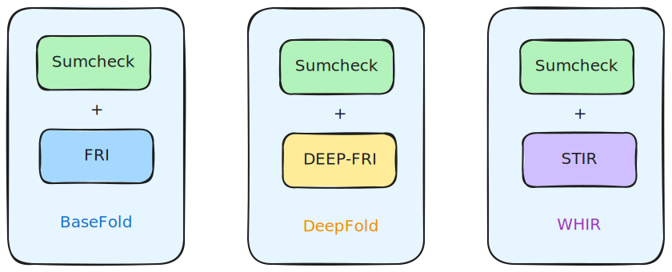
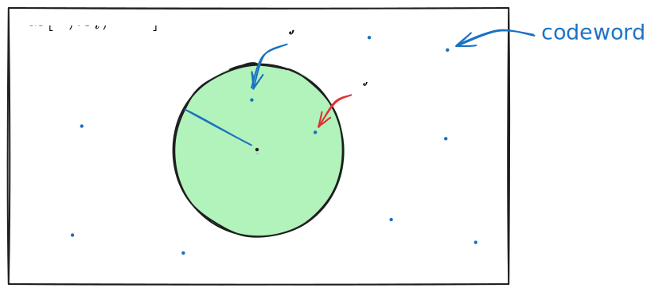
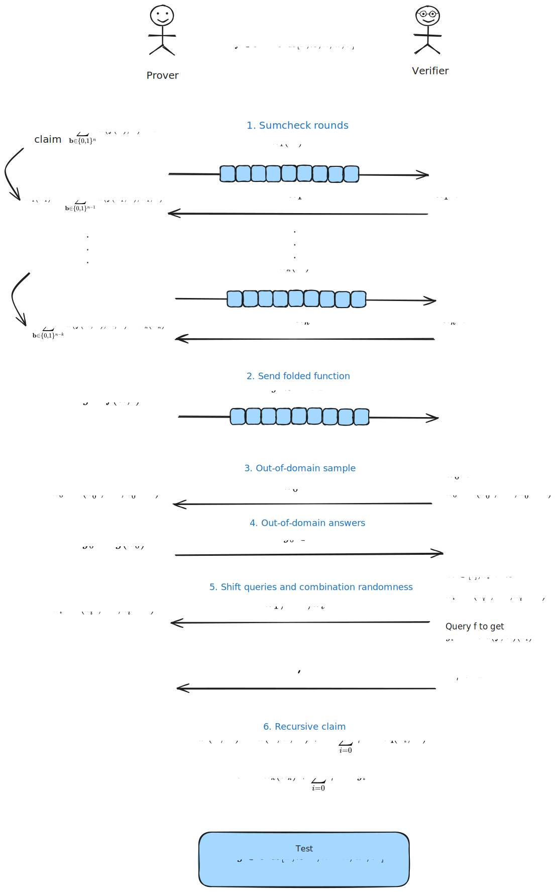
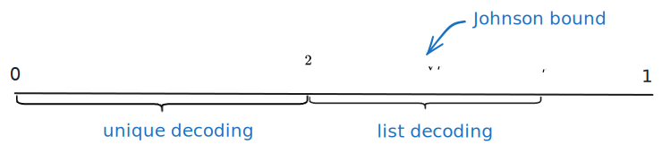

# BaseFold vs DeepFold vs WHIR

- Jade Xie  <jade@secbit.io>
- Yu Guo <yu.guo@secbit.io>

本篇文章主要介绍并对比三个比较类似的多元线性*多项式承诺方案*（PCS），分别是 BaseFold [ZCF23]、DeepFold [GLHQTZ24] 与 WHIR [ACFY24b]。

FRI [BBHR18] 协议是一种 *IOPP* (Interactive Oracle Proof of Proximity) 协议，用来判断一个单变量的多项式是否接近于一个事先约定的 Reed Solomon 编码空间，由此可以用来对一个多项式做*低度测试* (low degree test) 。FRI 协议天然支持的是单变量多项式，而非多元线性多项式，因此，要结合 FRI 协议来构造一个高效的多元线性多项式承诺方案并非易事，Basefold 协议借助于 sumcheck 协议做到了这一点。

对于一个一元多项式，当对其应用 FRI 协议时，其实就是用随机数不断对该多项式进行折叠的过程，直到最后折叠到一个常数，Basefold 协议巧妙的发现该常数正好对应于一个多元线性多项式在一个随机点的取值，而在 Sumcheck 协议的最后一步也需要一个 Oracle 来得到一个多元线性多项式在一个随机点的值，如果同步的进行 FRI 协议与 sumcheck 协议，两者在协议过程中选取同样的随机数，那么自然 FRI 协议最后一步的常数就能充当 sumcheck 协议在最后一步 oracle 的功能，用来完成整个 sumcheck 协议。Basefold 整个协议思路是非常简洁巧妙的，结合了 sumcheck 与 FRI 协议构造了一个高效的多元线性多项式承诺方案。Basefold 协议其实不只适用于 Reed Solomon 编码，而是适用于所有满足 foldable code 定义的编码，在本文中，为了方便对这三个协议进行对比，仅考虑 Reed Solomon 编码。

DeepFold 协议在 Basefold 协议基础上进行了改进，将 Basefold 协议中的 FRI 协议替换为 DEEP-FRI [BGKS20] 协议。DEEP-FRI 协议相比 FRI 协议，以牺牲一点点 Prover 的计算量的代价换来了 Verifier 的轮询次数的减少，从而降低整个协议的证明大小和 Verifier 的计算量。

WHIR 协议相比 DeepFold 协议更进一步，将 Basefold 协议中的 FRI 协议改为 STIR [ACFY24a] 协议。STIR 协议相比 FRI 协议和 DEEP-FRI 协议，Verifier 的轮询次数更少，其思想是在协议的每一轮中降低码率，这样编码中的冗余增多，Verifier 就能有更多的信息来判断其接收到的消息是否属于一个编码空间了，从而减少了查询次数。

总结下，三个协议的整体框架如下图所示。

## 从多元线性多项式到一元多项式

在具体介绍这三个多元线性多项式承诺方案之前，先介绍下一个多元线性多项式与一元多项式之间的对应关系，在建立了这个对应关系的基础上，才能大胆的去调用仅适用于一元多项式的 FRI、DEEP-FRI 和 STIR 协议。

对于一个 $n$ 元线性多项式 $\tilde{f}(X_0, \ldots, X_{n-1})$ ，用系数形式表示为

$$
\tilde{f}(X_0,\ldots,X_{n-1}) = a_0 + a_1 X_0 + a_2 X_1 + a_3 X_0X_1 + \ldots + a_{2^n - 1} \cdot X_0X_1 \cdots X_{n-1}
$$

其中多元线性多项式的基 $(1, X_0, X_1, X_0X_1, \ldots, X_0X_1\cdots X_{n-1})$ 按照字典序进行排列。

将多元线性多项式的系数直接对应到单变量多项式的系数，与 $\tilde{f}(X_0, \ldots, X_{n-1})$ 相对应的一元多项式为

$$
f(X) = a_0 + a_1 X + a_2 X^2 + a_3 X^3 + \ldots + a_{2^n - 1} X^{2^n - 1}
$$

若在多元线性多项式 $\tilde{f}(X_0, \ldots, X_{n-1})$ 中令 $X_0 = X^{2^0}, X_1 = X^{2^1}, \ldots , X_{n-1} = X^{2^{n - 1}}$ ，则可以发现

$$
\begin{align}
\tilde{f}(X^{2^0},X^{2^1},\ldots,X^{2^{n-1}})  & = a_0 + a_1 \cdot X + a_2 \cdot X^2 + a_3 \cdot X \cdot X^2 + \ldots + a_{2^n - 1} \cdot X^{2^0} \cdot X^{2^1} \cdot X^{2^{n - 1}} \\
 & = a_0 + a_1 X + a_2 X^2 + a_3 X^3 + \ldots + a_{2^n - 1} X^{2^n - 1} \\
 & = f(X)
\end{align}
$$

上面的等式 $\tilde{f}(X^{2^0},X^{2^1},\ldots,X^{2^{n-1}}) = f(X)$ 深刻地揭示了多元线性多项式与一元多项式的内在联系，这其实也可以看作是多元线性多项式的基 $(1, X_0, X_1, \ldots , X_0X_1\cdots X_{n-1})$ 与一元多项式的基 $(1, X, X^2, X^3, \ldots , X^{2^{n} - 1})$ 之间的转换关系，建立起这样的关系之后，一元多项式和多元线性多项式之间就能自由的转换，本质上只是基的不同。

例如要求一元多项式 $f(X)$ 在一个点 $\alpha$ 处的值 $f(\alpha)$ ，那么它就等于 $\tilde{f}(\alpha, \alpha^2, \alpha^4, \ldots, \alpha^{2^n - 1})$ 。

下面来看看适用于一元多项式的 FRI 协议中的折叠过程，先将 $f(X)$ 进行奇偶项的拆分，

$$
\begin{align}
f(X)  & = a_0 + a_1 X + a_2 X^2 + a_3 X^3 +  \ldots + a_{2^n - 1} X^{2^n - 1} \\
 & = (a_0 + a_2 X^2 + \ldots + a_{2^{n}-2}X^{2^n - 2}) + X \cdot (a_1 + a_3 X^2 + \ldots + a_{2^n - 1} X^{2^n - 2}) \\
 & := f_{even}(X^2) + X \cdot f_{odd}(X^2)
\end{align}
$$
此时 $f_{even}(X)$ 与 $f_{odd}(X)$ 的次数界 $2^{n - 1}$ 相比原来的多项式 $f(X)$ 的次数界 $2^n$ 已经减半了，用一个随机数 $\alpha_1$ 将这两个多项式折叠起来，得到

$$
\begin{align}
f^{(1)}(X)  & = f_{even}(X) + \alpha_1 \cdot f_{odd}(X) \\
 & = (a_0 + a_2 X + \ldots + a_{2^{n}-2}X^{2^{n - 1} - 1}) + \alpha_1 \cdot (a_1 + a_3 X + \ldots + a_{2^n - 1} X^{2^{n - 1} - 1}) 
\end{align}
$$

再用多元线性多项式的角度来看这个折叠过程，将 $f(X)$ 进行奇偶项拆分的过程是提出 $X$ 的项，对应着在多元线性多项式中提出含有 $X_0$ 的项，

$$
\begin{align}
f(X)   & = \tilde{f}(X^{2^0},X^{2^1},\ldots,X^{2^{n-1}})   \\
 & = \tilde{f}(X_0,\ldots,X_{n-1})  \\
 & = a_0 + a_1 X_0 + a_2 X_1 + \ldots + a_{2^n - 1} X_0X_1\cdots X_{n-1} \\
& = (a_0 + a_2 X_1 + \ldots + a_{2^{n}-2}X_1X_2\cdots X_{n-1}) + X_0 \cdot (a_1 + a_3 X_1 + \ldots + a_{2^n - 1} X_1X_2\cdots X_{n-1}) \\
 & := \tilde{f}_{even}(X_1,\ldots,X_{n-1}) + X_0 \cdot \tilde{f}_{odd}(X_1, \ldots, X_{n-1})
\end{align}
$$

此时 $\tilde{f}_{even}(X_1, \ldots, X_{n-1})$ 与 $\tilde{f}_{odd}(X_1, \ldots, X_{n-1})$ 中变量的个数已经少了一个了，只有 $n - 1$ 个，用随机数 $\alpha_1$ 对多元线性多项式进行折叠，对应着

$$
\begin{align}
f^{(1)}(X)  & = f_{even}(X) + \alpha_1 \cdot f_{odd}(X) \\
 & = \tilde{f}_{even}(X_0,\ldots,X_{n-2}) + \alpha_1 \cdot \tilde{f}_{odd}(X_0, \ldots, X_{n-2}) \\
 & = \tilde{f}(\alpha_1, X_0, X_1, \ldots, X_{n - 2})
\end{align}
$$

那么折叠之后的一元多项式 $f^{(1)}(X)$ 对应的多元线性多项式 $\tilde{f}^{(1)}(X_0, X_1, \ldots, X_{n- 2})$ 满足

$$
\tilde{f}^{(1)}(X_0, X_1, \ldots, X_{n- 2}) = \tilde{f}(\alpha_1, X_0, X_1, \ldots, X_{n - 2})
$$

上面的式子说明了对一元多项式进行折叠的过程，对应着对多元线性多项式用同样的随机数进行折叠，其结果等于对原来的 $n$ 元线性多项式进行变量替换，用 $(\alpha_1, X_0, X_1, \ldots, X_{n-2})$ 替换 $(X_0, X_1, X_2, \ldots, X_{n - 1})$ 。

若对 $f^{(1)}(X)$ 继续用上面的方法进行折叠，用随机数 $\alpha_2$ 折叠得到 $f^{(2)}(X)$ ，那么其对应的多元线性多项式 $\tilde{f}^{(2)}(X_0, X_1, \ldots, X_{n - 3})$ 就应该满足

$$
\tilde{f}^{(2)}(X_0, X_1, \ldots, X_{n- 3}) = \tilde{f}(\alpha_1, \alpha_2, X_0, \ldots, X_{n - 3})
$$
以此类推，进行 $k$ 折，选取 $k$ 个随机数为 $\vec{\alpha} = (\alpha_1, \ldots, \alpha_k)$ ，那么得到的折叠多项式 $f^{(k)}(X)$ 对应的多元线性多项式满足

$$
\tilde{f}^{(k)}(X_0, X_1, \ldots, X_{n- k - 1}) = \tilde{f}(\alpha_1, \alpha_2, \ldots, \alpha_k, X_0, \ldots, X_{n - k - 1})
$$

既然在 FRI 协议中对一元多项式的折叠隐含了对多元线性多项式进行类似的折叠，那么 FRI 协议适用的一元多项式的 Reed Solomon 编码空间也可以用多元线性多项式的视角来看待。根据 WHIR 论文 [ACFY24b] 中的描述，对于编码空间 $\mathsf{RS}[\mathbb{F}, \mathcal{L}, n]$ ，其表示的是在有限域 $\mathbb{F}$ 上所有次数严格小于 $2^n$ 的一元函数在 $\mathcal{L}$ 上求值的集合，那么

$$
\begin{aligned}
    \mathrm{RS}[\mathbb{F}, \mathcal{L}, n] & := \{f: \mathcal{L} \rightarrow \mathbb{F}: \exists \hat{g} \in \mathbb{F}^{< 2^n}[X] \text{ s.t. } \forall x \in \mathcal{L}, f(x) = \hat{g}(x)\} \\
    & = \{f: \mathcal{L} \rightarrow \mathbb{F}: \exists \tilde{f} \in \mathbb{F}^{< 2}[X_0, \ldots, X_{n - 1}] \text{ s.t. } \forall x \in \mathcal{L}, f(x) = \tilde{f}(x^{2^0}, x^{2^1},\ldots, x^{2^{n-1}})\}
\end{aligned}
$$

至此总结下，在一元线性多项式与多元线性多项式建立了系数的对应关系之后，它们之间满足等式 $\tilde{f}(X^{2^0},X^{2^1},\ldots,X^{2^{n-1}}) = f(X)$ ，由此可以得到
1. 一元多项式 $f(X)$ 在一个点 $\alpha$ 处求值  $f(\alpha) = \tilde{f}(\alpha, \alpha^2, \alpha^4, \ldots, \alpha^{2^n - 1})$ 。
2. 对一元多项式 $f(X)$ 依次用随机数 $(\alpha_1, \ldots, \alpha_k)$ 进行 $k$ 次折叠，得到的折叠多项式 $f^{(k)}(X)$ 对应的多元线性多项式满足

$$
\tilde{f}^{(k)}(X_0, X_1, \ldots, X_{n- k - 1}) = \tilde{f}(\alpha_1, \alpha_2, \ldots, \alpha_k, X_0, \ldots, X_{n - k - 1})
$$
3. Reed Solomon 编码空间 $\mathsf{RS}[\mathbb{F}, \mathcal{L}, n]$ 既可以用一元多项式的视角看待，也可以用多元线性多项式的视角看待，

$$
\begin{aligned}
    \mathrm{RS}[\mathbb{F}, \mathcal{L}, n] & := \{f: \mathcal{L} \rightarrow \mathbb{F}: \exists \hat{g} \in \mathbb{F}^{< 2^n}[X] \text{ s.t. } \forall x \in \mathcal{L}, f(x) = \hat{g}(x)\} \\
    & = \{f: \mathcal{L} \rightarrow \mathbb{F}: \exists \tilde{f} \in \mathbb{F}^{< 2}[X_0, \ldots, X_{n - 1}] \text{ s.t. } \forall x \in \mathcal{L}, f(x) = \tilde{f}(x^{2^0}, x^{2^1},\ldots, x^{2^{n-1}})\}
\end{aligned}
$$

## Basefold: 借助 Sumcheck

Prover 想向 Verifier 证明 $n$ 元线性多项式 $\tilde{f}(X_0, \ldots, X_{n-1})$ 在一个公开点 $\vec{u} = (u_0, u_1, \ldots, u_{n - 1})$ 处的值为 $v$ ，即

$$
\tilde{f}(u_0, u_1, \ldots, u_{n - 1}) = v \tag{1}
$$

对于多元线性多项式 $\tilde{f}(X_0, \ldots, X_{n-1})$ ，也可以用在 boolean hypercube $\mathbf{B}^n = \{0,1\}^n$ 上的值来表示，

$$
\tilde{f}(X_0, \ldots, X_{n-1}) = \sum_{\vec{b} \in \{0,1\}^n} \tilde{f}(\vec{b}) \cdot \tilde{eq}(\vec{b}, (X_0, \ldots, X_{n-1}))
$$
其中 $\tilde{eq}(\vec{b}, (X_0, \ldots, X_{n-1}))$ 是 Lagrange 基函数，向量 $\vec{b}$  表示为 $\vec{b} = (b_0, \ldots, b_{n - 1})$ ，那么

$$
\tilde{eq}((b_0, \ldots , b_{n - 1}), (X_0, \ldots, X_{n-1})) = \prod_{i = 0}^{n - 1} (b_i X_i + (1 - b_i)(1 - X_i))
$$
因此

$$
\tilde{f}(u_0, \ldots, u_{n-1}) = \sum_{\vec{b} \in \{0,1\}^n} \tilde{f}(\vec{b}) \cdot \tilde{eq}(\vec{b}, (u_0, \ldots, u_{n-1}))
$$
证明 $\tilde{f}(u_0, u_1, \ldots, u_{n - 1}) = v$ 就可以转换为证明一个在 boolean hypercube $\mathbf{B}^n = \{0,1\}^n$ 上的求和式

$$
\sum_{\vec{b} \in \{0,1\}^n} \tilde{f}(\vec{b}) \cdot \tilde{eq}(\vec{b}, (u_0, \ldots, u_{n-1})) = v \tag{2}
$$

这恰恰可以借助于 sumcheck 协议来证明。

首先 Prover 发送一个单变量多项式

$$
h_{1}(X) = \sum_{\vec{b} \in \{0,1\}^{n - 1}} \tilde{f}(X,\vec{b}) \cdot \tilde{eq}((X,\vec{b}), (u_0, \ldots, u_{n-1}))
$$
$h_{1}(X)$ 就是将 $(2)$ 式中的 $\vec{b} = (b_0, \ldots, b_{n - 1})$ 中的第一个 $b_{0}$ 替换为一个变量 $X$ ，因此证明 $(2)$ 式就转换为验证 $h_{1}(0) + h_{1}(1) = v$ 。为了相信 Prover 发送的 $h_{1}(X)$ 的是正确构造的，Verifier 选取随机数 $\alpha_1$ 发送给 Prover ，Prover 计算

$$
h_{1}(\alpha_1) = \sum_{\vec{b} \in \{0,1\}^{n - 1}} \tilde{f}(\alpha_1, \vec{b}) \cdot \tilde{eq}((\alpha_1,\vec{b}), (u_0, \ldots, u_{n-1})) \tag{3}
$$
并向 Verifier 发送 $h_1(\alpha_1)$ 。Prover 需要向 Verifier 证明发送的 $h_1(\alpha_1)$ 的正确性，而 $(3)$ 式又是一个boolean hypercube $\mathbf{B}^{n-1} = \{0,1\}^{n-1}$ 上的一个求和的形式，因此证明 $(2)$ 式就转换为了证明 $(3)$ 式。将上述过程继续下去，Verifier 再依次选取随机数 $\alpha_2,\ldots, \alpha_n$ ，最后会转换为证明

$$
h_{n}(\alpha_{n}) =\tilde{f}(\alpha_1, \ldots, \alpha_n) \cdot \tilde{eq}((\alpha_1,\ldots, \alpha_n), (u_0, \ldots, u_{n-1}))
$$

此时 Verifier 需要得到 $\tilde{f}(\alpha_1, \ldots, \alpha_n)$ 的值来验证上式。如果在 FRI 协议对 $\tilde{f}(X_0, \ldots, X_{n-1})$ 对应的一元多项式 $f(X)$ 依次用相同的随机数 $(\alpha_1,\alpha_2,\ldots, \alpha_n)$ 进行折叠，那么折叠到最后一步会得到一个常数 $f^{(n)}$ ，根据上一小节所得到的多元线性多项式与一元多项式的关系，可以知道

$$
f^{(n)} = \tilde{f}(\alpha_1, \ldots, \alpha_n)
$$

Basefold 协议就是这样的思想，两边同步用相同的随机数做 sumcheck 协议和 FRI 协议，FRI 协议的最后一步提供了 sumcheck 协议最后一步想得到的 $\tilde{f}(\alpha_1, \ldots, \alpha_n)$ 的值，因此可以完成整个 sumcheck 协议，从而证明了一个多元线性多项式在一点的打开值的正确性，即 $(1)$ 式。关于 Basefold 协议的更详细的描述可参考 [Basefold 系列博客文章](https://github.com/sec-bit/mle-pcs/tree/main/basefold) ，在本文仅叙述关键的协议思想。

## DeepFold: 引入 DEEP-FRI

由于 Basefold 协议在原论文 [ZCF23] 中仅证明了在唯一解码下的 soundness ，DeepFold 协议的思路是在 Basefold 协议中通过引入 DEEP-FRI 协议来改进这一点，并证明了在 list decoding 下也是安全的。在 FRI、DEEP-FRI 以及 STIR 协议中，Verifier 需要通过重复向 Prover 轮询，来达到一定的安全性，若在安全性证明中，能证明的界越大，如从 unique decoding 达到 list decoding ，那么就可以大大减少 Verifier 的轮询次数，从而减少 proof size 和 Verifier 的计算量。

在 FRI 协议的每一轮，Prover 都会发送 $f^{(i)}$ 在一个区域 $\mathcal{L}_i$ 上的值的 Merkle 承诺给 Verifier，即 $f^{(i)}$ 的 Reed Solomon 编码的承诺，记 $\vec{v}^{(i)} = f^{(i)}|_{\mathcal{L}_i}$ 。Verifier 在收到关于 $\vec{v}_i$ 的 Merkle 承诺后，会去判断其距离对应的编码空间 $\mathsf{RS}[\mathbb{F}, \mathcal{L}_i, 2^{n - i}]$ 是否比较近。现在在 list decoding 的情况下进行考虑，由于此时解码并不唯一，那么在第 $i$ 轮，$f^{(i)'}$  距离 $\vec{v}^{(i)}$ 也比较近，作恶的 Prover 可能选取 $f^{(i)'}$ 来进行后续的协议，也能通过 FRI 协议的后续检查，但是在最后一轮折叠得到的常数就变为了 $f^{(n)'}$ ，其并不等于 $\tilde{f}(\vec{\alpha})$ ，不能在 sumcheck 协议的最后一轮检查中提供一个正确的值。DEEP-FRI [BGKS20] 协议中的 DEEP 方法通过让 Prover 多做一点点工作，来限制作恶的 Prover 只能发送正确的 $f^{(i)}$ ，否则 Prover 无法通过后续的检查，这样就将 list decoding 转换为了 unique decoding 。

DEEP 方法就是在 $\mathbb{F} \setminus \mathcal{L}_i$ 中随机选取一个点 $\beta_i$ ，要求 Prover 提供 $f^{(i)}(\beta_i)$ 的值，并能确保该值确实是等于 $f^{(i)}(\beta_i)$ ，这样就能限制 Prover 只能选择发生 $f^{(i)}$ 而非 $f^{(i)'}$ 。现在剩下的问题是要确保 $f^{(i)}(\beta_i)$ 的正确性，Verifier 可以要求 Prover 再发送 $f^{(i)}(-\beta_i)$ ，那么 Verifier 能自己通过这两个值算出 $f^{(i + 1)}(\beta_i^2)$ ，通过多元线性多项式与一元多项式的转换，我们知道

$$
f^{(i + 1)}(\beta_i^2) = \tilde{f}(\alpha_1, \alpha_2, \ldots, \alpha_{i + 1}, \beta_i^2, \beta_i^4, \ldots, \beta_i^{2^{n - i - 1}})
$$

因此 Verifier 可以继续让 Prover 提供 $f^{(i+ 1)}(-\beta_i^2)$ 的值，Verifier 自己算出 $f^{(i + 2)}(\beta_i^4)$ ，以此类推，直到最后 Verifier 可以自己算出 $f^{(n)}(\beta_i^{2^{n-i-1}})$ ，这个值应该等于

$$
f^{(n)}(\beta_i^{2^{n-i-1}}) = \tilde{f}(\alpha_1, \alpha_2, \ldots, \alpha_{i + 1}, \ldots, \alpha_{n})
$$
而这个值正是 FRI 协议中对 $f(X)$ 折叠到最后一步的值，Verifier 可以检查自己计算出的 $f^{(n)}(\beta_i^{2^{n-i-1}})$ 的值是否等于 FRI 协议最后一步的值，这样就验证了 $f^{(i)}(\pm \beta_i)$ 的正确性了。

至此，总结下 DeepFold 协议的思路，DeepFold 协议借鉴 BaseFold 协议的框架，将其中的 FRI 协议替换为 DEEP-FRI 协议，以减少 Verifier 的查询次数。DeepFold 协议依然是同步进行 sumcheck 协议与 DEEP-FRI 协议，在使用 DEEP 技巧时，每一轮 Verifier 从 $\mathbb{F} \setminus \mathcal{L}_i$ 中选取一个随机数 $\beta_i$ ，Prover 向 Verifier 发送下列的值

$$
f^{(i)}(-\beta_i),f^{(i + 1)}(- \beta_i^2), \ldots, f^{(n - 1)}(-\beta_i^{2^{n - i - 2}})
$$

Verifier 通过这些值自己算出 $f^{(n)}(\beta_i^{2^{n-i-1}})$ ，来检验其与 FRI 折叠到最后一步的常数是否相等。

关于 DeepFold 协议更详细的描述可参考博客文章 [DeepFold 笔记：协议概览](https://github.com/sec-bit/mle-pcs/blob/main/fri/deepfold.zh.md) 。

## WHIR: 引入 STIR

对于 FRI 系列协议(包括 FRI、 DEEP-FRI)，Verifier 的查询次数影响着 proof size 和 Verifier 的计算量。STIR 协议 [ACFY24a] 是对 FRI 系列协议的一种改进，通过降低每一轮中的码率，增加编码中的冗余，从而减少 Verfier 的查询次数，需要注意的是 STIR 协议中每轮需要进行 2 折以上才能体现其优势，从而来降低每轮的码率。关于 STIR 协议更详细的介绍可见博客文章 [STIR: 提升码率来降低查询复杂度](https://github.com/sec-bit/mle-pcs/blob/main/fri/stir.zh.md)。

WHIR 协议将 Basefold 协议框架中的 FRI 协议替换为 STIR 协议，更进一步减少 Verifier 的查询次数。在 WHIR 论文 [ACFY24b] 中，其提出了 CRS (constrained Reed-Solomon code) 的概念，CRS 实际上是 Reed-Solomon 编码的一个 subcode，通过在 CRS 定义中引入类似 sumcheck 的约束，使得 WHIR 协议更加通用。

**定义 1** [ACFY24b, Definition 1] 对于域为 $\mathbb{F}$ ，smooth evaluation domain 为 $\mathcal{L} \subseteq \mathbb{F}$ ，变量的数量为 $n \in \mathbb{N}$ ，权重多项式 $\hat{w} \in \mathbb{F}[Z, X_1, \ldots, X_n]$ ，以及目标 $\sigma \in \mathbb{F}$ 的  **constrained Reed-Solomon code** ，定义为

$$
\mathrm{CRS}[\mathbb{F}, \mathcal{L}, n, \hat{w}, \sigma] := \left\{ f \in \mathrm{RS}[\mathbb{F}, \mathcal{L}, n]: \sum_{\vec{b} \in \{0,1\}^n} \hat{w}(\tilde{f}(\vec{b}), \vec{b}) = \sigma \right\}.
$$

从定义可以看出，CRS 首先是 RS code，即定义中的 $f \in \mathrm{RS}[\mathbb{F}, \mathcal{L}, n]$ ，但在此之上还需要满足一个类似 sumcheck 的求和约束 $\sum_{\vec{b} \in \{0,1\}^n} \hat{w}(\tilde{f}(\vec{b}), \vec{b}) = \sigma$ 。

若想证明 $\tilde{f}(u_0, u_1, \ldots, u_{n - 1}) = v$ ，令 CRS 定义中的目标 $\sigma = v$  ，权重多项式为

$$
\hat{w}(Z, \vec{X}) = Z \cdot \tilde{eq}(\vec{X}, \vec{u})
$$

那么 CRS 定义中类似 sumcheck 的约束就为

$$
\sum_{\vec{b} \in \{0,1\}^n} \hat{w}(\tilde{f}(\vec{b}), \vec{b}) = \sum_{\vec{b} \in \{0,1\}^n} \tilde{f}(\vec{b}) \cdot \tilde{eq}(\vec{b}, \vec{u}) = v
$$

而 $\sum_{\vec{b} \in \{0,1\}^n} \tilde{f}(\vec{b}) \cdot \tilde{eq}(\vec{b}, \vec{u}) = \tilde{f}(u_0, u_1, \ldots, u_{n - 1})$ ，因此上面类似 sumcheck 的约束正是 $\tilde{f}(u_0, u_1, \ldots, u_{n - 1}) = v$ ，从而针对 CRS 的 WHIR 协议是可以用来做多元线性多项式的承诺方案的。

WHIR 协议的整体框架流程依然和 Basefold 协议一样，同步用相同的随机数进行 sumcheck 协议和 STIR 协议，由于 STIR 协议每一轮需要进行 2 折以上才能比 FRI 系列协议更优，因此在下面协议的描述中，每一轮对一元多项式进行 $2^k$ 折。

下面深入 WHIR 协议的一次迭代(来自[ACFYb, 2.1.3 WHIR protocol])，看看 WHIR 是如何具体结合 BaseFold 与 STIR 协议的。经过一次迭代，将测试 $f \in \mathcal{C} := \mathrm{CRS}[\mathbb{F}, \mathcal{L}, n, \hat{w}, \sigma]$ 的 proximity 问题转换为测试 $f' \in \mathcal{C}' := \mathrm{CRS}[\mathbb{F}, \mathcal{L}^{(2)}, n - k, \hat{w}', \sigma']$ ，其中 $\mathcal{L}^{(2)}$ 的大小只有 $\mathcal{L}$ 的一半。记 $\mathrm{CRS}[\mathbb{F}, \mathcal{L}, n, \hat{w}, \sigma]$ 的码率为 $\rho$ ，则

$$
\rho = \frac{2^n}{|\mathcal{L}|}
$$

那么经过一次迭代之后 $\mathcal{C}' = \mathrm{CRS}[\mathbb{F}, \mathcal{L}^{(2)}, n - k, \hat{w}', \sigma']$ 的码率为

$$
\rho' = \frac{2^{n - k}}{|\mathcal{L}^{(2)}|} = \frac{2^{n - k}}{\frac{|\mathcal{L}|}{2}} = \frac{2^{n - k + 1}}{|\mathcal{L}|} = 2^{1 - k} \cdot \rho = \left(\frac{1}{2}\right)^{k - 1} \cdot \rho
$$
当 $k \ge 2$ 时，可以看到 $\rho'$ 比 $\rho$ 小，码率减小，这就是 STIR 协议的核心思想。虽然 $f$ 在一次迭代的过程中进行了 $2^k$ 折，但是 evaluation domain $\mathcal{L}$ 每次保持只减少一半，而不是也缩小 $2^k$ 倍，这样通过增大 evaluation domain，进而降低了码率，减少了 Verifier 的查询次数。

WHIR 协议的一次迭代如下图所示。

1. Sumcheck rounds. Prover 和 Verifier 针对 $\mathrm{CRS}[\mathbb{F}, \mathcal{L}, n, \hat{w}, \sigma]$ 中的约束

    $$
    \sum_{\mathbf{b} \in \{0,1\}^n} \hat{w}(\hat{f}(\mathbf{b}), \mathbf{b}) = \sigma
    $$

    进行 $k$ 轮的 Sumcheck 交互，其中 $\tilde{f}$ 是与 $f$ 相对应的多元线性多项式。

    a. Prover 向 Verifier 发送一个单变量多项式 $\hat{h}_1(X) := \sum_{\mathbf{b} \in \{0,1\}^{n-1}} \hat{w}(\tilde{f}(X, \mathbf{b}), X, \mathbf{b})$ ，Verifier 检查 $\hat{h}_1(0) + \hat{h}_1(1) = \sigma$ ，选取随机数 $\alpha_1 \leftarrow \mathbb{F}$ 并发送，sumcheck 的 claim 就变为 $\hat{h}_1(\alpha_1) := \sum_{\mathbf{b} \in \{0,1\}^{n-1}} \hat{w}(\tilde{f}(\alpha_1, \mathbf{b}), \alpha_1, \mathbf{b})$ 。
    b. 对于第 $i$ 轮，$i$ 从 $2$ 到 $k$ ，Prover 发送一个单变量多项式

    $$
    \hat{h}_i(X) := \sum_{\mathbf{b} \in \{0,1\}^{n-i}} \hat{w}(\tilde{f}(\alpha_1, \ldots, \alpha_{i - 1}, X, \mathbf{b}), \alpha_1, \ldots, \alpha_{i - 1}, X, \mathbf{b})
    $$

    Verifier 检查 $\hat{h}_{i}(0) + \hat{h}_{i}(1) = \hat{h}_{i-1}(\alpha_{i-1})$ ，选取随机数 $\alpha_i \leftarrow \mathbb{F}$ ，sumcheck 的 claim 就变为 

    $$
    \sum_{\mathbf{b} \in \{0,1\}^{m-i}} \hat{w}(\tilde{f}(\alpha_1, \ldots, \alpha_{i - 1}, \alpha_i, \mathbf{b}), \alpha_1, \ldots, \alpha_{i - 1}, \alpha_i, \mathbf{b}) = \hat{h}_i(\alpha_i)
    $$

    因此经过上述 $k$ 轮的 sumcheck ，Prover 发送了多项式 $(\hat{h}_1, \ldots, \hat{h}_k)$ ，Verifier 选取了随机数 $\boldsymbol{\alpha} = (\alpha_1, \ldots, \alpha_k) \in \mathbb{F}^k$ 。最初的 claim 变为下面这样的声明

    $$
    \sum_{\mathbf{b} \in \{0,1\}^{n-k}} \hat{w}(\tilde{f}(\boldsymbol{\alpha}, \mathbf{b}), \boldsymbol{\alpha}, \mathbf{b}) = \hat{h}_k(\alpha_k)
    $$

2. Send folded function. Prover 发送函数 $g: \mathcal{L}^{(2)} \rightarrow \mathbb{F}$ 。在 Prover 诚实的情况下，$\hat{g} \equiv \tilde{f}(\boldsymbol{\alpha}, \cdot)$ ，$g$ 的定义是 $\hat{g}$ 在 domain $\mathcal{L}^{(2)}$ 上的求值。

    这里的意思是先对 $\tilde{f}$ 用随机数 $\boldsymbol{\alpha}$ 进行 $2^k$ 折，得到 $\hat{g} = \tilde{f}(\boldsymbol{\alpha}, \cdot)$ ，此时 $\hat{g} : \mathcal{L}^{(2^k)} \rightarrow \mathbb{F}$ ，其定义域的范围是 $\mathcal{L}^{(2^k)}$ ，由于 $\hat{g}$ 本质是一个多项式，那么我们可以改变其自变量的定义域，将其改为 $\mathcal{L}^{(2)}$ ，函数 $g$ 与 $\hat{g}$ 在 $\mathcal{L}^{(2)}$ 上的求值是一致的。

3. Out-of-domain sample. Verifier 选取一个随机数 $z_0 \leftarrow \mathbb{F}$ 并发送给 Prover 。设 $\boldsymbol{z}_0 := (z_0^{2^0}, \ldots, z_0^{2^{n-k - 1}})$ 。

4. Out-of-domain answers. Prover 发送 $y_0 \in \mathbb{F}$ 。在诚实的情况下，$y_0 := \hat{g}(\boldsymbol{z}_0)$ 。

5. Shift queries and combination randomness. 对于 Verifier，对于每一个 $i \in [t]$ ，选取随机数 $z_i \leftarrow \mathcal{L}^{(2^k)}$ 并发送，通过查询 $f$ 可以得到 $y_i := \mathrm{Fold}(f, \boldsymbol{\alpha})(z_i)$ 。设 $\boldsymbol{z}_i := (z_i^{2^0}, \ldots, z_i^{2^{n- k - 1}})$ 。Verifier 另外选取随机数 $\gamma \leftarrow \mathbb{F}$ 并发送。

6. Recursive claim. Prover 和 Verifier 定义新的权重多项式与目标值：

$$
\hat{w}'(Z, \boldsymbol{X}) := \hat{w}(Z, \boldsymbol{\alpha}, \boldsymbol{X}) + Z \cdot \sum_{i = 0}^t \gamma^{i+1} \cdot \mathrm{eq}(\boldsymbol{z}_i, \boldsymbol{X})
$$

$$
\sigma' := \hat{h}_k(\alpha_k) + \sum_{i = 0}^t \gamma^{i+1} \cdot y_i,
$$

接着，递归地测试 $g \in \mathrm{CRS}[\mathbb{F}, \mathcal{L}^{(2)}, n - k, \hat{w}', \sigma']$ 。

新的权重多项式的定义 $\hat{w}'$ 为

$$
\hat{w}'(Z, \boldsymbol{X}) := \hat{w}(Z, \boldsymbol{\alpha}, \boldsymbol{X}) + Z \cdot \sum_{i = 0}^t \gamma^{i+1} \cdot \mathrm{eq}(\boldsymbol{z}_i, \boldsymbol{X})
$$

分为两部分：

1. 第一部分 $\hat{w}(Z, \boldsymbol{\alpha}, \boldsymbol{X})$ 约束了协议第 1 步中 $k$ 轮 sumcheck 的正确性。
2. 第二部分 $Z \cdot \sum_{i = 0}^t \gamma^{i+1} \cdot \mathrm{eq}(\boldsymbol{z}_i, \boldsymbol{X})$ 约束了 $g$ 在 $\boldsymbol{z}_i$ 的值是正确的，并用随机数 $\gamma$ 对这 $t + 1$ 个约束进行了线性组合。
   a. 对 $g(\boldsymbol{z}_0) = y_0$ 的约束，实际是在验证 out-of-domain answers 的正确性。
   b. 对 $i \in [t]$ ，约束 $g(\boldsymbol{z}_i) = y_i$ ，是要求 shift queries 的正确性。

由此也可见权重多项式定义的灵活性，能一次实现多个约束。

在上述一次迭代的步骤中，第 1 步就是一次进行 $k$ 轮的 sumcheck 协议，产生了 $k$ 个随机数 $\alpha_1, \ldots, \alpha_k$ ，接着第 2-5 步用相同的随机数 $\alpha_1, \ldots, \alpha_k$ 进行 STIR 协议，最后第 6 步重新来定义权重多项式和目标值，为下一次迭代做准备。

## 效率对比

对于分别基于 FRI、DEEP-FRI 以及 STIR 协议的 Basefold、DeepFold 以及 WHIR 协议，它们的效率与 Verifier 的查询次数有很大的关系，主要影响着协议的 proof size 与 Verifier 的计算量，而这些协议的查询次数主要是有它们的 soundness 证明所确定的。

对于一个可能作恶的 Prover $P^*$，假设其初始提供的 $\tilde{f}$ 对应的一元函数 $f(X)$ 距离 Reed Solomon 编码空间 $\mathsf{RS}[\mathbb{F}, \mathcal{L}, n]$ 有 $\delta > \Delta$  远，其中 $\Delta < \Delta^*$ ， $\Delta^*$  是在折叠过程中保持到对应编码空间距离的一个界，Verifier 在协议中的查询次数为 $l$ ，那么 $P^*$ 能通过协议的检查的概率大约不会超过

$$
(1 - \Delta)^l
$$

这个概率也被称为 soundness error。

在要求整个协议达到 $\lambda$ -比特的前提下，也就是要求 soundness error 小于 $2^{-\lambda}$ ，即

$$
(1 - \Delta)^l < 2^{-\lambda}
$$

两边同时取对数，可以得到

$$
l > \frac{\lambda}{- \log_2(1 - \Delta)}
$$

当 $\Delta$ 能取得更大时，在同样达到 $\lambda$ -比特安全时，查询次数 $l$ 就可以取得更小。

在这些协议的 soundness 证明中，都希望能尽可能提高 $\Delta$ 能取到的界，而 $\Delta$ 能取到的界是和 Reed Solomon 码的 unique decoding 以及 list decoding 紧密相关的，将常见的界从小到大依次排序有：

1. unique decoding bound: $(1 - \rho)/2$
2. Johnson bound: $1 - \sqrt{\rho}$
3. list decoding bound: $1 - \rho$

其中第 2 项和第 3 项都进入了 list decoding 范围。

在 Basefold 原论文 [ZCF23] 中，其 soundness 只证明到 $\Delta$ 最大能取到 $(1 - \rho)/2$ ，随后 Ulrich Haböck 在 [H24] 中证明了 Basefold 协议对于 Reed Solomon 能达到 Johnson bound $1 - \sqrt{\rho}$ ，Hadas Zeilberger 在 Khatam [Z24] 论文中证明了 Basefold 协议对于一般的 linear code 能达到 $1 - \rho^{\frac{1}{3}}$ 。

对于 DeepFold 协议，在原论文 [GLHQTZ24] 中，基于一个针对 Reed Solomon 编码的 List Decodability 猜想([GLHQTZ24] Conjecture 1)，证明了其能达到 $1 - \rho$ 的界。

对于 WHIR 协议，在原论文 [ACFY24b] 中，其讨论的 soundness error 并不是要求整个协议达到 $\lambda$ -比特安全，而是讨论更强的 round-by-round soundness error，意思是在每一轮中，Verifier 需要通过重复查询，使得每一轮都要达到 $\lambda$-比特安全。在这样的前提下，其证明了能达到的界为 $(1 - \rho)/2$ ，并猜想能达到 Johnson bound $1 - \sqrt{\rho}$ 。Ulrich Haböck 在 [H24] 中也指出应用其论文中的方法应该可以证明 WHIR 协议能达到 Johnson bound 的。

至此总结下上述三个协议的 soundness 证明。

| 协议       | soundness                     | 原论文                                     | Khatam [Z24]             | [H24]                         |
| -------- | ----------------------------- | --------------------------------------- | ------------------------ | ----------------------------- |
| BaseFold | soundness                     | $(1 - \rho)/2$                          | $1 - \rho^{\frac{1}{3}}$ | $1 - \sqrt{\rho}$ （仅针对 RS 编码） |
| DeepFold | soundness                     | $1 - \rho$ （基于 list decoding 猜想）        |                          |                               |
| WHIR     | round-by-round soundness (更强) | $(1 - \rho)/2$ ，猜想能达到 $1 - \sqrt{\rho}$ |                          | 提供了证明思路，能达到 $1 - \sqrt{\rho}$ |

在 DeepFold 论文 [GLHQTZ24] 中已经比较了 BaseFold 协议与 DeepFold 协议， 不过其中 BaseFold 协议能达到的界为 unique decoding 的界 $(1 - \rho)/2$ ，而非最新在 [H24] 中已经证明的 Johnson bound $1 - \sqrt{\rho}$ ，在这里借鉴 DeepFold 论文 [GLHQTZ24] 中的分析来对比 BaseFold 协议与 DeepFold 协议。

| Scheme   | Soundness | soundness bound   | Commit                                         | Evaluate            | Verify                          | Proof Size         |
| -------- | --------- | ----------------- | ---------------------------------------------- | ------------------- | ------------------------------- | ------------------ |
| BaseFold | soundness | $(1 - \rho)/2$    | $O(N \log N) ~ \mathbb{F} + O(N) ~ \mathbb{H}$ | $O(N) ~ \mathbb{H}$ | $O(s_{U} \log^2N) ~ \mathbb{H}$ | $O(s_{U} \log^2N)$ |
| BaseFold | soundness | $1 - \sqrt{\rho}$ | $O(N \log N) ~ \mathbb{F} + O(N) ~ \mathbb{H}$ | $O(N) ~ \mathbb{H}$ | $O(s_{J} \log^2N) ~ \mathbb{H}$ | $O(s_{J} \log^2N)$ |
| DeepFold | soundness | $1 - \rho$        | $O(N \log N) ~ \mathbb{F} + O(N) ~ \mathbb{H}$ | $O(N) ~ \mathbb{H}$ | $O(s_{L} \log^2N) ~ \mathbb{H}$ | $O(s_{L} \log^2N)$ |

在上表中，$N = 2^n$ ，$s_{U}$ ，$s_{J}$ 与 $s_L$ 分别表示在达到 unique decoding bound， Johnson bound 和 list decoding bound 下 Verifier 的查询次数。根据前面所推导的查询次数的计算公式

$$
l > \frac{\lambda}{- \log_2(1 - \Delta)}
$$

代入   $\Delta < (1 - \rho)/2$  ，$\Delta < 1 - \sqrt{\rho}$ ， $\Delta < 1 - \rho$ ，可以算出 $s_U$ ，$s_J$ 与 $s_L$ 分别为

$$
s_U = \frac{\lambda}{-\log_2 (\frac{1 + \rho}{2})}, \qquad s_J = \frac{\lambda}{-\log_2 \sqrt{\rho}}, \qquad s_L = \frac{\lambda}{-\log_2 \rho} 
$$
取不同的 $\lambda$ 与 $\rho$ 的值，对计算出的结果向上取整，可以得到

| 查询次数  | $\lambda = 100, \rho = 1/2$ | $\lambda = 100, \rho = 1/4$ | $\lambda = 100, \rho = 1/8$ | $\lambda = 128, \rho = 1/8$ |
| ----- | --------------------------- | --------------------------- | --------------------------- | --------------------------- |
| $s_U$ | $241$                       | $148$                       | $121$                       | $155$                       |
| $s_J$ | $200$                       | $100$                       | $67$                        | $86$                        |
| $s_L$ | $100$                       | $50$                        | $34$                        | $43$                        |

通过上表可以发现

1. 能达到的 bound 越大，查询次数越少。
2. 码率越小，查询次数越少。
3. 要求达到的安全性越高，查询次数越多。

由此也能得出，由于 DeepFold 协议能达到的 soundness bound 更大，因此相比 BaseFold 协议其查询次数更少，协议的证明大小与 Verifier 的计算量更小。在 Prover 的计算量上，这两个协议的差别并不大，DeepFold 协议由于使用了 DEEP-FRI 协议，Prover 计算量会稍比 BaseFold 协议多一些。

当进行 $2$ 折以上时，STIR 协议相比 FRI 协议和 DEEP-FRI 协议有更少的查询次数。根据 WHIR 论文 [ACFY24b] 中的结论， BaseFold 协议与 WHIR 协议的查询复杂度与 Verifier 计算复杂度对比如下表所示。

| 协议       | Soundness                     | Queries                                                                             | Verifier Time                                 | Alphabet           |
| -------- | ----------------------------- | ----------------------------------------------------------------------------------- | --------------------------------------------- | ------------------ |
| BaseFold | round-by-round soundness (更强) | $q_{\mathsf{BF}} := O_{\rho}(\lambda \cdot n)$                                      | $O_{\rho}(q_{\mathsf{BF}})$                   | $\mathbb{F}^2$     |
| WHIR     | round-by-round soundness (更强) | $q_{\mathsf{WHIR}} := O_{\rho}(\lambda + \frac{\lambda}{k} \cdot \log \frac{n}{k})$ | $O_{\rho}(q_{\mathsf{WHIR}} \cdot (2^k + n))$ | $\mathbb{F}^{2^k}$ |

在 WHIR 协议中每一轮对原来的一元多项式折叠 $2^k$ 次，因此 Verifier 从 $\mathbb{F}^{2^k}$ 中进行查询，而 BaseFold 协议中，一轮仅折叠 $2$ 次，因此 Verifier 从 $\mathbb{F}^2$ 中进行查询。

当 $k > 1$ 时，可以发现 WHIR 协议中 Verifier 的查询次数关于 $n/k$ 是对数级别的，而 BaseFold 协议中关于 $n$ 是线性的，因此 WHIR 协议相比 BaseFold 协议有更少的查询复杂度，其 Verifier 计算量也更小。对于 DeepFold 协议，其使用的是 DEEP-FRI 协议，查询次数和 BaseFold 协议一样，关于 $n$ 是线性的，因此 WHIR 协议相比 DeepFold 协议也有更少的查询复杂度。

总结下这三个协议的效率，从 Verifier 查询次数来说，

1. 由于 DeepFold 协议的 soundness 证明已证明到 $1 - \rho$ 的界，因此其查询次数小于 BaseFold 协议。
2. 由于 WHIR 协议底层用的是相比 FRI 协议和 DEEP-FRI 协议查询复杂度都更小的 STIR 协议，因此 WHIR 协议的查询次数相比 BaseFold 协议与 DeepFold 协议都更少。

若考虑三个协议都在 round-by-round soundness error，均达到 Johnson bound $1 - \sqrt{\rho}$ 的前提下，理论上 WHIR 协议在进行 $2$ 折以上时， Verifier 的计算量和证明大小上会比 BaseFold 协议与 DeepFold 协议更优。

## 总结

总结下 BaseFold 协议、DeepFold 协议与 WHIR 协议，这三个协议的框架都是 BaseFold 协议的框架，用相同的随机数同步进行 sumcheck 协议和 FRI/DEEP-FRI/STIR 协议，它们之间的不同主要也是来自 FRI 协议、DEEP-FRI 协议和 STIR 协议之间的不同。

对比这三个协议的效率，Prover 的计算量差异不是特别明显，主要取决于 Verifier 的查询次数，查询次数越大，会造成 Verifier 的计算量与证明大小越大。由于 STIR 协议在理论上的查询复杂度比 FRI 协议和 DEEP-FRI 协议更优，因此 WHIR 协议相比 BaseFold 协议与 DeepFold 协议有更少的查询次数。

另一方面，Verifier 的查询次数是和协议的 soundness 证明中能取到的 bound 相关的，根据目前的研究进展有：

1. 基于 DEEP-FRI 协议的 DeepFold 协议，在基于一个简单的猜想下，能达到最优的界 $1 - \rho$ 。若 FRI 协议想达到 $1 - \rho$ 的界，其基于的猜想会更强（见 [BCIKS20] Conjecture 8.4）。
2. BaseFold 协议在针对 Reed Solomon 编码下能达到 Johnson bound $1 - \sqrt{\rho}$ 。
3. WHIR 协议在原论文中仅证明了其能达到 $(1 - \rho)/2$ ，但根据 [H24] 中的方法，有望证明达到 Johnson bound $1 - \sqrt{\rho}$ 。

## References

- [ACFY24a] Gal Arnon, Alessandro Chiesa, Giacomo Fenzi, and Eylon Yogev. "STIR: Reed-Solomon proximity testing with fewer queries." In _Annual International Cryptology Conference_, pp. 380-413. Cham: Springer Nature Switzerland, 2024.
- [ACFY24b] Gal Arnon, Alessandro Chiesa, Giacomo Fenzi, and Eylon Yogev. "WHIR: Reed–Solomon Proximity Testing with Super-Fast Verification." _Cryptology ePrint Archive_ (2024).
- [BBHR18] Eli Ben-Sasson, Iddo Bentov, Yinon Horesh, and Michael Riabzev. “Fast Reed–Solomon Interactive Oracle Proofs of Proximity”. In: *Proceedings of the 45th International Colloquium on Automata, Languages and Programming (ICALP)*, 2018.
- [BCIKS20] Eli Ben-Sasson, Dan Carmon, Yuval Ishai, Swastik Kopparty, and Shubhangi Saraf. Proximity Gaps for Reed–Solomon Codes. In *Proceedings of the 61st Annual IEEE Symposium on Foundations of Computer Science*, pages 900–909, 2020.
- [BGKS20] Eli Ben-Sasson, Lior Goldberg, Swastik Kopparty, and Shubhangi Saraf. "DEEP-FRI: sampling outside the box improves soundness." _arXiv preprint arXiv:1903.12243_ (2019).
- [GLHQTZ24] Yanpei Guo, Xuanming Liu, Kexi Huang, Wenjie Qu, Tianyang Tao, and Jiaheng Zhang. "DeepFold: Efficient Multilinear Polynomial Commitment from Reed-Solomon Code and Its Application to Zero-knowledge Proofs." _Cryptology ePrint Archive_ (2024).
- [H24] Ulrich Haböck. "Basefold in the List Decoding Regime." _Cryptology ePrint Archive_(2024).
- [Z24] Zeilberger, Hadas. "Khatam: Reducing the Communication Complexity of Code-Based SNARKs." _Cryptology ePrint Archive_ (2024).
- [ZCF23] Hadas Zeilberger, Binyi Chen, and Ben Fisch. "BaseFold: efficient field-agnostic polynomial commitment schemes from foldable codes." Annual International Cryptology Conference. Cham: Springer Nature Switzerland, 2024.
