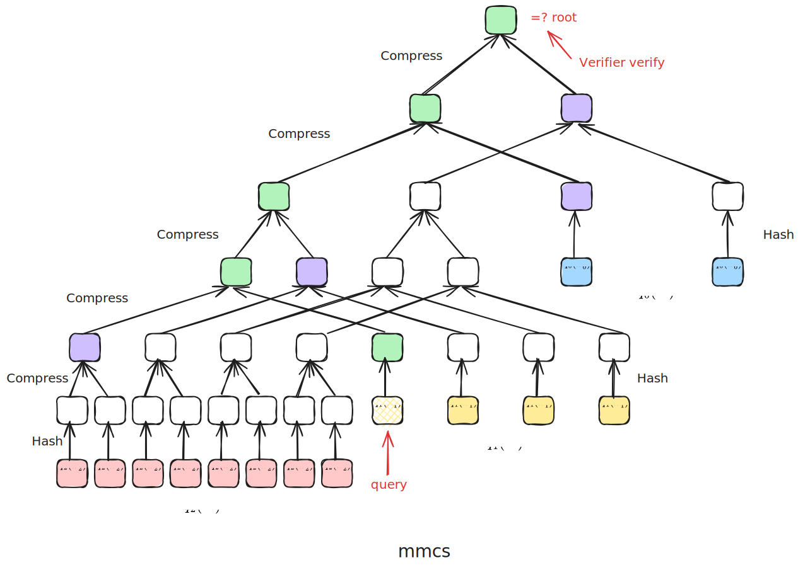

# Zeromroph-fri Protocol Complexity Analysis

- Jade Xie <jade@secbit.io>
- Yu Guo <yu.guo@secbit.io>

## Evaluation Proof Protocol

- Protocol description document: [Zeromorph-PCS: Integration with FRI](https://github.com/sec-bit/mle-pcs/blob/main/zeromorph/zeromorph-fri.md)

### Public Inputs

- Commitment to the MLE polynomial $\tilde{f}$: $\mathsf{cm}([[\tilde{f}]]_n)$
- Evaluation point $\mathbf{u}=(u_0, u_1, \ldots, u_{n-1})$
- Evaluation result $v = \tilde{f}(\mathbf{u})$
- Code rate parameter: $\rho$
- Parameter for the number of repetitive queries in the query phase of the FRI protocol low degree test: $l$
- Multiplication subgroups in the FRI protocol encoding: $D, D^{(0)}, \ldots, D^{(n - 1)}$ 

### Witness

- Point value vector of MLE polynomial $\tilde{f}$ on the $n$-dimensional HyperCube: $\mathbf{a} = (a_0, a_1, \ldots, a_{2^n-1})$

### Round 1

Prover sends commitments to remainder polynomials

- Calculate $n$ remainder MLE polynomials, $\{\tilde{q}_k\}_{k=0}^{n-1}$, satisfying

$$
\tilde{f}(X_0,X_1,\ldots, X_{n-1}) - v = \sum_{k=0}^{n-1} (X_k-u_k) \cdot \tilde{q}_k(X_0,X_1,\ldots, X_{k-1})
$$

- Construct univariate polynomials mapping from remainder MLE polynomials $\hat{q}_k=[[\tilde{q}_k]]_k, \quad 0 \leq k < n$
- Compute and send their commitments. Using the mmcs structure to commit to the values of these $n$ polynomials on the same tree. First, calculate the values of these polynomials on the corresponding $D^{(k)}$:

$$
\{[\hat{q}_k(x)|_{x \in D^{(k)}}]\}_{k = 0}^{n - 1}
$$

where $|D^{(k)}| = 2^k / \rho$, then use mmcs to commit to these $(2^{n - 1} + 2^{n - 2} + \ldots + 2^0)/\rho$ values at once, denoted as:

$$
\mathsf{cm}(\hat{q}_{n - 1}, \hat{q}_{n - 2}, \ldots, \hat{q}_0) = \mathsf{MMCS.commit}(\hat{q}_{n - 1}, \hat{q}_{n - 2}, \ldots, \hat{q}_0)
$$

#### Prover Cost Round 1

-  Using the algorithm from Appendix A.2 of the [Zeromorph](https://eprint.iacr.org/2023/917) paper, we can compute the values of $q_k$ on the Hypercube, thus obtaining the coefficients of $\hat{q}_k$. According to the paper, the overall algorithm complexity is $(2^{n+1} - 3) ~ \mathbb{F}_{\mathsf{add}}$ and $(2^{n} - 2) ~ \mathbb{F}_{\mathsf{mul}}$. Without counting addition complexity, the complexity of computing $\hat{q}_k=[[\tilde{q}_k]]_k, \quad 0 \leq k < n$ is $(N - 2) ~ \mathbb{F}_{\mathsf{mul}}$.
- To calculate $\{[\hat{q}_k(x)|_{x \in D^{(k)}}]\}_{k = 0}^{n - 1}$, since we already have the coefficients of $\hat{q}_k(X)$, we directly substitute $D^{(k)}$ for evaluation. For evaluation at one point, using FFT method:
	- Since $|D^{(k)}| = 2^k \cdot \mathcal{R}$, the complexity of calculating $[\hat{q}_k(x)|_{x \in D^{(k)}}]$ is $2^k\mathcal{R} \cdot \log(2^k\mathcal{R}) ~ \mathbb{F}_{\mathsf{mul}} =2^k \mathcal{R}(k + \log \mathcal{R}) ~ \mathbb{F}_{\mathsf{mul}}$. The complexity of calculating $\{[\hat{q}_k(x)|_{x \in D^{(k)}}]\}_{k = 0}^{n - 1}$ is:

$$
\sum_{k = 0}^{n - 1} 2^k \mathcal{R}(k + \log \mathcal{R})  ~ \mathbb{F}_{\mathsf{mul}} 
$$

Since
$$
\sum_{k = 0}^{n - 1} 2^k = 2^0 + \ldots + 2^{n - 1} = \frac{2^0(1- 2^n)}{1- 2} = 2^n - 1
$$

$$
\sum_{k = 0}^{n - 1} k \cdot 2^k = (n - 2) \cdot 2^n + 2
$$


Therefore:

$$
\begin{align}
 \sum_{k = 0}^{n - 1} 2^k \mathcal{R}(k + \log \mathcal{R})     & = \mathcal{R} \cdot\sum_{k = 0}^{n - 1} k \cdot 2^k  + \mathcal{R}\log \mathcal{R}  \cdot \sum_{k = 0}^{n - 1} 2^k  \\
 &  = \mathcal{R} \cdot nN + (\mathcal{R} \log \mathcal{R} - 2 \mathcal{R}) N + 2\mathcal{R}  - \mathcal{R}\log \mathcal{R}
\end{align}
$$

So the complexity for this round is $(\mathcal{R} \cdot nN + (\mathcal{R} \log \mathcal{R} - 2 \mathcal{R}) N + 2\mathcal{R}  - \mathcal{R}\log \mathcal{R}) ~\mathbb{F}_{\mathsf{mul}}$.

> [!summary] 
> In this step, there are $n$ polynomials $\hat{q}_k(X)$ that need to be evaluated on $D^{(k)}$, using FFT method, with complexity $O(N \log N)$.

- Computing the commitment $\mathsf{cm}(\hat{q}_{n - 1}, \hat{q}_{n - 2}, \ldots, \hat{q}_0) = \mathsf{MMCS.commit}(\hat{q}_{n - 1}, \hat{q}_{n - 2}, \ldots, \hat{q}_0)$. The tree height is $2 \cdot \log (2^{n - 1} \cdot \mathcal{R})$, involving $(2^{n - 1} + \cdots + 2^0) \cdot \mathcal{R}$ hash calculations, with one hash operation complexity denoted as $H$. The Compress operations are $(2^{n - 2} \cdot \mathcal{R} + \ldots + 2^{0} \cdot \mathcal{R} + 1)$, denoted as $(2^{n - 2} \cdot \mathcal{R} + \ldots + 2^{0} \cdot \mathcal{R} + 1) ~ C$. Thus, this step's complexity is:
  
$$
\begin{aligned}
  & \mathsf{MMCS.commit}(2^{n-1} \cdot \mathcal{R}, \ldots, \mathcal{R})\\
  = & ((2^{n - 1} + \cdots + 2^0) \cdot \mathcal{R}) ~ H + (2^{n - 2} \cdot \mathcal{R} + \ldots + 2^{0} \cdot \mathcal{R} + 1) ~ C \\
  = & (N - 1) \cdot \mathcal{R} ~ H  + ((N/2 - 1) \cdot \mathcal{R} + 1) ~ C
\end{aligned}
$$

The total complexity for this round is:

$$
\begin{align}
 & (N - 2) ~ \mathbb{F}_{\mathsf{mul}} + (\mathcal{R} \cdot nN + (\mathcal{R} \log \mathcal{R} - 2 \mathcal{R}) N + 2\mathcal{R}  - \mathcal{R}\log \mathcal{R}) ~\mathbb{F}_{\mathsf{mul}} \\
 & + \mathsf{MMCS.commit}(2^{n-1} \cdot \mathcal{R}, \ldots, \mathcal{R}) \\
=  & (\mathcal{R}\cdot nN + (\mathcal{R} \log \mathcal{R} - 2 \mathcal{R} + 1) N + 2\mathcal{R}  - \mathcal{R}\log \mathcal{R}  - 2) ~\mathbb{F}_{\mathsf{mul}}  \\
 & + \mathsf{MMCS.commit}(2^{n-1} \cdot \mathcal{R}, \ldots, \mathcal{R}) 
\end{align}
$$

### Round 2

1. Verifier sends a random number $\zeta \stackrel{\$}{\leftarrow} \mathbb{F} \setminus D$ 
2. Prover computes and sends $\hat{f}(\zeta)$ 
3. Prover computes and sends $\{\hat{q}_k(\zeta)\}_{k = 0}^{n - 1}$.

#### Prover Cost Round 2

- Computing $\hat{f}(\zeta)$: Prover has the coefficient form of $\hat{f}$, and uses Horner's method to compute its value at a point, with complexity $N ~ \mathbb{F}_{\mathsf{mul}}$.

> [!note] 
> Using Lagrange interpolation would have complexity $(2N + 1) ~ \mathbb{F}_{\mathsf{mul}} + (N + 1) ~ \mathbb{F}_{\mathsf{inv}}$, which would be more computationally intensive.

- Computing $\{\hat{q}_k(\zeta)\}_{k = 0}^{n - 1}$, with complexity:

  $$
    \sum_{k = 0}^{n - 1} 2^k ~ \mathbb{F}_{\mathsf{mul}} = (N - 1) ~ \mathbb{F}_{\mathsf{mul}}
  $$

The total complexity for this round is:

$$
\begin{align}
N ~ \mathbb{F}_{\mathsf{mul}} + (N - 1) ~ \mathbb{F}_{\mathsf{mul}} = (2N - 1) ~ \mathbb{F}_{\mathsf{mul}}
\end{align}
$$


### Round 3

1. Verifier sends a random number $\lambda \stackrel{\$}{\leftarrow} \mathbb{F}$ 
2. Prover computes:

$$
q_{f_\zeta}(X) = \frac{\hat{f}(X) - \hat{f}(\zeta)}{X - \zeta} + \lambda \cdot X \cdot \frac{\hat{f}(X) - \hat{f}(\zeta)}{X - \zeta}
$$
on $D$, i.e.:

$$
[q_{f_\zeta}(x)|_{x \in D}] = \big[\frac{\hat{f}(x) - \hat{f}(\zeta)}{x - \zeta} + \lambda \cdot x \cdot \frac{\hat{f}(x) - \hat{f}(\zeta)}{x - \zeta}\big|_{x \in D} \big]
$$

3. For $0 \le k < n$, Prover computes:

$$
q_{\hat{q}_k}(X) = \frac{\hat{q_k}(X) - \hat{q}_k(\zeta)}{X - \zeta} + \lambda \cdot X \cdot \frac{\hat{q_k}(X) - \hat{q}_k(\zeta)}{X - \zeta}
$$

on $D^{(k)}$.

#### Prover Cost Round 3

- Computing $[q_{f_\zeta}(x)|_{x \in D}]$:
	- First use FFT to compute $[f(x)|_{x \in D}]$ from the coefficient form of $f(X)$. Since $|D| = N \cdot \mathcal{R}$, the complexity is $(\mathcal{R}N \cdot\log(\mathcal{R}N)) ~ \mathbb{F}_{\mathsf{mul}} = (\mathcal{R} \cdot nN + \mathcal{R}\log\mathcal{R} \cdot N) ~ \mathbb{F}_{\mathsf{mul}}$.
		- [ ] FFT can be avoided as we already computed $[f(x)|_{x \in D}]$ during the commit phase.
	- Then calculate $[q_{f_\zeta}(x)|_{x \in D}]$, with each value involving $\mathbb{F}_{\mathsf{inv}} + \mathbb{F}_{\mathsf{mul}} + 2 ~ \mathbb{F}_{\mathsf{mul}} = 3 ~ \mathbb{F}_{\mathsf{mul}} + \mathbb{F}_{\mathsf{inv}}$, for a total of $3\mathcal{R} \cdot N ~ \mathbb{F}_{\mathsf{mul}} + \mathcal{R} \cdot N\mathbb{F}_{\mathsf{inv}}$.
	- The overall computation complexity is:

$$
\begin{align}
& (\mathcal{R} \cdot nN + \mathcal{R}\log\mathcal{R} \cdot N) ~ \mathbb{F}_{\mathsf{mul}} + 3\mathcal{R} \cdot N ~ \mathbb{F}_{\mathsf{mul}} + \mathcal{R} \cdot N ~\mathbb{F}_{\mathsf{inv}} \\
= & (\mathcal{R} \cdot nN + (\mathcal{R}\log\mathcal{R} + 3 \mathcal{R}) \cdot N) ~ \mathbb{F}_{\mathsf{mul}} + \mathcal{R} \cdot N ~ \mathbb{F}_{\mathsf{inv}}
\end{align}
$$

> [!summary] 
> Computing $[f(x)|_{x \in D}]$ has complexity $O(N \log N)$.
  
- Computing $[q_{\hat{q}_k}(x)|_{x \in D^{(k)}}]$: Round 1 already calculated $[\hat{q}_k(x)|_{x \in D^{(k)}}]$. Since $|D_k| = 2^k \cdot \mathcal{R}$, this step's complexity is:

$$
\begin{align}
\sum_{k = 0}^{n-1} 2^k \cdot \mathcal{R} \cdot (3 ~ \mathbb{F}_{\mathsf{mul}} + \mathbb{F}_{\mathsf{inv}})  & = (3 \mathcal{R}~ \mathbb{F}_{\mathsf{mul}} + \mathcal{R} ~\mathbb{F}_{\mathsf{inv}}) \cdot \sum_{k = 0}^{n-1} 2^k = (3 \mathcal{R}~ \mathbb{F}_{\mathsf{mul}} + \mathcal{R} ~\mathbb{F}_{\mathsf{inv}}) \cdot (N-1) \\
& = (3 \mathcal{R} \cdot N - 3 \mathcal{R} )~ \mathbb{F}_{\mathsf{mul}} + (\mathcal{R} \cdot N - \mathcal{R}) ~\mathbb{F}_{\mathsf{inv}}
\end{align}
$$

The total complexity for Round 3 is:

$$
\begin{aligned}
  & (\mathcal{R} \cdot nN + (\mathcal{R}\log\mathcal{R} + 3 \mathcal{R}) \cdot N) ~ \mathbb{F}_{\mathsf{mul}} + \mathcal{R} \cdot N ~ \mathbb{F}_{\mathsf{inv}} + (3 \mathcal{R} \cdot N - 3 \mathcal{R} )~ \mathbb{F}_{\mathsf{mul}} + (\mathcal{R} \cdot N - \mathcal{R}) ~\mathbb{F}_{\mathsf{inv}} \\
  = & (\mathcal{R} \cdot nN + (\mathcal{R}\log\mathcal{R} + 6 \mathcal{R}) \cdot N - 3 \mathcal{R} ) ~ \mathbb{F}_{\mathsf{mul}} + (2\mathcal{R} \cdot N - \mathcal{R}) ~ \mathbb{F}_{\mathsf{inv}}
\end{aligned}
$$

### Round 4

Prover and Verifier engage in the FRI protocol's low degree test interaction, using the rolling batch technique to optimize. For $k = 0, \ldots, n - 1$, they simultaneously prove that all $q_{\hat{q}_k}(X)$ have degree less than $2^k$, and that $q_{f_\zeta}(X)$ has degree less than $2^n$. For convenience, let's denote:

$$
q_{\hat{q}_n}(X) := q_{f_\zeta}(X)
$$

The low degree test proof is then:

$$
\pi_{q_{\hat{q}_{n}},q_{\hat{q}_{n - 1}}, \ldots, q_{\hat{q}_{0}}} \leftarrow \mathsf{OPFRI.LDT}(q_{\hat{q}_{n}},q_{\hat{q}_{n - 1}}, \ldots, q_{\hat{q}_{0}}, 2^{n})
$$

This involves $n + 1$ rounds of interaction until the final fold into a constant polynomial. Using $i$ to represent round $i$, the specific interaction process is:

1. Initialize $i = n$, set $D^{(n)} := D$. For $x \in D^{(n)}$, initialize:

$$
\mathsf{fold}^{(i)}(x) = q_{\hat{q}_{n}}(x)
$$

2. For $i = n - 1, \ldots, 0$:

- Verifier sends random number $\beta^{(i)}$

- For $y \in D^{(i)}$, find $x \in D^{(i + 1)}$ such that $x^2 = y$. Prover computes:

$$
\mathsf{fold}^{(i)}(y) = \frac{\mathsf{fold}^{(i + 1)}(x) + \mathsf{fold}^{(i + 1)}(-x)}{2} + \beta^{(i)} \cdot \frac{\mathsf{fold}^{(i + 1)}(x) - \mathsf{fold}^{(i + 1)}(-x)}{2x}
$$

-  For $x \in D^{(i)}$, Prover updates $\mathsf{fold}^{(i)}(x)$:

$$
\mathsf{fold}^{(i)}(x) = \mathsf{fold}^{(i)}(x) + q_{\hat{q}_{i}}(x)
$$

- When $i > 0$:
  - Prover sends commitment to $\mathsf{fold}^{(i)}(x)$:

    $$
    \mathsf{cm}(\mathsf{fold}^{(i)}(X)) = \mathsf{MT.commit}([\mathsf{fold}^{(i)}(x)|_{x \in D^{(i)}}])
    $$
- When $i = 0$, since the final fold is a constant polynomial, Prover selects any point $y_0 \in D^{(0)}$ and sends the final folded value $\mathsf{fold}^{(0)}(y_0)$.


#### Prover Cost Round 4

- For $i = n-1, \ldots, 0$:
	- Prover computes:
	
$$
\mathsf{fold}^{(i)}(y) = \frac{\mathsf{fold}^{(i + 1)}(x) + \mathsf{fold}^{(i + 1)}(-x)}{2} + \beta^{(i)} \cdot \frac{\mathsf{fold}^{(i + 1)}(x) - \mathsf{fold}^{(i + 1)}(-x)}{2x}
$$

This can also be written as:

  $$
    \mathsf{fold}^{(i)}(y) = (\frac{1}{2} + \frac{\beta^{(i)}}{2x}) \cdot \mathsf{fold}^{(i + 1)}(x) + (\frac{1}{2} - \frac{\beta^{(i)}}{2x}) \cdot \mathsf{fold}^{(i + 1)}(-x)
  $$

plonky3 uses this computation approach in [fold_even_odd.rs](https://github.com/Plonky3/Plonky3/blob/main/fri/src/fold_even_odd.rs).

```rust
#[instrument(skip_all, level = "debug")]
pub fn fold_even_odd<F: TwoAdicField>(poly: Vec<F>, beta: F) -> Vec<F> {
    // We use the fact that
    //     p_e(x^2) = (p(x) + p(-x)) / 2
    //     p_o(x^2) = (p(x) - p(-x)) / (2 x)
    // that is,
    //     p_e(g^(2i)) = (p(g^i) + p(g^(n/2 + i))) / 2
    //     p_o(g^(2i)) = (p(g^i) - p(g^(n/2 + i))) / (2 g^i)
    // so
    //     result(g^(2i)) = p_e(g^(2i)) + beta p_o(g^(2i))
    //                    = (1/2 + beta/2 g_inv^i) p(g^i)
    //                    + (1/2 - beta/2 g_inv^i) p(g^(n/2 + i))
    let m = RowMajorMatrix::new(poly, 2);
    let g_inv = F::two_adic_generator(log2_strict_usize(m.height()) + 1).inverse();
    let one_half = F::TWO.inverse();
    let half_beta = beta * one_half;

    // TODO: vectorize this (after we have packed extension fields)

    // beta/2 times successive powers of g_inv
    let mut powers = g_inv
        .shifted_powers(half_beta)
        .take(m.height())
        .collect_vec();
    reverse_slice_index_bits(&mut powers);

    m.par_rows()
        .zip(powers)
        .map(|(mut row, power)| {
            let (r0, r1) = row.next_tuple().unwrap();
            (one_half + power) * r0 + (one_half - power) * r1
        })
        .collect()
}
```

  First compute $2^{-1}$ with complexity $\mathbb{F}_{\mathsf{inv}}$. 
  
  In round $i$, calculate $\frac{\beta^{(i)}}{2} = \beta^{(i)} \cdot 2^{-1}$ with complexity $\mathbb{F}_{\mathsf{mul}}$.

  For each $y \in D_i$, computing $\mathsf{fold}^{(i)}(y)$ involves calculating $x^{-1}$ then multiplying, with complexity $\mathbb{F}_{\mathsf{inv}} + 3 ~\mathbb{F}_{\mathsf{mul}}$. Since $|D_i| = 2^{i} \cdot \mathcal{R}$, this step's complexity is $2^{i} \cdot \mathcal{R} ~\mathbb{F}_{\mathsf{inv}} + 3 \cdot 2^{i} \cdot \mathcal{R} ~\mathbb{F}_{\mathsf{mul}}$.

  For each $i$, the total computation complexity is:

  $$
    (2^{i} \cdot \mathcal{R}) ~\mathbb{F}_{\mathsf{inv}} + (3 \cdot 2^{i} \cdot \mathcal{R}+ 1) ~\mathbb{F}_{\mathsf{mul}}
  $$

  Therefore, the total complexity is:

  $$
  \mathbb{F}_{\mathsf{inv}} + \sum_{i = 0}^{n - 1}((2^{i} \cdot \mathcal{R}) ~\mathbb{F}_{\mathsf{inv}} + (3 \cdot 2^{i} \cdot \mathcal{R}+ 1) ~\mathbb{F}_{\mathsf{mul}}) = (\mathcal{R}N - \mathcal{R} + 1) ~\mathbb{F}_{\mathsf{inv}} +  (3\mathcal{R}N + n - 3\mathcal{R}) ~\mathbb{F}_{\mathsf{mul}}
  $$
  
  - If $i > 0$, Prover sends Merkle Tree commitment to $[\mathsf{fold}^{(i)}(x)|_{x \in D_{i}}]$. This mainly involves Hash operations. The tree height is $\log (2^{i} \cdot \mathcal{R})= i + \log(\mathcal{R})$. If the tree has $2^k$ leaf nodes, the number of hash operations required is $2^{k - 1} + 2^{k - 2} + \ldots + 2 + 1 = 2^k - 1$. That is, $\mathsf{MT.commit}(2^{i} \cdot \mathcal{R}) = (2^{i} \cdot \mathcal{R} - 1) ~ H$.

Summarizing all calculations above, the folding process happens $n$ times with complexity $(\mathcal{R}N - \mathcal{R} + 1) ~\mathbb{F}_{\mathsf{inv}} +  (3\mathcal{R}N + n - 3\mathcal{R}) ~\mathbb{F}_{\mathsf{mul}}$. The Merkle Tree commitment complexity is:

$$
\sum_{i = 1}^{n - 1}\mathsf{MT.commit}(2^{i} \cdot \mathcal{R})
$$

Therefore, the total complexity for this round is:

$$
\begin{aligned}
  &    (3\mathcal{R}N + n - 3\mathcal{R}) ~\mathbb{F}_{\mathsf{mul}}+ (\mathcal{R}N - \mathcal{R} + 1) ~\mathbb{F}_{\mathsf{inv}} +\sum_{i = 1}^{n - 1}\mathsf{MT.commit}(2^{i} \cdot \mathcal{R}) \\
\end{aligned}
$$

> [!note] 
Generally, to prove that a polynomial has degree less than $2^n$, the complexity in the FRI low degree test phase is as shown above.

### Round 5

This round continues the FRI protocol's low degree test interaction in the query phase. Verifier repeats queries $l$ times:
- Verifier randomly selects a number $t^{(n)} \stackrel{\$}{\leftarrow} D^{(n)}$
- Prover sends values $\hat{f}(t^{(n)}), \hat{f}(- t^{(n)})$ with their Merkle Paths:
  
  $$
  \{(\hat{f}(t^{(n)}), \pi_{\hat{f}}(t^{(n)}))\} \leftarrow \mathsf{MT.open}([\hat{f}(x)|_{x \in D_0}], t^{(n)})
  $$

  $$
  \{(\hat{f}(-t^{(n)}), \pi_{\hat{f}}(-t^{(n)}))\} \leftarrow \mathsf{MT.open}([\hat{f}(x)|_{x \in D_0}], -t^{(n)})
  $$
  
- For $i = n - 1, \ldots, 1$:
  - Prover calculates $t^{(i)} = (t^{(i + 1)})^2$
  - Prover sends $\hat{q}_{i}(t^{(i)})$ and its Merkle Path
      $$
      \{(\hat{q}_{i}(t^{(i)}), \pi_{\hat{q}_{i}}(t^{(i)}))\} \leftarrow \mathsf{MMCS.open}(\hat{q}_{i}, t^{(i)})
      $$

  - Prover sends $\mathsf{fold}^{(i)}(-t^{(i)})$ and its Merkle Path
      $$
      \{(\mathsf{fold}^{(i)}(-t^{(i)}), \pi_{\mathsf{fold}^{(i)}}(-t^{(i)}))\} \leftarrow \mathsf{MT.open}(\mathsf{fold}^{(i)}, -t^{(i)})
      $$ 
- For $i = 0$:
  - Prover calculates $t^{(0)} = (t^{(1)})^2$
  - Prover sends $\hat{q}_0(s^{(0)})$ and its Merkle Path
      $$
      \{(\hat{q}_0(t^{(0)}), \pi_{\hat{q}_0}(t^{(0)}))\} \leftarrow \mathsf{MMCS.open}(\hat{q}_0, t^{(0)})
      $$


> 📝 **Notes**
>
> For example, when querying 3 polynomials, if the query selects the last element $\omega_2^7$ in $q_{\hat{q}_2}(X)$, then Prover needs to send the values and their Merkle Paths for the green parts in the figure below. The orange-bordered parts indicate that what's being sent isn't the value of the quotient polynomial itself and its corresponding Merkle Path, but the Merkle Path of $\hat{q}_k(X)$. That is, Prover will send:
>
> $$
> \{\hat{q_2}(\omega_2^7), \hat{q_2}(\omega_2^3), \hat{q}_1(\omega_1^3), \mathsf{fold}^{(1)}(\omega_1^1),  \hat{q}_0(\omega_0^1)\}
> $$
>
> and the Merkle Paths corresponding to these values.
> 
> 

#### Prover Cost Round 5

In the query phase, Prover's computational complexity mainly comes from calculating $s^{(i + 1)} = (s^{(i)})^2$, but these numbers are all elements from $D_i$ and don't need additional calculation - they can be obtained through index values.

### Prover Cost

Summarizing the Prover Cost:

$$
\begin{aligned}
& (\mathcal{R}\cdot nN + (\mathcal{R} \log \mathcal{R} - 2 \mathcal{R} + 1) N + 2\mathcal{R}  - \mathcal{R}\log \mathcal{R}  - 2) ~\mathbb{F}_{\mathsf{mul}}  + \mathsf{MMCS.commit}(2^{n-1} \cdot \mathcal{R}, \ldots, \mathcal{R}) \\
& + (2N - 1) ~ \mathbb{F}_{\mathsf{mul}} \\
& + (\mathcal{R} \cdot nN + (\mathcal{R}\log\mathcal{R} + 6 \mathcal{R}) \cdot N - 3 \mathcal{R} ) ~ \mathbb{F}_{\mathsf{mul}} + (2\mathcal{R} \cdot N - \mathcal{R}) ~ \mathbb{F}_{\mathsf{inv}} \\
& + (3\mathcal{R}N + n - 3\mathcal{R}) ~\mathbb{F}_{\mathsf{mul}}+ (\mathcal{R}N - \mathcal{R} + 1) ~\mathbb{F}_{\mathsf{inv}} +\sum_{i = 1}^{n - 1}\mathsf{MT.commit}(2^{i} \cdot \mathcal{R}) \\
& + (\frac{3}{2} \mathcal{R} \cdot N + n - 3 \mathcal{R} - 1) ~\mathbb{F}_{\mathsf{mul}} + (\frac{1}{2} \mathcal{R} \cdot N - \mathcal{R}) ~\mathbb{F}_{\mathsf{inv}} + \sum_{i = 1}^{n - 2}\mathsf{MT.commit}(2^{i} \cdot \mathcal{R}) \\
= & (2\mathcal{R}\cdot nN + (2\mathcal{R} \log \mathcal{R} + 7 \mathcal{R} + 3) \cdot  N + n -  \mathcal{R}\log \mathcal{R} - 4 \mathcal{R} - 3) ~\mathbb{F}_{\mathsf{mul}} + (3 \mathcal{R} \cdot N - 2 \mathcal{R} + 1) ~\mathbb{F}_{\mathsf{inv}} \\
& + \mathsf{MMCS.commit}(2^{n-1} \cdot \mathcal{R}, \ldots, \mathcal{R}) + \sum_{i = 1}^{n - 1}\mathsf{MT.commit}(2^{i} \cdot \mathcal{R})\\
\end{aligned}
$$

### Proof

The proof sent by the Prover is:

$$
\begin{aligned}
  \pi = \left(\mathsf{cm}(\hat{q}_{n - 1}, \hat{q}_{n - 2}, \ldots, \hat{q}_0), \hat{f}(\zeta), \hat{q}_0(\zeta), \ldots, \hat{q}_{n - 1}(\zeta), \pi_{q_{\hat{q}_{n}},q_{\hat{q}_{n - 1}}, \ldots, q_{\hat{q}_{0}}}\right)
\end{aligned}
$$

Using the symbol $\{\cdot\}^l$ to represent the proofs generated by repeating queries $l$ times in the FRI low degree test query phase. Since each query is randomly selected, the proof in braces is also random. The low degree test proof from the FRI protocol is:

$$
\begin{aligned}
  \pi_{q_{\hat{q}_{n}}, \ldots, q_{\hat{q}_{0}}} = &  ( \mathsf{cm}(\mathsf{fold}^{(n - 1)}(X)), \ldots, \mathsf{cm}(\mathsf{fold}^{(1)}(X)),\mathsf{fold}^{(0)}(y_0),  \\
  & \, \{\hat{f}(t^{(n)}), \pi_{\hat{f}}(t^{(n)}), \hat{f}(- t^{(n)}), \pi_{\hat{f}}(- t^{(n)}),\\
  & \quad \hat{q}_{n - 1}(t^{(n - 1)}), \pi_{\hat{q}_{n - 1}}(t^{(n - 1)}), \mathsf{fold}^{(n - 1)}(-t^{(n - 1)}), \pi_{\mathsf{fold}^{(n - 1)}}(-t^{(n - 1)}), \ldots, \\
  & \quad \hat{q}_{1}(t^{(1)}), \pi_{\hat{q}_{1}}(t^{(1)}), \mathsf{fold}^{(1)}(-t^{(1)}), \pi_{\mathsf{fold}^{(1)}}(-t^{(1)}), \hat{q}_0(t^{(0)}), \pi_{\hat{q}_0}(t^{(0)})\}^l)
\end{aligned}
$$

#### Proof Size

1. $\mathsf{cm}(\hat{q}_{n - 1}, \hat{q}_{n - 2}, \ldots, \hat{q}_0)$ is an mmcs structure commitment, sending a hash value denoted as $H$.
2. $\hat{f}(\zeta), \hat{q}_0(\zeta), \ldots, \hat{q}_{n - 1}(\zeta)$ are values in the finite field, with size $(n + 1) ~ \mathbb{F}$.

**Calculating the size of $\pi_{q_{\hat{q}_{n}},q_{\hat{q}_{n - 1}}, \ldots, q_{\hat{q}_{0}}}$**

- The size of $\mathsf{cm}(\mathsf{fold}^{(n - 1)}(X)), \mathsf{cm}(\mathsf{fold}^{(n - 2)}(X)), \ldots, \mathsf{cm}(\mathsf{fold}^{(1)}(X)),\mathsf{fold}^{(0)}(y_0)$ is $n ~ H + \mathbb{F}$.

Repeat $l$ times:
- $\hat{f}(t^{(n)}), \pi_{\hat{f}}(t^{(n)}), \hat{f}(- t^{(n)}), \pi_{\hat{f}}(-t^{(n)})$: $\pi_{\hat{f}}(t^{(n)})$ and $\pi_{\hat{f}}(-t^{(n)})$ are Merkle Paths. Here $\hat{f}$ is committed using a Merkle Tree structure with $2^n \cdot \mathcal{R}$ leaf nodes. To reduce the Merkle Path sent when opening points, when committing with the Merkle Tree, $\hat{f}(s^{(0)}), \hat{f}(- s^{(0)})$ can be placed on adjacent leaf nodes, sending $\log(2^n \cdot \mathcal{R} - 1) ~H$ hash values, or $(n + \log \mathcal{R} - 1) ~H$.

Here $\mathsf{MT.open}(x)$ represents the number of hash values in the Merkle Path when committing $x$ leaf nodes in a Merkle Tree:

$$
\mathsf{MT.open}(x) = \log x
$$

So the proof size for this step is:

$$
2 ~ \mathbb{F} + (\mathsf{MT.open}(2^n \cdot \mathcal{R}) - 1) ~ H = 2 ~ \mathbb{F} + (n + \log \mathcal{R} - 1) ~ H
$$
- For $i = n-1, \ldots, 1$, sending $\hat{q}_{i}(t^{(i)}), \pi_{\hat{q}_{i}}(t^{(i)}), \mathsf{fold}^{(i)}(-t^{(i)}), \pi_{\mathsf{fold}^{(i)}}(-t^{(i)})$.

For $\hat{q}_{i}(t^{(i)}), \pi_{\hat{q}_{i}}(t^{(i)})$, the Merkle path in the mmcs structure needs to be sent.



For example, to open $\hat{q}_{1}(\omega_1^0)$, the purple hash values in the figure are the proof sent by Prover. During verification, Verifier can calculate the values in the green part and finally compare whether the value of the topmost green square in the tree is equal to the root node value sent by Prover during commitment.

The $\hat{q}_{i}(t^{(i)})$ corresponds to $\hat{q}_i(X)$ with $2^i \cdot \mathcal{R}$ values during commitment. So $\pi_{\hat{q}_{i}}(t^{(i)})$ needs to send $2 (\log(2^{i} \cdot \mathcal{R})) =2i + 2 \log \mathcal{R}$ hash values.

The Merkle Tree for $\mathsf{fold}^{(i)}(x)$ has height $i + \log \mathcal{R}$. For $\mathsf{fold}^{(i)}(-t^{(i)}), \pi_{\mathsf{fold}^{(i)}}(-t^{(i)})$, using Merkle tree commitment, the tree height is $i + \log \mathcal{R}$, so $i + \log \mathcal{R}$ hash values are sent.

Therefore, for each round $i$, the size is $2 ~ \mathbb{F} +(3i + 3\log \mathcal{R}) ~ H$. The total complexity is:

$$
\begin{aligned}
  & \sum_{i = 1}^{n - 1} (2 ~ \mathbb{F} +(3i + 3\log \mathcal{R}) ~ H) \\
  = & (2n - 2) ~ \mathbb{F} + (\frac{3(n - 1)n}{2} + 3(n - 1) \log \mathcal{R}) ~ H \\
  = & (2n - 2) ~ \mathbb{F} + (\frac{3}{2} n^2 + (3\log \mathcal{R} - \frac{3}{2}) n  - 3 \log \mathcal{R})  ~ H
\end{aligned}
$$

- For $\hat{q}_0(t^{(0)}), \pi_{\hat{q}_0}(t^{(0)})$, still using mmcs structure, $\pi_{\hat{q}_{0}}(t^{(0)})$ needs to send $2 (\log(2^{0} \cdot \mathcal{R})) =2 \log \mathcal{R}$ hash values. Total complexity:

$$
\mathbb{F} + 2 \log \mathcal{R} ~H
$$

Therefore, the size of $\pi_{q_{\hat{q}_{n}}, \ldots, q_{\hat{q}_{0}}}$ is:

$$
\begin{align}
 & n ~ H + \mathbb{F} \\
 & + l \cdot (2 ~ \mathbb{F} + (n + \log \mathcal{R} - 1) ~ H)  \\
 & + l \cdot ((2n - 2) ~ \mathbb{F} + (\frac{3}{2} n^2  + (3\log \mathcal{R} - \frac{3}{2}) n  - 3 \log \mathcal{R})  ~ H )\\
& + l \cdot (\mathbb{F} + 2 \log \mathcal{R} ~H) \\
 & = (2l \cdot n + 3l - 1) ~ \mathbb{F} + (\frac{3}{2} l \cdot n^2  + (3\log \mathcal{R}l  - \frac{1}{2}l + 1) n  - l)  ~ H
\end{align}
$$

Therefore, the total proof size is:

$$
\begin{align}
 & H + (n + 1) ~ \mathbb{F} + (2l \cdot n + 3l - 1) ~ \mathbb{F} + (\frac{3}{2} l \cdot n^2  + (3\log \mathcal{R}l  - \frac{1}{2}l + 1) n  - l)  ~ H \\
=  & ((2l + 1) \cdot n + 3l) ~ \mathbb{F} + (\frac{3}{2} l \cdot n^2  + (3\log \mathcal{R}l  - \frac{1}{2}l + 1) n  - l + 1)  ~ H
\end{align}
$$

### Verification

Verifier:

#### Step 1


1. Verify the low degree test for $q_{f_{\zeta}}(X)$ and the $n$ quotient polynomials $\{q_{\hat{q}_k}\}_{k = 0}^{n - 1}$ at once:

$$
\mathsf{OPFRI.verify}( \pi_{q_{\hat{q}_{n}},q_{\hat{q}_{n-1}}, \ldots, q_{\hat{q}_{0}}}, 2^{n}) \stackrel{?}{=} 1
$$

Specifically, Verifier repeats $l$ times:

- Verify the correctness of $\hat{f}(t^{(n)}), \hat{f}(-t^{(n)})$:

$$
\mathsf{MT.verify}(\mathsf{cm}(\hat{f}(X), \hat{f}(t^{(n)}), \pi_{\hat{f}}(t^{(n)})) \stackrel{?}{=} 1
$$

$$
\mathsf{MT.verify}(\mathsf{cm}(\hat{f}(X), \hat{f}(-t^{(n)}), \pi_{\hat{f}}(-t^{(n)})) \stackrel{?}{=} 1
$$

The height of $\hat{f}$'s Merkle tree is $2^n \cdot \mathcal{R}$. The Merkle Path sends $n + \log \mathcal{R} - 1$ hash values. Using bit reverse method to place two points differing by a sign on adjacent leaf nodes, the complexity is:

$$
\mathsf{MTV}(2^n \cdot \mathcal{R}) = (n + \log \mathcal{R} - 1) ~ H
$$

- Verifier calculates:

$$
q_{\hat{q}_{n}}(t^{(n)}) = (1 + \lambda \cdot t^{(n)}) \cdot \frac{\hat{f}(t^{(n)}) - \hat{f}(\zeta)}{t^{(n)} - \zeta}
$$

$$
q_{\hat{q}_{n}}(-t^{(n)}) = (1 - \lambda \cdot t^{(n)}) \cdot \frac{\hat{f}(-t^{(n)}) - \hat{f}(\zeta)}{-t^{(n)} - \zeta}
$$

Complexity: $5 ~ \mathbb{F}_{\mathsf{mul}} + 2 ~ \mathbb{F}_{\mathsf{inv}}$.

- Initialize $\mathsf{fold}$ value to:

    $$
        \mathsf{fold} = \frac{q_{\hat{q}_{n}}(t^{(n)}) + q_{\hat{q}_{n}}(-t^{(n)})}{2} + \beta^{(n - 1)} \cdot \frac{q_{\hat{q}_{n}}(t^{(n)}) - q_{\hat{q}_{n}}(-t^{(n)})}{2 \cdot t^{(n)}}
    $$
	
> Complexity: $2 ~ \mathbb{F}_{\mathsf{inv}} + 4 ~ \mathbb{F}_{\mathsf{mul}}$

- For $i = n - 1, \ldots , 1$:
  - Verifier calculates $t^{(i)} = (t^{(i + 1)})^2$
  - Verifies correctness of $\hat{q}_{i}(t^{(i)})$:
  
$$
\mathsf{MMCS.verify}(\mathsf{cm}(\hat{q}_{n - 1}, \hat{q}_{n - 2}, \ldots, \hat{q}_0), \hat{q}_{i}(t^{(i)}), \pi_{\hat{q}_{i}}(t^{(i)})) \stackrel{?}{=} 1
$$
	  
  > Verifier will calculate hash values based on the proof sent by Prover. Prover sends $2i + 2 \log \mathcal{R}$ hash values, and since Verifier also calculates the hash of $\hat{q}_{i}(t^{(i)}$, the complexity is $(2i + 2 \log \mathcal{R}) ~ C + H$.
	  
  - Verifier calculates:
  
      $$
      q_{\hat{q}_{i}}(t^{(i)}) = (1 + \lambda \cdot t^{(i)}) \cdot \frac{\hat{q}_{i}(t^{(i)}) - \hat{q}_{i}(\zeta)}{t^{(i)} - \zeta}
      $$

> Calculation complexity: $\mathbb{F}_{\mathsf{inv}} + 3~ \mathbb{F}_{\mathsf{mul}}$.

  - Updates $\mathsf{fold}$ value to:

$$
\mathsf{fold} = \mathsf{fold} + q_{\hat{q}_{i}}(t^{(i)})
$$ 
  - Verifier verifies correctness of $\mathsf{fold}^{(i)}(-t^{(i)})$:
  
      $$
      \mathsf{MT.verify}(\mathsf{cm}(\mathsf{fold}^{(i)}(X)), \mathsf{fold}^{(i)}(-t^{(i)}), \pi_{\mathsf{fold}^{(i)}}(-t^{(i)})) \stackrel{?}{=} 1
      $$
  
  > Verifier's calculation depends on the Merkle tree height, which is $i + \log \mathcal{R}$. The hash calculations to be performed is the tree height, i.e., $(i + \log \mathcal{R}) ~ H$.

  - Updates $\mathsf{fold}$ value:
  
    $$
        \mathsf{fold} = \frac{\mathsf{fold}^{(i)}(-t^{(i)}) + \mathsf{fold}}{2} + \beta^{(i - 1)} \cdot \frac{\mathsf{fold}^{(i)}(-t^{(i)}) - \mathsf{fold}}{2 \cdot t^{(i)}}
    $$
	
> The verifier's computation complexity here is $2 ~ \mathbb{F}_{\mathsf{inv}} + 4 ~ \mathbb{F}_{\mathsf{mul}}$.

- For $i = 0$:
  - Verifier calculates $t^{(0)} = (t^{(1)})^2$
  - Verifies correctness of $\hat{q}_0(t^{(0)})$:
  
      $$
      \mathsf{MMCS.verify}(\mathsf{cm}(\hat{q}_{n - 1}, \hat{q}_{n - 2}, \ldots, \hat{q}_0), \hat{q}_0(t^{(0)}), \pi_{\hat{q}_0}(t^{(0)})) \stackrel{?}{=} 1
      $$

    > Verifier's computation complexity is $H + C$.

  - Verifier calculates:
  
      $$
      q_{\hat{q}_0}(t^{(0)}) = (1 + \lambda \cdot t^{(0)}) \cdot \frac{\hat{q}_0(t^{(0)}) - \hat{q}_0(\zeta)}{t^{(0)} - \zeta}
      $$

> Calculation complexity: $\mathbb{F}_{\mathsf{inv}} + 3~ \mathbb{F}_{\mathsf{mul}}$.
	  
  - Verifier checks correctness of:
  
    $$    
        \mathsf{fold}^{(0)}(y_0) \stackrel{?}{=} \mathsf{fold} + q_{\hat{q}_0}(t^{(0)})
    $$

> 📝 **Notes**
> 
> For example, in the previous Verifier query example, Verifier calculates the purple values through the values sent by Prover, as well as verifies the Merkle Tree proof sent by Prover about the orange part. Finally, Verifier checks if the last purple value it calculated equals the value previously sent by Prover.
> 
> 


##### Verifier Cost 1

Summarizing the complexity above:

$$
\begin{align}
 & (n + \log \mathcal{R} - 1) ~ H + 5 ~ \mathbb{F}_{\mathsf{mul}} + 2 ~ \mathbb{F}_{\mathsf{inv}} + 2 ~ \mathbb{F}_{\mathsf{inv}} + 4 ~ \mathbb{F}_{\mathsf{mul}}  \\
 & + \sum_{i = 1}^{n - 1} \left( (2i + 2 \log \mathcal{R}) ~ C + H + \mathbb{F}_{\mathsf{inv}} + 3~ \mathbb{F}_{\mathsf{mul}} + (i + \log \mathcal{R}) ~ H + 2 ~ \mathbb{F}_{\mathsf{inv}} + 4 ~ \mathbb{F}_{\mathsf{mul}} \right) \\
& + H + C + \mathbb{F}_{\mathsf{inv}} + 3~ \mathbb{F}_{\mathsf{mul}} \\
=  & (7n + 5) ~ \mathbb{F}_{\mathsf{mul}} + (3n + 2) ~ \mathbb{F}_{\mathsf{inv}}  \\
 & + (\frac{1}{2} n^2 + (\frac{3}{2} + \log \mathcal{R})n - 1) ~H + (n^2 + (2 \log \mathcal{R} - 1) n + 1 - 2\log \mathcal{R}) ~C
\end{align}
$$

Since this is repeated $l$ times, we multiply by $l$:

$$
(ln^2 + (2 \log \mathcal{R}l - l) n + l - 2 \log \mathcal{R}l) ~C + (\frac{l}{2} n^2 + (\frac{3l}{2} + \log \mathcal{R}l)n - l) ~H + (7ln + 5l) ~ \mathbb{F}_{\mathsf{mul}} + (3ln + 2l) ~ \mathbb{F}_{\mathsf{inv}}
$$

#### Step 2

2. Calculate $\Phi_n(\zeta)$ and $\Phi_{n - k}(\zeta^{2^k})(0 \le k < n)$, where:

$$
\Phi_k(X^h) = 1 + X^h + X^{2h} + \ldots + X^{(2^{k}-1)h}
$$

Therefore:
$$
\Phi_n(\zeta) = 1 + \zeta + \zeta^2 + \ldots + \zeta^{2^n-1}
$$

$$
\Phi_{n-k}(\zeta^{2^k}) = 1 + \zeta^{2^k} + \zeta^{2\cdot 2^k} + \ldots + \zeta^{(2^{n-k}-1)\cdot 2^k}
$$

##### Verifier Cost 2

Verifier calculates:

$$
\begin{align}
\Phi_k(X^h)  & = 1 + X^h + X^{2h} + \ldots + X^{(2^{k}-1)h}  \\
 & = \frac{1 - (X^h)^{2^k}}{1 - X^h}
\end{align}
$$

Therefore:

$$
\Phi_n(\zeta) = \frac{1 - \zeta^{2^n}}{1 - \zeta}
$$

$$
\begin{align}
\Phi_{n - k}(\zeta^{2^k})  & = \frac{1 - (\zeta^{2^k})^{2^{n - k}}}{1 - \zeta^{2^k}} \\
 & = \frac{1 - \zeta^{2^n}}{1 - \zeta^{2^k}}
\end{align}
$$


- For $k = 0, 1, \ldots, n - 1$, first calculate $\zeta^{2^1}, \zeta^{2^2}, \ldots, \zeta^{2^{n - 1}}, \zeta^{2^n}$ with complexity $n ~ \mathbb{F}_{\mathsf{mul}}$.
- For $k = 0, 1, \ldots, n - 1$, calculate the inverse of $1 - \zeta^{2^k}$ then multiply by the numerator, with total complexity $n ~ \mathbb{F}_{\mathsf{mul}} + n ~ \mathbb{F}_{\mathsf{inv}}$.

Therefore, the total complexity for this step is:

$$
2n ~ \mathbb{F}_{\mathsf{mul}} + n ~ \mathbb{F}_{\mathsf{inv}}
$$

#### Step 3

Verify the correctness of the following equation:

$$
\hat{f}(\zeta) - v\cdot\Phi_n(\zeta) = \sum_{k = 0}^{n - 1} \Big(\zeta^{2^k}\cdot \Phi_{n-k-1}(\zeta^{2^{k+1}}) - u_k\cdot\Phi_{n-k}(\zeta^{2^k})\Big)\cdot \hat{q}_k(\zeta)
$$

##### Verifier Cost 3

- Computing $v\cdot\Phi_n(\zeta)$ has complexity $\mathbb{F}_{\mathsf{mul}}$.
- Computing $\sum_{k = 0}^{n - 1} \Big(\zeta^{2^k}\cdot \Phi_{n-k-1}(\zeta^{2^{k+1}}) - u_k\cdot\Phi_{n-k}(\zeta^{2^k})\Big)\cdot \hat{q}_k(\zeta)$ has complexity:

$$
\sum_{k = 0}^{n - 1} 3 ~ \mathbb{F}_{\mathsf{mul}} = 3n ~ \mathbb{F}_{\mathsf{mul}}
$$

Therefore, the total complexity is $(3n + 1) ~ \mathbb{F}_{\mathsf{mul}}$.

### Verifier Cost

Summarizing the Verifier's complexity:

$$
\begin{align}
 & (ln^2 + (2 \log \mathcal{R}l - l) n + l - 2 \log \mathcal{R}l) ~C + (\frac{l}{2} n^2 + (\frac{3l}{2} + \log \mathcal{R}l)n - l) ~H + (7ln + 5l) ~ \mathbb{F}_{\mathsf{mul}} + (3ln + 2l) ~ \mathbb{F}_{\mathsf{inv}} \\
 & + 2n ~ \mathbb{F}_{\mathsf{mul}} + n ~ \mathbb{F}_{\mathsf{inv}} + (3n + 1) ~ \mathbb{F}_{\mathsf{mul}} \\
= & (ln^2 + (2 \log \mathcal{R}l - l) n + l - 2 \log \mathcal{R}l) ~C + (\frac{l}{2} n^2 + (\frac{3l}{2} + \log \mathcal{R}l)n - l) ~H  \\
 & + ((7l + 5)n + 5l + 1) ~ \mathbb{F}_{\mathsf{mul}} + ((3l + 1)n + 2l) ~ \mathbb{F}_{\mathsf{inv}}
\end{align}
$$

## Complexity Summary

Prover's Cost:

$$
\begin{align}
& (2\mathcal{R}\cdot nN + (2\mathcal{R} \log \mathcal{R} + 7 \mathcal{R} + 3) \cdot  N + n -  \mathcal{R}\log \mathcal{R} - 4 \mathcal{R} - 3) ~\mathbb{F}_{\mathsf{mul}} + (3 \mathcal{R} \cdot N - 2 \mathcal{R} + 1) ~\mathbb{F}_{\mathsf{inv}} \\
& + \mathsf{MMCS.commit}(2^{n-1} \cdot \mathcal{R}, \ldots, \mathcal{R}) + \sum_{i = 1}^{n - 1}\mathsf{MT.commit}(2^{i} \cdot \mathcal{R})
\end{align}
$$

Proof size:

$$
\begin{align}
((2l + 1) \cdot n + 3l) ~ \mathbb{F} + (\frac{3}{2} l \cdot n^2  + (3\log \mathcal{R}l  - \frac{1}{2}l + 1) n  - l + 1)  ~ H
\end{align}
$$

Verifier's Cost:

$$
\begin{aligned}
  & (ln^2 + (2 \log \mathcal{R}l - l) n + l - 2 \log \mathcal{R}l) ~C + (\frac{l}{2} n^2 + (\frac{3l}{2} + \log \mathcal{R}l)n - l) ~H  \\
 & + ((7l + 5)n + 5l + 1) ~ \mathbb{F}_{\mathsf{mul}} + ((3l + 1)n + 2l) ~ \mathbb{F}_{\mathsf{inv}}
\end{aligned}
$$