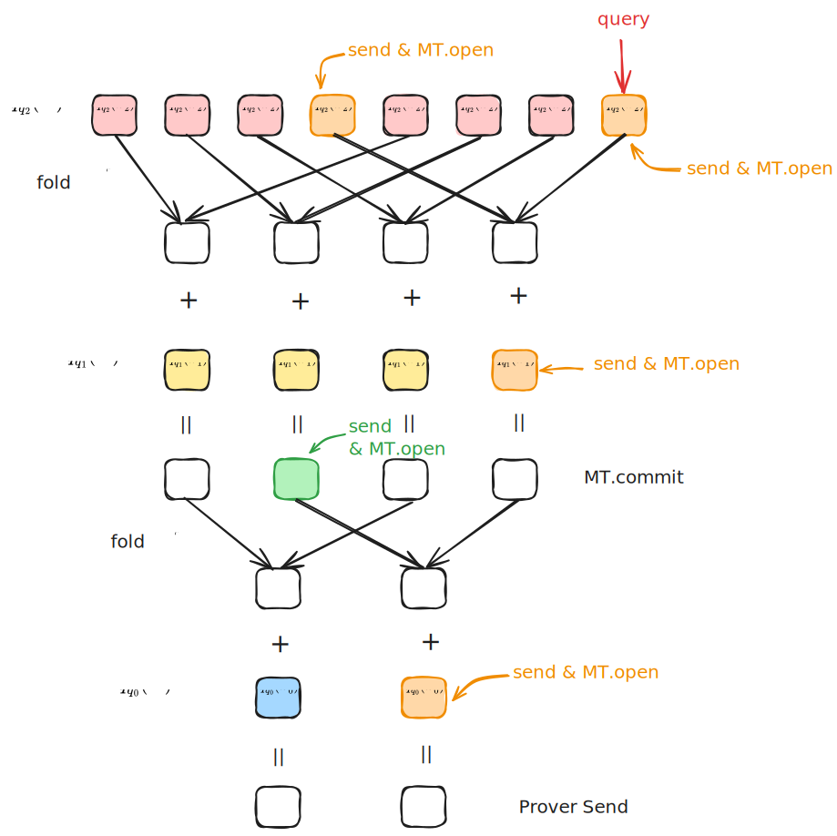
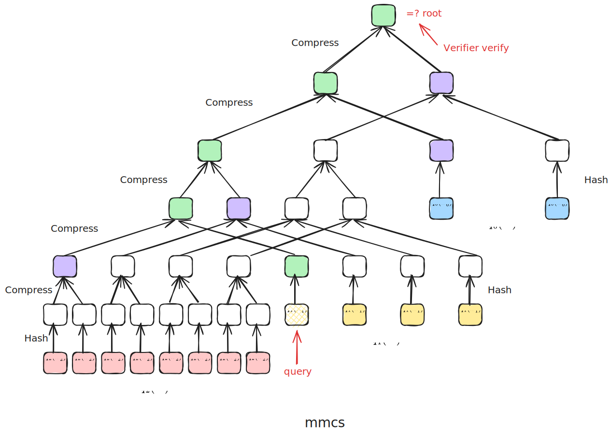
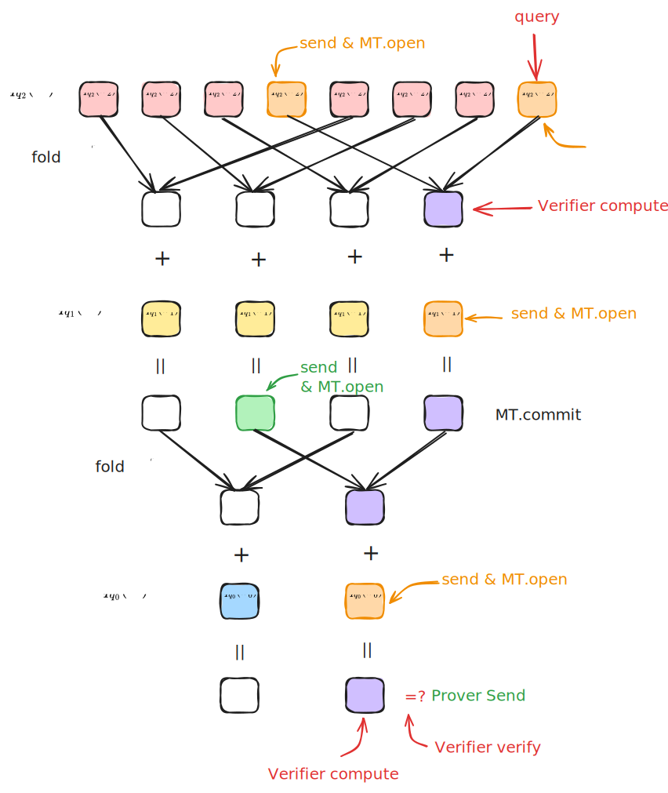

# Zeromroph-fri 协议复杂度分析

- Jade Xie <jade@secbit.io>
- Yu Guo <yu.guo@secbit.io>

## Evaluation 证明协议

- 协议描述文档：[Zeromorph-PCS: Integration with FRI](https://github.com/sec-bit/mle-pcs/blob/main/zeromorph/zeromorph-fri.md)

### 公共输入

- MLE 多项式 $\tilde{f}$ 的承诺 $\mathsf{cm}([[\tilde{f}]]_n)$
- 求值点 $\mathbf{u}=(u_0, u_1, \ldots, u_{n-1})$
- 求值结果 $v = \tilde{f}(\mathbf{u})$
- 码率参数：$\rho$
- FRI 协议中进行 low degree test 查询阶段的重复查询的次数参数: $l$
- FRI 协议中编码的乘法子群：$D, D^{(0)}, \ldots, D^{(n - 1)}$ 

### Witness

- MLE 多项式 $\tilde{f}$ 在 $n$ 维 HyperCube 上的点值向量 $\mathbf{a} = (a_0, a_1, \ldots, a_{2^n-1})$

### Round 1

Prover 发送余数多项式的承诺

- 计算 $n$ 个余数 MLE 多项式， $\{\tilde{q}_k\}_{k=0}^{n-1}$ ，其满足

$$
\tilde{f}(X_0,X_1,\ldots, X_{n-1}) - v = \sum_{k=0}^{n-1} (X_k-u_k) \cdot \tilde{q}_k(X_0,X_1,\ldots, X_{k-1})
$$

- 构造余数 MLE 多项式所映射到的 Univariate 多项式 $\hat{q}_k=[[\tilde{q}_k]]_k, \quad 0 \leq k < n$
- 计算并发送它们的承诺，这里用 mmcs 结构对这 $n$ 个多项式的值放在同一棵树上进行承诺。先分别计算这些多项式在对应 $D^{(k)}$ 上的值，计算

$$
\{[\hat{q}_k(x)|_{x \in D^{(k)}}]\}_{k = 0}^{n - 1}
$$

其中 $|D^{(k)}| = 2^k / \rho$ ，再用 mmcs 对这 $(2^{n - 1} + 2^{n - 2} + \ldots + 2^0)/\rho$ 个值一次进行承诺，记为

$$
\mathsf{cm}(\hat{q}_{n - 1}, \hat{q}_{n - 2}, \ldots, \hat{q}_0) = \mathsf{MMCS.commit}(\hat{q}_{n - 1}, \hat{q}_{n - 2}, \ldots, \hat{q}_0)
$$

#### Prover Cost Round 1

-  直接用 [Zeromorph](https://eprint.iacr.org/2023/917) 论文 Appendix A.2 的算法能计算出 $q_k$ 在 Hypercube 上的值，即可以得到 $\hat{q}_k$ 的系数，根据论文的结论，整个算法复杂度为 $(2^{n+1} - 3) ~ \mathbb{F}_{\mathsf{add}}$ 以及 $(2^{n} - 2) ~ \mathbb{F}_{\mathsf{mul}}$ 。这里不计入加法的复杂度，因此计算出 $\hat{q}_k=[[\tilde{q}_k]]_k, \quad 0 \leq k < n$ 的复杂度为 $(N - 2) ~ \mathbb{F}_{\mathsf{mul}}$ 。
- 计算 $\{[\hat{q}_k(x)|_{x \in D^{(k)}}]\}_{k = 0}^{n - 1}$ ，由于已经计算得到 $\hat{q}_k(X)$ 的系数，现在直接代入 $D^{(k)}$ 进行求值计算。在一个点进行求值，使用 FFT 方法进行计算。
	- 由于 $|D^{(k)}| = 2^k \cdot \mathcal{R}$ ，因此计算 $[\hat{q}_k(x)|_{x \in D^{(k)}}]$ 的复杂度为 $2^k\mathcal{R} \cdot \log(2^k\mathcal{R}) ~ \mathbb{F}_{\mathsf{mul}} =2^k \mathcal{R}(k + \log \mathcal{R}) ~ \mathbb{F}_{\mathsf{mul}}$ 。计算 $\{[\hat{q}_k(x)|_{x \in D^{(k)}}]\}_{k = 0}^{n - 1}$  的复杂度为

$$
\sum_{k = 0}^{n - 1} 2^k \mathcal{R}(k + \log \mathcal{R})  ~ \mathbb{F}_{\mathsf{mul}} 
$$

由于
$$
\sum_{k = 0}^{n - 1} 2^k = 2^0 + \ldots + 2^{n - 1} = \frac{2^0(1- 2^n)}{1- 2} = 2^n - 1
$$

$$
\sum_{k = 0}^{n - 1} k \cdot 2^k = (n - 2) \cdot 2^n + 2
$$


因此

$$
\begin{align}
 \sum_{k = 0}^{n - 1} 2^k \mathcal{R}(k + \log \mathcal{R})     & = \mathcal{R} \cdot\sum_{k = 0}^{n - 1} k \cdot 2^k  + \mathcal{R}\log \mathcal{R}  \cdot \sum_{k = 0}^{n - 1} 2^k  \\
 &  = \mathcal{R} \cdot nN + (\mathcal{R} \log \mathcal{R} - 2 \mathcal{R}) N + 2\mathcal{R}  - \mathcal{R}\log \mathcal{R}
\end{align}
$$

因此这一轮的复杂度为 $(\mathcal{R} \cdot nN + (\mathcal{R} \log \mathcal{R} - 2 \mathcal{R}) N + 2\mathcal{R}  - \mathcal{R}\log \mathcal{R}) ~\mathbb{F}_{\mathsf{mul}}$ 。

> [!summary] 
> 这一步有 $n$ 个多项式 $\hat{q}_k(X)$ 都需要在 $D^{(k)}$ 上求值，采用 FFT 的方法，复杂度为 $O(N \log N)$ 。

- 计算承诺 $\mathsf{cm}(\hat{q}_{n - 1}, \hat{q}_{n - 2}, \ldots, \hat{q}_0) = \mathsf{MMCS.commit}(\hat{q}_{n - 1}, \hat{q}_{n - 2}, \ldots, \hat{q}_0)$ ，树的高度为 $2 \cdot \log (2^{n - 1} \cdot \mathcal{R})$ ，涉及到的 Hash 计算有 $(2^{n - 1} + \cdots + 2^0) \cdot \mathcal{R}$ 个，一次 Hash 操作的复杂度记为 $H$ 。涉及到的 Compress 操作为 $2^{n - 2} \cdot \mathcal{R} + \ldots + 2^{0} \cdot \mathcal{R} + 1$ ，记为 $(2^{n - 2} \cdot \mathcal{R} + \ldots + 2^{0} \cdot \mathcal{R} + 1) ~ C$ ，因此这一步的复杂度为
  
$$
\begin{aligned}
  & \mathsf{MMCS.commit}(2^{n-1} \cdot \mathcal{R}, \ldots, \mathcal{R})\\
  = & ((2^{n - 1} + \cdots + 2^0) \cdot \mathcal{R}) ~ H + (2^{n - 2} \cdot \mathcal{R} + \ldots + 2^{0} \cdot \mathcal{R} + 1) ~ C \\
  = & (N - 1) \cdot \mathcal{R} ~ H  + ((N/2 - 1) \cdot \mathcal{R} + 1) ~ C
\end{aligned}
$$

总结下这一轮的总复杂度为

$$
\begin{align}
 & (N - 2) ~ \mathbb{F}_{\mathsf{mul}} + (\mathcal{R} \cdot nN + (\mathcal{R} \log \mathcal{R} - 2 \mathcal{R}) N + 2\mathcal{R}  - \mathcal{R}\log \mathcal{R}) ~\mathbb{F}_{\mathsf{mul}} \\
 & + \mathsf{MMCS.commit}(2^{n-1} \cdot \mathcal{R}, \ldots, \mathcal{R}) \\
=  & (\mathcal{R}\cdot nN + (\mathcal{R} \log \mathcal{R} - 2 \mathcal{R} + 1) N + 2\mathcal{R}  - \mathcal{R}\log \mathcal{R}  - 2) ~\mathbb{F}_{\mathsf{mul}}  \\
 & + \mathsf{MMCS.commit}(2^{n-1} \cdot \mathcal{R}, \ldots, \mathcal{R}) 
\end{align}
$$

### Round 2

1. Verifier 发送随机数 $\zeta \stackrel{\$}{\leftarrow} \mathbb{F} \setminus D$ 
2. Prover 计算并发送 $\hat{f}(\zeta)$ 
3. Prover 计算并发送  $\{\hat{q}_k(\zeta)\}_{k = 0}^{n - 1}$ 。

#### Prover Cost Round 2

- 计算 $\hat{f}(\zeta)$ ，Prover 有 $\hat{f}$ 的系数式，现在是求在一点的值，用 Horner 方法来计算，复杂度为 $N ~ \mathbb{F}_{\mathsf{mul}}$ 。

> [!note] 
> 如果用重心插值来计算，复杂度为 $(2N + 1) ~ \mathbb{F}_{\mathsf{mul}} + (N + 1) ~ \mathbb{F}_{\mathsf{inv}}$ ，计算量会更大。

- 计算 $\{\hat{q}_k(\zeta)\}_{k = 0}^{n - 1}$ ，复杂度为

  $$
    \sum_{k = 0}^{n - 1} 2^k ~ \mathbb{F}_{\mathsf{mul}} = (N - 1) ~ \mathbb{F}_{\mathsf{mul}}
  $$

这一轮的总复杂度为

$$
\begin{align}
N ~ \mathbb{F}_{\mathsf{mul}} + (N - 1) ~ \mathbb{F}_{\mathsf{mul}} = (2N - 1) ~ \mathbb{F}_{\mathsf{mul}}
\end{align}
$$


### Round 3

1. Verifier 发送随机数 $\lambda \stackrel{\$}{\leftarrow} \mathbb{F}$ 
2. Prover 计算 

$$
q_{f_\zeta}(X) = \frac{\hat{f}(X) - \hat{f}(\zeta)}{X - \zeta} + \lambda \cdot X \cdot \frac{\hat{f}(X) - \hat{f}(\zeta)}{X - \zeta}
$$
在 $D$ 上的值，即

$$
[q_{f_\zeta}(x)|_{x \in D}] = \big[\frac{\hat{f}(x) - \hat{f}(\zeta)}{x - \zeta} + \lambda \cdot x \cdot \frac{\hat{f}(x) - \hat{f}(\zeta)}{x - \zeta}\big|_{x \in D} \big]
$$

3. 对于 $0 \le k < n$ ，Prover 计算

$$
q_{\hat{q}_k}(X) = \frac{\hat{q_k}(X) - \hat{q}_k(\zeta)}{X - \zeta} + \lambda \cdot X \cdot \frac{\hat{q_k}(X) - \hat{q}_k(\zeta)}{X - \zeta}
$$

在 $D^{(k)}$ 上的值。

#### Prover Cost Round 3

- 计算 $[q_{f_\zeta}(x)|_{x \in D}]$ 。
	- 先通过 $f(X)$ 的系数式用 FFT 计算得到 $[f(x)|_{x \in D}]$ 。由于 $|D| = N \cdot \mathcal{R}$ ，因此复杂度为 $(\mathcal{R}N \cdot\log(\mathcal{R}N)) ~ \mathbb{F}_{\mathsf{mul}} = (\mathcal{R} \cdot nN + \mathcal{R}\log\mathcal{R} \cdot N) ~ \mathbb{F}_{\mathsf{mul}}$ 。
		- [ ] 可以避免 FFT，这里在 commit 阶段已经计算得到了 $[f(x)|_{x \in D}]$ 。
	- 再计算 $[q_{f_\zeta}(x)|_{x \in D}]$ ，每一个值涉及 $\mathbb{F}_{\mathsf{inv}} + \mathbb{F}_{\mathsf{mul}} + 2 ~ \mathbb{F}_{\mathsf{mul}} = 3 ~ \mathbb{F}_{\mathsf{mul}} + \mathbb{F}_{\mathsf{inv}}$ ，总共 $3\mathcal{R} \cdot N ~ \mathbb{F}_{\mathsf{mul}} + \mathcal{R} \cdot N\mathbb{F}_{\mathsf{inv}}$ 。
	- 因此整体计算复杂度为

$$
\begin{align}
& (\mathcal{R} \cdot nN + \mathcal{R}\log\mathcal{R} \cdot N) ~ \mathbb{F}_{\mathsf{mul}} + 3\mathcal{R} \cdot N ~ \mathbb{F}_{\mathsf{mul}} + \mathcal{R} \cdot N ~\mathbb{F}_{\mathsf{inv}} \\
= & (\mathcal{R} \cdot nN + (\mathcal{R}\log\mathcal{R} + 3 \mathcal{R}) \cdot N) ~ \mathbb{F}_{\mathsf{mul}} + \mathcal{R} \cdot N ~ \mathbb{F}_{\mathsf{inv}}
\end{align}
$$

> [!summary] 
> 计算 $[f(x)|_{x \in D}]$ 复杂度为 $O(N \log N)$ 。
  
- 计算 $[q_{\hat{q}_k}(x)|_{x \in D^{(k)}}]$ 。Round 1 已经计算出 $[\hat{q}_k(x)|_{x \in D^{(k)}}]$ ，由于 $|D_k| = 2^k \cdot \mathcal{R}$ ，因此这一步的复杂度为

$$
\begin{align}
\sum_{k = 0}^{n-1} 2^k \cdot \mathcal{R} \cdot (3 ~ \mathbb{F}_{\mathsf{mul}} + \mathbb{F}_{\mathsf{inv}})  & = (3 \mathcal{R}~ \mathbb{F}_{\mathsf{mul}} + \mathcal{R} ~\mathbb{F}_{\mathsf{inv}}) \cdot \sum_{k = 0}^{n-1} 2^k = (3 \mathcal{R}~ \mathbb{F}_{\mathsf{mul}} + \mathcal{R} ~\mathbb{F}_{\mathsf{inv}}) \cdot (N-1) \\
& = (3 \mathcal{R} \cdot N - 3 \mathcal{R} )~ \mathbb{F}_{\mathsf{mul}} + (\mathcal{R} \cdot N - \mathcal{R}) ~\mathbb{F}_{\mathsf{inv}}
\end{align}
$$

整理汇总 Round 3 的计算复杂度为

$$
\begin{aligned}
  & (\mathcal{R} \cdot nN + (\mathcal{R}\log\mathcal{R} + 3 \mathcal{R}) \cdot N) ~ \mathbb{F}_{\mathsf{mul}} + \mathcal{R} \cdot N ~ \mathbb{F}_{\mathsf{inv}} + (3 \mathcal{R} \cdot N - 3 \mathcal{R} )~ \mathbb{F}_{\mathsf{mul}} + (\mathcal{R} \cdot N - \mathcal{R}) ~\mathbb{F}_{\mathsf{inv}} \\
  = & (\mathcal{R} \cdot nN + (\mathcal{R}\log\mathcal{R} + 6 \mathcal{R}) \cdot N - 3 \mathcal{R} ) ~ \mathbb{F}_{\mathsf{mul}} + (2\mathcal{R} \cdot N - \mathcal{R}) ~ \mathbb{F}_{\mathsf{inv}}
\end{aligned}
$$

### Round 4

Prover 与 Verifier 进行 FRI 协议的 low degree test 交互，这里使用 rolling batch 技巧进行优化，对于 $k = 0, \ldots, n - 1$ ， 一次证明所有 $q_{\hat{q}_k}(X)$ 的次数小于 $2^k$ ，同时证明 $q_{f_\zeta}(X)$ 的次数小于 $2^n$ 。为了方便后续协议的叙述，这里记

$$
q_{\hat{q}_n}(X) := q_{f_\zeta}(X)
$$

因此 low degree test 的证明记为

$$
\pi_{q_{\hat{q}_{n}},q_{\hat{q}_{n - 1}}, \ldots, q_{\hat{q}_{0}}} \leftarrow \mathsf{OPFRI.LDT}(q_{\hat{q}_{n}},q_{\hat{q}_{n - 1}}, \ldots, q_{\hat{q}_{0}}, 2^{n})
$$

这里包含 $n + 1$ 轮的交互，直到最后折叠为常数多项式。下面用 $i$ 表示第 $i$ 轮，具体交互过程如下：

1. 初始化 $i = n$ ，记 $D^{(n)} := D$ ，对于 $x \in D^{(n)}$ ，初始化

$$
\mathsf{fold}^{(i)}(x) = q_{\hat{q}_{n}}(x)
$$

2. 当 $i = n - 1, \ldots, 0$ 时：

- Verifier 发送随机数 $\beta^{(i)}$

- 对于 $y \in D^{(i)}$ ，在 $D^{(i + 1)}$ 中找到 $x$ 满足 $x^2 = y$ ，Prover 计算

$$
\mathsf{fold}^{(i)}(y) = \frac{\mathsf{fold}^{(i + 1)}(x) + \mathsf{fold}^{(i + 1)}(-x)}{2} + \beta^{(i)} \cdot \frac{\mathsf{fold}^{(i + 1)}(x) - \mathsf{fold}^{(i + 1)}(-x)}{2x}
$$

-  对于 $x \in D^{(i)}$ ，Prover 更新 $\mathsf{fold}^{(i)}(x)$

$$
\mathsf{fold}^{(i)}(x) = \mathsf{fold}^{(i)}(x) + q_{\hat{q}_{i}}(x)
$$

- 当 $i > 0$ 时，
  - Prover 发送 $\mathsf{fold}^{(i)}(x)$ 的承诺，即

    $$
    \mathsf{cm}(\mathsf{fold}^{(i)}(X)) = \mathsf{MT.commit}([\mathsf{fold}^{(i)}(x)|_{x \in D^{(i)}}])
    $$
- 当 $i = 0$ 时，由于最后折叠到常数多项式，Prover 选取 $D^{(0)}$ 中的任意一个点 $y_0 \in D^{(0)}$，发送折叠到最后的值 $\mathsf{fold}^{(0)}(y_0)$ 。


#### Prover Cost Round 4

- 对于 $i = n-1，\ldots, 0$
	- Prover 计算
	
$$
\mathsf{fold}^{(i)}(y) = \frac{\mathsf{fold}^{(i + 1)}(x) + \mathsf{fold}^{(i + 1)}(-x)}{2} + \beta^{(i)} \cdot \frac{\mathsf{fold}^{(i + 1)}(x) - \mathsf{fold}^{(i + 1)}(-x)}{2x}
$$

计算方式还可以改为

  $$
    \mathsf{fold}^{(i)}(y) = (\frac{1}{2} + \frac{\beta^{(i)}}{2x}) \cdot \mathsf{fold}^{(i + 1)}(x) + (\frac{1}{2} - \frac{\beta^{(i)}}{2x}) \cdot \mathsf{fold}^{(i + 1)}(-x)
  $$

  plonky3 中采用了 [fold_even_odd.rs](https://github.com/Plonky3/Plonky3/blob/main/fri/src/fold_even_odd.rs) 下面这种计算方式。

```rust
#[instrument(skip_all, level = "debug")]
pub fn fold_even_odd<F: TwoAdicField>(poly: Vec<F>, beta: F) -> Vec<F> {
    // We use the fact that
    //     p_e(x^2) = (p(x) + p(-x)) / 2
    //     p_o(x^2) = (p(x) - p(-x)) / (2 x)
    // that is,
    //     p_e(g^(2i)) = (p(g^i) + p(g^(n/2 + i))) / 2
    //     p_o(g^(2i)) = (p(g^i) - p(g^(n/2 + i))) / (2 g^i)
    // so
    //     result(g^(2i)) = p_e(g^(2i)) + beta p_o(g^(2i))
    //                    = (1/2 + beta/2 g_inv^i) p(g^i)
    //                    + (1/2 - beta/2 g_inv^i) p(g^(n/2 + i))
    let m = RowMajorMatrix::new(poly, 2);
    let g_inv = F::two_adic_generator(log2_strict_usize(m.height()) + 1).inverse();
    let one_half = F::TWO.inverse();
    let half_beta = beta * one_half;

    // TODO: vectorize this (after we have packed extension fields)

    // beta/2 times successive powers of g_inv
    let mut powers = g_inv
        .shifted_powers(half_beta)
        .take(m.height())
        .collect_vec();
    reverse_slice_index_bits(&mut powers);

    m.par_rows()
        .zip(powers)
        .map(|(mut row, power)| {
            let (r0, r1) = row.next_tuple().unwrap();
            (one_half + power) * r0 + (one_half - power) * r1
        })
        .collect()
}
```

  可以先计算出 $2^{-1}$ 复杂度为 $\mathbb{F}_{\mathsf{inv}}$ 。
  
  在第 $i$ 轮，计算 $\frac{\beta^{(i)}}{2} = \beta^{(i)} \cdot 2^{-1}$ ，复杂度为 $\mathbb{F}_{\mathsf{mul}}$ 。

  对于每一个 $y \in D_i$ ，计算 $\mathsf{fold}^{(i)}(y)$ ，计算 $x^{-1}$ ，再相乘，复杂度为 $\mathbb{F}_{\mathsf{inv}} + 3 ~\mathbb{F}_{\mathsf{mul}}$ ，而 $|D_i| = 2^{i} \cdot \mathcal{R}$ ，这一步的复杂度为 $2^{i} \cdot \mathcal{R} ~\mathbb{F}_{\mathsf{inv}} + 3 \cdot 2^{i} \cdot \mathcal{R} ~\mathbb{F}_{\mathsf{mul}}$ 。

  对于每一个 $i$ ，计算的总复杂度为

  $$
    (2^{i} \cdot \mathcal{R}) ~\mathbb{F}_{\mathsf{inv}} + (3 \cdot 2^{i} \cdot \mathcal{R}+ 1) ~\mathbb{F}_{\mathsf{mul}}
  $$

  因此总复杂度为

  $$
  \mathbb{F}_{\mathsf{inv}} + \sum_{i = 0}^{n - 1}((2^{i} \cdot \mathcal{R}) ~\mathbb{F}_{\mathsf{inv}} + (3 \cdot 2^{i} \cdot \mathcal{R}+ 1) ~\mathbb{F}_{\mathsf{mul}}) = (\mathcal{R}N - \mathcal{R} + 1) ~\mathbb{F}_{\mathsf{inv}} +  (3\mathcal{R}N + n - 3\mathcal{R}) ~\mathbb{F}_{\mathsf{mul}}
  $$
  
  - 如果 $i > 0$ ，Prover 发送 $[\mathsf{fold}^{(i)}(x)|_{x \in D_{i}}]$ 的 Merkle Tree 承诺，这里主要是涉及 Hash 操作，树的高度为 $\log (2^{i} \cdot \mathcal{R})= i + \log(\mathcal{R})$ 。如果树的叶子节点有 $2^k$ 个，那么需要进行的哈希操作有 $2^{k - 1} + 2^{k - 2} + \ldots + 2 + 1 = 2^k - 1$ 次。即 $\mathsf{MT.commit}(2^{i} \cdot \mathcal{R}) = (2^{i} \cdot \mathcal{R} - 1) ~ H$ 。

总结上述所有的计算，对于折叠，总共要折叠 $n$ 次，复杂度为 $(\mathcal{R}N - \mathcal{R} + 1) ~\mathbb{F}_{\mathsf{inv}} +  (3\mathcal{R}N + n - 3\mathcal{R}) ~\mathbb{F}_{\mathsf{mul}}$ 。对于 Merkle Tree 承诺，复杂度为

$$
\sum_{i = 1}^{n - 1}\mathsf{MT.commit}(2^{i} \cdot \mathcal{R})
$$

因此这一轮的总复杂度为

$$
\begin{aligned}
  &    (3\mathcal{R}N + n - 3\mathcal{R}) ~\mathbb{F}_{\mathsf{mul}}+ (\mathcal{R}N - \mathcal{R} + 1) ~\mathbb{F}_{\mathsf{inv}} +\sum_{i = 1}^{n - 1}\mathsf{MT.commit}(2^{i} \cdot \mathcal{R}) \\
\end{aligned}
$$

> [!note] 
一般地，要证明一个多项式的次数小于 $2^n$ ，在 FRI low degree test 阶段的复杂度如上所示。

### Round 5

这一轮是接着 Prover 与 Verifier 进行 FRI 协议的 low degree test 交互的查询阶段，Verifier 重复查询 $l$ 次 ：
- Verifier 从 $D^{(n)}$ 中随机选取一个数 $t^{(n)} \stackrel{\$}{\leftarrow} D^{(n)}$
- Prover 发送 $\hat{f}(t^{(n)}), \hat{f}(- t^{(n)})$ 的值，并附上 Merkle Path。
  
  $$
  \{(\hat{f}(t^{(n)}), \pi_{\hat{f}}(t^{(n)}))\} \leftarrow \mathsf{MT.open}([\hat{f}(x)|_{x \in D_0}], t^{(n)})
  $$

  $$
  \{(\hat{f}(-t^{(n)}), \pi_{\hat{f}}(-t^{(n)}))\} \leftarrow \mathsf{MT.open}([\hat{f}(x)|_{x \in D_0}], -t^{(n)})
  $$
  
- 对于 $i = n - 1, \ldots, 1$，
  - Prover 计算 $t^{(i)} = (t^{(i + 1)})^2$
  - Prover 发送 $\hat{q}_{i}(t^{(i)})$ 及其 Merkle Path
      $$
      \{(\hat{q}_{i}(t^{(i)}), \pi_{\hat{q}_{i}}(t^{(i)}))\} \leftarrow \mathsf{MMCS.open}(\hat{q}_{i}, t^{(i)})
      $$

  - Prover 发送 $\mathsf{fold}^{(i)}(-t^{(i)})$ 及其 Merkle Path
      $$
      \{(\mathsf{fold}^{(i)}(-t^{(i)}), \pi_{\mathsf{fold}^{(i)}}(-t^{(i)}))\} \leftarrow \mathsf{MT.open}(\mathsf{fold}^{(i)}, -t^{(i)})
      $$ 
- 对于 $i = 0$ 时，
  - Prover 计算 $t^{(0)} = (t^{(1)})^2$
  - Prover 发送 $\hat{q}_0(s^{(0)})$ 及其 Merkle Path
      $$
      \{(\hat{q}_0(t^{(0)}), \pi_{\hat{q}_0}(t^{(0)}))\} \leftarrow \mathsf{MMCS.open}(\hat{q}_0, t^{(0)})
      $$


> 📝 **Notes**
>
> 例如对 3 个多项式进行 query，query 选取的是 $q_{\hat{q}_2}(X)$ 中的最后一个元素 $\omega_2^7$，那么 Prover 需要发送的值及其 Merkle Path 是下图中绿色部分，橙色边框标记的发送的并非商多项式本身的值和对应的 Merkle Path，而是 $\hat{q}_k(X)$ 的 Merkle Path，即 Prover 会发送
>
> $$
> \{\hat{q_2}(\omega_2^7), \hat{q_2}(\omega_2^3), \hat{q}_1(\omega_1^3), \mathsf{fold}^{(1)}(\omega_1^1),  \hat{q}_0(\omega_0^1)\}
> $$
>
> 以及这些值对应的 Merkle Path。
> 
> 

#### Prover Cost Round 5

在查询阶段，Prover 的计算复杂度主要来自计算 $s^{(i + 1)} = (s^{(i)})^2$ ，但这些数都是来自 $D_i$ 中的元素，不需要再额外计算，可以通过索引值得到。

### Prover Cost

汇总 Prover Cost，

$$
\begin{aligned}
& (\mathcal{R}\cdot nN + (\mathcal{R} \log \mathcal{R} - 2 \mathcal{R} + 1) N + 2\mathcal{R}  - \mathcal{R}\log \mathcal{R}  - 2) ~\mathbb{F}_{\mathsf{mul}}  + \mathsf{MMCS.commit}(2^{n-1} \cdot \mathcal{R}, \ldots, \mathcal{R}) \\
& + (2N - 1) ~ \mathbb{F}_{\mathsf{mul}} \\
& + (\mathcal{R} \cdot nN + (\mathcal{R}\log\mathcal{R} + 6 \mathcal{R}) \cdot N - 3 \mathcal{R} ) ~ \mathbb{F}_{\mathsf{mul}} + (2\mathcal{R} \cdot N - \mathcal{R}) ~ \mathbb{F}_{\mathsf{inv}} \\
& + (3\mathcal{R}N + n - 3\mathcal{R}) ~\mathbb{F}_{\mathsf{mul}}+ (\mathcal{R}N - \mathcal{R} + 1) ~\mathbb{F}_{\mathsf{inv}} +\sum_{i = 1}^{n - 1}\mathsf{MT.commit}(2^{i} \cdot \mathcal{R}) \\
& + (\frac{3}{2} \mathcal{R} \cdot N + n - 3 \mathcal{R} - 1) ~\mathbb{F}_{\mathsf{mul}} + (\frac{1}{2} \mathcal{R} \cdot N - \mathcal{R}) ~\mathbb{F}_{\mathsf{inv}} + \sum_{i = 1}^{n - 2}\mathsf{MT.commit}(2^{i} \cdot \mathcal{R}) \\
= & (2\mathcal{R}\cdot nN + (2\mathcal{R} \log \mathcal{R} + 7 \mathcal{R} + 3) \cdot  N + n -  \mathcal{R}\log \mathcal{R} - 4 \mathcal{R} - 3) ~\mathbb{F}_{\mathsf{mul}} + (3 \mathcal{R} \cdot N - 2 \mathcal{R} + 1) ~\mathbb{F}_{\mathsf{inv}} \\
& + \mathsf{MMCS.commit}(2^{n-1} \cdot \mathcal{R}, \ldots, \mathcal{R}) + \sum_{i = 1}^{n - 1}\mathsf{MT.commit}(2^{i} \cdot \mathcal{R})\\
\end{aligned}
$$

### Proof

Prover 发送的证明为

$$
\begin{aligned}
  \pi = \left(\mathsf{cm}(\hat{q}_{n - 1}, \hat{q}_{n - 2}, \ldots, \hat{q}_0), \hat{f}(\zeta), \hat{q}_0(\zeta), \ldots, \hat{q}_{n - 1}(\zeta), \pi_{q_{\hat{q}_{n}},q_{\hat{q}_{n - 1}}, \ldots, q_{\hat{q}_{0}}}\right)
\end{aligned}
$$

用符号 $\{\cdot\}^l$ 表示在 FRI low degree test 的查询阶段重复查询 $l$ 次产生的证明，由于每次查询是随机选取的，因此花括号中的证明也是随机的。那么 FRI 进行 low degree test 的证明为

$$
\begin{aligned}
  \pi_{q_{\hat{q}_{n}}, \ldots, q_{\hat{q}_{0}}} = &  ( \mathsf{cm}(\mathsf{fold}^{(n - 1)}(X)), \ldots, \mathsf{cm}(\mathsf{fold}^{(1)}(X)),\mathsf{fold}^{(0)}(y_0),  \\
  & \, \{\hat{f}(t^{(n)}), \pi_{\hat{f}}(t^{(n)}), \hat{f}(- t^{(n)}), \pi_{\hat{f}}(- t^{(n)}),\\
  & \quad \hat{q}_{n - 1}(t^{(n - 1)}), \pi_{\hat{q}_{n - 1}}(t^{(n - 1)}), \mathsf{fold}^{(n - 1)}(-t^{(n - 1)}), \pi_{\mathsf{fold}^{(n - 1)}}(-t^{(n - 1)}), \ldots, \\
  & \quad \hat{q}_{1}(t^{(1)}), \pi_{\hat{q}_{1}}(t^{(1)}), \mathsf{fold}^{(1)}(-t^{(1)}), \pi_{\mathsf{fold}^{(1)}}(-t^{(1)}), \hat{q}_0(t^{(0)}), \pi_{\hat{q}_0}(t^{(0)})\}^l)
\end{aligned}
$$

#### Proof Size

1. $\mathsf{cm}(\hat{q}_{n - 1}, \hat{q}_{n - 2}, \ldots, \hat{q}_0)$ ，这里承诺是用 mmcs 结构进行承诺的，发送的是一个 Hash 值，记为 $H$ 。
2. $\hat{f}(\zeta), \hat{q}_0(\zeta), \ldots, \hat{q}_{n - 1}(\zeta)$ ，都是有限域中的值，大小为 $(n + 1) ~ \mathbb{F}$ 。

**计算 $\pi_{q_{\hat{q}_{n}},q_{\hat{q}_{n - 1}}, \ldots, q_{\hat{q}_{0}}}$ 的大小**

- $\mathsf{cm}(\mathsf{fold}^{(n - 1)}(X)), \mathsf{cm}(\mathsf{fold}^{(n - 2)}(X)), \ldots, \mathsf{cm}(\mathsf{fold}^{(1)}(X)),\mathsf{fold}^{(0)}(y_0)$ 的大小为 $n ~ H + \mathbb{F}$ 。

重复 $l$ 次：
- $\hat{f}(t^{(n)}), \pi_{\hat{f}}(t^{(n)}), \hat{f}(- t^{(n)}), \pi_{\hat{f}}(-t^{(n)})$ ，其中 $\pi_{\hat{f}}(t^{(n)})$ 与 $\pi_{\hat{f}}(-t^{(n)})$ 都是 Merkle Path，这里 $\hat{f}$ 是用 Merkle Tree 结构进行承诺的，该树的叶子节点有 $2^n \cdot \mathcal{R}$ 个。为了减少这一步打开点发送的 Merkle Path，在用 Merkle Tree 进行承诺时，这里可以将 $\hat{f}(s^{(0)}), \hat{f}(- s^{(0)})$ 放在相邻的叶子节点上，发送的哈希值有 $\log(2^n \cdot \mathcal{R} - 1) ~H$ 。这里也记发送的哈希值的个数为 $(\mathsf{MT.open}(2^n \cdot \mathcal{R}) - 1) ~ H$ 。

其中 $\mathsf{MT.open}(x)$ 表示在 Merkle Tree 中承诺 $x$ 个叶子节点时，其需要发送的 Merkle Path 中的哈希值的个数，那么

$$
\mathsf{MT.open}(x) = \log x
$$

因此这一步发送的证明大小为

$$
2 ~ \mathbb{F} + (\mathsf{MT.open}(2^n \cdot \mathcal{R}) - 1) ~ H = 2 ~ \mathbb{F} + (n + \log \mathcal{R} - 1) ~ H
$$
- 对于 $i = n-1, \ldots, 1$ ，发送 $\hat{q}_{i}(t^{(i)}), \pi_{\hat{q}_{i}}(t^{(i)}), \mathsf{fold}^{(i)}(-t^{(i)}), \pi_{\mathsf{fold}^{(i)}}(-t^{(i)})$ 。

对于 $\hat{q}_{i}(t^{(i)}), \pi_{\hat{q}_{i}}(t^{(i)})$ ，这里需要发送 mmcs 结构中的 merkle path 。



例如要打开 $\hat{q}_{1}(\omega_1^0)$ ，那么图中紫色的哈希值是 Prover 发送的证明。在 Verifier 进行验证阶段，其可以计算出图中绿色部分的值，最后比较树中最上端的绿色方块的值是否和 Prover 之前承诺时发送的根节点值相等。

$\hat{q}_{i}(t^{(i)})$ 所对应的 $\hat{q}_i(X)$ 承诺时有 $2^i \cdot \mathcal{R}$ 个值。那么 $\pi_{\hat{q}_{i}}(t^{(i)})$ 要发送的哈希值有 $2 (\log(2^{i} \cdot \mathcal{R})) =2i + 2 \log \mathcal{R}$ 个。

$\mathsf{fold}^{(i)}(x)$ 所在的 Merkle Tree 的树的高度为 $i + \log \mathcal{R}$ 。对于 $\mathsf{fold}^{(i)}(-t^{(i)}), \pi_{\mathsf{fold}^{(i)}}(-t^{(i)})$ ，用的是 Merkle 树承诺，树的高度为 $i + \log \mathcal{R}$ ，那么发送的哈希值有 $i + \log \mathcal{R}$ 个。

因此对于每一轮 $i$ ，其大小为 $2 ~ \mathbb{F} +(3i + 3\log \mathcal{R}) ~ H$ 。总复杂度为

$$
\begin{aligned}
  & \sum_{i = 1}^{n - 1} (2 ~ \mathbb{F} +(3i + 3\log \mathcal{R}) ~ H) \\
  = & (2n - 2) ~ \mathbb{F} + (\frac{3(n - 1)n}{2} + 3(n - 1) \log \mathcal{R}) ~ H \\
  = & (2n - 2) ~ \mathbb{F} + (\frac{3}{2} n^2 + (3\log \mathcal{R} - \frac{3}{2}) n  - 3 \log \mathcal{R})  ~ H
\end{aligned}
$$

- 对于 $\hat{q}_0(t^{(0)}), \pi_{\hat{q}_0}(t^{(0)})$ ，依然是 mmcs 结构打开，$\pi_{\hat{q}_{0}}(t^{(0)})$ 要发送的哈希值有 $2 (\log(2^{0} \cdot \mathcal{R})) =2 \log \mathcal{R}$ 个 ，因此总复杂度为

$$
\mathbb{F} + 2 \log \mathcal{R} ~H
$$

因此 $\pi_{q_{\hat{q}_{n}}, \ldots, q_{\hat{q}_{0}}}$ 的大小为

$$
\begin{align}
 & n ~ H + \mathbb{F} \\
 & + l \cdot (2 ~ \mathbb{F} + (n + \log \mathcal{R} - 1) ~ H)  \\
 & + l \cdot ((2n - 2) ~ \mathbb{F} + (\frac{3}{2} n^2  + (3\log \mathcal{R} - \frac{3}{2}) n  - 3 \log \mathcal{R})  ~ H )\\
& + l \cdot (\mathbb{F} + 2 \log \mathcal{R} ~H) \\
 & = (2l \cdot n + 3l - 1) ~ \mathbb{F} + (\frac{3}{2} l \cdot n^2  + (3\log \mathcal{R}l  - \frac{1}{2}l + 1) n  - l)  ~ H
\end{align}
$$

因此 proof size 总大小为

$$
\begin{align}
 & H + (n + 1) ~ \mathbb{F} + (2l \cdot n + 3l - 1) ~ \mathbb{F} + (\frac{3}{2} l \cdot n^2  + (3\log \mathcal{R}l  - \frac{1}{2}l + 1) n  - l)  ~ H \\
=  & ((2l + 1) \cdot n + 3l) ~ \mathbb{F} + (\frac{3}{2} l \cdot n^2  + (3\log \mathcal{R}l  - \frac{1}{2}l + 1) n  - l + 1)  ~ H
\end{align}
$$

### Verification

Verifier：

#### Step 1


1. 对 $q_{f_{\zeta}}(X)$ 以及 $n$ 个商多项式 $\{q_{\hat{q}_k}\}_{k = 0}^{n - 1}$ 一次进行 low degree test 的验证，记为

$$
\mathsf{OPFRI.verify}( \pi_{q_{\hat{q}_{n}},q_{\hat{q}_{n-1}}, \ldots, q_{\hat{q}_{0}}}, 2^{n}) \stackrel{?}{=} 1
$$

具体过程为，Verifier 重复 $l$ 次：

- Verifier 验证 $\hat{f}(t^{(n)}), \hat{f}(-t^{(n)})$ 的正确性

$$
\mathsf{MT.verify}(\mathsf{cm}(\hat{f}(X), \hat{f}(t^{(n)}), \pi_{\hat{f}}(t^{(n)})) \stackrel{?}{=} 1
$$

$$
\mathsf{MT.verify}(\mathsf{cm}(\hat{f}(X), \hat{f}(-t^{(n)}), \pi_{\hat{f}}(-t^{(n)})) \stackrel{?}{=} 1
$$

$\hat{f}$ Merkle 数的高度为 $2^n \cdot \mathcal{R}$ 。Merkle Path 中发送了 $n + \log \mathcal{R} - 1$ 个哈希值，这里按 bit reverse 方式将相差一个符号的两个点的值放在相邻的两个叶子节点上，因此这里要验证计算时复杂度为

$$
\mathsf{MTV}(2^n \cdot \mathcal{R}) = (n + \log \mathcal{R} - 1) ~ H
$$

- Verifier 计算

$$
q_{\hat{q}_{n}}(t^{(n)}) = (1 + \lambda \cdot t^{(n)}) \cdot \frac{\hat{f}(t^{(n)}) - \hat{f}(\zeta)}{t^{(n)} - \zeta}
$$

$$
q_{\hat{q}_{n}}(-t^{(n)}) = (1 - \lambda \cdot t^{(n)}) \cdot \frac{\hat{f}(-t^{(n)}) - \hat{f}(\zeta)}{-t^{(n)} - \zeta}
$$

复杂度为  $5 ~ \mathbb{F}_{\mathsf{mul}} + 2 ~ \mathbb{F}_{\mathsf{inv}}$ 。

- 初始化 $\mathsf{fold}$ 的值为 

    $$
        \mathsf{fold} = \frac{q_{\hat{q}_{n}}(t^{(n)}) + q_{\hat{q}_{n}}(-t^{(n)})}{2} + \beta^{(n - 1)} \cdot \frac{q_{\hat{q}_{n}}(t^{(n)}) - q_{\hat{q}_{n}}(-t^{(n)})}{2 \cdot t^{(n)}}
    $$
	
> 复杂度为 $2 ~ \mathbb{F}_{\mathsf{inv}} + 4 ~ \mathbb{F}_{\mathsf{mul}}$ 

- 对于 $i = n - 1, \ldots , 1$
  - Verifier 计算 $t^{(i)} = (t^{(i + 1)})^2$
  - 验证 $\hat{q}_{i}(t^{(i)})$ 值的正确性，
  
$$
\mathsf{MMCS.verify}(\mathsf{cm}(\hat{q}_{n - 1}, \hat{q}_{n - 2}, \ldots, \hat{q}_0), \hat{q}_{i}(t^{(i)}), \pi_{\hat{q}_{i}}(t^{(i)})) \stackrel{?}{=} 1
$$
	  
  > Verifier 会根据 Prover 发送的证明来计算哈希值进行验证，Prover 发送的哈希值有 $2i + 2 \log \mathcal{R}$ 个，由于 Verifier 还会计算 $\hat{q}_{i}(t^{(i)}$ 的哈希值，因此复杂度为 $(2i + 2 \log \mathcal{R}) ~ C + H$ 。
	  
  - Verifier 计算
  
      $$
      q_{\hat{q}_{i}}(t^{(i)}) = (1 + \lambda \cdot t^{(i)}) \cdot \frac{\hat{q}_{i}(t^{(i)}) - \hat{q}_{i}(\zeta)}{t^{(i)} - \zeta}
      $$

> 计算复杂度为 $\mathbb{F}_{\mathsf{inv}} + 3~ \mathbb{F}_{\mathsf{mul}}$ 。

  - 更新 $\mathsf{fold}$ 的值为

$$
\mathsf{fold} = \mathsf{fold} + q_{\hat{q}_{i}}(t^{(i)})
$$ 
  - Verifier 验证 $\mathsf{fold}^{(i)}(-t^{(i)})$ 值的正确性，
  
      $$
      \mathsf{MT.verify}(\mathsf{cm}(\mathsf{fold}^{(i)}(X)), \mathsf{fold}^{(i)}(-t^{(i)}), \pi_{\mathsf{fold}^{(i)}}(-t^{(i)})) \stackrel{?}{=} 1
      $$
  
  > Verifier 的计算取决于 Merkle 树的高度，Merkle 树的高度为  $i + \log \mathcal{R}$ 。要进行的 Hash 计算为树的高度，即 $(i + \log \mathcal{R}) ~ H$ 。

  - 更新 $\mathsf{fold}$ 的值
  
    $$
        \mathsf{fold} = \frac{\mathsf{fold}^{(i)}(-t^{(i)}) + \mathsf{fold}}{2} + \beta^{(i - 1)} \cdot \frac{\mathsf{fold}^{(i)}(-t^{(i)}) - \mathsf{fold}}{2 \cdot t^{(i)}}
    $$
	
> 这里 verifier 的计算复杂度为 $2 ~ \mathbb{F}_{\mathsf{inv}} + 4 ~ \mathbb{F}_{\mathsf{mul}}$ 。

- 对于 $i = 0$ 时
  - Verifier 计算 $t^{(0)} = (t^{(1)})^2$
  - 验证 $\hat{q}_0(t^{(0)})$ 值的正确性，
  
      $$
      \mathsf{MMCS.verify}(\mathsf{cm}(\hat{q}_{n - 1}, \hat{q}_{n - 2}, \ldots, \hat{q}_0), \hat{q}_0(t^{(0)}), \pi_{\hat{q}_0}(t^{(0)})) \stackrel{?}{=} 1
      $$

    > Verifier 的计算复杂度为 $H + C$ 。

  - Verifier 计算
  
      $$
      q_{\hat{q}_0}(t^{(0)}) = (1 + \lambda \cdot t^{(0)}) \cdot \frac{\hat{q}_0(t^{(0)}) - \hat{q}_0(\zeta)}{t^{(0)} - \zeta}
      $$

> 计算复杂度为 $\mathbb{F}_{\mathsf{inv}} + 3~ \mathbb{F}_{\mathsf{mul}}$ 。
	  
  - Verifier 验证下面式子的正确性
  
    $$    
        \mathsf{fold}^{(0)}(y_0) \stackrel{?}{=} \mathsf{fold} + q_{\hat{q}_0}(t^{(0)})
    $$

> 📝 **Notes**
> 
> 例如对于前面 Verifier 查询的例子，这里 Verifier 通过 Prover 发送的值，计算图中紫色的值，以及验证 Prover 发送的关于橙色部分的 Merkle Tree 的证明，最后 Verifier 验证自己计算得到的最后一个紫色部分的值是否等于 Prover 之前发送的值。
> 
> 


##### Verifier Cost 1

汇总上面 Verifier 的复杂度

$$
\begin{align}
 & (n + \log \mathcal{R} - 1) ~ H + 5 ~ \mathbb{F}_{\mathsf{mul}} + 2 ~ \mathbb{F}_{\mathsf{inv}} + 2 ~ \mathbb{F}_{\mathsf{inv}} + 4 ~ \mathbb{F}_{\mathsf{mul}}  \\
 & + \sum_{i = 1}^{n - 1} \left( (2i + 2 \log \mathcal{R}) ~ C + H + \mathbb{F}_{\mathsf{inv}} + 3~ \mathbb{F}_{\mathsf{mul}} + (i + \log \mathcal{R}) ~ H + 2 ~ \mathbb{F}_{\mathsf{inv}} + 4 ~ \mathbb{F}_{\mathsf{mul}} \right) \\
& + H + C + \mathbb{F}_{\mathsf{inv}} + 3~ \mathbb{F}_{\mathsf{mul}} \\
=  & (7n + 5) ~ \mathbb{F}_{\mathsf{mul}} + (3n + 2) ~ \mathbb{F}_{\mathsf{inv}}  \\
 & + (\frac{1}{2} n^2 + (\frac{3}{2} + \log \mathcal{R})n - 1) ~H + (n^2 + (2 \log \mathcal{R} - 1) n + 1 - 2\log \mathcal{R}) ~C
\end{align}
$$

由于要重复 $l$ 次，因此还要乘上 $l$ ，复杂度为

$$
(ln^2 + (2 \log \mathcal{R}l - l) n + l - 2 \log \mathcal{R}l) ~C + (\frac{l}{2} n^2 + (\frac{3l}{2} + \log \mathcal{R}l)n - l) ~H + (7ln + 5l) ~ \mathbb{F}_{\mathsf{mul}} + (3ln + 2l) ~ \mathbb{F}_{\mathsf{inv}}
$$

#### Step 2

2. 计算 $\Phi_n(\zeta)$ 以及 $\Phi_{n - k}(\zeta^{2^k})(0 \le k < n)$ ，由于

$$
\Phi_k(X^h) = 1 + X^h + X^{2h} + \ldots + X^{(2^{k}-1)h}
$$

因此
$$
\Phi_n(\zeta) = 1 + \zeta + \zeta^2 + \ldots + \zeta^{2^n-1}
$$

$$
\Phi_{n-k}(\zeta^{2^k}) = 1 + \zeta^{2^k} + \zeta^{2\cdot 2^k} + \ldots + \zeta^{(2^{n-k}-1)\cdot 2^k}
$$

##### Verifier Cost 2

Verifier 计算 

$$
\begin{align}
\Phi_k(X^h)  & = 1 + X^h + X^{2h} + \ldots + X^{(2^{k}-1)h}  \\
 & = \frac{1 - (X^h)^{2^k}}{1 - X^h}
\end{align}
$$

因此

$$
\Phi_n(\zeta) = \frac{1 - \zeta^{2^n}}{1 - \zeta}
$$

$$
\begin{align}
\Phi_{n - k}(\zeta^{2^k})  & = \frac{1 - (\zeta^{2^k})^{2^{n - k}}}{1 - \zeta^{2^k}} \\
 & = \frac{1 - \zeta^{2^n}}{1 - \zeta^{2^k}}
\end{align}
$$


- 对于 $k = 0, 1, \ldots, n - 1$ ，先计算 $\zeta^{2^1}, \zeta^{2^2}, \ldots, \zeta^{2^{n - 1}}, \zeta^{2^n}$ ，复杂度为 $n ~ \mathbb{F}_{\mathsf{mul}}$ 。
- 对于 $k = 0, 1, \ldots, n - 1$ ，计算 $1 - \zeta^{2^k}$ 的逆再和分子相乘，总复杂度为 $n ~ \mathbb{F}_{\mathsf{mul}} + n ~ \mathbb{F}_{\mathsf{inv}}$ 。

因此这一步的总复杂度为

$$
2n ~ \mathbb{F}_{\mathsf{mul}} + n ~ \mathbb{F}_{\mathsf{inv}}
$$

#### Step 3

验证下述等式的正确性

$$
\hat{f}(\zeta) - v\cdot\Phi_n(\zeta) = \sum_{k = 0}^{n - 1} \Big(\zeta^{2^k}\cdot \Phi_{n-k-1}(\zeta^{2^{k+1}}) - u_k\cdot\Phi_{n-k}(\zeta^{2^k})\Big)\cdot \hat{q}_k(\zeta)
$$

##### Verifier Cost 3

- 计算 $v\cdot\Phi_n(\zeta)$ 复杂度为 $\mathbb{F}_{\mathsf{mul}}$ 。
- 计算 $\sum_{k = 0}^{n - 1} \Big(\zeta^{2^k}\cdot \Phi_{n-k-1}(\zeta^{2^{k+1}}) - u_k\cdot\Phi_{n-k}(\zeta^{2^k})\Big)\cdot \hat{q}_k(\zeta)$ 复杂度为 

$$
\sum_{k = 0}^{n - 1} 3 ~ \mathbb{F}_{\mathsf{mul}} = 3n ~ \mathbb{F}_{\mathsf{mul}}
$$

因此总复杂度为 $(3n + 1) ~ \mathbb{F}_{\mathsf{mul}}$ 。

### Verifier Cost

汇总 Verifier 的复杂度

$$
\begin{align}
 & (ln^2 + (2 \log \mathcal{R}l - l) n + l - 2 \log \mathcal{R}l) ~C + (\frac{l}{2} n^2 + (\frac{3l}{2} + \log \mathcal{R}l)n - l) ~H + (7ln + 5l) ~ \mathbb{F}_{\mathsf{mul}} + (3ln + 2l) ~ \mathbb{F}_{\mathsf{inv}} \\
 & + 2n ~ \mathbb{F}_{\mathsf{mul}} + n ~ \mathbb{F}_{\mathsf{inv}} + (3n + 1) ~ \mathbb{F}_{\mathsf{mul}} \\
= & (ln^2 + (2 \log \mathcal{R}l - l) n + l - 2 \log \mathcal{R}l) ~C + (\frac{l}{2} n^2 + (\frac{3l}{2} + \log \mathcal{R}l)n - l) ~H  \\
 & + ((7l + 5)n + 5l + 1) ~ \mathbb{F}_{\mathsf{mul}} + ((3l + 1)n + 2l) ~ \mathbb{F}_{\mathsf{inv}}
\end{align}
$$

## 复杂度汇总

Prover's Cost:

$$
\begin{align}
& (2\mathcal{R}\cdot nN + (2\mathcal{R} \log \mathcal{R} + 7 \mathcal{R} + 3) \cdot  N + n -  \mathcal{R}\log \mathcal{R} - 4 \mathcal{R} - 3) ~\mathbb{F}_{\mathsf{mul}} + (3 \mathcal{R} \cdot N - 2 \mathcal{R} + 1) ~\mathbb{F}_{\mathsf{inv}} \\
& + \mathsf{MMCS.commit}(2^{n-1} \cdot \mathcal{R}, \ldots, \mathcal{R}) + \sum_{i = 1}^{n - 1}\mathsf{MT.commit}(2^{i} \cdot \mathcal{R})
\end{align}
$$

Proof size:

$$
\begin{align}
((2l + 1) \cdot n + 3l) ~ \mathbb{F} + (\frac{3}{2} l \cdot n^2  + (3\log \mathcal{R}l  - \frac{1}{2}l + 1) n  - l + 1)  ~ H
\end{align}
$$

Verifier's Cost:

$$
\begin{aligned}
  & (ln^2 + (2 \log \mathcal{R}l - l) n + l - 2 \log \mathcal{R}l) ~C + (\frac{l}{2} n^2 + (\frac{3l}{2} + \log \mathcal{R}l)n - l) ~H  \\
 & + ((7l + 5)n + 5l + 1) ~ \mathbb{F}_{\mathsf{mul}} + ((3l + 1)n + 2l) ~ \mathbb{F}_{\mathsf{inv}}
\end{aligned}
$$
