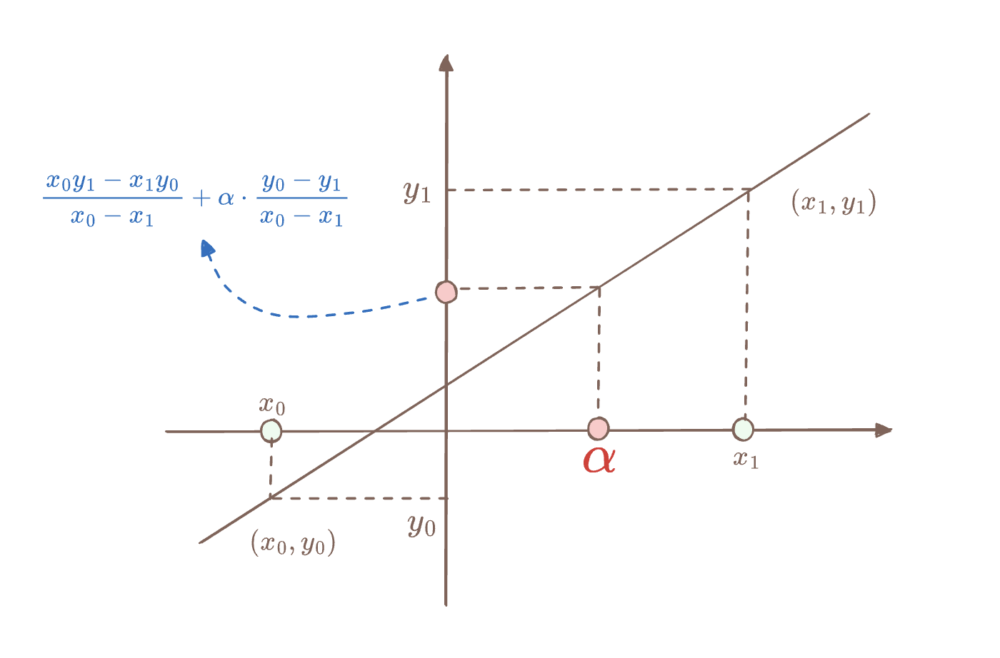

# Basefold 笔记：IOPP

## Proof of Proximity

下面我们给出利用 Foldable code 来实现 IOPP 的证明。

假设有一个 MLE 多项式 $\tilde{f}(\mathbf{X})$ 表示如下：

$$
\tilde{f}(X_0, X_1, \ldots, X_{d-1}) = f_0 + f_1X_0 + f_2X_1 + f_3X_0X_1 + \cdots + f_{2^d-1}X_{d-1} 
$$

由于 $\tilde{f}(X)$ 是一个多元多项式（Multivariate Polynomial），总共有 $d$ 个未知数，那么它的系数向量长度为 $2^d$ 。记住这里我们选择 Lexicographic Order 作为多项式的排序方式。

我们对 $\tilde{f}(\mathbf{X})$ 的系数向量 $\mathbf{f}$ 进行编码， 得到 codeword $c_\mathbf{f}=\mathsf{Enc}(\mathbf{f})$ ，长度为 $n_d$。然后使用 Hash-based Merkle Tree 产生承诺：

$$
\mathbf{cm}(\mathbf{f}) = \mathsf{Merklize}(\mathsf{Enc}(f_0, f_1, f_2, \ldots, f_{2^d-1}))
$$

与 FRI 协议类似，Basefold-IOPP 协议用来证明一个承诺 $\pi_d=\mathbf{cm}(\mathbf{f})$ 是一个极大概率「接近」于 $C_d$ 编码的向量， 因此这个协议被称为 Proof of Proximity。这个协议是构造 Evaluation Argument 的核心协议之一。

Proof of Proximity 利用了线性编码的一个神奇性质：「Proximity Gap」，即如果两个向量 $\pi, \pi'$ 如果远离合法的 codeword space，那么它们的随机线性组合 $\pi+\alpha\cdot \pi'$ 要么极小概率变合法，要么继续远离合法的 codeword space：

$$
\begin{cases}
\Delta(\pi_{i}, C_i) = 0 & \text{(with negligible probability)} \\
\Delta(\pi_{i}, C_i) \leq \Delta(\pi_{i+1}, C_{i+1}) & \text{(with non-negligible probability)} \\
\end{cases}
$$

这就说明了对 codeword 的折叠过程不会破坏向量与合法 codeword space 之间的距离，这个把向量折叠到足够小之后，Verifier 可以用极小的代码来验证折叠最后产生的向量是否是合法 codeword，从而可以得知原始向量是否是合法 codeword。

> 📖 **Notes on Proximity Gap**
> Proof of Proximity 利用了线性编码的一个神奇性质：「Proximity Gap」，即对两个向量 $\pi, \pi'$ 用随机数 $\alpha \in \mathbb{F}$ 进行折叠得到一个集合 $A = \{\pi+\alpha\cdot \pi': \alpha \in \mathbb{F}\}$ ，不同的 $\alpha$ 就对应集合 $A$ 中不同的元素，那么 「Proximity Gap」结论告诉我们这个集合中的元素要么都距离合法的 codeword space $C_{i}$ 很近，要么只有极小极小部分元素距离合法的 codeword space $C_{i}$ 比较近，大部分的元素都距离 $C_{i}$ 有 $\delta$ 那么远。用概率表示即为
> 
> $$
> \Pr_{a \in A}[\Delta(a, C_{i}) \le \delta] = \begin{cases}
>    \epsilon \quad \text{(small enough)}\\
>    1
> \end{cases}
> $$
> 这样对于 Verifier 来说就可以大胆用随机数 $\alpha$ 来进行折叠了，因为哪怕 Prover 给到的两个向量 $\pi, \pi'$ 中只有一个向量距离 $C_{i}$ 有 $\delta$ 那么远，用随机数折完之后结果距离 $C_{i}$ 变得比较近的概率只有 $\epsilon$ 那么小，换句话说，作弊的 Prover 想要逃脱 Verifier 的火眼金睛需要像中彩票那么幸运才行。这样如果开始想作弊的 Prover 选的 $\pi_{d}$ 距离合法的 codeword space 比较远，Verifier 选取一系列随机数让 Prover 不断去折叠，直到最后得到 $\pi_{0}$ ，这个过程中有足够大的概率不会让 $\pi_{0}$ 变得离合法的 codeword space 比较近，这样 Verifer 在最后就能检查出 Prover 作弊了。
> 「Proximity Gap」结论带给了 Verifer 一个极大的好处，那就是每次不用去验证 $A = \{\pi+\alpha\cdot \pi': \alpha \in \mathbb{F}\}$ 这个集合中所有的元素是否距离合法的编码空间比较近了，Verifer 只需要随机选择其中的一个点进行验证就行了，这大大减少了 Verifier 的计算量。

Proof of Proximity 协议分为两个阶段：Commit-phase 和 Query-phase。前者的子协议是完成  codeword 的多次折叠过程，并产生每一次折叠后的 codeword 的承诺（或称为 Oracle）；后者 Query-phase 是 Verifier 通过随机抽样来验证每一次的折叠过程是否合法。

## Commit-phase

下面先解释下 Commit-phase。Prover 通过多次折叠编码 $\pi_d$（其长度为 $n_d$），分别得到长度为 $n_{d-1}, \ldots, n_0$ 的 codeword，分别记为 $(\pi_{d-1}, \pi_{d-2}, \ldots, \pi_0)$，然后把它们发送给 Verifier。
记住这是一个交互式协议，总共有 $d$ 轮交互。每一轮交互中（假设为第 $i$ 轮，$0 \leq i < d$），Prover 根据 Verifier 发送的随机数 $\alpha_{i}$ 对 $\pi_{i+1}$ 的折叠，得到一个新的 codeword，记为 $\pi_{i}$，经过 $d$ 轮之后，Prover 得到一个长度为 $n_0$ 的 codeword，记为 $\pi_0$。Prover 把 $(\pi_d, \ldots, \pi_0)$ 分别进行承诺，然后把 $\mathsf{cm}(\pi_d), \ldots, \mathsf{cm}(\pi_0)$ 作为 $\mathsf{IOPP.Commit}$ 输出的结果。

下面我们分析下单次折叠 $\pi_{i}$ 的技术细节。假设 $\pi_{i}\in C_i$ 是一个合法的 codeword（即满足 $\pi_{i}=\mathbf{m}G_i$），长度为 $n_i$ ：

$$
\pi_i = (c_0, c_1, c_2, \ldots, c_{n_{i}-1})
$$

我们把这个向量从中间拆分为两部分，上下叠放在一起：

$$
\left(
\begin{array}{cccc}
c_0, & c_1, & \ldots, & c_{n_{i-1}-1} \\
c_{n_{i-1}}, & c_{n_{i-1}+1}, & \ldots, & c_{n_{i}-1} \\
\end{array}
\right)
$$

这时需要 Verifier 提供一个随机数 $\alpha^{(i)}$，我们把上面的两排向量进行随机线性组合，换个说法就是折叠：

$$
\pi_{i-1} = \big(\mathsf{fold}_{\alpha_i}(c_0, c_{n_{i-1}}), \mathsf{fold}_{\alpha_i}(c_1, c_{n_{i-1}+1}), \ldots, \mathsf{fold}_{\alpha_i}(c_{n_{i-1}}, c_{n_{i}-1})\big)
$$

上面即为折叠后的向量 $\pi_{i-1}$，假设 Prover 诚实的情况下，折叠后的向量应该是一个合法的 $C_{i-1}$ codeword。上面等式中的 $\mathsf{fold}_{\alpha_i}$ 函数定义如下：

$$
\mathsf{fold}_{\alpha}(c_j, c_{n_{i-1}+j}) = \frac{t_j\cdot c_{n_{i-1}+j} - t'_j\cdot c_{j} }{t_j - t'_j} + \alpha\cdot \frac{(c_{j} - c_{n_{i-1}+j})}{t_j - t'_j}
$$

如何理解上面的 $\mathsf{fold}_{\alpha}(\cdot, \cdot)$ 函数？其实它是一个多项式插值的过程。我们把待折叠的两排向量看成是在两个 Domain 上的点集，而这两个 Domain 分别递归编码过程中所采用的 $\mathsf{diag}(T_i)=(t_0, t_1, \ldots, t_{n_{i-1}-1})$ 和 $\mathsf{diag}(T'_i)=(t'_0, t'_1, \ldots, t'_{n_{i-1}-1})$：

$$
\left(
\begin{array}{cccc}
(t_0, c_0), & (t_1, c_1), & \ldots, & (t_{i-1}, c_{n_{i-1}-1}) \\
(t'_0, c_{n_{i-1}}), & (t'_1, c_{n_{i-1}+1}), & \ldots, & (t'_{i-1}, c_{n_{i}-1}) \\
\end{array}
\right)
$$

然后我们对上面矩阵的每一列在 Domain $(t_j, t'_j)$ 上进行插值，产生一组共 $n_{i-1}={n_i}/{2}$ 个多项式，记为 $p^{(i-1)}_j(X)$，其中 $0\leq j < n_{i-1}$。然后 Prover 计算 $p^{(i-1)}_j(X)$ 在 $X=\alpha_{i}$ 点处的值，这样我们总共可以得到 $n_{i-1}$ 个多项式在 $X=\alpha_{i}$ 处的取值，这些取值就作为新的 codeword $\pi_{i-1}$。

这里折叠函数的定义和线性多项式插值过程应该是一致的，我们可以手动推导一下折叠函数的定义的由来。因为这里我们对 $\pi_{i}$ 编码采用的是折半折叠，所以折叠后的 codeword 是有 $n_{i-1}$ 个「线性多项式」的求值向量。假设第 $j$ 个多项式刻画了一条穿过两个点的直线，两个点为 $(x_0, y_0), (x_1, y_1)$，那么这两个点的插值多项式 $p(X)$ 可以定义：

$$
\begin{split}
p(X) &= \frac{y_0}{x_0-x_1}(X-x_1) + \frac{y_1}{x_1-x_0}(X-x_0) \\[2ex]
     &= \frac{x_0y_1-x_1y_0}{x_0-x_1} + \frac{y_0-y_1}{x_0-x_1}\cdot X
\end{split}
$$

代入 $x_0=t_j, x_1=t'_j$，还有 $X=\alpha$ 我们即可得到上面折叠函数 $\mathsf{fold}_\alpha(y_0, y_1)$ 的定义

$$
\begin{split}
\mathsf{fold}_\alpha(y_0, y_1) = p(\alpha) &= \frac{t_j\cdot y_1 - t'_j\cdot y_0}{t_j - t'_j} + \frac{y_0-y_1}{t_j - t'_j}\cdot \alpha\\
\end{split}
$$

如果 $x_0$ 和 $x_1$ 互为正负数，即 $t_j=-t'_j$，那么 $\mathsf{fold}_\alpha(y_0, y_1)$ 就变成 FRI 协议中熟悉的定义：

$$
\mathsf{fold}_\alpha(y_0, y_1) = \frac{1}{2}(y_0 + y_1) + \alpha\cdot \frac{y_0-y_1}{2\cdot t_j}
$$

因为我们用折叠函数定义了折叠后 codeword $\mathbf{c}^{(i-1)}$，所以折叠函数定义需要和前面我们采用生成矩阵 $G_{i-1}$ 所产生的编码空间保持一致。那么我们继续推理下这个直觉上的关系。假设对于第 $i$ 轮，如果 $\mathbf{c}^{(i)}$ 确实是 $\mathbf{m}$ 的编码，那么根据定义，它会满足下面的 Foldable Codes 的性质：

$$
\begin{split}
\pi_{i} &= \mathbf{m} G_i \\
& = (\mathbf{m}_l \parallel \mathbf{m}_r)\begin{bmatrix}
G_{i-1} & G_{i-1} \\
G_{i-1}\cdot T_{i-1} & G_{i-1}\cdot T'_{i-1}
\end{bmatrix}\\[4ex]
&=\Big(\mathbf{m}_l G_{i-1} + \mathbf{m}_r G_{i-1}\circ \mathbf{diag}(T_{i-1})\Big) \parallel \Big(\mathbf{m}_l G_{i-1} + \mathbf{m}_r G_{i-1}\circ \mathbf{diag}(T'_{i-1})\Big)\\
\end{split}
$$

而 Prover 将其对半折叠后，得到的新的 codeword 为：

$$
\begin{split}
\mathsf{fold}_\alpha(\pi_{i}) &= \Big(\mathsf{fold}_\alpha(\pi_{i}[0], \pi_{i}[n_{i-1}]), \mathsf{fold}_\alpha(\pi_{i}[1], \pi_{i}[n_{i-1}+1]), \ldots, \mathsf{fold}_\alpha(\pi_{i}[n_{i-1}-1], \pi_{i}[n_{i}-1])\Big) \\
\end{split}
$$

我们现在验证其中每一个 $\mathsf{fold}_\alpha(\pi_{i}[j], \pi_{i}[n_{i-1}+j])$ 都是 $\mathbf{m}_lG_{i-1}[j]$ 和 $\mathbf{m}_rG_{i-1}[j]$ 关于 $\alpha$ 的线性组合，

$$
\begin{split}
\mathsf{fold}_\alpha(\pi_{i}[j], \pi_{i}[n_{i-1}+j]) & = \frac{1}{t_j - t'_j}\cdot\Big(
t_j\cdot (\mathbf{m}_l G_{i-1}[j] + t'_j\cdot \mathbf{m}_r G_{i-1}[j]) - t'_j\cdot(\mathbf{m}_l G_{i-1}[j] + t_j\cdot \mathbf{m}_r G_{i-1}[j]) \Big)\\
& + \frac{\alpha}{t_j - t'_j}\cdot \Big(\mathbf{m}_l G_{i-1}[j] + t_j\cdot \mathbf{m}_r G_{i-1}[j] - \mathbf{m}_l G_{i-1}[j] - t'_j\cdot \mathbf{m}_r G_{i-1}[j] \Big) \\
& = \mathbf{m}_l G_{i-1}[j] + \alpha\cdot \mathbf{m}_r G_{i-1}[j]
\end{split}
$$

于是，整个 $\pi_{i}$ 的折叠也等价于 $\mathbf{m}_lG_{i-1}$ 和 $\mathbf{m}_rG_{i-1}$ 关于 $\alpha$ 的线性组合:

$$
\mathsf{fold}_\alpha(\pi_{i}) = \mathbf{m}_l G_{i-1} + \alpha\cdot \mathbf{m}_r G_{i-1} = (\mathbf{m}_l + \alpha\cdot \mathbf{m}_r)G_{i-1} 
$$

折叠后的 codeword 恰好是 $\mathbf{m}$ 关于 $\alpha$ 的对半折叠，记为 $\mathbf{m}^{(i-1)}$，然后再对其进行 $G_{i-1}$ 编码，得到 $\pi_{i-1}$。这并不奇怪，因为这个 Foldable Codes 和 Codeword 的递归折叠是一个互逆的过程，所以在折叠后，编码引入的 $T_i$ 和 $T'_i$ 参数会被消除掉。

下面我们用一个简单的例子来走一遍协议的流程，来看看 Basefold-IOPP 协议的 Commit-phase 是如何运作的。

**公共输入**

- MLE 多项式 $\tilde{f}$ 的 codeword， $\pi_3=\mathsf{Enc}_3(\mathbf{f})=\mathbf{f}G_3$

**Witness** 

- MLE 多项式  $\tilde{f}$ 的系数向量 $\mathbf{f} = (f_0, f_1, f_2, f_3, f_4, f_5, f_6, f_7)$

第一轮：Verifier 发送随机数 $\alpha_2$

第二轮：Prover 计算 $\pi_2 = \mathsf{fold}_\alpha(\pi_3)$，然后发送给 Verifier

计算 $\pi_2$ 的过程如下：

$$
\pi_2[j] = \mathsf{fold}_\alpha(\pi_3[j], \pi_3[j+4]), \quad j\in\{0, 1, 2, 3\}
$$

计算出的 $\pi_2 = \mathsf{Enc}_2(f^{(2)})$，即 $\pi_2$ 是 $f^{(2)}$ 的 codeword，而 $f^{(2)}$ 是 $f$ 的关于 $\alpha_2$ 的折叠结果：

$$
f^{(2)}(X_0, X_1) = f(X_0, X_1, \alpha_2) = (f_0 + f_4\alpha_2) + (f_1 + f_5\alpha_2)X_0 + (f_2 + f_6\alpha_2)X_1 + (f_3 + f_7\alpha_2)X_0X_1
$$

第三轮：Verifier 发送随机数 $\alpha_1$

第四轮：Prover 计算 $\pi_1 = \mathsf{fold}_\alpha(\pi_2)$，然后发送给 Verifier

计算 $\pi_1$ 的过程如下：

$$
\pi_1[j] = \mathsf{fold}_\alpha(\pi_2[j], \pi_2[j+2]), \quad j\in\{0, 1\}
$$

计算出的 $\pi_1 = \mathsf{Enc}_1(f^{(1)})$，即 $\pi_1$ 是 $f^{(1)}$ 的 codeword，而 $f^{(1)}$ 是 $f^{(2)}$ 的关于 $\alpha_1$ 的折叠结果：

$$
f^{(1)}(X_0) = f(X_0, \alpha_1, \alpha_2)  = (f_0 + f_4 \alpha_2 +  \alpha_1 (f_2 +  + f_6 \alpha_2)) + (f_1 + f_5 \alpha_2 +  \alpha_1 (f_3 +  + f_7 \alpha_2))X_0
$$

第五轮：Verifier 发送随机数 $\alpha_0$

第六轮：Prover 计算 $\pi_0 = \mathsf{fold}_\alpha(\pi_1)$，然后发送给 Verifier

计算 $\pi_0$ 的过程如下：

$$
\pi_0[j] = \mathsf{fold}_\alpha(\pi_1[j], \pi_1[j+1]), \quad j=0
$$

同样 $\pi_0 = \mathsf{Enc}_0(f^{(0)})$，即 $\pi_0$ 是 $f^{(0)}$ 的 codeword，而 $f^{(0)}$ 是 $f$ 的关于 $(\alpha_0, \alpha_1, \alpha_2)$ 的折叠结果：

$$
f^{(0)} = f(\alpha_0, \alpha_1, \alpha_2) = f_0 + f_1\alpha_0 + f_2\alpha_1 + f_3\alpha_0 \alpha_1 + f_4\alpha_2 + f_5\alpha_0\alpha_2 + f_6\alpha_1\alpha_2 + f_7\alpha_0\alpha_1\alpha_2
$$

到此，Commit-phase 结束，Prover 总共发送了 $(\pi_{2}, \pi_{1}, \pi_0)$ 给 Verifier。 Verifier 收到后，首先验证 $\pi_0$ 是否是常数多项式。不过这样还不够，Verifier 还需要验证 Prover 的三次折叠行为都是诚实的。如果验证全部 $\pi_i$ 的折叠，Verifier 将会丧失 Succinctness，从而失去验证效率。由于 Proximity Gap 性质，Verifier 只需要少量的验证即可确保 $\pi_i$ 是合法的 codeword。

## Query-phase

与 FRI 协议类似，在 Query-phase 阶段，Verifier 要对 Prover 发送的 $(\pi_{d}, \pi_{d-1}, \ldots, \pi_0)$ 进行多轮的随机抽查，以确保 Prover 的折叠过程是诚实的。我们下面讨论每一轮的抽查过程。

Verifier 会在 $\pi_{d}$ 中随机选择一个位置 $\mu$ 并发送给 Prover，注意 $0\leq \mu < n_{d-1}$，其中 $n_{d-1}$ 只有 $\pi_{d}$ 。Prover 打开 $\pi_{d}[\mu]$ 和 $\pi_{d}[\mu+n_{d-1}]$ 这两点，同时将折叠后的 codeword $\pi_{d-1}$ 中位置为 $\mu$ 的值，即 $\pi_{d-1}[\mu]$ 一起发送给 Verifier，再加上这三个点的 Merkle Path。

Verifier 收到后，首先验证这三个点是否对应到 $\pi_{d}$ 和 $\pi_{d-1}$ 的 codeword 上，然后验证它们三者是否满足折叠关系：

$$
\pi_{d-1}[\mu] \overset{?}{=} \mathsf{fold}_{\alpha_{d-1}}(\pi_{d}[\mu], \pi_{d}[\mu+n_{d-1}])
$$

只验证 $\pi_d$ 到 $\pi_{d-1}$ 的折叠关系是不够的，Verifier 还要验证 $\pi_{d-1}$ 到 $\pi_{0}$ 的所有折叠关系。Prover 还要发送 $\pi_{d-1}$ 到 $\pi_{d-2}$ 的点。这里 Verifier 不用重新选择随机数，而是继续使用 $\mu$，因为在下一轮折叠中，$\pi_{d-1}[\mu]$ 这个位置将要和另一个对称的点进行关于 $\alpha_{d-2}$ 的折叠，具体是哪个位置的点，需要分情况讨论。如果 $\mu < n_{d-2}$，那么 $\pi_{d-1}[\mu+n_{d-2}]$ 就是对称点；如果 $\mu \geq n_{d-2}$，那么 $\pi_{d-1}[\mu-n_{d-2}]$ 就是对称点。我们假设 $\mu \geq n_{d-2}$，那么 Prover 就发送 $\pi_{d-1}[\mu-n_{d-2}]$ 和 它的 Merkle Path 给 Verifier。以便 Verifier 验证 $\pi_{d-1}$ 到 $\pi_{d-2}$ 的折叠关系。

这样一来，Verifier 只需要给一个随机数 $\mu$，就可以验证从 $\pi_{d}$ 到 $\pi_{0}$ 的所有折叠关系。这样的验证过程就是一轮。

为了将可靠性提升到一个足够的高度，Verifier 要进行多轮，确保 Prover 没有作弊空间。Query-phase 正是利用了 Proximity Gap 这一特性。Prover 篡改后的 codeword 大概率距离合法的编码空间比较远，这样 Verifier 只需要少量的抽样次数即可发现作弊行为。

## 总结

本文描述了下 Basefold-IOPP 协议的 Commit-phase 和 Query-phase 的框架。这个框架是对 FRI 协议的一个泛化和扩展，从 RS-Code 扩展到了任何的 Foldable Linear Codes。但是请注意，Basefold 并不支持 Degree 大于 2 的 codeword 折叠。这样由于 Basefold-IOPP 协议不仅仅要完成 Proximity Testing，还要提供一个 MLE 多项式的运算结果。这将是本系列文章的下一篇。

## References

- [ZCF23] Hadas Zeilberger, Binyi Chen, and Ben Fisch. "BaseFold: efficient field-agnostic polynomial commitment schemes from foldable codes." Annual International Cryptology Conference. Cham: Springer Nature Switzerland, 2024.
- [BCIKS20] Eli Ben-Sasson, Dan Carmon, Yuval Ishai, Swastik Kopparty, and Shubhangi Saraf. Proximity Gaps for Reed–Solomon Codes. In *Proceedings of the 61st Annual IEEE Symposium on Foundations of Computer Science*, pages 900–909, 2020.
