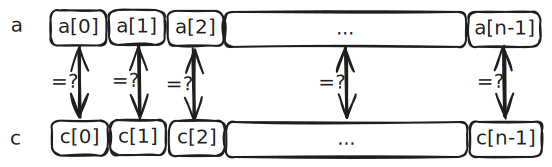
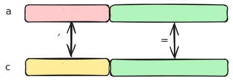
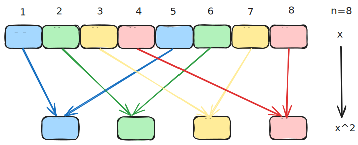
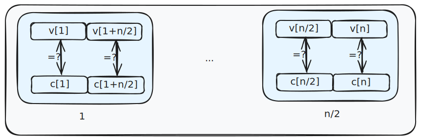
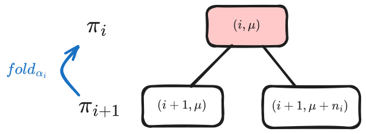

# Basefold 笔记：IOPP 可靠性分析

在本篇文章中将梳理 [ZCF23] 论文中给出的 IOPP soundness 证明思路，其与 [BKS18] 中关于 FRI 协议的 soundness 证明类似。其中用到了二叉树的方式来分析 Prover 可能作弊的点，这个思想也在 [BGKS20] DEEP-FRI  协议的 soundness 证明中出现过。

## IOPP 协议

在前面第 2 篇文章中已经详细介绍了 IOPP 协议，为了后文的分析，这里简单罗列下 IOPP 协议，它是 FRI 协议的一个扩展，在理解协议的过程中，完全可以带入 FRI 协议，commit 阶段和 query 阶段都是一致的。

**协议 1 [ZCF23, Protocol 2] IOPP.commit**

输入 oracle：$\pi_d \in \mathbb{F}^{n_d}$
输出 oracles: $(\pi_{d-1}, \ldots, \pi_0) \in \mathbb{F}^{n_{d-1}} \times \cdots \times \mathbb{F}^{n_0}$

- 对于 $i$ 从 $d-1$ 到 $0$：
    1. Verifier 从 $\mathbb{F}$ 中采样并发送 $\alpha_i \leftarrow \$ \mathbb{F}$ 给 Prover
    2. 对于每一个索引 $j \in [1, n_i]$，Prover
        a. 设置 $f(X) := \mathrm{interpolate}((\mathrm{diag}(T_i)[j], \pi_{i+1}[j]), (\mathrm{diag}(T'_i)[j], \pi_{i+1}[j+n_i]))$
        b. 设置 $\pi_i[j] = f(\alpha_i)$
    3. Prover 输出 oracle $\pi_i \in \mathbb{F}^{n_i}$ 。

**协议 2 [ZCF23, Protocol 3] IOPP.query**

输入 oracles：$(\pi_{d-1}, \ldots, \pi_0) \in \mathbb{F}^{n_{d-1}} \times \ldots \times \mathbb{F}^{n_0}$
输出：accept 或 reject

- Verifier 采样 $\mu \leftarrow \$ [1, n_{d-1}]$ 
- 对于 $i$ 从 $d-1$ 到 $0$ ，Verifier
    1. 查询 oracle $\pi_{i+1}[\mu], \pi_{i+1}[\mu + n_i]$
    2. 计算 $p(X) := \mathrm{interpolate}((\mathrm{diag}(T_i)[\mu], \pi_{i+1}[\mu]), (\mathrm{diag}(T'_i)[\mu], \pi_{i+1}[\mu + n_i]))$
    3. 检查 $p(\alpha_i) = \pi_i[\mu]$
    4. 如果 $i > 0$ 且 $\mu > n_i - 1$，则更新 $\mu \leftarrow \mu - n_{i - 1}$
- 如果 $\pi_0$ 是关于生成矩阵 $\mathbf{G}_0$ 的一个有效的码字，则输出 `accept`，否则输出 `reject`。

## 分析思路

IOPP soundness 分析的就是对于任意的一个 Prover，其可能会作弊，在这种情况下，Verifier 输出 `accept` 的概率最多是多少，我们希望这个概率足够的小，这样这个协议才比较安全。当然这个概率肯定和协议中的一些参数相关，在实际中，我们希望其达到一个提前给定的安全参数 $\lambda$ （例如取 $\lambda$ 为 $128$ 或 $256$ ），意思是这个概率要小于 $2^{-\lambda}$ 。

我们现在来看看 IOPP 协议中对于作弊的 Prover ，有哪些地方可以钻漏洞使得 Verifier 输出 `accept` 。我们注意到，有两个地方 Verifier 引入了随机数。
1. 在 IOPP.commit 阶段，协议第 1 步，Verifier 会从 $\mathbb{F}$ 中选取随机数 $\alpha_{i}$ 给 Prover，让 Prover 去对原来的 $\pi_{i+1}$ 进行折叠，得到 $\pi_{i}$ 。
2. 在 IOPP.query 阶段，协议的第 1 步，Verifier 就会从 $[1, n_{d-1}]$ 中采样得到 $\mu$ ，然后去进行检查之前 Prover 折叠的是否正确。

假设初始作弊的 Prover 给出的 $\pi_{d}$ 距离 $C_{d}$ 有 $\delta$ 那么远，我们希望 Verifier 最后能检查出 $\pi_{0}$ 距离 $C_0$ 也有 $\delta$ 那么远，也就是在折叠的过程中保持这个 $\delta$ 距离，还有一种就是检查出 Prover 没有正确折叠。考虑两种情况：

1. Prover 非常幸运，Verifier 选取的随机数 $\alpha_{i}$ 能使得对 $\pi_{i+1}$ 折叠之后的 $\pi_{i}$ 距离对应的 $C_{i}$ 没有 $\delta$ 那么远了，此时 Verifier 会输出 `accept` 。为什么说对于这种情况 Prover 非常幸运呢？因为这是 Proximity Gaps 告诉我们的结论，意思是说发生这种情况的概率非常非常的小（假设该概率为 $\epsilon$ ），小到发生这种情况就相当于 Prover 中了彩票。

2. Prover 没有情况 1 所说的那么幸运了，这时用随机数折叠之后的消息 $\pi_{i}$ 距离对应的还是有 $\delta$ 那么远。由于 Verifier 在 IOPP.query 阶段是会随机选取 $\mu \leftarrow \$ [1,n_{d-1}]$ ，然后进行检查，因此不会检查 $\pi_{i}$ 中的所有元素，这就给了 Prover 可乘之机了。例如，用随机数折叠之后的消息 $a$ 距离编码空间的相对 Hamming 距离会大于 $\delta_{0}$ ，即 $\Delta(a, C) > \delta$ 。Verifier 会随机检查 $a[i]$ 与 $c[i]$ 是否相等，如果不等就会拒绝。

    

    由于 $\Delta(a, C) > \delta$ ，这时 $a$ 中有大于 $\delta$ 比例的分量与编码空间中的码字不相等，当 Verifier 选到这些不等的位置时，会进行拒绝，因此 Verifier 抓到 Prover 作弊的概率会大于 $\delta$ 。

    

    如果 Verifier 查询 $l$ 次，那么 Prover 能通过 Verifier 检查的概率就不会超过 $(1 - \delta)^{l}$ 。

综合上述两种情况，Prover 作弊成功的概率不超过

$$
\epsilon + (1 - \delta)^{l} \tag{1}
$$

这是一个整体分析的思路，具体的表达式与 $(1)$ 式也会有所不同，下面来看看具体的 IOPP soundness 定理。

## IOPP Soundness 定理

**定理 1** [ZCF23, Theorem3] (可折叠的线性编码的 IOPP Soundness) 令 $C_d$ 表示一个 $(c, k_0, d)$ 可折叠的线性编码，其生成矩阵为 $(G_0, \ldots, G_d)$ 。我们用 $C_i$ （$0 \le i < d$）表示生成矩阵 $G_i$ 的编码，假设对于所有的 $i \in [0, d-1]$ 都有相对最小距离 $\Delta C_i \ge \Delta C_{i+1}$ 。令 $\gamma > 0$ ，设 $\delta := \min(\Delta^*(\pi_d, C_d), J_{\gamma}(J_{\gamma}(\Delta_{C_d})))$ ，其中 $\Delta^*(\pi_d, C_d)$ 是 $\mathbf{v}$ 和 $C_d$ 之间的相对陪集最小距离(relative coset minimum distance)。那么对于任意的（自适应选择的）Prover oracles $\pi_{d-1}, \ldots, \pi_0$ ，Verifier 在 IOPP.query 阶段重复 $\ell$ 次，都输出 `accept` 的概率至多为 $(1 - \delta + \gamma d)^{\ell}$ 。

定理中提到的出现的 $J_{\gamma}(J_{\gamma}(\Delta_{C_d}))$ 是两个 Johnson 函数的复合。其定义为如下。

**定义 1** [ZCF23, Definition 4] (Johnson Bound) 对于任意的 $\gamma \in (0,1]$ ，定义 $J_{\gamma}: [0,1] \rightarrow [0,1]$ 为函数

$$
J_{\gamma}(\lambda) := 1 - \sqrt{1 - \lambda(1 - \gamma)} .
$$

相对陪集最小距离(relative coset minimum distance) 的定义如下。

**定义 2** [ZCF23, Definition 5] (Relative Coset Minimum Distance) 令 $n$ 为一个偶数，$C$ 为一个 $[n,k,d]$ 纠错码。对于一个向量 $\mathbf{v} \in \mathbb{F}^{n}$ 和一个码字 $c \in C$ ，$\mathbf{v}$ 和 $c$ 之间的相对距离 $\Delta^*(\mathbf{v},c)$ 定义为

$$
\Delta^*(\mathbf{v},c) = \frac{2 |\{ j \in [1, n/2]: \mathbf{v}[j]  \neq c[j] \vee \mathbf{v}[j + n/2]  \neq c[j + n/2] \}  |}{n}.
$$

这个定义和 [BBHR18] 中证明 soundness 用到的 Block-wise 距离定义([BBHR18, Definition 3.2])是类似的，它是相对最小 Hamming 距离的一个替代版本。将 $\{j,j+n/2\}$ 组成成一对，对比 FRI 协议，集合 $\{j,j+n/2\}$ 可以对应一个陪集。例如对于 $n = 8$ ，设生成元为 $\omega$ ，且 $\omega^8 = 1$ ，选取映射 $x \mapsto x^2$ ，那么可以看到 $\{1,5\}$ 、$\{2,6\}$ 、$\{3,7\}$ 、$\{4,8\}$ 对应的元素组成一个陪集，总共形成 4 个陪集。

$\Delta^*(\mathbf{v},c)$ 衡量就是在所有的陪集中，有多少比例的陪集，使得 $\mathbf{v}$ 与 $c$ 在这些陪集中不完全一致。

令 $\Delta^*(\mathbf{v},C) := \min_{c \in C}\Delta^*(\mathbf{v},c)$ ，那么它与相对最小 Hamming 距离有这样的一个关系：$\Delta(\mathbf{v},C) \le \Delta^*(\mathbf{v},C)$ 。

尽管多了这些不同的定义和 Johnson 函数，但是 IOPP Soundness 的证明思路与前面说的分析思路还是一致的，分两种情况讨论。我们的目的是分析作弊的 Prover 最后能够通过 Verifier 的检查，最终输出 `accept` 的概率。证明的思路是：

**情况 1** : Prover 非常幸运，由于 Verifer 选取随机数 $\alpha_i$ ，导致进行折叠(fold)之后的消息距离编码空间比较近，这样 Prover 后续都能通过 Verifier 的检查。对于 Verifier 来说，也就是发生了一些"坏"的事件，定义存在 $i \in [0, d-1]$ ，使得

$$
\Delta(\mathrm{fold}_{\alpha_i}(\pi_{i+1}), C_i) \le \min(\Delta^*(\pi_{i+1}, C_{i+1}), J_{\gamma}(J_{\gamma}(\Delta_{C_d}))) - \gamma
$$

用反证法通过 Correlated Agreement 定理（其能推导出对应的 Proximity Gaps 定理）可以证明发生“坏”的事件的概率是比较小的，证明得到其概率最多为 $\frac{2d}{\gamma^3 |\mathbb{F}|}$ 。

**情况 2** : 假设 Prover 没有那么幸运了，也就是情况 1 中的“坏”的事件没有发生，那么Verifier 在 IOPP.query 阶段会选取 $\mu \leftarrow \$ [1, n_{d-1}]$ ，这个时候 Prover 可能会躲过 Verifier 的检查，让 Verifier 选到了 Prover 没有作弊的那些点。重复执行IOPP.query $l$ 次，Prover 都能够通过的概率最多为 $(1 - \delta + \gamma d)^{l}$ 。

综合 1 和 2 就得到了对于可折叠的线性编码(Foladable Linear Codes)的 IOPP Soundness ，至少为

$$
\mathbf{s}^-(\delta) = 1 - \left(\frac{2d}{\gamma^3 |\mathbb{F}|} + \left(1 - \delta + \gamma d \right)^l \right) .
$$

也就证得了定理 1 。

### 情况 1 的证明

下面的推论 1 证明了对于某一次 $i$ ，折叠之后的结果距离 $C_i$ 的相对 Hamming 距离比较近，设为事件 $B^{(i)}$ ，那么其概率不超过 $\frac{2}{\gamma^3 |\mathbb{F}|}$ 。那么如果发生了某些事件 $B_i$ ，其概率不会超过这些 $B_i$ 发生的概率之和，即

$$
\Pr\left[\bigcup_{i = 0}^{d-1} B^{(i)} \right] \le \sum_{i = 0}^{d-1} \Pr[B^{(i)}] \le \frac{2d}{\gamma^3 |\mathbb{F}|}.
$$

我们具体来看看推论 1。

**推论 1** [ZCF23, Corollary 1] 固定任意的 $i \in [0, d-1]$ 和 $\gamma, \delta > 0$ ，使得 $\delta \le J_{\gamma}(J_{\gamma}(\Delta_{C_d}))$ ，那么如果 $\Delta^*(\mathbf{v}, C_{i+1}) > \delta$ ，有

$$
\Pr_{\alpha_i \leftarrow \$ \mathbb{F}}[\Delta(\mathrm{fold}_{\alpha_i}(\mathbf{v}), C_i) \le \delta - \gamma] \le \frac{2}{\gamma^3 |\mathbb{F}|}. \tag{2}
$$

其中的 $\mathrm{fold}_{\alpha_i}(\cdot)$ 函数定义如下。令 $\mathbf{u},\mathbf{u'} \in \mathbf{F}^{n_i}$ 是两个唯一的插值向量使得

$$
\pi_{i+1} = (\mathbf{u} + \mathrm{diag}(T_i) \circ \mathbf{u}', \mathbf{u} + \mathrm{diag}(T_i') \circ \mathbf{u}')
$$

那么 $\mathrm{fold}_{\alpha_i}(\pi_{i+1})$ 定义为

$$
\mathrm{fold}_{\alpha_i}(\pi_{i+1}) := \mathbf{u}' + \alpha_i \mathbf{u}.
$$

这其实就是对 $\pi_{i+1}$ 用随机数 $\alpha_i$ 进行折叠的过程。

推论 1 将 [BKS18] 的推论 7.3 的结果推广到了一般的可折叠的线性编码。

***推论 1 证明思路：*** 现在想证明用随机数 $\alpha_i$ fold 之后的相对 Hamming 距离比原来小，这件事发生的概率比较小，即不超过 $\frac{2}{\gamma^3 |\mathbb{F}|}$ 。如果用反证法，假设这件事发生的概率比较大，那么就可以直接 Correlated Agreement 定理（来自[BKS18] 定理 4.4）的结论，来证明对于 affine space $U = \{\mathbf{u} + x \mathbf{u'} : x \in \mathbb{F}\}$ ，在 $C_i$ 中存在一个比较大的 Correlated Agree 子集 $T$ ，使得在这里面存在 $\mathbf{w}, \mathbf{w'} \in C_i$ 使得分别与对应的 $\mathbf{u}, \mathbf{u'}$ 在 $T$ 上是一致的，再将 $\mathbf{w}, \mathbf{w'}$ 进行编码，得到的码字 $c_{w}$ 是在 $C_{i+1}$ 中的，从而来估计 $\Delta^{*}(\mathbf{v}, C_{i+1})$ ，能得到其不超过 $\delta$ ，与假设矛盾，因此得证。

### 情况 2 的证明

想要证明调用 IOPP.query $l$ 次，Verifier 输出 `accept` 的概率不超过 $(1 - \delta + \gamma d)^l$，我们只需要证明调用一次 IOPP.query，Verifier `reject` 的概率至少为 $\delta - \gamma d$ 。

用二叉树的思想来进行证明，首先定义一个“坏”的节点 $(i,\mu)$ ，如下图所示，将那些没有通过 IOPP.query 第 3 步的点表示出来。也就是当 Verifier 选取随机数 $\mu$ 之后，对任意的 $i \in [0, d-1]$ 以及任意的 $\mu \in [n_i]$ ，Verifier 先计算 IOPP.query 第 2 步，计算

$$
p(X) := \mathrm{interpolate}((\mathrm{diag}(T_i)[\mu], \pi_{i+1}[\mu]), (\mathrm{diag}(T'_i)[\mu], \pi_{i+1}[\mu + n_i]))
$$

接着检查 IOPP.query 协议的第 3 步，发现

$$
p(\alpha_i) \neq \pi_i[\mu]
$$

这时我们说节点 $(i,\mu)$ 是“坏”的。

下面考虑 $i$ 从 $d-1$ 到 $0$ ，一个 $\mu$ 能生成一棵二叉树，取遍所有的 $\mu \in [1, n_{d-1}]$ 能生成如下图所示 $n_{0}$ 棵二叉树。

如果在其中有一个 $(i,\mu)$ 节点是"坏"的，假设在第 $d-1$ 到第 $i +1$ 层的所有节点和其孩子节点都是一致的，也就是在 IOPP.query 协议中，从 $d-1$ 步直到第 $i+1$ 步都通过了第 3 步的检查，但是在第 $i$ 步，遇到了一个 $(i,u)$ 没有通过第 3 步的检查，这个时候 Verifier 就会拒绝。在图中，从第 $i+1$ 到第 $d-1$ 层都为“好”的节点。那么也就是说只要整棵树中有一个坏的节点，Verifier 就会拒绝。如果用 $\beta_i$ 表示的是在第 $i$ 层坏的节点的比率，那么在第 $i$ 层 Verifier 拒绝的概率就是 $\beta_i$ ，考虑整个 IOPP.query 阶段，其拒绝的概率就是 $\sum_{i=0}^{d-1}\beta_i$ ，其中 $\beta_i := \Delta(\pi_i, \mathrm{fold}_{\alpha_i}(\pi_{i+1}))$ ，也就是那些“坏”的点，对 $\pi_{i+1}$ 折叠之后与 $\pi_i$ 不一致。

那么剩下的任务就是估计 $\sum_{i=0}^{d-1}\beta_i$ 。[ZCF23, Claim 2] 给出了每个 $\beta_i$ 的不等式。

**命题 1 ** [ZCF23, Claim 2] 对任意的 $i \in [0, d]$ ，定义 $\delta^{(i)} := \min(\Delta^*(\pi_i, C_i), J_{\gamma}(J_{\gamma}(\Delta_{C_d})))$ 。对所有的 $i \in [0, d-1]$ 都有

$$
\beta_i \ge \delta^{(i+1)} - \delta^{(i)} - \gamma .
$$

那么根据 soundness 中的条件，$\delta = \delta^{(d)}$ 。同时由于 $\Delta^{*}(\pi_0, C_0) = \Delta(\pi_0, C_0) = 0$ ，因此 $\delta^{(0)} = 0$ 。则根据命题的结论有

$$
\delta = \delta^{(d)} - \delta^{(0)} = \sum_{i = 0}^{d-1} \delta^{(i+1)} - \delta^{(i)} \le \sum_{i = 0}^{d-1} \beta_i + \gamma d,
$$

从而得证 $\sum_{i = 0}^{d-1} \beta_i \ge \delta - \gamma d$ 。因此如果没有坏的事件 $B$ 发生，调用一次 IOPP.query ，拒绝的概率至少为 $\delta - \gamma d$ 。至此情况 2 的结论也证明了。

## References

- [BBHR18] Eli Ben-Sasson, Iddo Bentov, Ynon Horesh, and Michael Riabzev. Fast Reed-Solomon Interactive Oracle Proofs of Proximity. In Proceedings of the 45th International Colloquium on Automata, Languages, and Programming (ICALP), 2018. Available online as Report 134-17 on Electronic Colloquium on Computational Complexity.
- [BGKS20] Eli Ben-Sasson, Lior Goldberg, Swastik Kopparty, and Shubhangi Saraf. DEEP-FRI: sampling outside the box improves soundness. In Thomas Vidick, editor, 11th Innovations in Theoretical Computer Science Conference, ITCS 2020, January 12-14, 2020, Seattle, Washington, USA, volume 151 of LIPIcs, pages 5:1–5:32. Schloss Dagstuhl-Leibniz-Zentrum für Informatik, 2020.
- [BKS18] Eli Ben-Sasson, Swastik Kopparty, and Shubhangi Saraf. “Worst-Case to Average Case Reductions for the Distance to a Code”. In: Proceedings of the 33rd Computational Complexity Conference. CCC ’18. San Diego, California: Schloss Dagstuhl-Leibniz-Zentrum fuer Informatik, 2018. isbn: 9783959770699.
- [ZCF23] Hadas Zeilberger, Binyi Chen, and Ben Fisch. "BaseFold: efficient field-agnostic polynomial commitment schemes from foldable codes." Annual International Cryptology Conference. Cham: Springer Nature Switzerland, 2024.
