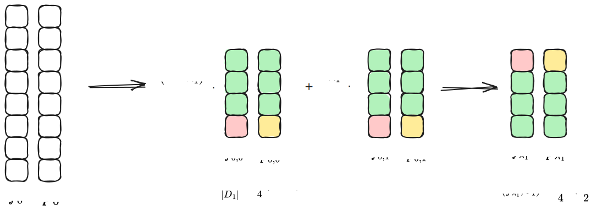
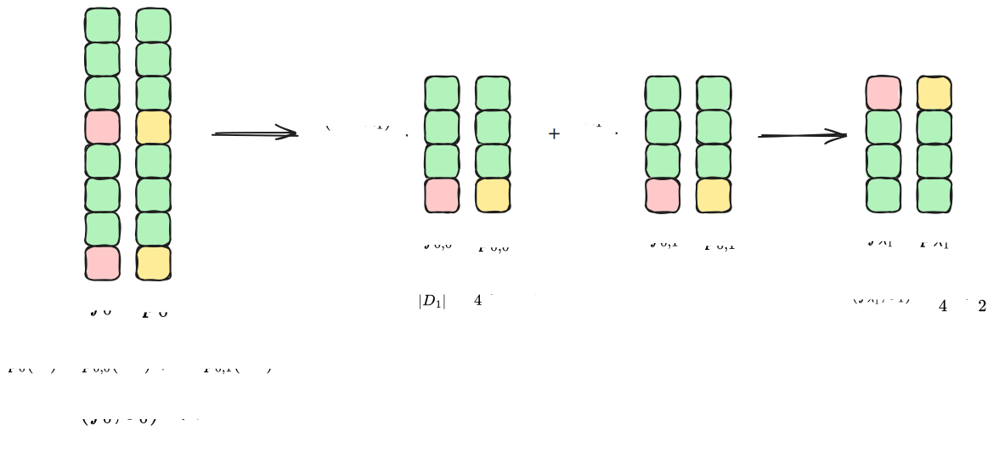
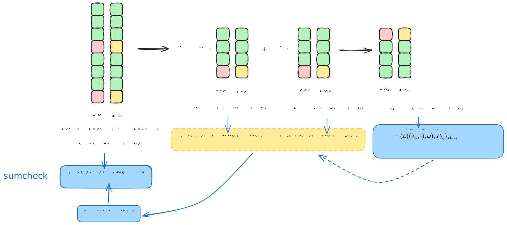

# Note on Basefold's Soundness Proof under List Decoding

- Jade Xie <jade@secbit.io>
- Yu Guo <yu.guo@secbit.io>

This article mainly outlines the security proof for the Basefold [ZCF23] multilinear PCS under list decoding, as presented in Ulrich Haböck's paper [H24]. In [ZCF23], the soundness proof was given under unique decoding for foldable linear codes, while in [H24], the proof is for Reed-Solomon codes under list decoding, raising the bound to the Johnson bound, i.e., $1 - \sqrt{\rho}$. To prove security, the paper presents two correlated agreement theorems stronger than the one given in [BCIKS20]:

1. [H24, Theorem 3] Correlated agreement for subcodes.
2. [H24, Theorem 4] Weighted correlated agreement for subcodes.

When considering the Basefold protocol applied to Reed-Solomon codes, the protocol combines FRI and sumcheck. To prove its security, [H24] proposes subcodes that incorporate sumcheck-like constraints on top of Reed-Solomon codes. By combining this with the corresponding correlated agreement theorems, the security of the protocol can be proven.

## Basefold Protocol

For a multilinear polynomial $P(X_1, X_2, \ldots, X_n) \in F[X_1, \ldots, X_n]$, we want to prove that for any query $\vec{\omega} = (\omega_1, \ldots, \omega_n)$ from $F^n$, we have $v = P(\omega_1, \ldots, \omega_n)$. To implement PCS for the multilinear polynomial $P(X_1, X_2, \ldots, X_n)$, the Basefold protocol combines the Sumcheck and FRI protocols. The following introduction is based on the description in [H24].

### Combining with Sumcheck Protocol

To prove $v = P(\omega_1, \ldots, \omega_n)$, we first convert the query value $P(\omega_1, \ldots, \omega_n)$ into a Sumcheck sum form:

$$
P(\omega_1, \ldots, \omega_n) = \sum_{\vec{x} = (x_1, \ldots, x_n) \in H_n} L(\vec{x}, \vec{\omega}) \cdot P(\vec{x}) 
$$

where $H_n = \{0,1\}^n$, and $L(\vec{x}, \vec{\omega})$ is actually the $eq(\cdot, \cdot)$ function:

$$
L(\vec{x}, \vec{\omega}) = \prod_{i = 1}^n \left ((1 - x_i)(1 - \omega_i) + x_i\omega_i \right)
$$

Therefore, the proof of $v = P(\omega_1, \ldots, \omega_n)$ is transformed into proving the sum over $H_n$:

$$
\sum_{\vec{x} = (x_1, \ldots, x_n) \in H_n} L(\vec{x}, \vec{\omega}) \cdot P(\vec{x}) = v
$$

The Sumcheck protocol can then be used to prove this sum is correct.

For $i = 1, \ldots, n - 1$, the Prover needs to construct a univariate polynomial based on the challenge random numbers $\lambda_1, \ldots,\lambda_i$:

$$
q_i(X) = \sum_{\vec{x} = (x_{i + 2}, \ldots, x_n) \in H_{n - (i + 1)}} L(\lambda_1,\ldots, \lambda_i,X,\vec{x}, \vec{\omega}) \cdot P(\lambda_1, \ldots, \lambda_i,X,\vec{x})
$$

This corresponds to the polynomial $P(\lambda_1, \ldots, \lambda_i, X, \omega_{i+2}, \ldots, \omega_{n})$.

We can see that in $q_i(X)$, $L(\lambda_1,\ldots, \lambda_i,X,\vec{x}, \vec{\omega})$ is linear in $X$, and $P(\lambda_1, \ldots, \lambda_i,X,\vec{x})$ is also linear in $X$. Their product becomes quadratic in $X$. To correspond with the correlated agreement theorem for linear subcodes later, we extract the linear term in $X$. The Prover needs to send the linear polynomial:

$$
\Lambda_i(X) = \sum_{\vec{x} = (x_{i + 2}, \ldots, x_n) \in H_{n - (i + 1)}} L(\vec{x}, (\omega_{i+2}, \ldots, \omega_n)) \cdot P(\lambda_1, \ldots, \lambda_i,X,\vec{x})
$$

Since

$$
\begin{aligned}
	L((\lambda_1, \ldots, \lambda_i, X, \vec{x}), \vec{\omega}) & = L((\lambda_1, \ldots, \lambda_i, X, \vec{x}), (\omega_1, \ldots, \omega_{i}, \omega_{i+1}, \omega_{i+2}, \ldots, \omega_n)) \\
	& = \left( \prod_{j = 1}^{i}[(1 - \lambda_j)(1 - \omega_j) + \lambda_j \omega_j] \right) \\
	& \quad \cdot \left( (1 - \lambda_{i+1})(1 - \omega_{i+1}) + X \cdot \omega_{i+1} \right) \\
	& \quad \cdot \left( \prod_{j = i+2}^{n}[(1 - \lambda_j)(1 - \omega_j) + \lambda_j \omega_j] \right) \\
	& = L(\lambda_1, \ldots, \lambda_i, \omega_1, \ldots, \omega_i) \cdot L(X, \omega_{i+1}) \cdot L(\vec{x}, (\omega_{i+2}, \ldots, \omega_n))
\end{aligned}
$$

Therefore,

$$
q_i(X) = L(\lambda_1, \ldots, \lambda_i, \omega_1, \ldots, \omega_i) \cdot L(X, \omega_{i+1}) \cdot \Lambda_i(X).
$$

The Prover only needs to provide $\Lambda_i(X)$, and the Verifier can calculate $q_i(X)$ using the above equation.

In the Sumcheck protocol, the Prover first sends a univariate polynomial $\Lambda_0(X) = \sum_{\vec{x} = (x_2, \ldots, x_n) \in H_{n - 1}}L(\vec{x}, (\omega_2, \ldots, \omega_n)) \cdot P(X, \vec{x})$ and $s_0 = v$. Then in round $1 \le i \le n - 1$:

1. The Verifier can calculate $q_{i-1}(X)$ based on $\Lambda_{i-1}(X)$ and check if $s_{i-1} = q_{i-1}(0) + q_{i-1}(1)$. Then choose a random number $\lambda_i \leftarrow \$ F$ and send it to the Prover.
2. The Prover calculates $P(\lambda_1, \ldots, \lambda_i, X_{i+1}, \ldots, X_n)$ based on $\lambda_i$, computes $\Lambda_i(X)$ and sends it to the Verifier. Both the Prover and Verifier set $s_i = q_{i-1}(\lambda_i)$.

In the last step of Sumcheck, we need to obtain the value of $P(X_1, \ldots, X_n)$ at a random point $(\lambda_1, \lambda_2, \ldots, \lambda_n)$, i.e.,

$$
P(\lambda_1,  \ldots, \lambda_n),
$$

This value can be obtained by folding a univariate polynomial $f_{0}(X)$ of degree not exceeding $2^n - 1$ corresponding to the multilinear polynomial $P(X_1, X_2, \ldots, X_n)$ using the same random numbers $\lambda_1,  \ldots, \lambda_n$ in the FRI protocol. After folding $f_{0}(X)$ $n$ times, we will get a constant $c$, and we want its value to be $P(\lambda_1,  \ldots, \lambda_n) = c$.

### Combining with FRI Protocol

For the multilinear polynomial $P(X_1, X_2, \ldots, X_n)$, there is a univariate polynomial $f_{0}(X)$ (called *univariate representation* in [H24]) corresponding to it:

$$
f_0(X) = \sum_{i = 0}^{2^n - 1} P(i_1, \ldots, i_n) \cdot X^i
$$

where $i_1, \ldots, i_n$ is the binary representation of $i$, with $i_1$ being the least significant bit and $i_n$ being the most significant bit.

For example, when $n = 3$, suppose the multilinear polynomial is:

$$
P(X_1, X_2, X_3) = a_0 + a_1 X_1 + a_2 X_2 + a_3 X_1X_2 + a_4 X_3 + a_5 X_1 X_3 + a_6 X_2 X_3 + a_7 X_1 X_2 X_3
$$

Then the univariate polynomial $f_0(X)$ corresponding to $P(X_1, X_2, X_3)$ is:

$$
\begin{aligned}
	f_0(X) & = \sum_{i = 0}^{7}P(i_1,i_{2},i_3) \cdot X^i \\
	& = P(0, 0, 0) + P(1, 0, 0) X + P(0, 1, 0) X^2  + P(1,1,0) X^3  \\
    & \quad + P(0,0,1) X^4 + P(1,0,1) X^5 + P(0,1,1) X^6 +  P(1, 1, 1) X^{7} \\
    & = (P(0,0,0) + P(0, 1, 0) X^2 + P(0,0,1) X^4) \\
    & \quad + X \cdot (P(1, 0, 0) + P(1,1,0) X^2 + P(1,0,1) X^4 + P(1, 1, 1) X^{6}) \\
    & = f_{0,0}(X^2) + X \cdot f_{0,1}(X^2)
\end{aligned}
$$

Here, $f_{0,0}(X^2)$ corresponds to the even terms of $f_0(X)$, while $f_{0,1}(X^2)$ corresponds to the odd terms. We can see that the coefficients in the even terms $P(0,0,0) + P(0, 1, 0) X^2 + P(0,0,1) X^4$ correspond to $P(0, \cdot, \cdot)$ in the multilinear polynomial, while the coefficients in the odd terms correspond to $P(1, \cdot, \cdot)$. In other words, $f_{0,0}(X)$ is the *univariate representation* of $P(0, X_2, X_3)$, and $f_{0,1}(X)$ is the univariate representation of $P(1, X_2, X_3)$, because:

$$
\begin{aligned}
    f_{0,0}(X) = \sum_{i = 0}^{3}P(0,i_1,i_2) \cdot X^i \\
     f_{0,1}(X) = \sum_{i = 0}^{3}P(1,i_1,i_2) \cdot X^i 
\end{aligned}
$$

Using $\lambda_1$ to fold $f_{0,0}(X)$ and $f_{0,1}(X)$, we get:

$$
f_1(X) = (1 - \lambda_1) \cdot f_{0,0}(X) + \lambda_1 \cdot f_{0,1}(X)
$$

And $f_1(X)$ is precisely the *univariate representation* of $P(\lambda_1, X_2, X_3)$. Note that the folding method here is not the common one in the FRI protocol:

$$
f_1(X) = f_{0,0}(X) + \lambda_1 \cdot f_{0,1}(X)
$$

This is because in this case, the resulting $f_1(X)$ does not correspond to $P(\lambda_1, X_2, \ldots, X_n)$. This is tied to the correspondence relationship between univariate polynomials and multilinear polynomials. Under this folding method, their correspondence relationship should change to (the WHIR paper [ACFY24] adopts this correspondence method):

$$
f_0(X) = P(X^{2^0}, X^{2^1}, \ldots, X^{2^{n-1}})
$$

We won't elaborate here on how $f_1(X)$ can correspond to $P(\lambda_1, X_2, \ldots, X_n)$ under this correspondence relationship.

Returning to the correspondence relationship between univariate polynomials and multilinear polynomials given in [H24], let's now derive that $f_1(X)$ obtained by folding $f_0(X)$ with $1 - \lambda_1$ and $\lambda_1$ indeed corresponds to $P(\lambda_1, X_2, X_3)$. For general $P(X_1, \ldots, X_n)$, we have:

$$
P(\vec{X}) = \sum_{\vec{x} \in H_n} P(\vec{x}) \cdot L(\vec{x}, \vec{X})
$$

Therefore,

$$
\begin{aligned}
	P(\lambda_1, X_2, \ldots, X_n) & = \sum_{\vec{b} \in H_n} P(\vec{b}) \cdot L(\vec{b}, (\lambda_1, X_2, \ldots, X_n)) \\
	& = \sum_{\vec{b} \in H_n} \left(P(\vec{b}) \cdot \left((1- b_1)(1 - \lambda_1) + b_1 \lambda_1\right)\prod_{i = 2}^n \left[(1- b_i)(1 - X_i) + b_i X_i\right] \right) \\
	& = \sum_{\vec{b} \in H_{n-1}} \left(P(0, \vec{b}) \cdot \left((1- 0)(1 - \lambda_1) + 0 \cdot  \lambda_1\right)\prod_{i = 2}^n \left[(1- b_i)(1 - X_i) + b_i X_i\right] \right) \\
	& \quad + \sum_{\vec{b} \in H_{n-1}} \left(P(1, \vec{b}) \cdot \left((1- 1)(1 - \lambda_1) + 1 \cdot \lambda_1\right)\prod_{i = 2}^n \left[(1- b_i)(1 - X_i) + b_i X_i\right] \right) \\
	& = \sum_{\vec{b} \in H_{n-1}} \left(P(0, \vec{b}) \cdot (1 - \lambda_1)\prod_{i = 2}^n \left[(1- b_i)(1 - X_i) + b_i X_i\right] \right) \\
	& \quad + \sum_{\vec{b} \in H_{n-1}} \left(P(1, \vec{b}) \cdot \lambda_1 \prod_{i = 2}^n \left[(1- b_i)(1 - X_i) + b_i X_i\right] \right) \\
	& =  (1 - \lambda_1) \sum_{\vec{b} \in H_{n-1}} \left(P(0, \vec{b}) \cdot\prod_{i = 2}^n \left[(1- b_i)(1 - X_i) + b_i X_i\right] \right) \\
	& \quad + \lambda_1 \sum_{\vec{b} \in H_{n-1}} \left(P(1, \vec{b}) \cdot  \prod_{i = 2}^n \left[(1- b_i)(1 - X_i) + b_i X_i\right] \right) \\
	& = (1 - \lambda_1) P(0, X_2, \ldots, X_n) + \lambda_1 P(1, X_2, \ldots, X_n)
\end{aligned}
$$

Thus, we have:

$$
\begin{aligned}
    f_1(X) & = (1 - \lambda_1) \cdot f_{0,0}(X) + \lambda_1 \cdot f_{0,1}(X) \\
    & = (1 - \lambda_1) \cdot \sum_{i = 0}^{3}P(0,i_1,i_2) \cdot X^i + \lambda_1 \cdot \sum_{i = 0}^{3}P(1,i_1,i_2) \cdot X^i \\
    & = \sum_{i = 0}^{3}((1 - \lambda_1)P(0,i_1,i_2) + \lambda_1 P(1,i_1,i_2)) \cdot X^i \\
    & = \sum_{i = 0}^{3}P(\lambda_1, i_1, i_2) \cdot X^i
\end{aligned}
$$

This also shows that $f_1(X)$ is the univariate representation of $P(\lambda_1, X_2, X_3)$. Then, by folding $f_1(X)$ in this way using random numbers $\lambda_2, \lambda_3$, we finally get a constant polynomial whose value corresponds exactly to $P(\lambda_1, \lambda_2, \lambda_3)$. To summarize, the Basefold protocol performs the Sumcheck protocol on the multilinear polynomial using random numbers on one hand, and the FRI protocol on the corresponding univariate polynomial using the same random numbers on the other hand, thus achieving PCS for multilinear polynomials. This corresponds to [H24, Protocol 1], which is the Basefold protocol for Reed-Solomon codes. The overall protocol idea is as such, so we won't repeat the specific protocol process here. See [H24, Protocol 1] for details.

> 🐞 **typo**
>  In [H24, Protocol 1], during the Query phase, the paper states that the folding relationship to be checked is:
> 
> $$
>  f_{i+1}(x_{i+1}) = \frac{f_0(x_i) + f_0(-x_i)}{2} + \lambda_i \cdot \frac{f_0(x_i) + f_0(-x_i)}{2 \cdot x_i}
> $$
>
> However, based on the folding relationship given earlier, I believe it should be changed to:
>
> $$
>  f_{i+1}(x_{i+1}) = (1 - \lambda_i) \cdot \frac{f_0(x_i) + f_0(-x_i)}{2} + \lambda_i \cdot \frac{f_0(x_i) - f_0(-x_i)}{2 \cdot x_i}
> $$

The soundness proof in [H24] is for a more general protocol, namely the batch version of the Basefold protocol.

> **Protocol 2** [H24, Protocol 2] (Batch Reed-Solomon code Basefold). The prover shares the Reed-Solomon codewords $g_0, \ldots, g_M \in \mathcal{C}_0 = \mathrm{RS}_{2^n}[F,D_0] = \{q(x)|_{x \in D_0}: q(x) \in F[X]^{<2^n} \}$ of the multilinears $G_0, \ldots, G_M$ , together with their evaluation claims $v_0, \ldots, v_M$ at $\vec{\omega} \in F^n$ with the verifier. Then they engage in the following extension of Protocol 1:
> 1. In a preceding round $i = 0$ , the verifier sends a random $\lambda_0 \leftarrow \$ F$ , and the prover answers with the oracle for
>
> $$
> f_0 = \sum_{k = 0}^{M} \lambda_0^k \cdot g_k \tag{1} 
> $$
> 
> Then both prover and verifier engage in Protocol 1 on $f_0$ and the claim $v_0 = \sum_{k = 0}^M \lambda_0^k \cdot v_k$ . In addition to the checks in Protocol 1, the verifier also checks that equation $(1)$ holds at every sample $x$ from $D_0$ .

The batch version of the Basefold protocol essentially uses a random number $\lambda_{0}$ to linearly combine $g_{0}, \ldots, g_{M}$ through its powers, transforming them into a function $f_{0}$, and then applies Protocol 1 to it.

## Soundness Overview

This section mainly analyzes the proof approach for the soundness error of Protocol 2. First, let's explain the meaning of soundness error. For any potentially malicious Prover $P^*$, if there exists a $g_{k}$ among the provided $g_{0}, \ldots, g_{M}$ that is more than $\theta$ distant from the Reed-Solomon encoding space $\mathcal{C}_0$ ([H24] studies the proof under list decoding, so it considers the parameter $\theta \in \left( \frac{1 - \rho}{2}, 1 - \sqrt{\rho} \right)$), or if the multilinear representation $P_k$ corresponding to $g_k$ does not satisfy the evaluation claim $P_{k}(\vec{\omega}) = v_{k}$, under this condition, the probability that $P^*$ passes the Verifier's checks does not exceed $\varepsilon$. This probability $\varepsilon$ is called the soundness error. In other words, the soundness error analyzes the probability that a malicious Prover $P^*$ can luckily pass the Verifier's checks. $P^*$ might luckily pass the checks at places where randomness is introduced. Analyzing the protocol, we find three such places:
1. Commit phase
	1. Using the random number $\lambda_{0}$ to batch $g_{0},\ldots, g_{M}$, let this probability be $\varepsilon_{C_1}$.
	2. Using random numbers $\lambda_1, \ldots, \lambda_n$ for the sumcheck protocol and FRI-like folding process, let this probability be $\varepsilon_{C_2}$.
2. Query phase
   1. The Verifier randomly selects $x_0 \leftarrow D_0$ to check if the folding is correct, let this probability be $\varepsilon_{\mathrm{query}}$

Therefore, the soundness error of the entire protocol is:

$$
\varepsilon < \varepsilon_{C_1} + \varepsilon_{C_2} + \varepsilon_{\mathrm{query}}.
$$

### Commit Phase

Now let's consider the case of folding $f_0$ into $f_{\lambda_1}$ using $\lambda_1 \leftarrow \$ F$, i.e.,

$$
f_{\lambda_1} = (1 - \lambda_1) \cdot f_{0,0} + \lambda_1 \cdot f_{0,1}
$$

Assume the given parameter $\theta = \frac{1}{2}$. Since $\lambda_1$ is a random number selected from $F$, the following situation might occur:

In the figure, $p_0, p_{0,0}, p_{0,1}, p_{\lambda_1}$ are the closest codewords in the corresponding Reed-Solomon encoding space to $f_0, f_{0,0}, f_{0,1}, f_{\lambda_1}$ respectively. The same green color indicates that they have the same value at that point, while different colors indicate different values at that point. We can see that for the $f_0$ provided by the malicious Prover, its distance from the Reed-Solomon space $\mathcal{C}_0$ is greater than $\theta = \frac{1}{2}$, but after folding with $\lambda_1$, the resulting $f_{\lambda_1}$ might end up less than $\theta$ distant from the Reed-Solomon space $\mathcal{C}_1$. This way, $f_1$ would pass the Verifier's folding verification in the subsequent protocol, and $P^*$ would successfully deceive the Verifier.

So what's the probability of this situation occurring? It's given by the Correlated Agreement theorem from [BCIKS20]. This theorem states that if

$$
\Pr_{\lambda_1 \in F}[\Delta((1 - \lambda_1) f_{0,0} + \lambda_1 f_{0,1}, \mathcal{C}_1) \le \theta] > \epsilon
$$

where $\epsilon$ is an expression related to $\theta, \rho, |F|, |D_1|$, which can also be written as $\epsilon(\theta, \rho, |F|, |D_1|)$, and its form differs under unique decoding and list decoding (this part will be explained in detail in the next section). In other words, if we take all possible $\lambda_1$ in $F$ to get $f_{\lambda_1}$, and the proportion of those not exceeding $\theta$ in distance from $\mathcal{C}_1$ is greater than $\epsilon$, then there must exist a subset $D' \subset D_1$ and codewords $p_{0,0}, p_{0,1}$ in $\mathcal{C}_1$ such that:

1. $|D'|/|D_1| \ge 1 - \theta$,
2. $f_{0,0}|_{D'} = p_{0,0}|_{D'}$ and $f_{0,1}|_{D'} = p_{0,1}|_{D'}$.

Now we can see that not only are $f_{0,0}$ and $f_{0,1}$ close to the encoding space $\mathcal{C}_1$, but they also share the same set $D'$ where they match the corresponding codewords. This is a good conclusion that can help us derive the distance of the original $f_0$ to $\mathcal{C}_0$.

Through the mapping $\pi: x \mapsto x^2$, points in $D_0$ can be mapped to $D_1$. Now we can use $\pi^{-1}$ to map the points in $D' \subseteq D_1$ back to $D_0$. For example, let $\omega^8 = 1$ and

$$
D_0 = \{\omega^0, \omega^1, \omega^2, \omega^3, \omega^4, \omega^5, \omega^6, \omega^7\}
$$

Then through the mapping $\pi: x \mapsto x^2$, we can get

$$
D_1 = \{\omega^0, \omega^2, \omega^4, \omega^6\}
$$

Suppose $D' = \{\omega^0, \omega^2, \omega^4 \}$, then we can get

$$
\pi^{-1}(D') = \{\omega^0, \omega^1, \omega^2, \omega^4, \omega^5, \omega^6 \}
$$

As shown in the following figure:

Now, according to the correlated agreement theorem, we have $f_{0,0}|_{D'} = p_{0,0}|_{D'}$ and $f_{0,1}|_{D'} = p_{0,1}|_{D'}$. Therefore, we can obtain the polynomial before folding based on $p_{0,0}$ and $p_{0,1}$:

$$
p_0(X) = p_{0,0}(X^2) + X \cdot p_{0,1}(X^2)
$$

We can conclude that $f_0(X)$ and $p_0(X)$ have consistent values on $\pi^{-1}(D')$, thus obtaining the distance of $f_0(X)$ to the encoding space $\mathcal{C}_0$:

$$
\Delta(f_0, \mathcal{C}_0) \le \frac{|\pi^{-1}(D')|}{|D_0|} \le \theta
$$

This also indicates that the Prover did not cheat, and the function $f_0$ is not more than $\theta$ distant from the corresponding encoding space. Returning to the initial question, we wanted to analyze the probability of a cheating Prover successfully deceiving the Verifier. Now the correlated agreement theorem tells us that except for a probability $\epsilon$, we can ensure the Prover did not cheat, which also means that if the Prover cheats, the probability of successfully deceiving the Verifier will not exceed this probability $\epsilon$.

Have we finished analyzing the soundness error of the Commit phase? Reviewing the above analysis, we used the correlated agreement theorem to obtain the probability that the folded polynomial could deceive the Verifier due to the introduction of the folding random number $\lambda_1$. However, one thing to remember is that the Basefold protocol not only checks if the FRI-like folding is correct but also simultaneously checks the sumcheck constraint. Therefore, the above analysis is not sufficient. Following the idea of the correlated agreement theorem, we add the sumcheck constraint on top of it. If there exists a polynomial $p_{\lambda_1}$ corresponding to $P_{\lambda_1} = P(\lambda_1, X_2, \ldots, X_n)$ that satisfies the sumcheck constraint, we want to obtain $P_0 = P(0, X_2, \ldots, X_n)$ and $P_1 = P(1, X_2, \ldots, X_n)$ corresponding to $p_{0,0}(X)$ and $p_{0,1}(X)$ that also satisfy the sumcheck constraint. This way, we can infer whether the sumcheck constraint is satisfied before folding.

Now consider the sumcheck constraint. We know:

$$
\langle L((\lambda_1, \cdot), \vec{\omega}), P_{\lambda_1} \rangle_{H_{n-1}} = q_0(\lambda_1)
$$

We want to obtain:

$$
\langle L((0, \cdot), \vec{\omega}), P_{0} \rangle_{H_{n-1}} = q_0(0) \tag{2}
$$

$$
\langle L((1, \cdot), \vec{\omega}), P_{1} \rangle_{H_{n-1}} = q_0(1) \tag{3}
$$

If equations $(2)$ and $(3)$ hold, since $s_0 = q_0(0) + q_0(1)$, we can conclude that the multilinear polynomial $P(X)$ corresponding to $p_0(X)$ obtained from $p_{0,0}(X)$ and $q_{0,1}(X)$ satisfies the sumcheck constraint.

Following the approach in Section 3.2 of [H24], we derive that equations $(2)$ and $(3)$ hold. Based on the relationship between $q_i(X)$ and $\Lambda_i(X)$, we get:

$$
q_0(\lambda_1) = L(\lambda_1, \omega_1)  \cdot \Lambda_0(\lambda_1)
$$

And:

$$
\langle L((\lambda_1, \cdot), \vec{\omega}), P_{\lambda_1} \rangle_{H_{n-1}}  = L(\lambda_1, \omega_1) \cdot \langle L(\cdot, \omega_2, \ldots, \omega_n), P_{\lambda_1} \rangle_{H_{n-1}} 
$$

Therefore:

$$
L(\lambda_1, \omega_1) \cdot \langle L(\cdot, \omega_2, \ldots, \omega_n), P_{\lambda_1} \rangle_{H_{n-1}}  = L(\lambda_1, \omega_1)  \cdot \Lambda_0(\lambda_1)
$$

Since $L(X, \omega_1) = (1 - X)(1 - \omega_1) + X \cdot \omega_1$ is a linear polynomial, $L(X)$ has only one zero point in $F$. When $\lambda_1$ takes this point, we have $L(\lambda_1, \omega_1) = 0$, and the above equation naturally holds. The probability of this happening is $1 / |F|$. If $L(\lambda_1, \omega_1) \neq 0$, then:

$$
\langle L(\cdot, \omega_2, \ldots, \omega_n), P_{\lambda_1} \rangle_{H_{n-1}} = \Lambda_0(\lambda_1)
$$

[H24] gives:

$$
\langle L(\cdot, \omega_2, \ldots, \omega_n), P_{\lambda_1} - \Lambda_0(\lambda_1)  \rangle_{H_{n-1}} = 0 \tag{4}
$$

Here's a detailed derivation: Since $P_{\lambda_1} = P(\lambda_1, X_2, \ldots, X_n)$, we have:

$$
\begin{aligned}
	\langle L(\cdot, \omega_2, \ldots, \omega_n), P_{\lambda_1}  \rangle_{H_{n-1}} & = \sum_{\vec{x} \in H_{n-1}} L(\vec{x}, (\omega_2, \ldots, \omega_n)) \cdot P(\lambda_1, \vec{x}) \\
	& = P(\lambda_1, \omega_2, \ldots, \omega_n)
\end{aligned}
$$

So the above equation becomes:

$$
P(\lambda_1, \omega_2, \ldots, \omega_n) = \Lambda_0(\lambda_1)
$$

Let a function be $P'(X_2,\ldots, X_n) = P(\lambda_1, X_2, \ldots, X_n) - \Lambda_0(\lambda_1)$, its evaluation at point $(\omega_2, \ldots, \omega_n)$ is $P'(\omega_2, \ldots, \omega_n) = 0$, and $P'(\omega_2, \ldots, \omega_n)$ can be expressed as:

$$
\begin{aligned}
	P'(\omega_2, \ldots, \omega_n) & = \langle L(\cdot, \omega_2, \ldots, \omega_n), P'(\cdot)  \rangle_{H_{n-1}} \\
	& = \langle L(\cdot, \omega_2, \ldots, \omega_n), P(\lambda_1, \cdot) - \Lambda_0(\lambda_1)  \rangle_{H_{n-1}} \\
	& = \langle L(\cdot, \omega_2, \ldots, \omega_n), P_{\lambda_1} - \Lambda_0(\lambda_1)  \rangle_{H_{n-1}} \\
	& = 0
\end{aligned}
$$

Therefore:

$$
\langle L(\cdot, \omega_2, \ldots, \omega_n), P_{\lambda_1} - \Lambda_0(\lambda_1)  \rangle_{H_{n-1}} = 0
$$

By linearity, we know:

$$
\Lambda_{0}(\lambda_1) = (1 - \lambda_1) \cdot \Lambda_{0}(0) + \lambda_1 \cdot \Lambda_{0}(1) \tag{5}
$$

At the same time:

$$
f_{\lambda_1} = (1 - \lambda_1) \cdot f_{0,0} + \lambda_1 \cdot f_{0,1} \tag{6}
$$

Subtracting $(5)$ from $(6)$, we get:

$$
f_{\lambda_1} - \Lambda_{0}(\lambda_1) = (1 - \lambda_1) \cdot (f_{0,0} - \Lambda_{0}(0)) + \lambda_1 \cdot (f_{0,1} - \Lambda_{0}(1))
$$

Let the new polynomial be:

$$
f_{\lambda_1}' =  (1 - \lambda_1) \cdot (f_{0,0} - \Lambda_{0}(0)) + \lambda_1 \cdot (f_{0,1} - \Lambda_{0}(1))
$$

Following the idea of the correlated agreement theorem, according to the condition, if:

$$
\Pr_{\lambda_1 \in F}[\Delta((1 - \lambda_1) f_{0,0} + \lambda_1 f_{0,1}, \mathcal{C}_1) \le \theta] > \epsilon
$$

That is, if $f_{\lambda_1}$ is not more than $\theta$ distant from $p_{\lambda_1}$ with a probability greater than a bound $\epsilon$, then subtracting a number $\Lambda_0(\lambda_1)$ from both of them does not affect the distance between them. Therefore, $f_{\lambda_1}'$ is not more than $\theta$ distant from $p_{\lambda_1}' = p_{\lambda_1} - \Lambda_0(\lambda_1)$.

Which encoding space does $p_{\lambda_1}' = p_{\lambda_1} - \Lambda_0(\lambda_1)$ belong to? We know that $p_{\lambda_1} \in \mathcal{P}_{n - 1} = F[X]^{<2^{n-1}}$, and $\Lambda_0(\lambda_1)$ is essentially a number, so $p_{\lambda_1}'$ is still in the $\mathcal{P}_{n - 1}$ space. At the same time, we have already derived:

$$
\langle L(\cdot, \omega_2, \ldots, \omega_n), P_{\lambda_1} - \Lambda_0(\lambda_1)  \rangle_{H_{n-1}} = 0 
$$

This indicates that the multilinear polynomial corresponding to $p_{\lambda_1}'$ also satisfies such an inner product constraint. Therefore, we can say that $p_{\lambda_1}'$ is in a subspace of $\mathcal{P}_{n - 1}$, namely:

$$
\mathcal{P}_{n - 1}' = \{u(X) \in \mathcal{P}_{n - 1}: \langle L(\cdot, \omega_2, \ldots, \omega_n), U \rangle_{H_{n-1}} = 0 \}
$$

In the above equation, $U$ is the multilinear polynomial corresponding to $u(X)$. Such a polynomial subspace can form a linear subcode $\mathcal{C}_1'$ of the encoding space $\mathcal{C}_1$. We can see that by extracting the linear term $\Lambda_i(X)$ from $q_i(X)$ and adding a sumcheck-like constraint, we find that the encoding space to be considered is a linear subspace of the original encoding space.

Now let's summarize the conclusions we've reached so far. Let $f_{0,0}' := f_{0,0} - \Lambda_0(0)$, $f_{0,1}' := f_{0,1} - \Lambda_0(1)$, we have:

$$
f_{\lambda_1}' = (1 - \lambda_1) \cdot f_{0,0}' + \lambda_1 \cdot f_{0,1}'
$$

At the same time, $f_{\lambda_1}'$ is not more than $\theta$ distant from $p_{\lambda_1}' = p_{\lambda_1} - \Lambda_0(\lambda_1)$ with a probability greater than $\epsilon$, and $p_{\lambda_1}' \in \mathcal{P}_{n-1}'$, i.e.,

$$
\Pr_{\lambda_1 \in F}[\Delta((1 - \lambda_1) f_{0,0}' + \lambda_1 f_{0,1}', \mathcal{C}_1') \le \theta] > \epsilon
$$

[H24, Theorem 3] gives the correlated agreement theorem for linear subcodes, whose strict description will be introduced in the next section. The conclusion of this theorem states that there exist polynomials $p_{0,0}'$ and $p_{0,1}'$ from $\mathcal{P}_{n-1}'$, and $D' \subseteq D_1$, satisfying:
1. $|D'|/|D_1| \ge 1 - \theta$,
2. $f_{0,0}'|_{D'} = p_{0,0}'|_{D'}$ and $f_{0,1}'|_{D'} = p_{0,1}'|_{D'}$.

Here, $\mathcal{P}_{n-1}'$ includes the sumcheck constraint. According to the definitions of $f_{0,0}'$ and $f_{0,1}'$, we can get:

$$
\begin{aligned}
	f_{0,0} = f_{0,0}' + \Lambda_0(0) \\
	f_{0,1} = f_{0,1}' + \Lambda_0(1)
\end{aligned}
$$

Since $\Lambda_0(0)$ and $\Lambda_0(1)$ essentially represent numbers, according to conclusion 2, we have:

$$
\begin{aligned}
	f_{0,0}(X)|_{D'} = p_{0,0}'(X)|_{D'} + \Lambda_0(0) = (p_{0,0}'(X) + \Lambda_0(0))|_{D'} \\
	f_{0,1}(X)|_{D'} = p_{0,1}'(X)|_{D'} + \Lambda_0(1) = (p_{0,1}'(X) + \Lambda_0(1))|_{D'} \\
\end{aligned}
$$

Let:

$$
\begin{aligned}
	p_{0,0}(X) = p_{0,0}'(X) + \Lambda_0(0) \\
	p_{0,1}(X) = p_{0,1}'(X) + \Lambda_0(1)
\end{aligned}
$$

Therefore, $f_{0,0}(X)$ and $f_{0,1}(X)$ are consistent with $p_{0,0}(X)$ and $p_{0,1}(X)$ on $D'$ respectively. From $p_{0,0}(X)$ and $p_{0,1}(X)$, we can obtain their corresponding multivariate polynomials $P_0, P_1 \in F[X_2, \ldots, X_n]$. Since $p_{0,0}'(X), p_{0,1}'(X) \in \mathcal{P}_{n-1}'$, their corresponding multilinear polynomials $P_{0,0}', P_{0,1}'$ satisfy:

$$
\begin{aligned}
	\langle L(\cdot, \omega_2, \ldots, \omega_n), P_{0,0}' \rangle_{H_{n-1}} = 0 \\
	\langle L(\cdot, \omega_2, \ldots, \omega_n), P_{0,1}' \rangle_{H_{n-1}} = 0 \\
\end{aligned}
$$

Therefore:

$$
\begin{aligned}
	& \langle L(\cdot, \omega_2, \ldots, \omega_n), P_{0,0}' + \Lambda_0(0) - \Lambda_0(0) \rangle_{H_{n-1}} = 0 \\
	& \langle L(\cdot, \omega_2, \ldots, \omega_n), P_{0,1}' + \Lambda_0(1) - \Lambda_0(1) \rangle_{H_{n-1}} = 0 \\
	\Rightarrow \qquad \\
	& \langle L(\cdot, \omega_2, \ldots, \omega_n), P_0 - \Lambda_0(0) \rangle_{H_{n-1}} = 0 \\
	& \langle L(\cdot, \omega_2, \ldots, \omega_n), P_1 - \Lambda_0(1) \rangle_{H_{n-1}} = 0 \\
	\Rightarrow \qquad \\
	& \langle L(\cdot, \omega_2, \ldots, \omega_n), P_0 \rangle_{H_{n-1}} =  \Lambda_0(0) \\
	& \langle L(\cdot, \omega_2, \ldots, \omega_n), P_1 \rangle_{H_{n-1}} = \Lambda_0(1) 
\end{aligned}
$$

Multiplying both sides by $L(0, \omega_1), L(1, \omega_1)$ respectively, and using $q_0(X) = L(X, \omega_1) \cdot \Lambda_0(X)$, we get:

$$
\begin{aligned}
	\langle L((0, \cdot), \vec{\omega}), P_{0} \rangle_{H_{n-1}} = q_0(0)\\
	\langle L((1, \cdot), \vec{\omega}), P_{1} \rangle_{H_{n-1}} = q_0(1)
\end{aligned}
$$

This also shows that equations $(2)$ and $(3)$ hold, which implies that $P(X)$ corresponding to $p_0(X)$ satisfies the sumcheck constraint.

In summary, the soundness error in the commit phase can be analyzed following the above approach. The specific probability is given by the correlated agreement theorem. [H24, Theorem 1] gives the soundness error in the commit phase as:

1. Batching phase: $\varepsilon_{C_1} = \varepsilon(\mathcal{C}_0, M, 1, \theta)$.
2. Sumcheck and FRI-like folding phase: $\varepsilon_{C_2} = \sum_{i = 1}^n \left(\frac{1}{|F|} + \varepsilon(\mathcal{C}_i, 1, B_i, \theta) \right)$, where $\frac{1}{|F|}$ is the additional probability introduced when simplifying the sumcheck constraint to make $L(X, \omega_i) = 0$.

The above $\varepsilon(\mathcal{C}_i, M_i, B_i, \theta)$ is given by the weighted correlated agreement theorem [H24, Theorem 4].

### Query Phase

For a malicious Prover $P^*$, now excluding the case where it can luckily pass the Verifier's check in the Commit phase, after one folding, $f_{\lambda_1}$ will be $\theta$ far from $\mathcal{C}_1$, or the sumcheck constraint will be incorrect.

For $\Delta(f_0, \mathcal{C}_0) > \theta$, since the Verifier will randomly select an $x_0$ from $D_0$ to check if the folding is correct, if it queries those points where $f_{\lambda_1}$ and $p_{\lambda_1}$ are consistent on $D_1$, it will pass the check. This proportion does not exceed $1 - \theta$. If the query is repeated $s$ times, then the probability of $P^*$ luckily passing the check does not exceed $(1 - \theta)^s$.

For the case where the sumcheck constraint is incorrect, the verifier will use the sumcheck protocol to check if the constraint is correct. Here, $P^*$ cannot successfully cheat and will definitely be caught.

In summary, the soundness error in the query phase is $\varepsilon_{\mathrm{query}} = (1 - \theta)^s$.

Therefore, we obtain the soundness error of the entire protocol given by [H24, Theorem 1]:

$$
\begin{aligned}
	\varepsilon & < \varepsilon_{C_1} + \varepsilon_{C_2} + \varepsilon_{\mathrm{query}} \\
	& =  \varepsilon(\mathcal{C}_0, M, 1, \theta) + \sum_{i = 1}^n \left(\frac{1}{|F|} + \varepsilon(\mathcal{C}_i, 1, B_i, \theta) \right) + (1 - \theta)^s
\end{aligned}
$$
> 🐞 **typo**
> I believe the condition $\theta = (1 + \frac{1}{2m}) \cdot \sqrt{\rho}$ given in [H24, Theorem 1] is incorrect. Based on the condition given in [H24, Theorem 4] later, it should be changed to $\theta = 1 - (1 + \frac{1}{2m}) \cdot \sqrt{\rho}$.

## Correlated Agreement Theorems

This section introduces the correlated agreement theorem given by [BCIKS20], as well as the correlated agreement theorem for subcodes given by [H24] based on this.

First is the correlated agreement theorem given by [BCIKS20], which includes two theorems: one for the unique decoding bound and one for reaching the Johnson bound under list decoding. Some symbols have been changed. Let $F$ denote a finite field, $\mathcal{C} = RS_k[F, D]$ denote a Reed-Solomon code over $F$, with evaluation domain $D$ and rate $\rho = k /|D|$.

**Theorem 3** [BCIKS20, Theorem 6.1] Suppose $\theta \leq \frac{1 - \rho}{2}$. Let $f_0, f_1, \ldots, f_M \in F^D$ be functions from $D$ to $F$. If

$$ 
\frac{|\{ z \in F : \Delta(f_0 + z \cdot f_1 + \ldots + z^M \cdot f_M, \mathcal{C}) \le \theta \}|}{|F|} > \varepsilon 
$$

where

$$
\varepsilon = M \cdot \frac{|D|}{|F|}
$$

then for any $z \in F$, we have

$$ 
\Delta(f_0 + z \cdot f_1 + \ldots + z^M \cdot f_M, \mathcal{C}) \leq \theta, 
$$

Moreover, there exist $p_0, \ldots, p_M \in \mathcal{C}$ such that for all $z \in F$,

$$ 
\Delta(u_0 + zu_1 + \cdots + z_l u_l, v_0 + zv_1 + \cdots + z_l v_l) \leq \theta 
$$

In fact,

$$ 
| \{ x \in D : (u_0(x), \ldots, u_l(x)) \neq (v_0(x), \ldots, v_l(x)) \} | \leq \theta |D|. 
$$

**Theorem 4** [BCIKS20, Theorem 6.2] Let $f_0, f_1, \ldots, f_M \in F^D$ be functions from $D$ to $F$. Let $m \ge 3$, define $\theta_0(\rho, m) := 1 - \sqrt{\rho} \cdot (1 + \frac{1}{2m})$, and let $\theta \le \theta_0(\rho, m)$. If

$$ 
\frac{|\{ z \in F : \Delta(f_0 + z \cdot f_1 + \ldots + z^M \cdot f_M, \mathcal{C}) \le \theta \}|}{|F|} > \varepsilon 
$$

where

$$
\varepsilon = M \cdot \frac{(m+\frac{1}{2})^7}{3 \cdot \rho^{3/2}} \cdot \frac{|D|^2}{|F|}
$$

then $f_0, f_1, \ldots, f_M$ are simultaneously $\theta$-close to $\mathcal{C}_0$, i.e., there exist $p_0, \ldots, p_M \in \mathcal{C}$ such that

$$ 
| \{ x \in D : \forall 0 \leq i \leq M, f_i(x) = p_i(x) \} | \geq (1 - \theta) |D|. 
$$

Theorem 3 and Theorem 4 give the correlated agreement theorems under unique decoding and list decoding, respectively. Although their formulations are somewhat different from those given in the previous section, they express the same meaning. Here, the specific expressions for $\varepsilon$ are given.

In [H24], by analyzing the Guruswami-Sudan list decoder in the proof of the correlated agreement theorem in [BCIKS20], a correlated agreement theorem for subcodes under list decoding is obtained.

**Theorem 5** [H24, Theorem 3] (Correlated Agreement for Subcodes) Let $F$ be a finite field of arbitrary characteristic, $\mathcal{C} = RS_k[F, D]$ be a Reed-Solomon code over $F$ with evaluation domain $D$ and rate $\rho = k /|D|$. Let $\mathcal{C}'$ be a linear subcode of $\mathcal{C}$, generated by a subspace $\mathcal{P}'$ of polynomials from $F[X]^{<k}$. Given a proximity parameter $\theta = 1 - \sqrt{\rho} \cdot \left(1 + \frac{1}{2m}\right)$, where $m \geq 3$, and $f_0, f_1, \ldots, f_M \in F^D$ satisfying

$$
\frac{|\{ z \in F : \Delta(f_0 + z \cdot f_1 + \ldots + z^M \cdot f_M, \mathcal{C}') < \theta \}|}{|F|} > \varepsilon,
$$

where

$$
\varepsilon = M \cdot \frac{(m+\frac{1}{2})^7}{3 \cdot \rho^{3/2}} \cdot \frac{|D|^2}{|F|} ,
$$

then there exist polynomials $p_0, p_1, \ldots, p_M \in \mathcal{P}'$, and a set $D' \subseteq D$, satisfying
1. $|D'|/|D| \ge 1 - \theta$
2. $f_0, f_1, \ldots, f_M$ are consistent with $p_0, p_1, \ldots, p_M$ respectively on $D'$.

Comparing Theorem 5 and Theorem 4, in terms of the expression of $\varepsilon$, their forms can be said to be consistent. The difference is that Theorem 5 is considered in a linear subcode of the Reed-Solomon encoding space. It's natural to conjecture that for unique decoding, there is also a similar result to Theorem 4 for subcodes.

**Conjecture 6** Let $F$ be a finite field of arbitrary characteristic, $\mathcal{C} = RS_k[F, D]$ be a Reed-Solomon code over $F$ with evaluation domain $D$ and rate $\rho = k /|D|$. Let $\mathcal{C}'$ be a linear subcode of $\mathcal{C}$, generated by a subspace $\mathcal{P}'$ of polynomials from $F[X]^{<k}$. Let $\theta \le \frac{1 - \rho}{2}$, and $f_0, f_1, \ldots, f_M \in F^D$ satisfying

$$
\frac{|\{ z \in F : \Delta(f_0 + z \cdot f_1 + \ldots + z^M \cdot f_M, \mathcal{C}') < \theta \}|}{|F|} > \varepsilon,
$$

where

$$
\varepsilon = M \cdot \frac{|D|}{|F|}
$$

then there exist polynomials $p_0, p_1, \ldots, p_M \in \mathcal{P}'$, and a set $D' \subseteq D$, satisfying
1. $|D'|/|D| \ge 1 - \theta$
2. $f_0, f_1, \ldots, f_M$ are consistent with $p_0, p_1, \ldots, p_M$ respectively on $D'$.

Similar to the soundness proof of the batch FRI protocol in [BCIKS20], which used a weighted version of the correlated agreement theorem, [H24] also gives a weighted correlated agreement theorem for the batch Basefold protocol. According to the description in [H24], let's first explain the meaning of "weighted". Given a sub-probability measure $\mu$ on $D$ and $f \in F^D$, we write

$$
\mathrm{agree}_{\mu}(f, \mathcal{C}') \ge 1 - \theta
$$

to mean that there exists a polynomial $p(X)$ in $\mathcal{P}'$ such that $\mu(\{x \in D: f(x) = p(x)\}) \ge 1 - \theta$. This means using the measure $\mu$ to calculate the set of $x$ in $D$ that satisfy $f(x) = p(x)$. For completeness, here's the weighted correlated agreement theorem for list decoding given in [H24].

**Theorem 7** [H24, Theorem 4] (Weighted Correlated Agreement for Subcodes) Let $C'$ be a linear subcode of $RS_k[F,D]$, and choose $\theta=1-\sqrt{\rho}\cdot\left(1+\frac{1}{2m}\right)$, for some integer $m\geq3$, where $\rho=k/|D|$. Assume a density function $\delta:D\to[0,1]\cap\mathbb{Q}$ with common denominator $B\geq1$, i.e. for all $x$ in $D$,

$$
\delta(x)=\frac{m_x}{B},
$$

for an integer value $m_x\in[0,B]$, and let $\mu$ be the sub-probability measure with density $\delta$, defined by $\mu(\{x\})=\delta(x)/ |D|$. If for $f_0,f_1,\ldots,f_M\in F^D$,

$$
\frac{\{z\in F:\text{agree}_\mu(f_0+z\cdot f_1+\ldots+z^M\cdot f_M,\mathcal{C}')\ge 1-\theta\}}{|F|} > \varepsilon(\mathcal{C},M,B,\theta)
$$

where

$$
\varepsilon(\mathcal{C},M,B,\theta)=\frac{M}{|F|} \cdot\frac{(m + \frac{1}{2})}{\sqrt{\rho}}\cdot\max\left(\frac{(m + \frac{1}{2})^6}{3\cdot\rho}\cdot|D|^2, 2\cdot(B\cdot|D|+1)\right),
$$

then there exist polynomials $p_0(X),p_1(X),\ldots,p_M(X)$ belonging to the subcode $\mathcal{C}'$, and a set $A$ with $\mu(A)\ge 1-\theta$ on which $f_0,f_1,\ldots,f_M$ coincide with $p_0(X),p_1(X),\ldots,p_M(X)$, respectively.

The advantage of the weighted correlated agreement theorem is that in the process of proving the protocol's soundness, $\mu$ can be defined by oneself, increasing flexibility. The details of the soundness proof for the Basefold protocol will be introduced in the next article.

## References

- [H24] Ulrich Haböck. "Basefold in the List Decoding Regime." _Cryptology ePrint Archive_(2024).
- [ZCF23] Hadas Zeilberger, Binyi Chen, and Ben Fisch. "BaseFold: efficient field-agnostic polynomial commitment schemes from foldable codes." Annual International Cryptology Conference. Cham: Springer Nature Switzerland, 2024.
- [BCIKS20] Eli Ben-Sasson, Dan Carmon, Yuval Ishai, Swastik Kopparty, and Shubhangi Saraf. Proximity Gaps for Reed–Solomon Codes. In *Proceedings of the 61st Annual IEEE Symposium on Foundations of Computer Science*, pages 900–909, 2020.
- [ACFY24] Gal Arnon, Alessandro Chiesa, Giacomo Fenzi, and Eylon Yogev. "WHIR: Reed–Solomon Proximity Testing with Super-Fast Verification."_Cryptology ePrint Archive_(2024).