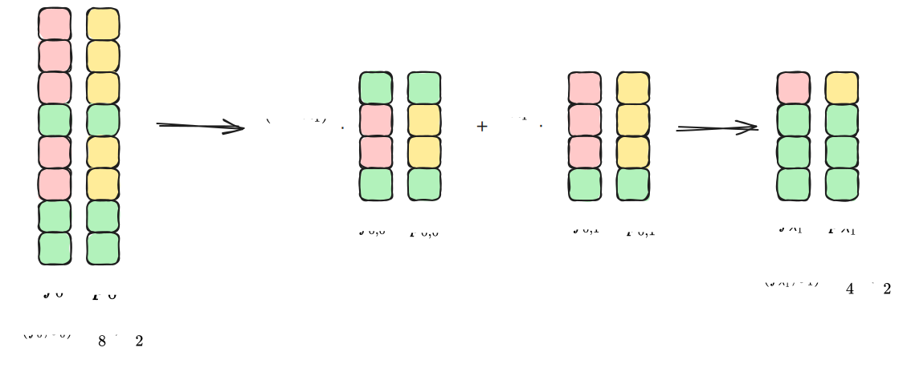
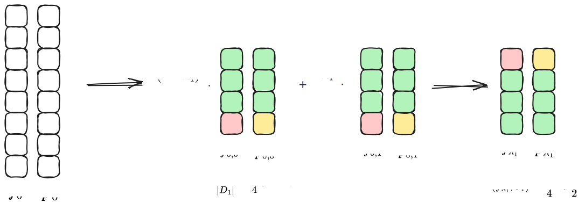
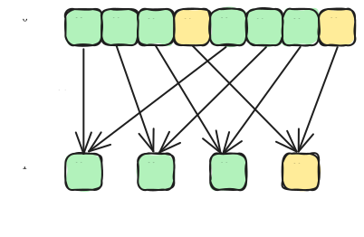
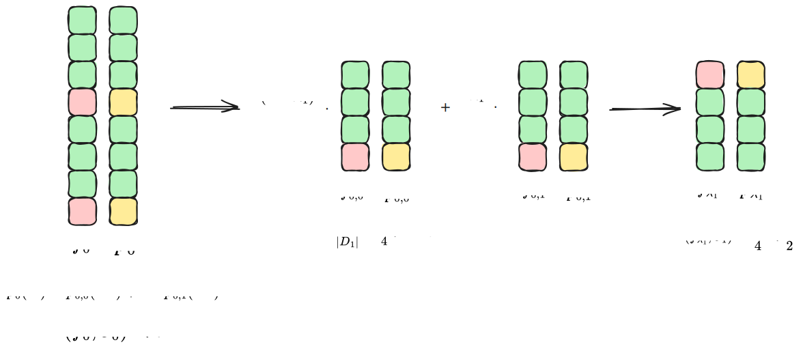
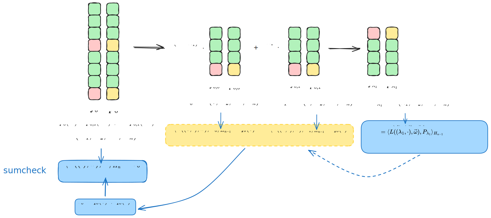
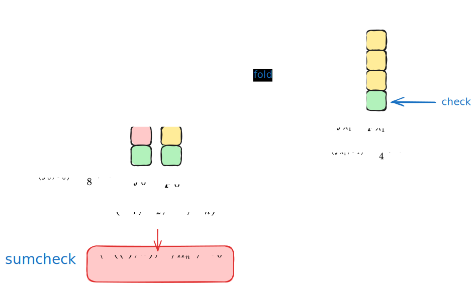

# Basefold 在 List Decoding 下的 Soundness 证明概览

- Jade Xie  <jade@secbit.io>
- Yu Guo <yu.guo@secbit.io>

本篇文章主要梳理 Ulrich Haböck 在论文 [H24] 中给出的关于 Basefold [ZCF23] 给出的 multilinear PCS 在 list decoding 下的安全性证明。在论文 [ZCF23] 中，给出的 soundness 证明是在 unique decoding 下针对 foldable linear code 的，而在 [H24] 中，其证明是针对 Reed-Solomon code 的，且是在 list decoding 下，将界提升到了 Johnson bound，即 $1 - \sqrt{\rho}$ 。为了证明安全性，论文中给出了两个比 [BCIKS20] 给出的 correlated agreement 更强的 correlated agreement 定理：

1. [H24, Theorem 3] Correlated agreement for subcodes.
2. [H24, Theorem 4] Weighted correlated agreement for subcodes.

如果考虑 Basefold 协议应用在 Reed-Solomon code 上，该协议结合了 FRI 和 sumcheck，要证明其安全性，[H24] 提出了能结合 sumcheck 约束的 subcodes，它是在 Reed-Solomon code 的基础上添加了类似 sumcheck 的约束，这样再结合对应的 correlated agreement 定理，就能对协议进行安全性证明了。

## Basefold 协议

对于一个多元线性多项式 $P(X_1, X_2, \ldots, X_n) \in F[X_1, \ldots, X_n]$ ，想要证明对于任何来自 $F^n$ 的查询 $\vec{\omega} = (\omega_1, \ldots, \omega_n)$ ，有 $v = P(\omega_1, \ldots, \omega_n)$ 。为了实现多元线性多项式 $P(X_1, X_2, \ldots, X_n)$ 的 PCS，Basefold 协议结合了 Sumcheck 与 FRI 协议。下面结合论文 [H24] 中的描述，进行介绍。

### 结合 Sumcheck 协议

为了证明  $v = P(\omega_1, \ldots, \omega_n)$ ，首先将查询的值 $P(\omega_1, \ldots, \omega_n)$ 转换为 Sumcheck 求和形式，即

$$
P(\omega_1, \ldots, \omega_n) = \sum_{\vec{x} = (x_1, \ldots, x_n) \in H_n} L(\vec{x}, \vec{\omega}) \cdot P(\vec{x}) 
$$

其中 $H_n = \{0,1\}^n$ ，这里 $L(\vec{x}, \vec{\omega})$ 其实就是 $eq(\cdot, \cdot)$ 函数，即

$$
L(\vec{x}, \vec{\omega}) = \prod_{i = 1}^n \left ((1 - x_i)(1 - \omega_i) + x_i\omega_i \right)
$$

因此要证明的 $v = P(\omega_1, \ldots, \omega_n)$ 就转换为了证明在 $H_n$ 上的求和，即

$$
\sum_{\vec{x} = (x_1, \ldots, x_n) \in H_n} L(\vec{x}, \vec{\omega}) \cdot P(\vec{x}) = v
$$

接下来用 Sumcheck 协议可以证明该求和正确。

对于 $i = 1, \ldots, n - 1$ ，Prover 需要根据挑战的随机数 $\lambda_1, \ldots,\lambda_i$ ，构造一个一元多项式为

$$
q_i(X) = \sum_{\vec{x} = (x_{i + 2}, \ldots, x_n) \in H_{n - (i + 1)}} L(\lambda_1,\ldots, \lambda_i,X,\vec{x}, \vec{\omega}) \cdot P(\lambda_1, \ldots, \lambda_i,X,\vec{x})
$$

其对应的就是多项式 $P(\lambda_1, \ldots, \lambda_i, X, \omega_{i+2}, \ldots, \omega_{n})$ 。

可以看到在 $q_i(X)$ 中，$L(\lambda_1,\ldots, \lambda_i,X,\vec{x}, \vec{\omega})$ 关于 $X$ 是一次的，而 $P(\lambda_1, \ldots, \lambda_i,X,\vec{x})$ 关于 $X$ 也是一次的，它们相乘之后关于 $X$ 就变成二次的了，为了后续和对于 linear subcodes 的 correlated agreement 定理相对应，这里提取出关于 $X$ 的一次线性项，Prover 需要发送的是线性多项式

$$
\Lambda_i(X) = \sum_{\vec{x} = (x_{i + 2}, \ldots, x_n) \in H_{n - (i + 1)}} L(\vec{x}, (\omega_{i+2}, \ldots, \omega_n)) \cdot P(\lambda_1, \ldots, \lambda_i,X,\vec{x})
$$

由于

$$
\begin{aligned}
	L((\lambda_1, \ldots, \lambda_i, X, \vec{x}), \vec{\omega}) & = L((\lambda_1, \ldots, \lambda_i, X, \vec{x}), (\omega_1, \ldots, \omega_{i}, \omega_{i+1}, \omega_{i+2}, \ldots, \omega_n)) \\
	& = \left( \prod_{j = 1}^{i}[(1 - \lambda_j)(1 - \omega_j) + \lambda_j \omega_j] \right) \\
	& \quad \cdot \left( (1 - \lambda_{i+1})(1 - \omega_{i+1}) + X \cdot \omega_{i+1} \right) \\
	& \quad \cdot \left( \prod_{j = i+2}^{n}[(1 - \lambda_j)(1 - \omega_j) + \lambda_j \omega_j] \right) \\
	& = L(\lambda_1, \ldots, \lambda_i, \omega_1, \ldots, \omega_i) \cdot L(X, \omega_{i+1}) \cdot L(\vec{x}, (\omega_{i+2}, \ldots, \omega_n))
\end{aligned}
$$

因此

$$
q_i(X) = L(\lambda_1, \ldots, \lambda_i, \omega_1, \ldots, \omega_i) \cdot L(X, \omega_{i+1}) \cdot \Lambda_i(X).
$$

Prover 只需要提供 $\Lambda_i(X)$ ，Verifier 可以自己通过上式来计算 $q_i(X)$ 。

在 Sumcheck 协议中，Prover 先发送一个单变量多项式 $\Lambda_0(X) = \sum_{\vec{x} = (x_2, \ldots, x_n) \in H_{n - 1}}L(\vec{x}, (\omega_2, \ldots, \omega_n)) \cdot P(X, \vec{x})$ 以及 $s_0 = v$ ，接着在第 $1 \le i \le n - 1$ 轮中，

1. Verifier 可以根据 $\Lambda_{i-1}(X)$ 计算出 $q_{i-1}(X)$ 并检查 $s_{i-1} = q_{i-1}(0) + q_{i-1}(1)$ 。接着选择一个随机数 $\lambda_i \leftarrow \$ F$ 发送给 Prover。
2. Prover 根据 $\lambda_i$ 计算可以得到 $P(\lambda_1, \ldots, \lambda_i, X_{i+1}, \ldots, X_n)$ ，据此算出 $\Lambda_i(X)$ 发送给 Verifier，并且 Prover 和 Verifier 同时令 $s_i = q_{i-1}(\lambda_i)$ 。

在 Sumcheck 的最后一步需要得到 $P(X_1, \ldots, X_n)$ 在一个随机点 $(\lambda_1, \lambda_2, \ldots, \lambda_n)$ 处的值，即

$$
P(\lambda_1,  \ldots, \lambda_n),
$$

该值可以通过在 FRI 协议中用同样的随机数 $\lambda_1,  \ldots, \lambda_n$ 对一个与多元线性多项式 $P(X_1, X_2, \ldots, X_n)$ 的次数不超过 $2^n - 1$ 的一元多项式 $f_{0}(X)$ 进行折叠得到。对 $f_{0}(X)$ 进行 $n$ 次折叠，最后会得到一个常数 $c$ ，我们希望其值就是 $P(\lambda_1,  \ldots, \lambda_n) = c$ 。

### 结合 FRI 协议

对于多元线性多项式 $P(X_1, X_2, \ldots, X_n)$ ，有一个一元多项式 $f_{0}(X)$ （[H24] 中称之为 *univariate representation*）与其进行对应，

$$
f_0(X) = \sum_{i = 0}^{2^n - 1} P(i_1, \ldots, i_n) \cdot X^i
$$

其中，$i_1, \ldots, i_n$ 是 $i$ 的二进制表示，$i_1$ 表示最低位，$i_n$ 表示最高位。

例如，$n = 3$ ，假设多元线性多项式为

$$
P(X_1, X_2, X_3) = a_0 + a_1 X_1 + a_2 X_2 + a_3 X_1X_2 + a_4 X_3 + a_5 X_1 X_3 + a_6 X_2 X_3 + a_7 X_1 X_2 X_3
$$

则与 $P(X_1, X_2, X_3)$ 对应的一元多项式 $f_0(X)$ 为

$$
\begin{aligned}
	f_0(X) & = \sum_{i = 0}^{7}P(i_1,i_{2},i_3) \cdot X^i \\
	& = P(0, 0, 0) + P(1, 0, 0) X + P(0, 1, 0) X^2  + P(1,1,0) X^3  \\
    & \quad + P(0,0,1) X^4 + P(1,0,1) X^5 + P(0,1,1) X^6 +  P(1, 1, 1) X^{7} \\
    & = (P(0,0,0) + P(0, 1, 0) X^2 + P(0,0,1) X^4) \\
    & \quad + X \cdot (P(1, 0, 0) + P(1,1,0) X^2 + P(1,0,1) X^4 + P(1, 1, 1) X^{6}) \\
    & = f_{0,0}(X^2) + X \cdot f_{0,1}(X^2)
\end{aligned}
$$

这里 $f_{0,0}(X^2)$ 对应了 $f_0(X)$ 的偶数项，而 $f_{0,1}(X^2)$ 对应了 $f_0(X)$ 的奇数项。可以发现偶数项中 $P(0,0,0) + P(0, 1, 0) X^2 + P(0,0,1) X^4$ 系数对应了多元线性多项式中的 $P(0, \cdot, \cdot)$ ，奇数项的系数则对应了 $P(1, \cdot, \cdot)$ 。换句话说，$f_{0,0}(X)$ 是 $P(0, X_2, X_3)$ 的 *univariate representation* ，$f_{0,1}(X)$ 是 $P(1, X_2, X_3)$ 的 univariate representation ，因为

$$
\begin{aligned}
    f_{0,0}(X) = \sum_{i = 0}^{3}P(0,i_1,i_2) \cdot X^i \\
     f_{0,1}(X) = \sum_{i = 0}^{3}P(1,i_1,i_2) \cdot X^i 
\end{aligned}
$$

用 $\lambda_1$ 对 $f_{0,0}(X)$ 与 $f_{0,1}(X)$ 进行折叠，可以得到

$$
f_1(X) = (1 - \lambda_1) \cdot f_{0,0}(X) + \lambda_1 \cdot f_{0,1}(X)
$$

而 $f_1(X)$ 恰是 $P(\lambda_1, X_2, X_3)$ 的 *univariate representation* 。注意这里折叠的方式并不是 FRI 协议中常见的

$$
f_1(X) = f_{0,0}(X) + \lambda_1 \cdot f_{0,1}(X)
$$

这是因为在这种情况下，得到的 $f_1(X)$ 并不能与 $P(\lambda_1, X_2, \ldots, X_n)$ 对应，这和一元多项式与多元线性多项式之间的对应关系是绑定的，在这种折叠方式下，它们之间的对应关系应该变为(WHIR 论文 [ACFY24] 采取的就是这种对应方式) ：

$$
f_0(X) = P(X^{2^0}, X^{2^1}, \ldots, X^{2^{n-1}})
$$

这里就不展开推导在这种对应关系下 $f_1(X)$ 能与 $P(\lambda_1, X_2, \ldots, X_n)$ 对应。

回到论文 [H24] 给出的一元多项式与多元线性多项式的对应关系，现在推导下在用 $1 - \lambda_1$ 和 $\lambda_1$ 对 $f_0(X)$ 折叠得到的 $f_1(X)$ 确实是与 $P(\lambda_1, X_2, X_3)$ 对应的。对于一般的 $P(X_1, \ldots, X_n)$ 有

$$
P(\vec{X}) = \sum_{\vec{x} \in H_n} P(\vec{x}) \cdot L(\vec{x}, \vec{X})
$$

因此

$$
\begin{aligned}
	P(\lambda_1, X_2, \ldots, X_n) & = \sum_{\vec{b} \in H_n} P(\vec{b}) \cdot L(\vec{b}, (\lambda_1, X_2, \ldots, X_n)) \\
	& = \sum_{\vec{b} \in H_n} \left(P(\vec{b}) \cdot \left((1- b_1)(1 - \lambda_1) + b_1 \lambda_1\right)\prod_{i = 2}^n \left[(1- b_i)(1 - X_i) + b_i X_i\right] \right) \\
	& = \sum_{\vec{b} \in H_{n-1}} \left(P(0, \vec{b}) \cdot \left((1- 0)(1 - \lambda_1) + 0 \cdot  \lambda_1\right)\prod_{i = 2}^n \left[(1- b_i)(1 - X_i) + b_i X_i\right] \right) \\
	& \quad + \sum_{\vec{b} \in H_{n-1}} \left(P(1, \vec{b}) \cdot \left((1- 1)(1 - \lambda_1) + 1 \cdot \lambda_1\right)\prod_{i = 2}^n \left[(1- b_i)(1 - X_i) + b_i X_i\right] \right) \\
	& = \sum_{\vec{b} \in H_{n-1}} \left(P(0, \vec{b}) \cdot (1 - \lambda_1)\prod_{i = 2}^n \left[(1- b_i)(1 - X_i) + b_i X_i\right] \right) \\
	& \quad + \sum_{\vec{b} \in H_{n-1}} \left(P(1, \vec{b}) \cdot \lambda_1 \prod_{i = 2}^n \left[(1- b_i)(1 - X_i) + b_i X_i\right] \right) \\
	& =  (1 - \lambda_1) \sum_{\vec{b} \in H_{n-1}} \left(P(0, \vec{b}) \cdot\prod_{i = 2}^n \left[(1- b_i)(1 - X_i) + b_i X_i\right] \right) \\
	& \quad + \lambda_1 \sum_{\vec{b} \in H_{n-1}} \left(P(1, \vec{b}) \cdot  \prod_{i = 2}^n \left[(1- b_i)(1 - X_i) + b_i X_i\right] \right) \\
	& = (1 - \lambda_1) P(0, X_2, \ldots, X_n) + \lambda_1 P(1, X_2, \ldots, X_n)
\end{aligned}
$$

从而有

$$
\begin{aligned}
    f_1(X) & = (1 - \lambda_1) \cdot f_{0,0}(X) + \lambda_1 \cdot f_{0,1}(X) \\
    & = (1 - \lambda_1) \cdot \sum_{i = 0}^{3}P(0,i_1,i_2) \cdot X^i + \lambda_1 \cdot \sum_{i = 0}^{3}P(1,i_1,i_2) \cdot X^i \\
    & = \sum_{i = 0}^{3}((1 - \lambda_1)P(0,i_1,i_2) + \lambda_1 P(1,i_1,i_2)) \cdot X^i \\
    & = \sum_{i = 0}^{3}P(\lambda_1, i_1, i_2) \cdot X^i
\end{aligned}
$$

至此也就说明了 $f_1(X)$ 是 $P(\lambda_1, X_2, X_3)$ 的 univariate representation 。接着按这种方式对 $f_1(X)$ 用随机数 $\lambda_2, \lambda_3$ 进行折叠，最后得到常数多项式，其值就恰好对应 $P(\lambda_1, \lambda_2, \lambda_3)$ 。总结一下，Basefold 协议就是一边用随机数对多元线性多项式进行 Sumcheck 协议，一边用同样的随机数对对应的一元多项式进行 FRI 协议，从而实现多元线性多项式的 PCS，这对应 [H24, Protocol 1] ，是针对 Reed-Solomon  的 Basefold 协议 。整体协议的思路如此，这里就不再复述具体的协议流程了，详见 [H24, Protocol 1]  。

> 🐞 **typo**
>  在 [H24, Protocol 1] 中，Query 阶段论文中写道需要检验的折叠关系为
> 
> $$
>  f_{i+1}(x_{i+1}) = \frac{f_0(x_i) + f_0(-x_i)}{2} + \lambda_i \cdot \frac{f_0(x_i) + f_0(-x_i)}{2 \cdot x_i}
> $$
>
> 但根据前文给出的折叠关系，我认为应该改为
>
> $$
>  f_{i+1}(x_{i+1}) = (1 - \lambda_i) \cdot \frac{f_0(x_i) + f_0(-x_i)}{2} + \lambda_i \cdot \frac{f_0(x_i) - f_0(-x_i)}{2 \cdot x_i}
> $$

[H24] 论文证明的 soundness 是针对的更通用的一个协议，即 batch 版本的 Basefold 协议。

> **Protocol 2** [H24, Protocol 2] (Batch Reed-Solomon code Basefold). The prover shares the Reed-Solomon codewords $g_0, \ldots, g_M \in \mathcal{C}_0 = \mathrm{RS}_{2^n}[F,D_0] = \{q(x)|_{x \in D_0}: q(x) \in F[X]^{<2^n} \}$ of the multilinears $G_0, \ldots, G_M$ , together with their evaluation claims $v_0, \ldots, v_M$ at $\vec{\omega} \in F^n$ with the verifier. Then they engage in the following extension of Protocol 1:
> 1. In a preceding round $i = 0$ , the verifier sends a random $\lambda_0 \leftarrow \$ F$ , and the prover answers with the oracle for
>
> $$
> f_0 = \sum_{k = 0}^{M} \lambda_0^k \cdot g_k \tag{1} 
> $$
> 
> Then both prover and verifier engage in Protocol 1 on $f_0$ and the claim $v_0 = \sum_{k = 0}^M \lambda_0^k \cdot v_k$ . In addition to the checks in Protocol 1, the verifier also checks that equation $(1)$ holds at every sample $x$ from $D_0$ .

batch 版本的 Basefold 协议其实就是用一个随机数 $\lambda_{0}$ ，通过它的幂次将 $g_{0}, \ldots, g_{M}$ 线性组合起来，转换成一个函数 $f_{0}$ ，再对它用 Protocol 1。

## Soundness 概览

本节主要分析 Protocol 2 的 soundness error 证明思路。首先说明 soundness error 的含义，对于任意一个可能作恶的 Prover $P^*$ ，其给出的 $g_{0}, \ldots, g_{M}$ 中存在 $g_{k}$ 距离 Reed-Solomon 编码空间 $\mathcal{C}_0$ 超过 $\theta$ （[H24] 中研究 list decoding 下的证明，因此考虑参数 $\theta \in \left( \frac{1 - \rho}{2}, 1 - \sqrt{\rho} \right)$），或者 $g_k$ 对应的 multilinear representation $P_k$ 不满足 evaluation claim $P_{k}(\vec{\omega}) = v_{k}$ ，在此条件下，$P^*$ 通过 Verifier 检查的概率不超过 $\varepsilon$ ，这个概率 $\varepsilon$ 就称为 soundness error。换句话说，soundness error 就是分析作恶的 Prover $P^*$ 能侥幸通过 Verifier 检查的概率。$P^*$ 能侥幸通过检查，可能发生的地方会是那些引入随机的地方，分析协议发现有三处：
1. Commit 阶段
	1. 用随机数 $\lambda_{0}$ 将 $g_{0},\ldots, g_{M}$ 进行 batch，设此概率为 $\varepsilon_{C_1}$ 。
	2. 用随机数 $\lambda_1, \ldots, \lambda_n$ 进行 sumcheck 协议与类似 FRI 折叠的过程，设此概率为 $\varepsilon_{C_2}$ 。
2. Query 阶段
   1. Verifier 随机选取 $x_0 \leftarrow D_0$ 来检查折叠是否正确，设此概率为 $\varepsilon_{\mathrm{query}}$

因此，整个协议的 soundness error 为

$$
\varepsilon < \varepsilon_{C_1} + \varepsilon_{C_2} + \varepsilon_{\mathrm{query}}.
$$

### Commit 阶段

现在考虑用 $\lambda_1 \leftarrow \$ F$ 将 $f_0$ 折叠成 $f_{\lambda_1}$ 的情况，即

$$
f_{\lambda_1} = (1 - \lambda_1) \cdot f_{0,0} + \lambda_1 \cdot f_{0,1}
$$

假设给定的参数 $\theta = \frac{1}{2}$ ，由于 $\lambda_1$ 是选取自 $F$ 的随机数，有可能出现下面这种情况：

图中的 $p_0, p_{0,0}, p_{0,1}, p_{\lambda_1}$ 分别是对应 Reed-Solomon 编码空间中距离 $f_0, f_{0,0}, f_{0,1}, f_{\lambda_1}$ 最近的码字，颜色同为绿色表示它们在该点值相同，而不同的颜色表示在该点的值不同。可以看出，对于作恶的 Prover 提供的 $f_0$ ，其距离 Reed-Solomon 空间 $\mathcal{C}_0$ 的距离大于 $\theta = \frac{1}{2}$ ，但是经过 $\lambda_1$ 进行折叠之后得到的 $f_{\lambda_1}$ 距离 Reed-Solomon 空间 $\mathcal{C}_1$ 可能出现小于 $\theta$ 的情况，这样 $f_1$ 在后续的协议中就会通过 Verifier 的折叠验证，$P^*$ 就成功的欺骗了 Verifier 。

那么出现上述这种情况的概率是多少呢？其由 [BCIKS20] 给出的 Correlated Agreement 定理给出。该定理说的是，如果

$$
\Pr_{\lambda_1 \in F}[\Delta((1 - \lambda_1) f_{0,0} + \lambda_1 f_{0,1}, \mathcal{C}_1) \le \theta] > \epsilon
$$

其中 $\epsilon$ 是一个和 $\theta, \rho, |F|, |D_1|$ 相关的一个式子，也可写为 $\epsilon(\theta, \rho, |F|, |D_1|)$，并且在 unique decoding 和 list decoding 下其给出的形式也不同（这一部分留在在下一节中进行详细说明）。也就是，取遍 $\lambda_1$ 在 $F$ 中的所有可能，得到 $f_{\lambda_1}$ ，其中距离 $\mathcal{C}_1$ 不超过 $\theta$ 的比例超过了 $\epsilon$ ，那么就一定存在一个子集 $D' \subset D_1$ 以及 $\mathcal{C}_1$ 中的码字 $p_{0,0}, p_{0,1}$ 使得 

1. $|D'|/|D_1| \ge 1 - \theta$ ，
2. $f_{0,0}|_{D'} = p_{0,0}|_{D'}$ 以及 $f_{0,1}|_{D'} = p_{0,1}|_{D'}$ 。

现在我们能得到 $f_{0,0}$ 与 $f_{0,1}$ 不仅距离编码空间 $\mathcal{C}_1$ 比较近，同时它们共享一个相同的集合 $D'$ 与对应的码字相同。这是一个很好的结论，可以帮我们来推导原来的 $f_0$ 到 $\mathcal{C}_0$ 的距离。

通过映射 $\pi: x \mapsto x^2$ 可以将 $D_0$ 中的点映射到 $D_1$ ，现在可用 $\pi^{-1}$ 将 $D' \subseteq D_1$ 中的点映射回 $D_0$ ，例如，设 $\omega^8 = 1$ 及

$$
D_0 = \{\omega^0, \omega^1, \omega^2, \omega^3, \omega^4, \omega^5, \omega^6, \omega^7\}
$$

则通过映射 $\pi: x \mapsto x^2$ 可以得到

$$
D_1 = \{\omega^0, \omega^2, \omega^4, \omega^6\}
$$

假设 $D' = \{\omega^0, \omega^2, \omega^4 \}$ ，那么可以得到

$$
\pi^{-1}(D') = \{\omega^0, \omega^1, \omega^2, \omega^4, \omega^5, \omega^6 \}
$$

如下图所示：

现在根据 correlated agreement 定理得到了 $f_{0,0}|_{D'} = p_{0,0}|_{D'}$ 以及 $f_{0,1}|_{D'} = p_{0,1}|_{D'}$ ，因此可以根据 $p_{0,0}$ 以及 $p_{0,1}$ 得到折叠之前的多项式

$$
p_0(X) = p_{0,0}(X^2) + X \cdot p_{0,1}(X^2)
$$

可以得出 $f_0(X)$ 与 $p_0(X)$ 在 $\pi^{-1}(D')$ 上的值是一致，由此也就得到了 $f_0(X)$ 到编码空间 $\mathcal{C}_0$ 的距离

$$
\Delta(f_0, \mathcal{C}_0) \le \frac{|\pi^{-1}(D')|}{|D_0|} \le \theta
$$

这也就能说明 Prover 没有作弊，函数 $f_0$ 距离对应的编码空间不超过 $\theta$ 。回到最初的问题，我们想分析 Prover 作弊情况下，其能成功骗过 Verifier 的概率，现在 correlated agreement 定理告诉了我们除了一个概率 $\epsilon$ ，能确保 Prover 没有作弊，这也说明如果 Prover 作弊，能成功骗过 Verifier 的概率不会超过这个概率 $\epsilon$ 。

至此我们就分析完 Commit 阶段的 soundness error 了吗？回顾下上述分析，我们使用 correlated agreement 定理得到了由于折叠随机数 $\lambda_1$ 的引入，导致折叠之后的多项式能骗过 Verifier 的概率，但是有一点要记住，Basefold 协议不仅要检查类似 FRI 的折叠是否正确，还要同时检查 sumcheck 的约束，因此上述分析是不够的。仿照上述 correlated agreement 定理的思路，在其基础上增加 sumcheck 的约束，如果存在的多项式 $p_{\lambda_1}$ 对应的 $P_{\lambda_1} = P(\lambda_1, X_2, \ldots, X_n)$ 满足 sumcheck 约束，想得到 $p_{0,0}(X)$ 与 $p_{0,1}(X)$ 对应的 $P_0 = P(0, X_2, \ldots, X_n)$ 与 $P_1 = P(1, X_2, \ldots, X_n)$ 也满足 sumcheck 约束，这样我们就能推断折叠前是否满足 sumcheck 约束了。

现在考虑 sumcheck 约束，已知

$$
\langle L((\lambda_1, \cdot), \vec{\omega}), P_{\lambda_1} \rangle_{H_{n-1}} = q_0(\lambda_1)
$$

想得到

$$
\langle L((0, \cdot), \vec{\omega}), P_{0} \rangle_{H_{n-1}} = q_0(0) \tag{2}
$$

$$
\langle L((1, \cdot), \vec{\omega}), P_{1} \rangle_{H_{n-1}} = q_0(1) \tag{3}
$$

如果式 $(2)$ 与式 $(3)$ 成立，由于 $s_0 = q_0(0) + q_0(1)$ ，则可以得到由 $p_{0,0}(X)$ 与 $q_{0,1}(X)$ 得到的 $p_0(X)$ 对应的多元线性多项式 $P(X)$ 满足 sumcheck 约束。

下面根据[H24]在 3.2 节的思路，推导出式 $(2)$ 与式 $(3)$ 成立。根据 $q_i(X)$ 与 $\Lambda_i(X)$ 的关系，得到

$$
q_0(\lambda_1) = L(\lambda_1, \omega_1)  \cdot \Lambda_0(\lambda_1)
$$

而 

$$
\langle L((\lambda_1, \cdot), \vec{\omega}), P_{\lambda_1} \rangle_{H_{n-1}}  = L(\lambda_1, \omega_1) \cdot \langle L(\cdot, \omega_2, \ldots, \omega_n), P_{\lambda_1} \rangle_{H_{n-1}} 
$$

因此

$$
L(\lambda_1, \omega_1) \cdot \langle L(\cdot, \omega_2, \ldots, \omega_n), P_{\lambda_1} \rangle_{H_{n-1}}  = L(\lambda_1, \omega_1)  \cdot \Lambda_0(\lambda_1)
$$

由于 $L(X, \omega_1) = (1 - X)(1 - \omega_1) + X \cdot \omega_1$ 是一个一次多项式，因此，$L(X)$ 在 $F$ 中只有一个零点，当 $\lambda_1$ 取到该点时，就会有 $L(\lambda_1, \omega_1) = 0$ ，此时上式自然成立，而发生这样的概率为 $1 / |F|$ 。若 $L(\lambda_1, \omega_1) \neq 0$ ，则有

$$
\langle L(\cdot, \omega_2, \ldots, \omega_n), P_{\lambda_1} \rangle_{H_{n-1}} = \Lambda_0(\lambda_1)
$$

[H24] 论文中给出

$$
\langle L(\cdot, \omega_2, \ldots, \omega_n), P_{\lambda_1} - \Lambda_0(\lambda_1)  \rangle_{H_{n-1}} = 0 \tag{4}
$$

在这里给出一个详细推导，由于 $P_{\lambda_1} = P(\lambda_1, X_2, \ldots, X_n)$ ，那么

$$
\begin{aligned}
	\langle L(\cdot, \omega_2, \ldots, \omega_n), P_{\lambda_1}  \rangle_{H_{n-1}} & = \sum_{\vec{x} \in H_{n-1}} L(\vec{x}, (\omega_2, \ldots, \omega_n)) \cdot P(\lambda_1, \vec{x}) \\
	& = P(\lambda_1, \omega_2, \ldots, \omega_n)
\end{aligned}
$$

那么上面的等式即为

$$
P(\lambda_1, \omega_2, \ldots, \omega_n) = \Lambda_0(\lambda_1)
$$

设一个函数为 $P'(X_2,\ldots, X_n) = P(\lambda_1, X_2, \ldots, X_n) - \Lambda_0(\lambda_1)$ ，其在点 $(\omega_2, \ldots, \omega_n)$ 处的求值为 $P'(\omega_2, \ldots, \omega_n) = 0$ ，且 $P'(\omega_2, \ldots, \omega_n)$ 可表示为

$$
\begin{aligned}
	P'(\omega_2, \ldots, \omega_n) & = \langle L(\cdot, \omega_2, \ldots, \omega_n), P'(\cdot)  \rangle_{H_{n-1}} \\
	& = \langle L(\cdot, \omega_2, \ldots, \omega_n), P(\lambda_1, \cdot) - \Lambda_0(\lambda_1)  \rangle_{H_{n-1}} \\
	& = \langle L(\cdot, \omega_2, \ldots, \omega_n), P_{\lambda_1} - \Lambda_0(\lambda_1)  \rangle_{H_{n-1}} \\
	& = 0
\end{aligned}
$$

因此

$$
\langle L(\cdot, \omega_2, \ldots, \omega_n), P_{\lambda_1} - \Lambda_0(\lambda_1)  \rangle_{H_{n-1}} = 0
$$

由线性性知

$$
\Lambda_{0}(\lambda_1) = (1 - \lambda_1) \cdot \Lambda_{0}(0) + \lambda_1 \cdot \Lambda_{0}(1) \tag{5}
$$

同时

$$
f_{\lambda_1} = (1 - \lambda_1) \cdot f_{0,0} + \lambda_1 \cdot f_{0,1} \tag{6}
$$

由等式 $(6)$ 减去 $(5)$ 得到

$$
f_{\lambda_1} - \Lambda_{0}(\lambda_1) = (1 - \lambda_1) \cdot (f_{0,0} - \Lambda_{0}(0)) + \lambda_1 \cdot (f_{0,1} - \Lambda_{0}(1))
$$

令新的多项式 

$$
f_{\lambda_1}' =  (1 - \lambda_1) \cdot (f_{0,0} - \Lambda_{0}(0)) + \lambda_1 \cdot (f_{0,1} - \Lambda_{0}(1))
$$

依照之前 correlated agreement 定理的思路，根据条件，若

$$
\Pr_{\lambda_1 \in F}[\Delta((1 - \lambda_1) f_{0,0} + \lambda_1 f_{0,1}, \mathcal{C}_1) \le \theta] > \epsilon
$$

 也就是 $f_{\lambda_1}$ 距离 $p_{\lambda_1}$ 不超过 $\theta$ 大于一个界限 $\epsilon$ ，那么它们同时减去一个数 $\Lambda_0(\lambda_1)$ ，并不影响它们之间的距离，因此 $f_{\lambda_1}'$ 距离 $p_{\lambda_1}' = p_{\lambda_1} - \Lambda_0(\lambda_1)$ 不超过 $\theta$ 。

$p_{\lambda_1}' = p_{\lambda_1} - \Lambda_0(\lambda_1)$ 属于哪个编码空间呢？我们知道 $p_{\lambda_1} \in \mathcal{P}_{n - 1} = F[X]^{<2^{n-1}}$ ，而 $\Lambda_0(\lambda_1)$ 本质上是一个数，因此 $p_{\lambda_1}'$ 依然在 $\mathcal{P}_{n - 1}$ 空间中。同时我们上面已经推导出

$$
\langle L(\cdot, \omega_2, \ldots, \omega_n), P_{\lambda_1} - \Lambda_0(\lambda_1)  \rangle_{H_{n-1}} = 0 
$$

说明 $p_{\lambda_1}'$ 对应的多元线性多项式还满足一个这样的内积约束，因此可以说 $p_{\lambda_1}'$ 在 $\mathcal{P}_{n - 1}$ 的一个子空间中，即

$$
\mathcal{P}_{n - 1}' = \{u(X) \in \mathcal{P}_{n - 1}: \langle L(\cdot, \omega_2, \ldots, \omega_n), U \rangle_{H_{n-1}} = 0 \}
$$

上式中的 $U$ 就是与 $u(X)$ 相对应的多元线性多项式。由这样的一个多项式子空间可以形成编码空间 $\mathcal{C}_1$ 的线性子码 $\mathcal{C}_1'$ 。可以看到，通过将 $q_i(X)$ 中的线性项 $\Lambda_i(X)$ 提出来，添加了类似 sumcheck 的约束之后，发现要考虑的编码空间是原来编码空间的一个线性子空间。

现在总结下目前得到的结论，记 $f_{0,0}' := f_{0,0} - \Lambda_0(0)$ , $f_{0,1}' := f_{0,1} - \Lambda_0(1)$ ，有

$$
f_{\lambda_1}' = (1 - \lambda_1) \cdot f_{0,0}' + \lambda_1 \cdot f_{0,1}'
$$

同时，$f_{\lambda_1}'$ 距离 $p_{\lambda_1}' = p_{\lambda_1} - \Lambda_0(\lambda_1)$ 不超过 $\theta$ 大于 $\epsilon$ ， $p_{\lambda_1}' \in \mathcal{P}_{n-1}'$ ，即

$$
\Pr_{\lambda_1 \in F}[\Delta((1 - \lambda_1) f_{0,0}' + \lambda_1 f_{0,1}', \mathcal{C}_1') \le \theta] > \epsilon
$$

[H24, Theorem 3] 就给出了关于线性子码的 correlated agreement 定理，其严格描述留在下一节中进行介绍。该定理结论给出，会存在来自 $\mathcal{P}_{n-1}'$ 的多项式 $p_{0,0}'$ 以及 $p_{0,1}'$ ，以及 $D' \subseteq D_1$ ，满足
1. $|D'|/|D_1| \ge 1 - \theta$ ，
2. $f_{0,0}'|_{D'} = p_{0,0}'|_{D'}$ 以及 $f_{0,1}'|_{D'} = p_{0,1}'|_{D'}$ 。

这里 $\mathcal{P}_{n-1}'$ 就包含了 sumcheck 的约束。根据 $f_{0,0}'$ 和 $f_{0,1}'$ 的定义可以得到

$$
\begin{aligned}
	f_{0,0} = f_{0,0}' + \Lambda_0(0) \\
	f_{0,1} = f_{0,1}' + \Lambda_0(1)
\end{aligned}
$$

由于 $\Lambda_0(0)$ 与 $\Lambda_0(1)$ 本质上都表示一个数，根据结论 2 ，就有

$$
\begin{aligned}
	f_{0,0}(X)|_{D'} = p_{0,0}'(X)|_{D'} + \Lambda_0(0) = (p_{0,0}'(X) + \Lambda_0(0))|_{D'} \\
	f_{0,1}(X)|_{D'} = p_{0,1}'(X)|_{D'} + \Lambda_0(1) = (p_{0,1}'(X) + \Lambda_0(1))|_{D'} \\
\end{aligned}
$$

令

$$
\begin{aligned}
	p_{0,0}(X) = p_{0,0}'(X) + \Lambda_0(0) \\
	p_{0,1}(X) = p_{0,1}'(X) + \Lambda_0(1)
\end{aligned}
$$

因此 $f_{0,0}(X), f_{0,1}(X)$ 分别与 $p_{0,0}(X), p_{0,1}(X)$ 在 $D'$ 上是一致的。由 $p_{0,0}(X), p_{0,1}(X)$ 可以分别得到它们对应的多元多项式 $P_0, P_1 \in F[X_2, \ldots, X_n]$ 。而 $p_{0,0}'(X), p_{0,1}'(X) \in \mathcal{P}_{n-1}'$ ，因此它们对应的多元线性多项式 $P_{0,0}', P_{0,1}'$ 满足

$$
\begin{aligned}
	\langle L(\cdot, \omega_2, \ldots, \omega_n), P_{0,0}' \rangle_{H_{n-1}} = 0 \\
	\langle L(\cdot, \omega_2, \ldots, \omega_n), P_{0,1}' \rangle_{H_{n-1}} = 0 \\
\end{aligned}
$$

因此

$$
\begin{aligned}
	& \langle L(\cdot, \omega_2, \ldots, \omega_n), P_{0,0}' + \Lambda_0(0) - \Lambda_0(0) \rangle_{H_{n-1}} = 0 \\
	& \langle L(\cdot, \omega_2, \ldots, \omega_n), P_{0,1}' + \Lambda_0(1) - \Lambda_0(1) \rangle_{H_{n-1}} = 0 \\
	\Rightarrow \qquad \\
	& \langle L(\cdot, \omega_2, \ldots, \omega_n), P_0 - \Lambda_0(0) \rangle_{H_{n-1}} = 0 \\
	& \langle L(\cdot, \omega_2, \ldots, \omega_n), P_1 - \Lambda_0(1) \rangle_{H_{n-1}} = 0 \\
	\Rightarrow \qquad \\
	& \langle L(\cdot, \omega_2, \ldots, \omega_n), P_0 \rangle_{H_{n-1}} =  \Lambda_0(0) \\
	& \langle L(\cdot, \omega_2, \ldots, \omega_n), P_1 \rangle_{H_{n-1}} = \Lambda_0(1) 
\end{aligned}
$$

在上式两边分别同时乘以 $L(0, \omega_1), L(1, \omega_1)$ ，由 $q_0(X) = L(X, \omega_1) \cdot \Lambda_0(X)$ 可得

$$
\begin{aligned}
	\langle L((0, \cdot), \vec{\omega}), P_{0} \rangle_{H_{n-1}} = q_0(0)\\
	\langle L((1, \cdot), \vec{\omega}), P_{1} \rangle_{H_{n-1}} = q_0(1)
\end{aligned}
$$

至此也就说明了式 $(2)$ 与式 $(3)$ 成立，也就能推出 $p_0(X)$ 对应的 $P(X)$ 是满足 sumcheck 约束的。

综上，在 commit 阶段的 soundness error 可以按上述思路分析，具体概率由 correlated agreement 给出。[H24, Theorem 1] 给出 commit 阶段的 soundness error 为

1. batching 阶段：$\varepsilon_{C_1} = \varepsilon(\mathcal{C}_0, M, 1, \theta)$ 。
2. sumcheck 与类似 FRI 折叠阶段：$\varepsilon_{C_2} = \sum_{i = 1}^n \left(\frac{1}{|F|} + \varepsilon(\mathcal{C}_i, 1, B_i, \theta) \right)$ ，其中 $\frac{1}{|F|}$ 就是在化简 sumcheck 约束时要使得 $L(X, \omega_i) = 0$ 额外引入的。

上述 $\varepsilon(\mathcal{C}_i, M_i, B_i, \theta)$ 是由 [H24, Theorem 4] 带权重的 weighted correlated agreement 定理给出的。

### Query 阶段

对于一个作恶的 Prover $P^*$ ，现在排除在 Commit 阶段出现能侥幸通过 Verifier 检查的情况，经过一次折叠，$f_{\lambda_1}$ 会出现离 $\mathcal{C}_1$ 有 $\theta$ 远，或者 sumcheck 约束不正确。

对于 $\Delta(f_0, \mathcal{C}_0) > \theta$ ，由于 Verifier 会在 $D_0$ 中随机选取一个 $x_0$ 来检查折叠是否正确，因此如果查询到那些 $f_{\lambda_1}$ 和 $p_{\lambda_1}$ 在 $D_1$ 上一致的那些点，则会检查通过。这个比例不超过 $1 - \theta$ ，如果重复查询 $s$ 次，那么 $P^*$ 侥幸通过检查的概率不超过 $(1 - \theta)^s$ 。

对于 sumcheck 约束不正确的情况，verifier 会用 sumcheck 协议来检查约束是否正确，这里 $P^*$ 不可能作弊成功，一定能被检查出来。

综上，在 query 阶段 soundness error 为 $\varepsilon_{\mathrm{query}} = (1 - \theta)^s$ 。

因此，就得到了 [H24, Theorem 1] 给出的整个协议的 soundness error 

$$
\begin{aligned}
	\varepsilon & < \varepsilon_{C_1} + \varepsilon_{C_2} + \varepsilon_{\mathrm{query}} \\
	& =  \varepsilon(\mathcal{C}_0, M, 1, \theta) + \sum_{i = 1}^n \left(\frac{1}{|F|} + \varepsilon(\mathcal{C}_i, 1, B_i, \theta) \right) + (1 - \theta)^s
\end{aligned}
$$
> 🐞 **typo**
> 我认为 [H24, Theorem 1] 条件中给出的 $\theta = (1 + \frac{1}{2m}) \cdot \sqrt{\rho}$ 有误，根据后文的 [H24, Theorem 4] 给出的条件，应该改为  $\theta = 1 - (1 + \frac{1}{2m}) \cdot \sqrt{\rho}$ 。

## Correlated agreement 定理

本小节介绍 [BCIKS20] 给出的 correlated agreement 定理，以及 [H24] 在此基础上给出的针对 subcodes 的 correlated agreement 定理。

首先是 [BCIKS20] 给出的 correlated agreement 定理，分为 unique decoding 界和在 list decoding 下达到 Johnson 界两个定理，符号上做了一些变化。令 $F$ 表示一个有限域，$\mathcal{C} = RS_k[F, D]$ 表示在 $F$ 上的 Reed-Solomon code，其 evaluation domain 为 $D$ ，码率为 $\rho = k /|D|$ 。

**Theorem 3** [BCIKS20, Theorem 6.1] 假设 $\theta \leq \frac{1 - \rho}{2}$. 令 $f_0, f_1, \ldots, f_M \in F^D$ 表示 $D \to F$ 的函数。若

$$ 
\frac{|\{ z \in F : \Delta(f_0 + z \cdot f_1 + \ldots + z^M \cdot f_M, \mathcal{C}) \le \theta \}|}{|F|} > \varepsilon 
$$

其中

$$
\varepsilon = M \cdot \frac{|D|}{|F|}
$$

那么对于任意的 $z \in F$ ，有

$$ 
\Delta(f_0 + z \cdot f_1 + \ldots + z^M \cdot f_M, \mathcal{C}) \leq \theta, 
$$

另外，存在 $p_0, \ldots, p_M \in \mathcal{C}$ 使得对所有的 $z \in F$ ，有

$$ 
\Delta(u_0 + zu_1 + \cdots + z_l u_l, v_0 + zv_1 + \cdots + z_l v_l) \leq \theta 
$$

事实上，

$$ 
| \{ x \in D : (u_0(x), \ldots, u_l(x)) \neq (v_0(x), \ldots, v_l(x)) \} | \leq \theta |D|. 
$$

**Theorem 4** [BCIKS20, Theorem 6.2] 令 $f_0, f_1, \ldots, f_M \in F^D$ 表示 $D \to F$ 的函数。设 $m \ge 3$ ，定义 $\theta_0(\rho, m) := 1 - \sqrt{\rho} \cdot (1 + \frac{1}{2m})$ ，令 $\theta \le \theta_0(\rho, m)$ ，若

$$ 
\frac{|\{ z \in F : \Delta(f_0 + z \cdot f_1 + \ldots + z^M \cdot f_M, \mathcal{C}) \le \theta \}|}{|F|} > \varepsilon 
$$

其中

$$
\varepsilon = M \cdot \frac{(m+\frac{1}{2})^7}{3 \cdot \rho^{3/2}} \cdot \frac{|D|^2}{|F|}
$$

那么 $f_0, f_1, \ldots, f_M$ 同时都距离 $\mathcal{C}_0$ 有 $\theta$ 近，即存在 $p_0, \ldots, p_M \in \mathcal{C}$ 使得

$$ 
| \{ x \in D : \forall 0 \leq i \leq M, f_i(x) = p_i(x) \} | \geq (1 - \theta) |D|. 
$$

Theorem 3 和 Theorem 4 分别给出了 unique decoding 和 list decoding 下的 correlated agreement 定理，虽然表述形式和上一节中给出的有所区别，但表达的含义是一样的，这里就给出了具体的 $\varepsilon$ 表达式。

在论文 [H24] 中，通过分析 [BCIKS20] 中 correlated agreement 定理证明中的 Guruswami-Sudan list decoder，得到了在 list decoding 下针对 subcode 的 correlated agreement 定理。

**Theorem 5** [H24, Theorem 3] (Correlated Agreement for Subcodes) 令 $F$ 表示一个任意特征(characteristic)的有限域，$\mathcal{C} = RS_k[F, D]$ 表示在 $F$ 上的 Reed-Solomon code，其 evaluation domain 为 $D$ ，码率为 $\rho = k /|D|$ 。令 $\mathcal{C}'$ 为 $\mathcal{C}$ 的一个线性子码(linear subcode)，由一个来自于 $F[X]^{<k}$ 的多项式的子空间 $\mathcal{P}'$ 生成。给定一个 proximity 参数  $\theta = 1 - \sqrt{\rho} \cdot \left(1 + \frac{1}{2m}\right)$ ，其中 $m \geq 3$ ，且 $f_0, f_1, \ldots, f_M \in F^D$ 满足

$$
\frac{|\{ z \in F : \Delta(f_0 + z \cdot f_1 + \ldots + z^M \cdot f_M, \mathcal{C}') < \theta \}|}{|F|} > \varepsilon,
$$

其中

$$
\varepsilon = M \cdot \frac{(m+\frac{1}{2})^7}{3 \cdot \rho^{3/2}} \cdot \frac{|D|^2}{|F|} ,
$$

则存在多项式 $p_0, p_1, \ldots, p_M \in \mathcal{P}'$ ，以及一个集合 $D' \subseteq D$ ，满足
1. $|D'|/|D| \ge 1 - \theta$
2. $f_0, f_1, \ldots, f_M$ 与 $p_0, p_1, \ldots, p_M$ 分别在 $D'$ 上是一致的。

对比 Theorem 5 和 Theorem 4，从 $\varepsilon$ 的表达式来说，它们的形式可以说是一致的，不同的是 Theorem 5 是在 Reed-Solomon 编码空间的一个线性子码中考虑的。这里自然推测对于 unique decoding ，针对 subcode 也有类似 Theorem 4 的结果。

**Conjecture 6** 令 $F$ 表示一个任意特征(characteristic)的有限域，$\mathcal{C} = RS_k[F, D]$ 表示在 $F$ 上的 Reed-Solomon code，其 evaluation domain 为 $D$ ，码率为 $\rho = k /|D|$ 。令 $\mathcal{C}'$ 为 $\mathcal{C}$ 的一个线性子码(linear sucode)，由一个来自于 $F[X]^{<k}$ 的多项式的子空间 $\mathcal{P}'$ 生成。设 $\theta \le \frac{1 - \rho}{2}$，且 $f_0, f_1, \ldots, f_M \in F^D$ 满足

$$
\frac{|\{ z \in F : \Delta(f_0 + z \cdot f_1 + \ldots + z^M \cdot f_M, \mathcal{C}') < \theta \}|}{|F|} > \varepsilon,
$$

其中

$$
\varepsilon = M \cdot \frac{|D|}{|F|}
$$

则存在多项式 $p_0, p_1, \ldots, p_M \in \mathcal{P}'$ ，以及一个集合 $D' \subseteq D$ ，满足
1. $|D'|/|D| \ge 1 - \theta$
2. $f_0, f_1, \ldots, f_M$ 与 $p_0, p_1, \ldots, p_M$ 分别在 $D'$ 上是一致的。

类似在 [BCIKS20] 中对 batch FRI 协议的 soundness 证明，其用到的是 weighted 版本的 correlated agreement 定理，对于 batch Basefold 协议，在 [H24] 中也给出了 weighted correlated agreement 定理。根据 [H24] 中的描述，首先说明下 weighted 的含义，在 $D$ 上给定一个子概率测度 $\mu$ 以及 $f \in F^D$ ，记

$$
\mathrm{agree}_{\mu}(f, \mathcal{C}') \ge 1 - \theta
$$

含义是存在在 $\mathcal{P}'$ 中的一个多项式 $p(X)$ ，使得 $\mu(\{x \in D: f(x) = p(x)\}) \ge 1 - \theta$ 。意思是用测度 $\mu$ 去计算那些在集合 $D$ 中满足 $f(x) = p(x)$ 的 $x$ 组成的集合。为了完整性，下面直接列出 [H24] 中给出的在 list decoding 下的 weighted correlated agreement 定理。

**Theorem 7** [H24, Theorem 4] (Weighted Correlated Agreement for Subcodes) Let $C'$ be a linear subcode of $RS_k[F,D]$, and choose $\theta=1-\sqrt{\rho}\cdot\left(1+\frac{1}{2m}\right)$, for some integer $m\geq3$, where $\rho=k/|D|$. Assume a density function $\delta:D\to[0,1]\cap\mathbb{Q}$ with common denominator $B\geq1$, i.e. for all $x$ in $D$,

$$
\delta(x)=\frac{m_x}{B},
$$

for an integer value $m_x\in[0,B]$, and let $\mu$ be the sub-probability measure with density $\delta$, defined by $\mu(\{x\})=\delta(x)/ |D|$. If for $f_0,f_1,\ldots,f_M\in F^D$,

$$
\frac{\{z\in F:\text{agree}_\mu(f_0+z\cdot f_1+\ldots+z^M\cdot f_M,\mathcal{C}')\ge 1-\theta\}}{|F|} > \varepsilon(\mathcal{C},M,B,\theta)
$$

where

$$
\varepsilon(\mathcal{C},M,B,\theta)=\frac{M}{|F|} \cdot\frac{(m + \frac{1}{2})}{\sqrt{\rho}}\cdot\max\left(\frac{(m + \frac{1}{2})^6}{3\cdot\rho}\cdot|D|^2, 2\cdot(B\cdot|D|+1)\right),
$$

then there exist polynomials $p_0(X),p_1(X),\ldots,p_M(X)$ belonging to the subcode $\mathcal{C}'$, and a set $A$ with $\mu(A)\ge 1-\theta$ on which $f_0,f_1,\ldots,f_M$ coincide with $p_0(X),p_1(X),\ldots,p_M(X)$, respectively.

weighted correlated agreement 定理的好处是，在协议 soundness 证明的过程中，$\mu$ 是可以自己定义的，提高了灵活性。关于 Basefold 协议的 soundness 证明细节在下一篇文章中介绍。

## References

- [H24] Ulrich Haböck. "Basefold in the List Decoding Regime." _Cryptology ePrint Archive_(2024).
- [ZCF23] Hadas Zeilberger, Binyi Chen, and Ben Fisch. "BaseFold: efficient field-agnostic polynomial commitment schemes from foldable codes." Annual International Cryptology Conference. Cham: Springer Nature Switzerland, 2024.
- [BCIKS20] Eli Ben-Sasson, Dan Carmon, Yuval Ishai, Swastik Kopparty, and Shubhangi Saraf. Proximity Gaps for Reed–Solomon Codes. In *Proceedings of the 61st Annual IEEE Symposium on Foundations of Computer Science*, pages 900–909, 2020.
- [ACFY24] Gal Arnon, Alessandro Chiesa, Giacomo Fenzi, and Eylon Yogev. "WHIR: Reed–Solomon Proximity Testing with Super-Fast Verification."_Cryptology ePrint Archive_(2024).