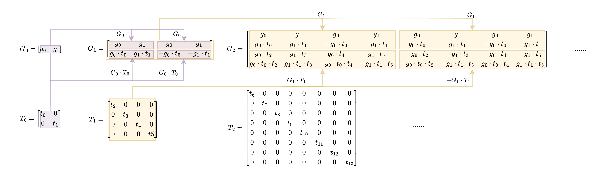

# Basefold

## Contents

- Overview
    - What is Basefold?
    - Why Basefold?
    - How basefold?
- Background
    - Interactive Oracle Proof (IOP)
    - Interactive Oracle Proof of Proximity (IOPP)
    - FRI
    - Polynomial Commitment Scheme (PCS)
- Linear Code
    - Reed Solomon code (RS code)
    - Reed-Muller code (RM code)
    - Random Foldable code (RFC)
- Basefold
    - Basefold Encoding
        - Encoding phase
    - Basefold IOPP
        - Commit phase
        - Query phase
    - Basefold PCS
        - Evaluation phase

## Overview

### What is Basefold?

Basefold is a new *field-agnostic* Polynomial Commitment Scheme (PCS) for multilinear polynomials that has $O(\log^2 (n))$ verifier costs and $O(n \log n)$prover time. 

Basefold PCS mainly combines two types of technique, one is FRI  IOPP (Fast Reed-Solomon Interactive-Oracle Proof of Proximity), and the other is sumcheck. It shows that FRI and sumcheck have similar interactive structures and can run in parallel and share the verifier randomness.

### Why Basefold?

The following are several advantages of Basefold compared with other SNARKs.

1. **Random Foldable Code(RFCs).** RFCs are a special type of Reed-Muller code. It introduces recursion and foldable into the encoding phase, allowing for the flexible handling of messages of varying sizes. Unlike the RS codes, RFCs are foldable and have   $O(n \log n)$ encoding time over any sufficiently large field. The foldable attribute is the key to achieving the field-agnosticism. 
2. **Field-Agnosticism.** Basefold PCS could work over any sufficiently large finite field. ****It is a major boon to SNARK. For example, suppose an application is confined to the finite field $\mathbb{F}_p$ but the SNARK is defined over a finite field $\mathbb{F}_q$. In this case, the “modulo p” operation is explicitly encoded into the circuit and needs to be invoked for each multiplication gate. A field-agnostic PCS can deal with any large finite field, making it ideal as it enables the SNARK to avoid some large overhead associated with compatibility.
3. **Efficiency.** Basefold IOPP can be used for any linear code and Basefold PCS is very efficient. It is 2-3 times faster than prior multilinear PCS constructions from FRI (like ZeromorphFri. ) when defined over the same finite field.

### How Basefold?

There is a brief introduction of the overall Basefold that contains four phases:

- Encoding phase. The prover encodes its message $\mathbf f$ using *random foldable code* and gets the codeword $\mathbf c$.
- Commit phase. The prover commits the codeword $\mathbf c$ by Merkle commitment and generates the Merkle root $\pi_d$ as the commitment of $\mathbf c$. The further process is similar to FRI which has many rounds, each round generates a new vector $\mathbf c_i$ and a commitment $\pi_i$ of  $\mathbf c_i$. Finally, The prover sends all the commitments $(\pi_d,…,\pi_0)$  as oracles to the verifier.
- Query phase. The verifier queries a few points to check the consistency of these commitments $(\pi_d,…,\pi_0)$.
- Evaluate phase. The verifier runs Basefold IOPP and sumcheck in parallel to check the commitment  $\pi_d = commit(Enc(\mathbf f))$ and the evaluation $f(\mathbf z) =y$.

## Background

### Interactive Oracle Proof (IOP)

IOP is a cryptographic protocol that allows a prover to convince a verifier about the correctness of a statement without revealing the underlying data. 

A $k$-round public coin IOP runs as follows: 

Initially, the prover **sends an oracle string $\pi_0$ to the verifier. Then, in each round $i ∈ [1, k]$, the verifier sends a random challenge $\alpha_i$ to the prover, and the prover replies with a new oracle string $\pi_i$. After $k$ **rounds of communications, the verifier **queries some entries of those oracle strings $\pi_0, \pi_1, . . . , \pi_k$ **and outputs a bit $b$ that indicates if the verifier has been convincing.

### Interactive Oracle Proof of Proximity (IOPP)

An IOPP is a special proof system for proofing that a ***committed vector*** over a field $\mathbb{F}$ is close to a ***codeword*** in some linear error-correcting code. 

### FRI

FRI stands for Fast Reed-Solomon Interactive oracle proof of proximity. It allows us to prove that the evaluations of a given polynomial $p$, over a domain $D_0$, correspond to the evaluations of a low-degree polynomial. 

The main idea of FRI is a low-degree test and it executes by “split and fold”. It first splits the original polynomial $p$ into even and odd parts, and using a random $\beta$ folds the two parts. Then the folded polynomial is the half degree of the original polynomial.

Let us see an example of “split and fold”.

let $p(x) = 1 + 2x+3x^2+4x^3$

then split $p(x)$ into even part $p_e(x^2)$ and odd part $p_o(x^2)$.

$p_e(x^2) = 1 +3x^2$

$p_o(x^2) = 2+4x^2$

We can see that: $p(x) = p_e(x^2) + xp_o(x^2)$

Then, we using a random $\beta$ fold $p(x)$ and get a new polynomial $p^{(1)}(x) = p_e(x)+\beta p_o(x)=1+2\beta+(3+4\beta)x$.

We can see that the degree of the new polynomial $p^{(1)}(x)$ is half the degree of $p(x)$.

The split and fold process can be recursively executed until the final folded polynomial which is a constant polynomial.

### Polynomial Commitment Scheme (PCS)

A polynomial commitment scheme (PCS) is a cryptographic primitive that allows a prover to commit to a polynomial $f\in \mathbb F [x]$ of degree $d$ using a short commitment and later, the prover proves the committed polynomial satisfying $f(\alpha)=\beta$. It is a building block for many cryptographic applications.

A PCS consists of a tuple of algorithms (Setup, Commit, Open, Eval).

- *Setup* takes security parameters and other information of witness as input and outputs public parameters.
- *Commit* takes a polynomial $f$ as input and outputs a commitment $C$.
- *Open* takes a commitment $C$ and a polynomial as input and outputs a bit $b$. ($b$ indicates whether $C=commit(f)$).
- *Eval* takes a commitment $C$, an evaluation point $\mathbf z$ , a value $y$  and a polynomial $f$ (only the prover knows) as input. Then, the prover wants to convince the verifier that $f$ is an opening to $C$ and $f(\mathbf z) =y$.  The verifier outputs a bit $b$ indicating whether it has been convinced.

## Linear Code

In coding theory,  a linear code is an error-correcting code for which any linear combination of codewords is also a codeword.

### Reed-Solomon Code (RS code)

Reed-Solomon is a type of error-correcting code that transforms a message of size $k$ into a codeword of size $n$. The **code rate** $\rho$ is defined as $\rho = \frac k n$. 

The encoding process is associated with a generator matrix, such that encoding of a vector $\mathbf v \in \mathbb F ^k$ is $\mathbf v \cdot G$.

The encoding process uses the following equation：

$\mathbf c = \mathbf v \cdot G$

Let’s see an example:

Suppose we want to encode a message of size 4:  $\textbf{m}=(m_0,m_1,m_2,m_3)$ , and the generator matrix $G$ of size $4\times8$: 

$$
G=\begin{bmatrix}
g_{0,0} & g_{0,1} & g_{0,2}& g_{0,3} & g_{0,4} & g_{0,5} & g_{0,6} & g_{0,7} \\  g_{1,0} & g_{1,1} & g_{1,2}& g_{1,3} & g_{1,4} & g_{1,5} & g_{1,6} & g_{1,7}\\g_{2,0} & g_{2,1} & g_{2,2}& g_{2,3} & g_{2,4} & g_{2,5} & g_{2,6} & g_{2,7}\\g_{3,0} & g_{3,1} & g_{3,2}& g_{3,3} & g_{3,4} & g_{3,5} & g_{3,6} & g_{3,7}
\end{bmatrix}
$$

Then, we compute $\mathbf c = \mathbf m \cdot G$ to get the codeword: $\mathbf{c}  = (c_0,c_1,c_2,c_3,c_4,c_5,c_6,c_7)$.

### Reed-Muller Code (RM code)

Reed-Muller code also is a type of error-correcting code used in coding theory. Here we introduce a special type of RM code named foldable RM code whose generator matrices have a foldable structure. A foldable RM code includes generator matrices( $G_0, … ,G_{d-1}$) and diagonal matrices( $T_0, … , T_{d-1}$), ($T_0^’, … , T_{d-1}^’$).  The foldable structure means that the generator matrix $G_{i+1}$ can be generated from the previous generator matrix $G_i$ and two diagonal matrices $T_i$ and $T_i^{’}$, satisfying the following formula:

$G_{i+1}=\begin{bmatrix} G_{i}& G_{i} \\
G_{i}\cdot T_{i} &  G_{i}\cdot T_{i}^{'}
\end{bmatrix}$

Note that the elements on those diagonal matrices are distinct from each other.

### Random Foldable code (RFC)

The RFC, a variant of the foldable RM code, follows a recursive approach to generate its generator matrix. RFC is foldable and has $O(n \log n)$ encoding time over any sufficiently large field, better than the traditional encoding method with $O(n^2)$ encoding time.

 RFC introduces two modifications on diagonal matrices:

1. It assigns $T_i$ as a diagonal matrix with entries drawn uniformly at random from $\mathbb{F}^\times$( $\mathbb F ^{\times}$ denotes $\mathbb F$ \ {0}).
2. It sets $-T_i$ as  $T'_i$.

The generator matrices are created as follows:

$G_{i+1}=\begin{bmatrix} G_{i}& G_{i} \\
G_{i}\cdot T_{i} &  G_{i}\cdot -T_{i}
\end{bmatrix}$

The following graph shows an example of the process of creating generator matrices recursively.

## Basefold

### Basefold Encoding

- **Encoding phase**

Basefold encoding algorithm takes the original message $\mathbf m \in \mathbb F^{k_d}$ as input and outputs codeword $\mathbf c \in \mathbb F ^{n_d}$.  $d$ denotes the logarithm of $\mathbf m$’s length. If $length(\mathbf m) = 4$, then $d = \log 4 = 2$. There are initial generator matrix $\mathbf G_0$ and diagonal matrices $(T_0,T_1,…,T_{d-1})$ as public parameters. 

Basefold uses a recursive way to encode messages rather than directly compute  $\mathbf c  = \mathbf m \cdot  G$. It split the message $\mathbf m$ = $(\mathbf m_l, \mathbf m_r)$, $\mathbf m_l$ represents the first half of $\mathbf m$, and  $\mathbf m_r$ represents the second half of $\mathbf m$. Then, it encodes $\mathbf m_l$ and $\mathbf m_r$, respectively.

In the encoding phase, there are two message statuses in the algorithm: 

1. The message $\mathbf m$ is the smallest unit of encoding, the algorithm will return the encoding result $Enc_0(\mathbf m) = \mathbf m \cdot G_0$. 

2. The message $\mathbf m$ is not the smallest unit, then further split $\mathbf m$ into  $(\mathbf m_l, \mathbf m_r)$. Then the algorithm can reduce the $Enc_d(\mathbf m)$ into $Enc_{d-1}(\mathbf m_l)$ and $Enc_{d-1}(\mathbf m_r)$ such that: 

 $Enc_d(\mathbf m) = \big(Enc_{d-1}(\mathbf m_l) + \mathbf t \circ Enc_{d-1}(\mathbf m_r),Enc_{d-1}(\mathbf m_l) - \mathbf t \circ Enc_{d-1}(\mathbf m_r)\big)$

, where $\mathbf t = {\rm diag}(T_{d-1})$ represents a vector whose elements are diagonal elements of $T_{d-1}$. For example, let $T = \begin{bmatrix} t_0 & 0 \\ 0 & t_1 \end{bmatrix}$, then ${\rm diag}(T) = [t_0,t_1]$.

Let’s see an example of encode a message $\mathbf m = (m_0,m_1,m_2,m_3) \in \mathbb F ^{k_2}$.

Given the public parameters $G_0 = (g_0,g_1)$, $T_0 = \begin{bmatrix} t_0 & 0 \\ 0 & t_1 \end{bmatrix}$, $T_1 = \begin{bmatrix} t_2 & 0 &0&0\\ 0 & t_3 &0&0 \\ 0 & 0 &t_4&0 \\ 0 & 0 &0&t_5\end{bmatrix}$. Therefore, $\mathbf t_0 = [t_0,t_1]$, $\mathbf t_1 = [t_2,t_3,t_4,t_5]$.

Our goal is encode $\mathbf m$ and get $Enc_2(\mathbf m)$. 

At first, $\mathbf m = (m_0,m_1,m_2,m_3)$ is not the smallest encoding unit. Therefore, we split  $(m_0,m_1,m_2,m_3)$ into  $\mathbf m_l = (m_0,m_1)$ and  $\mathbf m_r = (m_2,m_3)$.

Let $\mathbf l := Enc_1(\mathbf m_l)$, $\mathbf r := Enc_1(\mathbf m_r)$. We get : $Enc_2(\mathbf m) = (\mathbf l + \mathbf t_1 \circ \mathbf r,\mathbf l - \mathbf t_1 \circ \mathbf r)$

At this point, we can recursively compute $Enc_1(\mathbf m_l)$ and $Enc_1(\mathbf m_r)$. We further split $(m_0,m_1)$ into $(m_0)$, $(m_1)$ and split  $(m_2,m_3)$ into $(m_2)$, $(m_3)$.

Due to all $(m_0)$, $(m_1)$, $(m_2)$, $(m_3)$ are the smallest units. We then encode the them and get $Enc_0(m_0),Enc_0(m_1),Enc_0(m_2),Enc_0(m_3)$. 

$Enc_0(m_0)=m_0\cdot G_0=\begin{bmatrix}m_0 g_0 & m_0 g_1\end{bmatrix}$

$Enc_0(m_1)=m_1\cdot G_0=\begin{bmatrix}m_1 g_0 & m_1 g_1\end{bmatrix}$

$Enc_0(m_2)=m_2\cdot G_0=\begin{bmatrix}m_2 g_0 & m_2g_1\end{bmatrix}$

$Enc_0(m_3)=m_3\cdot G_0=\begin{bmatrix}m_3 g_0 & m_3 g_1\end{bmatrix}$

And then we can compute $\mathbf l = Enc_1(m_0, m_1),\mathbf r = Enc_1(m_2, m_3)$ using $Enc_0(m_0),Enc_0(m_1),Enc_0(m_2),Enc_0(m_3)$.

$\mathbf l=(Enc_0(m_0)+\mathbf t_0 \circ Enc_0(m_1),Enc_0(m_0)-\mathbf t_0 \circ Enc_0(m_1))=\begin{bmatrix}m_0g_0+m_1g_0t_0 & m_0g_1+m_1g_1t_1 &m_0g_0-m_1g_0t_0 & m_0g_1-m_1g_1t_1 \end{bmatrix}$

$\mathbf r =(Enc_0(m_2)+\mathbf t_0 \circ Enc_0(m_3),Enc_0(m_2)-\mathbf t_0 \circ Enc_0(m_3))=\begin{bmatrix}m_2g_0+m_3g_0t_0 & m_2g_1+m_3g_1t_1 &m_2g_0-m_3g_0t_0 & m_2g_1-m_3g_1t_1 \end{bmatrix}$

Finally, we compute $Enc_2(\mathbf m)=Enc_2(m_0,m_1,m_2,m_3)$.

$Enc_2(m_0,m_1,m_2,m_3)\\=[\mathbf l + \mathbf t_1 \circ \mathbf r,\mathbf l - \mathbf t_1 \circ \mathbf r]$

$= \begin{bmatrix}m_0g_0+m_1g_0t_0+m_2g_0t_2+m_3g_0t_0t_2 \\m_0g_1+m_1g_1t_1+ m_2g_1t_3+m_3g_1t_1t_3 \\m_0g_0-m_1g_0t_0+m_2g_0t_4-m_3g_0t_0t_4 \\m_0g_1-m_1g_1t_1+m_2g_1t_5-m_3g_1t_1t_5 \\m_0g_0+m_1g_0t_0-m_2g_0t_2-m_3g_0t_0t_2 \\m_0g_1+m_1g_1t_1- m_2g_1t_3-m_3g_1t_1t_3 \\m_0g_0-m_1g_0t_0-m_2g_0t_4+m_3g_0t_0t_4 \\m_0g_1-m_1g_1t_1-m_2g_1t_5+m_3g_1t_1t_5\end{bmatrix} = \begin{bmatrix}c_0&c_1&c_2&c_3&c_4&c_5&c_6&c_7\end{bmatrix}$

At this point, we have obtained the codeword $\mathbf c=(c_0,c_1,c_2,c_3,c_4,c_5,c_6,c_7)$. The result of using the recursive encoding method is the same as the result of directly calculating $\mathbf c = \mathbf m \cdot \mathbf G_2$.

In this case, the message of size 4 and the codeword of size 8, thus the code rate equal to $\frac {message \ size } {codeword \ size }= \frac 1 2$.

### Basefold IOPP

Basefold IOPP generalized the FRI IOPP to any foldable linear code. The Goal of Basefold IOPP is to ensure the verifier checks an oracle $\pi_d$ sent by the prover is close to a codeword $C_d$.

Basefold IOPP consists of two phases: Commit phase and Query phase.

**Commit phase:** **the prover commits a polynomial $f$ and generates a list of oracles $(\pi_d,…,\pi_0)$ given the verifier’s folding challenge $r_i (0≤i<d)$.

**Query phase:** the verifier samples a query index to check the consistency between oracles.

- Commit phase

Basefold IOPP uses Merkle commitment to generate commitments. The graph below illustrates the process of deriving oracle $\pi_2$ from $\mathbf c = (c_0,c_1,c_2,c_3,c_4,c_5,c_6,c_7)$. The Merkle root is exactly the commitment of $\mathbf c$.

Continuing from the previous example, let’s demonstrate how the prover generates a list of oracles $(\pi_2,\pi_1, \pi_0)$ given the verifier’s folding challenges $r_i (0≤i<2)$. The prover first computes the Merkle root of $\mathbf c$ and gets the commitment $\pi_2$. Next, upon receiving the folding challenge $r_2$, the prover can fold the vector $\mathbf c$ into $\mathbf c_1$, which is half the size of $\mathbf c$. Then commit $\mathbf c_1$ to get $\pi_1$. And using another folding challenge $r_1$ fold $\mathbf c_1$ to get $\mathbf c_2$ which is half the size of $\mathbf c_1$. Then commit $\mathbf c_2$ to get $\pi_0$.

The prover sends all the oracles $(\pi_2,\pi_1, \pi_0)$ to the verifier.

Note that given an input oracle that is a commitment of an encoding of a polynomial $f$, the last oracle $\pi_0$ sent by the honest prover in the IOPP protocol is exactly an encoding of a random evaluation $f(\mathbf r)$. Therefore, this ultimate oracle $\pi_0$ must be a valid codeword.

- Query phase

In this phase, the verifier samples a query index $\mu \isin [1, n_{d-1}]$ to check the consistency between oracles. The figure below shows the query phase.  The verifier can query oracles several times. The larger the number of queries made, the higher security level of this model. 

Let's focus on a single query to see more details. The verifier selects an index 0, and each oracle returns the value at that position and the value at the corresponding position after halving the vector. In this case, oracles return ($c_0,c_4,c_0',c_2',c_0''$) . Then, the verifier checks if $c_0'$ is accurately computed from $c_0,c_4$, and the folding challenge $r_2$, and checks if $c_0''$ is correctly computed from $c_0',c_2'$, and the folding challenge $r_1$. The verifier also checks $\pi_0$ is a valid codeword.

After several rounds, the prover passed all queries from the verifier. Finally, the verifier will believe the prover $\pi_2$ is truly commitment of the polynomial $f$.

### Basefold PCS

Basefold PCS interleaves Basefold IOPP and sumcheck. The Goal of Basefold PCS is the prover wants to convince the verifier that it knows an opening of a private polynomial that $f(\mathbf z) =y$, with the polynomial’s commitment being $\pi_d$.

Therefore, Basefold PCS consists of two parts to prove: 

1. $Commit(Enc(f)) = \pi_d$. 

2. $f(\mathbf z)=y$.

The first statement can be proved by Basefold IOPP, while the second statement can be proved by using sumcheck. Let’s see the further details:

It is known that by using the classic sum-check protocol with a multilinear extension, we can transform the evaluation check of a multilinear polynomial $f ∈ \mathbb F[X_1,..., X_d]$ at a point $\mathbf z \in \mathbb F^d$into an evaluation check of $f$ **at a random point $\mathbf r \in \mathbb F ^d$. In the sumcheck protocol, the prover and the verifier interactive $d$ rounds. In each round, a variate $X_i$ is fixed using the verifier’s challenge, consequently reducing the dimensionality by 1 of $f$.

As the earlier discussion on Basefold IOPP, shows that Basefold IOPP also involves $d$ interactive rounds between the prover and the verifier. In each round, the codeword is halved in size.

It can be seen that Basefold IOPP and sumcheck have a similar structure. Therefore, in the evaluation phase, the prover and verifier can simultaneously execute a Basefold IOPP protocol and a sumcheck protocol, using the identical set of random challenges $\mathbf r = (r_1, . . . , r_d)$ . At the end of the Basefold PCS, the verifier checks that the claimed evaluation in the last round of the sumcheck protocol is consistent with the last prover message of the IOPP protocol.

- **Basefold Evaluation phase**
    
    Given a commitment $C$, a point $\textbf{z}$ and value $y$ , the prover wants to convince the verifier that it knows an opening of $f \isin \mathbb{F}[X_1,…,X_d]$ such that $f(\textbf{z})=y$. Basefold PCS interleaves sumcheck with Basefold IOPP, operating as depicted in the the following figure, which illustrates the interactive process between the prover and the verifier.
    
    As from the figure, Basefold PCS executes Basefold IOPP and sumcheck in parallel. The blue part represents the sumcheck interactive process while the yellow part indicates the Basefold IOPP interactive process. The red part denotes the random challenge from the verifier.
    
    
    

Let’s see an example, suppose the prover holds a polynomial $f(\vec x)$ whose coefficients are $\mathbf f=(f_0,f_1,f_2,f_3)$. First, the prover using Basefold encoding algorithm to encode $\mathbf f$ into a codeword $\mathbf c = (c_0,c_1,c_2,c_3,c_4,c_5,c_6,c_7)$, and commit $\mathbf c$ to produce the commitment $\pi_2$.

The prover wants to prove :

1. $Commit(Enc_2(\mathbf f))=\pi_2$
2. $f(\mathbf z) = y$

For prove 1, we utilize the Basefold IOPP. In the commit phase, the prover generates oracles $(\pi_2,\pi_1,\pi_0)$ given the verifier’s challenge $(r_1,r_0)$ and sents oracles to the verifier. Then, in the query phase, the verifier queries some points, if the prover can pass all the verifier’s checks and $\pi_0$ is a valid codeword, the verifier will accept it. 

Regard to prove 2, we re-express the polynomial by the multilinear extension, $f(\vec x)$ can be expressed as the sum: $f(x_1,x_2) = \sum_{\substack{\mathbf b \in \{0,1\}^2}}f(\mathbf b)\cdot \tilde{eq}_{\mathbf b}(x_1,x_2)$. Thus, checking $f(\mathbf z) =y$ is equivalent to checking the sumcheck claim $y = \sum_{\substack{\mathbf b \in \{0,1\}^2}}f(\mathbf b)\cdot \tilde{eq}_{\mathbf b}(\mathbf z)$. Then, we can utilize the sumcheck protocol to prove it. 

The Basefold PCS runs as the following graph:

We can see that Basefold IOPP and sumcheck share all the verifier’s challenges $(r_1,r_0)$. If the prover passes all the verifier’s checks, then it convinces the verifier.