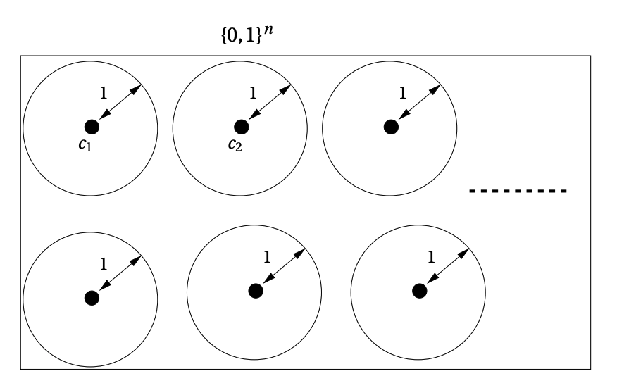

# An Introduction to Error-Correcting Codes

Communication is fundamental. It’s also inherently flawed. When we try to transmit messages, messages get distorted. Yet, the systems receiving the distorted messages are still able to undrestand them correctly. How? The answer is **redundancy**.

Natural language has it built-in; if you miss a word in a sentence, you can often guess it from context. In the digital world, we don't leave this to chance. We engineer it. This is where error-correcting codes come in: the trick is to cleverly add redundancy to data so that the original information can be recovered even when parts of it are lost or corrupted. This is involved in various aspect of communication be it the Mars rover images, or in the CDs and DVDs that survive scratches, the error-correcting memory in computers, and the QR codes we scan every day.

This blog, first in the series, will walk you through the foundational questions of coding theory. We'll start with the core problem, build a formal language to discuss it, and introduce a class of "nicely behaved" codes that offer an elegant and powerful solution.

## The Core Problem: Sending Messages Without Errors

Imagine you want to send a message. The channel it travels through is noisy—think of a scratched CD, a patchy satellite signal, or data stored on a faulty drive. The goal is to correct as many errors as possible while adding as little redundant data as possible. These are, of course, conflicting goals. To analyze this trade-off, we need a formal language.

### Formalizing the Language

Let's define our key terms:

* **Alphabet (Σ):** The set of symbols we can use. For digital systems, this is often the binary alphabet {0,1}. We'll use $q$ to denote the alphabet size.
* **Block Length (n):** The total number of symbols in a transmitted sequence.
* **Code (C):** A subset of all possible sequences of length n. Each element of the code is called a **codeword**.
* **Dimension (k):** The number of message symbols we are encoding. For an alphabet of size q, the number of codewords is $|C|=q^k$, so $k=\log_q|C|$.
* **Rate (R):** The ratio of message symbols to the total block length, $R=k/n$. The rate measures the efficiency of a code; a higher rate means less redundancy. A rate of 1 means there is no redundancy at all.

Let's look at two simple binary codes to make this concrete. Suppose our message is 4 bits long (k=4).

1.  **The Repetition Code ($C_{3,\text{rep}}$):**
    Given a message $(x_1,x_2,x_3,x_4)\in\{0,1\}^4$, its corresponding codeword is given by
    $$ C_{3,\text{rep}}(x_1,x_2,x_3,x_4) = (x_1,x_1,x_1,\;x_2,x_2,x_2,\;x_3,x_3,x_3,\;x_4,x_4,x_4). $$
    * The message `1011` becomes `111000111111`.
    * **Block Length (n):** 12
    * **Rate (R):** 4/12 = 1/3. This is a low-rate code with high redundancy.

2.  **The Parity Code ($C_{\oplus}$):**
    Given a message $(x_1,x_2,x_3,x_4)\in\{0,1\}^4$, its corresponding codeword is given by
    $$ C_{\oplus}(x_1,x_2,x_3,x_4) = (x_1,x_2,x_3,x_4,\;x_1 \oplus x_2 \oplus x_3 \oplus x_4). $$
    * The message `1011` becomes `10111`.
    * **Block Length (n):** 5
    * **Rate (R):** 4/5. This is a high-rate code with low redundancy.

Which one is better? It depends on how many errors they can handle.

## Error Correction

Before we define how the error correction works, let's formally understand the notion of *Encoding* and *Decoding*.

> **Encoding function:**
> Let $C \subseteq \Sigma^n$. An equivalent description of the code $C$ is an injective mapping
> $$ E : [|C|] \to \Sigma^n $$
> called the encoding function. It is an injective (one-to-one) map from a message index to its corresponding codeword.

> **Decoding function:**
> Let $C \subseteq \Sigma^n$ be a code. A mapping
> $$ D : \Sigma^n \to [|C|] $$
> is called a decoding function for $C$. It is a map from any received word back to the message index (the “reverse” of encoding).

In simple terms, **encoding** turns a message index into a codeword, and **decoding** takes a received (possibly noisy) word and returns the original message index. To measure errors, we use a simple but powerful metric: **Hamming distance**.

> **Hamming Distance:**
> The Hamming distance, $\Delta(u,v)$, between two sequences u and v of the same length is the number of positions in which they differ. For example, $\Delta(10111,11110)=3$.

We also formally define an error channel and an error-correcting code.

> **t-Error Channel:**
> An $n$-symbol $t$-Error Channel over the alphabet $\Sigma$ is a function
> $$ \text{Ch} : \Sigma^n \to \Sigma^n $$
> that satisfies
> $$ \Delta(\mathbf{v},\text{Ch}(\mathbf{v})) \le t $$
> for every $\mathbf{v}\in\Sigma^n$.

> **Error Correcting Code:**
> Let $C \subseteq \Sigma^n$ be a code and let $t \ge 1$ be an integer. $C$ is said to be a $t$-error-correcting code if there exists a decoding function $D$ such that for every message $m \in [|C|]$ and every $t$-error channel $\text{Ch}$ we have
> $$ D(\text{Ch}(C(m))) = m. $$

With this, we can define what it means for a code to be "good" at its job. There are a few different levels of error handling:

* **Error Correction:** A code is **t-error-correcting** if, for any transmitted codeword, a decoder can uniquely identify it even if up to t symbols have been corrupted.
* **Error Detection:** A code is **t-error-detecting** if a decoder can determine that *at least one* error has occurred (up to a maximum of t errors), even if it can't fix it. This is useful in systems like the internet where re-transmission is possible.
* **Erasure Correction:** An **erasure** is an error where the *location* is known, but the value is lost (imagine a smudged character). A code is **t-erasure-correcting** if it can recover the original message when up to t symbols are erased.

Let's revisit our examples:
* The **Repetition Code** ($C_{3,\text{rep}}$) is **1-error-correcting**. Given a received word $y \in \{0,1\}^{12}$, divide it up into four consecutive blocks $(y_1,y_2,y_3,y_4)$. Then, for every block $y_i$, output the majority bit as the message bit. If we receive `110`, we can guess the original was `111` by majority vote. However, it can't handle two errors; if we receive `100`, we can't know if the original was `111` or `000`.
* The **Parity Code** ($C_\oplus$) is **not 1-error-correcting**. If we send `00000` and receive `10000`, the decoder is confused. Was the original `00000` with one error, or was it `10001` with one error? There's no way to know. However, it is **1-error-detecting**. If the parity of the received word is wrong, we know at least one error occurred.

This reveals a crucial insight: the decoder's confusion arose because two valid codewords (`00000` and `10001`) were too close to each other. This leads us to the single most important combinatorial property of a code.

## The Power of Minimum Distance

> **Minimum distance:**
> Let $C \subseteq \Sigma^n$. The minimum distance (or just distance) of $C$, denoted $\Delta(C)$, is defined to be
> $$ \Delta(C) = \min_{c_1 \ne c_2 \in C} \Delta(c_1,c_2). $$

> We also define the relative minimum distance of $C$ to be $\delta(C)$, defined as
> $$ \delta(C) = \min_{c_1 \ne c_2 \in C} \delta(c_1,c_2). $$

* $C_{3,\text{rep}}$ has a minimum distance of d=3.
* $C_\oplus$ has a minimum distance of d=2.

The connection is formalized by this powerful proposition: A code with minimum distance d can:
* Correct $\lfloor(d-1)/2\rfloor$ errors.
* Detect $d-1$ errors.
* Correct $d-1$ erasures.

([Proof for the above mentioned propositions](#proof-section))

This explains everything we observed: $C_{3,\text{rep}}$ $(d=3)$ can correct $\lfloor(3-1)/2\rfloor=1$ error. $C_\oplus$ $(d=2)$ can correct $\lfloor(2-1)/2\rfloor=0$ errors, but it can detect $2-1=1$ error.

The proof relies on a simple geometric idea: for a decoder to uniquely identify the correct codeword, the received word must be closer to the original codeword than to any other. This is only possible if the codewords are sufficiently far apart. Our fundamental question can now be reframed: **For a given block length n, what is the best rate R we can achieve for a code with minimum distance d?**

---

## A Better Code and Its Limits: The Hamming Code

With the above question in mind, let us consider the **Hamming Code** which we will denote by $C_H$. Given a message $(x_1, x_2, x_3, x_4) \in \{0, 1\}^4$, its corresponding codeword is given by
$$ C_H(x_1, x_2, x_3, x_4) = (x_1, x_2, x_3, x_4, x_2 \oplus x_3 \oplus x_4, x_1 \oplus x_3 \oplus x_4, x_1 \oplus x_2 \oplus x_4). $$
It can be verified that this code has the following parameters:
$$ C_H : q = 2,\; k = 4,\; n = 7,\; R = \frac{4}{7}. $$

$C_H$ has a minimum distance of 3. ([proof](#proof-section))

This is a clear winner. It has the same distance as the 3-repetition code (d=3) but a much better rate (4/7 > 1/3). But can we do even better? Is there a code with d=3 and a rate higher than 4/7? The answer is no, and the reason lies in a geometric argument called the **Hamming Bound**.

The **Hamming Bound** captures the tradeoff between redundancy and error-correcting capability. It shows how many codewords can fit into a given space without overlap. Imagine a *Hamming ball* of radius $t$ around each codeword — the set of all sequences within Hamming distance $t$ of that codeword. For a code to be able to uniquely correct $t$ errors, these balls cannot overlap.

By calculating the volume of these balls and packing them into the space of all possible sequences, we get an upper limit on how many codewords can exist. For a binary code with $d = 3$ (meaning $t = 1$), this bound is:
$$ k \le n - \log_{2}(n + 1) $$
For $n = 7$, this gives
$$ k \le 7 - \log_{2}(8) = 4. $$
The Hamming code achieves this bound exactly, $k = 4$. Codes that meet this bound are called **perfect codes** because they tile the space perfectly, leaving no gaps between the Hamming balls.

### Visual Explanation

* Each circle represents a Hamming ball of radius 1 around a codeword.
* The dots at the center of each circle are codewords.
* The circles do not overlap, illustrating that all words within one error of a codeword are uniquely assigned.
* Together, these balls fill the space $\{0,1\}^n$ as densely as possible without overlap.

### Example
For $n = 7$:
$$ k \le 7 - \log_{2}(8) = 4. $$
The Hamming code achieves this bound exactly ($k = 4$). Codes that meet this bound are called **perfect codes** because they tile the space perfectly without gaps. ([Proof for Hamming Bound](#proof-section))

## Linear Codes

While the **Hamming Bound** tells us the theoretical limits of a code, it doesn't tell us how to build a good one. For that, we need to introduce some structure. The most common and useful structure is linearity, which makes codes much easier to describe and work with.

### What Makes a Code "Linear"?

Imagine a code where if you take any two valid codewords and add them together (using the arithmetic of the field, like XOR for binary), you get another valid codeword. That's the core idea of a linear code.

> **Definition: Linear Code**
> Let $p$ be a prime and let $q = p^s$ for some integer $s \ge 1$. A code $C \subseteq \mathbb{F}_q^n$ is a **linear code** if it is a linear subspace of $\mathbb{F}_q^n$.

Simply, a linear code is just a vector space of codewords over a finite field. This vector space structure means we can generate all codewords by linear combinations of a smaller set of basis vectors. If $C$ has dimension $k$ and distance $d$, then it is called an $[n, k, d]_q$ code.

Because they are vector spaces, we don't need to list every single codeword. Instead, we can define the entire code using a small set of basis vectors. This is where two special matrices come into play.

### G and H matrices

Every linear code can be understood from two different perspectives, represented by a **generator matrix** and a **parity-check matrix**.

#### The Generator Matrix (G): The Encoder

The **generator matrix**, $G$, provides a direct recipe for creating codewords. It's a $k \times n$ matrix whose rows are the basis vectors for the code. To encode a message $\mathbf{x}$ (a vector of length $k$), you simply multiply it by $G$:
$$ C = \{ \mathbf{x}G \mid \mathbf{x} \in \mathbb{F}_q^k \} $$
This gives us a systematic way to map any of the $q^k$ possible messages to a unique codeword in our code $C$.

#### The Parity-Check Matrix (H): The Verifier

The **parity-check matrix**, $H$, works from the opposite direction. It doesn't create codewords; it checks if a given word is a valid one. It's an $(n-k) \times n$ matrix that defines a set of linear constraints, or "parity checks," that every codeword must satisfy. A vector $\mathbf{y}$ is a valid codeword if and only if it satisfies the following equation:
$$ H\mathbf{y}^T = \mathbf{0} $$
If the result of this multiplication is anything other than the zero vector, we know the word $\mathbf{y}$ is not in our code, indicating an error may have occurred.

### Example: The [7,4,3]₂ Hamming Code in Action

A standard **generator matrix** for this code is:
$$ G = \begin{bmatrix} 1 & 0 & 0 & 0 & 0 & 1 & 1 \\ 0 & 1 & 0 & 0 & 1 & 0 & 1 \\ 0 & 0 & 1 & 0 & 1 & 1 & 0 \\ 0 & 0 & 0 & 1 & 1 & 1 & 1 \end{bmatrix} $$
A corresponding **parity-check matrix** is:
$$ H = \begin{bmatrix} 0 & 0 & 0 & 1 & 1 & 1 & 1 \\ 0 & 1 & 1 & 0 & 0 & 1 & 1 \\ 1 & 0 & 1 & 0 & 1 & 0 & 1 \end{bmatrix} $$
Let's encode the message $\mathbf{x} = (1, 0, 1, 1)$:
$$ \mathbf{c} = \mathbf{x}G = (1, 0, 1, 1, 0, 1, 0) $$
And now let's verify it with the correct $H$:
$$ H \mathbf{c}^T = \begin{bmatrix} 0 & 0 & 0 & 1 & 1 & 1 & 1 \\ 0 & 1 & 1 & 0 & 0 & 1 & 1 \\ 1 & 0 & 1 & 0 & 1 & 0 & 1 \end{bmatrix} \begin{bmatrix} 1 \\ 0 \\ 1 \\ 1 \\ 0 \\ 1 \\ 0 \end{bmatrix} = \begin{bmatrix} 0+0+0+1+0+1+0 \\ 0+0+1+0+0+1+0 \\ 1+0+1+0+0+0+0 \end{bmatrix} = \begin{bmatrix} 2 \\ 2 \\ 2 \end{bmatrix} \equiv \begin{bmatrix} 0 \\ 0 \\ 0 \end{bmatrix} \pmod 2 $$
The result is the zero vector, confirming that `1011010` is a valid codeword. This pair of matrices provides a compact and efficient way to both generate and validate all 16 codewords in the Hamming code.

### Efficient Representation and Its Benefits

Imagine you had a code with $2^{64}$ codewords. Listing them all would be impossible. This is the problem linear codes solve. Instead of storing an enormous, explicit list of every valid codeword, we only need to store a basis for the code's vector space. This basis is captured in the **generator matrix ($G$)** or the **parity-check matrix ($H$)**. Storing one of these matrices is like keeping the recipe for the code rather than a warehouse of every possible dish.

This compact representation leads to two major practical benefits:

* **Fast Encoding:** To encode a message $\mathbf{m}$, we don't need to look it up in a giant table. We simply perform a matrix-vector multiplication: $\mathbf{c} = \mathbf{m}G$. This is a fast and straightforward operation.
* **Fast Error Detection:** To check if a received word $\mathbf{y}$ is a valid codeword, we again perform a simple matrix-vector multiplication: $H\mathbf{y}^T$. If the result is the zero vector, the word is valid; if not, an error has been detected.

### A Simpler Way to Find the Minimum Distance

The **minimum distance ($d$)** is a very important parameter of a code, as it determines its error-correcting capability. For a general code, finding it requires comparing every codeword to every other one—a computationally intensive task.

Linear codes give us a shortcut. Because the code is a subspace, the difference between any two codewords ($\mathbf{c}_1 - \mathbf{c}_2$) is also a codeword. The Hamming distance $\Delta(\mathbf{c}_1, \mathbf{c}_2)$ is just the weight of this resulting codeword, $w(\mathbf{c}_1 - \mathbf{c}_2)$. This leads to a much simpler definition of minimum distance for linear codes:

> The **minimum distance $d$** of a linear code is equal to the **minimum Hamming weight** of any of its *non-zero* codewords.
> $$ d = \min_{\mathbf{c} \in C, \mathbf{c} \neq 0} w(\mathbf{c}) $$

Instead of comparing pairs, we just need to find the non-zero codeword with the fewest '1's.

## Hamming Codes (The General Version)

We now return to the **Hamming codes**, looking at them as the family of linear codes. The $[7,4,3]_2$ code we have been using is just one instance of a whole family.

### Definition: Binary Hamming Codes

For any integer $r \ge 2$, the **binary Hamming code** is defined by a parity-check matrix $H_r$, which is an $r \times (2^r - 1)$ matrix whose columns are all the possible non-zero binary vectors of length $r$.

The resulting code is a linear code with the following parameters:
* **Length:** $n = 2^r - 1$
* **Dimension:** $k = 2^r - r - 1$
* **Distance:** $d = 3$

Let's break this down with our familiar example where **r = 3**:
1.  The possible non-zero binary vectors of length $r=3$ are `001`, `010`, `011`, `100`, `101`, `110`, and `111`.
2.  There are $2^3 - 1 = 7$ such vectors. This gives us the block length, **n = 7**.
3.  We arrange these 7 vectors as the columns of our parity-check matrix, $H_3$.
    $$ H_3 = \begin{pmatrix} 0 & 0 & 0 & 1 & 1 & 1 & 1 \\ 0 & 1 & 1 & 0 & 0 & 1 & 1 \\ 1 & 0 & 1 & 0 & 1 & 0 & 1 \end{pmatrix} $$
4.  The number of rows in $H$ is $r=3$. The dimension of the code is always $k = n - r$, so **k = 7 - 3 = 4**.

This simple rule gives us the exact parameters of the **[7,4,3]₂** code. We can generate other codes by choosing different values for $r$. For instance, $r=4$ gives a **[15,11,3]₂** code.

The formal definition of the code is the set of all binary vectors $\mathbf{c}$ that satisfy the parity checks:
$$ C_{H_r} = \{ \mathbf{c} \in \mathbb{F}_2^{2^r - 1} \mid H_r \mathbf{c}^T = \mathbf{0} \} $$
The Hamming code always has distance 3. This follows because no two columns of $H_r$ are linearly dependent, each differs in at least one bit, which guarantees that the smallest possible weight is 3.

### Perfect Codes and Hamming Codes

By the Hamming Bound, we know:
$$ k \le n - \log_{2}(n+1). $$
For Hamming codes with $n = 2^r - 1$, $k = 2^r - r - 1$, and $d = 3$, this bound is achieved exactly.

> **Intuition:** Hamming codes “pack” Hamming balls of radius 1 perfectly in $\{0,1\}^n$, leaving no overlaps and no gaps. That’s why they are called **perfect codes**.

<h2 id="proof-section">Proofs</h2>

### Proposition: Capabilities from Minimum Distance (t-error correction)

**Claim:**
If a code $C$ has minimum distance $d = 2t+1$, then **maximum likelihood decoding (MLD)** (also called nearest-neighbor decoding) always returns the transmitted codeword whenever at most $t$ symbols are corrupted.

#### A Quick Primer on MLD (Maximum Likelihood Decoding)

Before we dive into the proof, let’s explain **Maximum Likelihood Decoding** (MLD).

MLD is the decoding strategy that picks the codeword **closest** (in Hamming distance) to the received word. Formally, for a received word $y \in \Sigma^n$:
$$ D_{\text{MLD}}(y) = \arg\min_{c \in C} \Delta(c, y) $$
where $\Delta(c,y)$ is the Hamming distance. If multiple codewords are at exactly the same distance, ties are broken arbitrarily.

> **In plain words:**
> When noise corrupts a codeword, MLD guesses the codeword most likely to have been sent — namely, the one with the smallest number of bit differences from the received word.

#### Proof

We now show why a code with $d = 2t+1$ can always correct $t$ errors under MLD. Assume, for contradiction, that MLD fails on some received word when at most $t$ errors occurred.

Let $c_1 \in C$ be the transmitted codeword and let $y$ be the received word with:
$$ \Delta(y,c_1) \le t $$
Suppose MLD outputs some other codeword $c_2 \ne c_1$. By the definition of MLD, this means $c_2$ is at least as close to $y$ as $c_1$ is:
$$ \Delta(y, c_2) \le \Delta(y, c_1) $$
Now, apply the triangle inequality to the three points $c_1, c_2, y$:
$$
\begin{aligned}
\Delta(c_1, c_2) &\le \Delta(c_1, y) + \Delta(y, c_2) \\
&\le \Delta(c_1, y) + \Delta(c_1, y) \\
&\le 2 \cdot \Delta(c_1, y) \\
&\le 2t
\end{aligned}
$$
Since the minimum distance is $d = 2t+1$, we know that $2t = d-1$. This gives us:
$$ \Delta(c_1, c_2) \le d-1 $$
But $\Delta(c_1, c_2)$ is the distance between two **distinct** codewords, which by definition must be *at least* the minimum distance $d$. The inequality $\Delta(c_1, c_2) \le d-1$ is therefore a contradiction.

Hence, our initial assumption was wrong, and MLD cannot fail when $\le t$ errors occur.

#### Conclusion

This proves that the **maximum number of errors that can be corrected** by a code with minimum distance $d$ is:
$$ t = \left\lfloor \frac{d-1}{2} \right\rfloor $$

---

### Proposition: The [7,4,3] Hamming Code has Minimum Distance 3

**Claim:**
The $[7,4,3]_2$ Hamming code $C_H$ has a minimum distance of 3.

#### Proof

We will show this by analyzing the **Hamming weight** of all possible non-zero codewords in $C_H$. For linear codes, the minimum distance is equal to the minimum Hamming weight of any non-zero codeword.
$$ d = \min_{\mathbf{c} \in C_H, \mathbf{c} \neq \mathbf{0}} wt(\mathbf{c}) $$
Thus, our goal is to find the smallest Hamming weight of any non-zero codeword. We can do this by considering the weight of the message that generates the codeword.

Let the message vector be $\mathbf{x} = (x_1,x_2,x_3,x_4)$ and the codeword be $C_H(\mathbf{x})$.

* **Case 1: Message weight is 1 ($wt(\mathbf{x}) = 1$)**
    Suppose $\mathbf{x} = (1,0,0,0)$. The codeword is $(1,0,0,0,0,1,1)$, which has a weight of 3. You can verify that any message with weight 1 produces a codeword of weight 3.

* **Case 2: Message weight is 2 ($wt(\mathbf{x}) = 2$)**
    Suppose $\mathbf{x} = (1,1,0,0)$. The codeword is $(1,1,0,0,1,1,0)$, which has a weight of 4. Any message with weight 2 will produce a codeword with a weight of at least 3.

* **Case 3: Message weight is 3 ($wt(\mathbf{x}) = 3$)**
    Suppose $\mathbf{x} = (1,1,1,0)$. The codeword is $(1,1,1,0,0,0,0)$, which has a weight of 3.

* **Case 4: Message weight is 4 ($wt(\mathbf{x}) = 4$)**
    If $\mathbf{x} = (1,1,1,1)$, the codeword is $(1,1,1,1,1,1,1)$, which has a weight of 7.

In all non-zero cases, the minimum weight we found was 3.

#### Conclusion

The minimum Hamming weight of any non-zero codeword is 3. Since $C_H$ is a linear code, its minimum distance is equal to this minimum weight.
$$ \min_{\mathbf{c} \in C_H, \mathbf{c} \neq \mathbf{0}} wt(\mathbf{c}) = 3 $$
Therefore, the $[7,4,3]_2$ Hamming code has a **minimum distance of 3**.

---

### Proposition: The Hamming Bound

**Claim:**
Every binary code with block length $n$, dimension $k$, and minimum distance $d=3$ satisfies:
$$ k \le n - \log_{2}(n + 1) $$

#### Proof

The proof relies on a "sphere packing" argument using the concept of **Hamming balls**. A Hamming ball of radius $e$ centered at a codeword $\mathbf{c}$ is the set of all vectors within Hamming distance $e$ of $\mathbf{c}$:
$$ B(\mathbf{c},e) = \{\mathbf{y} \in \{0,1\}^n \mid \Delta(\mathbf{c},\mathbf{y}) \le e\} $$
For a code with minimum distance $d=3$, we can correct $t = \lfloor(3-1)/2\rfloor = 1$ error. This means that the Hamming balls of radius 1 around any two distinct codewords, $\mathbf{c}_1$ and $\mathbf{c}_2$, must be disjoint (they cannot overlap). If they did, a received word in the overlapping region would be equidistant from two codewords, making unique decoding impossible.
$$ B(\mathbf{c}_1,1) \cap B(\mathbf{c}_2,1) = \varnothing \quad \text{for} \quad \mathbf{c}_1 \ne \mathbf{c}_2 $$
The size (or volume) of a Hamming ball of radius 1 is the number of vectors it contains. This includes the center codeword itself (distance 0) and all vectors that differ in exactly one position. There are $\binom{n}{1} = n$ such vectors. So, the total size is:
$$ |B(\mathbf{c},1)| = 1 + n $$
The total number of codewords in the code is $2^k$. Since all $2^k$ Hamming balls are disjoint, their total volume cannot exceed the volume of the entire space $\{0,1\}^n$, which is $2^n$.
$$ \left|\bigcup_{\mathbf{c} \in C} B(\mathbf{c},1)\right| = \sum_{\mathbf{c} \in C} |B(\mathbf{c},1)| = 2^k (n+1) \le 2^n $$
This gives us the inequality:
$$ 2^k (n+1) \le 2^n $$
Dividing both sides by $(n+1)$ gives:
$$ 2^k \le \frac{2^n}{n+1} $$
Finally, taking the logarithm base 2 of both sides yields the Hamming Bound:
$$ k \le n - \log_{2}(n+1) $$
This completes the proof. ∎

> You can find a visual representation of this concept: [Hamming Bound](#a-better-code-and-its-limits-the-hamming-code).