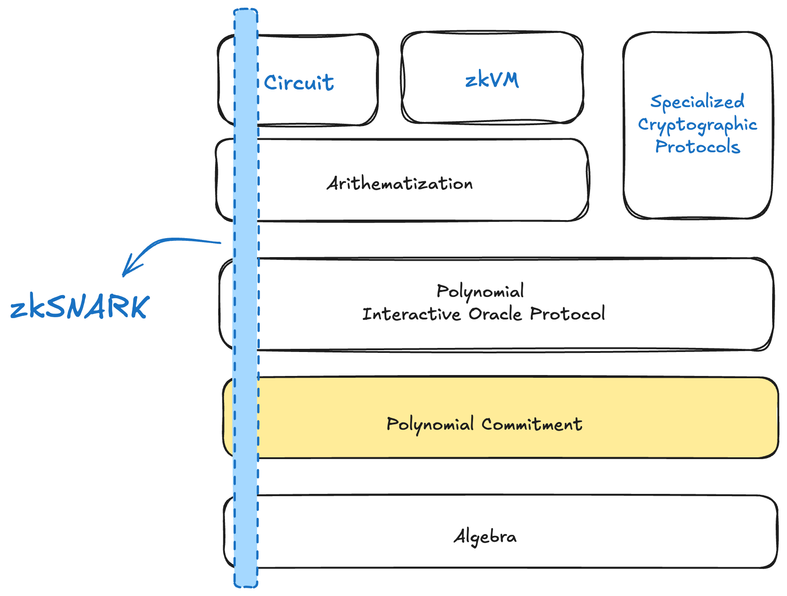
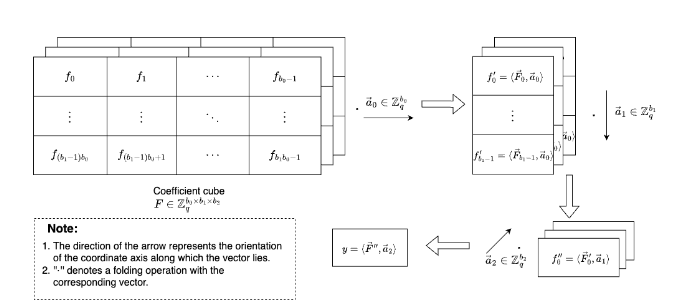

# MLE-PCS final report

**TODO**

- [ ] 公式解释
- [ ] ph23 有两个版本，博客文章中的协议描述是优化的协议

在本节将详细阐述本项目完成的内容，主要包括四个部分：

- MLE-PCS 概览与分类
- 安全性分析
- 新发现
- 代码实现：阐述目前代码已实现的协议
- 性能分析：

## 背景

多项式承诺方案 (Polynomial Commitment Scheme) 是许多 zkSNARK (zero-knowledge Succinct Non-interactive ARguments of Knowledge) 系统中的一个重要组件。对于 Prover 承诺的一个多项式，Prover 可以向 Verifier 证明该多项式在一个公开的打开点的值是正确的。

最初，例如 [KZG10] 多项式承诺方案支持的仅是单变量多项式，假设该单变量多项式有 $N$ 个系数，那么 Prover 的计算复杂度为 $O(N \log N)$ 。最近，许多 SNARK 证明系统开始使用多元线性多项式承诺方案 (Multilinear Polynomial Commitment Schemes, MLE-PCS)，例如 Hyperplonk[CBBZ22]，假设多元线性多项式有 $N$ 个系数，那么 Prover 的计算复杂度可以达到线性，即 $O(N)$ 。MLE-PCS 不仅可以用来构建更加高效的证明系统，同时多元线性多项式的表示方式还能带来其他的好处，例如在 Hypercube 上能进行高效的递归拆分折叠（Split-and-fold），对支持高次的约束更加友好，分解更加灵活。

本项目 **MLE-PCS** 关注于研究并比较不同的多元线性多项式承诺方案，包括方案的设计、安全假设以及效率等方面。

## MLE-PCS 概览

对于一个 $n$ 元线性多项式 $\tilde{f}(X_0, X_1, \ldots, X_{n - 1})$ ，有以下两种表示形式：

1. Coefficients form

多元线性多项式用系数可以表示为如下的形式

$$
\tilde{f}(X_0, X_1, \ldots, X_{n - 1}) = c_0 + c_1 X_0 + c_2 X_1 + \ldots + c_{2^n - 1} X_0 X_1 \cdots X_{n - 1}
$$

其中 $\{c_i\}_{0  \le i \le 2^{n} - 1}$ 为该多元线性多项式的系数。

2. Evaluations form

多元线性多项式还可以用在 Boolean Hypercube $B_n = \{0,1\}^n$ 上的值的形式表示，即

$$
\tilde{f}(X_0, X_1, \ldots, X_{n - 1}) = \sum_{i = 0}^{2^n - 1} \tilde{f}(\mathsf{bits}(i)) \cdot \tilde{eq}(\mathsf{bits}(i), (X_0, X_1, \ldots, X_{n - 1}))
$$

其中，$\mathsf{bits}(i) = (i_0, i_1, \ldots, i_{n-1})$ 表示 $i$ 的二进制表示构成的向量，向量中的第一个分量 $i_0$ 为二进制表示中的最低位，即 Little-endian。例如当 $n = 3$ 时，$3$ 的二进制表示为 $011$ ，则向量 $\mathsf{bits}(3) = (1,1,0)$ 。$\tilde{eq}(\mathsf{bits}(i), (X_0, X_1, \ldots, X_{n - 1}))$ 为 Boolean Hypercube $B_n = \{0,1\}^n$ 上的 Lagrange 多项式，即

$$
\tilde{eq}(\mathsf{bits}(i), (X_0, X_1, \ldots, X_{n - 1})) = \prod_{j = 0}^{n - 1} ((1 - i_j)(1 - X_j) + i_j X_j)
$$

在 MLE-PCS 的承诺协议中，Prover 先向 Verifier 承诺多元线性多项式 $\tilde{f}$ ，随后在 Evaluation 证明协议中，Prover 要向 Verifier 证明 $\tilde{f}$ 在一个公开点 $\vec{u} = (u_0, \ldots, u_{n - 1})$ 处的运算值为 $v$，即证明 $\tilde{f}(u_0, \ldots, u_{n - 1}) = v$ 。

有的 MLE-PCS 协议是按照 Evaluations Form 描述的，而有的协议是按照 Coefficients Form 描述的。这中间自然就会产生一个形式转换的问题，例如一个多元线性多项式是按照系数形式给定的，那么就需要用类似 FFT 的算法将其转换为 Evaluation 形式以适配用 Evaluation 描述的协议。不过，许多作者已经注意到不需要经过这个 FFT 转换，也能适配该协议。以 Basefold [ZCF23] 协议举例，在原论文 [ZCF23] 中，协议是按照系数进行描述的，但是 Ulrich Haböck 在论文 [H24] 中以 Evaluation 的形式重新描述了 Basefold 协议，在原 Basefold 协议的基础上，只需要更改 FRI 协议中的折叠形式即可，关于这部分的转换可见笔记 [An Alternative Folding Method](https://github.com/sec-bit/mle-pcs/blob/main/basefold/basefold-03.md#an-alternative-folding-method) 。

本项目的工作描述了许多 MLE-PCS 的基本原理，同时对于有的协议，我们还补充了多元线性多项式在另一种表示形式下的协议描述。在下表中给出本项目所涉及的 MLE-PCS。

> TODO: 更新表中文章链接 去除 Remark 一栏

| Scheme        | Paper      | Form         | Blog                                                         | Remark |
| ------------- | ---------- | ------------ | ------------------------------------------------------------ | ------ |
| PST13         | [XZZPS19]  | Eoefficients | [Notes on Libra-PCS](https://github.com/sec-bit/mle-pcs/blob/main/libra-pcs/libra-pcs.md) |        |
| zeromorph     | [KT23]     | Evaluations  | [Notes on Zeromorph](https://github.com/sec-bit/mle-pcs/blob/main/zeromorph/zeromorph.md) |        |
| zeromorph-fri |            | evaluation   | [Zeromorph-PCS : 对接 FRI]                                   | ⭐      |
| gemini        | [BCH+22]   | coefficient  | [Gemini-PCS (Part I)](https://github.com/sec-bit/mle-pcs/blob/main/gemini/Gemini-PCS-1.md),[Gemini-PCS (Part II)](https://github.com/sec-bit/mle-pcs/blob/main/gemini/Gemini-PCS-2.md) |        |
| gemini-fri    |            | coefficient  | [Gemini ：对接 FRI]                                          | ⭐      |
| hyperKZG      | N/A        | evaluation   | [Notes on HyperKZG](https://github.com/sec-bit/mle-pcs/blob/main/gemini/hyperkzg-pcs-01.md) |        |
| PH23-KZG      | [PH23]     | evaluation   | [The Missing Protocol PH23-PCS (Part 1)](https://github.com/sec-bit/mle-pcs/blob/main/ph23/ph23-pcs-01.md), [Missing Protocol PH23-PCS (Part 2)](https://github.com/sec-bit/mle-pcs/blob/main/ph23/ph23-pcs-02.md) |        |
| PH23-fri      | ⭐          | evaluation   | [缺失的协议 PH23-PCS（四）],[缺失的协议 PH23-PCS（五）]      |        |
| Mercury       | [EG25]     | evaluation   | [Mercury 笔记：实现常数证明尺寸], [Mercury 笔记：对接 KZG]   |        |
| Samaritan     | [GPS25]    | evaluation   |                                                              |        |
| Virgo         | [ZXZS19]   | coefficient  | [Notes on Virgo-PCS](https://github.com/sec-bit/mle-pcs/blob/main/virgo-pcs/virgo-pcs-01.md) |        |
| Hyrax         |            | evaluation   | [Notes on Hyrax-PCS](https://github.com/sec-bit/mle-pcs/blob/main/hyrax-pcs/hyrax-01.md) |        |
| Basefold      | [ZCF23]    | coefficient  | [Notes on Basefold (Part I): Foldable Linear Codes](https://github.com/sec-bit/mle-pcs/blob/main/basefold/basefold-01.md), [Notes on Basefold (Part II): IOPP](https://github.com/sec-bit/mle-pcs/blob/main/basefold/basefold-02.md), [Notes on Basefold (Part III): MLE Evaluation Argument](https://github.com/sec-bit/mle-pcs/blob/main/basefold/basefold-03.md) |        |
| Basefold      |            | evaluation   | [An Alternative Folding Method](https://github.com/sec-bit/mle-pcs/blob/main/basefold/basefold-03.md#an-alternative-folding-method) | ⭐️      |
| Deepfold      | [GLHQTZ24] | coefficient  | [Note on DeepFold: Protocol Overview](https://github.com/sec-bit/mle-pcs/blob/main/fri/deepfold.md) |        |
| Ligerito      | [GLHQTZ24] | coefficient  | [Notes on Ligerito-PCS](https://github.com/sec-bit/mle-pcs/blob/main/ligerito/) |        |
| WHIR          | [ACFY24b]  | coefficient  | [Note on WHIR: Reed-Solomon Proximity Testing with Super-Fast Verification](https://github.com/sec-bit/mle-pcs/blob/main/fri/whir.md) |        |
| FRI-Binius    | [DP24]     | evaluation   | [Notes on FRI-Binius (Part I): Binary Towers](https://github.com/sec-bit/mle-pcs/blob/main/fri-binius/binius-01.md), [Notes on Binius (Part II): Subspace Polynomial](https://github.com/sec-bit/mle-pcs/blob/main/fri-binius/binius-02.md) |        |
| Σ-Check       | [GQZGX24]  |              |                                                              |        |

- [ ] 更新 zeromorph-fri 文章链接
- [ ] 更新 gemini-fri 文章链接
- [ ] 更新 ph23-fri 文章链接
- [ ] 更新 mercury 文章链接
- [ ] 添加 hyperkzg, hyrax 的参考文献

上表中在 Remark 一栏中添加“⭐️”的表示是在本项目中新增的协议描述。

### 按承诺协议的分类

| Commitments    | Algebra            | Schemes                                                                          |
| ------------- | ------------------ | -------------------------------------------------------------------------------- |
| KZG10          | Paring Friendly ECC based          | PST13(mKZG or Liba-PCS), Zeromorph, Gemini, HyperKZG, PH23-KZG, Mercury, Samaritan      |
| Merkle Tree | Linear code based | Ligero, Virgo, Basefold, Deepfold, WHIR, PH23-fri, Zeromorph-fri, Gemini-fri, Ligerito, FRI-Binius |
| Pedersen Commitment | ECC based | Hyrax, Σ-Check |
| Ajtai Commitment | Lattice based | Greyhound, Hyperwolf |

> TODO: 补充这一部分

### 按 Evaluation 证明原理分类

根据协议实现方法的不同，可以将 MLE-PCS 分为以下几类：

- Quotienting
- Split-and-fold
- Inner-product
- Sumcheck

| Principle         | Schemes                        |
|-------------------|--------------------------------|
| Quotienting       | PST13(Libra-PCS), Zeromorph, Zeromorph-FRI    |    
| Sumcheck          | Basefold, Deepfold, WHIR, Ligerito, FRI-Binius |  
| Split-and-fold    | Gemini, HyperKZG, Gemini-fri, Hyperwolf |
| Inner-product     | Ligero, Hyrax, Σ-Check, PH23-kzg, Virgo-PCS, Mercury, Samaritan,  GreyHound | 

<!-- |                 | Quotienting          | Split-and-fold   | Inner-product                | Sumcheck                             |
| --------------- | -------------------- | ---------------- | ---------------------------- | ------------------------------------ |
| KZG10           | Libra-PCS, zeromorph | Gemini, hyperKZG | PH23-kzg, mercury, samaritan |                                      |
| FRI             | zeromorph-fri        | gemini-fri       | Virgo, PH23-fri              | Basefold, Deepfold, WHIR, FRI-Binius |
| Pedersen Commitment |                      |                  | Hyrax, Σ-Check               |     -->

#### Quotienting

MLE-PCS 要证明的是一个多元线性多项式 $\tilde{f}(X_0, \ldots, X_{n - 1})$ 在一个公开点 $(u_0, \ldots, u_{n - 1})$ 的值为 $v$ ，即证明 $\tilde{f}(u_0, \ldots, u_{n - 1}) = v$ 。

根据论文 [PST13] 给出的关于 MLE 多项式的除法分解定理，可以得到

$$
\begin{split}
\tilde{f}(X_0, X_1, \ldots, X_{n-1}) -  {\color{red}\tilde{f}(u_0, u_1, \ldots, u_{n-1})} & = \tilde{q}_{n-1}(X_0, X_1, \ldots, X_{n-2}) \cdot (X_{n-1} - u_{n-1}) \\
& + \tilde{q}_{n-2}(X_0, X_1, \ldots, X_{n-3}) \cdot (X_{n-2} - u_{n-2}) \\
& + \cdots \\
& + \tilde{q}_{1}(X_0) \cdot (X_{1} - u_{1}) \\
& + \tilde{q}_{0} \cdot (X_{0} - u_{0}) \\
\end{split}
$$

若有 $\tilde{f}(u_0, \ldots, u_{n - 1}) = v$ ，那么就有

$$
\begin{split}
\tilde{f}(X_0, X_1, \ldots, X_{n-1}) - {\color{red}v} & = \tilde{q}_{n-1}(X_0, X_1, \ldots, X_{n-2}) \cdot (X_{n-1} - u_{n-1}) \\
& + \tilde{q}_{n-2}(X_0, X_1, \ldots, X_{n-3}) \cdot (X_{n-2} - u_{n-2}) \\
& + \cdots \\
& + \tilde{q}_{1}(X_0) \cdot (X_{1} - u_{1}) \\
& + \tilde{q}_{0} \cdot (X_{0} - u_{0}) \\
\end{split}
$$

此时证明 $\tilde{f}(u_0, \ldots, u_{n - 1}) = v$ 就可以转换为证明 $\{\tilde{q}_i\}_{0\leq i<n}$ 的存在性，并满足上面的除法等式。

PST13[PST13, XZZPS19] 通过引入结构化的 SRS 来承诺商多项式 $\tilde{q}_0, \tilde{q}_1, \ldots, \tilde{q}_{n-1}$ ，Verifier 通过 ECC-Pairing 运算来验证上述除法分解的正确性。

Zeromorph [KT23] 协议的核心是给出了一个从多元线性多项式到一元多项式的映射， MLE 多项式在 Boolean Hypercube 上的 Evaluations 直接作为一元多项式的系数。将上述除法分解式中的多元线性多项式通过这种映射方式变为一元多项式，可以得到 Zeromorph 协议想证明的一个关键等式：

$$
\begin{split}
[[\tilde{f}(X_0, X_1, \ldots, X_{n-1})]]_n - v\cdot\Phi_n(X) &=\sum_{k=0}^{n-1}\Big(X^{2^k}\cdot \Phi_{n-k-1}(X^{2^{k+1}}) - u_k\cdot\Phi_{n-k}(X^{2^k})\Big)\cdot [[\tilde{q}_k(X_0, X_1, \ldots, X_{k-1})]]_k
\end{split}
$$

其中 $[[\tilde{f}(X_0, X_1, \ldots, X_{n-1})]]_n$ 表示 $\tilde{f}(X_0, \ldots, X_{n - 1})$ 在 boolean hypercube $B_n = \{0,1\}^n$ 上的值直接对应一个单变量多项式的系数，即

$$
[[\tilde{f}(X_0, X_1, \ldots, X_{n-1})]]_n = \sum_{i = 0}^{2^n - 1} \tilde{f}(\mathsf{bits}(i)) \cdot X^{i}
$$
$[[\tilde{q}_k(X_0, X_1, \ldots, X_{k-1})]]_k$ 也按照上述同样的映射方法，将一个多元线性多项式映射成一个单变量多项式，即

$$
[[\tilde{q}_k(X_0, X_1, \ldots, X_{k-1})]]_k = \sum_{i = 0}^{2^k - 1} \tilde{q}_{k}(\mathsf{bits}(i)) \cdot X^i
$$

$\Phi_n(X)$ 与 $\Phi_{n-k}(X^{2^k})$ 也是一元多项式，一般地，$\Phi_k(X^h)$ 表示如下的多项式

$$
\Phi_k(X^h) = 1 + X^h + X^{2h} + \ldots + X^{(2^{k}-1)h}
$$

因此 zeromorph 协议的关键等式两边都是一元多项式，此时 Verifier 可以随机选择一个点，Prover 只要证明这些一元多项式在该随机点处满足上面的等式即可，也就是可以用 univariate-PCS 来证明上式成立。因此 zeromorph 协议可以选择对接不同的 univariate-PCS ，如 KZG10 或者 FRI-PCS。

#### Inner-product 

Multilinear Polynomial 的证明 $\tilde{f}(u_0, \ldots, u_{n - 1}) = v$ ，可以转化为下面的 Inner-product 形式：

$$
\langle \vec{f}, \otimes_{j=0}^{n - 1}(1, u_i)\rangle = v
$$

即证明向量 $\vec{f}$ 和 向量 $\otimes_{j=0}^{n - 1}(1, u_i)$ 的内积为 $v$ 。通过这种内积证明的方式来构造 MLE-PCS 的协议有很多，有 Virgo[ZXZS19], Hyrax[WTSTW16],PH23-PCS[PH23], Mercury[EG25] 以及 Samaritan[GPS25]。

Virgo-PCS[ZXZS19] 是以 MLE 多项式的 Coefficients Form 描述的，证明 $\tilde{f}(u_0, \ldots, u_{n - 1}) = v$ 即证明内积

$$
\langle \vec{f}, \otimes_{j=0}^{n - 1}(1, u_i)\rangle = v
$$

Virgo-PCS 借助 Univariate Sumcheck 来证明这个内积。Univariate Sumcheck 中，除了证明一元多项式的约束成立，还需要证明一个一元多项式的次数小于某个值，这一部分证明借助 FRI 协议来完成。

在 Univariate Sumcheck 中，Verifier 要验证一个关于一元多项式的约束成立，需要计算由 $\otimes_{j=0}^{n - 1}(1, u_i)$  组成的向量构造的多项式 $u(X)$ 在一点的值，但这需要 $O(N)$ 的计算量。Virgo 利用 GKR 协议，将这部分计算代理给 Prover，Verifier 整体只需要 $O(\log^2(N))$ 的计算量就可以完成验证。

PH23-PCS[PH23] 协议描述的是多元线性多项式的 Evaluations Form，证明 $\tilde{f}(u_0, \ldots, u_{n - 1}) = v$ 即证明

$$
\sum_{i = 0}^{2^n - 1} \tilde{f}(\mathsf{bits}(i)) \cdot \tilde{eq}(\mathsf{bits}(i), (u_0,\ldots,u_{n-1})) = v
$$

令向量 $\vec{a} = (\tilde{f}(\mathsf{bits}(0)), \ldots, \tilde{f}(\mathsf{bits}(2^n - 1)))$ ，向量 $\vec{c}$ 的第 $i$ 个分量为 $\tilde{eq}(\mathsf{bits}(i), (u_0,\ldots,u_{n-1}))$ ，则上面的求和式子可以用内积的视角来看待，

$$
\langle \vec{a}, \vec{c} \rangle  = v
$$

PH23-PCS 证明协议就分为两部分：

(1) 证明向量 $\vec{c}$ 的分量确实是 $\tilde{eq}(\mathsf{bits}(i), (u_0,\ldots,u_{n-1}))$ 

(2) 证明内积 $\langle \vec{a}, \vec{c} \rangle  = v$

对于第 (1) 部分的证明，利用 $\tilde{eq}(\mathsf{bits}(i), (u_0,\ldots,u_{n-1}))$ 的结构，构造一元多项式 $c(X)$ ，用 $n + 1$ 个一元多项式的约束进行证明。

对于第 (2) 部分的证明，这是一个内积证明，可以用 Grand Sum 或者 Univariate Sumcheck 的方法来进行证明。文章 [The Missing Protocol PH23-PCS (Part 1)](https://github.com/sec-bit/mle-pcs/blob/main/ph23/ph23-pcs-01.md) 中给出了 PH23-PCS 用 Grand Sum 做内积证明的完整协议。用 Grand Sum 的方法证明内积可以转换为证明 $3$ 个一元多项式的约束成立。

这样 PH23-PCS 两部分的证明就能转换为证明 $n + 4$ 个一元多项式的约束成立，进而可以用一元多项式的 PCS 来证明，因此 PH23-PCS 可以对接 KZG10 和 FRI-PCS。

Hyrax [WTSTW16] 协议直接将 MLE 多项式 $\tilde{f}(u_0, u_1, u_2, u_3)$ 看作是一个向量矩阵乘法等式，即

$$
\tilde{f}(u_0, u_1, u_2, u_3) = 
\begin{bmatrix}
1 & u_2 & u_3 & u_2u_3 \\
\end{bmatrix}
\begin{bmatrix}
c_0 & c_1 & c_2 & c_3 \\
c_4 & c_5 & c_6 & c_7 \\
c_8 & c_9 & c_{10} & c_{11} \\
c_{12} & c_{13} & c_{14} & c_{15}
\end{bmatrix}
\begin{bmatrix}
1 \\
u_0 \\
u_1 \\
u_0u_1 \\
\end{bmatrix}
$$

然后将矩阵按行进行承诺的计算，Hyrax 采用的是 Pedersen Commitment，具有加法的同态性，因此可以将承诺向量与 $(1, u_2, u_3, u_2u_3)$ 先进行内积运算，得到一个单个的承诺，然后再证明这个承诺对应的向量与 $(1, u_0, u_1, u_0u_1)$ 的内积等于 $v$ 。最后这个内积证明采用的是 Bulletproofs-IPA 协议，总体上 Verifier 的计算量为 $O\sqrt{N}$，而 Proof size 为 $O(\log(N))$。

Mercury [EG25] 协议和 Samaritan [GPS25] 协议的思路非常类似，它们都在 Hyrax 上述的矩阵乘法等式上进行改进。与 Hyrax 不同的是，Mercury 和 Samaritan 只需要对向量整体进行承诺计算，而不是按行产生 $\sqrt{N}$ 个承诺。然后将整体的 Evaluation 证明转换为两个内积证明。并且，Mercury 将两个内积证明 Batch 到一个内积证明，从而进一步优化了协议。

#### Sumcheck 方式

将 $\tilde{f}(u_0, \ldots, u_{n - 1}) = v$ 代入多元线性多项式的点值式，可以转换为证明在 $B_n = \{0,1\}^n$ 上的求和式

$$
\sum_{\vec{b} = \{0,1\}^n}\tilde{f}(\vec{b}) \cdot \tilde{eq}(\vec{b}, \vec{u}) = v
$$

那么我们可以证明上面的求和式成立，从而证明 Multilinear Polynomial 的 Evaluation 正确性。采用 Sumcheck 的问题在于：在 Sumcheck 协议的最后一步 Verifier 需要得到 $\tilde{f}$ 在一个随机点处的值来进行最后的验证，从而完成整个 Sumcheck 协议。Basefold  [ZCF23] 协议的重要贡献是发现如果同步对 $\tilde{f}$ 对应的一元多项式使用 FRI 协议，并且在每一轮折叠时采用和 Sumcheck 协议一样的随机数，那么当折叠到最后一步，得到的常数正是 Sumcheck 协议最后一步想要 $\tilde{f}$ 在随机点处的值。

$$
h(r_{n-1}) \overset{?}{=} \tilde{f}(r_0, r_1, \ldots, r_{n-1})\cdot \tilde{eq}((r_0, r_1, \ldots, r_{n-1}), \vec{u})
$$

Deepfold 协议，WHIR 协议也是延续了采用 Sumcheck 的思想，不同的地方在于 Deepfold 采用了 DEEP-FRI 中的想法，Prover 提前确定多项式在某个 Out-of-domain 随机点的求值，作为某种形式的 Commitment，确保 Prover 在 List-decoding Regime 中也能确保始终承诺的是同一个多项式。而这个随机 Evaluation 也可以同样采用 Sumcheck 协议来证明。具体地说，在每一轮的 Basefold 协议交互中，Verifier 再额外随机选择一个 $z_i\leftarrow \mathbb{F}$，然后 Prover 发送 $y_i$ 并证明其是 $\hat{f}^{(i)}(z_i)$ 的值。因为 $\hat{f}^{(i)}$ 和 $\tilde{f}^{(i)}$ 存在同构映射，因此 $y_i$ 也是下面 MLE 多项式的运算值：

$$
y_i = \tilde{f}^{(i)}(z_i, z_i^2, \cdots, z_i^{2^{n-i-1}})
$$

因此，Prover 在后续的协议交互中，同样采用一个新的 Sumcheck 协议来证明 $\tilde{f}^{(i)}(z_i, z_i^2, \cdots, z_i^{2^{n-i-1}})$ 的正确性。

WHIR 在 Deepfold 协议的基础上，将 Out-of-domain 和 In-domain 的随机查询都合并入 Sumcheck，使得协议达到了一个更优的状态。同样，基于 Basefold 的Ligerito 也利用了 Sumcheck 协议，在每一个 Round，Verifier 都会抽样一些 Oracle 中的点，然后这些点的编码正确性本应该由 Verifier 计算，由于这些计算是一个内积，于是 Verifier 可以利用 Sumcheck 协议将其代理给 Prover ，并且这个 Sumcheck 可以和当前轮 Basefold 协议部分的 Sumcheck 协议合并，从而大大优化协议的后续流程。

#### Split-and-fold (Recursive)

这种证明思路非常类似 FRI 协议，即将一个较大的多项式，反复进行拆分折叠（Split-and-fold），最后
Gemini [BCH+22] 协议和 HyperKZG 都是采用 split-and-fold 的思想来证明，它们的不同点在于 Gemini 中的多元线性多项式是 Coefficients Form，而 hyperKZG 中采用 Evaluations Form，在协议中只需要更换折叠的方式即可，不需要将点值式用 FFT 转换为系数式。

以 Gemini 协议为例，将 MLE 多项式的系数式

$$
\tilde{f}(X_0, X_1, \ldots, X_{n-1}) = \sum_{i=0}^{2^n-1} f_i \cdot X_0^{i_0}X_1^{i_1} \cdots X_{n - 1}^{i_{n - 1}} 
$$

中的求和形式看作是一个向量和一个 tensor product 结构的内积，即

$$
\tilde{f}(X_0, X_1, \ldots, X_{n-1}) = \langle \vec{f}, \otimes_{i=0}^{n - 1}(1, X_i)\rangle
$$

以 $n = 3$ 为例，系数向量

$$
\vec{f} = (f_0,f_1, f_2, \ldots, f_7)
$$

tensor product 结构也可以看作是一个向量，为

$$
\otimes_{i=0}^{2}(1, X_i) = (1, X_0, X_1, X_0X_1, X_2, X_0X_2, X_1X_2, X_0X_1X_2)
$$

因此要证明 $\tilde{f}(u_0, \ldots, u_{n - 1}) = v$ ，即证明

$$
\langle \vec{f}, \otimes_{j=0}^{n - 1}(1, u_i)\rangle = v
$$

而上面的内积形式可以进行 spilt-and-fold ，即

$$
\langle \vec{f}, \otimes_{j=0}^{n - 1}(1, u_i)\rangle = \langle \vec{f}_{even}, \otimes_{j=1}^{n - 1}(1, u_i)\rangle  + u_0 \langle \vec{f}_{odd}, \otimes_{j=1}^{n - 1}(1, u_i)\rangle 
$$

$\vec{f}_{even}$ 表示系数向量 $\vec{f}$ 中的偶数项组成的向量，$\vec{f}_{odd}$ 表示 $\vec{f}$ 中的奇数项组成的向量。依然以 $n = 3$ 为例，可以得到

$$
\begin{align}
\langle \vec{f}, \otimes_{j=0}^{n - 1}(1, u_i)\rangle  & =  f_0 + f_1 u_0 + f_2 u_1 + f_3 u_0 u_1 + f_4 u_2 + f_5 u_0 u_2 + f_6 u_1 u_2 + f_7 u_0u_1u_2 \\
 & = (f_0 + f_2 u_1 + f_4 u_2 + f_6 u_1u_2) + u_0 \cdot (f_1 + f_3 u_1 + f_5 u_2 + f_7 u_1u_2) \\
 & =  \langle \vec{f}_{even}, \otimes_{j=1}^{n - 1}(1, u_i)\rangle  + u_0 \langle \vec{f}_{odd}, \otimes_{j=1}^{n - 1}(1, u_i)\rangle 
\end{align}
$$

这里 split-and-fold 的含义是，先将 $8$ 项求和 split 成两部分，即偶项 $f_0 + f_2 u_1 + f_4 u_2 + f_6 u_1u_2$ 和奇项 $f_1 + f_3 u_1 + f_5 u_2 + f_7 u_1u_2$ ，再用 $u_0$ 将这两部分 fold 成一部分，fold 完的这一部分还可以继续接着进行 split-and-fold 的过程。这里 split-and-fold 的思想和 FRI 以及 sumcheck 是一样的。

我们将 MLE 多项式的系数式直接转换为一元多项式的系数，例如 $\tilde{f}(X_0, \ldots, X_{n - 1})$ 对应的一元多项式为

$$
f(X) = \sum_{i=0}^{2^n-1} f_i \cdot X^i
$$

因此上面的 spilt-and-fold 技巧可以直接在 $f(X)$ 上应用，其过程和 FRI 协议一致，不过每次 fold 的系数不是随机数，而是 $u_i$ ，这样最后就会变成一个常数多项式，结果应该等于 $\tilde{f}$ 在点 $(u_0, \ldots, u_{n - 1})$ 处的取值，即等于 $v$ 。在这个过程中 verifier 需要验证每次 fold 的正确性，verifier 可以随机挑战一些点来进行验证，这就可以通过 univariate-PCS 来实现，可以接 KZG10 或者 FRI。

这些协议通过上述方法将 MLE-PCS 转换为 univariate-PCS ，根据所采取的 univariate-PCS 的不同，又可以分为三类：

- KZG10
- FRI 
- Bulletproofs-Inner Product Argument

综合上述两种分类方法，该项目涉及的协议如下：

<!-- |                 | Quotienting          | Split-and-fold   | Inner-product                | Sumcheck                             |
| --------------- | -------------------- | ---------------- | ---------------------------- | ------------------------------------ |
| KZG10           | Libra-PCS, zeromorph | gemini, hyperKZG | PH23-kzg, mercury, samaritan |                                      |
| FRI             | zeromorph-fri        | gemini-fri       | Virgo, PH23-fri              | Basefold, Deepfold, WHIR, FRI-Binius |
| Bulletproof-IPA |                      |                  | Hyrax, Σ-Check               |                                      | -->

对于基于 KZG10 的协议，通过详细计算协议中的有限域乘法操作，求逆操作，椭圆曲线上的 msm 操作，proof 大小等，对比了 PH23-PCS, zeromorph, gemini 协议的具体运行效率，这一部分将在下文详细说明。

对于基于 FRI 的协议，详细统计了 basefold 协议与 zeromorph-fri 协议中的哈希计算、Merkle 树相关运算，有限域运算等，得出了在 Prover 复杂度，Verifier 复杂度以及 Proof Size 这三个维度上，basefold 协议都要优于 zeromorph-fri 协议。另外，从 Verifier query 复杂度的角度出发，对比了 Basefold，Deepfold 与 WHIR 这三个协议。这一部分将在下文详细阐述。

### 按 MLE 表示形式分类

MLE-PCS 协议的上层是 Multilinear PIOP 协议。而这类常见的 PIOP 通常是 Sumcheck 或者 GKR 协议。在通常的实现中，Multilinear Polynomial 会以 Evaluations Form 的形式表示。那么在 MLE-PCS 协议中，并不是所有的协议都直接对 Evaluations Form 进行证明。如果一个 MLE-PCS 协议只能对 Multilinear Polynomial 协议的 Coefficients Form 进行证明，或者进行承诺，那么 Prover 需要额外进行 Algebraic FFT（NTT）算法计算出 Multilinear Polynomial 的 Coefficients Form，这需要 $O(N\log{N})$ 的计算时间复杂度。这有可能导致 Prover 做不到线性时间的工作量。

尽管一些 MLE-PCS 论文中仅描述了一种形式，比如 Coefficients Form。但是协议本身也可以支持 Evaluations Form，这在工程实践中，可以根据更进一步的性能分析，而选择适合的协议变种。下面我们列出本项目所覆盖到的 MLE-PCS 对 Multilinear Polynomial 的两种表示形式的支持情况：

| Scheme        | Coefficients                |  Evaluations                          |
| ------------- | ---------------------- | ------------------------------------ |
| PST13         | [PST13] ✅| ✅  [XZZPS19]       |
| Zeromorph     |  ❓      | ✅ [KT23]   |        |
| Gemini        | [BCH+22]  |      |  
| hyperKZG      |           | ✅ HyperKZG |
| PH23-KZG      |           | ✅ [PH23]   | 
| Mercury       |   ✔️      | ✅ [EG25]   | 
| Samaritan     |   ✔️           | ✅ [GPS25]  |   
| Virgo         | ✅ [ZXZS19]  | ❓ | 
| Hyrax         |     ✅     | ✅ [WTSTW16]   |
| Basefold      | ✅ [ZCF23]    | ✅ [H24]  |
| Deepfold      | ✅ [GLHQTZ24] | ❓  |
| Ligerito      | ✅ | ✅ [NA25]  |
| WHIR          | ✅ [ACFY24b]  |  ❓ |
| FRI-Binius    | ✔️           | ✅ [DP24]   | 
| Σ-Check       | ✅ [GQZGX24] |  ✅ |       
| Greyhound     | ✅ [NS24]|  ✅  |
| Hyperwolf     | ✅ [ZGX25]| ✅  |

- ✅：表示支持
- ✔️：表示支持，但需要进一步分析
- ❓：可能不支持，但没有进一步证明

## MLE-PCS 的安全性分析

对于一个 MLE-PCS 协议，我们不仅关注于协议是如何构造的，也关心协议的安全性证明，包括 Completeness、Soundness、Knowledge soundness 以及 Zero-knowledge 等性质。对于基于 KZG10 和基于 FRI 的 MLE-PCS，它们的安全假设有很大的不同。

| Assumption    | Algebra            | Schemes                                                                          |
| ------------- | ------------------ | -------------------------------------------------------------------------------- |
| KZG10(BSDH, AGM, )          | ECC based          | PST13, Zeromorph, Gemini, HyperKZG, PH23-KZG, Mercury, Samaritan      |
| Random Oracle (Hash) | Linear code based | Virgo, PH23-fri, zeromorph-fri, Gemini-fri, Basefold, Deepfold, WHIR, FRI-Binius |
| EC Discrete Log | ECC based          |  Hyrax，∑-check      |
| M-SIS | Lattice based | Greyhound, Hyperwolf      |

### 基于 KZG10 的安全性

对于基于 [KZG10] 的 MLE-PCS，我们重点关注其 Knowledge Soundness 证明（也称作 Extractability）。

在 [KZG10] 论文中，作者要求协议满足 Evaluation Binding 性质，该性质只保证了证明者没法伪造证明：使得多项式 $f(X)$ 在同一个点 $a$ 上打开为两个不同的值 $v_1 \neq v_2$。

然而，当 [KZG10] 被用作 SNARK 设计中，仅满足 Evaluation Binding 性质无法满足证明系统 Knowledge Soundness 的安全要求。

因此，研究者们对 [KZG10] 提出了更强的安全性要求，即 **“可提取性“ （Extractability）:** 对于任何代数敌手  $\mathcal{A}_{alg}$，如果它能够输出一个合法的多项式求值证明，那么一定存在另一个高效的算法  $\mathcal{B}_{alg}$，能够提取出多项式承诺 $C$ 的秘密值 $f(X)$，满足 $f(z) = v$。

对于 [KZG10] 的可提取性证明，我们通常关心两点：

- 安全模型：使用标准模型还是理想化模型，例如 Random Oracle 模型，或者 Algebraic Group 模型
- 困难假设：主要考虑使用假设的类型是 Falsifiable 还是 Non-falsifiable

包括 [MBKM19]，[GWC19]，[CHM+20] 在内的多个基于 [KZG10] 的工作，都先后对可提取性的证明问题进行了讨论。我们总结如下：

| paper | security model | assumption separation | assumption |
| --- | --- | --- | --- |
| [MBKM19], [GWC19] | AGM+ROM | Falsifiable | q-DLOG |
| [CHM+20] | ROM | Non-Falsifiable | PKE |
| [HPS23] | AGMOS+ROM | Falsifiable | FPR+TOFR |
| [LPS24] | ROM | Falsifiable | ARSDH |

本项目以博客文章的形式深入研究了KZG协议的安全性证明，包括

- [KZG-soundness-1](https://github.com/sec-bit/mle-pcs/blob/main/kzg10/kzg%20notes/kzg-soundness-1.md)：介绍了KZG 可提取性的概念，并分析了 [MBKM19] 论文中基于 AGM+ROM 模型下的 KZG 安全性证明方法

- [KZG-soundness-2](https://github.com/sec-bit/mle-pcs/blob/main/kzg10/kzg%20notes/kzg-soundness-2.md)：详细介绍并分析了 [LPS24] 论文中基于 ROM 模型下的KZG 安全性证明方法

除此之外，[HPS23] 提出了一种改进的安全模型称作 AGMOS（Algebraic Group Model with Oblivious Sampling）。作为 AGM 的一种更加现实的变体，AGMOS 赋予对手在不知道离散对数的情况下模糊采样群元素的额外能力。

此外，[HPS23] 中还指出在实际协议设计中存在着两种不同的 KZG 可提取性定义：

- 提取器算法在 Commit 和 Open 阶段之后提取多项式，如 [MBKM19]，[CHM+20]
- 提取器算法仅在 Commit 阶段之后提取多项式，如 [GWC19]

其中，后者虽然能在 AGM 模型下被证明安全，但会归约到一种在标准模型下不安全的 spurious knowledge assumption。

除了可提取性，我们通常还要求 [KZG10] 满足 hiding 性质，作为构造具有 Zero-knowledge 性质的 zkSNARK 或者其它安全协议的重要组件。
本项目对该方面研究也有所讨论，包括

[Understanding Hiding KZG10](https://github.com/sec-bit/mle-pcs/blob/main/kzg10/kzg_hiding.zh.md)：这篇文章中详细介绍了两种为 KZG10 实现 Hiding 性质的方法，一种方案出自 [KT23]，其主要的技术是多元多项式承诺一个简化版本的 [PST13]。第二种方案出自 [CHM+20]，其主要的技术是对原始 KZG 协议论文 [KZG10] 的改进。

### 基于 Linear Code 的安全性

对于基于 Linear Code 的 MLE-PCS，我们重点关注其 Soundness 证明。FRI 协议[BBHR18]本身是一个针对 Reed-Solomon (RS) 编码的 IOPP (Interactive Oracle Proof of Proximity, IOPP) 协议，其安全性与 RS 编码的性质以及一些编码理论紧密相关。我们深入研究了 FRI 系列协议的 soundness 证明。

对于在有限域 $\mathbb{F}$ 中的求值 (evaluation) 集合 $S$ ，假设 $S$ 中的元素个数为 $N$ ，给定一个码率参数 $\rho \in (0,1]$ ，编码 $\text{RS}[\mathbb{F},S,\rho]$ 表示的是所有函数 $f: S \rightarrow \mathbb{F}$ 的集合，其中 $f$ 是次数 $d < \rho N$ 的多项式的求值 (evaluations)，即存在次数 $d < \rho N$ 的多项式 $\hat{f}$ 使得 $f$ 与 $\hat{f}$ 在 $S$ 上的值是一致的。

FRI 协议解决的是 *RS proximity problem*：假设我们能获得关于函数 $f: S \rightarrow \mathbb{F}$ 的 oracle ，需要 Verifier 用较少的查询复杂度，同时有很高的把握能辨别出 $f$ 属于下面哪一种情况：

1.  $f \in \text{RS}[\mathbb{F},S,\rho]$
2. $\Delta(f, \text{RS}[\mathbb{F},S,\rho]) > \delta$

也就是要么 $f$ 是 RS 编码 $\text{RS}[\mathbb{F},S,\rho]$  中的一个码字，要么距离所有 $\text{RS}[\mathbb{F},S,\rho]$ 中的码字的相对 Hamming 距离都大于接近参数 $\delta$ 。

[BBHR18] 论文中给出了 FRI 协议的 soundness 证明，对于 $\delta < \delta_0$ ，其中 $\delta_0 \approx \frac{1 - 3 \rho}{4}$ ，对于任意作恶的 Prover $P^*$ ，Verifier 拒绝 $P^*$ 的概率大约为 $\delta - \frac{O(1)}{|\mathbb{F}|}$ 。

通过分析知道，在相同的安全性参数下，$\delta_0$ 能取到的值越大，Verifier 在 Query 阶段需要查询的次数就越少，这样 FRI 协议的证明大小以及 Verifier 的计算复杂度都会降低。在 [BBHR18] 论文之后，出现了很多理论研究工作来提高 FRI 协议中的 $\delta_0$ 。

| paper                   | $\delta_0$                                           |
| ----------------------- | ---------------------------------------------------- |
| [BBHR18]FRI             | $\delta_0 \approx \frac{1 - 3\rho}{4}$               |
| [BKS18]Worst-case ...   | $\delta_0 \approx 1 - \rho^{\frac{1}{4}}$            |
| [BGKS20]DEEP-FRI        | $\delta_0 \approx 1 - \rho^{\frac{1}{3}}$ , tight(!) |
| [BCIKS20]Proximity Gaps | $\delta_0 \approx 1 - \rho^{\frac{1}{2}}$            |

本项目以博客文章的形式深入研究了 FRI 协议的安全性证明，包括：

- [Dive into BBHR18-FRI Soundness](https://github.com/sec-bit/mle-pcs/blob/main/fri/BBHR18-FRI.md) ：详细分析了 FRI 论文 [BBHR18] 中的安全性证明
- [Dive into BCIKS20-FRI Soundness](https://github.com/sec-bit/mle-pcs/blob/main/fri/BCIKS20-proximity-gaps.md) ：介绍了如何通过 Proximity Gaps 定理来提高 FRI 协议中的安全性参数
- [Proximity Gaps and Correlated Agreement: The Core of FRI Security Proof](https://github.com/sec-bit/mle-pcs/blob/main/fri/fri-proximity-gap.md) ：深入探讨了 FRI 安全性证明中的核心概念

在论文 [ACFY24a] STIR 中提出了对 FRI 协议的一个改进，其思想是降低在 FRI 协议中每一次 $k$-折的码率，达到更小的查询复杂度。在博客文章 [STIR: Improving Rate to Reduce Query Complexity](https://github.com/sec-bit/mle-pcs/blob/main/fri/stir.en.md) 中，我们详细介绍了 FRI 协议与 STIR 协议的区别，介绍了一次迭代的协议流程，并对一次迭代的 soundness 进行了分析。

尽管 Basefold 协议[ZCF23]适用的是论文中提到的 Random Foldable Code，但其依然适用于 Reed Solomon 编码，因此可以理解为 Basefold 协议结合了 sumcheck 和 FRI 协议。在 Basefold 原论文 [ZCF23] 中，其 soundness 只证明到 $\delta_0$ 最大能取到 $(1 - \rho)/2$ ，随后 Ulrich Haböck 在 [H24] 中证明了 Basefold 协议对于 Reed Solomon 能达到 Johnson bound $1 - \sqrt{\rho}$ ，Hadas Zeilberger 在 Khatam [Z24] 论文中证明了 Basefold 协议对于一般的 linear code 能达到 $1 - \rho^{\frac{1}{3}}$ 。

关于 Basefold 协议相关的笔记文章有：

- Basefold 协议介绍：
	- [Notes on Basefold (Part I): Foldable Linear Codes](https://github.com/sec-bit/mle-pcs/blob/main/basefold/basefold-01.md) 
	- [Notes on Basefold (Part II): IOPP](https://github.com/sec-bit/mle-pcs/blob/main/basefold/basefold-02.md)
	- [Notes on Basefold (Part III): MLE Evaluation Argument](https://github.com/sec-bit/mle-pcs/blob/main/basefold/basefold-03.md)
- Basefold 原论文 [ZCF23] 中的 soundness 证明：
	- [Notes on BaseFold (Part IV): Random Foldable Codes](https://github.com/sec-bit/mle-pcs/blob/main/basefold/basefold-04.md)
	- [Notes on Basefold (Part V): IOPP Soundness](https://github.com/sec-bit/mle-pcs/blob/main/basefold/basefold-05.md)
- [H24] 中给出的 Basefold 协议的 soundness 证明：
	- [Note on Basefold's Soundness Proof under List Decoding](https://github.com/sec-bit/mle-pcs/blob/main/basefold/basefold-habock-overview.md)
	- [Note on Soundness Proof of Basefold under List Decoding](https://github.com/sec-bit/mle-pcs/blob/main/basefold/basefold-habock-soundness.md)

Deepfold 协议和 WHIR 协议采用了 Basefold 协议同样的思想，结合 sumcheck 协议来构造 MLE-PCS，Deepfold 协议结合了 sumcheck 协议与 DEEP-FRI，关于该协议的详细介绍可见博客文章 [Note on DeepFold: Protocol Overview](https://github.com/sec-bit/mle-pcs/blob/main/fri/deepfold.md) 。WHIR 协议则结合了 sumcheck 协议和 STIR 协议，在博客文章 [Note on WHIR: Reed-Solomon Proximity Testing with Super-Fast Verification](https://github.com/sec-bit/mle-pcs/blob/main/fri/whir.md) 中详细介绍了 WHIR 协议。

Basefold 协议、Deepfold 协议和 WHIR 协议有着类似的思路，我们在博客文章 [BaseFold vs DeepFold vs WHIR](https://github.com/sec-bit/mle-pcs/blob/main/basefold-deepfold-whir/basefold-deepfold-whir.md) 中对比了这三个协议的构造，并通过分析其 soundness 证明，对比了这三个协议 Verifier 的查询次数。 

- [ ] 更新文章 [BaseFold vs DeepFold vs WHIR](https://github.com/sec-bit/mle-pcs/blob/main/basefold-deepfold-whir/basefold-deepfold-whir.md) 为英文链接

### 基于 M-SIS 的安全性

> TODO: 补充这部分

## 发现

在深入研究这些 MLE-PCS 的底层原理的过程中，我们发现了一些协议还有优化的空间，并提出了一些新的实现方式。下面列举我们的主要创新点。

### ∑-Check 协议

### Hyperwolf 协议

### 优化 Zeromorph 协议

在 zeromorph 协议中，需要证明 $n$ 个商多项式 $q_i(X) = [[\tilde{q}_i]]_i  (0 \le i < n)$ 的次数小于 $2^i$ ，zeromorph 论文 [KT23] Section 6 中将多个 Degree Bound 证明聚合在一起进行证明，关于这部分协议的详细描述可见 [Optimized Protocol](https://github.com/sec-bit/mle-pcs/blob/main/zeromorph/zeromorph.md#optimized-protocol) ，不过在这个协议中 Verifier 需要在椭圆曲线 $\mathbb{G}_2$ 上进行两次运算，这对于 verifier 来说是很昂贵的操作。

我们使用了另一种证明 Degree Bound 的方法，避免了 Verifier 在椭圆曲线 $\mathbb{G}_2$ 上的操作，带来的代价是增加了一点 Verifier 在椭圆曲线 $\mathbb{G}_1$ 上的计算量以及在证明中增加了一个椭圆曲线 $\mathbb{G}_1$ 上的点和一个有限域上的值，在对 Verifier Cost 要求高的场景下，这是可以接受的。该协议的详细描述见。

- [ ] 添加协议描述的链接

### 优化 Gemini 协议

在 gemini 协议中，需要 Prover 计算 $n$ 个多项式 $h_0(X), \ldots, h_{n - 1}(X)$ 在随机点 $\beta, -\beta, \beta^2$ 处的值，并发送给 Verifier ，让 Verifier 验证 $h_{i + 1}(X^2)$ 与 $h_{i}(X)$ 和 $h_i(-X)$ 之间存在折叠的关系，关于这部分协议描述可见 [Gemini-PCS (Part I)](https://github.com/sec-bit/mle-pcs/blob/main/gemini/Gemini-PCS-1.md#implementation-based-on-kzg) 。

我们发现了两种对 gemini 协议进行优化的方式。

优化方法一：Prover 只需要发送 $h_0(\beta^2)$ 以及 $h_0(X), \ldots, h_{n - 1}(X)$ 在随机点 $\beta, -\beta$ 处的值，用随机数将 $h_0(X)$ 以及 $h_1(X), \ldots, h_{n - 1}(X)$ 聚合成一个多项式，一次证明这些多项式在 $\beta, -\beta, \beta^2$ 处的值正确，这样可以降低证明大小，减少了 $n - 1$ 个有限域上的值，具体协议描述见  。

优化方法二：另外一种优化方法是采用 FRI 协议在 Query 阶段选取点的思路，对 $h_0(X)$ 挑战 $X = \beta$ 求值，进而对折叠后的多项式 $h_1(X)$ 挑战 $X= \beta^2$ ，依次类推，直到 $h_{n - 1}(\beta^{2^{n-1}})$ 。这样做的好处是，每一次 $h_{i}(X)$ 的打开点可以在验证 $h_{i+1}(X)$ 的折叠时复用，从而在优化方法一的基础上又可以多节省 $n$ 个打开点。相比优化方法一，这样做的代价是增加了一些 Prover 和 Verifier 的计算量，但减少了证明大小。具体协议描述见  。

- [ ] 添加 gemini 优化协议文档的链接

### 优化 PH23 协议

在原始论文 [PH23]，作者给出了一个基于内积的 MLE-PCS 协议。我们通过按照原始论文提供的思路，设计的协议其证明尺寸为 $O(\log{N})$。PH23 协议的核心思想是证明下面的内积：

> TODO: 描述 PH23 协议优化到 O(1) 的思路

### 增加 PH23, Gemini 对接 FRI 的协议描述

对于 PH23-PCS, zeromorph 以及 gemini 协议，它们都将 MLE-PCS 转换为了 univariate-PCS，在原来的协议中，对接 univariate-PCS 是 KZG10，我们尝试将这些协议对接 FRI-PCS 协议，并给出了完整的协议描述。

1. **PH23-FRI** 

	我们给出了两个不同的 PH23 协议对接 FRI 的协议。

	- 协议 1 描述见 [缺失的协议 PH23-PCS（四）](https://github.com/sec-bit/mle-pcs/blob/main/ph23/ph23-pcs-fri-01.zh.md) ，其中内积证明通过 Grand Sum 实现。
	- 协议 2 描述见 [缺失的协议 PH23-PCS（五）](https://github.com/sec-bit/mle-pcs/blob/main/ph23/ph23-pcs-fri-02.zh.md) ，其中内积证明通过 Univariate Sumcheck 方法实现。

	- [ ] 更新上述文章链接为英文链接
	
	通过对上面两种不同的实现方式进行比较，我们发现协议 2 中要处理的多项式更多，整体证明大小和 Verifier 计算复杂度比协议 1 高。
	
2. **Gemini-FRI**
	
	协议描述见 [Gemini ：对接 FRI](https://github.com/sec-bit/mle-pcs/blob/main/gemini/gemini-fri.zh.md) 。FRI-PCS 有一个好处是对于不同次数的多项式在多个点的打开，可以用随机数合并成一个多项式，只需要再调用一次 FRI 的 low degree test 就能一次完成这些证明。因此结合 Gemini 协议和 FRI-PCS 时，只需调用一次 FRI 协议就能证明 Gemini 协议中多个多项式在不同点的打开正确。

	- [ ] 更新上述文章 gemini 链接为英文链接
	
### 优化 Basefold 协议 

> TODO: 补充这部分@YG

通过深入研究 Deepfold 协议，发现该协议中隐式地调用了 sumcheck 协议，对比 Basefold 协议中的 sumcheck 协议，发现这两者之间存在细微的差别，这部分详细描述见 [Deepfold 与 sumcheck 的联系](https://github.com/sec-bit/mle-pcs/blob/main/fri/deepfold.zh.md#deepfold-%E4%B8%8E-sumcheck-%E7%9A%84%E8%81%94%E7%B3%BB)。Deepfold 中的 sumcheck 协议每一轮发送的一元多项式的次数更低，只有一次，而 Basefold 中的 sumcheck 协议每一轮发送的一元多项式的次数是二次的。如果将 Basefold 中的 sumcheck 协议替换为 Deepfold 中的 sumcheck 协议，再加上一些优化方法，那么可以优化 Basefold 协议，使得在证明中少发送大约 $2n$ 个有限域上的值，关于这部分的优化代码可见 [basefold_rs_opt_pcs.py](https://github.com/sec-bit/mle-pcs/blob/main/src/basefold_rs_opt_pcs.py) 。

- [ ] 更新 deepfold 协议链接为英文链接
- [ ] deepfold sumcheck 部分需要翻译为英文
- [ ] basefold 协议中的 sumcheck 协议的另一种优化方式

## 代码实现（Python）

> TODO: 补充这部分

本项目用 Python 代码实现了许多 MLE-PCS 协议，同时有的协议还提供了 Jupyter Notebook 版本，这些代码可以帮助使用者通过代码交互的形式深入理解协议。

| Scheme    | Python Code                                                                                                                                                                                                                                            | Jupyter Notebook                                                                                                                                                                                                 |
| --------- | ------------------------------------------------------------------------------------------------------------------------------------------------------------------------------------------------------------------------------------------------------ | ---------------------------------------------------------------------------------------------------------------------------------------------------------------------------------------------------------------- |
| Gemini    | [bcho_pcs.py](https://github.com/sec-bit/mle-pcs/blob/main/src/bcho_pcs.py)                                                                                                                                                                            | [bcho_pcs.ipynb](https://github.com/sec-bit/mle-pcs/blob/main/src/bcho_pcs.ipynb)                                                                                                                                |
| hyperKZG  | [hyperkzg_pcs.py](https://github.com/sec-bit/mle-pcs/blob/main/src/hyperkzg_pcs.py)                                                                                                                                                                    |                                                                                                                                                                                                                  |
| Zeromorph | [zeromorph.py](https://github.com/sec-bit/mle-pcs/blob/main/src/zeromorph.py), [zeromorph_zk.py](https://github.com/sec-bit/mle-pcs/blob/main/src/zeromorph_zk.py), [zerofri.py](https://github.com/sec-bit/mle-pcs/blob/zeromorph_fri/src/zerofri.py) | [zeromorph.ipynb](https://github.com/sec-bit/mle-pcs/blob/main/src/zeromorph.ipynb), [zeromorph_mapping_tutorial.ipynb](https://github.com/sec-bit/mle-pcs/blob/main/zeromorph/zeromorph_mapping_tutorial.ipynb) |
| PH23      | [ph23_pcs.py](https://github.com/sec-bit/mle-pcs/blob/main/src/ph23_pcs.py)                                                                                                                                                                            |                                                                                                                                                                                                                  |
| mercury   | [mercury_pcs.py](https://github.com/sec-bit/mle-pcs/blob/main/src/mercury_pcs.py)                                                                                                                                                                      |                                                                                                                                                                                                                  |
| samaritan | [samaritan_pcs.py](https://github.com/sec-bit/mle-pcs/blob/main/src/samaritan_pcs.py)                                                                                                                                                                  |                                                                                                                                                                                                                  |
| Basefold  | [Basefold.py](https://github.com/sec-bit/mle-pcs/blob/main/src/Basefold.py),[basefold_rs_opt_pcs.py](https://github.com/sec-bit/mle-pcs/blob/main/src/basefold_rs_opt_pcs.py)                                                                          | [Basefold.ipynb](https://github.com/sec-bit/mle-pcs/blob/main/src/Basefold.ipynb)                                                                                                                                |
| Deepfold  | [deepfold_pcs.py](https://github.com/sec-bit/mle-pcs/blob/main/src/deepfold_pcs.py)                                                                                                                                                                    |                                                                                                                                                                                                                  |
| WHIR      | [whir_pcs.py](https://github.com/sec-bit/mle-pcs/blob/main/src/whir_pcs.py)                                                                                                                                                                            |                                                                                                                                                                                                                  |
| hyrax     | [hyrax_pcs.py](https://github.com/sec-bit/mle-pcs/blob/main/src/hyrax_pcs.py)                                                                                                                                                                          |                                                                                                                                                                                                                  |
| PST13(Libra-PCS)     | [libra_pcs.py](https://github.com/sec-bit/mle-pcs/blob/main/src/libra_pcs.py)                                                                                                                                                                          |                                                                                                                                                                                                                  |

除了实现这些协议以外，还实现了一些 MLE-PCS 协议会用到的子协议。

| Subprotocol           | Python Code | Jupyter Notebook                                                            |
| --------------------- | ------- | --------------------------------------------------------------------------- |
| FRI                   | [fri.py](https://github.com/sec-bit/mle-pcs/blob/main/src/fri.py) |                                                                             |
| STIR                  | | [stir.ipynb](https://github.com/sec-bit/mle-pcs/blob/main/src/stir.ipynb)   |
| KZG10                 | [kzg10.py](https://github.com/sec-bit/mle-pcs/blob/main/src/kzg10.py),[kzg10_hiding_m.py](https://github.com/sec-bit/mle-pcs/blob/main/src/kzg10_hiding_m.py), [kzg10_hiding_z.py](https://github.com/sec-bit/mle-pcs/blob/main/src/kzg10_hiding_z.py), [kzg10_non_hiding.py](https://github.com/sec-bit/mle-pcs/blob/main/src/kzg10_non_hiding.py),[kzg_hiding.py](https://github.com/sec-bit/mle-pcs/blob/main/src/kzg_hiding.py) | [kzg10.ipynb](https://github.com/sec-bit/mle-pcs/blob/main/src/kzg10.ipynb) |
| IPA                   | [ipa.py](https://github.com/sec-bit/mle-pcs/blob/main/src/ipa.py) |                                                                             |
| univariate polynomial |   unipoly2.py |                                                                             |
| multilinear polynomial        | mle2.py |                                                                             |

### 代数运算优化

在实现 MLE-PCS 时，多项式的运算无处不在，不同的实现方式对多项式的运算复杂度有不同的影响。在本项目中，我们研究了一些多项式运算的优化方法，包括多项式除法的优化。

- 多项式除法的优化

假设一个有限域 $\mathbb{F}$ ，对于 $\mathbb{F}[X]$ 上的多项式 $f(X)$ 和 $g(X)$ ，它们之间满足带余除法等式

$$
f(X) = g(X) \cdot q(X) + r(X)
$$

并且 $\deg(r) < \deg(g)$ ，记 $n = \deg(f), m = \deg(g)$ 。传统的除法需要 $O(n^2)$ 的计算复杂度计算出 $f(X)$ 和 $g(X)$ 相除后的商多项式 $q(X)$ 和余数多项式 $r(X)$ 。本项目介绍了一种利用 Newton Iteration 的快速除法算法，算法复杂度与多项式乘法一致，为 $O(M(n))$ ，其中 $M(n)$ 表示多项式乘法的复杂度。关于该算法的详细描述见博客文章  ，对应的 python 代码实现为  。

## 基于 KZG10 的 MLE-PCS 对比

基于 KZG 的 MLE-PCS 有 Libra-PCS、PH23-PCS、zeromorph、gemini、mercury 以及 samaritan。

本项目从理论上详细统计并分析了 PH23-PCS、zeromorph 以及 gemini 协议的复杂度，包括有限域乘法、有限域除法、椭圆曲线上的加法乘法等。这三个协议都将对 MLE 多项式的承诺转换为一元多项式的承诺，一元多项式的承诺方案可以对接 KZG10 或者 FRI ，但它们转换的方案各不相同，也导致它们在效率上有所差异。

先简要总结下这三个协议的思路，ph23 和 zeromorph 考虑的都是 MLE 多项式在 Hypercube 上的点值形式，而 gemini 考虑的是 MLE 多项式的系数形式。

|           | MLE                     | 方案                                                                                           |
| --------- | ----------------------- | -------------------------------------------------------------------------------------------- |
| ph23      | hypercube 上的 evaluation | 转换为证明内积，需证明 $\vec{c}$ 的构造正确与内积证明(sum product 方案)，转换为证明 $n + 4$ 个一元多项式在 $\mathbb{H}$ 上为 $0$ 。 |
| zeromorph | hypercube 上的 evaluation | 利用余数定理将多元多项式进行分解，再将分解后的多项式在 hypercube 上的值直接对应到一元多项式，证明关于一元多项式的等式成立以及商多项式的 degree bound。      |
| gemini    | 系数式                     | 直接对应一元多项式的系数式，利用 split-and-fold 对一元多项式进行折叠，直到最后折叠为一个常数多项式。                                   |

对于 zeromorph 协议和 gemini 协议，我们给出了一些优化思路，因此这两个协议有多个版本。关于这些协议的描述文档和复杂度分析文档链接如下表所示。

| 协议        | 版本                       | 协议描述文档                                                                                                                                             | 协议分析文档                                                      |
| --------- | ------------------------ | -------------------------------------------------------------------------------------------------------------------------------------------------- | ----------------------------------------------------------- |
| ph23      |                          | [PH23+KZG10 Protocol (Optimized Version)](https://github.com/sec-bit/mle-pcs/blob/main/ph23/ph23-pcs-02.md#2-ph23kzg10-protocol-optimized-version) | [ph23-analysis](../../ph23/note/analysis/ph23-analysis.md)  |
| gemini    | 优化版 1                    | [gemini-pcs-02.zh](../../gemini/gemini-pcs-02.zh.pdf)                                                                                              | [gemini-analysis](../../gemini/analysis/gemini-analysis.md) |
| gemini    | 优化版 2: 类似 FRI query 优化   | [gemini-pcs-03.zh](../../gemini/gemini-pcs-03.zh.pdf)                                                                                              | [gemini-analysis](../../gemini/analysis/gemini-analysis.md) |
| zeromorph | v1: batched degree bound | [Optimized Protocol](https://github.com/sec-bit/mle-pcs/blob/main/zeromorph/zeromorph.md#optimized-protocol)                                       | [zeromorph-analysis](../../zeromorph/zeromorph-analysis.md) |
| zeromorph | v2: 优化 degree bound 证明   | [zeromorph-02-update.zh](../../zeromorph/zeromorph-02-update.zh.pdf)                                                                               | [zeromorph-analysis](../../zeromorph/zeromorph-analysis.md) |

- [ ] 更新协议描述链接
- [ ] 将协议分析文档放到 public repo 中，并更新链接

下面给出这三个协议对接 KZG10 的复杂度分析结果，其中的记号说明如下：

- $n$ ： MLE 多项式中变量的个数。
- $N$ : $N = 2^n$ 。
- $\mathbb{F}_{\mathsf{mul}}$ ：有限域 $\mathbb{F}$ 上的乘法操作，复杂度分析中不计入有限域上的加法操作。
- $\mathbb{F}_{\mathsf{inv}}$ ：有限域 $\mathbb{F}$ 上的除法操作。
- $\mathsf{msm}(m, \mathbb{G})$ ：多倍标量乘法的复杂度，其中 $m$ 表示标量的数量，$\mathbb{G}$ 表示椭圆曲线群。
- $\mathsf{EccMul}^{\mathbb{G}}$ ：椭圆曲线群 $\mathbb{G}$ 上的乘法操作。
- $\mathsf{EccAdd}^{\mathbb{G}}$ ：椭圆曲线群 $\mathbb{G}$ 上的加法操作。
- $P$ ：两个椭圆曲线进行 pairing 操作的复杂度。
- $D_{max}$ ：在 KZG 协议的 setup 阶段，生成的系统参数 $[\tau^{D_{max}}]_1$ 与 $[\tau^{D_{max}}]_2$ 的最大幂次。
- $\mathbb{G}_1$ ：第一个椭圆曲线群。
- $\mathbb{G}_2$ ：第二个椭圆曲线群。

### PH23

在 PH23 协议的 [Round 3](https://github.com/sec-bit/mle-pcs/blob/main/ph23/ph23-pcs-02.md#round-3) 的第 10 步，Prover 需要构造 Quotient 多项式 $q_{\omega\zeta}(X)$

$$
q_{\omega\zeta}(X) = \frac{z(X) - z(\omega^{-1}\cdot\zeta)}{X - \omega^{-1}\cdot\zeta}
$$

在这一步计算时，我们考虑了两种实现方法。

方法一：分子分母的多项式用系数式进行表示，在计算商多项式时，由于分母是一次多项式，可以使用线性多项式的除法，复杂度为 $(N - 1) ~ \mathbb{F}_{\mathsf{mul}}$ ，该方法得到的商多项式也是系数形式。在协议的后续步骤中需要对该商多项式进行承诺，并发送给 Verifier 。由于 $q_{\omega\zeta}(X)$ 的次数为 $N - 2$ ，假设计算得到的是 $q_{\omega\zeta}(X)$ 的系数式 $q_{\omega\zeta}^{(0)}, q_{\omega\zeta}^{(1)}, \ldots, q_{\omega\zeta}^{(N - 2)}$ ，那么商多项式的承诺为

$$
Q_{\omega\zeta} = q_{\omega\zeta}^{(0)} \cdot G + q_{\omega\zeta}^{(1)} \cdot (\tau \cdot G) + \cdots + q_{\omega\zeta}^{(N - 2)} \cdot (\tau^{N - 2} \cdot G)
$$

其中 $G$ 是椭圆曲线 $\mathbb{G}_1$ 上的生成元，$(G, \tau G, \ldots, \tau^{N - 2}G)$ 是 KZG10 的 SRS。这就要求内存中存储这些 SRS。

方法二：用点值式进行计算。计算得到 $[q_{\omega\zeta}(x)|_{x \in H}]$ ，
- 先计算 $[(x - \omega^{-1} \cdot \zeta)^{-1}|_{x \in H}]$ ，用高效求逆算法进行计算，复杂度为 $\mathbb{F}_{\mathsf{inv}} + (3N - 3) ~ \mathbb{F}_{\mathsf{mul}}$ 。
- 计算 $[q_{\omega\zeta}(x)|_{x \in H}]$ ，复杂度为 $N ~ \mathbb{F}_{\mathsf{mul}}$ 。

这种方法计算商多项式的总复杂度为

$$
\mathbb{F}_{\mathsf{inv}} + (4N - 3) ~ \mathbb{F}_{\mathsf{mul}}
$$

可以看到，由于分母只是一次多项式，用方法一会更高效一些，带来的代价是内存中需要多存储 SRS $(G, \tau G, \ldots, \tau^{N - 2}G)$ 。

考虑这两种不同的实现方法，得到 PH23 协议的复杂度为：

**Prover's cost:**

1. 在协议的 Round 3-10 用系数形式，复杂度为

$$
\begin{align}
 (17nN + 36N + 9n - 2) ~ \mathbb{F}_{\mathsf{mul}} + {\color{blue} (n + 1) \log^2(n + 1)  ~ \mathbb{F}_{\mathsf{mul}} } + 2~ \mathbb{F}_{\mathsf{inv}} + 5 ~ \mathsf{msm}(N, \mathbb{G}_1) + 2 ~ \mathsf{msm}(N - 1, \mathbb{G}_1)
\end{align}
$$

这种方法要求内存中要存储 SRS $(G, \tau G, \ldots, \tau^{N - 2}G)$ ，便于用系数形式进行多项式的承诺。

2.  在 Round 3-10 用方法二，点值形式，复杂度为

$$
\begin{align}
  (17nN + 39N + 9n - 4) ~ \mathbb{F}_{\mathsf{mul}} + {\color{blue} (n + 1) \log^2(n + 1)  ~ \mathbb{F}_{\mathsf{mul}} } + 3~ \mathbb{F}_{\mathsf{inv}} + 6 ~ \mathsf{msm}(N, \mathbb{G}_1) + \mathsf{msm}(N - 1, \mathbb{G}_1)
\end{align}
$$

**Verifier's cost:**

$$
(11n + 11) ~ \mathbb{F}_{\mathsf{mul}} + (n + 4) ~ \mathbb{F}_{\mathsf{inv}} + 19 ~ \mathsf{EccMul}^{\mathbb{G}_1} + 16 ~ \mathsf{EccAdd}^{\mathbb{G}_1} + 2 ~ P
$$

**Proof size:**

$$
(n + 1) \cdot \mathbb{F}_p + 7 ~ \mathbb{G}_1
$$

### gemini

#### gemini 优化版 1

**Prover's cost:**

$$
(10 N + n + 5) ~ \mathbb{F}_{\mathsf{mul}} + N ~ \mathbb{F}_{\mathsf{inv}} 
+ \sum_{i = 1}^{n - 1} \mathsf{msm}(2^{i}, \mathbb{G}_1) + \mathsf{msm}(N - 3, \mathbb{G}_1) + \mathsf{msm}(N - 1, \mathbb{G}_1) 
$$

**Verifier's cost:**

$$
\begin{aligned}
    & (4n + 8) ~ \mathbb{F}_{\mathsf{mul}} + (2n + 2) ~ \mathbb{F}_{\mathsf{inv}} + (n + 1) ~ \mathsf{EccMul}^{\mathbb{G}_1} + (n + 2) ~ \mathsf{EccAdd}^{\mathbb{G}_1} + 2~P
\end{aligned}
$$

**Proof size:**

$$
(2n + 1)  \mathbb{F}_p + (n + 1) \cdot \mathbb{G}_1
$$

#### gemini 优化版 2

**Prover's cost:**

$$
\begin{aligned}
     & (14 N + 6n - 11) ~ \mathbb{F}_{\mathsf{mul}} + (n + 1) ~ \mathbb{F}_{\mathsf{inv}} + \sum_{i = 1}^{n - 1} \mathsf{msm}(2^{i}, \mathbb{G}_1) + 2 ~ \mathsf{msm}(N - 1, \mathbb{G}_1)   \\
\end{aligned}
$$

**Verifier's cost:**

$$
8n ~ \mathbb{F}_{\mathsf{mul}} + (3n + 1) ~ \mathbb{F}_{\mathsf{inv}} + (2n + 4) ~ \mathsf{EccMul}^{\mathbb{G}_1} + (2n + 3) ~ \mathsf{EccAdd}^{\mathbb{G}_1} + 2~P
$$

**Proof size:**

$$
(n + 1) \cdot \mathbb{F}_p + (n + 1) \cdot \mathbb{G}_1
$$

通过上面两个协议的对比知，gemini 优化版 2 协议通过增加 Prover 和 Verifier 的工作量的代价，降低了 $n ~ \mathbb{F}_p$ 的 proof size。

### Zeromorph

我们对三个版本的 zeromorph 协议进行了详细的复杂度分析。

#### zeromorph-v0

**Prover's cost:**

$$
\begin{align}
 & (\frac{5}{2} N + 3n - 3) ~ \mathbb{F}_{\mathsf{mul}} + \sum_{k=0}^{n-1} \mathsf{msm}(2^k,\mathbb{G}_1) \\
& +  n ~ \mathsf{msm}(D_{max} + 1,\mathbb{G}_1) + \mathsf{msm}(2^{n - 1} - 1, \mathbb{G}_1) \\
\end{align}
$$

**Verifier's cost:**

$$
(3n + 1)~ \mathbb{F}_{\mathsf{mul}} + (n + 1) ~ \mathsf{EccMul}^{\mathbb{G}_1} + (n + 1) ~ \mathsf{EccAdd}^{\mathbb{G}_1} + \mathsf{EccMul}^{\mathbb{G}_2} + \mathsf{EccAdd}^{\mathbb{G}_2} +  (2n + 2)~P
$$

**Proof size:**

$$
(2n + 1) \mathbb{G}_1
$$

#### zeromorph-v1

**Prover's cost:**

$$
\begin{align}
& (7N + 5n - 9) ~ \mathbb{F}_{\mathsf{mul}} + \sum_{k=0}^{n} \mathsf{msm}(2^k,\mathbb{G}_1) + \mathsf{msm}(D_{max} + 1, {\mathbb{G}_1})  \\
\end{align}
$$

**Verifier's cost:**

$$
(5n - 1) ~ \mathbb{F}_{\mathsf{mul}} + (2n + 2) ~ \mathsf{EccMul}^{\mathbb{G}_1} + (2n + 2) ~ \mathsf{EccAdd}^{\mathbb{G}_1} + \mathsf{EccMul}^{\mathbb{G}_2} + \mathsf{EccAdd}^{\mathbb{G}_2} + 2~P
$$

**Proof size:**

$$
(n + 2) ~ \mathbb{G}_1
$$

#### zeromorph-v2

**Prover's cost:**

$$
\begin{aligned}
    & (7N + 5n - 10) ~ \mathbb{F}_{\mathsf{mul}} + \mathbb{F}_{\mathsf{inv}} \\
    & + \sum_{k=0}^{n} \mathsf{msm}(2^k,\mathbb{G}_1) + \mathsf{msm}(2^{n - 1} , \mathbb{G}_1) + \mathsf{msm}(2^{n - 1} - 1, \mathbb{G}_1) + \mathsf{msm}(2^n - 1, \mathbb{G}_1)
\end{aligned}
$$

**Verifier's cost:**

$$
\begin{aligned}
    (5n - 1) ~ \mathbb{F}_{\mathsf{mul}} + \mathbb{F}_{\mathsf{inv}} + (2n + 6) ~ \mathsf{EccMul}^{\mathbb{G}_1} + (2n + 7) ~ \mathsf{EccAdd}^{\mathbb{G}_1}  + 2~P
\end{aligned}
$$

**Proof size:**

$$
\begin{aligned}
    (n + 3) \cdot \mathbb{G}_1 + \mathbb{F}_q
\end{aligned}
$$

#### 总结

通过这三个协议的复杂度分析结果对比可知，没有进行任何优化的 zeromorph-v0 协议的 msm 操作的长度是最大的，为 $n ~ \mathsf{msm}(D_{max} + 1,\mathbb{G}_1)$ ，同时 proof size 也最大，为 $(2n + 1) \mathbb{G}_1$ 。zeromorph-v1 和 zeromorph-v2 这两个协议采取了不同的方法来优化 degree bound 的证明，减少了 Prover 的 msm 的操作并降低了大约 $n ~ \mathbb{G}_1$ 的证明大小。zeromorph-v1 和 zeromorph-v2 在计算复杂度上的最大差别是，zeromorph-v2 协议避免了 Verifier 在椭圆曲线 $\mathbb{G}_2$ 上进行运算，带来的代价是增加了 Verifier 在椭圆曲线 $\mathbb{G}_1$ 常数级别的计算量和 $\mathbb{G}_1 + \mathbb{F}_q$ 的证明大小。

### 对比

参考 mercury 论文[EG25]中的理论分析，并结合上述分析结果，对比基于 KZG10 的协议的复杂度。

| Protocol          | Prover's cost                                    | Verifier's cost                        | Proof size                            |
| ----------------- | ------------------------------------------------ | -------------------------------------- | ------------------------------------- |
| Libra-PCS         |                                                  |                                        |                                       |
| PH23-KZG          | $O(nN) ~ \mathbb{F}, O(N) \mathbb{G}$            | $O(n) ~ \mathbb{F}, O(1) ~ \mathbb{G}$ | $O(n)~ \mathbb{F}, O(1) ~ \mathbb{G}$ |
| gemini            | $O(N) ~ \mathbb{F}, O(N) \mathbb{G}$             | $O(n) ~ \mathbb{F}, O(n) ~ \mathbb{G}$ | $O(n)~ \mathbb{F}, O(n) ~ \mathbb{G}$ |
| hyperKZG          |                                                  |                                        |                                       |
| zeromorph-v0      | $O(N) ~ \mathbb{F}, O(N) \mathbb{G}$             | $O(n) ~ \mathbb{F}, O(n) ~ \mathbb{G}$ | $(2n + 1) ~ \mathbb{G}$               |
| zeromorph-v1      | $O(N) ~ \mathbb{F}, O(N) \mathbb{G}$             | $O(n) ~ \mathbb{F}, O(n) ~ \mathbb{G}$ | $(n + 2) ~ \mathbb{G}$                |
| zeromorph-v2      | $O(N) ~ \mathbb{F}, O(N) \mathbb{G}$             | $O(n) ~ \mathbb{F}, O(n) ~ \mathbb{G}$ | $\mathbb{F}, (n + 3) ~ \mathbb{G}$    |
| mercury [EG25]    | $O(N) ~ \mathbb{F}, 2N + O(\sqrt{N}) \mathbb{G}$ | $O(n) ~ \mathbb{F}, O(1) ~ \mathbb{G}$ | $O(1)~ \mathbb{F}, O(1) ~ \mathbb{G}$ |
| samaritan [GPS25] | $O(N) ~ \mathbb{F}, O(N) \mathbb{G}$             | $O(n) ~ \mathbb{F}, O(1) ~ \mathbb{G}$ | $O(1)~ \mathbb{F}, O(1) ~ \mathbb{G}$ |

通过对比发现：
1. 在 Prover 计算复杂度方面，PH23 复杂度最高，需要 $O(nN)$ 数量级的有限域上的计算量，而其他协议只需要 $O(N) ~ \mathbb{F}$ 的计算量。
2. 在 Verifier 计算复杂度方面，所有协议都需要 $O(n)$ 的有限域操作， PH23, mercury 和 samaritan 协议只需要常数级别椭圆曲线上的计算，而其他协议需要 $O(n)$ 级别的椭圆曲线上的计算。
3. 在 Proof size 方面，mercury 和 samaritan 协议能够达到常数级别的证明大小。我们发现，PH23 协议在使用类似 Plonk 的方案时也能达到常数的证明大小，计划在将来的工作中详细描述这部分协议。
目前看来，mercury 和 SamaritanPCS 这两个协议效率最优，能在不牺牲 Prover 线性 $O(N)$ 的有限域运算的情况下，达到常数的证明尺寸，而非对数级别的 $O(\log N)$。

- [ ] 添加 libra 的比较？
- [ ] 将 $n$ 改为 $\log N$

## 基于 FRI 的 MLE-PCS 对比

我们详细描述了 PH23、gemini 以及 zeromorph 协议对接 FRI 的协议。对于采用 mmcs 结构以及用 rolling batch 技巧进行优化的 zeromorph-fri 协议，我们详细分析了该协议的复杂度。通过与 Basefold 协议对比发现，Basefold 协议要优于 zeromorph-fri 协议。另外，我们从 Verifier 的查询复杂度的角度对比了 Basefold、Deepfold 以及 WHIR 协议。

| 协议            | 版本                                     | 协议描述文档                                                                                                                                                                    | 协议分析文档                                                                                     |
| ------------- | -------------------------------------- | ------------------------------------------------------------------------------------------------------------------------------------------------------------------------- | ------------------------------------------------------------------------------------------ |
| basefold      |                                        | basefold 论文 [ZCF23]                                                                                                                                                       | [basefold-analysis](../../FRI/BaseFold/analysis/basefold-analysis.md)                      |
| ph23-fri      | 内积采用 grand sum                         | [缺失的协议 PH23-PCS（四）](https://github.com/sec-bit/mle-pcs/blob/main/ph23/ph23-pcs-fri-01.zh.md)                                                                              |                                                                                            |
| ph23-fri      | 内积采用 univariate sumcheck               | [缺失的协议 PH23-PCS（五）](https://github.com/sec-bit/mle-pcs/blob/main/ph23/ph23-pcs-fri-02.zh.md)                                                                              |                                                                                            |
| gemini-fri    |                                        | [Gemini ：对接 FRI](https://github.com/sec-bit/mle-pcs/blob/main/gemini/gemini-fri.zh.md)                                                                                    |                                                                                            |
| zeromorph-fri | 直接对接 fri 协议                            | [Zeromorph-PCS : 对接 FRI](https://github.com/sec-bit/mle-pcs/blob/main/zeromorph/zeromorph-fri.zh.md#%E5%AF%B9%E6%8E%A5-fri)                                               |                                                                                            |
| zeromorph-fri | 优化版：采用 mmcs 结构承诺商多项式和 rolling batch 技巧 | [Zeromorph 对接 FRI 优化协议](https://github.com/sec-bit/mle-pcs/blob/main/zeromorph/zeromorph-fri.zh.md#zeromorph-%E5%AF%B9%E6%8E%A5-fri-%E4%BC%98%E5%8C%96%E5%8D%8F%E8%AE%AE) | [zeromorph-fri-analysis](../../zeromorph/zeromorph-fri/analysis/zeromorph-fri-analysis.md) |

- [ ] 更新协议描述文档链接为英文链接
- [ ] 更新协议分析文档链接
- [ ] 添加参考文献 rolling batch PolyFRI
- [ ] mmcs 参考文献 plonky3

### Basefold v.s. Zeromorph-fri

下面给出 basefold 协议和 zeromorph-fri（优化版） 的复杂度分析结果，其中的记号说明如下：

- $n$ ： MLE 多项式中变量的个数。
- $N$ : $N = 2^n$ 。
- $\mathcal{R}$ : FRI 协议中的 blowup factor 参数，其与码率之间的关系是 $\mathcal{R} = \rho^{-1}$ 。
- $l$ : 在 FRI 的 Query 阶段，Verifier 进行查询的次数。
- $\mathbb{F}_{\mathsf{mul}}$ ：有限域 $\mathbb{F}$ 上的乘法操作，复杂度分析中不计入有限域上的加法操作。
- $\mathbb{F}_{\mathsf{inv}}$ ：有限域 $\mathbb{F}$ 上的除法操作。
- $\mathsf{MT.commit}(k)$ ：表示对长度为 $k$ 的向量进行 Merkle Tree 承诺需要消耗的计算量。
- $H$ ：哈希计算。
- $\mathsf{MMCS.commit}(k_{n-1}, k_{n-2}, \ldots, k_{1})$ ：表示对长度为 $k_{n-1}, \ldots, k_1$ 的 $n - 1$ 个向量用 MMCS 结构进行承诺时涉及的计算量，MMCS 结构要求 $k_{i + 1}/k_i = 2$ ，即相邻两个向量的长度刚好相差 $2$ 倍。
- $C$ : MMCS 结构中的压缩计算。

#### Basefold

经过分析，得到 basefold 协议的复杂度为：

**Prover's cost:**

$$
\begin{aligned}
\left((\frac{5}{2} \mathcal{R} + 9) \cdot N + 3n - \frac{5}{2} \mathcal{R} - 13 \right) ~ \mathbb{F}_{\mathsf{mul}} + (\mathcal{R} \cdot N - \mathcal{R}) ~ \mathbb{F}_{\mathsf{inv}} + \sum_{i = 1}^{n - 1} \mathsf{MT.commit}(2^{i} \cdot \mathcal{R}) 
\end{aligned}
$$

若加上 Prover 计算编码 $\pi_n$ 的算法复杂度，则总复杂度为

$$
\left(\frac{\mathcal{R}}{2} \cdot nN + (\frac{5}{2} \mathcal{R} + 9) \cdot N + 3n - \frac{5}{2} \mathcal{R} - 13 \right) ~ \mathbb{F}_{\mathsf{mul}} + (\mathcal{R} \cdot N - \mathcal{R}) ~ \mathbb{F}_{\mathsf{inv}} + \sum_{i = 1}^{n - 1} \mathsf{MT.commit}(2^{i} \cdot \mathcal{R}) 
$$

**Proof size:**

$$
\begin{align}
((2l + 3)n + \mathcal{R}) ~ \mathbb{F} + \left( \frac{l}{2} \cdot n^2 + \left(\log \mathcal{R} \cdot l +\frac{1}{2} \cdot l + 1\right) \cdot n \right) ~ H 
\end{align}
$$

**Verifier's cost:**

$$
\begin{align}
\left( \frac{l}{2} \cdot n^2 + (l\log \mathcal{R} + \frac{l}{2})n \right)  ~ H + (5l + 12)n ~ \mathbb{F}_{\mathsf{mul}} + ((2l + 5)n + 1) ~ \mathbb{F}_{\mathsf{inv}}
\end{align}
$$

#### Zeromorph-fri

Zeromorph-fri 协议的复杂度为：

**Prover's Cost:**
$$
\begin{align}
& (2\mathcal{R}\cdot nN + (2\mathcal{R} \log \mathcal{R} + 7 \mathcal{R} + 3) \cdot  N + n -  \mathcal{R}\log \mathcal{R} - 4 \mathcal{R} - 3) ~\mathbb{F}_{\mathsf{mul}} + (3 \mathcal{R} \cdot N - 2 \mathcal{R} + 1) ~\mathbb{F}_{\mathsf{inv}} \\
& + \mathsf{MMCS.commit}(2^{n-1} \cdot \mathcal{R}, \ldots, \mathcal{R}) + \sum_{i = 1}^{n - 1}\mathsf{MT.commit}(2^{i} \cdot \mathcal{R})
\end{align}
$$

**Proof size:**
$$
\begin{align}
((2l + 1) \cdot n + 3l) ~ \mathbb{F} + (\frac{3}{2} l \cdot n^2  + (3\log \mathcal{R}l  - \frac{1}{2}l + 1) n  - l + 1)  ~ H
\end{align}
$$

**Verifier's Cost:**

$$
\begin{aligned}
  & (ln^2 + (2 \log \mathcal{R}l - l) n + l - 2 \log \mathcal{R}l) ~C + (\frac{l}{2} n^2 + (\frac{3l}{2} + \log \mathcal{R}l)n - l) ~H  \\
 & + ((7l + 5)n + 5l + 1) ~ \mathbb{F}_{\mathsf{mul}} + ((3l + 1)n + 2l) ~ \mathbb{F}_{\mathsf{inv}}
\end{aligned}
$$

#### 对比结果

下面对比 Basefold 协议与 zeromorph-fri 协议的复杂度。

**Prover's cost**

将 zeromorph-fri 的 Prover cost 减去 basefold 加上编码复杂度的 Prover cost，结果为

$$
\begin{align}
& (2\mathcal{R}\cdot nN + (2\mathcal{R} \log \mathcal{R} + 7 \mathcal{R} + 3) \cdot  N + n -  \mathcal{R}\log \mathcal{R} - 4 \mathcal{R} - 3) ~\mathbb{F}_{\mathsf{mul}} + (3 \mathcal{R} \cdot N - 2 \mathcal{R} + 1) ~\mathbb{F}_{\mathsf{inv}} \\
& + \mathsf{MMCS.commit}(2^{n-1} \cdot \mathcal{R}, \ldots, \mathcal{R}) + \sum_{i = 1}^{n - 1}\mathsf{MT.commit}(2^{i} \cdot \mathcal{R}) \\
 & - \left(\left(\frac{\mathcal{R}}{2} \cdot nN + (\frac{5}{2} \mathcal{R} + 9) \cdot N + 3n - \frac{5}{2} \mathcal{R} - 13 \right) ~ \mathbb{F}_{\mathsf{mul}} + (\mathcal{R} \cdot N - \mathcal{R}) ~ \mathbb{F}_{\mathsf{inv}} + \sum_{i = 1}^{n - 1} \mathsf{MT.commit}(2^{i} \cdot \mathcal{R})  \right) \\
=  & ( \frac{3}{2}\mathcal{R}\cdot nN + (2\mathcal{R} \log \mathcal{R} + \frac{9}{2} \mathcal{R} - 6) \cdot  N - 2 \cdot n -  \mathcal{R}\log \mathcal{R} - \frac{3}{2}\mathcal{R} + 10) ~\mathbb{F}_{\mathsf{mul}} + (2 \mathcal{R} \cdot N - \mathcal{R} + 1) ~\mathbb{F}_{\mathsf{inv}} \\
& + \mathsf{MMCS.commit}(2^{n-1} \cdot \mathcal{R}, \ldots, \mathcal{R}) \\
\end{align}
$$

可以看出 basefold 远比 zeromorph-fri 计算量小，体现在有限域的乘法计算，求逆操作还有进行 Merkle Tree 承诺的哈希计算上。

- 有限域乘法：zeromorph-fri 产生 $2 \mathcal{R} \cdot nN$ 的有限域乘法，主要复杂度来自于计算 $\{[\hat{q}_k(x)|_{x \in D^{(k)}}]\}_{k = 0}^{n - 1}$ 以及 $[f(x)|_{x \in D}]$ ，会涉及 FFT 的运算，而 basefold 中只有在编码过程中有 $\frac{\mathcal{R}}{2} \cdot nN ~ \mathbb{F}_{\mathsf{mul}}$ 的计算复杂度。
- 哈希计算：zeromorph-fri 不仅需要对原来的多项式 $f(X)$ 进行承诺，还需要对 $n$ 个商多项式进行承诺，采用 MMCS 结构进行承诺，自然比 Basefold 协议多了这部分的哈希计算。

**Proof size**

将 zeromorph-fri 的 proof size 减去 basefold 的 proof size，结果为

$$
\begin{align}
 & ((2l + 1) \cdot n + 3l) ~ \mathbb{F} + (\frac{3}{2} l \cdot n^2  + (3\log \mathcal{R}l  - \frac{1}{2}l + 1) n  - l + 1)  ~ H \\
 & - \left(((2l + 3)n + \mathcal{R}) ~ \mathbb{F} + \left( \frac{l}{2} \cdot n^2 + \left(\log \mathcal{R} \cdot l +\frac{1}{2} \cdot l + 1\right) \cdot n \right) ~ H \right) \\
=  & (-2n + 3l - \mathcal{R}) ~ \mathbb{F} + \left(l \cdot n^2 + (2\log \mathcal{R} \cdot l - l) n - l + 1\right) ~H
\end{align}
$$

可以看出 basefold 在 proof size 上比 zeromorph-fri 小，少发送大约 $ln^2$ 个哈希值。

**Verifier's Cost**

将 zeromorph-fri verifier cost 减去 basefold 的 verifier cost，结果为

$$
\begin{align} \\
  & (ln^2 + (2 \log \mathcal{R}l - l) n + l - 2 \log \mathcal{R}l) ~C + (\frac{l}{2} n^2 + (\frac{3l}{2} + \log \mathcal{R}l)n - l) ~H  \\
 & + ((7l + 5)n + 5l + 1) ~ \mathbb{F}_{\mathsf{mul}} + ((3l + 1)n + 2l) ~ \mathbb{F}_{\mathsf{inv}} \\
 & - \left(\left( \frac{l}{2} \cdot n^2 + (l\log \mathcal{R} + \frac{l}{2})n \right)  ~ H + (5l + 12)n ~ \mathbb{F}_{\mathsf{mul}} + ((2l + 5)n + 1) ~ \mathbb{F}_{\mathsf{inv}}\right) \\
=  & (ln^2 + (2 \log \mathcal{R}l - l) n + l - 2 \log \mathcal{R}l) ~C + \left(ln - l \right) ~ H\\
  & + ((2l - 7)n + 5l + 1) ~ \mathbb{F}_{\mathsf{mul}} + ((l - 4)n + 2l - 1) ~ \mathbb{F}_{\mathsf{inv}} \\
\end{align}
$$

可以看出，basefold 在 verifier cost 上比 zeromorph-fri 小。

综合上述三个方面的计算量，可以得出 Basefold 协议要优于 Zeromorph-fri 协议。

### 对比 Basefold， Deepfold 与 WHIR

| Scheme        | Prover's cost                 | Verify                          | Proof Size        |
| ------------- | ----------------------------- | ------------------------------- | ----------------- |
| Basefold      | $O(nN) ~\mathbb{F} + O(n) ~H$ | $O(s_J  \log^2 N) ~ \mathbb{H}$ | $O(s_J \log^2 N)$ |
| Deepfold      | $O(nN) ~\mathbb{F} + O(n) ~H$ | $O(s_L  \log^2 N) ~ \mathbb{H}$ | $O(s_L \log^2 N)$ |
| WHIR          |                               |                                 |                   |
| zeromorph-fri | $O(nN) ~\mathbb{F} + O(n) ~H$ | $O(s_J \log^2 N) ~ \mathbb{H}$  | $O(s_J \log^2 N)$ |
| gemini-fri    |                               |                                 |                   |
| PH23-fri      |                               |                                 |                   |

关于 Basefold、Deepfold 与 WHIR 协议之间的对比在博客文章 [BaseFold vs DeepFold vs WHIR](https://github.com/sec-bit/mle-pcs/blob/main/basefold-deepfold-whir/basefold-deepfold-whir.md) 中有详细的描述，这里主要叙述这三个协议的效率对比结果。

- [ ] 更新文章链接为英文文章链接

Basefold、Deepfold 与 WHIR 协议在协议框架上非常相似，这三个协议的框架都是 BaseFold 协议的框架，用相同的随机数同步进行 sumcheck 协议和 FRI/DEEP-FRI/STIR 协议，它们之间的不同主要也是来自 FRI 协议、DEEP-FRI 协议和 STIR 协议之间的不同。

对比这三个协议的效率，Prover 的计算量差异不是特别明显，主要取决于 Verifier 的查询次数，查询次数越大，会造成 Verifier 的计算量与证明大小越大。由于 STIR 协议在理论上的查询复杂度比 FRI 协议和 DEEP-FRI 协议更优，因此 WHIR 协议相比 BaseFold 协议与 DeepFold 协议有更少的查询次数。

另一方面，Verifier 的查询次数是和协议的 soundness 证明中能取到的 bound 相关的，根据目前的研究进展有：

1. 基于 DEEP-FRI 协议的 DeepFold 协议，在基于一个简单的猜想下，能达到最优的界 $1 - \rho$ 。若 FRI 协议想达到 $1 - \rho$ 的界，其基于的猜想会更强（见 [BCIKS20] Conjecture 8.4）。
2. BaseFold 协议在针对 Reed Solomon 编码下能达到 Johnson bound $1 - \sqrt{\rho}$ 。
3. WHIR 协议在原论文中仅证明了其能达到 $(1 - \rho)/2$ ，但根据 [H24] 中的方法，有望证明达到 Johnson bound $1 - \sqrt{\rho}$ 。

### 基于 Bulletproofs 的 MLE-PCS 

基于 Bulletproofs 的 MLE-PCS 有 hyrax 与 [Σ-Check](https://eprint.iacr.org/2024/1654) 。

The compressed Σ-protocol theory [AC20](https://eprint.iacr.org/2020/152), [ACF21](https://eprint.iacr.org/2020/753) offers a general approach for efficiently proving polynomial relations. In the context of PCS, it can be either (1) used directly to prove PCS evaluations by expressing them as a relation $\{(\vec{f}; F, \vec{z}, v): \mathsf{Com}(\vec{f}) = F, f(\vec{z}) = v\}$, where $\vec{f}$​ represents the coefficients of the polynomial $f$; or (2) applied as a drop-in replacement for IPA in Bulletproofs-based PCS systems like [Hyrax](https://eprint.iacr.org/2017/1132.pdf). The work [AC20](https://eprint.iacr.org/2020/152) and [ACF21](https://eprint.iacr.org/2020/753) demonstrates that this can be achieved through linearization based on arithmetic circuits, followed by the application of [Bulletproofs compression](https://eprint.iacr.org/2017/1066), resulting in a Bulletproofs-based PCS with a transparent setup.

Our recent contribution, [Σ-Check](https://eprint.iacr.org/2024/1654), advances this research field by introducing an efficient method for proving $k$ distinct polynomial evaluations, each with $n$ variables, at a cost of $O(n+\log k)$-size proofs. This approach eliminates the need for circuit-based linearization and proves to be more efficient when handling $k$ polynomials, which previously required $O(n+k)$ cost in [AC20](https://eprint.iacr.org/2020/152) and [ACF21](https://eprint.iacr.org/2020/753). A prototype implementation is available at [GitHub](https://github.com/QMorning/Compressed-Sigma-Protocol-from-Sumcheck).

Let $N := 2^n$. Below, we provide a brief comparison with Hyrax when proving $k$ different PCS evaluations (different polynomials at different opening points) in the following table. $\Sigma$-Check (as IPA) refers to the cost when we apply $\Sigma$-Check to prove two $\sqrt{N}$-size IPAs for each evaluation in Hyrax-PCS.

| Scheme                  | Prover Time                                              | Verifier Time                                              | Proof Size                        |
| ----------------------- | -------------------------------------------------------- | ---------------------------------------------------------- | --------------------------------- |
| Hyrax                   | $O(kN)$                                                  | $O(k\sqrt{N})$                                             |                                   |
| Hyrax-IPA               | $O(k\sqrt{N})$                                           | $O(k\sqrt{N})$                                             | $2k \log N$ $\mathbb{G}$          |
| $\Sigma$-Check (as PCS) | $O(k+N)$ $\mathbb{F}$, $O(N)$ $\mathbb{G}$               | $O(k+N)$ $\mathbb{F}$, $O(k+N)$ $\mathbb{G}$               | $2(\log k + \log N)$ $\mathbb{G}$ |
| $\Sigma$-Check (as IPA) | $O(k+\sqrt{N})$ $\mathbb{F}$, $O(\sqrt{N})$ $\mathbb{G}$ | $O(k+\sqrt{N})$ $\mathbb{F}$, $O(k+\sqrt{N})$ $\mathbb{G}$ | $2(\log k + \log N)$ $\mathbb{G}$ |

### 基于 Lattice 的 PCS

#### 1. Greyhound

Greyhound是一种基于lattice的PCS，其底层协议依赖于 Labrador——一个用于证明 inner product relation 的lattice-based interactive proof。

整体结构上，Greyhound与 Brakedown 类似，首先将多项式的evaluation过程抽象为两个长向量内积的计算，即：

$$
v = \langle \vec{f}, \vec{u} \rangle
$$

其中，$\vec{f}$ 是多项式 $f(X) = \sum_{i=0}^{N-1} f_i X^i$ 的系数向量，$\vec{u} = (1, u, u^2, \dots, u^{N-1})$ 是一个幂向量。接着，将 $\vec{f}$ 的系数向量解析为一个 $n \times n$ 的矩阵 $F$，其中 $n = \sqrt{N}$，并将 $\vec{u}$ 写成两个向量的 tensor product：

$$
\vec{a} = (1, u, u^2, \dots, u^{n-1}), \quad \vec{b} = (1, u^n, u^{2n}, \dots, u^{(n-1)n}), \quad \vec{b} \otimes \vec{a} = \vec{u}.
$$

在证明过程中，Prover 首先计算 $F\cdot \vec{a}$，得到中间结果向量 $\vec{w}$，并将其发送给 Verifier。Verifier 检查 $\vec{w}$ 与 $\vec{b}$ 的内积是否等于 v，即验证：

$$
v ?= \langle \vec{w}, \vec{b} \rangle.
$$

接着，Verifier 生成一个长度为 n 的随机 challenge 向量 $\vec{c}$，Prover 计算 $\vec{z} = \vec{c}^TF$  并将其发送给 Verifier。Verifier 通过以下关系验证 \vec{w} 的正确性：

$$
\langle \vec{a}, \vec{z} \rangle ?= \langle \vec{w}, \vec{c} \rangle.
$$

显而易见，通过将一维的系数向量扩展为二维矩阵，协议的 proof size 和 verification time 都得到了显著优化，降低到了 sublinear 的级别。

Greyhound 的安全性基于格上的困难问题 MSIS (Modular Short Integer Solution)。通过对系数矩阵的每一列以 $\delta$ 为基进行decompose，可以得到 $n$ 个长度为 $nl$ 的短向量，其中 $l = \log_\delta q$。随后，对每个短向量进行 Ajtai Commit，即可生成相应的 commitment 值。

#### 2. Hyperwolf

受 Greyhound 的启发，我们最新的研究成果 Hyperwolf 进一步优化了结构，将其推广到 $k$ 维，整体效率达到了 $O(kN^{1/k})$。通过令 $k = \log N$，该方案成功实现了 log 级别的 proof size 和 verification time，显著提升了性能。

具体来说，我们将长度为 $N$ 的一维系数向量解析为一个 $b \times b \times \cdots \times b$ 的 $k$ 维 hypercube $[F]^{(k)}$，其中 $b^k = N$，并构造了 $k$ 个辅助向量 $(\vec{a}_i)_{i \in [k]}$，其中：

$$
\vec{a}_i = (1, u^{b^{i}}, u^{2b^{i}}, \cdots, u^{(b-1)b^{i}})
$$

并且满足：

$$
\vec{a}_{k-1} \otimes \vec{a}_{k-2} \otimes \cdots \otimes \vec{a}_0 = \vec{u}.
$$

基于此，PCS 的 evaluation 过程可以描述为：

$$
v = \left( \mathcal{F}\left( \cdots \left( \mathcal{F}\left( \mathcal{F}([F]^{(k)}) \cdot \vec{a}_0 \right) \cdot \vec{a}_1 \right) \cdot \vec{a}_2 \right) \cdots \right) \cdot \vec{a}_{k-1}.
$$

其中，函数 $\mathcal{F}$ 将一个大小为 $b_{k-1} \times b_{k-2} \times \cdots \times b_i$ 的 $(k-i)$ 维 hypercube 映射为一个大小为 $(b_{k-1} \cdots b_{i+1}) \times b_i$ 的 $(k-i-1)$ 维 hypercube 矩阵，其中 $i \in [k]$。

当 $k=2$ 时，该 evaluation 过程与 Greyhound 相同。

下图展示了 $k=3$ 时 evaluation 过程的示意图：

我们的证明协议由 $k$ 轮交互组成，每一轮可以看作是将一个高维关系降低一维的 reduction of knowledge。

在第 0 轮中，Prover 首先向 Verifier 发送中间结果：

$$
\mathsf{fold}^{(k)} = \mathcal{F}(\cdots(\mathcal{F}(\mathcal{F}([F]^{(k)}) \cdot \vec{a}_0) \cdot \vec{a}_1) \cdots \vec{a}_{k-2}),
$$

Verifier 随后验证其是否满足内积关系 $\langle \mathsf{fold}^{(k)}, \vec{a}_{k-1} \rangle = v$。为了进一步验证 $\mathsf{fold}^{(k)}$ 的正确性，Verifier 随机生成一个长度为 $b$ 的挑战向量 $\vec{c}^{(k)}$。Prover 使用 $\vec{c}^{(k)}$ 对 $k$ 维 hypercube $[F]^{(k)}$ 进行 fold，将其降维为一个 $k-1$ 维的 hypercube $[F]^{(k-1)}$，即：

$$
[F]^{(k-1)} =(\vec{c}^{(k)})^T\cdot([F]^{(k)}) .
$$

即相当于一个 $1 \times b$的向量乘一个 $b \times (b\times b\times … \times b)$的矩阵。

与此同时，Verifier 更新验证值：

$$
y = \langle \mathsf{fold}^{(k)}, \vec{c}^{(k)} \rangle。
$$

在后续每一轮中，Prover 和 Verifier 重复类似的交互：

对于任意第 $i$ 轮，Prover 向 Verifier 发送中间结果 $\mathsf{fold}^{(k-i)}$，Verifier 检查 $\langle \mathsf{fold}^{(k-i)}, \vec{a}_{k-i-1} \rangle = y$ 是否成立，并生成新的挑战向量 $\vec{c}^{(k-i)}$。Prover 使用该挑战对 witness 进行折叠降维，而 Verifier 同时更新验证值 y。每一轮结束后，witness 的维度从 $k-i$ 降低为 $k-i-1$。

经过 $k-2$ 轮后，witness 被压缩为一个一维向量 $\vec{f}^{(1)}$。此时，Prover 将该一维向量 $\vec{f}^{(1)}$ 直接发送给 Verifier，Verifier 最终验证是否满足以下关系：

$$
\langle \vec{f}^{(1)}, \vec{a}_0 \rangle = \langle \mathsf{fold}^{(2)}, \vec{c}^{(2)} \rangle。
$$

上述交互过程中，每一轮发送的proof size为 $O(b) = O(N^{1/k})$，verifier执行检查和更新参数所消耗的cost也为 $O(N^{1/k})$。因此，$k$轮的总proof size和verification cost分别为 $O(kN^{1/k})$。当 $k = \log N$时，改值可以优化到 $O(\log N)$级别。

## Future work

- PCS for Small Fields 
- 基于 Spelman Code 的 PCS，brakedown, orion
- Blaze

## References

- [ACFY24a] Gal Arnon, Alessandro Chiesa, Giacomo Fenzi, and Eylon Yogev. "STIR: Reed-Solomon proximity testing with fewer queries." In _Annual International Cryptology Conference_, pp. 380-413. Cham: Springer Nature Switzerland, 2024.
- [ACFY24b] Gal Arnon, Alessandro Chiesa, Giacomo Fenzi, and Eylon Yogev. "WHIR: Reed–Solomon Proximity Testing with Super-Fast Verification." _Cryptology ePrint Archive_ (2024).
- [AHIV17] Scott Ames, Carmit Hazay, Yuval Ishai, and Muthuramakrishnan Venkitasubramaniam. Ligero: lightweight sublinear arguments without a trusted setup”. 2022. https://eprint.iacr.org/2022/1608.pdf
- [BBHR18] Eli Ben-Sasson, Iddo Bentov, Yinon Horesh, and Michael Riabzev. “Fast Reed–Solomon Interactive Oracle Proofs of Proximity”. In: *Proceedings of the 45th International Colloquium on Automata, Languages and Programming (ICALP)*, 2018.
- [BCH+22] Bootle, Jonathan, Alessandro Chiesa, Yuncong Hu, **et al. "Gemini: Elastic SNARKs for Diverse Environments." *Cryptology ePrint Archive* (2022). [https://eprint.iacr.org/2022/420](https://eprint.iacr.org/2022/420)
- [BCIKS20] Eli Ben-Sasson, Dan Carmon, Yuval Ishai, Swastik Kopparty, and Shubhangi Saraf. Proximity Gaps for Reed–Solomon Codes. In *Proceedings of the 61st Annual IEEE Symposium on Foundations of Computer Science*, pages 900–909, 2020.
- [BGKS20] Eli Ben-Sasson, Lior Goldberg, Swastik Kopparty, and Shubhangi Saraf. DEEP-FRI: sampling outside the box improves soundness. In *Thomas Vidick, editor, 11th Innovations in Theoretical Computer Science Conference, ITCS 2020, January 12-14, 2020, Seattle, Washington, USA, volume 151 of LIPIcs*, pages 5:1–5:32. Schloss Dagstuhl - Leibniz-Zentrum für Informatik, 2020.
- [BSK18] Eli Ben-Sasson, Swastik Kopparty, and Shubhangi Saraf. Worst-case to average case reductions for the distance to a code. In *33rd Computational Complexity Conference, CCC 2018, June 22-24, 2018, San Diego, CA, USA*, pages 24:1–24:23, 2018.
- [CBBZ22] Chen, Binyi, Benedikt Bünz, Dan Boneh, and Zhenfei Zhang. "Hyperplonk: Plonk with linear-time prover and high-degree custom gates." In _Annual International Conference on the Theory and Applications of Cryptographic Techniques_, pp. 499-530. Cham: Springer Nature Switzerland, 2023.
- [CHM+20] Alessandro Chiesa, Yuncong Hu, Mary Maller, Pratyush Mishra, Psi Vesely, and Nicholas Ward. "Marlin: Preprocessing zkSNARKs with universal and updatable SRS." Advances in Cryptology–EUROCRYPT 2020: 39th Annual International Conference on the Theory and Applications of Cryptographic Techniques, Zagreb, Croatia, May 10–14, 2020.
- [DP23a] Benjamin Diamond and Jim Posen. Proximity Testing with Logarithmic Randomness. 2023. https://eprint.iacr.org/2023/630.pdf
- [DP23b] Diamond, Benjamin E., and Jim Posen. "Succinct arguments over towers of binary fields." Cryptology ePrint Archive (2023).
- [DP24] Diamond, Benjamin E., and Jim Posen. "Polylogarithmic Proofs for Multilinears over Binary Towers." Cryptology ePrint Archive (2024).
- [EG25] Eagen, Liam, and Ariel Gabizon. "MERCURY: A multilinear Polynomial Commitment Scheme with constant proof size and no prover FFTs." Cryptology ePrint Archive (2025). [https://eprint.iacr.org/2025/385](https://eprint.iacr.org/2025/385)
- [GLHQTZ24] Yanpei Guo, Xuanming Liu, Kexi Huang, Wenjie Qu, Tianyang Tao, and Jiaheng Zhang. "DeepFold: Efficient Multilinear Polynomial Commitment from Reed-Solomon Code and Its Application to Zero-knowledge Proofs." _Cryptology ePrint Archive_ (2024).
- [GPS25] Ganesh, Chaya, Sikhar Patranabis, and Nitin Singh. "Samaritan: Linear-time Prover SNARK from New Multilinear Polynomial Commitments." _Cryptology ePrint Archive_ (2025). https://eprint.iacr.org/2025/419
- [GQZGX24] Shang Gao, Chen Qian, Tianyu Zheng, Yu Guo, and Bin Xiao. "$\Sigma$-Check: Compressed $\Sigma$-protocol Theory from Sum-check." (2024). https://eprint.iacr.org/2024/1654
- [GWC19] Ariel Gabizon, Zachary J. Williamson, and Oana Ciobotaru. "Plonk: Permutations over lagrange-bases for oecumenical noninteractive arguments of knowledge." *Cryptology ePrint Archive* (2019).
- [H24] Ulrich Haböck. "Basefold in the List Decoding Regime." _Cryptology ePrint Archive_(2024).
- [HPS23] Lipmaa, Helger, Roberto Parisella, and Janno Siim. "Algebraic group model with oblivious sampling." *Theory of Cryptography Conference*. Cham: Springer Nature Switzerland, 2023.
- [KT23] Kohrita, Tohru, and Patrick Towa. "Zeromorph: Zero-knowledge multilinear-evaluation proofs from homomorphic univariate commitments." Cryptology ePrint Archive (2023). https://eprint.iacr.org/2023/917 
- [KZG10] Kate, Aniket, Gregory M. Zaverucha, and Ian Goldberg. "Constant-size commitments to polynomials and their applications." In _International conference on the theory and application of cryptology and information security_, pp. 177-194. Berlin, Heidelberg: Springer Berlin Heidelberg, 2010.
- [LPS24] Lipmaa, Helger, Roberto Parisella, and Janno Siim. "Constant-size zk-SNARKs in ROM from falsifiable assumptions." Annual International Conference on the Theory and Applications of Cryptographic Techniques. Cham: Springer Nature Switzerland, 2024.
- [MBKM19] Mary Maller, Sean Bowe, Markulf Kohlweiss, and Sarah Meiklejohn, et al. "Sonic: Zero-knowledge SNARKs from linear-size universal and updatable structured reference strings". Proceedings of the 2019 ACM SIGSAC conference on computer and communications security, 2019.
- [NA25] Andrija Novakovic and Guillermo Angeris. Ligerito: A Small and Concretely Fast Polynomial Commitment Scheme. 2025. https://angeris.github.io/papers/ligerito.pdf.
- [NS24] Ngoc Khanh Nguyen and Gregor Seiler. Greyhound: Fast Polynomial Commitments from Lattices. 2024.  Cryptology ePrint Archive (2024).https://eprint.iacr.org/2024/1293
- [PH23] Papini, Shahar, and Ulrich Haböck. "Improving logarithmic derivative lookups using GKR." Cryptology ePrint Archive (2023). [https://eprint.iacr.org/2023/1284](https://eprint.iacr.org/2023/1284)
- [PST13] Papamanthou, Charalampos, Elaine Shi, and Roberto Tamassia. "Signatures of correct computation." Theory of Cryptography Conference. Berlin, Heidelberg: Springer Berlin Heidelberg, 2013. https://eprint.iacr.org/2011/587
- [WTSTW16] Riad S. Wahby, Ioanna Tzialla, abhi shelat, Justin Thaler, and Michael Walfish. "Doubly-efficient zkSNARKs without trusted setup."  In 2018 IEEE Symposium on Security and Privacy (SP), pp. 926-943. IEEE, 2018.  https://eprint.iacr.org/2016/263 
- [XZZPS19] Tiancheng Xie, Jiaheng Zhang, Yupeng Zhang, Charalampos Papamanthou, and Dawn Song. "Libra: Succinct Zero-Knowledge Proofs with Optimal Prover Computation." Cryptology ePrint Archive (2019). https://eprint.iacr.org/2019/317
- [ZCF23] Hadas Zeilberger, Binyi Chen, and Ben Fisch. "BaseFold: efficient field-agnostic polynomial commitment schemes from foldable codes." Annual International Cryptology Conference. Cham: Springer Nature Switzerland, 2024.
- [ZGX25] Lizhen Zhang, Shang Gao, and Bin Xiao.  HyperWolf: Efficient Polynomial Commitment Schemes from Lattices. Cryptology ePrint Archive (2025).https://eprint.iacr.org/2025/922 .
- [ZXZS19] Jiaheng Zhang, Tiancheng Xie, Yupeng Zhang, and Dawn Song. "Transparent Polynomial Delegation and Its Applications to Zero Knowledge Proof". In 2020 IEEE Symposium on Security and Privacy (SP), pp. 859-876. IEEE, 2020. https://eprint.iacr.org/2019/1482.