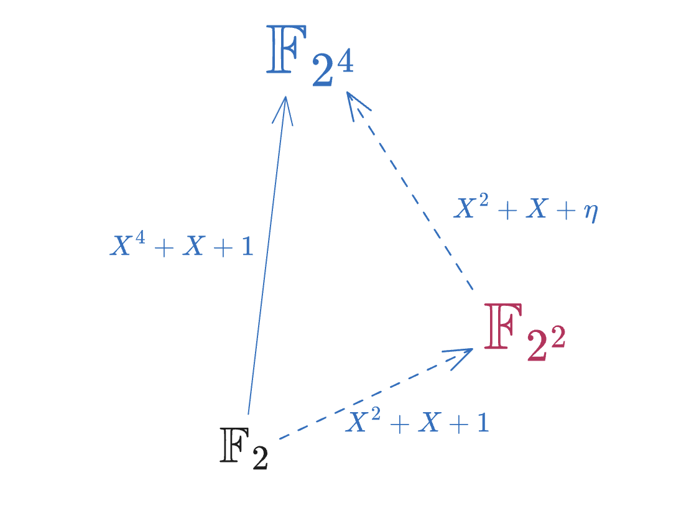
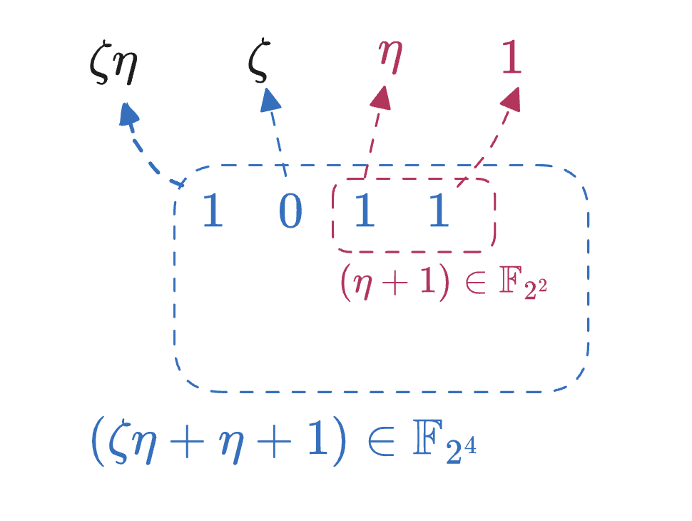

# Notes on FRI-Binius (Part I): Binary Towers

- Yu Guo <yu.guo@secbit.io>
- Jade Xie <jade@secbit.io>

二进制域拥有优美的内部结构，而 Binius 是意图充分利用这些内部结构，构造高效的 SNARK 证明系统。本文主要讨论 Binius 底层所依赖的 Binary Fields 以及 基于 Binary Fields 的 Extension Tower 的构造方法。Binary Fields 提供了更小的 Fields，并且兼容传统密码学中的各种工具构造，同时也可以充分利用硬件上的特殊指令的优化。选用 Extension Tower 优点主要有两个，一个是递归的 Extension 构造提供了一致的、增量式的 Basis 选择，从而使得 Small Field 可以以非常自然的方式嵌入到一个 Large Field 中，另一个优点是乘法和求逆运算存在高效的递归算法。

## Extension Fields

我们尝试用简单的语言来描述下 Extension Field 的概念，为后续我们研究 Binary Tower 做铺垫，深入学习请参考有限域教科书中的严格定义和证明。

素数域 $\mathbb{F}_{p}$ 是有 $p$ 个元素的有限域，其中 $p$ 必定是一个素数。它同构于 $\mathbb{Z}/p\mathbb{Z}$ ，也就是说我们可以用整数集合 $\{0, 1, \ldots, p-1\}$ 来表示 $\mathbb{F}_p$ 的全体元素。

我们可以把素数域的任意两个元素组成一个 Tuple，即 $(a, b)\in\mathbb{F}_{p}^2$，那么这个 Tuple 也构成了一个域，其元素数量为 $p^2$。我们可以检验一下， $a+b\in\mathbb{F}_p$，那么我们定义 Tuple 的加法如下：

$$
(a_1, b_1) + (a_2, b_2) = (a_1 + a_2, b_1 + b_2)
$$

可以验证， $\mathbb{F}_{p}^2$ 构成了一个向量空间， 因此它是一个加法群，其中零元素为 $(0, 0)$ 。接下来是怎么定义乘法的问题，我们希望乘法可以封闭，即：

$$
(a_1, b_1)\cdot (a_2, b_2) = (c, d)
$$

一种最简单的做法是采用 Entry-wise Mulplication 来定义乘法，即 $(a_1, b_1)\cdot (a_2, b_2) = (a_1a_2, b_1b_2)$，并且乘法单位元为 $(1, 1)$，貌似这样我们构造可以让乘法封闭。但是这并不能保证每一个元素都有逆元素。例如 $(1, 0)$，它乘上任何 Tuple 都不能得到 $(1, 1)$，因为 Tuple 的第二个部分怎么计算都是 $0$。因此，这样的乘法无法构成一个「域」。

在有限域理论中，Tuple 的乘法运算是通过多项式模乘来实现的。也就是我们把 $(a_1, b_1)$ 看成是一个 Degree 为 1 的多项式的系数，同样 $(a_2, b_2)$ 也可以看成是一个 Degree 为 1 的多项式的系数，通过两者相乘，我们得到一个 Degree 为 2 的多项式：

$$
(a_1 + b_1\cdot X) \cdot (a_2 + b_2\cdot X) = a_1a_2 + (a_1b_2 + a_2b_1)X + b_1b_2X^2
$$

然后我们再把结果多项式模掉一个 Degree 为 2 的不可约的多项式 $f(X)$，得到一个余数多项式，这个余数多项式的系数即是 $(c, d)$。那么我们定义新的 Tuple 乘法如下：

$$
(a_1 + b_1\cdot X) \cdot (a_2 + b_2\cdot X) = c + d\cdot X \mod f(X)
$$

并且定义 $(1, 0)$ 为乘法单位元。这里我们强调 $f(X)$ 必须是一个不可约多项式。那么假如 $f(X)$ 是一个可约多项式，会有什么后果？比如 $f(X)=(u_1+u_2X)(v_1+v_2X)$，那么 $(u_1, u_2)$ 和 $(v_1, v_2)$ 这两个非零元素的乘积等于 $(0, 0)$，跳出了乘法群。严格的说，Zero Divisor 的出现破坏了乘法群的结构，从而无法构成一个「域」。

接下来的问题是，是否存在一个不可约的 Degree 为 2 的多项式 $f(X)$。如果不存在 $f(X)$ ，那么构造一个 $\mathbb{F}_{p^2}$ 的域也就无从谈起。对于素数域 $\mathbb{F}_p$，任取 $w\in\mathbb{F}_p$，它不是任何元素的平方，数论中它属于非二次剩余类，即 $w\in QNR(p)$ 。如果 $w$ 存在，那么 $f(X)=X^2-w$ 就是一个不可约多项式。进一步，$w$ 的存在性如何保证？如果 $p$ 是一个奇数，那么 $w$ 必然存在。如果 $p=2$，虽然 $w$ 不存在，但我们可以指定 $f(X)=X^2+X+1\in\mathbb{F}_2[X]$ 作为一个不可约多项式。

我们现在把 $\mathbb{F}_{p}^2$ 这个 Tuple 构成的集合，连同定义的加法和乘法运算，构成的域记为 $\mathbb{F}_{p^2}$ ，元素个数为 $p^2$。根据有限域理论，我们可以把二元 Tuple 扩大到 $n$ 元 Tuple，从而可以构成更大的有限域 $\mathbb{F}_{p^n}$。

对于某个 $\mathbb{F}_p$ 上的不可约多项式 $f(X) = c_0 + c_1X + X^2$ ，它在 $\mathbb{F}_{p^2}$ 中一定可以被分解。$f(X) = (X-\alpha)(X-\alpha')$ ，其中 $\alpha$ 和 $\alpha'$ 互为共轭（Conjugate），并且它们都属于  $\mathbb{F}_{p^2}$，但不属于 $\mathbb{F}_p$ 。按照扩张域的定义，$\mathbb{F}_p(\alpha)$ 是一个 Degree 为 2 的代数扩张，它与前面我们通过不可约多项式的模乘构造的有限域同构。因此，我们也可以用 $a_1 + a_2\cdot\alpha$ 来表示 $\mathbb{F}_{p^2}$ 中的任意一个元素。或者进一步，我们可以把 $(1, \alpha)$ 看成是 $\mathbb{F}_{p^2}$ 向量空间的一组 Basis，任意一个 $a\in \mathbb{F}_{p^2}$ ，都可以表示为 Basis 的线性组合：

$$
a = a_0 \cdot 1 + a_1 \cdot \alpha, \quad a_0, a_1\in\mathbb{F}_p
$$

这样一来，我们就可以用符号 $a_0 + a_1\cdot \alpha$ 来表示 $\mathbb{F}_{p^2}$ 中的元素，而非 $a_0 + a_1\cdot X$ 这样的多项式表示。元素的「多项式表示」并没有指定我们到底采用了哪个不可约多项式来构造的扩张域，而采用 $\alpha$ 这个不不可约多项式的根作为构建扩张域的方式，则不存在二义性。

把这个概念推广到 $\mathbb{F}_{p^n}$，对于任意一个元素 $a\in\mathbb{F}_{p^n}$，都可以表示为：

$$
a = a_0 + a_1\cdot\alpha + a_2\cdot\alpha^2 + \cdots + a_{n-1}\cdot\alpha^{n-1}
$$

这里 $\alpha$ 是 $n$ 次不可约多项式 $f(X)$ 的根。因此 $(1, \alpha, \alpha^2, \cdots, \alpha^{n-1})$ 可以看成是 $\mathbb{F}_{p^n}$ 的一组 Basis，这个 Basis 被称为有限域的 Polynomial Basis。注意 $\mathbb{F}_{p^n}$ 作为一个 $n$ 维的向量空间，它有很多很多个不同的 Basis。后续我们将看到 Basis 选择是一个非常重要的步骤，恰当的 Basis 可以大大优化或简化一些表示或运算。

> TODO: Fp* 乘法循环群
> 

## Binary Field 

对于 $\mathbb{F}_{2^n}$ ，我们称之为二进制域，因为它的元素都可以表达为由 $0$ 和 $1$ 组成的长度为 $n$ 的向量。构造 $\mathbb{F}_{2^n}$ 可以通过两类方法构造，一种是通过 $n$ 次的不可约多项式；另一种是反复使用二次扩张的方法，被称为 Extension Tower。域扩张的路径非常多，对于 $2^n$ ，它有多个 2 因子，因此存在多种介于两种方法之间的构造方式，比如对于 $\mathbb{F}_{2^8}$，可以先构造 $\mathbb{F}_{2^4}$，再通过二次扩张得到 $\mathbb{F}_{2^8}$，也可以先构造 $\mathbb{F}_{2^2}$，再通过四次不可约多项式进行扩张，构造 $\mathbb{F}_{2^8}$。

我们先热身下，利用二次扩张的方法构造 $\mathbb{F}_{2^2}$。前面我们讨论过 $f(X)=X^2+X+1$ 是一个 $\mathbb{F}_2[X]$ 的不可约多项式，假设 $\eta$ 是 $f(X)$ 的一个根，那么 $\mathbb{F}_{2^2}$ 可以表示为 $a_0 + b_0\cdot\eta$。考虑到 $\mathbb{F}_{2^2}$ 只有四个元素，可以列在下面

$$
\mathbb{F}_{2^2} = \{0, 1, \eta, \eta+1\}
$$

并且 $\eta$ 作为生成元可以产生乘法群 $\mathbb{F}_{2^2}^*=\langle \eta \rangle$，它的 Order 为 3:

$$
\begin{split}
\eta^0 &= 1 \\
\eta^1 &= \eta \\
\eta^2 &= \eta+1 \\
\end{split}
$$

我们演示下 $\mathbb{F}_{2^4}$ 的两种构造方式。第一种是直接采用一个 4 次 $\mathbb{F}_2$ 上的不可约多项式。其实总共有 3 个不同的 4 次不可约多项式，因此总共有 3 种不同的构造方式。

$$
\begin{split}
f_1(X) &= X^4 + X + 1 \\
f_2(X) &= X^4 + X^3 + 1 \\
f_3(X) &= X^4 + X^3 + X^2 + X + 1 \\
\end{split}
$$

因为只需要选择一个不可约多项式即可，那我们就选择 $f_1(X)$ 来定义 $\mathbb{F}_{2^4}$ ：

$$
\mathbb{F}_{2^4} = \mathbb{F}_2[X]/\langle f_1(X)\rangle 
$$

我们把 $f_1(X)$ 在 $\mathbb{F}_{2^4}$ 上的根记为 $\theta$，那么 $a\in\mathbb{F}_{2^4}$ 元素可以唯一地表示为：

$$
a = a_0 + a_1\cdot\theta + a_2\cdot\theta^2 + \cdots + a_{n-1}\cdot\theta^{n-1}
$$

这里补充一下，$f_1(X)$ 同时还是一个 Primitive 多项式，它的根 $\theta$ 同时也是 $\mathbb{F}_{2^4}$ 的一个 Primitive Element。注意并不是所有的不可约多项式都是 Primitive 多项式，例如上面列出的 $f_3(X)$ 就不是一个 Primitive 多项式。

下面我们可以列出 $\mathbb{F}_{2^4}$ 中的所有元素，每一个元素对应一个 4bit 的二进制向量：

$$
\begin{array}{ccccccc}
0000 & 0001 & 0010 & 0011 & 0100 & 0101 & 0110 & 0111 \\
0 & 1 & \theta & \theta+1 & \theta^2 & \theta^2+1 & \theta^2+\theta & \theta^2+\theta+1 \\
\hline
1000 & 1001 & 1010 & 1011 & 1100 & 1101 & 1110 & 1111 \\
\theta^3 & \theta^3+1 & \theta^3+\theta & \theta^3+\theta+1 & \theta^3+\theta^2 & \theta^3+\theta^2+1 & \theta^3+\theta^2+\theta & \theta^3+\theta^2+\theta+1 \\
\end{array}
$$

对于 $\mathbb{F}_{2^4}$ 中两个元素的加法，我们只需要把它们的二进制表示按位相加即可，例如：

$$
(0101) + (1111) = (1010)
$$

这个运算实际上就是 XOR 按位异或运算。而对于乘法，比如 $a\cdot\theta$，则对应于二进制上的移位运算：

$$
\begin{split}
(0101) << 1 &= (1010)\\
(\theta^2 + 1)\cdot\theta &= \theta^3 + \theta \\
\end{split}
$$

如果继续乘以 $\theta$，就会出现移位溢出的情况，

$$
\begin{split}
(\theta^3 + \theta)\cdot\theta &= {\color{blue}\theta^4} + \theta^2 = \theta^2 + \theta + 1 \\
(1010) << 1  &= (0100) + (0011) = (0111)\\
\end{split}
$$

对于溢出位，则需要补加上 $0011$，这是由不可约多项式 $f_1(X)$ 的定义决定的， $\theta^4=\theta+1$。所以一旦高位的 bit 移位溢出，就需要做一个与 $0011$ 的 XOR 运算。由此，我们看到 $\mathbb{F}_{2^4}$ 的乘法运算规则实际上取决于不可约多项式的选择。所以说，如何选择合适的不可约多项式也是二进制域乘法优化的关键步骤。

## Field Embedding

如果我们要基于二进制域的构造 SNARK 证明系统，我们会将较小的数字用小位数来表示，但是不管怎么样，在协议的挑战轮，Verifier 都要给出一个在较大的扩张域中的随机数，以期望达到足够的密码学安全强度。这就需要我们在小域中用多项式编码 witness 信息，但在一个较大的域中对这些多项式进行取值运算。那么，我们需要找到一种办法把小域 $K$ 「嵌入」到大域 $L$ 中。

所谓的嵌入（Embedding），指的是把一个域 $K$ 中的元素映射到另一个域 $L$ 中，记为 $\phi: K\to L$。这个映射是 Injective 的，并且这个同态映射保持了加法和乘法运算的结构：

$$
\begin{split}
\phi(a+b) &= \phi(a) + \phi(b) \\
\phi(a\cdot b) &= \phi(a)\cdot\phi(b)
\end{split}
$$

即如果 $a\in K$，那么 $a$ 在 $L$ 中也有唯一的表示。为了保持乘法运算的结构，那么其实我们只要能找到一个 K 中的 Primitive Element $\alpha$ 对应到 $L$ 中的某个元素 $\beta$，那么这个同态映射就唯一确定了，因为 $K$ 中的任意一个元素都可以表示为 $\alpha$ 的幂次。不过，通常这个嵌入的同态映射并不是一个轻而易举可以找到。我们以 $\mathbb{F}_{2^2}\subset\mathbb{F}_{2^4}$ 为例，看看如何找到前者嵌入到后者的映射。

因为 $\eta$ 是 $\mathbb{F}_{2^2}$ 中的一个 Primitive Element，所以我们只要考虑 $\eta$ 在 $\mathbb{F}_{2^4}$ 中的表示即可。

我们先看看 $\mathbb{F}_{2^4}$ 中的 Primitive Element $\theta$ ，是否 $\eta\mapsto\theta$ 是一个嵌入映射？

$$
\eta^2 = \eta+1 \quad \text{but} \quad \theta^2 \neq \theta+1
$$

很显然，$\eta^2 \neq \theta^2$，所以 $\eta\mapsto\theta$ 不是一个嵌入映射。联想到不可约多项式决定了元素间乘法的关系，而因为 $\eta$ 是 $X^2+X+1$ 的根，而 $\theta$ 是 $X^4+X+1$ 的根，所以 $\eta$ 和 $\theta$ 的乘法关系肯定不一样。在 $\mathbb{F}_{2^4}$ 中，也存在 $X^2+X+1$ 的两个根，分别为 $\theta^2+\theta$ 和 $\theta^2+\theta+1$，读者可以验证下面的等式：

$$
(\theta^2+\theta)^2 + (\theta^2+\theta) + 1 = \theta^4 + \theta^2 + \theta^2 + \theta + 1 = 0
$$

那么，我们就定义嵌入映射：

$$
\begin{split}
\phi &: \mathbb{F}_{2^2} \to \mathbb{F}_{2^4},\quad \eta \mapsto \theta^2+\theta
\end{split}
$$

这就意味着二进制 $(10)$ 对应于 $L=\mathbb{F}_{2^4}$ 中的 $(0110)$ ；而二进制 $(11)$ （也就是 $\eta+1$）对应于 $L$ 中的 $(\theta^2+\theta+1)$，即 $(0111)$ 。这里要注意，我们也可以用 $\phi': \eta \mapsto \theta^2+\theta+1$ 作为另一个不同的嵌入映射，其内在原理是 $\theta^2+\theta$ 和 $\theta^2+\theta+1$ 互为共轭，它们是完美对称的，因此这两种映射都可以作为嵌入映射，除了映射到不同元素上，从整体结构上并且没有明显区别。

而对于任意的 $[L:K]=n$ 而言，我们将 $K$ 嵌入到 $L$，一个直接的方法就是找 $f(X)$ $L$ 中 的根，当然这个计算并不简单。并且嵌入和反嵌入都需要额外的计算，这无疑增加了系统的复杂性。

而 Binius 论文提到的采用递归式 Extension Tower 的构造方法，通过选取合适的不可约多项式和 Basis，我们就可以得到非常直接（称为 Zero-cost）的嵌入和反嵌入映射。

## Extension Tower

我们可以通过两次的二次扩张来构造 $\mathbb{F}_{2^4}$，首先我们选择一个二次不可约多项式 $f(X)=X^2+X+1$，那么我们可以构造 $\mathbb{F}_{2^2}$，然后基于 $\mathbb{F}_{2^2}$ 再找到一个二次不可约多项式，从而构造 $\mathbb{F}_{2^4}$。

$$
\mathbb{F}_{2^2} = \mathbb{F}_2[X]/\langle X^2+X+1 \rangle \cong\mathbb{F}_2(\eta)
$$

接下我们要找到 $\mathbb{F}_{2^2}[X]$ 中的一个二次不可约多项式。首先注意，$X^2+X+1$ 已经不能使用，根据 $\mathbb{F}_{2^2}$ 的定义，它已经可以被分解。再考虑下 $X^2+1$，它也可以被分解 $(X+1)(X+1)$， 事实上所有的 $\mathbb{F}_2[X]$ 的二次多项式都可以被分解。而一个$\mathbb{F}_{2^2}[X]$ 中的二次不可约多项式，其系数中必然包含一个带有新元素 $\eta$ 的项。

比如 $X^2+X+\eta$ 就是一个 $\mathbb{F}_{2^2}$ 上的二次不可约多项式。那么我们可以构造 $\mathbb{F}_{2^4}$：

$$
\mathbb{F}_{2^4} = \mathbb{F}_{2^2}[X]/\langle X^2+X+\eta \rangle 
$$

我们把 $X^2+X+\eta$ 在 $\mathbb{F}_{2^4}$ 中的根记为 $\zeta$，那么 $\mathbb{F}_{2^4}$ 可以表示为：

$$
\mathbb{F}_{2^4} \cong \mathbb{F}_{2^2}(\zeta)  \cong \mathbb{F}_2(\eta)(\zeta) \cong \mathbb{F}_2(\eta, \zeta)
$$

那么 $\mathbb{F}_{2^4}$ 的全部元素可以用 $\eta, \zeta$ 来表示：

$$
\begin{array}{ccccccc}
\hline
0000 & 0001 & 0010 & 0011 & 0100 & 0101 & 0110 & 0111 \\
0 & 1 & \eta & \eta+1 & \zeta & \zeta+\eta & \zeta+\eta+1 & \zeta+\eta+1 \\
\hline
1000 & 1001 & 1010 & 1011 & 1100 & 1101 & 1110 & 1111 \\
\zeta\eta & \zeta\eta + 1 & \zeta\eta + \eta & \zeta\eta + \eta + 1 & \zeta\eta + \zeta & \zeta\eta + \zeta +1 & \zeta\eta+\zeta+\eta & \zeta\eta+\zeta+\eta+1 \\
\hline
\end{array}
$$

这时，4bit 二进制中的每一个 bit 都对应于 $\mathbb{F}_{2^4}$ 中的一个元素，$(1000)$ 对应 $\zeta\eta$，$(0100)$ 对应 $\zeta$，$(0010)$ 对应 $\eta$，$(0001)$ 对应 $1$。因此我们可以用下面的 Basis 来表示 $\mathbb{F}_{2^4}$ 中的所有元素：

$$
\mathcal{B} = (1,\ \eta,\ \zeta,\ \eta\zeta)
$$

这时候，$\mathbb{F}_{2^2}$ 的二进制表示直接对应于 $\mathbb{F}_{2^4}$ 二进制表示的「低两位」，例如：

$$
\begin{split}
(1010) &= (10) || (10) = \zeta\eta + \eta \\
\end{split}
$$

因此，我们可以直接在 $\mathbb{F}_{2^2}$ 的二进制表示的高两位补零，即可以得到 $\mathbb{F}_{2^4}$ 的对应元素。反之，只要把高位两个零去除，一个 $\mathbb{F}_{2^4}$ 中的元素直接映射回 $\mathbb{F}_{2^2}$ 中的元素。

如上图所示，$(1011)$ 是 $\zeta\eta+\eta+1$ 的二进制表示，它的低两位 $(11)$ 直接对应于 $\mathbb{F}_{2^2}$ 中的 $(\eta+1)$ 。这种嵌入是一种「自然嵌入」，因此 Binus 论文称之为 Zero-cost Embedding。

不过 $\mathbb{F}_{2^4}$ 还是一个很小的域，不够用，如果继续往上进行二次扩张，怎么能找到合适的不可约多项式呢？方案并不唯一，我们先看看 Binius 论文 [DP23] 中给出的一个方案 —— Wiedemann Tower [Wie88]。

## Wiedemann Tower

Wiedemann Tower 是一个基于 $\mathbb{F}_2$ 的递归扩张塔。最底部的 Base Field 记为 $\mathcal{T}_0$，其元素仅为 $0$ 和 $1$：

$$
\mathcal{T}_0 = \mathbb{F}_2 \cong \{0,1\}
$$

然后我们引入一个未知数 $X_0$，构造一个一元多项式环 $\mathbb{F}_2[X_0]$ 。如前所讨论，$X^2 + X + 1$ 是一个 $\mathcal{T}_0$ 上的不可约多项式，因此，我们可以用它来构造 $\mathcal{T}_1$。

$$
\mathcal{T}_1 = \mathbb{F}_2[X_0]/\langle  X_0^2+X_0+1 \rangle = \{0, 1, X_0, X_0+1\} \cong \mathbb{F}_{2^2} \cong \mathbb{F}_2(\alpha_0)
$$

接下来，我们找到一个 $\mathcal{T}_1[X_1]$ 中的二次不可约多项式 $X_1^2+\alpha_0\cdot X_1+1$，那么我们可以构造 $\mathcal{T}_2$：

$$
\mathcal{T}_2 = \mathcal{T}_1[X_1]/\langle  X_1^2+ \alpha_0\cdot X_1+1\rangle \cong \mathbb{F}_{2^4} \cong \mathbb{F}_2(\alpha_0, \alpha_1)
$$

依次类推，我们可以构造出 $\mathcal{T}_3, \mathcal{T}_4, \cdots, \mathcal{T}_n$ ：

$$
\mathcal{T}_{i+1} = \mathcal{T}_i[X_i]/\langle  X_i^2+\alpha_{i-1}\cdot X_i+1\rangle \cong \mathbb{F}_{2^{2^i}} \cong \mathbb{F}_2(\alpha_0, \alpha_1, \ldots, \alpha_i),\quad i\geq 1
$$

这里，$\alpha_0, \alpha_1, \ldots, \alpha_{n-1}$ 是依次引入的二次不可约多项式的根，使得：

$$
\mathcal{T}_{n} = \mathbb{F}_2(\alpha_0, \alpha_1, \ldots, \alpha_{n-1})
$$

而 $|\mathcal{T}_{n}| = 2^{2^{n}}$。这些引入的根之间的关系满足下面的等式：

$$
\alpha_{i+1} + \alpha^{-1}_{i+1} = \alpha_i
$$

不难检验，$\alpha_0+\alpha^{-1}_0=1$。并且多元多项式环 $\mathcal{T}_0[X_0, X_1, \ldots, X_n]$ 中的多项式 $X_i^2+X_{i-1}X_i+1$ 的两个根为 $\alpha_i$ 和 $\alpha^{-1}_i$ ：

$$
(\alpha^{-1}_i)^2 + \alpha_{i-1}\alpha^{-1}_i + 1 = \alpha^{-1}_i + \alpha_{i-1} + \alpha_i = \alpha_{i-1} + \alpha_{i-1} = 0
$$

并且，$\alpha_i$ 和 $\alpha_{i+1}$ 满足下面的递推关系：

$$
\alpha_{i+1} + \alpha^{-1}_{i+1} = \alpha_i
$$

这是因为等式两边都乘以 $\alpha_{i+1}$ 就会得到：$\alpha_{i+1}^2 + \alpha_i\alpha_{i+1} + 1 = 0$ ，这正是我们递归构造二次扩张的不可约多项式。

### Multilinear Basis 

对于 $\mathcal{T}_{i+1}$ over $\mathbb{F}_2$，构成了一个关于 $\mathbb{F}_2$ 的 $n+1$ 维向量空间。我们可以使用 这些不可约多项式的根来构造 Multilinear Basis：

$$
\begin{split}
\mathcal{B}_{i+1} &= (1, \alpha_0)\otimes (1, \alpha_1) \otimes \cdots \otimes (1,\alpha_i)  \\
& = (1, \alpha_0, \alpha_1, \alpha_0\alpha_1, \alpha_2,\ \ldots,\ \alpha_0\alpha_1\cdots \alpha_i)
\end{split}
$$

这与我们前面讨论过的，使用 $(1, \eta, \zeta, \zeta\eta)$ 作为 $\mathbb{F}_{2}(\eta, \zeta)$ 的 Basis 是一致的。我们可以快速地验证下，首先 $(1, \alpha_0)$ 是 $\mathcal{T}_1$ 的 Basis，因为 $\mathcal{T}_1$ 的每一个元素都可以表示为

$$
a_0 + b_0\cdot \alpha_0,  \quad a_0, b_0\in\mathcal{T}_0
$$

当 $\mathcal{T}_1$ 通过 $\alpha_1$ 扩张到 $\mathcal{T}_2$ 后，$\mathcal{T}_2$ 的元素都可以表示为：

$$
a_1 + b_1\cdot \alpha_1,  \quad a_1, b_1\in\mathcal{T}_1
$$

代入 $a_1=a_0+b_0\cdot \alpha_0$，$b_1=a_0'+b_0'\cdot \alpha_1$，于是有：

$$
\begin{split}
a_1 + b_1\cdot \alpha_1 &= (a_0+b_0\cdot \alpha_0) + (a'_0+b'_0\cdot \alpha_0)\cdot \alpha_1 \\
 &= a_0 + b_0\alpha_0 + a'_0\cdot\alpha_1+ b_0'\cdot \alpha_0\alpha_1
\end{split}
$$

于是，$(1, \alpha_0, \alpha_1, \alpha_0\alpha_1)$ 就构成了 $\mathcal{T}_2$ 的 Basis。依次类推，$(1, \alpha_0, \alpha_1, \alpha_0\alpha_1, \alpha_2, \alpha_0\alpha_2, \alpha_1\alpha_2, \alpha_0\alpha_1\alpha_2)$ 是 $\mathcal{T}_3$ 的 Basis。最后，$\mathcal{B}_{n}$ 正是 $\mathcal{T}_{n}$ 的 Basis。

### 寻找 Primitive element

前面我们讨论过 $\alpha_i$ 和 $\alpha^{-1}_{i}$ 互为共轭根，由 Galois 理论，

$$
\alpha_{i}^{2^{2^n}} = \alpha^{-1}_{i} 
$$

那么 $\alpha_i$ 都满足下面的性质：

$$
\alpha_i^{F_i} = 1
$$

这里 $F_n$ 代表费马数（Fermat Number），$F_n=2^{2^n}+1$。一个著名的定理是 $\mathsf{gcd}(F_i, F_j) = 1,  i\neq j$，即任意的两个不同的费马数互质，因此 

$$
\mathsf{ord}(\alpha_0\alpha_1\cdots \alpha_i) = \mathsf{ord}(\alpha_0)\mathsf{ord}(\alpha_1)\cdots\mathsf{ord}(\alpha_i) 
$$

因此，如果费马数 $F_i$ 为素数，那么很显然 $\mathsf{ord}(\alpha_i)=F_i$。目前我们已知 $i\leq 4$ 的情况下， $F_i$ 都是素数，那么

$$
\begin{split}
\mathsf{ord}(\alpha_0\cdot \alpha_1\cdot \cdots \cdot \alpha_i) &= \mathsf{ord}(\alpha_0)\cdot \mathsf{ord}(\alpha_1)\cdot \cdots \cdot \mathsf{ord}(\alpha_n) \\
& = F_0\cdot F_1\cdot \cdots \cdot F_i = 2^{2^{i+1}} - 1 \\
& = |\mathcal{T}_{n+1}| -1
\end{split}
$$

如果 $\alpha_0\cdots \alpha_i, i\leq 4$，那么根据有限域的性质，它是 $\mathcal{T}_{n+1}$ 的一个 Primitive Element。

另外，通过计算机程序检查验证，对于 $5\leq i \leq 8$ 的情况，$\alpha_i$ 的 Order 仍然等于 $F_i$。这个 $\alpha_0\cdots \alpha_8$ 是有限域 $\mathbb{F}_{2^{512}}$的大小已经能满足类似 Binius 证明系统的需求。但在数学上，是否所有的 $\alpha_i$ 都满足这个性质？这个似乎还是个未解问题 [Wie88]。

## 乘法优化

采用 Extension Tower 的另一个显著的优点是乘法运算的优化。

第一种优化是 "Small-by-large Multiplication"，即 $a\in\mathcal{T}_\iota$ 与 $b\in\mathcal{T}_{\iota+\kappa}$ 两个数的乘法运算。因为 $b$ 可以分解为 $2^\kappa$ 个 $\mathcal{T}_\iota$ 元素，因此这个乘法运算等价于 $2^\kappa$ 次 $\mathcal{T}_\iota$ 上的乘法运算。

$$
a \cdot (b_0, b_1, \cdots, b_{2^\kappa-1}) = (a\cdot b_0, a\cdot b_1, \cdots, a\cdot b_{\kappa-1})
$$

即使对于同一个域上的两个元素的乘法，也同样有优化手段。假设 $a, b\in\mathcal{T}_{i+1}$，那么根据 Tower 构造的定义，可以分别表示为 $a_0 + a_1\cdot\alpha_i$ 与 $b_0 + b_1\cdot \alpha_i$ ，那么它们的乘法可以推导如下：

$$
\begin{split}
a\cdot b  & = (a_0 + a_1\cdot\alpha_i)\cdot (b_0 + b_1\cdot\alpha_i) \\
 &= a_0b_0 + (a_0b_1+a_1b_0)\cdot\alpha_i + a_1b_1\cdot\alpha_i^2 \\
& = a_0b_0 + (a_0b_1+a_1b_0)\cdot\alpha_i + a_1b_1\cdot(\alpha_{i-1}\alpha_i+1) \\
& = a_0b_0  + a_1b_1 + (a_0b_1 + a_1b_0 + a_1b_1\cdot\alpha_{i-1})\cdot\alpha_i \\
& = a_0b_0  + a_1b_1 + \big((a_0+a_1)(b_0+b_1) - a_0b_0 - a_1b_1) + a_1b_1\cdot\alpha_{i-1}\big)\cdot\alpha_i
\end{split}
$$

注意上面等式的右边，我们只需要计算三个 $\mathcal{T}_{i}$ 上的乘法，分别为 $A=a_0b_0$， $B=(a_0+a_1)(b_0+b_1)$ 与 $C=a_1b_1$，然后上面的公式可以转换为：

$$
a\cdot b = (A + C) + (B-A-C+C\cdot \alpha_{i-1})\cdot\alpha_i 
$$

其中还漏了一个 $C\cdot \alpha_{i-1}$，这是一个常数乘法，因为 $\alpha_{i-1}\in\mathcal{T}_{i}$ 是一个常数。这个常数乘法可以被归约到一个 $\mathcal{T}_{i-1}$ 上的常数乘法运算，如下所示：

$$
\begin{split}
C\cdot \alpha_{i-1} &= (c_0 + c_1\alpha_{i-1})\cdot \alpha_{i-1} \\
& = c_0\cdot \alpha_{i-1} + c_1\cdot \alpha_{i-1}^2 \\
& = c_0\cdot \alpha_{i-1} + c_1\cdot (\alpha_{i-2}\cdot \alpha_{i-1} + 1) \\
& = c_1 + (c_0 + {\color{blue}c_1\cdot \alpha_{i-2}})\cdot \alpha_{i-1}
\end{split}
$$

其中蓝色部分表达式，${\color{blue}c_1\cdot \alpha_{i-2}}$ 为需要递归计算的 $\mathcal{T}_{i-2}$ 上的常数乘法运算。全部递归过程只需要计算若干次加法即可完成。

再回头看看 $a\cdot b$ 的运算，我们也可以构造一个 Karatsuba 风格的递归算法，每一层递归只需要完成三次乘法运算，比不优化的四次乘法运算少一次。综合起来，优化效果会非常明显。

进一步，$\mathcal{T}_{i}$ 上的乘法逆运算也可以被大大优化 [FP97]。考虑 $a, b\in\mathcal{T}_{i+1}$，满足 $a\cdot b=1$，展开 $a$ 和 $b$ 的表达式：

$$
\begin{split}
a\cdot b &= (a_0 + a_1\cdot\alpha_i)\cdot (b_0 + b_1\cdot\alpha_i) \\
& = a_0b_0  + a_1b_1 + \big((a_0+a_1)(b_0+b_1) - a_0b_0 - a_1b_1) + a_1b_1\cdot\alpha_{i-1}\big)\cdot\alpha_i\\
&= 1\\
\end{split}
$$

我们可以计算得到 $b_0, b_1$ 的表达式：

$$
\begin{split}
b_0 &= \frac{a_0 + a_1\alpha_{i-1}}{a_0(a_0 + a_1\alpha_{i-1}) + a_1^2}  \\[2ex]
b_1 &= \frac{a_1}{a_0(a_0 + a_1\alpha_{i-1}) + a_1^2} \\
\end{split}
$$

所以，$b_0$ 和 $b_1$ 的计算包括：一次求逆运算，三次乘法，两次加法，一次常数乘法，还有一次平方运算。

$$
\begin{split}
d_0 &= \alpha_{i-1}a_1\\
d_1 &= a_0 + d_0 \\
d_2 &= a_0 \cdot d_1 \\
d_3 &= a_1^2   \\
d_4 &= d_2 + d_3 \\
d_5 &= 1/d_4 \\
b_0 & = d_1\cdot d_5\\
b_1 & = a_1 \cdot d_5\\
\end{split}
$$

其中 $d_5$ 的求逆运算可以沿着 Extension Tower 逐层递归，递归过程中的主要运算开销为三次乘法运算。还有 $d_3$ 的平方运算，它也可以递归地计算：

$$
\begin{split}
a_1^2 &= (e_0 + e_1\cdot\alpha_{i-1})^2 \\
& = e_0^2 + e_1^2\cdot\alpha_{i-1}^2 \\
& = e_0^2 + e_1^2\cdot(\alpha_{i-2}\alpha_{i-1} + 1) \\
& = (e_0^2 + e_1^2) + (e_1^2\alpha_{i-2})\cdot\alpha_{i-1}  \\
\end{split}
$$

详细的递归效率分析可以参考 [FP97]。总体上，这个计算复杂度和 Karatsuba 算法复杂度相当，从而很大程度上降低了求逆的算法复杂度。

## Artin-Schreier Tower (Conway Tower)

还有一种构造 Binary Tower 的方法，源自 Amil Artin 与 Otto Schreier 发表在 1927 年的论文中，也出现在 Conway 的 「On Numbers and Games」一书中。关于这个历史溯源与相关理论，请参考 [CHS24]。

对于任意的 $\mathbb{F}_{p^n}$，我们选择 $h(X_{i+1}) = X_{i+1}^p - X_{i+1} - \alpha_0\alpha_1\cdots \alpha_i$ 作为每一层 Tower 的不可约多项式。而 $\alpha_{i+1}$ 作为 $h(X_{i+1})=0$ 在上一层 Tower 上的根。这样 我们可以得到一个 Extension Tower：

$$
\mathbb{F}_2 \subset \mathbb{F}_{2^2}\cong\mathbb{F}_2(\alpha_0) \subset \mathbb{F}_{2^4}\cong\mathbb{F}_{2^2}(\alpha_1) \subset \mathbb{F}_{2^8}\cong\mathbb{F}_{2^4}(\alpha_2)
$$

而且 $(1, \alpha_0)\otimes(1, \alpha_1)\otimes\cdots \otimes (1, \alpha_n)$ 构成了 $\mathbb{F}_{2^{2^{i+1}}}$ 向量空间的 Basis。依照我们前面的讨论，这组 Basis 也支持 Zero-cost 的子域嵌入。这类的 Multilinear Basis 也被称为 Cantor Basis [Can89]。

## References

- [Wie88] Wiedemann, Doug. "An iterated quadratic extension of GF (2)." Fibonacci Quart 26.4 (1988): 290-295.
- [DP23] Diamond, Benjamin E., and Jim Posen. "Succinct arguments over towers of binary fields." Cryptology ePrint Archive (2023).
- [DP24] Diamond, Benjamin E., and Jim Posen. "Polylogarithmic Proofs for Multilinears over Binary Towers." Cryptology ePrint Archive (2024).
- [LN97] Lidl, Rudolf, and Harald Niederreiter. Finite fields. No. 20. Cambridge university press, 1997.
- [FP97] Fan, John L., and Christof Paar. "On efficient inversion in tower fields of characteristic two." Proceedings of IEEE International Symposium on Information Theory. IEEE, 1997.
- [CHS24] Cagliero, Leandro, Allen Herman, and Fernando Szechtman. "Artin-Schreier towers of finite fields." arXiv preprint arXiv:2405.10159 (2024).
- [Can89] David G. Cantor. On arithmetical algorithms over finite fields. J. Comb. Theory Ser. A, 50(2):285–300, March 1989.

