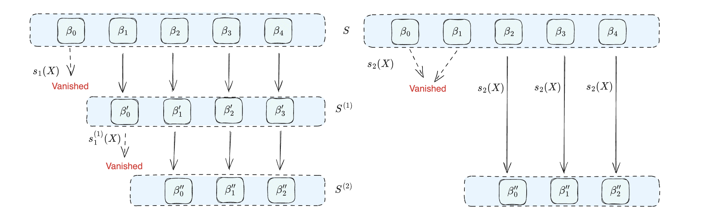

# Notes on Binius (Part II): Subspace Polynomial

- Yu Guo <yu.guo@secbit.io>
- Jade Xie <jade@secbit.io>

The FRI-Binus paper [DP24] discusses the Additive FFT algorithm based on Subspace Polynomial and provides a perspective to understand the Additive FFT algorithm based on Novel Polynomial Basis in [LCH14] using odd-even decomposition. This article directly introduces the Subspace Polynomial, and then introduces the Additive FFT algorithm from the perspective of odd-even decomposition. This article omits the definition of Normalized Subspace Polynomial for easier understanding. Normalization only affects the performance of the FFT algorithm and has no essential difference from the simplified algorithm introduced in this article.

Since the algebraic structure on which Additive FFT relies is very similar to Multiplicative FFT on prime fields, knowledge of Multiplicative FFT will help understand the content of this article.

## Linear Subspace Polynomial

We continue to explore the Extension Field $\mathbb{F}_{2^m}$ based on $\mathbb{F}_2$. Regardless of how $\mathbb{F}_{2^m}$ is constructed, all elements form a vector space, denoted as $V_m$, and there exists a Basis $(\beta_0, \beta_1, \ldots, \beta_{m-1})$ that spans this vector space, denoted as $V_m=\mathsf{Span}(\beta_0, \beta_1, \ldots, \beta_{m-1})$, or represented by the symbol $\langle \cdots \rangle$:

$$
V_m = \langle \beta_0, \beta_1, \ldots, \beta_{m-1} \rangle
$$

Thus, any element $ \theta\in\mathbb{F}_{2^m}$ can be written as a linear combination of Basis components:

$$
\theta = c_0\cdot \beta_0 + c_1\cdot \beta_1 + \ldots + c_{m-1}\cdot \beta_{m-1}, \text{ where $c_i\in \mathbb{F}_2$}
$$

At the same time, $V_m$ is also an additive group with the identity element $V_0=\{0\}$. If $V_k$ is a linear subspace of $V_m$, then $V_k$ is also an additive subgroup of $V_m$. For $V_k$, we can use a polynomial to encode all its elements, i.e., the root set of this polynomial exactly corresponds to the set of all elements of $V_k$. We denote this polynomial as $s_k(X)$. This polynomial is also called the "Subspace Polynomial":

$$
s_k(X) = \prod_{i=0}^{2^k-1}(X-\theta_i), \text{ where $\theta_i\in V_k$ }
$$

The polynomial $s_k(X)$ can also be seen as the Vanishing Polynomial on the Domain $V_k$, because for any $\theta\in V_k$, it satisfies:

$$
s_k(\theta) = 0
$$

### Linearized Polynomial

The Subspace polynomial introduced above is a so-called Linearized Polynomial because its definition satisfies the following form:

$$
L(X) = \sum_{i=0}^{n-1} c_i\cdot X^{q^i}, \quad c_i\in \mathbb{F}_{q}
$$

The polynomial $L(X)$ is called a Linearized Polynomial because each $L(X)$ corresponds to a linear operator on the extension field $K$ of $\mathbb{F}_{q}$. If all roots of $L(X)$ are in the extension field $K=\mathbb{F}_{q^s}$, then for all $\theta\in K$, we have $L(\theta)\in K$. Moreover, if $\theta\neq\theta'$, then $L(\theta)\neq L(\theta')$. Each $L(X)$ can be viewed as a matrix $B\in \mathbb{F}_q^{s\times s}$, completing a linear transformation on the vector space $\mathbb{F}^s_q$, such that:

$$
(c_0, c_1, \ldots, c_{s-1}) B = (d_0, d_1, \ldots, d_{s-1})
$$

For Subspace Polynomials, each $s_k(X)$ is a Linearized Polynomial. Conversely, for any Linearized polynomial $L(X)\in \mathbb{F}_{q^m}[X]$, all its roots form a linear subspace $V_n\subset V_m$. For detailed proof, please refer to [LN97].

### Linear Properties

Since each term of $s_k(X)$ is of the form $a_i\cdot X^{2^i}$, it has additive homomorphism:

$$
\begin{align*}
s_k(x + y) &= s_k(x) + s_k(y), &\quad \forall x, y \in \mathbb{F}_{2^m}\\
s_k(c\cdot x) &= c\cdot s_k(x), &\quad \forall x\in \mathbb{F}_{2^m}, \forall c\in \mathbb{F}_2
\end{align*}
$$

Let's try to prove the first equation simply. According to a common theorem in finite field theory (Freshman's dream):

$$
(x + y)^{2} = x^2 + 2xy + y^2 = x^{2} + y^{2}, \quad\text{where $x, y\in \mathbb{F}_{2^m}$}
$$

Obviously, $2xy=0$, because in binary fields, $2=0$. So the following equation also holds:

$$
(x + y)^{2^i} = x^{2^i} + y^{2^i}
$$

Next, let's verify the additive homomorphism of $s_k(X)$:

$$
s_k(x + y) = \sum_{i=0}^{k} a_i\cdot (x+y)^{2^i}  = \sum_{i=0}^{k} a_i\cdot \big(x^{2^i} + y^{2^i}\big) = s_k(x) + s_k(y)
$$

### Recursive Formula of Subspace Polynomial

For the subspace $V_k$, it can be split into two disjoint sets:

$$
V_k = V_{k-1} \cup (\beta_{k-1}+V_{k-1})
$$

Here $V_k=\langle \beta_0, \beta_1, \ldots, \beta_{k-1} \rangle$ , $V_{k-1}=\langle \beta_0, \beta_1, \ldots, \beta_{k-2} \rangle $ ,
then the subspace polynomials corresponding to $V_k$, $V_{k-1}$, $\beta_{k-1}+V_{k-1}$ satisfy the following relationship:

$$
s_k(X) = s_{k-1}(X) \cdot s_{k-1}(X+\beta_{k-1})
$$

Let's take a simple example, assuming $k=3$, $V_3=\langle \beta_0,\beta_1,\beta_2\rangle $ consists of two parts, one part is $V_2=\langle \beta_0,\beta_1\rangle $, the other part is each element in $V_2$ plus ${\color{blue}\beta_2}$. Therefore, the number of elements in $V_3$ is $2^2 + 2^2 = 8$. Here are all the elements of $V_3$:

$$
V_3 = \{0, \beta_0, \beta_1, \beta_0+\beta_1\} \cup \{{\color{blue}\beta_2}, \beta_0+{\color{blue}\beta_2}, \beta_1+{\color{blue}\beta_2}, (\beta_0+\beta_1)+{\color{blue}\beta_2}\}
$$

We can easily verify: $s_3(X) = s_{2}(X) \cdot s_{2}(X+\beta_{k-1})$. Of course, $s_{2}(X)$ can also be split into the product of $s_1(X)$ and $s_1(X+\beta_1)$. Let's try to break it down to the bottom:

$$
\begin{split}
s_3(X) & = s_2(X)\cdot s_2(X + \beta_2) \\
& = s_2(X)^2 + \beta_2\cdot s_2(X) \\
& = s_1(X)\cdot s_1(X + \beta_1)\cdot s_1(X)\cdot s_1(X + \beta_1) + \beta_2\cdot s_1(X)\cdot s_1(X + \beta_1) \\
& = (s_1(X)^2 + \beta_1\cdot s_1(X))^2 + \beta_2\cdot s_1(X)^2 + \beta_1\beta_2\cdot s_1(X) \\
& = s_1(X)^4 + \beta_1^2\cdot s_1(X)^2 + \beta_2\cdot s_1(X)^2 + \beta_1\beta_2\cdot s_1(X) \\
& = s_1(X)^4 + (\beta_1^2+\beta_2)\cdot s_1(X)^2 + \beta_1\beta_2\cdot s_1(X) \\
& = (X\cdot(X+\beta_0))^4 + (\beta_1^2+\beta_2)\cdot (X\cdot(X + \beta_0))^2 + \beta_1\beta_2\cdot (X\cdot(X + \beta_0)) \\
& = (X^2 + \beta_0\cdot X)^4 + (\beta_1^2+\beta_2)\cdot (X^2 + \beta_0\cdot X)^2 + \beta_1\beta_2\cdot (X^2 + \beta_0\cdot X) \\
& = X^8  + \beta_0^4X^4 + (\beta_1^2+\beta_2)X^4 + \beta_0^2(\beta_1^2+\beta_2)X^2 + \beta_1\beta_2X^2 + \beta_0\beta_1\beta_2X \\
\end{split}
$$

Finally, the expansion of $s_3(X)$ satisfies the pattern of $\sum_{i=0}^{k} a_i\cdot X^{2^i}$, which is consistent with our conclusion above.

## Homomorphic Mapping on Subspace

Because Subspace Polynomial is actually a kind of Vanishing Polynomial, and it also has additive homomorphism, we can use Subspace Polynomial to define homomorphic mapping between subspaces.

For example, for $V_3=\langle \beta_0, \beta_1, \beta_2\rangle$, we define the subspace $V_1=\{0, \beta_0\}$ of $V_3$ and its Subspace Polynomial $s_1(X)$

$$
s_1(X) = X\cdot (X+\beta_0)
$$

Obviously, $s_1(V_1)=\{0, 0\}$. If we apply $s_1(X)$ to $V_3$, we will get the following result:

$$
\begin{split}
s_1(0) &= 0\\
s_1(\beta_0) & = 0 \\
s_1(\beta_1) & = \beta_0\beta_1 + \beta_1^2\\
s_1(\beta_0+\beta_1) & = \beta_0\beta_1 + \beta_1^2\\
s_1(\beta_2) &= \beta_0\beta_2 + \beta_2^2\\
s_1(\beta_0+\beta_2) &= \beta_0\beta_2 + \beta_2^2\\
s_1(\beta_1+\beta_2) &= \beta_0\beta_1 + \beta_1^2 + \beta_0\beta_2 + \beta_2^2\\
s_1(\beta_0+\beta_1+\beta_2) &= \beta_0\beta_1 + \beta_1^2 + \beta_0\beta_2 + \beta_2^2\\
\end{split}
$$

The above equations show that $s_1(V_3)$ is mapped to a set that is only half the size of $V_3$, denoted as $V_2$. This set is also a subspace, $V_2= \langle \beta'_0, \beta'_1\rangle = \langle \beta_0\beta_1 + \beta_1^2, \beta_0\beta_2 + \beta_2^2 \rangle $, with dimension 2.

This is not a coincidence. According to the group isomorphism theorem, the Image $G$ of the homomorphic mapping $\phi: H \to G$ satisfies $G\cong H/Ker(\phi)$, where $G$ is a quotient group, and $|G| = |H|/|Ker(\phi)|$. In the above example, $s_1: V_3\to V_2$ is a homomorphic mapping, $V_1=Ker(s_1)$.

### Chain of Mappings

For $V_2 = s_1(V_3)$, we can still construct a Subspace Polynomial of Degree 2,

$$
s_1'(X) = X\cdot (X+\beta_0\beta_1 + \beta_1^2)
$$

We can continue to map $V_2$ to a one-dimensional subspace $V_1=\langle \beta''\rangle$. We only need to calculate $s_1(\beta'_0)$ and $s_1(\beta'_1)$, these Basis components constitute $V_2$:

$$
\begin{split}
s_1'(\beta_0\beta_1 + \beta_1^2) &= 0 \\
s_1'(\beta_0\beta_1 + \beta_1^2 + \beta_0\beta_2 + \beta_2^2)& = \beta_0^2\beta_1\beta_2 + \beta_0\beta_1^2\beta_2 + \beta_0^2\beta_2^2 + \beta_0\beta_1\beta_2^2 + \beta_1^2\beta_2^2 + \beta_2^4 \\
 & = \beta''
\end{split}
$$

Where the first component of the Basis $(\beta'_0, \beta'_1)$ of $V_2$ will be mapped to $0$, and the second component is mapped to $\beta''$.

So far, we have obtained a chain of mappings:

$$
V_3 \overset{s_1}{\longrightarrow} V_2 \overset{s'_1}{\longrightarrow} V_1
$$

Or it can be written as:

$$
\langle \beta_0, \beta_1, \beta_2 \rangle \overset{s_1}{\longrightarrow} \langle s_1(\beta_1), s_1(\beta_2) \rangle
\overset{s'_1}{\longrightarrow} \langle s'_1(s_1(\beta_2)) \rangle
$$

And each mapping reduces the dimension of the linear subspace by one, i.e., halves the size of the set. This algebraic structure is key to our subsequent construction of FFT and FRI protocols.

It's not hard to prove that for any linear subspace, as long as we choose a Basis, we can construct Subspace Polynomials of Degree 2 as mapping functions in sequence, then obtain a subspace with dimension reduced by 1 through mapping, and repeat this process until the subspace is reduced to 1 dimension. Of course, different choices of Basis and different choices of Subspace Polynomial will lead to different mapping chains. Choosing the appropriate mapping chain can significantly improve the efficiency of computation.

## Composition of ${s}_1$ Mappings

We define the initial subspace of the mapping chain as $S^{(0)}$, the subspace after mapping as $S^{(1)}$, and the subspace after $i$ mappings as $S^{(i)}$:

$$
S^{(0)} \overset{s_1}{\longrightarrow} S^{(1)} \overset{s^{(1)}_1}{\longrightarrow} \cdots \overset{s^{(n-1)}_1}{\longrightarrow} S^{(n)}
$$

Given a set of Basis for $S^{(i)}$, assumed to be $B^{(i)}=(\beta^{(i)}_0, \beta^{(i)}_1,\ldots, \beta^{(i)}_s)$, define Subspace Polynomial ${s}^{(i)}_1$ on the Basis, and use it as the group homomorphism mapping function to reduce $S^{(i)}$ to $S^{(i+1)}$. The Basis of the reduced linear subspace $S^{(i+1)}$ needs to transform the Basis of $S^{(i)}$ along with ${s}^{(i)}_1$ to a new Basis. After switching to the new Basis, we can define a new set of Subspace Polynomials ${s}^{(i+1)}_i(X)$.

Let's assume we start with $S^{(0)}=\langle \beta_0, \beta_1, \ldots, \beta_{k-1}\rangle $, given a set of Basis $B_k$, after mapping by ${s}_1$, we get $S^{(1)}$, and its Basis $B^{(1)}$:

$$
B^{(1)} = \langle {\color{blue}{s}_1(\beta_1)}, {\color{blue}{s}_1(\beta_2)}, \ldots, {s}_1(\beta_{k-1}) \rangle
$$

Define ${s}^{(1)}_1(X)$ on $S^{(1)}$ again:

$$
{s}^{(1)}_1(X) = {X(X+{s}_1(\beta_1))} 
$$

Then, what is the relationship between $S^{(2)}$ produced by mapping $S^{(1)}$ and $S^{(0)}$? For any element $a \in S^{(0)}$, it is first mapped to $S^{(1)}$ by ${s}_1$, and then mapped to an element in $S^{(2)}$ by ${s}^{(1)}_1$, so the value after two mappings can be written as the composition of two mapping functions, ${s}^{(1)}_1({s}_1(X))$. Let's simplify this composite function:

$$
\begin{align*}
{s}^{(1)}_1({s}_1(X)) &= {s}_1(X)({s}_1(X)+{s}_1(\beta_1))
&  \\[3ex]
&= {s}_1(X)({s}_1(X+\beta_1)) & (\text{additive homomorphism })\\[3ex]
&= {s}_2(X) & (\text{recurrency } )
\end{align*}
$$

So we derived ${s}^{(1)}_1({s}_1(X))={s}_2(X)$. This means that after two 2-to-1 mappings, it is equivalent to doing one 4-to-1 mapping, and the corresponding homomorphic mapping function is ${s}_2$:

$$
\begin{split}
{s}_2: &S^{(0)} \to S^{(2)} \\[3ex]
& X \mapsto {X(X+\beta_0)(X+\beta_1)(X+\beta_1+\beta_0)} \\
\end{split}
$$

As shown in the figure below, both left and right mapping methods will result in $S^{(2)}$:



Similarly, we can get the following conclusion, for the linear subspace $S^{(j)}$ after $j$ folds

$$
S^{(j)}  = \langle {s}_{j}(\beta_j), {s}_{j}(\beta_{j+1}), \ldots, {s}_{j}(\beta_{k-1}) \rangle
$$

And ${s}_{j}$ satisfies the following composite equation:

$$
s_{j}(X) = s^{(1)}_{j-1}(s_1(X)) =  s^{(1)}_{j-1}\circ s_1
$$

This composite mapping equation can be interpreted as: first do a $s_1$ mapping to get $S^{(1)}$, then do a $j-1$ dimensional mapping $s^{(1)}_{j-1}$, which is equivalent to directly doing a $j$ dimensional mapping $s_{j}$, both mapping to the same subspace $S^{(j)}$.

Similarly, we can also prove: if we first do a $j-1$ dimensional mapping $s_{j-1}$, and then do a one-dimensional mapping on the mapped subspace $S^{(j-1)}$, we can also get the subspace $S^{(j)}$:

$$
s_{j}(X) = s^{(1)}_{1}(s_{j-1}(X)) =  s^{(1)}_{1}\circ s_{j-1}
$$

More generally, we can prove the following important property, that is, doing a $j$ dimensional mapping on any subspace $S^{(i)}$ is equivalent to doing $j$ consecutive 1 dimensional mappings on it:

$$
s^{(i)}_{j}(X) = s^{(i+j-1)}_1\circ s^{(i+j-2)}_1\circ \cdots \circ s^{(i)}_1
$$


## Polynomial Basis


For a univariate polynomial $f(X) \in \mathbb{F}[X]^{<N}$ of degree less than $N=2^n$, it has two common forms of expression, "coefficient form" and "point value form". The coefficient form is the most common form we see:

$$
f(X) = c_0 + c_1X + c_2X^2 + \ldots + c_{N-1}X^{N-1}
$$

where $\vec{c}=(c_0, c_1, \ldots, c_{N-1})$ is the coefficient vector of the polynomial. In addition, the vector of unknowns $(1, X, X^2, \ldots, X^{N-1})$ forms a basis of polynomials, conventionally called the Monomial Basis, denoted as $\mathcal{B}^{mono}$:

$$
\mathcal{B}^{mono}=(1, X, X^2, \ldots, X^{N-1})
$$

This basis vector can also be expressed in the form of Tensor Product:

$$
\mathcal{B}^{mono}=(1, X) \otimes (1, X^2) \otimes \ldots \otimes (1, X^{2^{n-1}})
$$

The "point value form" of a univariate polynomial is called the Lagrange Basis representation. That is, we can uniquely determine a polynomial of Degree less than N using N "coefficients" (please note that the concept of coefficients here is broader than just the coefficients in the "coefficient form" representation).

Through polynomial division, we can obtain the coefficients of the polynomial on $\mathcal{B}^{mono}$. For example, for a polynomial $t(X)$ of degree 7, we can first calculate the coefficient of $X^4\cdot X^2\cdot X$, that is, calculate the polynomial division: $t(X)/(X^4\cdot X^2\cdot X)$, obtaining a coefficient $c_7$ and a remainder polynomial $t'(X)$; then calculate $t'(X)/(X^4\cdot X^2)$, obtaining the coefficient $c_6$ of $\mathcal{B}^{mono}_6 = X^6$, and so on. Finally, we can obtain the coefficient vector $\vec{c}=(c_0, c_1, \ldots, c_7)$ of $t(X)$ with respect to $\mathcal{B}^{mono}$, such that:

$$
t(X) = c_0 + c_1X + c_2X^2 + \ldots + c_7X^7
$$

Using the Subspace Polynomial $s_k(X)$ discussed earlier, we can define a new set of Basis. According to its definition, the degree of $s_k(X)$ is exactly $2^k$, similar to $(1, X, X^2, X^4)$, so $(s_0(X), s_1(X), s_2(X))$ can also be used as basic materials for constructing polynomial Basis. Following the definition of $\mathcal{B}^{mono}$, we define the (Novel) Polynomial Basis $\mathcal{B}^{novel}$:

$$
\mathcal{B}^{novel} = (1, s_0(X)) \otimes (1, s_1(X)) \otimes \ldots \otimes (1, s_{n-1}(X))
$$

Please note that unlike the papers [LCH14] and [DP24], we haven't introduced Normalized Subspace Polynomial here for easier understanding. Returning to the above definition, we abbreviate each component $\mathcal{B}^{novel}_i$ as $\mathcal{X}_i(X)$, defined as follows:

$$
\mathcal{X}_i(X) = \prod_{j=0}^{n-1}(s_j(X))^{i_j}, \text{ where $\mathsf{bits}(i)=(i_0, i_1, \ldots, i_{n-1})$}
$$

Here $\mathsf{bits}(i)$ means expanding the integer $i$ in binary, for example, if $i=5$, then $\mathsf{bits}(5)=(1, 0, 1)$, $\mathsf{bits}(6) = (0, 1, 1)$. For example, when $n=3, N=8$, according to the above definition, we can calculate a set of polynomial basis $\big(\mathcal{X}_0(X), \mathcal{X}_1(X),\ldots, \mathcal{X}_7(X)\big)$

$$
\begin{split}
\mathcal{X}_0(X) &= 1 \\
\mathcal{X}_1(X) &= s_0(X) = X\\
\mathcal{X}_2(X) &= s_1(X) \\
\mathcal{X}_3(X) &= s_0(X)\cdot s_1(X)\\
\mathcal{X}_4(X) &= s_2(X)\\
\mathcal{X}_5(X) &= s_0(X)\cdot s_2(X)\\
\mathcal{X}_6(X) &= s_1(X)\cdot s_2(X) \\
\mathcal{X}_7(X) &= s_0(X)\cdot s_1(X)\cdot s_2(X) \\
\end{split}
$$

It's easy to verify that the Degree of each Basis component $\mathcal{X}_i(X)$ is exactly $i$, so $\mathcal{B}^{novel}$ forms a set of linearly independent polynomial Basis. For any polynomial $f(X)\in \mathbb{F}_{2^m}[X]$ of Degree less than 8:

$$
\begin{split}
f(X) &= a_0\mathcal{X}_0(X) + a_1\mathcal{X}_1(X) + \ldots + a_7\mathcal{X}_7(X)\\
&= a_0 + a_1s_0(X) + a_2s_1(X) + a_3s_0(X)\cdot {s}_1(X) \\
& + a_4s_2(X) + a_5{s}_0(X)\cdot {s}_2(X) + a_6{s}_1(X)\cdot {s}_2(X) + a_7{s}_0(X)\cdot {s}_1(X)\cdot s_2(X) \\
\end{split}
$$

Similarly, we can use polynomial division to convert a polynomial between $\mathcal{B}^{novel}$ and $\mathcal{B}^{mono}$.

## Additive FFT

Similar to Multiplicative FFT, to construct Additive FFT, we need to define a mapping chain of additive subgroups in $\mathbb{F}_{2^m}$. As mentioned earlier, Subspace Polynomials can be used to construct this mapping chain. At the same time, Subspace Polynomials can also construct a set of polynomial Basis.

$$
S^{(0)} \overset{s_1}{\longrightarrow} S^{(1)} \overset{s^{(1)}_1}{\longrightarrow} \cdots \overset{s^{(n-1)}_1}{\longrightarrow} S^{(n)}
$$

For convenience of demonstration, specify $n=3$, $S^{(0)}=\langle \beta_0, \beta_1, \beta_2\rangle$. Following the idea of Multiplicative FFT, we split the polynomial $f(X)$ (of Degree 7) represented by $\mathcal{B}^{novel}$ into two polynomials with halved degrees:

$$
\begin{split}
f(X) &= a_0\mathcal{X}_0(X) + a_1\mathcal{X}_1(X) + \ldots + a_7\mathcal{X}_7(X)\\
&= a_0 + a_1{s}_0(X) + a_2{s}_1(X) + a_3{s}_0(X)\cdot {s}_1(X) \\
& \qquad + a_4{s}_2(X) + a_5{s}_0(X)\cdot {s}_2(X) + a_6{s}_1(X)\cdot {s}_2(X) + a_7{s}_0(X)\cdot {s}_1(X)\cdot {s}_2(X) \\
& = \big(a_0 + a_2 {s}_1(X) + a_4{s}_2(X) + a_6{s}_1(X)\cdot {s}_2(X)\big) \\
& \qquad + \big(a_1 + a_3{s}_0(X)\cdot {s}_1(X) + a_5{s}_0(X)\cdot{s}_2(X) + a_7{s}_0(X)\cdot{s}_1(X)\cdot {s}_2(X)\big) \\
& = \big(a_0 + a_2 {s}_1(X) + a_4{s}_2(X) +a_6{s}_1(X)\cdot {s}_2(X)\big) \\
& \qquad + {\color{red}{s}_0(X)}\cdot \big(a_1 + a_3\cdot{s}_1(X) + a_5\cdot{s}_2(X) + a_7\cdot{s}_1(X)\cdot {s}_2(X)\big) \\
\end{split}
$$

Then we introduce two auxiliary polynomials $f_{even}(X), f_{odd}(X)$, they are

$$
\begin{split}
f_{even}(X) &= a_0 + a_2\cdot {s}_1(X) + a_4\cdot {s}_2(X) + a_6\cdot {s}_1(X)\cdot {s}_2(X) \\
f_{odd}(X) &= a_1 + a_3\cdot{s}_1(X) + a_5\cdot{s}_2(X) + a_7\cdot{s}_1(X)\cdot {s}_2(X) \\
\end{split}
$$

According to the composition property of mappings we derived earlier, $s_1(X)=s^{(1)}_0\circ s_0(X)$, $s_2(X)=s^{(1)}_1\circ s_1(X)$, so we can get:

$$
\begin{split}
f_{even}(X) &= a_0 + a_2 \cdot s^{(1)}_0(s_1(X)) + a_4 \cdot s^{(1)}_1(s_1(X)) + a_6 \cdot s^{(1)}_0(s_1(X))\cdot s^{(1)}_1(s_1(X)) \\
 & = a_0 + a_2 \cdot s^{(1)}_0({\color{blue}s_1(X)}) + a_4 \cdot s^{(1)}_1({\color{blue}s_1(X)}) + a_6 \cdot s^{(1)}_0({\color{blue}s_1(X)})\cdot s^{(1)}_1({\color{blue}s_1(X)}) \\
f_{odd}(X) &= a_1 + a_3 \cdot s^{(1)}_0(s_1(X)) + a_5 \cdot s^{(1)}_1(s_1(X)) + a_7 \cdot s^{(1)}_0(s_1(X))\cdot s^{(1)}_1(s_1(X)) \\
 & = a_1 + a_3 \cdot s^{(1)}_0({\color{blue}s_1(X)}) + a_5 \cdot s^{(1)}_1({\color{blue}s_1(X)}) + a_7 \cdot s^{(1)}_0({\color{blue}s_1(X)})\cdot s^{(1)}_1({\color{blue}s_1(X)}) \\
\end{split}
$$

After substituting ${\color{blue}Y=s_1(X)}$, we can split $f(X)$ into an equation about $f_{even}({\color{blue}Y})$ and $f_{odd}({\color{blue}Y})$:

$$
\begin{split}
f(X) & = f_{even}({\color{blue}Y}) +  {s}_0(X)\cdot f_{odd}({\color{blue}Y})
\end{split}
$$

And the polynomials $f_{even}({\color{blue}Y})$ and $f_{odd}({\color{blue}Y})$ are exactly defined on $\mathcal{X}^{(1)}$:

$$
\begin{array}{llll}
\mathcal{X}^{(1)}_0(X) &= 1 \\
\mathcal{X}^{(1)}_1(X) &= {s}^{(1)}_0(X) & = {s}_0({s}_1(X)) & = {s}_1(X) \\
\mathcal{X}^{(1)}_2(X) &= {s}^{(1)}_1(X) & =  {s}_1({s}_1(X)) & = {s}_2(X) \\
\mathcal{X}^{(1)}_3(X) &= {s}^{(1)}_0(X)\cdot {s}^{(1)}_1(X) & = {s}_0({s}_1(X)) \cdot {s}_1({s}_1(X)) & = {s}_1(X) \cdot {s}_2(X)\\
\end{array}
$$

Rewrite the odd and even polynomials:

$$
\begin{split}
f_{even}(X) &= a_0\cdot\mathcal{X}^{(1)}_0(X) + a_2\cdot \mathcal{X}^{(1)}_1(X) + a_4\cdot \mathcal{X}^{(1)}_2(X) + a_6\cdot \mathcal{X}^{(1)}_3(X) \\
f_{odd}(X) &= a_1\cdot\mathcal{X}^{(1)}_0(X) + a_3\cdot \mathcal{X}^{(1)}_1(X) + a_5\cdot \mathcal{X}^{(1)}_2(X) + a_7\cdot \mathcal{X}^{(1)}_3(X)
\end{split}
$$


Structurally, this equation is very similar to the split $f(X)=f_{even}(X^2) + X\cdot f_{odd}(X^2)$ in Multiplicative FFT; and the $X\mapsto X^2$ mapping also corresponds to the $s_1: X \mapsto X(X+\beta_0)$ mapping. And $S^{(0)}$ under the mapping of $s_1$ produces a subspace $S^{(1)}$ that is only half the size of the original:

$$
S^{(1)} = \langle s_1(\beta_1), s_1(\beta_2) \rangle
$$

So we can rely on recursive calls to find $\{f_{even}(X) \mid X\in S^{(1)}\}$ and $\{ f_{odd}(X) \mid X\in S^{(1)}\}$, and then use the equation $f(X)=f_{even}(X) + s_0(X)\cdot f_{odd}(X)$ to get the value of $f(X)$ on $S^{(0)}$.

Let's assume the recursive call returns successfully, then we have obtained all the evaluations of $f_{even}(X)$ and $f_{odd}(X)$ on $S^{(1)}$, denoted as $\vec{u}$ and $\vec{v}$, defined as follows:

$$
\begin{split}
(u_0, u_1, u_2, u_3) &= \big(f_{even}(0), f_{even}(1), f_{even}(s_1(\beta_1)), f_{even}(s_1(\beta_1) + 1)\big)\\[2ex]
(v_0, v_1, v_2, v_3) &= \big(f_{odd}(0), f_{odd}(1), f_{odd}(s_1(\beta_1)), f_{odd}(s_1(\beta_1) + 1)\big)\\
\end{split}
$$

Then we can calculate all the evaluations of $f(X)$ on $S^{(0)}$, i.e., $f(X)\mid_{S^{(0)}}$:

$$
\begin{array}{rlll}
f(0) &= f_{even}({s}_1(0)) + 0\cdot f_{odd}({s}_1(0)) \\
    & = u_0\\[1ex]
f(1) &= f_{even}({s}_1(1)) + 1\cdot v_1 \\
    & = u_0 + v_1 \\[1ex]
f(\beta_1) &= f_{even}({s}_1(\beta_1)) + \beta_1\cdot f_{odd}({s}_1(\beta_1)) \\ 
    & = u_1 + \beta_1 \cdot v_1\\[1ex]
f(\beta_1+1) &= f_{even}({s}_1(\beta_1)+{s}_1(1)) + (\beta_1 +1)\cdot f_{odd}({s}_1(\beta_1)+{s}_1(1)) \\
    & = u_1 + \beta_1\cdot v_1 + v_1\\[1ex]
f(\beta_2) &= f_{even}({s}_1(\beta_2)) + \beta_2 \cdot f_{odd}({s}_1(\beta_2)) \\ 
    & = u_2 + \beta_2\cdot v_2 \\[1ex]
f(\beta_2+1) &= f_{even}({s}_1(\beta_2)+{s}_1(1)) + (\beta_2 +1) \cdot f_{odd}({s}_1(\beta_2)+{s}_1(1)) \\
    & = u_2 + \beta_2\cdot v_2 + v_2\\[1ex]
f(\beta_2+\beta_1) &= f_{even}({s}_1(\beta_2)+{s}_1(\beta_1)) + (\beta_2 + \beta_1) \cdot f_{odd}({s}_1(\beta_2)+{s}_1(\beta_1)) \\
    & = u_3 + \beta_2\cdot v_3 + \beta_1\cdot v_3 \\[1ex]
f(\beta_2+\beta_1+1) &= f_{even}({s}_1(\beta_2)+{s}_1(\beta_1)+{s}_1(1)) + (\beta_2 + \beta_1 + 1) \cdot f_{odd}({s}_1(\beta_2)+{s}_1(\beta_1)+{s}_1(1)) \\
    & = u_3 + \beta_2\cdot v_3  + \beta_1\cdot v_3 + v_3\\[1ex]
\end{array}
$$

We implement this Additive FFT recursive algorithm in Python code as follows:

```python
def afft(f, k, B):
    """
    Perform the Additive Fast Fourier Transform (AFFT) on a given polynomial.

    Args:
        f (list): Coefficients of the polynomial to be transformed.
        k (int): The depth of recursion, where 2^k is the size of the domain.
        B (list): The basis of the domain over which the polynomial is evaluated.

    Returns:
        list: The evaluations of the polynomial over the domain.
    """
    if k == 0:
        return [f[0]]
    half = 2**(k-1)

    f_even = f[::2]
    f_odd = f[1::2]

    V = span(B)                                # the subspace spanned by B
    q = lambda x: x*(x+B[0])/(B[1]*(B[1] + 1)) # s^(i)_1 map
    B_half = [q(b) for b in B[1:]]             # the basis of the mapped subspace
    
    e_even = afft(f_even, k-1, B_half)  # compute the evaluations of f_even
    e_odd  = afft(f_odd, k-1, B_half)   # compute the evaluations of f_odd

    e = [0] * (2 * half)                # initialize the list of evaluations
    for i in range(0, half):
        e[2*i]   = e_even[i] + V[2*i] * e_odd[i]
        e[2*i+1] = e_even[i] + V[2*i+1] * e_odd[i]

    return e
```

The function `afft(f, k, B)` has three parameters in total, which are the coefficient vector of the polynomial $f(X)$ on $\mathcal{B}^{novel}$, the recursion depth $k$, and the Basis of the current subspace $S^{(0)}$.

## Summary

The Additive FFT algorithm requires a mapping chain of subspaces constructed by Subspace Polynomials. The principles introduced in this article are not limited to recursively constructed binary fields, but a more general algebraic structure.
The paper [LCH14] uses another recursive Additive FFT algorithm, we will introduce the differences between the two in the next article, as well as the iterative Additive FFT algorithm (Algorithm 2) in the [DP24] paper.

## References

- [DP24] Benjamin E. Diamond and Jim Posen. "Polylogarithmic Proofs for Multilinears over Binary Towers". 2024. [https://eprint.iacr.org/2024/504](https://eprint.iacr.org/2024/504)
- [LCH14] Lin, Sian-Jheng, Wei-Ho Chung, and Yunghsiang S. Han. "Novel polynomial basis and its application to Reed-Solomon erasure codes." 2014 ieee 55th annual symposium on foundations of computer science. IEEE, 2014. [https://arxiv.org/abs/1404.3458](https://arxiv.org/abs/1404.3458)
- [LN97] Lidl, Rudolf, and Harald Niederreiter. Finite fields. No. 20. Cambridge university press, 1997.