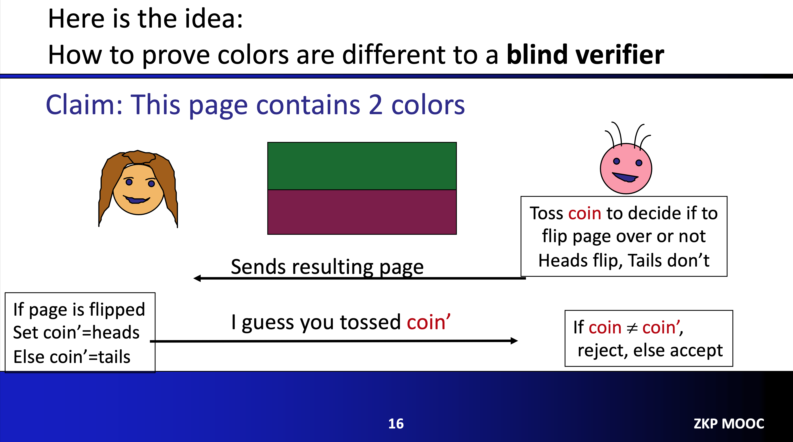
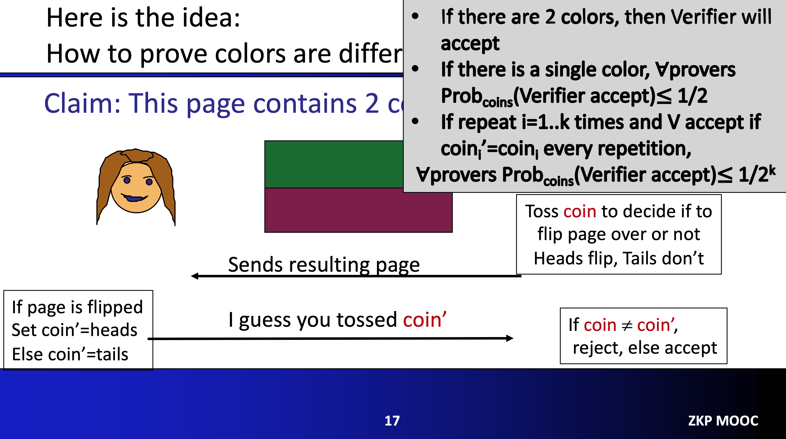
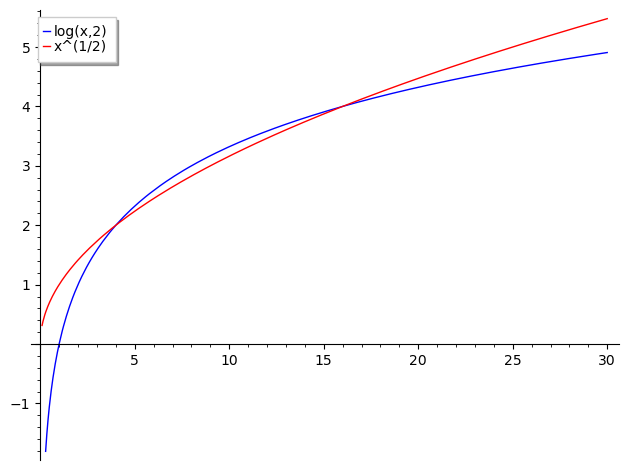
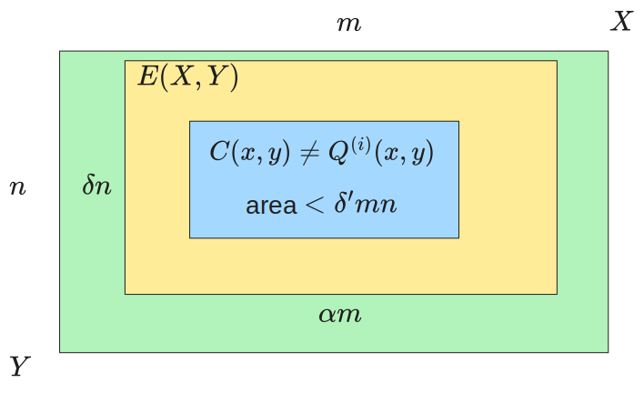

# Dive into  BBHR18-FRI Soundness

- Jade Xie  <jade@secbit.io>
- Yu Guo <yu.guo@secbit.io>

This article mainly focuses on explaining the paper [BBHR18b] published by Eli Ben-Sasson et al. in 2018, with emphasis on the completeness and soundness proofs of the FRI protocol. In this paper, they proposed a new IOPP (Interactive Oracle Proof of Proximity) for Reed-Solomon (RS) encoding, called FRI (Fast RS IOPP). Subsequently, in [BBHR18a], they used the FRI protocol to construct a practical ZK system, which is the STARK we are familiar with.

## Primary Problem

For a set of evaluations $S$ in a finite field $\mathbb{F}$, assuming the number of elements in $S$ is $N$, given a rate parameter $\rho \in (0,1]$, the encoding $\text{RS}[\mathbb{F},S,\rho]$ represents the set of all functions $f: S \rightarrow \mathbb{F}$, where $f$ is the evaluation of a polynomial of degree $d < \rho N$, i.e., there exists a polynomial $\hat{f}$ of degree $d < \rho N$ such that $f$ and $\hat{f}$ are consistent on $S$.

The main focus of the paper is the *RS proximity problem*: Assuming we can obtain an oracle about the function $f: S \rightarrow \mathbb{F}$, the Verifier needs to distinguish with high confidence and low query complexity which of the following situations $f$ belongs to:
1. $f \in \text{RS}[\mathbb{F},S,\rho]$
2. $\Delta(f, \text{RS}[\mathbb{F},S,\rho]) > \delta$

In other words, either $f$ is a codeword in the RS encoding $\text{RS}[\mathbb{F},S,\rho]$, or the relative Hamming distance between $f$ and all codewords in $\text{RS}[\mathbb{F},S,\rho]$ is greater than the proximity parameter $\delta$. A natural idea is that the verifier can query $d + 1$ times and then determine which of the above situations $f$ belongs to. If it belongs to the first case, accept; if it belongs to the second case, reject. The query complexity at this time is $d + 1 = \rho N$. When calculating the complexity of the Testing method, no additional information is provided to the verifier, so it is said that the computational complexity for the prover to try to convince the verifier that $f \in \text{RS}[\mathbb{F}, S,\rho]$ is $0$, the number of interactions is $0$, and the length of the proof generated is $0$. Comparing the complexity of this method (Testing, [RS92]) with FRI, the table below shows ([BBHR18b]).

|                | Prover Computation Complexity | Proof Length      | Verifier Computation Complexity | Query Complexity | Round Complexity     |
| -------------- | ----------------------------- | ----------------- | ------------------------------- | ----------------- | -------------------- |
| Testing [RS92] | $0$                           | $0$               | $\rho N \cdot \log^{O(1)}$      | $\rho N$          | $0$                  |
| FRI [BBHR18b]  | $<6 \cdot N$                  | $<\frac{N}{3}$    | $\le 21 \cdot \log N$           | $2 \log N$        | $\frac{\log N}{2}$   |

As can be seen, the prover's computational complexity in FRI is strictly linear, and the verifier's computational complexity is strictly logarithmic, while the query complexity is logarithmic ([BBHR18b]).

## FRI Properties

As mentioned above, FRI is a type of IOPP. Below is the definition of IOPP.

**Definition 1** [BBHR18b, Definition 1.1] (Interactive Oracle Proof of Proximity (IOPP)). An $\textbf{r}$-round Interactive Oracle Proof of Proximity (IOPP) $\textbf{S} = (\text{P}, \text{V})$ is a ($r + 1$)-round IOP. We say $\textbf{S}$ is an ($\textbf{r}$-round) IOPP for the error correcting code $C= \{f:S \rightarrow \Sigma\}$ with soundness $\textbf{s}^{-}: (0,1] \rightarrow [0,1]$ with respect to distance measure $\Delta$ , if the following conditions hold:
* **First message format:** the first prover message, denote $f^{(0)}$ , is a purported codeword of $C$ , i.e., $f^{(0)}: S \rightarrow \Sigma$
* **Completeness:** $\Pr[\left \langle \text{P} \leftrightarrow \text{V} \right \rangle = \text{accept}|\Delta(f^{(0)}, C) = 0] = 1$
* **Soundness:** For any $\text{P}^*$ , $\Pr[\left \langle \text{P}^* \leftrightarrow \text{V} \right \rangle = \text{reject}|\Delta(f^{(0)}, C) = \delta] \ge \textbf{s}^{-}(\delta)$

This means that the Prover and Verifier will interact for $\textbf{r}$ rounds, and need to satisfy three conditions.

1. The first message $f^{(0)}$ is the codeword initially claimed by the Prover to be in $C$.
2. Completeness: For an honest Prover, if $f^{(0)}$ is in $C$, then the Verifier will definitely output accept.
3. Soundness: This analyzes the probability of rejection after interaction with a malicious Prover. In the definition, soundness $\textbf{s}^{-}: (0,1] \rightarrow [0,1]$ is a function with variable $\delta \in (0,1]$, which also indicates that when analyzing soundness, we consider a malicious Prover, i.e., initially $\Delta(f^{(0)}, C) = \delta > 0$. In this case, the Prover and Verifier interact to calculate the probability of rejection, and the lower bound of this probability is $\textbf{s}^{-}(\delta) \in [0,1]$. Since this represents a probability, naturally the function value of $\textbf{s}^{-}(\delta)$ is in the closed interval $[0,1]$.

## FRI Protocol

Below is an excerpt of the description of the FRI protocol from the paper [BBHR18b].

### Definitions and Notations

**Interpolant** For a function $f : S \rightarrow \mathbb{F}$ , $S \subset \mathbb{F}$ , let $\text{interpolant}^f$ denote the *interpolant* of $f$ , defined as the unique polynomial $P(X) = \sum_{i=0}^{|S|-1} a_iX^i$ of degree less than $|S|$ whose evaluation on $S$ equals $f|_S$ , i.e., $\forall x \in S, f(x) = P(x)$ . We assume the interpolant $P(X)$ is represented as a formal sum, i.e., by the sequence of monomial coefficients $a_0, \cdots, a_{|S|-1}$ .

**Subspace polynomials** Given a set $L_0 \subset \mathbb{F}$ , let $\text{Zero}_{L_0} \triangleq \prod_{x \in L_0} (X - x)$ be the unique non-zero monic polynomial of degree $|L_0|$ that vanishes on $L_0$ . When $L_0$ is an additive coset contained in a binary field, the polynomial $\text{Zero}_{L_0}(X)$ is an *affine subspace polynomial*, a special type of a linearized polynomial. We shall use the following properties of such polynomials, referring the interested reader to [LN97, Chapter 3.4] for proofs and additional background: 

1. The map $x \mapsto \text{Zero}_{L_0}(x)$ maps each additive coset $S$ of $L_0$ to a single field element, which will be denoted by $y_S$ .
2. If $L \supset L_0$ are additive cosets, then $\text{Zero}_{L_0}(L) \triangleq \{ \text{Zero}_{L_0}(z) | z \in L \}$ is an additive coset and $\dim(\text{Zero}_{L_0}(L)) = \dim(L) - \dim(L_0)$ .

**Subspace specification** Henceforth, the letter $L$ always denotes an additive coset in a binary field $\mathbb{F}$ , we assume all mentioned additive cosets are specified by an additive shift $\alpha \in \mathbb{F}$ and a basis $\beta_1, \cdots, \beta_k \in \mathbb{F}^k$ so that $L = \left\{ \alpha + \sum_{i=1}^k b_i\beta_i | b_1, \cdots, b_k \in \mathbb{F}_2 \right\}$ ; we assume $\alpha$ and $\vec{\beta} = (\beta_1, \cdots, \beta_k)$ are agreed upon by prover and verifier.

### COMMIT Phase

The number of rounds in the protocol is $r \triangleq \left \lfloor \frac{k^{(0)} - \mathcal{R}}{\eta}\right\rfloor$ , where $\mathcal{R} = \log(1/\rho)$ , and $\rho$ represents the code rate. In the $i$-th round of the COMMIT phase, $i \in \{0, \cdots, r - 1\}$ , the Verifier can access an oracle of a function $f^{(i)}: L^{(i)} \rightarrow \mathbb{F}$ submitted by the Prover, where $\dim(L^{(i)}) = k^{(i)} = k^{(0)} - \eta \cdot i$ , and the space $L^{(i)}$ is fixed in advance, particularly, they do not depend on the Verifier's messages.

> **FRI-COMMIT:**
> Common input:
> * Parameters $\mathcal{R}, \eta, i$ , all are positive integers:
> 	– rate parameter $\mathcal{R}$ : logarithm of RS code rate ($\rho = 2^{-\mathcal{R}}$)
> 	– localization parameter $\eta$ : dimension of $L_0^{(i)}$ (i.e., $|L_0^{(i)}| = 2^{\eta}$); let $r \triangleq \left \lfloor \frac{k^{(0)} - \mathcal{R}}{\eta}\right\rfloor$ denote round complexity
> 	– $i \in \{0, \cdots, r\}$: round counter
> * A parametrization of $\text{RS}^{(i)} \triangleq \text{RS}[\mathbb{F},L^{(i)},\rho = 2^{-\mathcal{R}}]$ , denote $k^{(i)} = \log_2 |L^{(i)}|$ (notice $k^{(i)} = \dim (L^{(i)})$);
> * $L_0^{(i)} \subset L^{(i)}$ , $\dim(L_0^{(i)})=\eta$ ; let $q^{(i)}(X) = \text{Zero}_{L_0^{(i)}}(X)$ and denote $L^{(i+1)} = q^{(i)}(L^{(i)})$
> 
> Prover input: $f^{(i)}:L^{(i)} \rightarrow \mathbb{F}$, a purported codeword of $\text{RS}^{(i)}$
> 
> Loop: While $i \le r$ :
> 1. Verifier sends a uniformly random $x^{(i)} \in \mathbb{F}$
> 2. Prover defines the function $f_{f^{(i)},x^{(i)}}^{(i+1)}$ with domain $L^{(i+1)}$ thus, for each $y \in L^{(i+1)}$ :
> 	* Let $S_y = \{x \in L^{(i)} | q^{(i)}(x) = y\}$ be the coset of $L_0^{(i)}$ mapped by $q^{(i)}$ to $\{y\}$ ;
> 	* $P_y^{(i)}(X) \triangleq \text{interpolant}^{f^{(i)}|_{S_y}}$ ;
> 	* $f_{f^{(i)},x^{(i)}}^{(i+1)}(y) \triangleq P_y^{(i)}(x^{(i)})$ ;
> 3. If $i = r$ then:
> 	* let $f^{(r)} = f_{f^{(r-1)},x^{(r-1)}}^{(r)}$ for $f^{(r)} = f_{f^{(r-1)},x^{(r-1)}}^{(r)}$ defined in step 2 above; 
> 	* let $P^{(r)}(X) = \sum_{j \ge 0} a_j^{(r)}X^j \triangleq \text{interpolant}^{f^{(r)}}(X)$ ;
> 	* let $d = \rho \cdot |L^{(r)}| - 1$ ;
> 	* prover commits to first $d + 1$ coefficients of $P^{(r)}(X)$ , namely, to $\langle a_0^{(r)}, \cdots, a_d^{(r)} \rangle$
> 	* COMMIT phase terminates; 
> 4. Else ($i < r$ ):
> 	* let $f^{(i+1)} = f^{(i+1)}_{f^{(i)}, x^{(i)}}$ for $f^{(i+1)}_{f^{(i)}, x^{(i)}}$ defined in step 2 above;
> 	* prover commits to oracle $f^{(i+1)}$
> 	* both parties repeat the COMMIT protocol with common input
> 		- parameters $(\mathcal{R}, \eta, i + 1)$
> 		- a parametrization of $\text{RS}^{(i+1)} \triangleq \text{RS}[\mathbb{F},L^{(i+1)},\rho = 2^{-\mathcal{R}}]$ and $L_0^{(i+1)} \subset L^{(i+1)}$ , $\dim(L_0^{(i+1)})=\eta$
> 		and prover input $f^{(i+1)}$ defined at the beginning of this step;

### QUERY Phase

> **FRI-QUERY:**
> verifier input:
> * parameters $\mathcal{R}, \eta$ as defined in the COMMIT phase
> * repetition parameter $l$
> * sequence of rate-$\rho$ RS-codes $\text{RS}^{(0)}, \cdots, \text{RS}^{(r)}$, where $\text{RS}^{(i)} \triangleq \text{RS}[\mathbb{F},L^{(i)},\rho]$ and $\log_2|L^{(i)}| = k^{(i)} = k^{(0)} - \eta$; (notice $k^{(i)} = \dim(L^{(i)})$);
> * sequence of affine spaces $L_0^{(0)}, \cdots, L_0^{(r-1)}$, each $L_0^{(i)}$ is of dimension $\eta$ and contained in $L^{(i)}$ ;
> * transcript of verifier messages $x^{(0)}, \cdots, x^{(r-1)} \in \mathbb{F}$
> * access to oracles $f^{(0)}, \cdots, f^{(r-1)}$
> * access to last oracle $P^{(r)}(X) = \sum_{j \ge 0} a_j^{(r)}X^j$ for $d = \rho \cdot |L^{(r)}| - 1$ ;
> 
> Terminal function reconstruction:
> * query $a_0^{(r)}, \cdots, a_d^{(r)}$ ;(a total of $d + 1 \le 2^{\eta}$ queries)
> * let $P'(X) \triangleq \sum_{j \ge 0} a_j^{(r)}X^j$ ;
> * let $f^{(r)}$ be the evaluation of $P'(X)$ on $L^{(r)}$ ; (notice $f^{(r)} \in \text{RS}^{(r)}$ )
> 
> Repeat $l$ times: {
> 1. Sample uniformly random $s^{(0)} \in L^{(0)}$ and for $i = 0, \cdots, r - 1$ let
> 	* $s^{i + 1} = q^{(i)}(s^{(i)})$
> 	* $S^{(i)}$ be the coset of $L_0^{(i)}$ in $L^{(i)}$ that contains $s^{(i)}$
> 2. For $i = 0, \cdots, r - 1$ ,
> 	* query $f^{(i)}$ on all of $S^{(i)}$; (a total of $2\eta$ queries)
> 	* compute $P^{(i)}(X) \triangleq \text{interpolant}^{f^{(i)}|_{S^{(i)}}}$; (notice $\deg(P^{(i)}) < 2^{\eta}$)
> 3. **round consistency**: If for some $i \in \{ 0, \cdots, r - 1\}$ it holds that
>
> $$
> \begin{equation}
>  f^{(i+1)}(s^{(i+1)}) \neq P^{(i)}(x^{(i)})
> \end{equation}
> $$
>  
> then reject and abort;
> 
> }
> 
> Return accept


## Main Properties of the FRI Protocol

The following theorem gives the main properties of the FRI protocol, including Completeness, Soundness, Prover complexity, and Verifier complexity. In fact, the paper also provides a slightly simplified version, see [BBHR18b] Theorem 1.3, which can be proved by setting $\eta = 2$ and $l = 1$ in the theorem below. Here we mainly explain this more complex version.

**Theorem 1** [BBHR18b, Theorem3.3] (Main properties of the **FRI** protocol). The following properties hold when the **FRI** protocol is invoked on oracle $f^{(0)}:L^{(0)} \rightarrow \mathbb{F}$ with localization parameter $\eta$ and rate parameter $\mathcal{R}$ (and rate $\rho = 2^{- \mathcal{R}}$) such that $\rho |L^{(0)}| > 16$ :
1. **Completeness** If $f^{(0)} \in \text{RS}^{(0)} \triangleq \text{RS}[\mathbb{F}, L^{(0)}, \rho = 2^{- \mathcal{R}}]$ and $f^{(1)},  \cdots, f^{(r)}$ are computed by the prover specified in the COMMIT phase, then the **FRI** verifier outputs **accept** with probability 1.
2. **Soundness** Suppose $\delta^{(0)} \triangleq \Delta^{(0)}(f^{0}, \text{RS}^{(0)}) > 0$ . Then with probability at least  
	
	$$
	\begin{equation}
	1 - \frac{3|L^{(0)}|}{\mathbb{F}} 
	\end{equation}
	$$

	over the randomness of the verifier during the COMMIT phase, and for any (adaptively chosen) prover oracles $f^{(1)}, \cdots, f^{(r)}$ the QUERY protocol with repetition parameter $l$ outputs **accept** with probability at most

	$$
	\left (1 - \min \left \{\delta^{(0)}, \frac{1-3\rho-2^{\eta}/\sqrt{|L^{(0)}|}}{4} \right \}\right )^{l}
	$$

	Consequently, the soundness of **FRI** is at least
	
	$$
	\begin{equation}
		\textbf{s}^{-}(\delta^{(0)}) \triangleq 1 - \left ( \frac{3|L^{(0)}|}{|\mathbb{F}|} + \left (1 - \min \left \{\delta^{(0)}, \frac{1-3\rho-2^{\eta}/\sqrt{|L^{(0)}|}}{4} \right \}\right )^{l} \right). 
	\end{equation}
	$$

3. **Prover complexity** The $i^{th}$ step of commit phase can be computed by a parallel random access machine (PRAM) with concurrent read and exclusive write (CREW) in $2\eta + 3$ cycles — each cycle involves a single arithmetic operation in $\mathbb{F}$ — using $2|L^{(i)}| + \eta$ processors and a total of $4|L^{(i)}|$ arithmetic operations over $\mathbb{F}$.
	Consequently, the total prover complexity is at most $6|L^{(0)}|$ arithmetic operations, which can be carried out in at most $4 |L^{(0)}|$ cycles on a PRAM-CREW with $2n + 3$ processors.
4. **Verifier complexity** Verifier communication during the COMMIT phase equals $\textbf{r}$ field elements; query complexity (during QUERY phase) equals $l 2^{\eta} \textbf{r} = l 2^{\eta} \left ( 1 + \left \lfloor \frac{\log |L^{(0)}| - \mathcal{R}}{\eta} \right \rfloor \right )$. On a PRAM with exclusive read and exclusive write (EREW) with $l \textbf{r}\cdot2 \eta$ processors, the verifier's decision is obtained after $2\eta + 3 + \log l$ cycles and a total of $l\cdot \textbf{r} \cdot (6 \cdot 2\eta + 6 \eta + 6)$ arithmetic operations in $\mathbb{F}$.

In the second item, the Soundness conclusion, a parameter $\delta^{(0)} \triangleq \Delta^{(0)}(f^{0}, \text{RS}^{(0)}) > 0$ is given first. Here, $\Delta^{(0)}(f^{0}, \text{RS}^{(0)})$ is not actually the common relative Hamming distance. Below is the definition of this measure, along with an explanation of its relationship with the relative Hamming distance.

### Block-wise Distance Measure

**Definition 2** [BBHR18b, Definition3.2] (Block-wise distance measure). Let $\mathcal{S} = \{S_1, \cdots, S_m\}$ be a partition of a set $S$ and $\Sigma$ be an alphabet. The relative $\mathcal{S}$-Hamming distance measure on $\Sigma^{S}$ is defined for $f, g \in \Sigma^{S}$ as the relative Hamming distance over $\Sigma^{S_1} \times \cdots \times \Sigma^{S_m}$ ,

$$
\Delta^{\mathcal{S}}(f,g) \triangleq \Pr_{i \in [m]}[f|_{S_i} \neq g|_{S_i}] = \frac{|\{i \in [m] | f|_{S_i} \neq g|_{S_i}\}|}{m}. 
$$

Thus, for $\mathcal{F} \subset \Sigma^{S}$ let $\Delta^{\mathcal{S}}(g,\mathcal{F}) = \min \{ \Delta^{\mathcal{S}}(g,f) | f \in \mathcal{F}\}$.

To better understand this definition, in the FRI protocol, consider the block-wise distance on $\mathbb{F}^{L^{(i)}}$, i.e., replace the set $S$ in the above definition with $L^{(i)}$ in step $i$ of the FRI protocol, and replace the alphabet $\Sigma$ with $\mathbb{F}$. In step $i$, we can determine the set $L_0^{(i)}$. $L_0^{(i)}$ can actually be set as the kernel of the mapping $q^{(i)}$, which is the set of elements in $L^{(i)}$ that are mapped to the identity element $e$ in $L^{(i+1)}$ by $q^i$, expressed mathematically as

$$
L_0^{(i)} = \{x \in L^{(i)} | q^{(i)}(x) = e\}.
$$

Then the set $L^{(i)}$ can be partitioned by the cosets of $L_0^{(i)}$. Assuming it is divided into $m$ sets, the partition of $L^{(i)}$ can be denoted as $\mathcal{S}^{(i)} = \{L_0^{(i)}, \cdots, L_{m-1}^{(i)}\}$. Then we briefly write

$$
\Delta^{(i)}(f,g)  \triangleq  \Delta^{\mathcal{S}^{(i)}}(f,g) 
$$

For two functions $f,g : L^{(i)} \rightarrow \mathbb{F}$, both with domain $L^{(i)}$ and codomain $\mathbb{F}$, this Block-wise distance now represents the ratio of the number of cosets in $\mathcal{S}^{(i)}$ where these two functions are not completely consistent. For example, in $\mathcal{S}^{(i)} = \{L_0^{(i)}, \cdots, L_{m-1}^{(i)}\}$ (assuming $m \ge 2$), if the function values of $f$ and $g$ are not completely identical only on the two sets $L_0^{(i)}$ and $L_1^{(i)}$, i.e., $f|_{L_0^{(i)}} \neq g|_{L_0^{(i)}}$ and $f|_{L_1^{(i)}} \neq g|_{L_1^{(i)}}$, and the functions $f$ and $g$ are completely consistent on the remaining cosets, then we can calculate $\Delta^{(i)}(f,g) = \frac{2}{m}$.

The above $\Delta^{(i)}(f, g)$ refers to the measure between two elements in $\mathbb{F}^{L^{(i)}}$. Below, we explain the block-wise distance measure corresponding to an element $f^{(i)} \in \mathbb{F}^{L^{(i)}}$ and a subset $\text{RS}^{(i)} \subset \mathbb{F}^{L^{(i)}}$ ($\text{RS}^{(i)} = RS[\mathbb{F}, L^{(i)}, \rho]$ is naturally a subset of $\mathbb{F}^{L^{(i)}}$), expressed as

$$
\Delta^{\mathcal{(i)}}(f^{(i)},\text{RS}^{(i)}) \triangleq \Delta^{\mathcal{S}^{(i)}}(f^{(i)},\text{RS}^{(i)}) = \min \{ \Delta^{\mathcal{S}^{(i)}}(f^{(i)},g^{(i)}) | g^{(i)} \in \text{RS}^{(i)}\},
$$

Its meaning is to traverse all codewords $g^{(i)}$ in the set $\text{RS}^{(i)}$, calculate these $\Delta^{\mathcal{S}^{(i)}}(f^{(i)},g^{(i)})$, and the smallest value among them is $\Delta^{\mathcal{S}^{(i)}}(f^{(i)},\text{RS}^{(i)})$.
Regarding this Block-wise distance measure, an important inequality is

$$
\begin{equation}
	1 - \rho \ge  \Delta^{\mathcal{(i)}}(f^{(i)},\text{RS}^{(i)})  \ge \Delta_H(f^{(i)},\text{RS}^{(i)}) \tag{4}
\end{equation}
$$

This equation will be repeatedly used in the Soundness proof of FRI, which is quite important. Here's its proof.

***Proof***: First, prove the left half of the inequality, i.e., $1 - \rho \ge  \Delta^{\mathcal{(i)}}(f^{(i)},\text{RS}^{(i)})$. There always exists such a polynomial $g^{(i)} \in \text{RS}^{(i)}$, whose degree $deg(g^{(i)}) < \rho |L^{(i)}|$, and at the same time $\Delta^{\mathcal{(i)}}(f^{(i)},g^{(i)}) = 1 - \rho$. Below we explain the existence of $g^{(i)}$. We construct as follows:
In the partition set $\mathcal{S}^{(i)} = \{L_0^{(i)}, \cdots, L_{m-1}^{(i)}\}$, we can obtain the sequence of sets $\{ L_0^{(i)}, \cdots, L_{m-1}^{(i)}\} = \{x_0, x_1, \cdots, x_{|L^{(i)}| - 1}\}$ in order. Continuously select the first $\rho |L^{(i)}|$ points $\{x_0,x_1, \cdots, x_{\rho |L^{(i)}| - 1}\}$, obtain the corresponding values of $f^{(i)}$ for these points $\{f^{(i)}(x_0),f^{(i)}(x_1),\cdots, f^{(i)}(x_{\rho |L^{(i)}| - 1})\}$, and perform Lagrange interpolation with these point values to obtain a polynomial $g^{(i)}$ of degree $< \rho |L^{(i)}|$. It's easy to see that $g^{(i)}$ constructed in this way belongs to $\text{RS}^{(i)} = RS[\mathbb{F}, L^{(i)}, \rho]$. At the same time, according to the previous construction, we find that on the set $\{L_0^{(i)}, \cdots, L_{\rho m - 1}^{(i)}\} = \{x_0, x_1, \cdots, x_{\rho |L^{(i)}| - 1} \}$, the function values of $f^{(i)}$ and $g^{(i)}$ are completely equal (here, $\rho |L^{(i)}|$ points exactly fully occupy $\rho m$ sets, without the situation where the last few points only occupy part of the last set, this is because $\rho$ and $|L^{(i)}|$ are chosen to be powers of 2, which can be evenly divided). Then we can calculate

$$
\Delta^{(i)}(f^{(i)}, g^{(i)}) = \frac{|\{j \in [m] | f^{(i)}|_{L_j^{(i)}} \neq g^{(i)}|_{L_j^{(i)}}\}|}{m} = 1 - \rho.
$$

Therefore, $\Delta^{\mathcal{(i)}}(f^{(i)},\text{RS}^{(i)})$ calculates the minimum value under the measure $\Delta^{(i)}$ between elements in $\text{RS}^{(i)}$ and $f^{(i)}$, which certainly won't exceed the distance of the found $g^{(i)} \in \text{RS}^{(i)}$, thus proving the left half of the inequality $1 - \rho \ge  \Delta^{\mathcal{(i)}}(f^{(i)},\text{RS}^{(i)})$.
Next, prove the right half of the inequality $\Delta^{\mathcal{(i)}}(f^{(i)},\text{RS}^{(i)})  \ge \Delta_H(f^{(i)},\text{RS}^{(i)})$. Assume $\Delta^{(i)}(f^{(i)}, g^{(i)} \in \text{RS}^{(i)}) = \delta$, without loss of generality, assume $f^{(i)}$ and $g^{(i)}$ are not completely consistent on the cosets $\{L_0^{(i)}, \cdots, L_{\delta m - 1}^{(i)}\} = \{x_0, \cdots, x_{\delta |L^{(i)}| - 1}\}$, and are completely consistent on the remaining set $\{L_0^{(i)}, \cdots, L_{m-1}^{(i)}\} \backslash \{L_0^{(i)}, \cdots, L_{\delta m - 1}^{(i)}\}$. Then considering all points on $L^{(i)}$, $g^{(i)}$ is at most inconsistent with $f^{(i)}$ on these $\delta |L^{(i)}|$ points $\{L_0^{(i)}, \cdots, L_{\delta m - 1}^{(i)}\} = \{x_0, \cdots, x_{\delta |L^{(i)}| - 1}\}$, thus indicating that $\Delta_H(f^{(i)},g^{(i)}) \le \delta$. Furthermore, if we set $\Delta^{\mathcal{(i)}}(f^{(i)},\text{RS}^{(i)}) = \delta^*$, we can deduce $\Delta_H(f^{(i)},\text{RS}^{(i)}) \le \delta^* = \Delta^{\mathcal{(i)}}(f^{(i)},\text{RS}^{(i)})$. <span style="float: right;"> $\Box$ </span>

## Theorem 1 Completeness Proof

Below is an explanation of the completeness proof in Theorem 1. Let's restate the completeness:

> **Completeness** If $f^{(0)} \in \text{RS}^{(0)} \triangleq \text{RS}[\mathbb{F}, L^{(0)}, \rho = 2^{- \mathcal{R}}]$ and $f^{(1)},  \cdots, f^{(r)}$ are computed by the prover specified in the COMMIT phase, then the **FRI** verifier outputs **accept** with probability 1.

Completeness states that for an honest Prover, if the initial function $f^{(0)}$ is in the $\text{RS}^{(0)}$ encoding space, then through the FRI's COMMIT phase, a series of functions $f^{(1)},  \cdots, f^{(r)}$ will be produced, and the Verifier will definitely output **accept** after the QUERY phase.

First, a recursive lemma is presented, which is then used to prove completeness. The lemma states that if $f^{(i)} \in \text{RS}^{(i)}$ at step $i$, then in the COMMIT phase, the Verifier will randomly select $x^{(i)}$ from $\mathbb{F}$ and send it to the Prover. The Prover uses this random number to construct the next function $f^{(i+1)}_{f^{(i)}, x^{(i)}}$. For any $x^{(i)}$ in $\mathbb{F}$, the constructed $f^{(i+1)}_{f^{(i)}, x^{(i)}}$ is in the $\text{RS}^{(i+1)}$ space. The formal statement of the recursive lemma is as follows, and its proof will be explained later.

**Lemma 1** [BBHR18b, Lemma 4.1] (Inductive argument). If $f^{(i)} \in \text{RS}^{(i)}$ then for all $x^{(i)} \in \mathbb{F}$ it holds that $f^{(i+1)}_{f^{(i)}, x^{(i)}} \in \text{RS}^{(i+1)}$ .

The idea of the completeness proof is that in the QUERY phase, the Verifier mainly checks if round consistency holds in step 3. If it doesn't hold for any $i \in \{0, \cdots, r - 1\}$, it will immediately output reject. Only when the checks pass for all $i$ will it finally output accept. For $i < r - 1$, according to the construction process of $f^{(i + 1)}$ in the COMMIT phase, round consistency will pass. For $i = r - 1$, based on the initial condition of completeness $f^{(0)} \in \text{RS}^{(0)}$, this theorem recursively shows that $f^{(r)} \in RS^{(r)}$. Finally, based on this conclusion, it is shown that round consistency will also pass in the QUERY phase, and thus the Verifier will definitely output accept. The specific completeness proof is as follows.

***Proof of Completeness in Theorem 1***: For an honest Prover, for any function $f^{(i)}$, in step 2 of the COMMIT phase, for any $i < r - 1$, construct

$$
f_{f^{(i)}, x^{(i)}}^{(i + 1)} (y) \triangleq P_y^{(i)}(x^{(i)}).
$$

Based on this construction, round consistency will definitely pass in step 3 of the QUERY phase, i.e.,

$$
f^{(i+1)}(s^{(i+1)}) = P^{(i)}(x^{(i)})
$$

holds.

We only need to prove that round consistency also passes for $i = r - 1$. From the completeness assumption, we know $f^{(0)} \in \text{RS}^{(0)}$, and by Lemma 1 recursively, we get $f^{(r)} \in RS^{(r)}$. Then there must exist a polynomial $P^{(r)}(X)$ of degree $<\rho |L^{(r)}|$ such that $f^{(r)}(X)$ and $P^{(r)}(X)$ are completely consistent on $L^{(r)}$. Therefore, the Prover will send $d + 1 = \rho |L^{(r)}|$ coefficients $\langle a_0^{(r)}, \cdots, a_d^{(r)} \rangle$ of $P^{(r)}(X)$ in step 3 of the COMMIT phase. The Verifier will construct $P'(X) \triangleq \sum_{j \le d} a_j^{(r)}X^j$ based on the $d + 1$ coefficients sent in the "Terminal function reconstruction" stage of the QUERY phase, and then obtain the function $f'^{(r)}$ based on $P'(X)$. The function $f'^{(r)}$ is the evaluation of $P'(X)$ on $L^{(r)}$. We can deduce that $f'^{(r)}|_{L^{(r)}} = P'(X) = P^{(r)}(X) = f^{(r)}|_{L^{(r)}}$. Naturally, it will pass the round consistency check for the $i = r - 1$ round, i.e.,

$$
f'^{(r)}(s^{(i+1)}) = P^{(r-1)}(x^{i})
$$

Thus, it is proved that the Verifier will definitely output accept. <span style="float: right;"> $\Box$ </span>

### Introduction of Proposition 1

Before proving Lemma 1, we first present an important proposition, and then use this proposition to prove Lemma 1. In the following proposition, lowercase letters $x, y$ are used to represent elements in the field, and uppercase letters $X,Y$ are used to represent variables.

**Claim 1** [BBHR18b, Claim 4.2].  For every $f^{(i)}: L^{(i)} \rightarrow \mathbb{F}$ there exists $Q^{(i)}(X,Y) \in \mathbb{F}[X,Y]$  satisfying 
1. $f^{(i)}(x) = Q^{(i)}(x,q^{(i)}(x))$ for all $x \in L^{(i)}$
2. $\deg_X(Q^{(i)}) < |L_0^{(i)}|$
3. If $f^{(i)} \in RS[\mathbb{F},L^{(i)},\rho]$ then $\deg_Y(Q^{(i)}) < \rho |L^{(i+1)}|$

This proposition is quite important for understanding the FRI protocol. Vitalik gave a specific example in the "A First Look at Sublinearity" section of his blog post [STARKs, Part II: Thank Goodness It's FRI-day](https://vitalik.eth.limo/general/2017/11/22/starks_part_2.html), which already shows the prototype of the FRI protocol. Let's revisit this example from the perspective of Proposition 1.

Assume the size of the finite field $L$ is $N = 10^9$, and let the polynomial $f(X): L \rightarrow \mathbb{F}$ have a degree $< 10^6$, so we have $f \in RS[\mathbb{F}, L, \rho = 10^{-3}]$. According to Proposition 1, there must exist a bivariate polynomial $g(X,Y) \in \mathbb{F}[X,Y]$ satisfying:
1. For $\forall x \in L$, we have $g(x,q(x)) = f(x)$, where $q(x) = x^{1000}$ 
2. $\deg_X(g) < |L_0| = 10^3$
3. Since $f \in RS[\mathbb{F}, L, \rho = 10^{-3}]$, we have $\deg_Y(g) < \rho |L^{(1)}| = 10^{-3} \times 10^6 = 10^3$

Now the Prover wants to prove to the Verifier that the degree of $f(x)$ is indeed less than $10^6$. The article uses intuitive geometric figures to illustrate the proof process.


In the figure, the horizontal direction of the square represents the variable $X$, with a range of $L$, totaling $10^9$ elements, while the vertical direction represents the variable $Y$, with a range of $\{x^{1000} | x \in L\}$. A point $(x,y)$ in the square corresponds to the calculated value of $g(x,y)$. For points $(x, y)$ on the diagonal of the square, satisfying $x = y$, we have $g(x,y) = g(x, x^{1000}) = f(x)$.

The proof process is as follows:

1. The Prover commits to all points in the square regarding the evaluation of $g(X,Y)$, for example, using a Merkle tree for commitment.
2. The Verifier randomly selects about a few dozen rows and columns. For each selected row or column, the Verifier will request samples of about 1010 points, ensuring that one of the required points in each case is on the diagonal. For example, if the Verifier selects the 5th column, then $x = x_4$, and 1010 sample points need to be selected. The x-coordinate of these points is already determined, so only the y-coordinate needs to be randomly selected. By selecting $y = x_4^{1000}$ in the y-coordinates, it ensures that the point $(x_4,x_4^{1000})$ is on the diagonal.
3. The Prover replies with the values of $g(x,y)$ corresponding to the points requested by the Verifier, along with the corresponding Merkle branches, proving that they are part of the data originally committed by the Prover.
4. The Verifier checks if the Merkle branches match, and for each row or column, the Verifier verifies whether the points provided by the Prover really correspond to a polynomial of degree $<1000$. The Verifier can verify this by interpolating these points.

The original text mentions:

> This gives the verifier a statistical proof that (i) most rows are populated mostly by points on degree $<1000$ polynomials, (ii) most columns are populated mostly by points on degree $<1000$ polynomials, and (iii) the diagonal line is mostly on these polynomials. This thus convinces the verifier that most points on the diagonal actually do correspond to a degree $<1,000,000$ polynomial.

These points and conclusions can be linked to the three items given in Proposition 1:
1. For most rows, corresponding to polynomials of degree $<1000$, which indicates that $\deg_X(g) < 1000$.
2. For most columns, corresponding to polynomials of degree $<1000$, which indicates that $\deg_Y(g) < 1000$.
3. The diagonal is mainly composed of points on these polynomials, which indicates that the values of these points satisfy $g(x,x^{1000})$.

This also shows that most points $(x, x^{1000})$ on the diagonal correspond to a polynomial of degree $<10^6$, and because $f(x) = g(x,x^{1000})$, it convinces the Verifier that the degree of the polynomial $f(X)$ is $< 10^6$.

In summary, if we want to prove that the degree of a polynomial $f(X)$ is less than a certain value, according to Proposition 1, there must exist a bivariate polynomial $g(X,Y)$ that can be associated with $f(X)$. First, we have $f(x) = g(x,q(x))$, and the remaining two conclusions are about the degrees $\deg_X(g)$ and $\deg_Y(g)$ of $g(X,Y)$, which correspond to the degrees of the polynomials represented by the horizontal and vertical lines in the figure, respectively. In fact, the above steps can be recursively applied, which corresponds to the "And Even More Efficiency" section in the article, describing the process of the FRI protocol.


Below is the proof of Proposition 1.

***Proof of Proposition 1***: Let $P^{(i)} = \text{interpolant}^{f^{(i)}}$, i.e., interpolate the function $f^{(i)}$ on $L^{(i)}$ to obtain the polynomial $P^{(i)}$. Let $\mathbb{F}[X,Y]$ denote the bivariate polynomial ring over the finite field $\mathbb{F}$; first sort the monomials by their total degree, then by their $X$-degree. Let

$$
\begin{equation}
Q^{(i)}(X,Y) = P^{(i)}(X) \qquad \text{mod} \; Y - q^{(i)}(X)
\end{equation}
$$

be the remainder of $P^{(i)}(X)$ divided by $Y - q^{(i)}(X)$. From this definition, we can deduce that there must exist a quotient $R(X,Y) \in \mathbb{F}[X,Y]$ such that

$$
P^{(i)}(X) = Q^{(i)}(X,Y) + (Y - q^{(i)}(X)) \cdot R(X,Y).
$$

For $\forall x \in L^{(i)}$ and $y = q^{(i)}(x)$, substituting into the rightmost term of the above equation, we get $(Y - q^{(i)}(X)) \cdot R(X,Y) = (y - q^{(i)}(x)) \cdot R(x,y) = 0$. Therefore, $P^{(i)}(x) = Q^{(i)}(x,y) = Q^{(i)}(x,q^{(i)}(x))$, and since $P^{(i)}(X)$ is obtained by interpolating $f^{(i)}(X)$ on $L^{(i)}$, we have $f^{(i)}(x) = P^{(i)}(x) = Q^{(i)}(x, q^{i}(x))$, which proves the first item in the proposition.

From the sorting of monomials, we can deduce that the defined remainder $Q$ satisfies

$$
\deg_X(Q^{(i)}(X,Y)) < \deg(q^{(i)}) = |L_0^{(i)}|,
$$

thus the second item of Proposition 1 holds.

Finally, we prove the third item of Proposition 1. From the condition $f^{(i)} \in RS[\mathbb{F},L^{(i)},\rho]$, we can deduce $\deg(P^{(i)}) < \rho |L^{(i)}|$. According to the division rule and the monomial sorting rule, we get

$$
\deg_Y(Q^{(i)}) = \left \lfloor \frac{\deg(P^{(i)})}{\deg(q^{(i)})}\right \rfloor = \left \lfloor \frac{\deg(P^{(i)})}{|L_0^{(i)}|}\right \rfloor < \left \lfloor \frac{\rho |L^{(i)}|}{|L_0^{(i)}|}\right \rfloor = \left \lfloor \rho |L^{(i+1)}|\right \rfloor \le \rho |L^{(i+1)}|.
$$

Thus, the third item of Proposition 1 is proved. <span style="float: right;"> $\Box$ </span>

### Proof of Lemma 1

Using the notation from Proposition 1. From the third item of the proposition, we have $\deg_Y(Q^{(i)}) < \rho \cdot |L^{(i+1)}|$ for any $x^{(i)}$. Next, we prove

$$
\begin{equation}
	\forall y \in L^{(i+1)} , f^{(i+1)}(y) = Q^{(i)}(x^{(i)}, y)
\end{equation}
$$

If this equation holds, it proves that $\deg(f^{(i+1)}) \le \deg_Y(Q^{(i)}) < \rho \cdot |L^{(i+1)}|$, which demonstrates that $\deg(f^{(i+1)}) \in \text{RS}^{(i+1)}$.

To prove this equation, first fix $y \in L^{(i+1)}$, let $S_y \in \mathcal{S}^{(i)}$ be the set satisfying $q^{(i)}(S_y) = \{y\}$, which is also the coset of $L_0^{(i)}$ in $L^{(i)}$. From the construction of $f^{(i+1)}$, we know

$$
f^{(i+1)}(y) = \text{interpolant}^{f^{(i)}|_{S_y}}(x^{(i)}).
$$

From the first item of Proposition 1, we get

$$
\forall x \in S_y, \quad f^{(i)}(x) = P^{(i)} = Q^{(i)}(x,y)
$$

From the second item of Proposition 1, we know that $\deg_X(Q^{(i)}) < |L_0^{(i)}| = |S_y|$, so we can treat $X$ as a formal variable and obtain

$$
\text{interpolant}^{f^{(i)}|_{S_y}}(X) = Q^{(i)}(X,y)
$$

Then let $X = x^{(i)}$, the evaluations of the polynomials on both sides at $x^{(i)}$ must be the same. Thus, we get

$$
f^{(i+1)}(y) = \text{interpolant}^{f^{(i)}|_{S_y}}(x^{(i)}) = Q^{(i)}(x^{(i)},y)
$$

Naturally, for any $y \in L^{(i+1)}$, we have

$$
\forall y \in L^{(i+1)} , f^{(i+1)}(y) = Q^{(i)}(x^{(i)}, y)
$$

Thus, the proof is complete. <span style="float: right;"> $\Box$ </span>

## Analysis of Soundness Proof in Theorem 1

This section mainly explains the proof idea of soundness in Theorem 1. First, we give several definitions used in the proof, then explain two important lemmas, and finally prove soundness based on these two lemmas.

### Round Consistency and Distortion Set

The difficulty in analyzing soundness lies in how to accurately estimate the probability that any malicious prover will pass the protocol through interaction with the verifier. To make an accurate estimation, we need to consider where errors might occur in the protocol process. If we can estimate the probability of error for all these error processes without any loss, and then comprehensively analyze, we can obtain the soundness. In this process, to accurately estimate these possible error situations, we need to accurately describe these estimates, that is, we need to quantify them. Below are some necessary definitions in this process.

At step $i$, given oracles for $f^{(i)}$ and $f^{(i+1)}$, and the random number $x^{(i)}$ given by the Verifier.

> ❓ **Question**
>- [ ] Is there a mistake in the paper here? Should it be changed to $f^{(i-1)}$?

- **Inner-layer distance**  The *inner-layer distance* of the $i$th step is the $\Delta^{(i)}$-distance of $f^{(i)}$ from $\text{RS}^{(i)}$.
  
$$
\delta^{(i)} \triangleq \Delta^{(i)}(f^{i},\text{RS}^{(i)})
$$

This definition is the block-wise distance of step $i$ mentioned earlier.

* **Round error** For $i > 0$, the $i$th *round error set* is a subset of $L^{(i)}$, defined as follows:
  
$$
 A_{\text{err}}^{(i)}\left(f^{(i)},f^{(i-1)},x^{(i-1)}\right) \triangleq \left \{ y_S^{(i)} \in L^{(i)} | \text{interpolant} ^{f^{(i-1)|_S}}\left(x^{(i-1)}\right) \neq f^{(i)}\left(y_S^{(i)}\right)\right \}
$$

The round error set describes those elements in $L^{(i)}$ where the Verifier will fail the round consistency test in the $i$th round. The corresponding probability is the $i$th round error $\text{err}^{(i)}$.

$$
\text{err}^{(i)}\left(f^{(i)},f^{(i-1)},x^{(i-1)}\right) \triangleq \frac{|A_{\text{err}}^{(i)}|}{|L^{(i)}|}
$$

* **Closest codeword** Let $\bar{f}^{(i)}$ denote the closest codeword to $f^{(i)}$ in $\text{RS}^{(i)}$ under the $\Delta^{(i)}(\cdot)$ measure. We know that the $\Delta^{(i)}(\cdot)$ measure is a metric in the coset partition set $\mathcal{S}^{(i)}$ of $L^{(i)}$. Let $\mathcal{S}_B^{(i)} \subset \mathcal{S}^{(i)}$ denote the "bad" cosets in the partition $\mathcal{S}^{(i)}$ where $f^{(i)}$ and the codeword $\bar{f}^{(i)}$ are inconsistent, i.e.,

$$
\begin{equation}
	\mathcal{S}_B^{(i)} = \left\{ S \in \mathcal{S}^{i} | f^{(i)}|_S \neq \bar{f}^{(i)}|_S \right \}
\end{equation}
$$

Putting these "bad" cosets in $\mathcal{S}^{(i)}$ together forms the set $D^{(i)} = \cup_{S \in \mathcal{S}_B^{(i)}}S$, which we can see is a subset of $L^{(i)}$, where each element is a "bad" coset.

If $\delta^{(i)} < (1-\rho) /2$, then according to the inequality about the block-wise distance $\Delta^{(i)}$ mentioned earlier, we can get

$$
\Delta_H^{(i)} \le \delta^{(i)} < (1-\rho) /2,
$$

According to the bound of relative Hamming distance, unique decoding is possible at this time. Based on $f^{(i)}$, a unique $\bar{f}^{(i)}$ can be decoded, so $\mathcal{S}_B^{(i)}$ is unique at this time, and thus $\Delta_H^{(i)}$ can also be uniquely determined.

* **Distortion set** For $\epsilon > 0$, the *distortion set* of $f^{(i)}$ is

$$
\begin{equation}
	B \left[ f^{(i)}; \epsilon \right ] \triangleq \left\{ x^{(i)} \in \mathbb{F} | \Delta_H \left( f_{f^{(i)},x^{(i)}}^{(i+1)},\text{RS}^{(i+1)}\right) < \epsilon \right\}
\end{equation}
$$

Note that the measure used above is the relative Hamming distance. We can understand this distortion set as follows: we know that the Verifier will select a random number $x^{(i)}$ from the finite field $\mathcal{F}$ and send it to the Prover. The Prover constructs the next $f^{(i+1)}$ based on the $x^{(i)}$ sent by the Verifier and $f^{(i)}$. Then we look at the relative Hamming distance between the constructed next $f^{(i+1)}$ and $\text{RS}^{(i+1)}$. If we give a value $\epsilon$, we look at which $x^{(i)}$ in $\mathbb{F}$ will cause the constructed $f_{f^{(i)},x^{(i)}}^{(i+1)}$ to have a minimum relative Hamming distance from the encoding space $\text{RS}^{(i+1)}$ less than the given parameter $\epsilon$. To understand further, it's considering all $x^{(i)}$ on the field $\mathbb{F}$, looking at which $f_{f^{(i)},x^{(i)}}^{(i+1)}$ will have a certain distance from the entire encoding space $\text{RS}^{(i+1)}$, with this distance parameter being at most $\epsilon$. According to the condition $\epsilon > 0$, we know that $f_{f^{(i)},x^{(i)}}^{(i+1)}$ has at least a positive distance to the encoding space, definitely not in the $\text{RS}^{(i+1)}$ space.

So what error situations does the distortion set consider? It starts from the perspective of the Verifier's behavior, considering the situations where the Verifier's random number selection process may lead to not being in the encoding space.

### Soundness Proof Idea

We just mentioned that the distortion set considers possible errors from the process of the Verifier selecting random numbers. Then another perspective is the errors produced by the Prover in the construction process or during the COMMIT phase. So when we want to estimate soundness, we consider the following two situations where errors may occur:

1. Errors caused by the Verifier selecting random numbers $x^{(i)}$ from $\mathbb{F}$.
2. Errors caused by the Prover in the COMMIT phase.

This gives us the general idea for analyzing soundness: first estimate the probability of the first situation occurring, then assume the first situation doesn't occur and estimate the probability of the second situation occurring. Finally, analyze the probability of both situations occurring simultaneously, which gives us the soundness we want.

To estimate the probability of the first situation, we first present a pair of lemmas about the distortion set, and then use these lemmas to prove soundness. These two lemmas consider different values of $\epsilon$. We know that in the process of decoding a code, there will first be a relative Hamming distance parameter $\delta$, and we consider two cases for the value of $\delta$:
1. If $\delta \le (1 - \rho) / 2$, then the decoding is unique, i.e., unique decoding.
2. If $\delta > (1 - \rho) / 2$, then the decoding results in a list, which is List decoding.

> 📖 **Notes**
> 
> To better understand List Decoding, here's its definition:
> 
> **Definition 2** [Essential Coding Theory, Definition 7.2.1] Given $0 \le \rho \le 1$, $L \ge 1$, a code $C \subseteq \Sigma^n$ is $(\rho, L)$-list decodable if for every received word $\vec{y} \in \Sigma^n$,
> 
> $$
> |\{c \in C | \Delta(\vec{y},c) \le \rho n\}| \le L.
> $$
> 
> This means that given a relative Hamming distance parameter $\delta$ in advance, as well as an upper limit $L$ on the length of the list, for each received message $\vec{y}$, in the encoding space $C$, as long as the relative Hamming distance between the codeword $c$ and the message $\vec{y}$ is less than or equal to $\rho n$, we consider $c$ to be a valid decoding. At the same time, it requires that the number of valid encodings $c$ that meet this distance condition does not exceed $L$, then we say this encoding is $(\rho n, L)$-list decodable.
> 
> According to the Hamming distance, there is such a property:
> 
> **Proposition 1** [Essential Coding Theory, Proposition 1.4.2] Given a code $C$, the following are equivalent:
> 1. $C$ has minimum distance $d \ge 2$,
> 2. If $d$ is odd, $C$ can correct $(d−1)/2$ errors.
> 3. $C$ can detect $d − 1$ errors.
> 4. $C$ can correct $d − 1$ erasures.
> 
> Suppose the relative Hamming distance of $C$ is $\delta$, then $\delta = d / n$. According to the above property, we know that for $C$, the proportion of encodings that can be corrected in the worst case is $\le \frac{\delta}{2}$. And from the Singleton bound, we know,
> 
> $$
> \delta \le 1 - \rho
> $$
> Therefore, when the proportion of erroneous encodings is $\le \frac{1-\rho}{2}$, these errors can be corrected, that is, unique encoding is possible.

Now let's formally present this pair of lemmas. Lemma 3 describes the case where the decoding radius exceeds the unique decoding bound $(1-\rho)/2$, while Lemma 4 talks about the case where the decoding radius is less than $(1-\rho)/2$, i.e., unique decoding.

**Lemma 3** [BBHR18b, Lemma 4.3] (Soundness above unique decoding radius). For any $\epsilon \le \frac{2^{\eta}}{|\mathbb{F}|}$ and $f^{(i)}$ such that $\delta^{(i)}>0$

$$
\begin{equation}
	\Pr_{x^{(i)} \in \mathbb{F}} \left[ x^{(i)} \in B \left[ f^{(i)}; \frac{1}{2} \cdot \left( \delta^{(i)} (1 - \epsilon) - \rho \right) \right ] \right] \le \frac{2^{\eta}}{\epsilon |\mathbb{F}|}
\end{equation}
$$

**Lemma 4** [BBHR18b, Lemma 4.4] (Soundness within unique decoding radius). If $\delta^{(i)} < (1 - \rho) / 2$ then

$$
\begin{equation}
	\Pr_{x^{(i)} \in \mathbb{F}} \left[ x^{(i)} \in B \left[ f^{(i)}; \delta^{(i)} \right ] \right] \le \frac{|L^{(i)}|}{|\mathbb{F}|}.
\end{equation}
$$

Moreover, suppose that for $i < r$ the sequences $\vec{f} = (f^{(i)}, \cdots, f^{(r)})$ and $\vec{x} = (x^{(i)}, \cdots, x^{(r - 1)})$ satisfy

1. for all $j \in \{i, \cdots, r\}$ we have $\delta^{(j)} < \frac{1-\rho}{2}$
2. for all $j \in \{i, \cdots, r - 1\}$ we have $\bar{f}^{(j+1)} = f_{\bar{f}^{(j)},x^{(j)}}^{(j+1)}$
3. for all $j \in \{i, \cdots, r\}$ we have $x^{(j)} \notin B[f^{(i)};\delta^{(j)}]$

then

$$
\begin{equation}
	\Pr_{s^{(i)} \in D^{(i)}} \left[ \text{QUERY}(\vec{f}, \vec{x}) = \text{reject} \right] = 1
\end{equation}
$$

and consequently

$$
\begin{equation}
	\Pr_{s^{(i)} \in L^{(i)}} \left[ \text{QUERY}(\vec{f}, \vec{x}) = \text{reject} \right] \ge \frac{|D^{(i)}|}{| L^{(i)} |} = \delta^{(i)}
\end{equation}
$$

According to the definition of the distortion set, these two lemmas are talking about the probability of the Verifier selecting a random number $x^{(i)}$ entering the distortion set under different decoding radii $\epsilon$.

The conclusion following the "moreover" in Lemma 4 states that if the following conditions are met:

1. For all $j \in \{i, \cdots, r\}$, unique decoding is satisfied, that is, $\delta^{(j)} < \frac{1 - \rho}{2}$.
2. For all $j \in \{i, \cdots, r - 1\}$, in $\text{RS}^{(j)}$, select the closest codeword $\bar{f}^{(j)}$ to $f^{(j)}$, and the next function constructed with the random number $x^{(i)}$ is $f_{\bar{f}^{(j)},x^{(j)}}^{(j+1)}$, assuming it equals the closest codeword to $f^{(j+1)}$ in $\text{RS}^{(j+1)}$, i.e., satisfying $\bar{f}^{(j+1)} = f_{\bar{f}^{(j)},x^{(j)}}^{(j+1)}$.
3. For all $j \in \{i, \cdots, r - 1\}$, the random number $x^{(j)}$ has not entered the distortion set, i.e., $x^{(j)} \notin B[f^{(i)};\delta^{(j)}]$.

Then the conclusion is that in the QUERY phase, if $s^{i}$ is selected from the "bad" coset $D^{(i)}$, then the Verifier will definitely reject in the QUERY phase, i.e.,

$$
\begin{equation}
	\Pr_{s^{(i)} \in D^{(i)}} \left[ \text{QUERY}(\vec{f}, \vec{x}) = \text{reject} \right] = 1
\end{equation}
$$

Thus, we can conclude that if $s^{i}$ is selected from the entire $L^{(i)}$, the probability of the Verifier rejecting in the QUERY phase is at least $\frac{|D^{(i)}|}{| L^{(i)} |}$, i.e.,

$$
\begin{equation}
	\Pr_{s^{(i)} \in L^{(i)}} \left[ \text{QUERY}(\vec{f}, \vec{x}) = \text{reject} \right] \ge \frac{|D^{(i)}|}{| L^{(i)} |} = \delta^{(i)}.
\end{equation}
$$

Now that we've done the preparation work, let's start proving the soundness of the protocol. So far, considering the possible error situations mentioned earlier, the soundness proof idea is as follows.

1. In the COMMIT phase, the Verifier may choose random numbers from the distortion set.
	Now the conclusions of Lemma 3 and Lemma 4 can help us estimate the probability of this happening. We call it a "bad" event when the Verifier selects a random number $x^{(i)}$ from the distortion set. The Verifier will select a total of $r$ random numbers, denoted as $x^{(0)}, \cdots, x^{(r-1)}$. The events of selecting a random number from the distortion set in each round are denoted as $E^{(0)}, \cdots, E^{(r-1)}$. We estimate the bound on the probability of some "bad" events occurring, which is at most

	$$
	\frac{3|L^{(0)}|}{|\mathbb{F}|}.
	$$

2. In the QUERY phase, the Verifier may reject.
	Assuming situation 1 does not occur, under this condition, we estimate the bound on the probability of the Verifier rejecting in the QUERY phase. The probability of rejection for a complete single round is at least

	$$
	\min \left \{\delta^{(0)}, \frac{1-3\rho-2^{\eta}/\sqrt{|L^{(0)}|}}{4} \right \}.
	$$

3. Considering both situations 1 and 2 occurring, and considering that the Verifier repeats the QUERY phase $l$ times, we can obtain that the soundness of the FRI protocol is at least
   
	$$
	\textbf{s}^{-}(\delta^{(0)}) \triangleq 1 - \left ( \frac{3|L^{(0)}|}{|\mathbb{F}|} + \left (1 - \min \left \{\delta^{(0)}, \frac{1-3\rho-2^{\eta}/\sqrt{|L^{(0)}|}}{4} \right \}\right )^{l} \right).
	$$

> 🤔 **Thoughts**
> 
> There is indeed a situation where the Verifier selects some random numbers $x^{(i)}$ that fall into the distortion set, and then the $f_{f^{(i)},x^{(i)}}^{(i+1)}$ constructed from an $f^{(i)}$ that is quite far from the RS code (assume $\epsilon$ far) and $x^{(i)}$ does not maintain this distance, becoming smaller than before, i.e., distorted. In this case, if we run the QUERY step, we don't have the ability to distinguish this situation. In other words, if a polynomial $f_{f^{(i)},x^{(i)}}^{(i+1)}$ itself is not in $\text{RS}^{(i+1)}$, and at the same time it is less than $\epsilon$ away from $\text{RS}^{(i+1)}$, the Verifier has the ability to identify a polynomial that is $\epsilon$ far from the RS code space. Now it's confused, lost, and believes that the Prover hasn't cheated, because at this point it's indeed less than a given parameter $\epsilon$, and finally outputs accept.

> 😎 **Thoughts on the overall soundness probability derivation**
> 
> First, let's consider a simplest ZK protocol (this example and image are from [Zero Knowledge Proofs - Introduction and History of ZKP](https://www.youtube.com/watch?v=uchjTIlPzFo&ab_channel=BerkeleyRDICenteronDecentralization%26AI))
> 
> 
> Now let's consider the soundness analysis, which is about calculating the probability of the Verifier rejecting when the Prover provides a paper that is not two-colored. Here, assume the Prover uses a single-colored paper to interact with the Verifier, then each time the Prover has at most a $1/2$ probability of passing, that is, the Verifier outputting accept. The final probability is shown in the figure below.
> 
> 
> If we analyze the soundness, that is the probability of the Verifier rejecting, the probability of accepting is at most $1/2$, so the probability of rejecting in one interaction is at least $1/2$. If it is repeated $k$ times, then the soundness is, for any $P^*$,
> 
> $$
> \Pr[\left \langle \text{P}^* \leftrightarrow \text{V} \right \rangle = \text{reject}|\text{This page only contains 1 color}] \ge 1 - \left(\frac{1}{2}\right)^k
> $$
>
> Similar to the process of analyzing the soundness of this simple example, let's look at the soundness of FRI. The probability in the simple example considers the probability that we can make the Verifier finally accept from the Verifier's coin toss when inputting incorrect knowledge. For the FRI protocol, it's about inputting an $f^{(0)} \notin \text{RS}^{(0)}$, it's not in $\text{RS}^{(0)}$, so how to measure it? We measure how far it is from $\text{RS}^{(0)}$ under the block-wise measure, i.e., $\delta^{(0)} \triangleq \Delta^{(0)}(f^{0}, \text{RS}^{(0)}) > 0$. Then we similarly consider that the Verifier's random number toss gives the Prover a loophole to exploit. Because the Verifier threw some random numbers $x^{(i)}$ that allowed the Prover to pass the protocol with an incorrect $f^{(0)} \notin \text{RS}^{(0)}$. That is, some "bad" events occurred, making the selected random numbers enter the distortion set, then the probability of the Verifier passing is at most $\frac{3|L^{(0)}|}{|\mathbb{F}|}$.
> 
> There's another probability of the Verifier rejecting in the QUERY phase. In the above example, the Verifier directly judges whether the coin' sent by the Prover is equal to the coin in the Verifier's hand, which is direct and doesn't introduce any randomness. If they are not equal, it will directly reject, without any chance to exploit loopholes. So now let's examine if there's anything that includes randomness in the QUERY phase of the FRI protocol? We'll find that in the QUERY phase, the Verifier will select a random number $s^{(0)}$ from $L^{(0)}$, and then perform calculations to check if the round consistency can pass. This process of introducing randomness with $s^{(0)}$ is the key to estimating the probability of the Verifier rejecting in the QUERY phase.
> 
> To analyze more clearly, assume that the random numbers $x^{(i)}$ selected by the Verifier in the COMMIT phase did not fall into the distortion set. Then let's look at the randomness introduced in the QUERY phase, which is the selection of $s^{(0)}$. We can use the moreover conclusion of Lemma 4 to see that if all three conditions are met, it gives a possibility of rejection, which is at least $\delta^{(0)}$, and then consider what is the minimum probability of the Verifier rejecting when these three conditions are not simultaneously satisfied. At this time, the sets $A_{\text{err}}^{(i)}$ and $D^{(i)}$ will be used in the proof process.

Now let's formally give the Soundness proof.

***Theorem 1 Soundness Proof***: Let $\epsilon = \frac{2^{\eta}}{|L^{(r/2)}|}$; for simplicity, assume $r$ is even (using $\epsilon = \frac{2^{\eta}}{|L^{\left \lceil r/2 \right \rceil }|}$ would yield the same bound, but its analysis would be a bit more complicated).

**Part I - A series of bad events** The $i$-th bad event $E^{(i)}$ is defined as follows:

* **large distance:** If $\delta^{(i)} \ge \frac{1 - \rho}{2}$, then $E^{(i)}$ is the event

$$
x^{(i)} \in B \left[ f^{(i)}; \frac{1}{2} \cdot \left( \delta^{(i)} (1 - \epsilon) - \rho \right) \right ] 
$$

* **small distance:** If $\delta^{(i)} < \frac{1 - \rho}{2}$, then $E^{(i)}$ is the event

$$
x^{(i)} \in B \left[ f^{(i)}; \delta^{(i)} \right] 
$$

Assuming the event $E^{(i)}$ does not occur,
1. If $\delta^{(i)} < \frac{1 - \rho}{2}$, then according to the definition of event $E^{(i)}$ and the distortion set, we can get
   
	$$
	x^{(i)} \notin B \left[ f^{(i)}; \delta^{(i)} \right],
	$$
	
	i.e.,

	$$
	x^{(i)} \notin \left\{ x^{(i)} \in \mathbb{F} | \Delta_H \left( f_{f^{(i)},x^{(i)}}^{(i+1)},\text{RS}^{(i+1)}\right) < \delta^{(i)} \right\},
	$$

	Therefore, we can get

	$$
	\Delta_H \left( f_{f^{(i)},x^{(i)}}^{(i+1)},\text{RS}^{(i+1)}\right) \ge \delta^{(i)}
	$$

	And according to the Block-wise distance inequality, we get

	$$
	\begin{equation}
		\Delta^{(i+1)} \left( f_{f^{(i)},x^{(i)}}^{(i+1)},\text{RS}^{(i+1)}\right) \ge \Delta_H \left( f_{f^{(i)},x^{(i)}}^{(i+1)},\text{RS}^{(i+1)}\right) \ge \delta^{(i)}
	\end{equation}
	$$

2. If $\delta^{(i)} \ge \frac{1 - \rho}{2}$, then according to the definition of event $E^{(i)}$ and the distortion set, we can get

	$$
	\begin{aligned}
		\Delta_H \left( f_{f^{(i)},x^{(i)}}^{(i+1)},\text{RS}^{(i+1)}\right) & \ge \frac{1}{2} \cdot \left( \delta^{(i)} (1 - \epsilon) - \rho \right) \\
		& \ge \frac{1}{2} \cdot \left( \frac{(1 - \rho)}{2} (1 - \epsilon) - \rho \right) \\
		& =  \frac{(1 - \rho)(1 - \epsilon)}{4}  - \frac{\rho}{2} \\
		& = \frac{1 - 3\rho - \epsilon + \rho \epsilon}{4} \\
		& \ge \frac{1 - 3\rho - \epsilon }{4}
	\end{aligned}
	$$

	According to the Block-wise distance inequality, we get
	$$
	\begin{equation}
		\Delta^{(i+1)} \left( f_{f^{(i)},x^{(i)}}^{(i+1)},\text{RS}^{(i+1)}\right) \ge \Delta_H \left( f_{f^{(i)},x^{(i)}}^{(i+1)},\text{RS}^{(i+1)}\right) \ge \frac{1 - 3\rho - \epsilon }{4}
	\end{equation}
	$$
	

Let $\delta_0 = \frac{1 - 3\rho - \epsilon }{4}$, then summarizing the above two cases, if the event $E^{(i)}$ does not occur, we have

$$
\begin{equation}
	\Delta^{(i+1)} \left( f_{f^{(i)},x^{(i)}}^{(i+1)},\text{RS}^{(i+1)}\right) \ge \min \left \{ \delta^{(i)}, \delta_0 \right \}
\end{equation}
$$

**Part II - Bounding the probability of a bad event occurring** Through Lemma 3 and Lemma 4, and our choice of parameter $\epsilon$, we have

$$
\Pr \left[E^{(i)}\right] \le \max \left\{ \frac{2^{\eta}}{\epsilon |\mathbb{F}|}, \frac{|L^{(i)}|}{|\mathbb{F}|} \right\} = \max \left\{ \frac{|L^{(r/2)}|}{|\mathbb{F}|}, \frac{|L^{(i)}|}{|\mathbb{F}|} \right\}
$$

Since $|L^{i}|$ is decreasing, therefore, when $i \le r/2$,

$$
\max \left\{ \frac{|L^{(r/2)}|}{|\mathbb{F}|}, \frac{|L^{(i)}|}{|\mathbb{F}|} \right\} \le \frac{|L^{(i)}|}{|\mathbb{F}|}
$$

When $i > r/2$,

$$
\max \left\{ \frac{|L^{(r/2)}|}{|\mathbb{F}|}, \frac{|L^{(i)}|}{|\mathbb{F}|} \right\} \le \frac{|L^{(r/2)}|}{|\mathbb{F}|}
$$

In summary, we get

$$
\max \left\{ \frac{|L^{(r/2)}|}{|\mathbb{F}|}, \frac{|L^{(i)}|}{|\mathbb{F}|} \right\} \le 
\begin{cases}
	\frac{|L^{(i)}|}{|\mathbb{F}|} & i \le r/2\\
	\frac{|L^{(r/2)}|}{|\mathbb{F}|} &  i > r/2
\end{cases}
$$

Therefore, for events $E^{(0)}, \cdots, E^{(r-1)}$, the probability that none of them occur is at least

$$
\begin{aligned}
	\Pr \left[\bigwedge_{i=1}^{r-1} \neg E^{(i)} \right] & \ge 1 - \left(\sum_{i \le r/2} \frac{|L^{(i)}|}{|\mathbb{F}|} + \frac{r}{2}\frac{|L^{(r/2)}|}{|\mathbb{F}|} \right) \\
\end{aligned}
$$

Since $\dim(L^{(i)}) = \dim(L^{(0)}) - i\eta$, therefore

$$
|L^{(i)}| = 2^{\dim(L^{(i)})} = 2^{\dim(L^{(0)}) - i\eta} = 2^{\dim(L^{(0)})} \cdot \left(\frac{1}{2^{\eta}}\right)^{i} = |L^{(0)}| \left(\frac{1}{2^{\eta}}\right)^{i}
$$

According to the definition of $r$

$$
r \triangleq \lfloor \frac{k^{(0)} - \mathcal{R}}{\eta}\rfloor
$$

And $k^{(0)} = \log |L^{(0)}|$, we can get

$$
r = \lfloor \frac{k^{(0)} - \mathcal{R}}{\eta}\rfloor \le \frac{k^{(0)} - \mathcal{R}}{\eta} = \frac{\log |L^{(0)}| - \mathcal{R}}{\eta}
$$

Then the probability inequality becomes

$$
\begin{aligned}
	\Pr \left[\bigwedge_{i=1}^{r-1} \neg E^{(i)} \right] & \ge 1 - \left(\sum_{i \le r/2} \frac{|L^{(i)}|}{|\mathbb{F}|} + \frac{r}{2}\frac{|L^{(r/2)}|}{|\mathbb{F}|} \right) \\
	& \ge 1 - \left(\sum_{i \le r/2} |L^{(0)}| \left(\frac{1}{2^{\eta}}\right)^{i} \frac{1}{|\mathbb{F}|} + \frac{\log |L^{(0)}| - \mathcal{R}}{2\eta}\frac{|L^{(r/2)}|}{|\mathbb{F}|} \right) \\
	& \color{blue}{(\text{Substitute}|L^{(i)}| = |L^{(0)}| \left(\frac{1}{2^{\eta}}\right)^{i}, r \le \frac{\log |L^{(0)}| - \mathcal{R}}{\eta})}\\
	& \ge 1 - \left(\frac{|L^{(0)}|}{|\mathbb{F}|} \sum_{i \le r/2}  \left(\frac{1}{2^{\eta}}\right)^{i} + \frac{\log |L^{(0)}| - \mathcal{R}}{2\eta} \cdot \frac{|L^{(0)}|}{2^{\eta \frac{\log |L^{(0)}| - \mathcal{R}}{2 \eta} }}\frac{1}{|\mathbb{F}|} \right) \\
	& \color{blue}{( \text{Substitute}|L^{(r/2)}| = |L^{(0)}|\left(\frac{1}{2^{\eta}}\right)^{r/2} \le |L^{(0)}|\left(\frac{1}{2^{\eta}}\right)^{\frac{\log |L^{(0)}| - \mathcal{R}}{2 \eta}} = \frac{|L^{(0)}|}{2^{\eta \frac{\log |L^{(0)}| - \mathcal{R}}{2 \eta} }} )} \\
	& \ge 1 - \left(\frac{|L^{(0)}|}{|\mathbb{F}|} \sum_{i \le r/2}  \left(\frac{1}{2^{\eta}}\right)^{i} + \frac{\log |L^{(0)}| - \mathcal{R}}{\eta} \cdot \frac{|L^{(0)}|}{2^{\eta \frac{\log |L^{(0)}| - \mathcal{R}}{2 \eta} }}\frac{1}{|\mathbb{F}|} \right) \\
	& \color{blue}{(\text{Because}  \frac{\log |L^{(0)}| - \mathcal{R}}{2 \eta} \le \frac{\log |L^{(0)}| - \mathcal{R}}{\eta},\text{and there's a negative sign in front, so the overall becomes smaller})} \\
	&  \ge 1 - \left(\frac{|L^{(0)}|}{|\mathbb{F}|} \sum_{i \le r/2}  \left(\frac{1}{2}\right)^{i} + \frac{\log |L^{(0)}| - \mathcal{R}}{\eta} \cdot \frac{|L^{(0)}|}{2^{\eta \frac{\log |L^{(0)}| - \mathcal{R}}{2 \eta} }}\frac{1}{|\mathbb{F}|} \right) \\
	& \color{blue}{(\text{Because} \eta \ge 1 \Rightarrow 2^{\eta} \ge 2 \Rightarrow \frac{1}{2^{\eta}} \le \frac{1}{2} \Rightarrow \sum_{i \le r/2}  \left(\frac{1}{2^{\eta}}\right)^{i} \le \sum_{i \le r/2}  \left(\frac{1}{2}\right)^{i} )} \\
	& \ge 1 - \frac{1}{|\mathbb{F}|}\left(2|L^{(0)}| + \frac{\log |L^{(0)}| - \mathcal{R}}{\eta} \cdot \frac{|L^{(0)}|}{2^{\eta \frac{\log |L^{(0)}| - \mathcal{R}}{2 \eta} }}\right) \\
	& \color{blue}{(\text{Because using the arithmetic sequence sum formula we get} \sum_{i \le r/2}  \left(\frac{1}{2}\right)^{i} = \frac{1 \left(1 - (\frac{1}{2})^{r/2 + 1}\right)}{1 - \frac{1}{2}} \le \frac{1}{2} )} \\
	& \ge 1 - \frac{1}{|\mathbb{F}|}\left(2|L^{(0)}| + \log(\rho|L^{(0)}| )  \cdot \frac{|L^{(0)}|}{2^{\eta \frac{\log |L^{(0)}| - \mathcal{R}}{2 \eta} }}\right) \\
	& \color{blue}{(\text{Because} \frac{\log |L^{(0)}| - \mathcal{R}}{\eta} \le \log |L^{(0)}| - \mathcal{R} = \log |L^{(0)}| - \log (1/\rho) = \log(\rho|L^{(0)}| ))}\\
	& = 1 - \frac{1}{|\mathbb{F}|}\left(2|L^{(0)}| + \log(\rho|L^{(0)}| )  \cdot \sqrt{|L^{(0)}|/\rho} \right) \\
	& \color{blue}{(\text{Because} \frac{|L^{(0)}|}{2^{\eta \frac{\log |L^{(0)}| - \mathcal{R}}{2 \eta}}} = \frac{|L^{(0)}|}{2^{\frac{\log |L^{(0)}| - \mathcal{R}}{2}}} = \frac{|L^{(0)}|}{2^{\frac{\log (\rho |L^{(0)}|)}{2}}} = \frac{|L^{(0)}|}{2^{\log(\sqrt{\rho |L^{(0)}|})}} =  \frac{|L^{(0)}|}{\sqrt{\rho |L^{(0)}|}} = \sqrt{|L^{(0)}|/\rho})}\\
\end{aligned}
$$

Let $f(x) = \log_2x$, $g(x) = \sqrt{x}$, then when $x > 16$, $f(x) < g(x)$. We can use sagemath to plot the images of these two functions for comparison.

```python
# Import SageMath's plotting functionality
from sage.plot.plot import plot

# Define functions
f(x) = log(x,2)
g(x) = x^(1/2)

# Plot function images
p1 = plot(f, (x, -10, 30), color='blue', legend_label='log(x,2)')
p2 = plot(g, (x, -10, 30), color='red', legend_label='x^(1/2)')

# Combine the two image objects and display
(p1 + p2).show()
```



> 📝 **Proof that when $x > 16$, $\log_2x < \sqrt{x}$**
> Let $h(x) = f(x) - g(x) = \log_2x - \sqrt{x}$, taking the derivative of $h(x)$ we get
> 
> $$
> h'(x) = \frac{1}{x\ln2} - \frac{1}{2\sqrt{x}} = \frac{2 \sqrt{x}- x\ln2}{2(\ln2) \cdot x\sqrt{x}}
> $$
> We can see that when $x > 16$, $h'(x) < 0$, so $h(x) < h(16) = 0$, thus $\log_2x < \sqrt{x}$.

According to the theorem condition $\rho |L^{(0)}| > 16$, we have

$$
\begin{aligned}
	\rho |L^{(0)}| > 16 & \Rightarrow \log(\rho |L^{(0)}|) < \sqrt{\rho |L^{(0)}|} \\
	& \Rightarrow \log(\rho |L^{(0)}|)  \cdot \sqrt{|L^{(0)}| / \rho}  < \sqrt{\rho |L^{(0)}|}  \cdot \sqrt{|L^{(0)}|/\rho} \\
	& {\color{blue} (\text{Since} \rho < 1, \text{therefore} \sqrt{|L^{(0)}| / \rho} > \sqrt{|L^{(0)}|} > 1, \text{multiplying both sides by a number greater than 1 does not change the sign of the inequality} )} \\
	& \Rightarrow \log(\rho |L^{(0)}|)  \cdot \sqrt{|L^{(0)}| \rho}  < |L^{(0)}| \\
\end{aligned}
$$

Substituting the above inequality into the probability inequality, we get

$$
\begin{aligned}
	\Pr \left[\bigwedge_{i=1}^{r-1} \neg E^{(i)} \right] & \ge 1 - \frac{1}{|\mathbb{F}|}\left(2|L^{(0)}| + \log(\rho|L^{(0)}| )  \cdot \sqrt{|L^{(0)}|/\rho} \right) \\
	& > 1 - \frac{1}{|\mathbb{F}|}\left(2|L^{(0)}| + |L^{(0)}| \right) \\
	& = 1 - 3\frac{|L^{(0)}|}{|\mathbb{F}|}.
\end{aligned}
$$

Next, let's assume that no event $E^{(i)}$ will occur and continue with the soundness proof.

**Part III - Bounding soundness when no bad events occur** First, let's recall the three assumptions for the sequences $\vec{f} = (f^{(i)}, \cdots, f^{(r)})$ and $\vec{x} = (x^{(i)}, \cdots, x^{(r - 1)})$ in Lemma 4:
1. for all $j \in \{i, \cdots, r\}$ we have $\delta^{(j)} < \frac{1-\rho}{2}$
2. for all $j \in \{i, \cdots, r - 1\}$ we have $\bar{f}^{(j+1)} = f_{\bar{f}^{(j)},x^{(j)}}^{(j+1)}$
3. for all $j \in \{i, \cdots, r\}$ we have $x^{(j)} \notin B[f^{(i)};\delta^{(j)}]$

Since we assumed that no bad event $E^{(i)}$ will occur, assumption 3 always holds. Therefore, whether the three assumptions hold or not has the following four situations.

| No. | Assumption 1 | Assumption 2 | Assumption 3 | Remarks                                         |
| --- | ------------ | ------------ | ------------ | ----------------------------------------------- |
| 1   | ✖️           | ✔️           | ✔️           |                                                 |
| 2   | ✖️           | ✖️           | ✔️           |                                                 |
| 3   | ✔️           | ✖️           | ✔️           |                                                 |
| 4   | ✔️           | ✔️           | ✔️           | Rejection probability is at least $\delta^{(0)}$ |

Let's first analyze the situation of No. 4, which is the simplest because Lemma 4 has already given that when all three assumptions are satisfied, the probability of the Verifier rejecting is at least $\delta^{(0)}$.

Next, let's consider the situations of No. 1 and No. 2 together. In this case, assumption 1 is not satisfied, and assumption 2 may or may not be satisfied. So overall, it's that assumption 1 is not satisfied, i.e.,

$$
\delta^{(j)} \ge \frac{1-\rho}{2}
$$

Finally, let's consider the situation of No. 3, where the conditions are

$$
\delta^{(j)} < \frac{1-\rho}{2} \text{ and }\bar{f}^{(j+1)} \neq f_{\bar{f}^{(j)},x^{(j)}}^{(j+1)}
$$

In summary, there exist some $i\in \{0, \cdots, r- 1\}$ where one of the following two conditions holds:

1. $\delta^{(i)} \ge \frac{1-\rho}{2}$
2. $\delta^{(i)} < \frac{1-\rho}{2} \text{ and }\bar{f}^{(i+1)} \neq f_{\bar{f}^{(i)},x^{(i)}}^{(i+1)}$

Ignoring notation, let $i < r$ represent the largest integer satisfying one of the above two conditions. Note that at this point $D^{(i+1)}$ is uniquely determined, because $\delta^{(i)} < \frac{1-\rho}{2}$, so $\bar{f}^{(i+1)}$ is also unique. The following proposition states that the $(i+1)$-th message of an honest Prover is at least $\delta_0$ far from $\bar{f}^{(i+1)}$ in relative Hamming distance.

**Claim 5** [BBHR18b, Claim  4.5]. 

$$
\Delta_H(\bar{f}^{(i+1)}, f_{f^{(i)},x^{(i)}}^{(i+1)}) \ge \delta_0
$$

If the Prover knows $f^{(i)}$ and $x^{(i)}$, it can honestly execute according to the method in the COMMIT phase to construct $f_{f^{(i)},x^{(i)}}^{(i+1)}$, while $\bar{f}^{(i+1)}$ represents the codeword in $\text{RS}^{i+1}$ closest to $f^{(i+1)}$ under the $\Delta^{(i+1)}(\cdot)$-measure. At this time, the relative Hamming distance between $f_{f^{(i)},x^{(i)}}^{(i+1)}$ and $\bar{f}^{(i+1)}$ is at least $\delta_0$.

***Proof***: According to the previous analysis, let's discuss two cases.

1. $\delta^{(i)} \ge \frac{1 - \rho}{2}$ holds. Since our assumption is that no $E^{(i)}$ event occurs, we can get from the analysis in Part I that

	$$
	\Delta_H \left( f_{f^{(i)},x^{(i)}}^{(i+1)},\text{RS}^{(i+1)}\right) \ge \frac{1 - 3\rho - \epsilon }{4} = \delta_0
	$$

	Since $\bar{f}^{(i+1)}$ represents the closest codeword to $f_{f^{(i)},x^{(i)}}^{(i+1)}$ in $\text{RS}^{(i+1)}$, therefore

	$$
	\Delta_H(\bar{f}^{(i+1)}, f_{f^{(i)},x^{(i)}}^{(i+1)}) = \Delta_H \left( f_{f^{(i)},x^{(i)}}^{(i+1)},\text{RS}^{(i+1)}\right) \ge \delta_0
	$$

	Thus, the proposition holds.

2. $\delta^{(i)} < \frac{1-\rho}{2} \text{ and }\bar{f}^{(i+1)} \neq f_{\bar{f}^{(i)},x^{(i)}}^{(i+1)}$ holds. To simplify the description, let $g = f_{\bar{f}^{(i)},x^{(i)}}^{(i+1)}$. Because $\bar{f}^{(i)} \in \text{RS}^{(i)}$, we can get $g = f_{\bar{f}^{(i)},x^{(i)}}^{(i+1)} \in \text{RS}^{(i+1)}$ from Lemma 1. At the same time, obviously $\bar{f}^{(i+1)} \in \text{RS}^{(i+1)}$. From $\text{RS}^{(i+1)} = \text{RS}^{(i+1)}[\mathbb{F},L^{(i+1)},\rho]$, by the MDS property of RS code (relative Hamming distance equals $1 - \rho$), we can get its relative Hamming distance $\Delta_H(\text{RS}^{(i+1)}[\mathbb{F},L^{(i+1)},\rho]) = 1 - \rho$, so for two codes $\bar{f}^{(i+1)}$ and $g$ in $\text{RS}^{(i+1)}$, their relative Hamming distance is at least $1 - \rho$. By the triangle inequality, we get

	$$
	1 - \rho \le \Delta_H(\bar{f}^{(i+1)}, g) \le \Delta_H(\bar{f}^{(i+1)}, f_{f^{(i)},x^{(i)}}^{(i+1)}) + \Delta_H(f_{f^{(i)},x^{(i)}}^{(i+1)},g)
	$$

	From the assumption $\delta^{(i)} < \frac{1-\rho}{2}$ and the inequality between block-wise measure and relative Hamming distance that we proved earlier, we get

	$$
	\Delta_H(f_{f^{(i)},x^{(i)}}^{(i+1)},g) \le \Delta^{(i)}(f_{f^{(i)},x^{(i)}}^{(i+1)},g) = \delta^{(i)} < \frac{1-\rho}{2}
	$$

	Rearranging the above triangle inequality, we can get

	$$
	\begin{aligned}
		\Delta_H(\bar{f}^{(i+1)}, f_{f^{(i)},x^{(i)}}^{(i+1)}) & \ge \Delta_H(\bar{f}^{(i+1)}, g) - \Delta_H(f_{f^{(i)},x^{(i)}}^{(i+1)},g) \\
		& > (1 - \rho) - \frac{1-\rho}{2} \\
		& = \frac{1-\rho}{2} \\
		& = \frac{2-2\rho}{4} \\
		& > \frac{2-2\rho - (1 + \rho + \epsilon)}{4} \\
		& = \frac{1-3\rho - \epsilon}{4}  \\
		& = \delta_0
	\end{aligned}
	$$

	Thus, the proposition holds.

In conclusion, the proposition is proved. <span style="float: right;"> $\Box$ </span>


The next proposition is

**Claim 6** [BBHR18b, Claim 4.6].

$$
\frac{|A_{\text{err}}^{(i+1)} \cup D^{(i+1)}|}{|L^{(i+1)}|} \ge \Delta_H(\bar{f}^{(i+1)}, f_{f^{(i)},x^{(i)}}^{(i+1)}).
$$

***Proof***: From the definition of $D^{(i+1)}$, we can get that for all $x \notin D^{(i+1)}$,

$$
\bar{f}^{(i+1)}(x) = f^{(i+1)}(x)
$$

And from the definition of $A_{\text{err}}^{(i+1)}$, we can get that for all $x \notin A_{\text{err}}^{(i+1)}$,

$$
f^{(i+1)}(x) = f_{f^{(i)},x^{(i)}}^{(i+1)}(x)
$$

Therefore, for all $x \notin A_{\text{err}}^{(i+1)} \cup D^{(i+1)}$, we have

$$
\bar{f}^{(i+1)}(x) = f^{(i+1)}(x) = f_{f^{(i)},x^{(i)}}^{(i+1)}(x)
$$

According to the definition of relative Hamming distance, we get

$$
\Pr_{x \in L^{(i+1)}}[\bar{f}^{(i+1)}(x) \neq f_{f^{(i)},x^{(i)}}^{(i+1)}(x)] = \Delta_H(f_{f^{(i)},x^{(i)}}^{(i+1)}, \bar{f}^{(i+1)})
$$

Then

$$
\Pr_{x \in L^{(i+1)}}[\bar{f}^{(i+1)}(x) = f_{f^{(i)},x^{(i)}}^{(i+1)}(x)] = 1- \Delta_H(f_{f^{(i)},x^{(i)}}^{(i+1)}, \bar{f}^{(i+1)})
$$

Therefore, for all $x \notin A_{\text{err}}^{(i+1)} \cup D^{(i+1)}$, the following two equations must hold simultaneously:
1. $\bar{f}^{(i+1)}(x) = f_{f^{(i)},x^{(i)}}^{(i+1)}(x)$
2. $\bar{f}^{(i+1)}(x) = f^{(i+1)}(x)$

Now we have obtained that the probability of the first equation holding is $1- \Delta_H(f_{f^{(i)},x^{(i)}}^{(i+1)}, \bar{f}^{(i+1)})$, so the probability of both equations holding simultaneously must not exceed the probability of only requiring the first equation to hold, i.e.,

$$
\begin{aligned}
	\Pr_{x \in L^{(i+1)}}[x \notin A_{\text{err}}^{(i+1)} \cup D^{(i+1)}] & = \Pr_{x \in L^{(i+1)}}[\bar{f}^{(i+1)}(x) = f_{f^{(i)},x^{(i)}}^{(i+1)}(x) = f^{(i+1)}(x)]\\
	& \le \Pr_{x \in L^{(i+1)}}[\bar{f}^{(i+1)}(x) = f_{f^{(i)},x^{(i)}}^{(i+1)}(x)] \\
	& = 1- \Delta_H(f_{f^{(i)},x^{(i)}}^{(i+1)}, \bar{f}^{(i+1)})
\end{aligned}
$$

Therefore

$$
\begin{aligned}
	\frac{|A_{\text{err}}^{(i+1)} \cup D^{(i+1)}|}{|L^{(i+1)}|} & = \Pr_{x \in L^{(i+1)}}[x \in A_{\text{err}}^{(i+1)} \cup D^{(i+1)}]\\
	& = 1- \Pr_{x \in L^{(i+1)}}[x \notin A_{\text{err}}^{(i+1)} \cup D^{(i+1)}] \\
	& \ge 1 - (1 - \Delta_H(f_{f^{(i)},x^{(i)}}^{(i+1)}, \bar{f}^{(i+1)}))\\
	& = \Delta_H(f_{f^{(i)},x^{(i)}}^{(i+1)}, \bar{f}^{(i+1)})
\end{aligned}
$$

Thus, the proposition is proved. <span style="float: right;"> $\Box$ </span>

Combining the conclusions of Claim 5 and Claim 6, we get

$$
\frac{|A_{\text{err}}^{(i+1)} \cup D^{(i+1)}|}{|L^{(i+1)}|} \ge \Delta_H(\bar{f}^{(i+1)}, f_{f^{(i)},x^{(i)}}^{(i+1)}) \ge \delta_0
$$

i.e.,

$$
\frac{|A_{\text{err}}^{(i+1)} \cup D^{(i+1)}|}{|L^{(i+1)}|} \ge \delta_0.
$$

Now consider the random number $s^{(i+1)}$ used in the QUERY phase. First, according to the definition of $A_{\text{err}}^{(i+1)}$, we know that if $s^{(i+1)} \in A_{\text{err}}^{(i+1)}$, then the Verifier will definitely reject in the QUERY phase. Next, we consider the probability of the Verifier rejecting in two cases based on different $i$.

If $i + 1 = r$, then since $f^{(r)} \in RS^{(r)}$, according to the definition of $D^{(i+1)}$, at this time $D^{(i+1)} = \emptyset$. In this case, if $s^{(i+1)} \in A_{\text{err}}^{(i+1)}$, the Verifier will definitely reject, and

$$
\frac{|A_{\text{err}}^{(i+1)} \cup D^{(i+1)}|}{|L^{(i+1)}|}  = \frac{|A_{\text{err}}^{(i+1)}|}{|L^{(i+1)}|}  \ge \delta_0.
$$

In this case, the probability of the Verifier rejecting is at least $\delta_0$.

If $i + 1 < r$, through our previous selection of $i$, the selected $i$ represents the largest integer satisfying one of the following two conditions

1. $\delta^{(i)} \ge \frac{1-\rho}{2}$
2. $\delta^{(i)} < \frac{1-\rho}{2} \text{ and }\bar{f}^{(i+1)} \neq f_{\bar{f}^{(i)},x^{(i)}}^{(i+1)}$

This indicates that the sequences $\vec{f} = (f^{(i + 1)}, \cdots, f^{(r)})$ and $\vec{x} = (x^{(i + 1)}, \cdots, x^{(r - 1)})$ after $i$ are not empty and all satisfy the three conditions of Lemma 4. According to the conclusion of Lemma 4, if $s^{(i+1)} \in D^{(i+1)}$, then it will definitely be rejected in the QUERY phase. If $s^{(i+1)} \in A_{\text{err}}^{(i+1)}$, the Verifier will also definitely reject. So this rejection probability is to see how large the union of these two sets is compared to the size of $L^{(i+1)}$. It has been proved that

$$
\frac{|A_{\text{err}}^{(i+1)} \cup D^{(i+1)}|}{|L^{(i+1)}|}  \ge \delta_0.
$$

Therefore, in this case, the probability of rejection is also at least $\delta_0$.

Combining the above two cases, the probability of rejection is at least $\delta_0$.

Combining with the previous analysis of the probability of rejection when the three conditions of Lemma 4 are satisfied, we can conclude that under the condition that no bad events occur, that is, when the third condition of Lemma 4 always holds:
1. When the first two conditions of Lemma 4 both hold, the probability of the Verifier rejecting is at least $\delta^{(0)}$.
2. When the first two conditions of Lemma 4 do not both hold, the probability of the Verifier rejecting is at least $\delta_0$.

Since

$$
\begin{aligned}
    \frac{|L^{(r/2)}|}{\sqrt{|L^{(0)}|}} & = \frac{2^{k^{(0)} - \eta \cdot (r/2)}}{\left(2^{k^{(0)} - \eta \cdot 0} \right)^{\frac{1}{2}}} \\
    & = 2^{k^{(0)} - \eta \cdot (r/2) - \frac{k^{(0)}}{2}} \\
    & = 2^{\frac{k^{(0)} - \eta \cdot r}{2}} \\
    & {\color{blue}(\text{Since} k^{(0)} \ge \eta \cdot r \text{, then} k^{(0)} - \eta \cdot r \ge 0)} \\
    & \ge 1
\end{aligned}
$$

Therefore

$$
|L^{(r/2)}| \ge \sqrt{|L^{(0)}|}
$$

Thus we have

$$
\epsilon = \frac{2^{\eta}}{|L^{(r/2)}|} \le 2^{\eta} / \sqrt{|L^{(0)}|}
$$

Now let's estimate $\delta_0$, we get

$$
\delta_0 = \frac{1 - 3 \rho - \epsilon}{4} \ge \frac{1 - 3 \rho - 2^{\eta} / \sqrt{|L^{(0)}|}}{4}
$$

Therefore, if no bad events occur, the probability of the Verifier rejecting is at least

$$
\min \{\delta^{(0)}, \delta_0\} \ge \min \left \{\delta^{(0)}, \frac{1 - 3 \rho - 2^{\eta} / \sqrt{|L^{(0)}|}}{4} \right \}
$$

Combining with the analysis in Part II, the probability of the Verifier selecting random numbers in the COMMIT phase is at least

$$
1 - \frac{3|L^{(0)}|}{\mathbb{F}},
$$

Then for any Prover's oracle $f^{(1)}, \cdots , f^{(r)}$, with the repetition parameter $l$ in the QUERY protocol, the probability of the Verifier outputting accept is at most

$$
\left(1 -  \min \left \{\delta^{(0)}, \frac{1 - 3 \rho - 2^{\eta} / \sqrt{|L^{(0)}|}}{4} \right \}\right)^l
$$

Now let's analyze how to obtain the soundness of FRI. According to the definition of soundness:

For any $\text{P}^*$, $\Pr[\left \langle \text{P}^* \leftrightarrow \text{V} \right \rangle = \text{reject}|\Delta^{(0)}(f^{(0)}, RS^{(0)}) = \delta^{(0)}] \ge \textbf{s}^{-}(\delta^{(0)})$.

The main task of soundness analysis is to obtain the lower bound $\textbf{s}^{-}(\delta^{(0)})$ of the rejection probability. First, let's consider, for any $\text{P}^*$, what is the maximum probability that the Verifier will output accept. Through the above analysis, we can consider two cases:

1. If bad events $E^{(i)} (i = 1, \cdots, r - 1)$ occur, then the probability of the Verifier outputting accept is at most

	$$
		\frac{3|L^{(0)}|}{\mathbb{F}}
	$$

2. If no bad events $E^{(i)} (i = 1, \cdots, r - 1)$ occur, the probability of the Verifier outputting accept is at most
	
	$$
		\left(1 -  \min \left \{\delta^{(0)}, \frac{1 - 3 \rho - 2^{\eta} / \sqrt{|L^{(0)}|}}{4} \right \}\right)^l
	$$

Therefore, for any $\text{P}^*$, we can obtain the upper bound of the probability of the Verifier outputting accept, that is

$$
\Pr[\left \langle \text{P}^* \leftrightarrow \text{V} \right \rangle = \text{accept}|\Delta^{(0)}(f^{(0)}, RS^{(0)}) = \delta^{(0)}] \le \frac{3|L^{(0)}|}{\mathbb{F}} + \left(1 -  \min \left \{\delta^{(0)}, \frac{1 - 3 \rho - 2^{\eta} / \sqrt{|L^{(0)}|}}{4} \right \}\right)^l
$$

Thus, for any $\text{P}^*$, we have

$$
\begin{aligned}
	\Pr[\left \langle \text{P}^* \leftrightarrow \text{V} \right \rangle = \text{reject}|\Delta^{(0)}(f^{(0)}, RS^{(0)}) = \delta^{(0)}] & = 1 - \Pr[\left \langle \text{P}^* \leftrightarrow \text{V} \right \rangle = \text{accept}|\Delta^{(0)}(f^{(0)}, RS^{(0)})= \delta^{(0)}] \\
	& \ge 1 - \left(\frac{3|L^{(0)}|}{\mathbb{F}} + \left(1 -  \min \left \{\delta^{(0)}, \frac{1 - 3 \rho - 2^{\eta} / \sqrt{|L^{(0)}|}}{4} \right \}\right)^l  \right)
\end{aligned}
$$

Therefore, we obtain that the soundness of FRI is at least

$$
\textbf{s}^{-}(\delta^{(0)}) \triangleq 1 - \left(\frac{3|L^{(0)}|}{\mathbb{F}} + \left(1 -  \min \left \{\delta^{(0)}, \frac{1 - 3 \rho - 2^{\eta} / \sqrt{|L^{(0)}|}}{4} \right \}\right)^l  \right)
$$

This completes the proof of soundness. <span style="float: right;"> $\Box$ </span>

### Unique Decoding Radius — Proof of Lemma 4

***Proof***: Since $\delta^{(i)} < \frac{1 - \rho}{2}$, the analysis mentioned in the definition of closest codeword has already pointed out that $\bar{f}$ and $\mathcal{S}_B(f^{(i)})$ are unique. For a "bad" coset $S$ in the set $\mathcal{S}_B(f^{(i)})$, i.e., $S \in \mathcal{S}_B(f^{(i)})$, let

$$
X_S^{(i)} = \left\{ x^{(i)} \in \mathbb{F} | \text{interpolant}^{f^{(i)}|_S}(x^{(i)}) = \text{interpolant}^{\bar{f}^{(i)}|_S}(x^{(i)}) \right\}
$$

The set $X_S^{(i)}$ represents those "misleading" $x^{(i)}$ in $\mathbb{F}$, meaning that the interpolation polynomials $\text{interpolant}^{f^{(i)}|_S}(x^{(i)}) = \text{interpolant}^{\bar{f}^{(i)}|_S}(x^{(i)})$ are consistent, but since $S$ comes from a "bad" coset, they are actually different low-degree polynomials, i.e., $f^{(i)}|_S \neq \bar{f}^{(i)}|_S$. In other words, these $x^{(i)}$ "mislead" us, even though they are not the same polynomial, the polynomials interpolated using $x^{(i)}$ on $S$ are consistent. In the following, we will prove

$$
B\left[ f^{(i)}, \delta^{(i)} \right] = \bigcup_{S \in \mathcal{S}_B(f^{(i)})} X_S^{(i)}
$$

Since $\bar{f}^{(i)} \in \text{RS}^{(i)}$, we get $f_{\bar{f}^{(i)},x^{(i)}}^{(i+1)} \in \text{RS}^{(i+1)}$ from Lemma 1. For all $S \notin \mathcal{S}_B(f^{(i)})$, and $y_S = q^{(i)}(S)$, since $\mathcal{S}_B(f^{(i)}) = \left\{S \in \mathcal{S}^{(i)}|f^{(i)}|_S \neq \bar{f}^{(i)}|_S\right \}$, therefore for $\forall S \notin \mathcal{S}_B(f^{(i)})$, we have $f^{(i)}|_S = \bar{f}^{(i)}|_S$, naturally $\text{interpolant}^{f^{(i)}|_{S}} = \text{interpolant}^{\bar{f}^{(i)}|_S}$, substituting $x^{(i)}$ into the interpolation polynomial we get $\text{interpolant}^{f^{(i)}|_{S}}(x^{(i)}) = \text{interpolant}^{\bar{f}^{(i)}|_S}(x^{(i)})$, then $f_{f^{(i)},x^{(i)}}^{(i+1)}(y_S) = f_{\bar{f}^{(i)},x^{(i)}}^{(i+1)}(y_S)$. Since $\delta^{(i)}$ is less than the unique decoding radius $\frac{1 - \rho}{2}$, combining $f_{\bar{f}^{(i)},x^{(i)}}^{(i+1)} \in \text{RS}^{(i+1)}$ with $\forall S \notin \mathcal{S}_B(f^{(i)})$, we have $f_{f^{(i)},x^{(i)}}^{(i+1)}(y_S) = f_{\bar{f}^{(i)},x^{(i)}}^{(i+1)}(y_S)$, we can conclude that $f_{\bar{f}^{(i)},x^{(i)}}^{(i+1)}$ is the closest codeword in ${RS}^{(i+1)}$ to $f_{f^{(i)},x^{(i)}}^{(i+1)}$ under Hamming distance. Therefore $\Delta_H(f_{f^{(i)},x^{(i)}}^{(i+1)}, \text{RS}^{(i+1)}) = \Delta_H(f_{f^{(i)},x^{(i)}}^{(i+1)}, f_{\bar{f}^{(i)},x^{(i)}}^{(i+1)})$.

> - [ ] Is the reasoning here for describing $f_{\bar{f}^{(i)},x^{(i)}}^{(i+1)}$ as the closest codeword in ${RS}^{(i+1)}$ to $f_{f^{(i)},x^{(i)}}^{(i+1)}$ under Hamming distance correct? It feels like the explanation is not clear enough yet.

At the same time, these two functions have the same value at $y_S$ if and only if one of the following two conditions holds:
1. $S \notin \mathcal{S}_B(f^{(i)})$
2. $S \in \mathcal{S}_B(f^{(i)})$ and $x^{(i)} \in X_S^{(i)}$

From this, we can conclude that these two functions have different values at $y_S$ if and only if both of the following conditions hold:
1. $S \in \mathcal{S}_B(f^{(i)})$
2. $S \notin \mathcal{S}_B(f^{(i)})$ or $x^{(i)} \notin X_S^{(i)}$

When condition 1 holds, the first case in condition 2 $S \notin \mathcal{S}_B(f^{(i)})$ obviously doesn't hold, so naturally $x^{(i)} \notin X_S^{(i)}$ holds, then we can get that these two functions have different values at $y_S$ if and only if

$$
S \in \mathcal{S}_B(f^{(i)}) \text{ and } x^{(i)} \notin X_S^{(i)}
$$

i.e.,

$$
x^{(i)} \notin \cup_{S \in \mathcal{S}_B(f^{(i)})}X_S^{(i)}.
$$

This indicates that $f_{f^{(i)},x^{(i)}}^{(i+1)}$ is inconsistent with the (unique) closest $\text{RS}^{(i+1)}$-codeword $\bar{f}_{f^{(i)},x^{(i)}}^{(i+1)}$ on all $\{y_S|S \in \mathcal{S}_B(f^{(i)})\}$ if and only if $x^{(i)} \notin \cup_{S \in \mathcal{S}_B(f^{(i)})}X_S^{(i)}$. Then

$$
B\left[ f^{(i)}, \delta^{(i)} \right] = \left \{ x^{(i)} \in \mathbb{F} | \Delta_H\left(f_{f^{(i)},x^{(i)}}^{(i+1)}, \text{RS}^{(i+1)}\right) < \delta^{(i)}  \right \} = \left \{ x^{(i)} \in \mathbb{F} | \Delta_H\left(f_{f^{(i)},x^{(i)}}^{(i+1)}, \bar{f}_{f^{(i)},x^{(i)}}^{(i+1)}\right) < \delta^{(i)} \right \}
$$

While $\delta^{(i)}$ represents the ratio of $|\mathcal{S}_B(f^{(i)})|$ to the number of cosets of $L_0^{(i)}$, $\Delta_H\left(f_{f^{(i)},x^{(i)}}^{(i+1)}, \bar{f}_{f^{(i)},x^{(i)}}^{(i+1)}\right) < \delta^{(i)}$ means that $f_{f^{(i)},x^{(i)}}^{(i+1)}$ and $\bar{f}_{f^{(i)},x^{(i)}}^{(i+1)}$ can be consistent on some $\{y_S|S \in \mathcal{S}_B(f^{(i)})\}$, which naturally is less than $\delta^{(i)}$. And $f_{f^{(i)},x^{(i)}}^{(i+1)}$ is consistent with the (unique) closest $\text{RS}^{(i+1)}$-codeword $\bar{f}_{f^{(i)},x^{(i)}}^{(i+1)}$ on some $\{y_S|S \in \mathcal{S}_B(f^{(i)})\}$ if and only if $x^{(i)} \in \cup_{S \in \mathcal{S}_B(f^{(i)})}X_S^{(i)}$. Therefore, we can get

$$
B\left[ f^{(i)}, \delta^{(i)} \right]  = \left \{ x^{(i)} \in \mathbb{F} | \Delta_H\left(f_{f^{(i)},x^{(i)}}^{(i+1)}, \bar{f}_{f^{(i)},x^{(i)}}^{(i+1)}\right) < \delta^{(i)} \right \} = \bigcup_{S \in \mathcal{S}_B(f^{(i)})}X_S^{(i)}
$$

This proves the equation we wanted to prove above, i.e.,

$$
B\left[ f^{(i)}, \delta^{(i)} \right]  =  \bigcup_{S \in \mathcal{S}_B(f^{(i)})}X_S^{(i)}
$$

With this equation, now let's estimate the bound of the right side of the equation. In fact, $\text{interpolant}^{f^{(i)}|_{S}}$ and $\text{interpolant}^{\bar{f}^{(i)}|_S}$ are two different polynomials of degree less than $|S|$, so $|X_S| < |S|$, otherwise if $|X_S| \ge |S|$, then according to the definition of $X_S$, $\text{interpolant}^{f^{(i)}|_{S}}$ and $\text{interpolant}^{\bar{f}^{(i)}|_S}$ would be consistent on more than $|S|$ points, at which point the two interpolation polynomials would be the same, which contradicts that $\text{interpolant}^{f^{(i)}|_{S}}$ and $\text{interpolant}^{\bar{f}^{(i)}|_S}$ are two different polynomials. Therefore

$$
\left\lvert B\left[ f^{(i)}, \delta^{(i)} \right] \right\rvert = \left\lvert \bigcup_{S \in \mathcal{S}_B(f^{(i)})}X_S^{(i)} \right\rvert < |S| \cdot \left\lvert \mathcal{S}_B\left(f^{(i)}\right) \right\rvert \le |L^{(i)}|,
$$

This proves the first inequality of Lemma 4

$$
\Pr_{x^{(i)} \in \mathbb{F}} \left[ x^{(i)} \in B \left[ f^{(i)}; \delta^{(i)} \right ] \right] = \frac{\left\lvert B\left[ f^{(i)}, \delta^{(i)} \right] \right\rvert}{|\mathbb{F}|}\le \frac{|L^{(i)}|}{|\mathbb{F}|}.
$$

Now let's consider the sequences $\vec{f}$ and $\vec{x}$ assumed in the Lemma. For simplicity, we assume that the evaluation of $\bar{f}^{(i)}$ on $L^{(i)}$ yields the zero function, denote this function as $\mathbf{0}|_{L^{(i)}}$. If this is not the case, we can obtain the zero function through $f^{(i)} - \bar{f}^{(i)}$. Then

$$
f_{\bar{f}^{(i)},x^{(i)}}^{(i+1)} = f_{\mathbf{0}|_{L^{(i)}},x^{(i)}}^{(i+1)} = \mathbf{0}|_{L^{(i+1)}}
$$

From the second assumption of the lemma, we get $\bar{f}^{(i+1)} = f_{\bar{f}^{(i)},x^{(i)}}^{(i+1)} = \mathbf{0}|_{L^{(i+1)}}$, then

$$
f_{\bar{f}^{(i+1)},x^{(i)}}^{(i+2)} = f_{\mathbf{0}|_{L^{(i+1)}},x^{(i)}}^{(i+2)} = \mathbf{0}|_{L^{(i+2)}}
$$

Similarly, from the second assumption of the lemma, we get $\bar{f}^{(i+2)} = f_{\bar{f}^{(i+1)},x^{(i)}}^{(i+2)} = \mathbf{0}|_{L^{(i+2)}}$, and so on, by induction, we can get for all $j \in \{i, \cdots, r\}$, $\bar{f}^{(j)} = \mathbf{0}|_{L^{(j)}}$. In particular, $f^{(r)} = \mathbf{0}|_{L^{(r)}}$.

Consider the sequence $(s^{(i)}, \cdots, s^{(r)})$ in the QUERY phase, where $s^{(i)} \in D^{(i)}$. Let $j$ denote the largest integer such that $s^{(j)} \in D^{(j)}$ holds. Since $s^{(i)} \in D^{(i)}$, this defined $j$ can be obtained. By definition $f^{(r)} = \mathbf{0}|_{L^{(r)}}$, we can get $D^{(r)} = \emptyset$, so $j < r$. Combining with the third assumption of the lemma that for all $j \in \{i, \cdots, r\}$, $x^{(j)} \notin B[f^{(i)};\delta^{(j)}]$ and the equation we proved earlier

$$
B\left[ f^{(i)}, \delta^{(i)} \right]  =  \bigcup_{S \in \mathcal{S}_B(f^{(i)})}X_S^{(i)}
$$

We can get $x^{(j)} \notin \bigcup_{S \in \mathcal{S}^{(j)}}X_S^{(j)}$, so $f_{f^{(j)},x^{(i)}}^{(j+1)}(s^{(j+1)}) \neq 0$. But from the definition of $j$, we know that $j$ is the largest integer such that $s^{(j)} \in D^{(j)}$ holds, so for $j+1$ larger than $j$, we have $s^{(j+ 1)} \notin D^{(j+1)}$. According to the definition of $D^{(j+1)}$, $D^{(j+1)} = \cup_{S \in \mathcal{S}_B^{(j+1)}}S$, where $S$ represents those "bad" cosets, i.e.,

$$
\mathcal{S}_B^{(j+1)} = \left\{ S \in \mathcal{S}^{(j+1)} | f^{(j+1)}|_S \neq \bar{f}^{(j+1)}|_S \right\}
$$

Here's the English translation of the provided text, maintaining all formulas and markdown formats:

While $s^{(j+ 1)} \notin D^{(j+1)}$, we have $f^{(j+1)}(s^{(j+1)}) = \bar{f}^{(j+1)}(s^{(j+1)}) = 0$. Thus, we obtain:
1. $f_{f^{(j)},x^{(i)}}^{(j+1)}(s^{(j+1)}) \neq 0$
2. $f^{(j+1)}(s^{(j+1)}) = 0$

Therefore,

$$
f_{f^{(j)},x^{(i)}}^{(j+1)}(s^{(j+1)}) \neq f^{(j+1)}(s^{(j+1)})
$$

This indicates that the round consistency check will not pass in the QUERY phase, meaning the Verifier will definitely reject the sequence $(s^{(i)}, \cdots, s^{(r)})$ in the QUERY phase. This proves that

$$
\Pr_{s^{(i)} \in D^{(i)}} \left[ \text{QUERY}\left(\vec{f}, \vec{x}\right)  = \text{reject} \right] = 1
$$

From the definitions of $\delta^{(i)}$ and the set $D^{(i)}$, we know that

$$
\delta^{(i)} = \frac{|D^{(i)}|}{|L^{(i)}|}
$$

Therefore,

$$
\Pr_{s^{(i)} \in L^{(i)}} \left[ \text{QUERY}(\vec{f}, \vec{x}) = \text{reject} \right] \ge \frac{|D^{(i)}|}{| L^{(i)} |} = \delta^{(i)}
$$

This completes the proof of Lemma 4. <span style="float: right;"> $\Box$ </span>

### Exceeding the Unique Decoding Radius — Proof of Lemma 3

To prove Lemma 3, we need the following improved version of Lemma 4.2.18 from [Spi95].

**Lemma 7** [BBHR18b, Lemma 4.7] Let $E(X, Y)$ be a polynomial of degree $(\alpha m, \delta n)$ and $P(X, Y)$ a polynomial of degree $((\alpha + \epsilon)m, (\delta + \rho)n)$. If there exist distinct $x_1, \cdots, x_m$ such that $E(x_i, Y) | P(x_i, Y)$ and $y_1, \cdots, y_n$ such that $E(X, y_i) | P(X, y_i)$ and

$$
\begin{equation}
	1 > \max \left\{ \delta + \rho, 2\alpha + \epsilon + \frac{\rho}{\delta} \right\}
\end{equation}
$$

then $E(X, Y) | P(X, Y)$.

***Proof of Lemma 3***: We will prove the contrapositive of Lemma 3. First, let's recall Lemma 3, which states that for any $\epsilon \le \frac{2^{\eta}}{|\mathbb{F}|}$ and $f^{(i)}$, if $\delta^{(i)} =  \Delta^{(i)}(f^{(i)}, \text{RS}^{(i)})>0$, then

$$
\frac{\left\lvert B \left[ f^{(i)}; \frac{1}{2} \cdot \left( \delta^{(i)} (1 - \epsilon) - \rho \right) \right ]\right\rvert }{|\mathbb{F}|} \le \frac{2^{\eta}}{\epsilon |\mathbb{F}|}.
$$

Taking the contrapositive, we get:

**Proposition 8** If for some $\epsilon \ge \frac{2^{\eta}}{|\mathbb{F}|}$, we have

$$
\frac{\left\lvert B \left[ f^{(i)}; \frac{1}{2} \cdot \left( \delta^{(i)} (1 - \epsilon) - \rho \right) \right ]\right\rvert }{|\mathbb{F}|} > \frac{2^{\eta}}{\epsilon |\mathbb{F}|}
$$

then

$$
\delta^{(i)} = \Delta^{(i)}(f^{(i)}, \text{RS}^{(i)}) \le 0
$$

This is equivalent to the following proposition:

**Proposition 9** For some $\epsilon \ge \frac{2^{\eta}}{|\mathbb{F}|}$, if

$$
\frac{\left\lvert B \left[ f^{(i)}; \frac{1}{2} \cdot \left( \delta (1 - \epsilon) - \rho \right) \right ]\right\rvert }{|\mathbb{F}|} > \frac{2^{\eta}}{\epsilon |\mathbb{F}|}
$$

then

$$
\delta^{(i)} < \delta 
$$

Let's prove that Propositions 8 and 9 are equivalent.

***Proof***: $\Rightarrow)$ Proof by contradiction. Assume the conclusion of Proposition 9 does not hold, then

$$
\delta^{(i)} \ge \delta
$$

From the condition of Proposition 9, we can obtain

$$
\frac{\left\lvert B \left[ f^{(i)}; \frac{1}{2} \cdot \left( \delta^{(i)} (1 - \epsilon) - \rho \right) \right ]\right\rvert }{|\mathbb{F}|} \ge \frac{\left\lvert B \left[ f^{(i)}; \frac{1}{2} \cdot \left( \delta (1 - \epsilon) - \rho \right) \right ]\right\rvert }{|\mathbb{F}|} > \frac{2^{\eta}}{\epsilon |\mathbb{F}|}
$$

This satisfies the condition of Proposition 8, therefore

$$
\delta^{(i)} \le 0
$$

This contradicts the assumption $\delta^{(i)} \ge \delta$. Thus, the conclusion of Proposition 9 holds.

$\Leftarrow)$ Proof by contradiction. Assume the conclusion of Proposition 8 does not hold, then

$$
\delta^{(i)} > 0
$$

This means there exists a $\delta > 0$ such that

$$
\delta^{(i)} \ge \delta > 0
$$

Then

$$
\frac{\left\lvert B \left[ f^{(i)}; \frac{1}{2} \cdot \left( \delta^{(i)} (1 - \epsilon) - \rho \right) \right ]\right\rvert }{|\mathbb{F}|} \ge \frac{\left\lvert B \left[ f^{(i)}; \frac{1}{2} \cdot \left( \delta (1 - \epsilon) - \rho \right) \right ]\right\rvert }{|\mathbb{F}|} 
$$

From the condition of Proposition 8, we can obtain

$$
\frac{\left\lvert B \left[ f^{(i)}; \frac{1}{2} \cdot \left( \delta^{(i)} (1 - \epsilon) - \rho \right) \right ]\right\rvert }{|\mathbb{F}|} > \frac{2^{\eta}}{\epsilon |\mathbb{F}|}
$$

From these two inequalities, we can see that $\frac{2^{\eta}}{\epsilon |\mathbb{F}|}$ is already a lower bound for

$$
\frac{\left\lvert B \left[ f^{(i)}; \frac{1}{2} \cdot \left( \delta^{(i)} (1 - \epsilon) - \rho \right) \right ]\right\rvert }{|\mathbb{F}|}
$$

So we can conclude

$$
\frac{\left\lvert B \left[ f^{(i)}; \frac{1}{2} \cdot \left( \delta (1 - \epsilon) - \rho \right) \right ]\right\rvert }{|\mathbb{F}|} > \frac{2^{\eta}}{\epsilon |\mathbb{F}|}
$$

This satisfies the condition of Proposition 9, therefore we can obtain

$$
\delta^{(i)} < \delta
$$

This contradicts the assumption, so the conclusion of Proposition 8 holds. <span style="float: right;"> $\Box$ </span>

> 🤔 **Question**
> - [ ] Is there a more concise way to prove the equivalence of these two propositions?

Now that we have proven that Proposition 9 is equivalent to Lemma 3, let's prove Proposition 9. First, let's fix some constants: Let $n = |L^{(i+1)}|$, $\alpha = \frac{1}{2}(1 - \epsilon - \frac{\rho}{\delta})$, $\delta' = \delta \alpha$, $B = B[f^{(i)};\delta']$, and $m = |B|$. From the definition of $B$, we know that for any $x \in B$, $\Delta_H\left(f_{f^{(i)},x}^{(i+1)}, \text{RS}^{(i+1)}\right) < \delta'$. Recalling the definition of the closest codeword, we know that $\bar{f}_{f^{(i)},x}^{(i+1)} \in \text{RS}^{(i+1)}$ is the closest codeword to $f_{f^{(i)},x}^{(i+1)}$. Since we are considering a decoding radius that exceeds the unique decoding radius, there might be multiple codewords that are equally close to $f_{f^{(i)},x}^{(i+1)}$. Here, we arbitrarily choose one of them.

Let $C(X,Y)$ denote a polynomial satisfying $\deg_X(C) < m$, $\deg_Y(C) < \rho n$, and for each $x \in B$, the polynomial $C(x,Y)$ is consistent with $\bar{f}_{f^{(i)},x}^{(i+1)}(Y)$. The polynomial $C(X,Y)$ exists because, by definition, $\bar{f}_{f^{(i)},x}^{(i+1)}$ is the evaluation of a polynomial of degree less than $\rho n$. According to Proposition 1, let $Q^{(i)}$ represent the polynomial related to $f^{(i)}$, i.e.,

$$
Q^{(i)}(X,Y) = P^{(i)}(X) \qquad \text{mod} \; Y - q^{(i)}(X)
$$

From the second item of Proposition 1, we can obtain $\deg_X(Q^{(i)}) < |L_0^{(i)}|$, and by definition, we know $|L_0^{(i)}| = 2^{\eta}$. Since $\left\lvert B \left[ f^{(i)}; \frac{1}{2} \cdot \left( \delta^{(i)} (1 - \epsilon) - \rho \right) \right ]\right\rvert = \left\lvert B \left[ f^{(i)}; \delta' \right ]\right\rvert = m$, from the condition of Proposition 9

$$
\frac{\left\lvert B \left[ f^{(i)}; \frac{1}{2} \cdot \left( \delta^{(i)} (1 - \epsilon) - \rho \right) \right ]\right\rvert }{|\mathbb{F}|} > \frac{2^{\eta}}{\epsilon |\mathbb{F}|}
$$

we can obtain

$$
\frac{m}{|\mathbb{F}|} > \frac{2^{\eta}}{\epsilon |\mathbb{F}|}
$$

Therefore $2^{\eta} < \epsilon m$, so $\deg_X(Q^{(i)}) < |L_0^{(i)}| = 2^{\eta} < \epsilon m$. From the first item of Proposition 1, we can obtain that for any $x \in L^{(i)}$,

$$
f^{(i)}(x) = Q^{(i)}(x, q^{(i)}(x))
$$

According to the definition of the COMMIT phase, for each $y \in L^{(i+1)}$,

* Let $S_y = \{x \in L^{(i)} | q^{(i)}(x) = y\}$ be the coset of $L_0^{(i)}$, and map $x$ to $y$ through the mapping $q^{(i)}$;
* $P_y^{(i)}(X) \triangleq \text{interpolant}^{f^{(i)}|_{S_y}}$
* $f_{f^{(i)},x^{(i)}}^{(i+1)}(y) \triangleq P_y^{(i)}(x^{(i)})$.

Then we can obtain

$$
P_y^{(i)}(X) \triangleq \text{interpolant}^{f^{(i)}|_{S_y}} = Q^{(i)}(X, y)
$$

Therefore

$$
f_{f^{(i)},x^{(i)}}^{(i+1)}(y) \triangleq P_y^{(i)}(x^{(i)}) = Q^{(i)}(x^{(i)}, y)
$$

Note that $x^{(i)} \in \mathbb{F}$ here. If we denote the random number $x^{(i)}$ as $x$, we can obtain that for any $x \in \mathbb{F}$ and any $y \in L^{(i+1)}$,

$$
f_{f^{(i)},x}^{(i+1)}(y) = Q^{(i)}(x, y).
$$

From the definition of the distortion set, we get

$$
\begin{equation}
	B \left[ f^{(i)}; \delta' \right ] =  \left\{ x \in \mathbb{F} | \Delta_H \left( f_{f^{(i)},x}^{(i+1)},\text{RS}^{(i+1)}\right) < \delta' \right\}
\end{equation}
$$

and the condition of Proposition 9

$$
\frac{\left\lvert B \left[ f^{(i)}; \delta' \right ]\right\rvert }{|\mathbb{F}|} > \frac{2^{\eta}}{\epsilon |\mathbb{F}|}
$$

Through the above analysis, we have obtained

1. For all $x \in B$, $C(x,Y)$ is consistent with $\bar{f}_{f^{(i)},x}^{(i+1)}(Y)$.
2. For any $x \in \mathbb{F}$ and any $y \in L^{(i+1)}$, $f_{f^{(i)},x}^{(i+1)}(y) = Q^{(i)}(x, y)$.

Then for any $x \in B$ and any $y \in L^{(i+1)}$, we have

1. $C(x,y) = \bar{f}_{f^{(i)},x}^{(i+1)}(y)$
2. $f_{f^{(i)},x}^{(i+1)}(y) = Q^{(i)}(x, y)$

Since $\bar{f}_{f^{(i)},x}^{(i+1)}(y)$ is the closest codeword to $f_{f^{(i)},x}^{(i+1)}(y)$ in $\text{RS}^{(i+1)}$, from the definition of $B$, we can obtain

$$
\Delta_H \left( f_{f^{(i)},x}^{(i+1)}(y),\bar{f}_{f^{(i)},x}^{(i+1)}(y)\right) < \delta' 
$$

The relative Hamming distance considers the proportion of inconsistencies between $f_{f^{(i)},x}^{(i+1)}(y)$ and $\bar{f}_{f^{(i)},x}^{(i+1)}(y)$, so

$$
\Pr_{x \in B, y \in L^{(i+1)}} \left[C(x,y) \neq Q^{(i)}(x,y)\right] = \Pr_{x \in B, y \in L^{(i+1)}} \left[\bar{f}_{f^{(i)},x}^{(i+1)}(y) \neq f_{f^{(i)},x}^{(i+1)}(y)\right] < \delta'.
$$

> 🤔 **Why?**
> - [ ] How to prove the existence of the following non-zero polynomial? How was it derived?

By constructing $\alpha \delta \ge \delta'$, there exists a non-zero polynomial

$$
E(X,Y), \qquad \deg_X(E) \le \alpha m, \deg_Y(E) \le \delta n
$$

such that $E(x,y) = 0$ at all points $(x,y)$ where $x \in B, y \in L^{(i+1)}$ and $C(x,y) \neq Q^{(i)}(x,y)$.

> 📖 **Notes**
> Regarding the existence of the non-zero polynomial $E(X,Y)$, this is how I understand it. We have already obtained
> 
> $$
> \Pr_{x \in B, y \in L^{(i+1)}} \left[C(x,y) \neq Q^{(i)}(x,y)\right]< \delta'
> $$
>
> As shown in the figure below, since $\alpha \delta \ge \delta'$, the existence of such a non-zero polynomial $E(X,Y)$ is reasonable, with its value being 0 at these blue points in the figure.
> 
> 

The polynomial $E$ is also known as the *error locator polynomial* [Sud92] because its roots cover the set of error locations, where $Q$ is obtained from a low-degree polynomial.

Since $\deg_Y(C) < \rho |L^{(i+1)}|$ and $\deg_X(Q^{(i)}) < 2^{\eta} < \epsilon m$, from [Spi95, Chapter 4], there exists a polynomial $P(X,Y)$ satisfying

$$
\begin{equation}
	\deg_X(P) < (\epsilon + \alpha)m \quad \text{and} \quad \deg_Y(P) < (\delta + \rho)n \tag{19}
\end{equation}
$$

such that

$$
\begin{equation}
	\forall x \in B, y \in L^{(i+1)}, \quad P(x,y)  = C(x,y) \cdot E(x,y) = Q^{(i)}(x,y) \cdot E(x,y) \tag{20}
\end{equation}
$$

holds.

> 📖 **Notes**
> Regarding the existence of the polynomial $P(X,Y)$, my current understanding is as follows. Let's consider the reasonableness of its existence based on the degree of the polynomial:
> First, consider the variable $X$. Since $\deg_X(E) \le \alpha m$ and $\deg_X(Q^{(i)}) < \epsilon m$, it's reasonable that there exists a $P(X,Y)$ satisfying $\deg_X(P) < (\epsilon + \alpha)m$, and
>
> $$
> \forall x \in B, y \in L^{(i+1)}, \quad P(x,y) = Q^{(i)}(x,y) \cdot E(x,y)
> $$
>
> Similarly, for the variable $Y$, since $\deg_Y(E) \le \delta n$ and $\deg_Y(C) < \rho n$, it's reasonable that there exists a $P(X,Y)$ satisfying $\deg_Y(P) < (\delta + \rho)n$, and
>
> $$
> \forall x \in B, y \in L^{(i+1)}, \quad P(x,y) = C(x,y) \cdot E(x,y)
> $$

> 👩‍💻 **TODO**
> - [ ] Refer to [Spi95, Chapter 4] to understand why such a polynomial would exist.
> - [ ] Why does $P(x,y)  = C(x,y) \cdot E(x,y) = Q^{(i)}(x,y) \cdot E(x,y)$ hold? Isn't it $x \in B, y \in L^{(i+1)}$ and $C(x,y) \neq Q^{(i)}(x,y)$?

Let $\alpha' \triangleq \frac{\deg_X(P)}{m} - \epsilon$ and $\rho' \triangleq \frac{\deg_Y(P)}{n} - \delta$, then from equation $(19)$ we get

> 🐞 **Fix**
> I believe the $\alpha \triangleq \frac{\deg_X(P)}{m} - \epsilon$ in the paper here should be changed to $\alpha'$.

$$
\deg_X(P) = (\epsilon + \alpha')m < (\epsilon + \alpha)m
$$

and

$$
\deg_Y(P) = (\delta + \rho')n < (\delta + \rho)n
$$

From this, we can obtain $\alpha' < \alpha$ and $\rho' < \rho$.

From $(19)$ and $(20)$, we can obtain that for any row $y \in L^{(i+1)}$, $E(X,y)|P(X,y)$, and similarly, for any column $x \in B$, $E(x,Y)|P(x,Y)$. In other words, there exist distinct $y_1, \cdots, y_n \in L^{(i+1)}$ such that $E(X,y_i)|P(x_i,y_i)$ and distinct $x_1, \cdots, x_m \in B$ such that $E(x_i,Y)|P(x_i,Y)$.

From equation $(5)$

$$
1 - \rho \ge  \Delta^{\mathcal{(i)}}(f^{(i)},\text{RS}^{(i)})  \ge \Delta_H(f^{(i)},\text{RS}^{(i)})
$$

we can obtain $\delta + \rho < 1$.

> 🤔 **Why?**
> - [ ] How is $\delta + \rho < 1$ obtained here? Is it because $1 - \rho \ge  \Delta^{\mathcal{(i)}}(f^{(i)},\text{RS}^{(i)})  \ge \Delta_H(f^{(i)},\text{RS}^{(i)}) > \delta$?
> - [ ] Now we know $\Delta_H\left(f_{f^{(i)},x}^{(i+1)}, \text{RS}^{(i+1)}\right) < \delta'$ and $\alpha \delta = \delta'$, can it be derived from here?

From the previously derived $\alpha' < \alpha$ and $\rho' < \rho$ and the definition of $\alpha$, we can obtain

$$
2 \alpha' + \epsilon + \frac{\rho'}{\delta} < 2 \alpha + \epsilon + \frac{\rho}{\delta} = 2 \cdot \frac{1}{2}(1 - \epsilon - \frac{\rho}{\delta}) + \epsilon + \frac{\rho}{\delta} = 1.
$$

Combining the above derivations, we get
1. $\delta + \rho' < \delta + \rho < 1$
2. $2 \alpha' + \epsilon + \frac{\rho'}{\delta} < 1$

Thus,

$$
1 > \max \left\{ \delta + \rho', 2\alpha' + \epsilon + \frac{\rho'}{\delta} \right\}
$$

At this point, combining the above analysis, *the degree of polynomial $E(X,Y)$ is $(\alpha' m, \delta n)$*, the degree of polynomial $P(X,Y)$ is $((\alpha' + \epsilon)m, (\delta + \rho')m)$, and there exist distinct $x_1, \cdots, x_m \in B$ such that $E(x_i,Y)|P(x_i,Y)$ and distinct $y_1, \cdots, y_n \in L^{(i+1)}$ such that $E(X,y_i)|P(x_i,y_i)$, while

$$
1 > \max \left\{ \delta + \rho', 2\alpha' + \epsilon + \frac{\rho'}{\delta} \right\}
$$

> 🤔 **Question**
> - [ ] How is the degree of $E(X,Y)$ being $(\alpha' m, \delta n)$ obtained? Previously, we obtained $\deg_X(E) \le \alpha m, \deg_Y(E) \le \delta n$.

Therefore, the conditions and assumptions of Lemma 7 are satisfied. From the conclusion of the lemma, we can obtain $E(X,Y)|P(X,Y)$, which are polynomials in the ring $\mathbb{F}[X,Y]$. Let $Q\equiv P/E$. We can obtain that for each row $y \in L^{(i+1)}$ where $E(X,y)$ is non-zero, $Q(X,y) = Q^{(i)}(X,y)$. Since $\deg_Y(E) < \delta n$, $E(X,y)$ is zero in fewer than $\delta n$ rows, so the proportion of non-zero rows is at least $1 - \delta$. Therefore, the proportion of rows satisfying $Q(X,y) = Q^{(i)}(X,y)$ is at least $1 - \delta$.

According to Proposition 1, we know that $Q^{(i)}(X,y)$ is

$$
Q^{(i)}(X,y) = P^{(i)}(X) \qquad \text{mod} \; y - q^{(i)}(X)
$$

where

$$
P^{(i)} = \text{interpolant}^{f^{(i)}}
$$

Therefore, $f^{(i)}$ is consistent with the polynomial $P^{(i)}$ of degree $\rho |L^{(i)}|$. Let $S_y = \{x \in L^{(i)}|q^{(i)}(x) = y\}$ represent the coset of $L_0^{(i)}$. If $Q^{(i)}(X,y) = Q(X,y) = P^{(i)}(X)|_{S_y}$ is satisfied on the coset $S_y$, then based on the fact that the proportion of rows satisfying $Q(X,y) = Q^{(i)}(X,y)$ is at least $1 - \delta$, $f^{(i)}$ is consistent with the polynomial $P^{(i)}$ on more than a $1 - \delta$ proportion of cosets $S_y$.

> 👀 **TODO**
> - [ ] The understanding here is not very clear, and the explanation is not clear enough. To be improved. The original text:
> > In other words $f^{(i)}$ agrees with some polynomial of degree $\rho |L^{(i)}|$ on more than a $(1 - \delta)$-fraction of cosets of $L^{(i)}$ in $L^{(i)}$.

$f^{(i)}$ is consistent with some polynomial of degree $\rho |L^{(i)}|$ on more than a $1 - \delta$ proportion of cosets of $L_0^{(i)}$ in $L^{(i)}$. According to the definition, $\delta^{(i)}$ represents the proportion of inconsistent cosets, so naturally, we can conclude that $\delta^{(i)} < 1 - (1 - \delta) = \delta$, which completes the proof of the lemma. <span style="float: right;"> $\Box$ </span> 

## References

- [BBHR18a] Eli Ben-Sasson, Iddo Bentov, Yinon Horesh, and Michael Riabzev. Scalable, transparent, and post-quantum secure computational integrity. Cryptology ePrint Archive, Report 2018/046, 2018. Available at https://eprint.iacr.org/2018/046.
- [BBHR18b] Eli Ben-Sasson, Iddo Bentov, Yinon Horesh, and Michael Riabzev. "Fast Reed–Solomon Interactive Oracle Proofs of Proximity". In: *Proceedings of the 45th International Colloquium on Automata, Languages and Programming (ICALP)*, 2018.
- [RS92] Ronitt Rubinfeld and Madhu Sudan. Self-testing polynomial functions efficiently and over rational domains. In *Proceedings of the Third Annual ACM/SIGACT-SIAM Symposium on Discrete Algorithms, 27-29 January 1992, Orlando, Florida.*, pages 23–32, 1992.
- [Spi95] Daniel A. Spielman. *Computationally Efficient Error-Correcting Codes and Holographic Proofs*. PhD thesis, MIT, 1995.
- [Sud92] Madhu Sudan. *Efficient Checking of Polynomials and Proofs and the Hardness of Approximation Problems*. PhD thesis, UC Berkeley, Berkeley, CA, USA, 1992. UMI Order No. GAX93-30747.
- Venkatesan Guruswami, Atri Rudra, and Madhu Sudan. Essential Coding Theory. https://cse.buffalo.edu/faculty/atri/courses/coding-theory/book/, 2023.
-  Vitalik Buterin. STARKs, Part II: Thank Goodness It's FRI-day. https://vitalik.eth.limo/general/2017/11/22/starks_part_2.html, 2017.