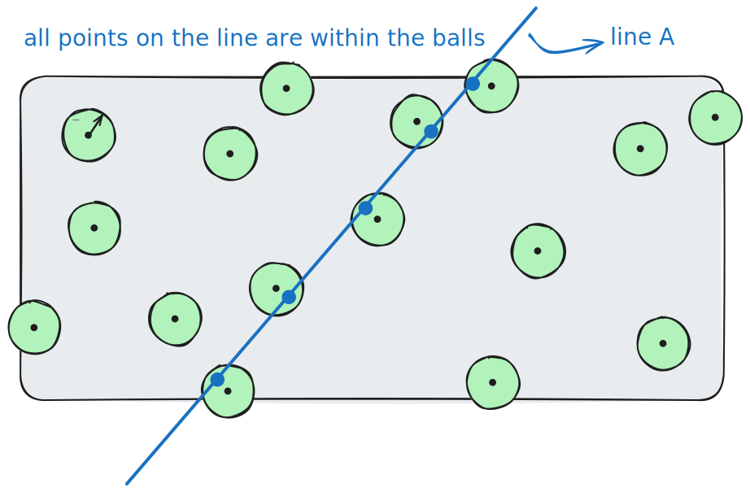

# [BCIKS20] Proximity Gaps 论文 soundness 解析

- Jade Xie <jade@secbit.io>
- Yu Guo  <yu.guo@secbit.io>

论文 [BCIKS20] 对 [BBHR18] 中的 FRI 协议的 soundness 进行了改进，主要分析了 batched FRI 的情况。本文将详细解析 [BCIKS20] 论文中关于 batched FRI soundness 的内容。

## Introduction

在交互证明，分布式存储以及密码学等背景下，出现了各种协议，这些协议引出了关于一个线性编码 $V \subset \mathbb{F}_q^n$ 的 proximity 问题，其中 $\mathbb{F}_q$ 是有限域，$V$ 的最小的相对距离为 $\delta_V$ 。这些协议假设我们可以获得关于一批向量 $\textbf{u} = \{u_0, \cdots, u_l \} \subset \mathbb{F}_q^n$ 的 oracle，它们的 soundness 要求每个向量 $u_i$ 在相对 Hamming 距离上接近 $V$ 。另外，soundness 是某些向量到 code $V$ 之间的最大距离的一个函数，如果这个距离变大，那么 Verifier 拒绝的概率会降低。因此，我们想找到这样的协议，能够最小化对 $\mathbf{u}$ 中元素的 query 的数量，同时最大化能识别某个向量 $u_i$ 明显远离 $V$ 的概率。

> ❓ **疑问**
> - [ ] 如何理解下面这句话？
> Furthermore, soundness deteriorates as a function of the largest distance between some vector ui and the code V .
> soundeness 会随着某些向量 $u_i$ 与 code $V$ 之间的最大距离的增加而降低，也就是此时 Verifier 拒绝的概率就降低了？
> - [ ] 如何对 soundness 降低进行清楚地讲解呢？

由于 $V$ 的线性性，一个自然的方法([RVW13])是：在 span($\textbf{u}$)(即 $\textbf{u}$ 中各元素的线性组合) 中均匀地随机一个向量 $u'$ ，记 $u'$ 与 $V$ 之间的距离为 $\Delta(u', V)$ ，将这个距离视为 $\textbf{u}$ 中某些元素与 $V$ 之间的最大距离的一个 proxy（代理）。为了证明 soundness ，我们想要即使只有一个 $u_i$ 距离 $V$ 中的所有元素有 $\delta$-远，那么随机选择的 $u'$ 也距离 $V$ 很远。

在下文中，用 $\Delta$ 表示相对 Hamming 距离。当 $\Delta(u, v) \le \delta$ 对某个 $v \in V$ 成立时，称为 “ $u$ 与 $V$ 的距离有 $\delta$ -近”，记作 $\Delta(u, V) \le \delta$ ；否则称为 “ $u$ 与 $V$ 的距离有 $\delta$ -远”，记作 $\Delta(u, V) > \delta$ 。

关于这个问题，一些研究结果为：
1. [AHIV17] 如果 $\delta < \delta_V /4$ ，几乎所有的 $u' \in \text{span}(\mathbf{u})$ 距离 $V$ 有 $\delta$ -远。
2. [RZ18] 将上述结果提高到 $\delta < \delta_V /3$ 。
3. [BKS18] 提高到 $\delta < 1 - \sqrt[4]{1 - \delta_V}$ 。
4. [BGKS20] 提高到 $\delta < 1 - \sqrt[3]{1 - \delta_V}$ ，但这个界对 RS 编码是 tight 的，因为当 $n = q$ 时可以达到这个界。

> 🤔 **思考**
> - [ ] 为什么研究的重心都想要提高这个 $\delta$ 的上界呢？关于这个问题，目前我的想法是：
> 	$\delta$ 的上界这里是和 $\delta_V$ 有关的，对于 RS code ，$\delta_V  = 1 - \rho$ ，实质也就是和码率相关，那么提高上界也就意味着降低了码率，那么就意味着更多的冗余，如果以相同的安全性，或者同样的高概率来拒绝出错的情况，此时需要的query就更少了。或者这样说，如果对于同样一个协议，query 的数量固定，$\delta$ 越大，拒绝的概率也就越大，也就提高了 soundness。
> - [ ] 上面分析的第 2 点与 “Furthermore, soundness deteriorates as a function of the largest distance between some vector $u_i$ and the code V .” 似乎矛盾，这句话说的是 $\delta$ 越大，soundness 越小？这一点该如何理解呢？

目前我们关心的一个问题是：对于哪些码以及什么范围的 $\delta$ ，以下的陈述成立？

如果某个 $u^* \in \text{span}(\mathbf{u})$ 与 $V$ 有 $\delta$ -远，那么对于几乎所有的 $u' \in \text{span}(\mathbf{u})$ ，$u'$ 与 $V$ 也有 $\delta$ -远。

[BCIKS20] 论文的主要结论之一表明，当 $V$ 是一个在足够大的域上的 RS 码（域的大小与码的块长度呈多项式关系）并且 $\delta$ 小于 Johnson/Guruswami-Sudan list decoding 界时，上述陈述成立。接下来，我们称其为 proximity gap 。

## Proximity Gaps

先给出 Proximity Gaps 的定义。

Definition 1.1 [BCIKS20, Definition 1.1] (Proximity gap). Let $P \subset \Sigma^n$ be a property and $C \subset 2^{\Sigma^n}$ be a collection of sets. Let $\Delta$ be a distance measure on $\Sigma^n$ . We say that $C$ displays a $(\delta, \epsilon)$ -proximity gap with respect to $P$ under $\Delta$ if every $S \in C$ satisfies exactly one of the following:

1. $\Pr_{s \in S} [\Delta(s, P) \le \delta] = 1$ .
2. $\Pr_{s \in S} [\Delta(s, P) \le \delta] \le \epsilon$ .

We call $\delta$ the proximity parameter and $\epsilon$ is the error parameter. By default, $\Delta$ denotes the relative Hamming distance measure.

对于 RS code ，如果 $V \subset \mathbb{F}^n$ 是 RS 编码 ，对应上述定义中的 $P$ ，并且 $A \subset \mathbb{F}^n$ 是一个 affine space (仿射空间) ，对应于上述定义中的 $S$ ，那么要么 $A$ 中的所有元素离 $V$ 有 $\delta$ -近，要么 $A$ 中的几乎所有元素离 $V$ 有 $\delta$ -远。换句话说，不会有这样的 affine space $A$ ，其中大概一半的元素离 $V$ 比较近，但同时另一半元素离 $V$ 比较远。

如下图所示，$A$ 是一个 affine space，这里用一条线表示，编码空间 $V$ 中的元素用黑色的点表示，以这些点为圆心，以 $\delta$  为半径画圆。那么只有两种情况：
1. 线 $A$ 上的所有元素都落入了绿色的圆形区域内。

2. 线上只有少量的元素落入了绿色的圆形区域内。

$A$ 中的元素不可能一半在圆形区域内，一半在圆形区域外，这也是 gap 的含义，将 $A$ 中的所有元素落入的情况分成了恰好分成了两种情况，而这两种情况之间根据相对 Hamming 距离形成了一个巨大的 gap 。

在下文中，用 $\mathbb{F}_q$ 表示大小为 $q$ 的有限域，$\text{RS}[\mathbb{F}_q,\mathcal{D},k]$ 表示维数为 $k+1$ ，块长度(blocklength) 为 $n = |\mathcal{D}|$ 的 RS 编码，其码字是在 $\mathcal{D}$ 上求值(evaluated)，次数 $\le k$ 的多项式。用 $\rho$ 表示码率， 则 $\rho = \frac{k+1}{n}$ 。$\delta$ 表示相对于 RS code 的相对 Hamming 距离，$\epsilon$ 表示 error 参数，也就是一个“坏事件(bad event)”发生的概率。

下面给出 RS code 的 Proximity gaps 定理。

**Theorem 1.2** [BCIKS20, Theorem 1.2] (Proximity gap for RS codes). The collection $C_{\text{Affine}}$ of affine spaces in $\mathbb{F}_q^n$ displays a $(\delta, \epsilon)$ -proximity gap with respect to the RS code $V := \text{RS}[\mathbb{F}_q, \mathcal{D}, k]$ of blocklength $n$ and rate $\rho = \frac{k+1}{n}$ , for any $\delta \in (0, 1 - \sqrt{\rho})$ , and $\epsilon = \epsilon(q, n, \rho, \delta)$ defined as the following piecewise function:

* Unique decoding bound: For $\delta \in [0,\frac{1 - \rho}{2})$ , the error parameter $\epsilon$ is

$$
\epsilon = \epsilon_\text{U} = \epsilon_\text{U}(q, n) := \frac{n}{q} \tag{1.1}
$$

* List decoding bound: For $\delta \in (\frac{1 - \rho}{2}, 1 - \sqrt{\rho})$ , setting $\eta := 1 - \sqrt{\rho} - \delta$ , the error parameter $\epsilon$ is

$$
\epsilon = \epsilon_\text{J} = \epsilon_\text{J}(q, n, \rho, \delta) := \frac{(k+1)^2}{\left(2 \min \left(\eta, \frac{\sqrt{\rho}}{20}\right)^7\right)q} = O \left(\frac{1}{(\eta \rho)^{O(1)}} \cdot \frac{n^2}{q} \right) \tag{1.2}
$$

> 🤔 **Question**
> - [ ] $\delta$ 越大，落入圆形区域的元素可能更多，也就是 $\epsilon_{\text{J}}$ 相比 $\epsilon_{\text{U}}$ 更大一些。是这个原因吗？

## Correlated agreements

论文中证明的主要定理是 correlated agreement ，对于在 $\mathbb{F}^{\mathcal{D}}$ 中的两个向量 $u_0, u_1 \in \mathbb{F}^{\mathcal{D}}$ ，在 $\mathbb{F}$ 中选一个随机数 $z$ ，我们关心用 $z$ 进行线性组合后的 $u_0 + zu_1$ 所形成的空间与 $V$ 之间的距离，也就是一维的 affine space $A = \{u_0 + z u_1 : z \in \mathbb{F}\}$ 。correlated agreement 结论说的是如果在 $A$ 中有足够多的元素距离 RS code 空间 $V$ 足够近（ $\delta$ - 近），那么一定存在一个非平凡的 subdomain $\mathcal{D}' \subset \mathcal{D}$ ，其大小至少是 $\mathcal{D}$ 大小的 $1 - \delta$ 倍，使得限制 $u_0, u_1$ 在 $\mathcal{D}'$ 上，有有效的 RS code $v_0, v_1$ ，满足它们分别在 $\mathcal{D}'$ 上与 $u_0, u_1$ 一致。我们就说这样的 $\mathcal{D}'$ 有 correlated agreement 性质，即 $u_0, u_1$ 和 $A$ 中的元素不仅分别与 RS 码有很大的 agreement ，而且还共享一个共同的很大的 agreement 集合。这个结果有两个参数范围，一个是 unique decoding 范围内的 proximity 参数，另一个是 list decoding 范围内的 proximity 参数。

以下给出了三种情况的 correlated agreement。结合论文中其他关于 correlated agreement 的结论，如下表所示。

|                                 | 空间 $U$                                                                                                     | $\Delta_u(u,V)$ | $\Delta_u(u,V)$ unique decoding | $\Delta_u(u,V)$ list decoding | $\text{agree}_{\mu}(u,V)$                      |
| ------------------------------- | ---------------------------------------------------------------------------------------------------------- | --------------- | ------------------------------- | ----------------------------- | ---------------------------------------------- |
| lines                           | $\{u_0 + z u_1 : z \in \mathbb{F}\}$                                                                       | Theorem 1.4     | Theorem 4.1                     | Theorem 5.1 & Theorem 5.2     |                                                |
| low-degree parameterized curves | $\text{curve}(\mathbf{u}) = \left\{u_z: = \sum_{i = 0}^{l}z^i \cdot u_i  \| z \in \mathbb{F}_q   \right\}$ | Theorem 1.5     | Theorem 6.1                     | Theorem 6.2                   | Theorem 7.1 & Theorem 7.2(Johnson bound 更精确版本) |
| affine spaces                   | $u_0 + \text{span}\{u_1, \cdots, u_l\}$                                                                    | Theorem 1.6     |                                 |                               | Theorem 7.3 & Theorem 7.4(Johnson bound 更精确版本) |

下面三个定理分别对应线、低次参数曲线以及 affine spaces 的 correlated agreement 定理。

**Theorem 1.4**  [BSCIK20, Theorem 1.4]  (Main Theorem - Correlated agreement over lines). Let $V, q, n, k$ and $\rho$ be as defined in Theorem 1.2. For $u_0, u_1 \in \mathbb{F}_q^{\mathcal{D}}$ , if $\delta \in (0, 1 - \sqrt{\rho})$ and

$$
\Pr_{z \in \mathbb{F}_q} [\Delta(u_0 + z \cdot u_1, V) \le \delta] > \epsilon, 
$$

where $\epsilon$ is as defined in Theorem 1.2, then there exist $D' \subset D$ and $v_0, v_1 \in V$ satisfying

* **Density**: $|D'|/|D| \ge 1 - \delta$ , and
* **Agreement**: $v_0$ agrees with $u_0$ and $v_1$ agrees with $u_1$ on all of $D'$ .

令 $\mathbf{u} = \{u_0, \ldots, u_l \} \subset \mathbb{F}_q^{\mathcal{D}}$ ，则次数为 $l$ 的 parameterized curve 是由 $\mathbf{u}$ 生成的如下的在 $\mathbb{F}_q^{\mathcal{D}}$ 中的向量的集合，

$$
\text{curve}(\mathbf{u}) := \left\{u_z: = \sum_{i = 0}^{l}z^i \cdot u_i \Bigg| z \in \mathbb{F}_q   \right\} 
$$

**Theorem 1.5** [BSCIK20, Theorem 1.5] (Correlated agreement for low-degree parameterized curves). Let $V, q, n, k$ and $\rho$ be as defined in Theorem 1.2. Let $\mathbf{u} = \{u_0, \cdots, u_l\} \subset \mathbb{F}_q^{\mathcal{D}}$ . If $\delta \in (0, 1 - \sqrt{\rho})$ and 

$$
\Pr_{u \in \text{curve}(u)} [\Delta(\mathbf{u}, V) \le \delta] > l \cdot \epsilon,
$$

where $\epsilon$ is as defined in Theorem 1.2, then there exist $\mathcal{D}' \subset \mathcal{D}$ and $v_0, \cdots, v_l \in V$ satisfying

* **Density**: $|\mathcal{D}'|/|\mathcal{D}| \ge 1 - \delta$ , and
* **Agreement**: for all $i \in \{0, \cdots, l\}$ , the functions $u_i$ and $v_i$ agree on all of $\mathcal{D}'$ .

**Theorem 1.6** [BSCIK20, Theorem 1.6] (Correlated agreement over affine spaces). Let $V, q, n, k$ and $\rho$ be as defined in Theorem 1.2. For $u_0, u_1, \cdots, u_l \in \mathbb{F}_q^{\mathcal{D}}$ let $U = u_0 + \text{span}\{u_1, \cdots, u_l\} \subset \mathbb{F}_q^{\mathcal{D}}$ be an affine subspace. If $\delta \in (0, 1 - \sqrt{\rho})$ and

$$
\Pr_{u \in U} [\Delta(u, V) \le \delta] > \epsilon,
$$

where $\epsilon$ is as defined in Theorem 1.2, then there exist $\mathcal{D}' \subset \mathcal{D}$ and $v_0, \cdots, v_l \in V$ satisfying

* **Density**: $|\mathcal{D}'|/|\mathcal{D}| \ge 1 - \delta$ , and
* **Agreement**: for all $i \in \{0, \cdots, l\}$ , the functions $u_i$ and $v_i$ agree on all of $\mathcal{D}'$ .

Furthermore, in the unique decoding regime $\delta \in \left(0, \frac{1 - \rho}{2}\right]$ , there exists a unique maximal $\mathcal{D}'$ satisfying the above, with unique $v_i$ .

## Correlated Weighted Agreement

如果要分析 FRI 协议的 soundness ，就需要 Theorem 1.5 的 weighted 版本。

对于一个给定的 weight 向量 $\mu : \mathcal{D} \rightarrow [0,1]$ ，$u,v$ 之间(相对的) $\mu$ -agremment 定义为

$$
\text{agree}_{\mu}(u,v) := \frac{1}{|\mathcal{D}|} \sum_{x:u(x) = v(x)} \mu(x).
$$

也就是在权重 $\mu$ 之下看 $u$ 与 $v$ 在 $\mathcal{D}$ 上一致的比例有多少。如果令 $\mu \equiv 1$ ，那么

$$
\text{agree}_{\mu}(u,v) = \frac{1}{|\mathcal{D}|} \sum_{x:u(x) = v(x)} 1 = 1 - \frac{1}{|\mathcal{D}|} \sum_{x:u(x) \neq v(x)} 1 = 1 - \Delta(u,v).
$$

一个 word $u$ 与一个线性码 $V$ 之间的 agreement 为 $u$ 与 $V$ 之间的一个码字之间的最大的 agreement ，

$$
\text{agree}_{\mu}(u,V) := \max_{v \in V} \text{agree}_{\mu}(u,v).
$$

定义 subdomain $\mathcal{D}' \subset \mathcal{D}$ 的加权(weighted) 大小为

$$
\mu(\mathcal{D}') := \frac{1}{|\mathcal{D}|}\sum_{x \in \mathcal{D}'} \mu(x).
$$

将上面定义中的 $\mathcal{D}'$ 定义为 $\{x \in \mathcal{D}: u(x) = v(x)\}$ ，则 agreement 满足 $\text{agree}_{\mu}(u,v) = \mu(\{x \in \mathcal{D}: u(x) = v(x)\})$ 。

最后，对于 $\mathbf{u} = \{u_0, \cdots, u_l\}$ ，其中 $u_i \in \mathbb{F}_q^{\mathcal{D}}$ 是一组 word ，$\mu$ -weighted correlated agreement 是 subdomain $\mathcal{D}' \subset \mathcal{D}$ 的最大 $\mu$ -weighted 大小，使得 $\mathbf{u}$ 在 $\mathcal{D}'$ 上的限制属于 $V|_{\mathcal{D}'}$ ，即对于每个 $i = 0, \cdots, l$ ，存在 $v_i \in V$ 使得 $u_i|_{\mathcal{D}'} = v_i|_{\mathcal{D}'}$ 。当 $\mu$ 未指定时，它被设置为常数权重函数 1 ，这恢复了在前面讨论的 correlated agreement 度量的概念。

接下来，我们假设权重函数 $\mu$ 具有某些结构，具体来说，所有权重 $\mu(x)$ 都是形式 $\mu(x) = \frac{a_x}{M}$ ，其中 $a_x$ 是变化的整数，且有共同的分母 $M$ 。对于 FRI soundness 的特殊情况（其中 $M$ 等于应用 FRI 协议的 RS 码的 blocklength），这个假设确实成立。以下是定理 1.5 的加权推广。

**Theorem 7.1** [BSCIK20, Theorem 7.1] (Weighted correlated agreement over curves – Version I). Let $V, q, n, k$ and $\rho$ be as defined in Theorem 1.2. Let $\mathbf{u} = \{u_0, \cdots, u_l\} \subset \mathbb{F}_q^{\mathcal{D}}$ . Let $\alpha \in (\sqrt{\rho}, 1)$ and let $\mu : \mathcal{D} \rightarrow [0,1]$ be a vector of weights, whose values all have denominator $M$ . Suppose

$$
\Pr_{u \in \text{curve}(\mathbf{u})} [\text{agree}_{\mu}(u,V) \ge \alpha] > l \cdot \epsilon,
$$

where $\epsilon$ is as defined in Theorem 1.2 (with $\eta = \min(\alpha - \sqrt{\rho}, \frac{\sqrt{\rho}}{20})$ ), and additionally suppose

$$
\Pr_{u \in \text{curve}(\mathbf{u})} [\text{agree}_{\mu}(u,V) \ge \alpha] \ge \frac{l(M|\mathcal{D}|+1)}{q} \left(\frac{1}{\eta} + \frac{3}{\sqrt{\rho}}\right) .
$$

Then there exists $\mathcal{D}' \subset \mathcal{D}$ and $v_0, \cdots, v_l \in V$ satisfying

* **Density**: $\mu(\mathcal{D}') \ge \alpha$ , and
* **Agreement**: for all $i \in \{0, \cdots, l\}$ , the functions $u_i$ and $v_i$ agree on all of $\mathcal{D}'$ .

仅适用于 Johnson 界限范围的一种更精确的形式如下。

**Theorem 7.2** [BSCIK20, Theorem 7.2] (Weighted correlated agreement over curves – Version II). Let $V, q, n, k$ and $\rho$ be as defined in Theorem 1.2. Let $\mathbf{u} = \{u_0, \cdots, u_l\} \subset \mathbb{F}_q^{\mathcal{D}}$ . Let $\mu : \mathcal{D} \rightarrow [0,1]$ be a vector of weights, whose values all have denominator $M$ . Let $m \ge 3$ and let 

$$
\alpha \ge \alpha_0(\rho, m) := \sqrt{\rho} + \frac{\rho}{2m}.
$$

Let 

$$
S = \{z \in \mathbb{F}_q : \text{agree}_{\mu}(u_0 + zu_1 + \cdots + z^lu_l, V) \ge \alpha\}
$$

and suppose

$$
|S| > \max\left(\frac{(1 + \frac{1}{2m})^7 m^7}{3 \rho^{3/2}}n^2 l,  \frac{2m + 1}{\sqrt{\rho}}(M \cdot n + 1)l \right) . \tag{7.1}
$$

Then $u_0, \ldots, u_l$ have at least $\alpha$ correlated $\mu$ -agreement with $V$ , i.e. $\exists v_0, \cdots, v_l \in V$ such that

$$
\mu(\{x \in \mathcal{D}: \forall 0 \le i \le l, u_i(x) = v_i(x)\}) \ge \alpha .
$$

**Theorem 7.3** [BSCIK20, Theorem 7.3] (Weighted correlated agreement over affine spaces). Let $V, q, n, k$ and $\rho$ be as defined in Theorem 1.2. Let $\mathbf{u} = \{u_0, \cdots, u_l\} \subset \mathbb{F}_q^{\mathcal{D}}$ and let $U = u_0 + \text{span}\{u_1, \cdots, u_l\} \subset \mathbb{F}_q^{\mathcal{D}}$ be an affine subspace. Let $\alpha \in (\sqrt{\rho}, 1)$ and let $\mu : \mathcal{D} \rightarrow [0,1]$ be a vector of weights, whose values all have denominator $M$ . Suppose

$$
\Pr_{u \in U} [\text{agree}_{\mu}(u,V) \ge \alpha] > \epsilon,
$$
    
where $\epsilon$ is as defined in Theorem 1.2 (with $\eta = \min(\alpha - \sqrt{\rho}, \frac{\sqrt{\rho}}{20})$ ), and additionally suppose

$$
\Pr_{u \in U} [\text{agree}_{\mu}(u,V) \ge \alpha] \ge \frac{M|\mathcal{D}| + 1}{q} \left(\frac{1}{\eta} + \frac{3}{\sqrt{\rho}}\right) .
$$

Then there exist $\mathcal{D}' \subset \mathcal{D}$ and $v_0, \cdots, v_l \in V$ satisfying

* **$\mu$-Density**: $\mu(\mathcal{D}') \ge \alpha$ , and
* **Agreement**: for all $i \in \{0, \cdots, l\}$ , the functions $u_i$ and $v_i$ agree on all of $\mathcal{D}'$ .

同样地，对于 Theorem 7.3 也有关于 Johnson 界限的更精确的形式。

**Theorem 7.4** [BSCIK20, Theorem 7.4] (Weighted correlated agreement over affine spaces – Version II). Let $V, q, n, k$ and $\rho$ be as defined in Theorem 1.2. Let $\mathbf{u} = \{u_0, \cdots, u_l\} \subset \mathbb{F}_q^{\mathcal{D}}$ and let $U = u_0 + \text{span}\{u_1, \cdots, u_l\} \subset \mathbb{F}_q^{\mathcal{D}}$ be an affine subspace. Let $\mu : \mathcal{D} \rightarrow [0,1]$ be a vector of weights, whose values all have denominator $M$ . Let $m \ge 3$ and let

$$
\alpha \ge \alpha_0(\rho, m) := \sqrt{\rho} +  \frac{\sqrt{\rho}}{2m} .
$$

Suppose

$$
\Pr_{u \in U} [\text{agree}_{\mu}(u,V) \ge \alpha] > \max \left( \frac{(1 + \frac{1}{2m})^7m^7}{3 \rho^{3/2}} \cdot \frac{n^2}{q}, \frac{2m + 1}{\sqrt{\rho}} \cdot \frac{M \cdot n + 1}{q} \right) . \tag{7.2}
$$

Then $u_0, \ldots, u_l$ have at least $\alpha$ correlated $\mu$ -agreement with $V$ , i.e. $\exists v_0, \cdots, v_l \in V$ such that

$$
\mu \left(\{x \in \mathcal{D} : \forall 0 \le i \le l, u_i(x) = v_i(x)\}\right) \ge \alpha .
$$

## FRI 协议

FRI 协议的目的是为了在 IOP 模型中，去解决 Reed-Solomon proximity testing 问题，即对于一个接收到的 word $f^{(0)}: \mathcal{D}^{(0)} \rightarrow \mathbb{F}$ ，验证它到 $V^{(0)} := \text{RS}[\mathbb{F}, \mathcal{D}^{(0)}, k^{(0)}]$ 之间的 proximity ，如果 $f^{(0)}$ 属于 $V^{(0)}$ ，就接受；如果距离 $V^{(0)}$ 有 $\delta$ 远，就拒绝。FRI 协议适用于任何 evaluation domain $\mathcal{D}^{(0)}$ 是 *2-smooth 群* 的陪集的情况，即对于任何的 $\mathcal{D}^{(0)}$ ，其是一个大小为 $2^s$ 的（加法或乘法）群的陪集，其中 $s$ 是一个整数。因此，为简化描述，假设群 $\mathcal{D}^{(0)}$ 是乘法的。FRI 协议有两个阶段，分别是 COMMIT 阶段与 QUERY 阶段。

在 COMMIT 阶段，经过有限次 $r$ 轮的交互，会生成一系列的函数 $f^{(1)}: \mathcal{D}^{(1)} \rightarrow \mathbb{F}, f^{(2)}: \mathcal{D}^{(2)} \rightarrow \mathbb{F}, \cdots,f^{(r)}: \mathcal{D}^{(r)} \rightarrow \mathbb{F}$ 。每一次迭代， domain 的大小 $|\mathcal{D}^{(i)}|$ 都会缩小。假设对于一个诚实的 prover， $f^{(0)}$ 是 low-degree ，那么对于每一个 $f^{(i)}$ ，它们也都会是 low-degree 的（见命题 1）。在第 $i$-轮开始时，prover 的消息 $f^{(i)}: \mathcal{D}^{(i)} \rightarrow \mathbb{F}$ 已经生成，并且 verifier 可以访问该消息的 oracle 。Verifier 现在发送一个均匀随机的 $z^{(i)} \in \mathbb{F}$ ，然后 prover 回复一个新的函数 $f^{(i+1)}: \mathcal{D}^{(i+1)} \rightarrow \mathbb{F}$ ，其中 $\mathcal{D}^{(i+1)}$ 是 $\mathcal{D}^{(i)}$ 的一个（2-smooth）strict 子群，意思是 $\mathcal{D}^{(i)}$ 不仅是 $\mathcal{D}^{(i+1)}$ 的子群，同时也是其真子集。

$\mathcal{D}^{(i+1)}$ 将 $\mathcal{D}^{(i)}$ 划分成大小为 $l^{(i)} := |\mathcal{D}^{(i)}|/|\mathcal{D}^{(i+1)}|$ 的陪集。令 $C_g^{(i)}$ 表示对应于 $g \in \mathcal{D}^{(i+1)}$ 的陪集，即

$$
\begin{equation}
    C_g^{(i)} := \{g' \in \mathcal{D}^{(i)} \mid (g')^{l^{(i)}} = g\}. \tag{8.1}
\end{equation}
$$

意思就是在 $\mathcal{D}^{(i)}$ 中选取那些能够通过映射 $q(x) = x^{l^{(i)}}$ 映射到 $\mathcal{D}^{(i+1)}$ 中的 $g$ 的元素，这些元素组成了集合 $C_g^{(i)}$ ，其也是陪集。

对于每个陪集 $C_g^{(i)}$ ，*插值映射(interpolation map)* $M_g^{(i)}$ 是一个可逆的线性映射 $M_g^{(i)}: \mathbb{F}^{C_g^{(i)}} \rightarrow \mathbb{F}^{l^{(i)}}$ ，它将 $f^{(i)}|_{C_g^{(i)}}: C_g^{(i)} \rightarrow \mathbb{F}$ （即限制 $f^{(i)}$ 在 domain $C_g^{(i)} \subset \mathcal{D}^{(i)}$ 上）映射到多项式 $P_{\mathbf{u}^{(i)}(g)}^{(i)}(Z) = \sum_{j<l^{(i)}} u_j^{(i)}(g) Z^j$ 的系数向量 $\mathbf{u}^{(i)}(g) = (u_0^{(i)}(g), \ldots, u_{l^{(i)}-1}^{(i)}(g))^{\intercal}$ （这里与论文原文表示一致，都表示列向量，不过原文没有加上转置符号），其中 $P_{\mathbf{u}^{(i)}(g)}^{(i)}(Z)$ 是插值 $f^{(i)}|_{C_g^{(i)}}$ 的多项式。换句话说，$M_g^{(i)}$ 是由 $C_g^{(i)}$ 生成的 Vandermonde 矩阵的逆，这意味着 $\left(M_g^{(i)}\right)^{-1} \cdot {\color{}(u_0, \ldots, u_{l^{(i)}-1})^{\intercal}}$ 是多项式 $P_{\mathbf{u}}(X) = \sum_{i<l^{(i)}} u_i X^i$ 在陪集 $C_g^{(i)}$ 上的 evaluation 。

> 👀 **Notice**
> 本文为保持前后一致，用 $(x_0, \ldots, x_n)$表示行向量，而 $(x_0, \ldots, x_n)^{\intercal}$ 表示列向量，也可写为：
> $$
> \begin{bmatrix}
> x_0\\
> x_1\\
> \vdots\\
> x_n
> \end{bmatrix}
> $$

下面详细解释下上面对插值映射的描述。根据 $C_g^{(i)}$ 的定义，知道其中的元素有 $l^{(i)}$ 个，设 $C_g^{(i)} =\{g'_1, \cdots, g'_{l^{(i)}}\}$ ，我们可以将由 $C_g^{(i)}$ 生成的 Vandermonde 矩阵写出来：

$$
V_{C_g^{(i)}}=
    \begin{bmatrix}
        1 & g'_1 & (g'_1)^2 & \cdots & (g'_1)^{l^{(i)}-1} \\
        1 & g'_2 & (g'_2)^2 & \cdots & (g'_2)^{l^{(i)}-1} \\
        \vdots & \vdots & \vdots & \ddots & \vdots \\
        1 & g'_{l^{(i)}} & (g'_{l^{(i)}})^2 & \cdots & (g'_{l^{(i)}})^{l^{(i)}-1}
    \end{bmatrix}
$$

则 $M_g^{(i)} = V_{C_g^{(i)}}^{-1}$ ，是由 $C_g^{(i)}$ 生成的 Vandermonde 矩阵的逆，因此

$$
\begin{aligned}
    \left(M_g^{(i)}\right)^{-1} \cdot (u_0, \ldots, u_{l^{(i)}-1})^{\intercal} & = \left(V_{C_g^{(i)}}^{-1}\right)^{-1} \cdot (u_0, \ldots, u_{l^{(i)}-1})^{\intercal} \\
    & = V_{C_g^{(i)}} \cdot (u_0, \ldots, u_{l^{(i)}-1})^{\intercal} \\
    & = 
    \begin{bmatrix}
        1 & g'_1 & (g'_1)^2 & \cdots & (g'_1)^{l^{(i)}-1} \\
        1 & g'_2 & (g'_2)^2 & \cdots & (g'_2)^{l^{(i)}-1} \\
        \vdots & \vdots & \vdots & \ddots & \vdots \\
        1 & g'_{l^{(i)}} & (g'_{l^{(i)}})^2 & \cdots & (g'_{l^{(i)}})^{l^{(i)}-1}
    \end{bmatrix}
    \begin{bmatrix}
        u_0\\
        u_1\\
        \vdots\\
        u_{l^{(i)}-1}
    \end{bmatrix} \\
    & = \begin{bmatrix}
        u_0 + u_1 g'_1 + u_2 (g'_1)^2 + \cdots + u_{l^{(i)}-1} (g'_1)^{l^{(i)}-1}\\
        u_0 + u_1 g'_2 + u_2 (g'_2)^2 + \cdots + u_{l^{(i)}-1} (g'_2)^{l^{(i)}-1}\\
        \vdots \\
        u_0 + u_1 g'_{l^{(i)}} + u_2 (g'_{l^{(i)}})^2 + \cdots + u_{l^{(i)}-1} (g'_{l^{(i)}})^{l^{(i)}-1}
    \end{bmatrix} \\
    & = \begin{bmatrix}
        P_{\mathbf{u}}(g'_1)\\
        P_{\mathbf{u}}(g'_2)\\
        \vdots \\
        P_{\mathbf{u}}(g'_{l^{(i)}})
    \end{bmatrix}
\end{aligned}
$$

通过上述推导看出 $\left(P_{\mathbf{u}}(g'_1),  P_{\mathbf{u}}(g'_2) \cdots, P_{\mathbf{u}}(g'_{l^{(i)}}) \right)^{\intercal}$ 是多项式 $P_{\mathbf{u}}(X) = \sum_{i<l^{(i)}} u_i X^i$ 在陪集 $C_g^{(i)}$ 上的 evaluation ，因此 $\left(M_g^{(i)}\right)^{-1} \cdot (u_0, \ldots, u_{l^{(i)}-1})^{\intercal}$ 是多项式 $P_{\mathbf{u}}(X) = \sum_{i<l^{(i)}} u_i X^i$ 在陪集 $C_g^{(i)}$ 上的 evaluation 。

下面的命题使用了上述的符号，重新叙述了 [BBHR18, Section 4.1]，与 [BBHR18, Section 4.1] 不同的是，是在乘法群而不是加法群上进行的。该命题描述的就是保持 low-degree 的性质。

**Claim 1** [BCIKS20, Claim 8.1]. Suppose that $f^{(i)} \in \text{RS}[\mathbb{F}, \mathcal{D}^{(i)}, k^{(i)}]$ where $k^{(i)} + 1$ is an integral power of $2$ . Then, for any $z^{(i)} \in \mathbb{F}$, letting $\mathbf{z}^{(i)} = \left(\left(z^{(i)}\right)^0, \left(z^{(i)}\right)^1, \ldots, \left(z^{(i)}\right)^{l^{(i)}-1}\right)^{\intercal}$, the function $f_{f^{(i)},z^{(i)}}^{(i+1)}: \mathcal{D}^{(i+1)} \rightarrow \mathbb{F}$ defined on $g \in \mathcal{D}^{(i+1)}$ by

$$
\begin{equation}
    f_{f^{(i)},z^{(i)}}^{(i+1)}(g) := {\color{}\left(\mathbf{z}^{(i)}\right)^{\intercal}  \cdot \mathbf{u}^{(i)}(g) = \left(\mathbf{z}^{(i)}\right)^{\intercal} \cdot M_g^{(i)} \cdot f^{(i)}|_{C_g^{(i)}}} \tag{2}
\end{equation}
$$

is a valid codeword of $V^{(i+1)} := \text{RS}[\mathbb{F}, \mathcal{D}^{(i+1)}, k^{(i+1)}]$ where $k^{(i+1)} := \frac{k^{(i)}+1}{l^{(i)}} - 1$.

根据 [BBHR18] 以及上面的记号，在 FRI 协议的 COMMIT 阶段，固定一个 $g \in \mathcal{D}^{(i+1)}$ ，下一步构造的 $f_{f^{(i)},z^{(i)}}^{(i+1)}(g) := P_{\mathbf{u}^{(i)}(g)}^{(i)}(z^{(i)})$ ，下面理解下上述构造的式子。

$$
\begin{aligned}
    f_{f^{(i)},z^{(i)}}^{(i+1)}(g) & = P_{\mathbf{u}^{(i)}(g)}^{(i)}(z^{(i)}) \\
    & = \sum_{j<l^{(i)}} u_j^{(i)}(g) \cdot (z^{(i)})^j \\
    & = \left(z^{(i)}\right)^0  \cdot u_0^{(i)}(g) + \left(z^{(i)}\right)^1 \cdot u_1^{(i)}(g) + \cdots + \left(z^{(i)}\right)^{l^{(i)}-1} \cdot u_{l^{(i)}-1}^{(i)}(g) \\
    & = \begin{bmatrix}
        \left(z^{(i)}\right)^0 & \left(z^{(i)}\right)^1 & \cdots & \left(z^{(i)}\right)^{l^{(i)}-1}
    \end{bmatrix} \cdot
    \begin{bmatrix}
        u_0^{(i)}(g)\\
        u_1^{(i)}(g)\\
        \vdots\\
        u_{l^{(i)}-1}^{(i)}(g)
    \end{bmatrix} \\
    & = \left(\mathbf{z}^{(i)}\right)^{\intercal}  \cdot \mathbf{u}^{(i)}(g)
\end{aligned}
$$

下面说明下命题 1 给的第二个等式，即 $\mathbf{u}^{(i)}(g) = M_g^{(i)} \cdot f^{(i)}|_{C_g^{(i)}}$ 。根据前面的分析，对于由 $C_g^{(i)}$ 生成的 Vandermonde 矩阵有

$$
V_{C_g^{(i)}} \cdot
\begin{bmatrix}
    u_0^{(i)}\\
    u_1^{(i)}\\
    \vdots\\
    u_{l^{(i)}-1}^{(i)}
\end{bmatrix}
= \begin{bmatrix}
        P_{\mathbf{u}}(g'_1)\\
        P_{\mathbf{u}}(g'_2)\\
        \vdots \\
        P_{\mathbf{u}}(g'_{l^{(i)}})
\end{bmatrix}
= \begin{bmatrix}
        f^{(i)}|_{C_g^{(i)}}(g'_1)\\
        f^{(i)}|_{C_g^{(i)}}(g'_2)\\
        \vdots \\
        f^{(i)}|_{C_g^{(i)}}(g'_{l^{(i)}})
\end{bmatrix}
$$

因此

$$
\begin{bmatrix}
    u_0^{(i)}\\
    u_1^{(i)}\\
    \vdots\\
    u_{l^{(i)}-1}^{(i)}
\end{bmatrix}
= 
\left(V_{C_g^{(i)}}\right)^{-1} \cdot 
\begin{bmatrix}
        f^{(i)}|_{C_g^{(i)}}(g'_1)\\
        f^{(i)}|_{C_g^{(i)}}(g'_2)\\
        \vdots \\
        f^{(i)}|_{C_g^{(i)}}(g'_{l^{(i)}})
\end{bmatrix}
= M_g^{(i)} \cdot f^{(i)}|_{C_g^{(i)}}
$$

由此得到了 $\left(\mathbf{u}^{(i)}(g)\right)^{\intercal}  = M_g^{(i)} \cdot f^{(i)}|_{C_g^{(i)}}$ 。

## Batching

在某些情况下，第一个 prover 的 oracle $f^{(0)}$ 是从一个仿射空间 $F \subset \mathbb{F}^{\mathcal{D}^{(0)}}$ 的函数中采样的，这个仿射空间作为我们的输入，

$$
\begin{equation}
    F = \left\{ f_0^{(0)} + \sum_{i=1}^{t} x_i \cdot f_i^{(0)} \mid x_i \in \mathbb{F}, f_i : \mathcal{D}^{(0)} \to \mathbb{F} \right\} \tag{3}
\end{equation} 
$$

当使用 FRI 协议来 “batch” 多个不同的 low degree testing 问题实例时，我们就通过随机线性组合将它们全部组合在一起，即上式中的 $f_0^{(0)} + x_1 f_1^{(0)} + \cdots +x_t f_t^{(0)}$ 。在这种 batching 设置中，我们假设 prover 已经承诺了 $f_1^{(0)}, \ldots, f_t^{(0)}$ （注意在这种情况下我们设 $f_0^{(0)} = 0$），并且 batched FRI 的 verifier 从 $\mathbb{F}$ 中均匀随机地采样 $x_1, \ldots, x_t \in \mathbb{F}$， prover 答复 $f^{(0)}$ ，其应该等于 $f_0^{(0)} + \sum_{i=1}^{t} x_i \cdot f_i^{(0)}$ ，现在 FRI 协议就应用于 $f^{(0)}$ 了。相应地，batched FRI 的 QUERY 阶段也被扩展了，因此每次请求 $f^{(0)}(g)$ 的查询时，验证者同时也查询了 $f_0^{(0)}(g), \ldots, f^{(0)}_t(g)$ 并验证 $f^{(0)}(g) = f_0^{(0)}(g) + \sum_{i=1}^{t} {\color{orange}x_i} \cdot f^{(0)}_i(g)$。

> 🐞 **Fix**
> - [ ] 论文这里的公式为 $f^{(0)}(g) = f_0^{(0)}(g) + \sum_{i=1}^{t} f^{(0)}_i(g)$ ，我认为这里少了前面的系数 $x_i$ ，应该为 $f^{(0)}(g) = f_0^{(0)}(g) + \sum_{i=1}^{t} x_i \cdot f^{(0)}_i(g)$ 。

### The (batched) FRI QUERY phase

命题 1 表明对于诚实的 prover ，verifier 选取任意的值 $z^{(i)}$ ，对于每一个 $y \in D^{(i+1)}$ ，prover 都可以通过计算 $(2)$ 式，从一个码字 $f^{(i)} \in V^{(i)}$ 构建一个新的码字 $f^{(i+1)} \in V^{(i+1)}$ 。因此，我们将始终假设 $f^{(r)} \in V^{(r)}$，例如，通过假设验证者总是查询 $f^{(r)}$ 的前 $k^{(r)}$ 个元素（按照某种规范顺序）并将 $f^{(r)}$ 与该函数的插值多项式进行比较。

命题 1 给出了一种非常自然的测试方法，用来检查 $f^{(i)}$ 和 $f^{(i+1)}$ 之间的一致性，并且 FRI 的查询阶段通过从 “顶部”（$f^{(r)}$）到 “底部”（$f^{(0)}$）迭代应用这种自然测试来遵循这一过程。

> 🤔 **Question**
> - [ ] 如何更好地去解释这里的自然的测试方法呢？

### A single invocation of the FRI QUERY phase

1. 从 $\mathcal{D}^{(r)}$ 中均匀随机地选取 $g^{(r)}$ 。对于 $i = r, \cdots, 1$ ，从陪集 $C_{g^{(i)}}^{(i-1)}$ 中均匀随机地选取 $g^{(i-1)}$ 。
2. 如果 $f^{(0)}(g^{(0)}) \neq f_0^{(0)}(g^{(0)}) + \sum_{i = 1}^{t}x_i \cdot f_i^{(0)}(g^{(0)})$ ，则拒绝。
3. 如果，对于任意地 $i \in \{0, \cdots, r - 1\}$ ，有 $f^{(i+1)}(g^{(i+1)}) \neq \left(\mathbf{z}^{(i)}\right)^{\intercal} \cdot M_g^{(i)} \cdot f^{(i)}|_{C_g^{(i)}}$ ，则拒绝。
4. 否则 —— 如果上述条件中的所有等式都成立，则接受。

上述 QUERY 过程与 [BBHR18] 中 FRI 的 QUERY 过程有所不同，这里选取随机数是从最后一个 $\mathcal{D}^{(r)}$ 中开始选取的，而不是从初始的 $\mathcal{D}^{(0)}$ 中选取的。相比[BBHR18] 中的 QUERY 阶段，这里我们还想要验证在第 $0$ 步时，batch 的是否正确，也就是 $f^{(0)}(g^{(0)}) \neq f_0^{(0)}(g^{(0)}) + \sum_{i = 1}^{t}x_i \cdot f_i^{(0)}(g^{(0)})$ 。

### Summary of the batched FRI protocol

下面总结下目前提到的比较重要的性质，将会在下面的 soundness 分析中用到。

1. 在协议的 COMMIT 阶段结束时，verifier 可以通过 oracle 访问一系列函数 $f^{(0)}: \mathcal{D}^{(0)} \rightarrow \mathbb{F}, \ldots, f^{(r)}: \mathcal{D}^{(r)} \rightarrow \mathbb{F}$ ，其中 $\mathcal{D}^{(0)} \supsetneq  \ldots \supsetneq \mathcal{D}^{(r)}$ 是一系列 $2$-smooth 群，并且 $f^{(i)}$ 任意依赖于 $z^{(0)}, \ldots, z^{(i)}$ （以及 $f^{(0)}, \ldots, f^{(i-1)}$）。我们假设 $f^{(r)} \in V^{(r)}$。
2. 存在一组 $l^{(i)} \times l^{(i)}$ 的可逆矩阵 $\{M_{g^{(i+1)}}^{(i)} : g^{(i+1)} \in D^{(i+1)}\}$ ，因此将 $M_{g^{(i+1)}}^{(i)}$ 应用于 $f^{(i)}|_{C_{g(i+1)}^{(i)}}$ 可以将 $f^{(i)}$ 映射到一个向量序列 $\mathbf{u} = \mathbf{u}^{(i)} = \{u_0^{(i)}, \ldots, u_{l(i)}^{(i)}\} \subset \mathbb{F}^{D^{(i+1)}}$ ，其中

$$
\mathbf{u}^{(i)}\left(g^{(i+1)}\right)  = \left(u_0^{(i)}\left(g^{(i+1)}\right), \cdots, u_{l^{(i)}-1}^{(i)}\left(g^{(i+1)}\right) \right) = {\color{}M_{g^{(i+1)}}^{(i)} \cdot f^{(i)}|_{C_{g(i+1)}^{(i)}}}. \tag{4}
$$

此外，如果 $f^{(i)}$ 是在 $D^{(i)}$ 上码率为 $\rho$ 的有效 RS 码字，那么通过 $\mathbf{u}^{(i)}$ 的参数化曲线上的每个向量也是在 $D^{(i+1)}$ 上码率为 $\rho$ 的有效 RS 码字。

1. 在 QUERY 阶段的每次迭代会检查 $f^{(i+1)}$ 是否是通过方程 $(2)$ 从 $f^{(i)}$ 构造的，并且（在 batched 的情况下）检查 $f^{(0)}$ 是否是通过方程 $(3)$ 正确计算的。

## Soundness

**Lemma 8.2** [BSCIK20, Lemma 8.2] (batched FRI error bound). Let $V^{(0)} = \text{RS}[\mathbb{F}, \mathcal{D}^{(0)}, k^{(0)}]$ where $\mathcal{D}^{(0)}$ is a coset of a $2$-smooth multiplicative group, and $k^{(0)} + 1$ is a power of $2$; set $\rho = (k^{(0)} + 1)/|\mathcal{D}^{(0)}|$. 

Let $F \subseteq \mathbb{F}^{\mathcal{D}^{(0)}}$ be a space of functions as defined in Eq. $(3)$ whose correlated agreement density with $V^{(0)}$ is $\alpha$. For interger $m \ge 3$ , let

$$
\alpha^{(0)}(\rho, m) = \max\left\{ \alpha, \sqrt{\rho}(1 + 1/2m) \right\}.
$$

Assume the FRI protocol is used with $r$ rounds, and let $l^{(i)} = |\mathcal{D}^{(i)}|/|\mathcal{D}^{(i+1)}|$ denote the ratio between prover messages (oracles) $i$ and $i + 1$. Let $\epsilon_Q$ denote the probability that the verifier accepts a single FRI QUERY invocation. Then,

$$
\Pr_{x_1, \ldots, x_t, z^{(0)}, \ldots, z^{(r-1)}}\left[ \epsilon_Q > \alpha^{(0)}(\rho, m) \right] \le \epsilon_{\text{C}}, \tag{8.5}
$$
    
where

$$
\epsilon_{\text{C}} = \frac{\left(m + \frac{1}{2}\right)^7 \cdot \vert \mathcal{D}^{(0)}\vert^2}{2 \rho^{3/2} \vert \mathbb{F} \vert} + \frac{(2m+1) \cdot (\vert \mathcal{D}^{(0)}\vert + 1)}{\sqrt{\rho}} \cdot \frac{\sum_{i = 0}^{r - 1} l^{(i)}}{\vert \mathbb{F} \vert}.
$$

In words: For any interactive FRI prover $P^*$, the probability that the oracles $f^{(0)}, \ldots, f^{(r)}$ sent by $P^*$ will pass a single invocation of the batched FRI QUERY test with probability greater than $\alpha^{(0)}(\rho, m)$, is smaller than $\epsilon_{\text{C}}$. The probability is over the random variables $x_1, \ldots, x_t$ used to sample $f^{(0)}$ from $F$ and over the random messages $z^{(0)}, \ldots, z^{(r-1)}$ sent by the verifier during the COMMIT phase.

**Theorem 8.3**  [BSCIK20, Theorem 8.3]  (Batched FRI Soundness). Let $f_0^{(0)}, \ldots, f_t^{(r)}: \mathcal{D}^{(0)} \rightarrow \mathbb{F}$ be a sequence of functions and let $V^{(0)} = \text{RS}[\mathbb{F}, \mathcal{D}^{(0)}, k^{(0)}]$ where $\mathcal{D}^{(0)}$ is a coset of a $2$-smooth group of size $n^{(0)} = |\mathcal{D}^{(0)}|$, and $\rho = \frac{k^{(0)} + 1}{n^{(0)}}$ satisfies $\rho = 2^{-\text{R}}$ for positive integer $\text{R}$. Let $\alpha = \sqrt{\rho}(1 + 1/2m)$ for integer $m \ge 3$ and $\epsilon_{\text{C}}$ be as defined in Lemma 8.2.

Assume the FRI protocol is used with $r$ rounds. Let $l^{(i)} = |\mathcal{D}^{(i)}|/|\mathcal{D}^{(i+1)}|$ denote the ratio between prover messages (oracles) $i$ and $i + 1$. Assume furthermore that $s$ is the number of invocations of the FRI QUERY step. 

Suppose there exists a batched FRI prover $P^*$ that interacts with the batched FRI verifier and causes it to output “accept” with probability greater than

$$
\epsilon_{\text{FRI}} := \epsilon_{\text{C}} + \alpha^s = \frac{\left(m + \frac{1}{2}\right)^7 \cdot \vert \mathcal{D}^{(0)}\vert^2}{2 \rho^{3/2} \vert \mathbb{F} \vert} + \frac{(2m+1) \cdot (\vert \mathcal{D}^{(0)}\vert + 1)}{\sqrt{\rho}} \cdot \frac{\sum_{i = 0}^{r - 1} l^{(i)}}{\vert \mathbb{F} \vert} + \left(\sqrt{\rho} \cdot \left( 1 + \frac{1}{2m} \right)  \right)^s .
$$

Then $f_0^{(0)}, \ldots, f_t^{(0)}$ have correlated agreement with $V^{(0)}$ on a domain $\mathcal{D}' \subset \mathcal{D}^{(0)}$ of density at least $\alpha$.

***定理 8.3 证明***：反证法，然后直接通过引理 8.2 来证明。假设 $f_0^{(0)}, \ldots, f_t^{(0)}$ 与 $V^{(0)}$ 的最大 correlated agreement 小于 $\alpha^{(0)}(\rho, m) = \sqrt{\rho}(1 + 1/2m)$，但是同时接受的概率大于 $\epsilon_{\text{C}} + (\alpha^{(0)}(\rho, m))^s$ 。

设 $E$ 为在每次 FRI QUERY 阶段接受的概率大于 $\alpha^{(0)}(\rho, m)$ 的事件。这个事件依赖于 $x_1, \ldots, x_t, f^{(0)}, z^{(0)}, \ldots, z^{(r-1)}, f^{(r)}$ ，其中每个 $f^{(i)}$ 是 $P^*$ 根据之前 Verifier 的消息生成的。通过引理 8.2，对于任意的 Prover $P^*$ ，有事件 $E$ 发生的概率不超过 $\epsilon_{\text{C}}$ 。当事件 $E$ 不成立时，那么 $s$ 次独立调用 FRI QUERY 都返回 "accept" 的概率不超过 $(\alpha^{(0)}(\rho, m))^s$ 。

因此，FRI 的 Verifier 接受的概率不超过 $\epsilon_{\text{C}} + (\alpha^{(0)}(\rho, m))^s$ ，这与假设矛盾。 $\Box$ 

> ❓ **Question**
> - [ ] 这里每次 FRI QUERY 阶段接受的概率大于 $\alpha^{(0)}(\rho, m)$ 的事件 $E$ ，怎么联系调用 $s$ 次的概率依然是不超过 $\epsilon_{\text{C}}$ 呢？为什么不是 $(\epsilon_{\text{C}})^s$ 呢？

## Proof of Lemma 8.2

在证明 Lemma 8.2 之前，先介绍一种跟踪 verifier 检查 consistency 是否通过的方法。具体来说，Prover 会根据 Verifier 发送的随机数 $z^{(i)}$ 来构造函数 $f^{(i+1)}$ ，然后向 Verifier 回应函数 $f^{(i+1)}$ 。在 FRI 的 QUERY 阶段， Verifier 会检查函数 $f^{(i+1)}$ 与函数 $f^{(i)}$ 的 consistency 。

定义一系列的加权(weight)函数，$\mu^{(i)}:\mathcal{D}^{(i)} \rightarrow [0,1]$ 以及 $\nu^{(i)}:\mathcal{D}^{(i)} \rightarrow [0,1]$ ，其中 $i = 0, \ldots, r$ 。这些加权函数是通过归纳法来定义的。当 $i = 0$ 时，用 $\{0,1\}$ weights 来指示 $f^{(0)}(g)$ 是否计算正确：

$$
\mu^{(0)}(g) =
\begin{cases}
 1 & f^{(0)}(g) = f_0^{(0)}(g) + \sum_{i = 1}^t x_i f_i^{(0)}(g) \\
 0 & \text{otherwise}
\end{cases}
$$

现在，可以通过归纳法得到的 $\mu^{(i)}$ 可以来定义一个辅助 weight 函数 $\nu^{(i+1)}: \mathcal{D}^{(i+1)} \rightarrow [0,1]$ 。在 $\mathcal{D}^{(i+1)}$ 中取一个元素 $g$ ，就可以得到 $\mathcal{D}^{(i)}$ 中的陪集 $C_g^{(i)} \subset \mathcal{D}^{(i)}$ ，这个集合是由那些在 $\mathcal{D}^{(i)}$ 中能过通过映射 $q^{(i)}(x) = x^{l^{(i)}}$ 得到 $g$ 的所有元素组成的，即如 $(8.1)$ 所示，

$$
C_g^{(i)} := \{g' \in \mathcal{D}^{(i)} \mid (g')^{l^{(i)}} = g\}.
$$

那么 $\nu^{(i+1)}$ 的定义为

$$
\nu^{(i+1)}(g) = \mathbb{E}_{g' \in C_g^{(i)}}\left[ \mu^{(i)}(g') \right]. \tag{8.6}
$$

换句话说，$\nu^{(i+1)}(g)$ 是陪集 $C_g^{(i)}$ 中的所有元素的 $\mu^{(i)}$ weight 的期望值。最后，来定义函数 $\mu^{(i+1)}$ ，对于每一个 $g \in \mathcal{D}^{(i+1)}$ ：

$$
\mu^{(i+1)}(g) = 
\begin{cases}
    \nu^{(i+1)}(g) & f^{(i+1)}(g) = f_{f^{(i)}, z^{(i)}}^{(i+1)}(g) \\
    0 & \text{otherwise}
\end{cases}
$$

关于 $\mu^{(i)}$ 的定义，一个很重要的性质就是，$\mu^{(i)}(g)$ 是在 $g$ 从 $f^{(i)}$ 中 query 的条件下，FRI QUERY 阶段成功的概率的一个度量，这也是下面的命题成立的一个重要原因。

**Claim 8.5.** The probability $\epsilon_{\text{Q}}$ that a single invocation of the batched FRI QUERY accepts $f^{(0)}, \ldots, f^{(r)}$, where $f^{(r)} \in \text{RS}[\mathbb{F},\mathcal{D}^{(r)},k^{(r)}]$, satisfies

$$
\epsilon_{\text{Q}} = \mathbb{E}_{g^{(r)} \in \mathcal{D}^{(r)}}\left[ \mu^{(r)}(g^{(r)}) \right].
$$

***证明***：回顾下 FRI QUERY 的调用，会选择一系列随机的 $g^{(r)}, \ldots, g^{(0)}$ ，其中 $g^{(i-1)}$ 是从陪集 $C_{g^{(i)}}^{(i-1)}$ 中均匀随机选取的。下面通过归纳法来证明，对于 $i = 0, \ldots, r$

$$
 \mathbb{E}_{g^{(i)} \in \mathcal{D}^{(i)}}\left[ \mu^{(i)}(g^{(i)}) \right]
$$

等于这样的概率，当均匀随机地选取 $g^{(i)}$ ，并且其是从一个随机序列 $g^{(i-1)} \in C_{g^{(i)}}^{(i-1)}, \ldots, g^{(0)} \in C_{g^{(1)}}^{(0)}$ 中生成的时，所有和 $g^{(i)}$ 及其引发的测试都通过的概率。

归纳法证明的思路如下：

1. 证明对于 $i = 0$ 时，最基本的情况 $\mu^{(0)}$ 成立
2. 假设对于 $i - 1$ 时 $\mu^{(i-1)}$ 成立，证明对于 $i$ 时 $\mu^{(i)}$ 成立

从而就能证明该命题。

当 $i = 0$ 时，由 $\mu^{(0)}$ 的定义，

$$
\mu^{(0)}(g^{(0)}) =
\begin{cases}
 1 & f^{(0)}(g^{(0)}) = f_0^{(0)}(g^{(0)}) + \sum_{i = 1}^t x_i f_i^{(0)}(g^{(0)}) \\
 0 & \text{otherwise}
\end{cases}
$$

调用 FRI QUERY 通过的概率自然等于 $\mathbb{E}_{g^{(0)} \in \mathcal{D}^{(0)}}\left[ \mu^{(0)}(g^{(0)}) \right]$ 。

假设对于 $i - 1$ 时 $\mu^{(i-1)}$ 成立，现在分析 $\mu^{(i)}(g^{(i)})$ ，如果 $f^{(i)}(g^{(i)})$ 未按照式 $(8.2)$ 正确计算，那么 $\mu^{(i)}(g^{(i)}) = 0$ ，否则的话，根据定义

$$
\mu^{(i)}(g^{(i)}) = \nu^{(i)}(g^{(i)}) = \mathbb{E}_{g^{(i-1)} \in C_{g^{(i)}}^{(i-1)}}\left[ \mu^{(i-1)}(g^{(i-1)}) \right].
$$

这说明 $\mu^{(i)}(g^{(i)})$ 是在陪集 $C_{g^{(i)}}^{(i-1)} \subseteq \mathcal{D}^{(i-1)}$ 上 $\mu^{(i-1)}$ 的值的平均值，由归纳法假设得，其是和 $g^{(i-1)}, \ldots, g^{(0)}$ 相关的所有测试通过的概率，因此可得对于 $i$ 时 $\mu^{(i)}$ 成立。 $\Box$ 

Lemma 8.2 需要估计的是在 FRI QUERY 阶段的概率，回顾上面的 batched FRI QUERY 阶段的协议，有两个地方涉及到随机数：
1. 协议的第 2 步，使用 $t$ 个随机数 $x_1, \ldots , x_t$ 来 batch $f_1^{(0)}, f_2^{(0)}, \ldots ,f_t^{(0)}$ ，这对应 affine space 的情况，要用到定理 7.4 对应的结论。
2. 协议的第 3 步，用 $\mathbf{z}^{(i)} = \left(\left(z^{(i)}\right)^0, \left(z^{(i)}\right)^1, \ldots, \left(z^{(i)}\right)^{l^{(i)}-1}\right)$ 来进行 batch ，对应 curves 的情况，会用到定理 7.2 的结论。

***Lemma 8.2 证明***：现在要证明引理 8.2 ，由命题 8.5，只需证明，在 verifier 的随机选择中，以大于概率 $1 - \epsilon_C$ 有

$$
\mathbb{E}_{g \in \mathcal{D}^{(r)}}\left[ \mu^{(r)}(g) \right] \le \alpha^{(0)}(\rho, m). \tag{8.7}
$$
如果证明了上述成立，那么也就是说当在 $\mathbb{F}_q$ 中选取随机数时，如果有 $\epsilon_Q > \alpha^{(0)}(\rho, m)$ ，那么其概率小于等于 $\epsilon_C$ ，这也就证明了引理 8.2。

> 🤔 **Question**
> - [ ] 这里为什么不是 “以大于概率 $1 - \epsilon_C$ 有”？

证明的思路是先定义一些列坏的事件 $E^{(0)}, \ldots, E^{(r)}$ ，其中一些事件会发生的概率是各个事件发生的概率之和，证明这个概率小于等于 $\epsilon_C$ 。接着再假设当没有坏的事件发生时，证明式子 $(8.7)$ 成立。

令 $E^{(0)}$ 为事件

$$
\text{agree}_{\mu^{(0)}} \left(f^{(0)}, V^{(0)}\right) > \alpha^{(0)}(\rho, m).
$$

由 $\mu^{(0)}$ 的定义得事件 $E^{(0)}$ 为

$$
\text{agree} \left(f_0^{(0)} + \sum_{i=1}^{t} x_i f_i^{(0)} , V^{(0)}\right) > \alpha^{(0)}(\rho, m) = \max\left\{ \alpha, \sqrt{\rho}(1 + 1/2m) \right\}.
$$

> 🤔 **Question**
> - [ ] 这里的 $\text{agree}$ 具体是什么含义？和 $\text{agree}_{\mu^{(0)}}$ 的区别是什么？是表示常数 1 吗？

因此这个事件 $E^{(0)}$ 主要取决于随机数 $x_1, \ldots, x_t$ 。通过引理中的假设，有 $(f_0^{(0)}, \ldots, f_t^{(0)})$ 与 $V^{(0)}$ 的最大 correlated agreement density 不超过 $\alpha$ 。

> 回顾下定理 7.4：
> **Theorem 7.4** (Weighted correlated agreement over affine spaces – Version II). Let $V, q, n, k$ and $\rho$ be as defined in Theorem 1.2. Let $\mathbf{u} = \{u_0, \cdots, u_l\} \subset \mathbb{F}_q^{\mathcal{D}}$ and let $U = u_0 + \text{span}\{u_1, \cdots, u_l\} \subset \mathbb{F}_q^{\mathcal{D}}$ be an affine subspace. Let $\mu : \mathcal{D} \rightarrow [0,1]$ be a vector of weights, whose values all have denominator $M$ . Let $m \ge 3$ and let
> 
> $$
> \alpha \ge \alpha_0(\rho, m) := \sqrt{\rho} +  \frac{\sqrt{\rho}}{2m} .
> $$
> 
> Suppose
> 
> $$
> \Pr_{u \in U} [\text{agree}_{\mu}(u,V) \ge \alpha] > \max \left( \frac{(1 + \frac{1}{2m})^7m^7}{3 \rho^{3/2}} \cdot \frac{n^2}{q}, \frac{2m + 1}{\sqrt{\rho}} \cdot \frac{M \cdot n + 1}{q} \right) . \tag{7.2}
> $$
> 
> Then $u_0, \ldots, u_l$ have at least $\alpha$ correlated $\mu$ -agreement with $V$ , i.e. $\exists v_0, \cdots, v_l \in V$ such that
> 
> $$
> \mu \left(\{x \in \mathcal{D} : \forall 0 \le i \le l, u_i(x) = v_i(x)\}\right) \ge \alpha .
> $$
>
> 则其逆否命题为：如果 $u_0, \ldots, u_l$ 与 $V$ 有至多 $\alpha$ 的 correlated $\mu$ -agreement ，那么有
>
> $$
> \Pr_{u \in U} [\text{agree}_{\mu}(u,V) \ge \alpha] \le \max \left( \frac{(1 + \frac{1}{2m})^7m^7}{3 \rho^{3/2}} \cdot \frac{n^2}{q}, \frac{2m + 1}{\sqrt{\rho}} \cdot \frac{M \cdot n + 1}{q} \right) . 
> $$

由定理 7.4 的逆否命题，取 $\alpha = \alpha^{(0)}(\rho, m)$ ，$\mu \equiv 1$ 以及 $M = 1$ ，有

$$
\begin{aligned}
    \Pr_{x_1, \ldots, x_t} [E^{(0)}] & = \Pr_{u \in U} [\text{agree}_{\mu}(u,V) > \alpha^{(0)}(\rho, m)] \\
    & {\color{orange}\text{(为什么这里括号里能直接改为严格的$>$?)}} \\
    & \le \max \left( \frac{(1 + \frac{1}{2m})^7m^7}{3 \rho^{3/2}} \cdot \frac{n^2}{q}, \frac{2m + 1}{\sqrt{\rho}} \cdot \frac{M \cdot n + 1}{q} \right) \\
    & = \max \left( \frac{(m + \frac{1}{2})^7}{3 \rho^{3/2}} \cdot \frac{n^2}{q}, \frac{2m + 1}{\sqrt{\rho}} \cdot \frac{n + 1}{q} \right)
\end{aligned}
$$

注意，根据定理 7.4 以及定理 1.2，其中 $V = \mathsf{RS}[\mathbb{F}_q, \mathcal{D}^{(0)}, k^{(0)}]$ ，$n = |\mathcal{D}^{(0)}|$ ， $\rho = \frac{k^{(0)} + 1}{n}$。

下面推导下 

$$
\frac{(m + \frac{1}{2})^7}{3 \rho^{3/2}} \cdot \frac{n^2}{q} > \frac{2m + 1}{\sqrt{\rho}} \cdot \frac{n + 1}{q}
$$

由于

$$
\begin{aligned}
    & \frac{(m+\frac{1}{2})^7}{3} \ge 2m + 1 \\
    \Rightarrow & \frac{(2m + 1)^7}{3 \times 2^7} \ge 2m + 1 \\
    \Rightarrow &  (2m + 1)^6 \ge 3 \times 2^7 \\
\end{aligned}
$$

由定理中的条件 $m \ge 3$ ，$(2m + 1)^6$ 在 $m \ge 3$ 是增函数，因此 $(2m + 1)^6 \ge (2 \times 3 + 1)^6 = 7^6 = 117649$ ，同时上式的右边 $3 \times 2^7 = 384$ ，满足 $(2m + 1)^6 \ge 117649 > 3 \times 2^7$ ，由此得到 $\frac{(m+\frac{1}{2})^7}{3} > 2m + 1$ (取不到等号)成立。那么

$$
\begin{aligned}
    \frac{(m + \frac{1}{2})^7}{3 \rho^{3/2}} \cdot \frac{n^2}{q} & > \frac{2m + 1}{\rho^{3/2}} \cdot \frac{n^2}{q} \\
    & = \frac{2m + 1}{\rho \cdot \rho^{1/2}} \cdot \frac{n^2}{q} \\
    & {\color{blue}{\text{(由于 $\rho < 1$ )}}} \\
    & > \frac{2m + 1}{\sqrt{\rho}} \cdot \frac{n^2}{q} \\
    & {\color{blue}{\text{(由于 $n \ge 2$ 时 $n^2 > n + 1$ )}}} \\
    & > \frac{2m + 1}{\sqrt{\rho}} \cdot \frac{n + 1}{q}
\end{aligned}
$$

从而

$$
\begin{aligned}
    \Pr_{x_1, \ldots, x_t} [E^{(0)}] & \le \max \left( \frac{(m + \frac{1}{2})^7}{3 \rho^{3/2}} \cdot \frac{n^2}{q}, \frac{2m + 1}{\sqrt{\rho}} \cdot \frac{n + 1}{q} \right) \\
    & = \frac{(m + \frac{1}{2})^7}{3 \rho^{3/2}} \cdot \frac{n^2}{q}
\end{aligned}
$$

令

$$
\epsilon = \frac{(m + \frac{1}{2})^7}{3 \rho^{3/2}} \cdot \frac{n^2}{q} {\color{blue}\quad {\text{(注意其中 $n = |\mathcal{D}^{(0)}|$)}}}
$$

得

$$
\Pr_{x_1, \ldots, x_t} [E^{(0)}] \le \epsilon \tag{8.8}
$$

现在固定 $i \in \{0, \ldots, r - 1\}$ 。定义事件 $E^{(i+1)}$ 为

$$
\text{agree}_{\nu^{(i+1)}} \left(f_{f^{(i)},z^{(i)}}^{(i+1)}, V^{(i+1)}\right) > \max \left( \text{agree}_{\mu^{(i)}} \left(f^{(i)}, V^{(i)}\right), \sqrt{\rho}(1 + 1/2m) \right) . \tag{8.9}
$$

> 📖 **Notes**
> 理解下事件 $E^{(i+1)}$ 。根据定义
>
> $$
> \begin{aligned}
>   \text{agree}_{\nu^{(i+1)}} \left(f_{f^{(i)},z^{(i)}}^{(i+1)}, V^{(i+1)}\right) & = \max_{g^{(i+1)} \in V^{(i+1)}} \text{agree}_{\nu^{(i+1)}} \left(f_{f^{(i)},z^{(i)}}^{(i+1)}, g^{(i+1)} \right)  \\   
>   & = \max_{g^{(i+1)} \in V^{(i+1)}} \frac{1}{|\mathcal{D}^{(i+1)}|} \sum_{x:f_{f^{(i)},z^{(i)}}^{(i+1)}(x) = g^{(i+1)}(x)} \nu^{(i+1)}(x)\\ 
>   & = \max_{g^{(i+1)} \in V^{(i+1)}} \frac{1}{|\mathcal{D}^{(i+1)}|} \sum_{x:f_{f^{(i)},z^{(i)}}^{(i+1)}(x) = g^{(i+1)}(x)} \mathbb{E}_{g' \in C_x^{(i)}} \left[ \mu^{(i)}(g') \right] \\
> \end{aligned}
> $$
>
> 衡量的是由 $f^{(i)}$ 与随机数 $z^{(i)}$ 构造得到 $f_{f^{(i)},z^{(i)}}^{(i+1)}$ 后，在 $\mathcal{D}^{(i+1)}$ 中找到使得 $f_{f^{(i)},z^{(i)}}^{(i+1)}$ 能与 $V^{(i+1)}$ 中的一个多项式 $g^{(i+1)}$ 一致的 $x$ ，再计算由这些 $x$ 对应的在 $\mathcal{D}^{(i)}$ 中的陪集中的元素的 $\mu^{(i)}$ weight 的期望值之和。
>
> $(8.9)$ 式右边中
>
> $$
> \begin{aligned}
>    \text{agree}_{\mu^{(i)}} \left(f^{(i)}, V^{(i)}\right) & = \max_{g^{(i)} \in V^{(i)}} \frac{1}{|\mathcal{D}^{(i)}|} \sum_{x:f^{(i)}(x) = g^{(i)}(x)} \mu^{(i)}(x)
> \end{aligned}
> $$
>
> $\mu^{(i)}(x)$ 衡量的是当从 $f^{(i)}$ 中 qurey $x$ 时，在 FRI QUERY 阶段能通过的概率。
>
> $E^{(i+1)}$ 事件想定义这样一些事件，通过 $f^{(i)}$ 与 $z^{(i)}$ 构造得到的 $f_{f^{(i)},z^{(i)}}^{(i+1)}$ ，对于 $V^{(i+1)}$ 中的一个多项式 $g^{(i+1)}$ ，取出使得它们值相同的点 $x$ 的集合，去计算这些点对应陪集的 $\mu^{(i)}$ weight 的期望之和与 $\mathcal{D}^{(i+1)}$ 的大小的比值。
>

固定 $f^{(i)}$ 与 $\mu^{(i)}$ ，则事件 $E^{(i+1)}$ 是由随机数 $z^{(i)}$ 决定的。根据 $\mu^{(i+1)}$ 的定义，有

$$
\mu^{(i+1)}(g) = 
\begin{cases}
    \nu^{(i+1)}(g) & f^{(i+1)}(g) = f_{f^{(i)}, z^{(i)}}^{(i+1)}(g) \\
    0 & \text{otherwise}
\end{cases}
$$

当满足条件 $f^{(i+1)}(g) = f_{f^{(i)}, z^{(i)}}^{(i+1)}(g)$ 时，$\mu^{(i+1)}(g)$ 才会与 $\nu^{(i+1)}(g)$ 相等。自然可以得到

$$
\text{agree}_{\mu^{(i+1)}} \left(f^{(i+1)}, V^{(i+1)}\right) \le \text{agree}_{\nu^{(i+1)}} \left(f_{f^{(i)},z^{(i)}}^{(i+1)}, V^{(i+1)}\right)
$$

因此如果事件 $E^{i+1}$ 不发生，那么再根据 $(8.9)$ 式可以得到

$$
\text{agree}_{\mu^{(i+1)}} \left(f^{(i+1)}, V^{(i+1)}\right) \le \text{agree}_{\nu^{(i+1)}} \left(f_{f^{(i)},z^{(i)}}^{(i+1)}, V^{(i+1)}\right) \le  \max \left( \text{agree}_{\mu^{(i)}} \left(f^{(i)}, V^{(i)}\right), \sqrt{\rho}(1 + 1/2m) \right)
$$

则

$$
\text{agree}_{\mu^{(i+1)}} \left(f^{(i+1)}, V^{(i+1)}\right) \le \max \left( \text{agree}_{\mu^{(i)}} \left(f^{(i)}, V^{(i)}\right), \sqrt{\rho}(1 + 1/2m) \right) \tag{8.10}
$$

令 $\alpha = \max \left( \text{agree}_{\mu^{(i)}} \left(f^{(i)}, V^{(i)}\right), \sqrt{\rho}(1 + 1/2m) \right)$ 。根据定义，展开 $f_{f^{(i)},z^{(i)}}^{(i+1)}$ ，得到事件 $E^{(i+1)}$ 为

$$
\text{agree}_{\nu^{(i+1)}} \left(u_0 + z^{(i)}u_1 + \ldots + (z^{(i)})^{l^{(i)} -1} u_{l^{(i)} -1}, V^{(i+1)}\right) > \alpha,
$$

其中 $u_0, \ldots, u_{l^{(i)} - 1}: \mathcal{D}^{(i+1)} \rightarrow \mathbb{F}$ 为在 FRI 协议定义中由 $f^{(i)}$ 得到的函数(见命题 8.1)。这正是定理 7.2 的所处理的情况。

> 📖 **回顾定理 7.2**
> 
> **Theorem 7.2** (Weighted correlated agreement over curves – Version II). Let $V, q, n, k$ and $\rho$ be as defined in Theorem 1.2. Let $\mathbf{u} = \{u_0, \cdots, u_l\} \subset \mathbb{F}_q^{\mathcal{D}}$ . Let $\mu : \mathcal{D} \rightarrow [0,1]$ be a vector of weights, whose values all have denominator $M$ . Let $m \ge 3$ and let 
> 
> $$
> \alpha \ge \alpha_0(\rho, m) := \sqrt{\rho} + \frac{\rho}{2m}.
> $$
> 
> Let 
> 
> $$
> S = \{z \in \mathbb{F}_q : \text{agree}_{\mu}(u_0 + zu_1 + \cdots + z^lu_l, V) \ge \alpha\}
> $$
> 
> and suppose
> 
> $$
> |S| > \max\left(\frac{(1 + \frac{1}{2m})^7 m^7}{3 \rho^{3/2}}n^2 l,  \frac{2m + 1}{\sqrt{\rho}}(M \cdot n + 1)l \right) . \tag{7.1}
> $$
> 
> Then $u_0, \ldots, u_l$ have at least $\alpha$ correlated $\mu$ -agreement with $V$ , i.e. $\exists v_0, \cdots, v_l \in V$ such that
> 
> $$
> \mu(\{x \in \mathcal{D}: \forall 0 \le i \le l, u_i(x) = v_i(x)\}) \ge \alpha .
> $$

在定理 7.2 中取 $M = |\mathcal{D}^{(0)}|/|\mathcal{D}^{(i+1)}|$ ，这时我们分析的是 $i + 1$ 的情况，因此定理中 $n = |\mathcal{D}^{i+1}|$ ，则 $M \cdot n = |\mathcal{D}^{(0)}|$。由于我们分析的 $\mathbf{u} = \{u_0, \cdots, u_{l^{(i)} - 1}\}$ ，因此 式 $(7.1)$ 中的 $l = l^{(i)} - 1$。根据定理 7.2 ，如果

$$
 \Pr_{z^{(i)}}\left[E^{(i+1)}\right] \ge (l^{(i)} - 1) \cdot \left(\epsilon^{(i)} + \frac{2m + 1}{\sqrt{\rho}}\cdot \frac{|\mathcal{D}^{(0)}| + 1}{|\mathbb{F}|} \right) 
$$

其中，

$$
\epsilon^{(i)} = \frac{|\mathcal{D}^{(i+1)}|^2}{|\mathcal{D}^{(0)}|^2} \epsilon = \frac{\epsilon}{(l^{(0)}\cdots l^{(i)})^2} = \frac{(m + \frac{1}{2})^7}{3 \rho^{3/2}} \cdot \frac{|\mathcal{D}^{(0)}|^2}{q} \cdot \frac{1}{(l^{(0)}\cdots l^{(i)})^2}
$$

如果满足上述条件，对照定理 7.2 ，则有

$$
\begin{aligned}
    |S| & \ge |\mathbb{F}| \cdot (l^{(i)} - 1) \cdot \left(\epsilon^{(i)} + \frac{2m + 1}{\sqrt{\rho}}\cdot \frac{|\mathcal{D}^{(0)}| + 1}{\mathbb{F}} \right) \\
    & = \frac{(m + \frac{1}{2})^7}{3 \rho^{3/2}} \cdot \frac{|\mathcal{D}^{(0)}|^2}{q} \cdot \frac{|\mathcal{D}^{(i+1)}|^2}{|\mathcal{D}^{(0)}|^2} \cdot |\mathbb{F}|  \cdot (l^{(i)} - 1) + \frac{2m + 1}{\sqrt{\rho}}\cdot (|\mathcal{D}^{(0)}| + 1) \cdot (l^{(i)} - 1) \\
    & = \frac{(1 + \frac{1}{2m})^7 m^7}{3 \rho^{3/2}}  \cdot |\mathcal{D}^{(i+1)}|^2 \cdot (l^{(i)} - 1) + \frac{2m + 1}{\sqrt{\rho}}\cdot (M \cdot n + 1) \cdot (l^{(i)} - 1) \\
    & = \frac{(1 + \frac{1}{2m})^7 m^7}{3 \rho^{3/2}}  \cdot n^2 \cdot (l^{(i)} - 1) + \frac{2m + 1}{\sqrt{\rho}}\cdot (M \cdot n + 1) \cdot (l^{(i)} - 1) \\
    & > \max\left(\frac{(1 + \frac{1}{2m})^7 m^7}{3 \rho^{3/2}}n^2 l,  \frac{2m + 1}{\sqrt{\rho}}(M \cdot n + 1)l \right)
\end{aligned}
$$

满足式 $(7.1)$ ，因此由定理 7.2 可得存在一个集合 $S \subseteq \mathcal{D}^{(i+1)}$ ，存在码字 $v_0, \ldots, v_{l^{(i)} - 1} \in V$ ，满足 $u_i$ 与 $v_i$ 在 $S$ 上一致，并且 $\nu^{(i+1)}(S) > \alpha$ 。回顾式 $(8.4)$ ，知

$$
\mathbf{u}^{(i)}\left(g^{(i+1)}\right) = {\color{}M_{g^{(i+1)}}^{(i)} \cdot f^{(i)}|_{C_{g(i+1)}^{(i)}}}
$$

可逆的插值映射 $M_{g^{(i+1)}}^{(i)}$ 将 $f^{(i)}|_{C_{g(i+1)}^{(i)}}$ 映射到了 $\mathbf{u}^{(i)}\left(g^{(i+1)}\right)$ 。使用其逆映射，即 evaluation 映射，对每一个 $g^{(i+1)} \in \mathcal{D}^{(i+1)}$ ，将该逆映射作用到 $v_0(g^{(i+1)}), \ldots, v_{l^{(i)}-1}(g^{(i+1)})$ 上，设 $C_{g^{(i+1)}}^{(i)} =\{g'_0, \cdots, g'_{l^{(i)}-1}\}$ ，则作用后的结果为

$$
\begin{aligned}
    \left(M_{g^{(i+1)}}^{(i)}\right)^{-1}  \cdot \begin{bmatrix}
        v_0(g^{(i+1)}) \\
        v_1(g^{(i+1)}) \\
        \vdots \\
        v_{l^{(i)}-1}(g^{(i+1)})
    \end{bmatrix} & = V_{C_{g^{(i+1)}}^{(i)}} \cdot \begin{bmatrix}
        v_0(g^{(i+1)}) \\
        v_1(g^{(i+1)}) \\
        \vdots \\
        v_{l^{(i)}-1}(g^{(i+1)})
    \end{bmatrix} \\
    & =  
    \begin{bmatrix}
        1 & g'_0 & (g'_0)^2 & \cdots & (g'_0)^{l^{(i)}-1} \\
        1 & g'_1 & (g'_1)^2 & \cdots & (g'_1)^{l^{(i)}-1} \\
        \vdots & \vdots & \vdots & \ddots & \vdots \\
        1 & g'_{l^{(i)-1}} & (g'_{l^{(i)}-1})^2 & \cdots & (g'_{l^{(i)}-1})^{l^{(i)}-1}
    \end{bmatrix}
    \begin{bmatrix}
        v_0(g^{(i+1)}) \\
        v_1(g^{(i+1)}) \\
        \vdots \\
        v_{l^{(i)}-1}(g^{(i+1)})
    \end{bmatrix} \\
    & = \begin{bmatrix}
        v_0(g^{(i+1)}) + v_1(g^{(i+1)}) g'_0 + u_2 (g'_0)^2 + \cdots + v_{l^{(i)}-1}(g^{(i+1)}) (g'_0)^{l^{(i)}-1}\\
        v_0(g^{(i+1)}) + v_1(g^{(i+1)}) g'_1 + u_2 (g'_1)^2 + \cdots + v_{l^{(i)}-1}(g^{(i+1)}) (g'_1)^{l^{(i)}-1}\\
        \vdots \\
        v_0(g^{(i+1)}) + v_1(g^{(i+1)}) g'_{l^{(i)-1}} + u_2 (g'_{l^{(i)}-1})^2 + \cdots + v_{l^{(i)}-1}(g^{(i+1)}) (g'_{l^{(i)}-1})^{l^{(i)}-1}
    \end{bmatrix} \\
    & = \begin{bmatrix}
        h^{(i)}(g'_0)\\
        h^{(i)}(g'_1)\\
        \vdots \\
        h^{(i)}(g'_{l^{(i)}-1})
    \end{bmatrix}
\end{aligned} 
$$

可以得到函数 $h^{(i)}: \mathcal{D}^{(i)} \rightarrow \mathbb{F}$ ，对于每一个 $g^{(i)} \in C_{g^{(i+1)}}^{(i)}$ 有

$$
h^{(i)}(g^{(i)}) = \sum_{j = 0}^{l^{(i)}-1} \left(g^{(i)}\right)^j \cdot v_j\left({\color{blue}{g^{(i+1)}}}\right) =  \sum_{j = 0}^{l^{(i)}-1} \left(g^{(i)}\right)^j \cdot v_j   \left( {\color{blue}{\left(g^{(i)}\right)^{l^{(i)}}}}   \right).
$$

因此，由于 $v_j \in V^{(i+1)}$ ，因此 $h^{(i)} \in V^{(i)}$ 。另外，根据定义

$$
\begin{aligned}
    \text{agree}_{\mu^{(i)}}\left( f^{(i)}, V^{(i)} \right) & = \max_{v \in V^{(i)}} \text{agree}_{\mu^{(i)}}\left( f^{(i)}, v \right)\\
    & \ge \text{agree}_{\mu^{(i)}}\left( f^{(i)}, h^{(i)} \right) \\
    & = \frac{1}{|\mathcal{D}^{(i)}|} \sum_{x: f^{(i)}(x) = h^{(i)}(x)} \mu^{(i)}(x) \\
    & = \nu^{(i+1)}(S) \\
    & > \alpha,
\end{aligned}
$$

这与 $\alpha$ 的定义 $\alpha = \max \left( \text{agree}_{\mu^{(i)}} \left(f^{(i)}, V^{(i)}\right), \sqrt{\rho}(1 + 1/2m) \right)$ 是矛盾的。那么说明我们在应用定理 7.2 时所给的假设是不成立的，也就是下式成立：

$$
 \Pr_{z^{(i)}}\left[E^{(i+1)}\right] < (l^{(i)} - 1) \cdot \left(\epsilon^{(i)} + \frac{2m + 1}{\sqrt{\rho}}\cdot \frac{|\mathcal{D}^{(0)}| + 1}{|\mathbb{F}|} \right) .
$$

因此，如果没有事件 $E^{(i+1)}$ 发生，根据 $(8.10)$ 式，对于所有的 $i \in 0, 1, \ldots, r - 1$ 都有：

$$
\text{agree}_{\mu^{(i+1)}} \left(f^{(i+1)}, V^{(i+1)}\right) \le \max \left( \text{agree}_{\mu^{(i)}} \left(f^{(i)}, V^{(i)}\right), \sqrt{\rho}(1 + 1/2m) \right)
$$

根据式 $(8.8)$ 得到

$$
\Pr_{x_1, \ldots, x_t} [E^{(0)}] \le \epsilon , \quad 其中 \epsilon = \frac{(m + \frac{1}{2})^7}{3 \rho^{3/2}} \cdot \frac{{|\mathcal{D}^{(0)}|}^2}{q} {\color{blue}}.
$$

如果事件 $E^{(0)}$ 或者一些 $E^{(i+1)}$ 发生的概率估计为

$$
\begin{aligned}
    \Pr_{x_1,\ldots, x_t} \left[E^{(0)}\right] + \sum_{i=0}^{r-1} \Pr_{z^{(i)}} \left[E^{(i+1)}\right] & \le \epsilon + \sum_{i=0}^{r-1} \left( (l^{(i)} - 1) \cdot \left(\epsilon^{(i)} + \frac{2m + 1}{\sqrt{\rho}}\cdot \frac{|\mathcal{D}^{(0)}| + 1}{|\mathbb{F}|} \right) \right) \\
    & = \epsilon + \sum_{i=0}^{r-1} (l^{(i)} - 1) \cdot \epsilon^{(i)} + \sum_{i=0}^{r-1} \left((l^{(i)} - 1) \cdot \frac{2m + 1}{\sqrt{\rho}}\cdot \frac{|\mathcal{D}^{(0)}| + 1}{|\mathbb{F}|}\right)  \\
    & = \left(1 + \sum_{i=0}^{r-1} \frac{l^{(i)} - 1}{(l^{(0)}\cdots l^{(i)})^2} \right) \epsilon + \frac{2m + 1}{\sqrt{\rho}}\cdot \frac{|\mathcal{D}^{(0)}| + 1}{|\mathbb{F}|} \cdot \sum_{i=0}^{r-1} (l^{(i)} - 1)
\end{aligned}
$$

下面估计下 $\sum_{i=0}^{r-1} \frac{l^{(i)} - 1}{(l^{(0)}\cdots l^{(i)})^2}$ ，由于对于 $i \in \{0, \ldots, r - 1\}$ 有 $l^{(i)} \ge 2$ ，因此

$$
\begin{aligned}
    \sum_{i=0}^{r-1} \frac{l^{(i)} - 1}{(l^{(0)}\cdots l^{(i)})^2} & = \sum_{i=0}^{r-1} \left(\frac{l^{(i)}}{(l^{(0)}\cdots l^{(i)})^2} - \frac{1}{(l^{(0)}\cdots l^{(i)})^2}\right) \\
    & = \sum_{i=0}^{r-1} \left(\frac{1}{(l^{(0)}\cdots l^{(i-1)})^2 l^{(i)}} - \frac{1}{(l^{(0)}\cdots l^{(i)})^2}\right) \\
    & = \frac{1}{l^{(0)}} + \left(- \frac{1}{(l^{(0)})^2} + \frac{1}{(l^{(0)})^2l^{(1)}}\right)  + \left(- \frac{1}{(l^{(0)}l^{(1)})^2} + \frac{1}{(l^{(0)}l^{(1)})^2l^{(2)}} \right)\\
    & \quad + \ldots + \left(- \frac{1}{(l^{(0)}\cdots l^{(r-2)})^2} + \frac{1}{(l^{(0)}\cdots l^{(r-2)})^2l^{(r-1)}} \right) - \frac{1}{(l^{(0)}\cdots l^{(r-1)})^2} \\
    & \le \frac{1}{l^{(0)}} + \left(- \frac{1}{(l^{(0)})^2} + \frac{1}{(l^{(0)})^2 \cdot 2}\right)  + \left(- \frac{1}{(l^{(0)}l^{(1)})^2} + \frac{1}{(l^{(0)}l^{(1)})^2 \cdot 2} \right)\\
    & \quad + \ldots + \left(- \frac{1}{(l^{(0)}\cdots l^{(r-2)})^2} + \frac{1}{(l^{(0)}\cdots l^{(r-2)})^2 \cdot 2} \right) - \frac{1}{(l^{(0)}\cdots l^{(r-1)})^2} \\
    & = \frac{1}{l^{(0)}} - \frac{1}{(l^{(0)})^2 \cdot 2}  - \frac{1}{(l^{(0)}l^{(1)})^2 \cdot 2} - \ldots - \frac{1}{(l^{(0)}\cdots l^{(r-2)})^2 \cdot 2}\\
    & \quad  - \frac{1}{(l^{(0)}\cdots l^{(r-1)})^2} \\
    & < \frac{1}{l^{(0)}} \\
    & < \frac{1}{2}
\end{aligned}
$$

> 📖 **另一种证明方法：利用等比数列求和**
> $$
> \begin{aligned}
>    \sum_{i=0}^{r-1} \frac{l^{(i)} - 1}{(l^{(0)}\cdots l^{(i)})^2} & = \sum_{i=0}^{r-1} \left(\frac{l^{(i)}}{(l^{(0)}\cdots l^{(i)})^2} - \frac{1}{(l^{(0)}\cdots l^{(i)})^2}\right) \\
>    & = \sum_{i=0}^{r-1} \left(\frac{1}{(l^{(0)}\cdots l^{(i-1)})^2 l^{(i)}} - \frac{1}{(l^{(0)}\cdots l^{(i)})^2}\right) \\
>    & < \sum_{i=0}^{r-1} \frac{1}{(l^{(0)}\cdots l^{(i-1)})^2 l^{(i)}} \\
>    & {\color{blue}(因为 \frac{1}{(l^{(0)}\cdots l^{(i)})^2} > 0)} \\
>    & < \sum_{i=0}^{r-1} \frac{1}{l^{(0)}\cdots l^{(i-1)} l^{(i)}} \\
>    & {\color{blue}(因为 l^{(i)} \ge 2, 因此 {l^{(i)}}^2 > l^{(i)} )} \\
>    & < \sum_{i=0}^{r-1} \left(\frac{1}{2}\right) ^{i+1} \\
>    & = \frac{1}{2}\sum_{i=0}^{r-1} \left(\frac{1}{2}\right) ^{i} \\
>    & < \frac{1}{2} \cdot \frac{1}{2} \\
>    & < \frac{1}{2}
> \end{aligned}
> $$

> 🤔 **Question**
> - [ ]  关于上述证明还有更简洁的方式吗？

因此

$$
\begin{aligned}
    \Pr_{x_1,\ldots, x_t} \left[E^{(0)}\right] + \sum_{i=0}^{r-1} \Pr_{z^{(i)}} \left[E^{(i+1)}\right] & \le \left(1 + \sum_{i=0}^{r-1} \frac{l^{(i)} - 1}{(l^{(0)}\cdots l^{(i)})^2} \right) \epsilon + \frac{2m + 1}{\sqrt{\rho}}\cdot \frac{|\mathcal{D}^{(0)}| + 1}{|\mathbb{F}|} \cdot \sum_{i=0}^{r-1} (l^{(i)} - 1) \\
    & < \left(1 + \frac{1}{2} \right) \epsilon + \frac{2m + 1}{\sqrt{\rho}}\cdot \frac{|\mathcal{D}^{(0)}| + 1}{|\mathbb{F}|} \cdot \sum_{i=0}^{r-1} (l^{(i)} - 1) \\
    & < \frac{3}{2} \epsilon + \frac{2m + 1}{\sqrt{\rho}}\cdot \frac{|\mathcal{D}^{(0)}| + 1}{|\mathbb{F}|} \cdot \sum_{i=0}^{r-1} l^{(i)}.
\end{aligned}
$$

综上所述，我们得到了当某些坏的事件 $E^{(i)}$ 发生时，其概率严格小于

$$
\frac{3}{2} \epsilon + \frac{2m + 1}{\sqrt{\rho}}\cdot \frac{|\mathcal{D}^{(0)}| + 1}{|\mathbb{F}|} \cdot \sum_{i=0}^{r-1} l^{(i)} = \epsilon_C,
$$

当没有坏的事件发生时，下面的式子成立

$$
\begin{aligned}
  \text{agree}_{\mu^{(r)}} \left(f^{(r)}, V^{(r)}\right) & =  \mathbb{E}_{g^{(r)} \in \mathcal{D}^{(r)}}\left[ \mu^{(r)}(g^{(r)}) \right] \\
  & \color{blue}{(因为 f^{(r)} \in V^{(r)})} \\
  & \le \max \left( \text{agree}_{\mu^{(r - 1)}} \left(f^{(r - 1)}, V^{(r - 1)}\right), \sqrt{\rho}(1 + 1/2m) \right) \\
  & \color{blue}{(根据事件 E^{(i+1)} 的定义， 见式 (8.9) )} \\
  & \le \max \left( \text{agree}_{\mu^{(r - 2)}} \left(f^{(r - 2)}, V^{(r - 2)}\right), \sqrt{\rho}(1 + 1/2m) \right) \\
  & \le \ldots \\
  & \le \max \left( \text{agree}_{\mu^{(0)}} \left(f^{(0)}, V^{(0)}\right), \sqrt{\rho}(1 + 1/2m) \right) \\
  & = \max \left( \alpha, \sqrt{\rho}(1 + 1/2m) \right) \\
  & = \alpha^{(0)}(\rho, m)
\end{aligned}.
$$

至此，证得式 $(8.7)$ 成立，由此得证引理 8.2。 $\Box$ 

## 参考文献

- [BBHR18] Eli Ben-Sasson, Iddo Bentov, Yinon Horesh, and Michael Riabzev. “Fast Reed–Solomon Interactive Oracle Proofs of Proximity”. In: *Proceedings of the 45th International Colloquium on Automata, Languages and Programming (ICALP)*, 2018.
- [BCIKS20] Eli Ben-Sasson, Dan Carmon, Yuval Ishai, Swastik Kopparty, and Shubhangi Saraf. Proximity Gaps for Reed–Solomon Codes. In *Proceedings of the 61st Annual IEEE Symposium on Foundations of Computer Science*, pages 900–909, 2020.
- [RVW13] Guy N. Rothblum, Salil Vadhan, and Avi Wigderson. Interactive proofs of proximity: delegating computation in sublinear time. In *Proceedings of the forty-fifth annual ACM symposium on Theory of computing*, pages 793–802. ACM, 2013.
