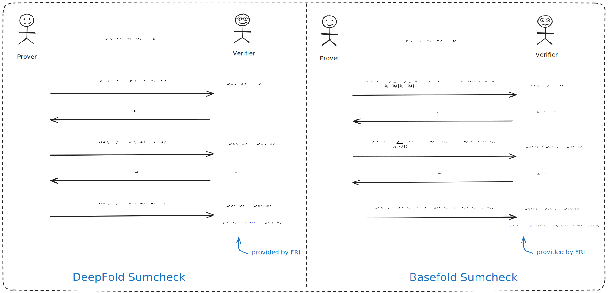
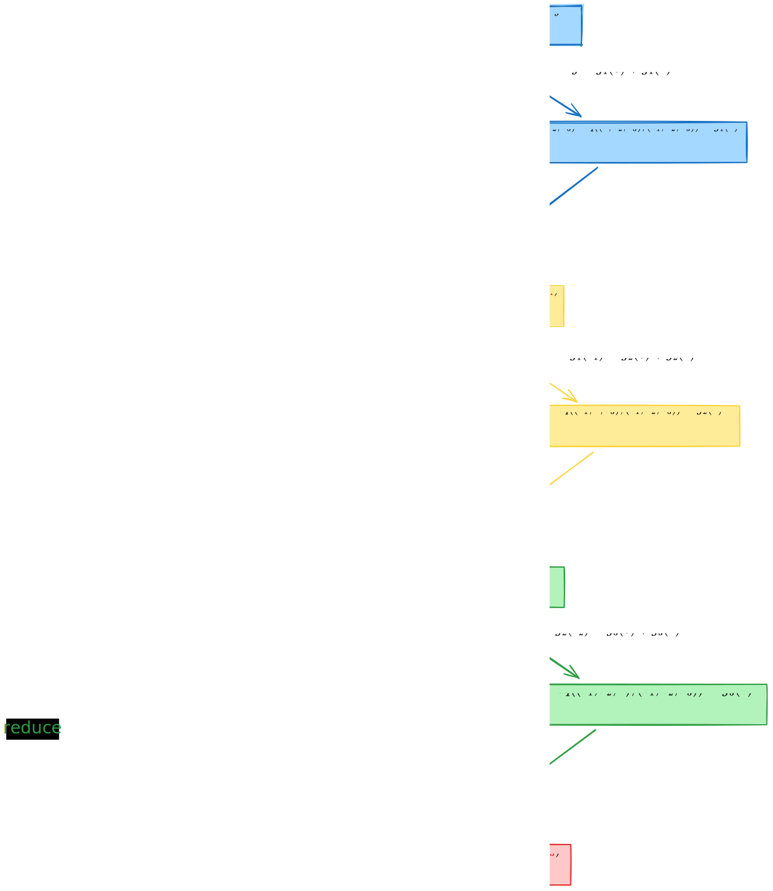

# Note on DeepFold: Protocol Overview

- Jade Xie <jade@secbit.io>
- Yu Guo <yu.guo@secbit.io>

This article mainly introduces the key ideas of the DeepFold protocol [GLHQTZ24]. The DeepFold protocol is a polynomial commitment scheme (PCS) for multilinear polynomials, combining ideas from DEEP-FRI [BGKS20] and BaseFold [ZCF24]. The BaseFold protocol [ZCF24] is also a PCS for multilinear polynomials, combining the FRI protocol and the sumcheck protocol. However, in its original paper, it is limited to unique decoding. If it could be optimized to work under list decoding, the number of queries made by the verifier to achieve the same security parameter $\lambda$ could be reduced, thus also reducing the size of the proof. The DeepFold protocol adopts the DEEP method from DEEP-FRI to achieve this. However, in [H24], Haböck proved the security of the BaseFold protocol for Reed-Solomon codes under list decoding. On the other hand, the STIR protocol [ACFY24a] has fewer queries compared to the DEEP-FRI protocol. The WHIR protocol [ACFY24b], which combines the STIR protocol and the BaseFold protocol, can achieve fewer queries compared to the DeepFold protocol, although its security under list decoding has not been rigorously proven yet.

## DEEP Method: From Unique Decoding to List Decoding

First, let's review the BaseFold protocol. Taking a trivariate (let $\mu = 3$) linear polynomial as an example, let

$$
\tilde{f}(X_1, X_2, X_3) = a_0 + a_1 X_1 + a_2 X_2 + a_3 X_1 X_2 + a_4 X_3 + a_5 X_1X_3 + a_6 X_2 X_3 + a_7 X_1 X_2 X_3
$$

The corresponding univariate polynomial is

$$
f(X) = a_0 + a_1 X + a_2 X^2 + a_3 X^3 + a_4 X^4 + a_5 X^5 + a_6 X^6 + a_7 X^7
$$

$f$ and $\tilde{f}$ are referred to as "twin polynomials" in the [GLHQTZ24] paper, sharing the same coefficients $\vec{a} = (a_0, a_1, \cdots, a_7)$. Suppose the query point is $\vec{z} = \{z_1, z_2, z_3\}$, and the prover wants to commit to the value of $\tilde{f}$ at this point as $\tilde{f}(\vec{z})$. The BaseFold protocol first converts the committed value $\tilde{f}(\vec{z})$ into a sum form over a hypercube $\{0,1\}^3$, i.e.,

$$
\tilde{f}(\vec{z}) = \sum_{\vec{b} \in \{0,1\}^3} \tilde{f}(\vec{b}) \cdot \tilde{eq}(\vec{b}, \vec{z}) \tag{1}
$$

where $\tilde{eq}(\vec{b}, \vec{z}) = \prod_{i = 1}^3((1 - \vec{b}[i])(1 - \vec{z}[i]) + \vec{b}[i] \cdot \vec{z}[i])$. To prove that equation (1) is correct, the sumcheck protocol can be used. However, in the last step of the sumcheck protocol, it will require obtaining the value of $\tilde{f}$ at a random point $\tilde{f}(r_1, r_2, r_3)$. This value can be obtained through the FRI protocol for $f$. For an honest prover, a Merkle tree can be used to commit to a vector $\vec{v} = f^{(0)}(X)|_{L_0} \in \mathrm{RS}[\mathbb{F}, L_0, \rho]$, where $f^{(0)}(X) = f(X)$, rate $\rho = 2^{3} / |L_0|$, and evaluation domain $L_{i + 1} = \{x^2: x \in L_i\}$. Express $f^{(0)}(X)$ as even and odd term polynomials

$$
\begin{aligned}
    f^{(0)}(X) & = f_E^{(1)}(X^2) + X \cdot f_O^{(1)}(X^2) \\
    & = (a_0 + a_2 X^2 + a_4 X^4 + a_6 X^6) + X \cdot (a_1 + a_3 X^2 + a_5 X^4 + a_7 X^6)
\end{aligned}
$$

Then use the same random number $r_1 \in \mathbb{F}$ as in sumcheck to fold $f_E^{(1)}$ and $f_O^{(1)}$ to get a new polynomial $f^{(1)}(X)$

$$
\begin{aligned}
    f^{(1)}(X) & = f_E^{(1)}(X) + r_1 \cdot f_O^{(1)}(X) \\
    & = (a_0 + a_2 X + a_4 X^2 + a_6 X^3) + r_1 \cdot (a_1 + a_3 X + a_5 X^2 + a_7 X^3)
\end{aligned}
$$

It can be found that the multilinear polynomial corresponding to $f^{(1)}(X)$ is

$$
\begin{aligned}
    \tilde{f}(r_1, X_2, X_3) & = a_0 + a_1 r_1 + a_2 X_2 + a_3 \cdot r_1 X_2 + a_4 X_3 + a_5 \cdot  r_1X_3 + a_6 X_2 X_3 + a_7 \cdot r_1 X_2 X_3 \\
    & = (a_0 + a_2 X_2 + a_4 X_3 + a_6 X_2X_3) + r_1 \cdot (a_1 + a_3 X_2 + a_5 X_3 + a_7 X_2X_3)
\end{aligned}
$$

The prover sends the Merkle commitment $\vec{v}^{(1)} = f^{(1)}|_{L_1}$ to the verifier. Generally, continuing the above steps, divide $f^{(i - 1)}(X)$ into odd and even terms,

$$
f^{(i - 1)}(X) = f_E^{(i)}(X^2) + X \cdot f_O^{(i)}(X^2) \tag{2}
$$

Then fold using the random number $r_i$,

$$
f^{(i)}(X) = f_E^{(i)}(X) + r_i \cdot f_O^{(i)}(X) \tag{3}
$$

The prover sends the Merkle commitment $\vec{v}^{(i)} = f^{(i)}|_{L_i}$ to the verifier. In the last step of the FRI protocol, we can obtain $f^{(3)}(X) = \tilde{f}(r_1, r_2, r_3)$ as a constant, which is exactly the value that the last step of sumcheck wants to obtain. This way, performing sumcheck protocol and FRI protocol simultaneously completes the commitment of the multilinear polynomial, which is the idea of the BaseFold protocol.

It can be found that in the BaseFold protocol, the role of the FRI protocol, in addition to its own purpose of ensuring that $\vec{v}$ is $\Delta$ close to the corresponding RS code space $\mathrm{RS}[\mathbb{F}, L_0, \rho]$, also provides the value of $f^{(3)}$ to ensure the correctness of $\tilde{f}(r_1, r_2, r_3)$. It is mentioned in [GLHQTZ24] that the original FRI protocol only requires the provided vector $\vec{v}$ to be close to some RS codes, but in the $i$-th round, it does not specifically require which codes $\vec{v}^{(i)}$ should be close to. Under unique decoding, there is at most one code $f^{(i)}$ close to the corresponding $\vec{v}^{(i)}$ in the $i$-th round. If it is list decoding, it means that there can be multiple codes $f^{(i)}$ close to $\vec{v}^{(i)}$, and a malicious prover can choose $f^{(i)^{'}}$ to proceed with the protocol, which can also pass subsequent checks, and in the last round, $f^{(3)^{'}}$ is obtained, which is not a correct value.

Therefore, we now need a method to ensure the correctness of $f^{(\mu)} = f^{(3)}$ under list decoding, that is, in the $i$-th round, we need to ensure that only $f^{(i)}$ can be $\Delta$ close to $\vec{v}^{(i)}$, and $f^{(i)}$ corresponds to the correct multivariate polynomial $\tilde{f}(r_1, \ldots, r_i, X_{i + 1}, \ldots, X_{\mu})$. The DeepFold protocol uses the DEEP (Domain Extending for Eliminating Pretenders) technique from the DEEP-FRI protocol [BGKS20] to solve this problem. In the $i$-th round, a random number $\alpha_i$ is selected from $\mathbb{F}$ instead of from $L_i$, and the verifier additionally queries two values $f^{(i - 1)}(\pm \alpha_i)$, from which the verifier can calculate the value of $f^{(i)}(\alpha_i^2)$ by themselves. Since

$$
f^{(i)}_E(X^2) = \frac{f^{(i - 1)}(X) + f^{(i - 1)}(- X)}{2}, \quad f^{(i)}_O(X^2) = \frac{f^{(i - 1)}(X) - f^{(i - 1)}(- X)}{2X}
$$

Therefore

$$
\begin{aligned}
    f^{(i)}(X^2) & = f^{(i)}_E(X^2) + r_i \cdot f^{(i)}_O(X^2) \\
    & = \frac{f^{(i - 1)}(X) + f^{(i - 1)}(- X)}{2} + r_i \cdot \frac{f^{(i - 1)}(X) - f^{(i - 1)}(- X)}{2X}
\end{aligned}
$$

Substituting $X = \alpha_i$, we can get

$$
f^{(i)}(\alpha_i^2) = \frac{f^{(i - 1)}(\alpha_i) + f^{(i - 1)}(- \alpha_i)}{2} + r_i \cdot \frac{f^{(i - 1)}(\alpha_i) - f^{(i - 1)}(- \alpha_i)}{2 \cdot \alpha_i}
$$

The verifier can calculate the value of $f^{(i)}(\alpha_i^2)$ based on the above equation. Since $\alpha_i$ is a random number selected from the entire $\mathbb{F}$, with high probability, there will not be two different polynomials $f^{(i)}$ within the $\Delta$ range of $\vec{v}^{(i)}$ that satisfy the same value at $f^{(i)}(\alpha_i^2)$ under list decoding. This way, through the selection of $\alpha_i$, the list decoding is restricted to only select the unique polynomial $f^{(i)}$.

Let's explain why, with high probability, there can only be a unique polynomial $f^{(i)}$ that satisfies the same value at $f^{(i)}(\alpha_i^2)$. Suppose there are two different polynomials $f_1^{(i)}$ and $f_2^{(i)}$ that have the same value at a random point $\alpha \in \mathbb{F}$, i.e., $f_1^{(i)}(\alpha) = f_2^{(i)}(\alpha)$, and they are both within the $\Delta$ range of $\vec{v}^{(i)}$. Let $|\vec{v}^{(i)}| = n$, $\Delta = 1 - \rho - \varepsilon$, and there are no more than $\mathcal{L}$ codewords within the $\Delta$ range of $\vec{v}^{(i)}$. According to the conjecture in [BGKS20], we know that $|\mathcal{L}| \le \mathrm{poly}(n)$. Since $f_1^{(i)}(\alpha) = f_2^{(i)}(\alpha)$, the polynomial $f_1^{(i)} - f_2^{(i)}$ has a value of $0$ at $\alpha$, and the polynomial degrees of $f_1^{(i)}$ and $f_2^{(i)}$ will not exceed $n$, so the degree of $f_1^{(i)} - f_2^{(i)}$ will also not exceed $n$, and there are at most $n$ zeros in $\mathbb{F}$. Since $\alpha \in \mathbb{F}$, the probability of such $f_1^{(i)} - f_2^{(i)}$ being $0$ at point $\alpha$ will not exceed $n / |\mathbb{F}|$. There are $\binom{|\mathcal{L}|}{2}$ ways to choose different $f_1^{(i)}$ and $f_2^{(i)}$ within the $\Delta$ range of $\vec{v}^{(i)}$, so the overall probability will not exceed $n \cdot \binom{|\mathcal{L}|}{2} / |\mathbb{F}|$. If $|\mathbb{F}|$ is large enough, this probability is very small. Therefore, it's the same for $\alpha_i^2$, with high probability, there is only one polynomial $f^{(i)}$ that satisfies the same value at $f^{(i)}(\alpha_i^2)$.

Now through the DEEP technique, we can convert list decoding to unique decoding, solving the problem that under list decoding, there may be multiple polynomials within the $\Delta$ range of $\vec{v}^{(i)}$, and the prover can choose different polynomials leading to inconsistent $f^{(\mu)}$. Now the remaining problem is to let the verifier verify the correctness of the value of $f^{(i)}(\alpha_i^2)$ in each round.

## Ensuring the Correctness of DEEP Method Evaluation

The [GLHQTZ24] paper mentions that in the DEEP-FRI paper [BGKS20], the quotient method can be used to verify the correctness of $f^{(i)}(\alpha_i^2)$. According to the folding relation in equation (3),

$$
f^{(i)}(X) = f_E^{(i)}(X) + r_i \cdot f_O^{(i)}(X)
$$

A new form can be constructed, namely

$$
f^{(i)}(X) = \frac{(f_E^{(i)}(X) + r_i \cdot f_O^{(i)}(X)) - (f_E^{(i)}(\alpha_i^2) + r_i \cdot f_O^{(i)}(\alpha_i^2))}{X - \alpha_i^2} \tag{4}
$$

If $f^{(i)}(\alpha_i^2)$ is correct, then the newly constructed $f^{(i)}(X)$ above is a polynomial, thus transforming the problem of verifying the correctness of $f^{(i)}(\alpha_i^2)$ into an IOPP problem about $f^{(i)}$. However, this method is not applicable in the current multilinear polynomial PCS scheme, because although equation (4) can ensure the correctness of $f^{(i)}(\alpha_i^2)$ in each round, the $f^{(\mu)}$ obtained at the end of the protocol is not equal to $\tilde{f}(\vec{r})$.

The DeepFold protocol provides a new method to ensure the correctness at these points $\{\alpha_i\}$. Let's still use the case of $\mu = 3$ to explain this method. Suppose now the verifier selects a random number $\alpha_1 \leftarrow \$ \mathbb{F}$ in the $i = 1$ round, and now the verifier wants to ensure the correctness of $f^{(1)}(\alpha_1^2)$. First, the verifier can query the prover for the values of $f^{(0)}(\pm \alpha_1)$, substituting into the expression of $f(X)$, we get

$$
\begin{aligned}
    f^{(0)}(\pm \alpha_1) & = a_0 + a_1 \cdot (\pm \alpha_1) + a_2 \cdot (\pm \alpha_1)^2 + a_3 \cdot (\pm \alpha_1)^3 \\
    & \quad + a_4 \cdot (\pm \alpha_1)^4 + a_5 \cdot (\pm \alpha_1)^5 + a_6 \cdot (\pm \alpha_1)^6 + a_7 \cdot (\pm \alpha_1)^7 \\
    & = a_0 + a_1 \cdot (\pm \alpha_1) + a_2 \cdot \alpha_1^2 + a_3 \cdot (\pm \alpha_1)\cdot \alpha_1^2 \\
    & \quad + a_4 \cdot \alpha_1^4 + a_5 \cdot (\pm \alpha_1) \cdot \alpha_1^4 + a_6 \cdot \alpha_1^2 \cdot \alpha_1^4 + a_7 \cdot (\pm \alpha_1) \cdot \alpha_1^2 \cdot \alpha_1^4
\end{aligned}
$$

This exactly corresponds to the value of the multilinear polynomial $\tilde{f}(X_1, X_2, X_3)$ at the point $(\pm \alpha_1, \alpha_1^2, \alpha_1^4)$,

$$
\begin{aligned}
    \tilde{f}(\pm \alpha_1, \alpha_1^2, \alpha_1^4)  & = a_0 + a_1 X_1 + a_2 X_2 + a_3 X_1 X_2 + a_4 X_3 + a_5 X_1X_3 + a_6 X_2 X_3 + a_7 X_1 X_2 X_3 \\
    & = a_0 + a_1 \cdot (\pm \alpha_1) + a_2 \cdot \alpha_1^2 + a_3 \cdot (\pm \alpha_1)\cdot \alpha_1^2 \\
    & \quad + a_4 \cdot \alpha_1^4 + a_5 \cdot (\pm \alpha_1) \cdot \alpha_1^4 + a_6 \cdot \alpha_1^2 \cdot \alpha_1^4 + a_7 \cdot (\pm \alpha_1) \cdot \alpha_1^2 \cdot \alpha_1^4
\end{aligned}
$$

Therefore $f^{(0)}(\pm \alpha_1) = \tilde{f}(\pm \alpha_1, \alpha_1^2, \alpha_1^4)$. After the verifier receives $f^{(0)}(\pm \alpha_1)$, they can calculate $f^{(1)}(\alpha_1^2)$ themselves, that is, by calculating using the following equation

$$
f^{(i)}(\alpha_i^2) = \frac{f^{(i - 1)}(\alpha_i) + f^{(i - 1)}(- \alpha_i)}{2} + r_i \cdot \frac{f^{(i - 1)}(\alpha_i) - f^{(i - 1)}(- \alpha_i)}{2 \cdot \alpha_i} \tag{5}
$$

Similar to the derivation of $f^{(0)}(\pm \alpha_1)$ above, the $f^{(1)}(\alpha_1^2)$ obtained at this time should have the following relationship with the corresponding multilinear polynomial:

$$
f^{(1)}(\alpha_1^2) = \tilde{f}(r_1, \alpha_1^2, \alpha_1^4) 
$$

Now, to ensure the correctness of $f^{(1)}(\alpha_1^2)$, the verifier can query the prover for $f^{(1)}(-\alpha_1^2)$, and the verifier can calculate $f^{(2)}(\alpha_1^4)$ themselves using equation (5), at this time

$$
f^{(2)}(\alpha_1^4) = \tilde{f}(r_1, r_2, \alpha_1^4) 
$$

Now the correctness of $f^{(1)}(\alpha_1^2)$ has been transformed into proving the correctness of $f^{(2)}(\alpha_1^4)$. Similarly, the verifier queries the prover for $f^{(2)}(-\alpha_1^4)$, and the verifier can calculate $f^{(3)}(\alpha_1^8)$, at this time it should equal

$$
f^{(3)}(\alpha_1^8) = \tilde{f}(r_1, r_2, r_3) 
$$

In this way, the correctness of $f^{(2)}(\alpha_1^4)$ is finally transformed into the correctness of the value of $f^{(3)}(\alpha_1^8)$, which should equal $\tilde{f}(r_1, r_2, r_3)$, which is exactly the value that will be obtained in the last step of FRI.

Through the above process, we can also find that if $i \neq 1$, generally, in the $i$-th round, the correctness of the value of $f^{(i-1)}(\pm \alpha_i)$ provided is transformed into verifying the correctness of $f^{(i)}(\alpha_i^2)$, by the prover additionally sending $f^{(i)}(-\alpha_i^2)$, it is transformed into verifying $f^{(i + 1)}(\alpha_i^4)$, until finally all are transformed into verifying the correctness of $f^{(\mu)} = \tilde{f}(r_1, r_2, \ldots, r_{\mu})$, which is exactly what the FRI protocol provides.

## DeepFold Protocol

Summarizing the introduction of the DEEP method above, in order to avoid a malicious prover possibly selecting an incorrect polynomial $f^{(i)'}$ within the $\Delta$ range of $\vec{v}^{(i)}$ to pass verification under list decoding, the verifier selects $\alpha_i$ from the range of $\mathbb{F}$ in each round, forcing the prover to provide only the unique polynomial $f^{(i)}$, making its value at $f^{(i)}(\alpha_i^2)$ correct. To verify the correctness of the value at $f^{(i)}(\alpha_i^2)$, the prover provides $f^{(i)}(-\alpha_i^2)$, the verifier calculates $f^{(i + 1)}(\alpha_i^4)$ on their own, until finally it is transformed into verifying the correctness of $f^{(\mu)} = \tilde{f}(r_1, \ldots, r_{\mu})$. Below, taking the PCS of a trivariate linear polynomial as an example, we will go through the complete DeepFold protocol [GLHQTZ24]. Although the protocol process has many steps, the core ideas are still the two points mentioned above.

In the commitment phase of $\tilde{f}$, the polynomial commitment sent by the prover to the verifier is $\mathcal{C} = \langle rt_0, \alpha, c \rangle$.
1. The prover calculates $\vec{v} = f^{(0)}|_{L_0}$, and commits to this vector using a Merkle tree, that is, sends $\mathsf{MT.Commit}(\vec{v}) \rightarrow rt_0$ to the verifier.
2. The verifier sends a random point $\alpha \leftarrow \$ \mathbb{F}$.
3. The prover calculates $c := f^{(0)}(\alpha)$ and sends $c$ to the verifier.

The prover wants to prove to the verifier that: at the query point $\vec{z} = \{z_1, z_2, z_3\}$, $\tilde{f}(z_1, z_2, z_3) = y$. At the same time, the verifier has $\mathcal{C} = \langle rt_0, \alpha, c \rangle$ received from the prover during the polynomial commitment phase. The prover and verifier perform the following protocol process:
**Step 1**: Let $A_0:= \{\vec{z}, \vec{\alpha}\}$, where $\vec{\alpha} = (\alpha, \alpha^2, \alpha^4)$.
**Step 2**: For each round $i \in [3]$, perform the following steps:

**2.1 When $i = 1$**

a. The verifier sends $\alpha_1 \leftarrow \$ \mathbb{F}$ to the prover. Let $A_0 := \{A_0, \vec{\alpha_1}\} = \{\vec{z}, \vec{\alpha}, \vec{\alpha_1}\}$, where $\vec{\alpha_1} = (\alpha_1, \alpha_1^2, \alpha_1^4)$.

> The $\alpha_1$ sent in this step is the random number outside of $L_0$ used in the DEEP method to limit the prover to only send the unique polynomial $f^{(1)}$. The vector $\vec{\alpha_1} = (\alpha_1, \alpha_1^2, \alpha_1^4)$ is for subsequent continuous verification of the correctness of $f^{(1)}(\alpha_1^2) = \tilde{f}(r_1, \alpha_1^2, \alpha_1^4)$.

b. Let $A_1 := \emptyset$, for each $\vec{\omega} \in A_0 = \{\vec{z}, \vec{\alpha}, \vec{\alpha_1}\}$, the prover sends the following polynomials to the verifier:
    
$$
\begin{aligned}
    & g_{\vec{z}_{[2:]}} = g_{(z_2, z_3)} := \tilde{f}(X, z_2, z_3) \\
    & g_{\vec{\alpha}_{[2:]}} =g_{(\alpha^2, \alpha^4)} := \tilde{f}(X, \alpha^2, \alpha^4) \\
    & g_{\vec{\alpha_1}_{[2:]}} =g_{(\alpha_1^2, \alpha_1^4)} := \tilde{f}(X, \alpha_1^2, \alpha_1^4)
\end{aligned}
$$

Let $A_1 := \{A_1, \vec{w}_{[2:]}\} = \{(z_2, z_3), (\alpha^2, \alpha^4), (\alpha_1^2, \alpha_1^4)\}$.

> The $g(X)$ polynomials in this step are similar to the univariate polynomials constructed in the sumcheck protocol to prove the correctness of the sum.

c. The verifier sends $r_1 \leftarrow \$ \mathbb{F}$ to the prover.
d. The prover calculates the folded polynomial $f^{(1)}(X) = f_E^{(1)}(X) + r_1 \cdot f_O^{(1)}(X)$, where $f_E^{(1)}(X)$ and $f_O^{(1)}(X)$ should satisfy

$$
f^{(0)}(X) = f_E^{(1)}(X^2) + X \cdot f_O^{(1)}(X^2)
$$

> The meaning of satisfying this equation is to ensure that $f_E^{(1)}(X^2)$ and $f_O^{(1)}(X^2)$ are the even and odd term functions of $f^{(0)}(X)$.

e. Let $\vec{v}^{(1)} = f^{(1)}|_{L_1}$, the prover sends the Merkle tree commitment of vector $\vec{v}^{(1)}$ to the verifier, i.e., $\mathsf{MT.Commit}(\vec{v}^{(1)}) \rightarrow rt_1$.

**2.2 When $i = 2$**

a. The verifier sends $\alpha_2 \leftarrow \$ \mathbb{F}$ to the prover. Let $A_1 := \{A_1, \vec{\alpha_2}\} = \{(z_2, z_3), (\alpha^2, \alpha^4), (\alpha_1^2, \alpha_1^4), (\alpha_2, \alpha_2^2)\}$, where $\vec{\alpha_2} = (\alpha_2, \alpha_2^2)$.

> Note that the length of each vector in $A_1$ has now changed to $2$. The $\alpha_2$ selected here is to use the DEEP method in the second round to limit the prover to only send the unique polynomial $f^{(2)}(X)$, and ensure that the polynomial $f^{(2)}(X)$ satisfies $f^{(2)}(\alpha_2^2) = \tilde{f}(r_1, r_2, \alpha_2^2)$ at point $\alpha_2^2$.

b. Let $A_2 := \emptyset$, for each $\vec{\omega} \in A_1 = \{(z_2, z_3), (\alpha^2, \alpha^4), (\alpha_1^2, \alpha_1^4), (\alpha_2, \alpha_2^2)\}$, the prover sends the following polynomials to the verifier:
    
$$
\begin{aligned}
    & g_{\vec{z}_{[2:]}} = g_{(z_3)} := \tilde{f}(r_1, X, z_3) \\
    & g_{\vec{\alpha}_{[2:]}} =g_{(\alpha^4)} := \tilde{f}(r_1, X, \alpha^4) \\
    & g_{\vec{\alpha_1}_{[2:]}} =g_{(\alpha_1^4)} := \tilde{f}(r_1, X, \alpha_1^4) \\
    & g_{\vec{\alpha_2}_{[2:]}} =g_{(\alpha_2^2)} := \tilde{f}(r_1, X, \alpha_2^2)
\end{aligned}
$$

Let $A_2 := \{A_2, \vec{w}_{[2:]}\} = \{(z_3), (\alpha^4), (\alpha_1^4), (\alpha_2^2)\}$.

c. The verifier sends $r_2 \leftarrow \$ \mathbb{F}$ to the prover.
d. The prover calculates the folded polynomial $f^{(2)}(X) = f_E^{(2)}(X) + r_2 \cdot f_O^{(2)}(X)$, where $f_E^{(2)}(X)$ and $f_O^{(2)}(X)$ should satisfy

$$
f^{(1)}(X) = f_E^{(2)}(X^2) + X \cdot f_O^{(2)}(X^2)
$$

e. Let $\vec{v}^{(2)} = f^{(2)}|_{L_2}$, the prover sends the Merkle tree commitment of vector $\vec{v}^{(2)}$ to the verifier, i.e., $\mathsf{MT.Commit}(\vec{v}^{(2)}) \rightarrow rt_2$.

**2.3 When $i = 3$**

a. The verifier sends $\alpha_3 \leftarrow \$ \mathbb{F}$ to the prover. Let $A_2 := \{A_2, \vec{\alpha_3}\} = \{(z_3), (\alpha^4), (\alpha_1^4), (\alpha_2^2), (\alpha_3)\}$, where $\vec{\alpha_3} = (\alpha_3)$.

b. The prover sends the linear function to the verifier

$$
g(X) := \tilde{f}(r_1, r_2, X)
$$

> Now it's the last round, directly send the function $g(X)$.

c. The verifier sends $r_3 \leftarrow \$ \mathbb{F}$ to the prover.
d. The prover calculates the folded polynomial $f^{(3)}(X) = f_E^{(3)}(X) + r_3 \cdot f_O^{(3)}(X)$, where $f_E^{(3)}(X)$ and $f_O^{(3)}(X)$ should satisfy

$$
f^{(2)}(X) = f_E^{(3)}(X^2) + X \cdot f_O^{(3)}(X^2)
$$

e. Let $\vec{v}^{(3)} = f^{(3)}|_{L_3}$, the prover sends $f^{(3)} \in \mathbb{F}$ to the verifier.

> In the last round, FRI will finally fold into a constant polynomial, so here directly send a value $f^{(3)}$.

> The following steps are the verification process performed by the verifier.

**Step 3**: The verifier checks

$$
\begin{aligned}
    & g_{\vec{z}_{[2:]}}(z_1)  = y \\
    & g_{\vec{\alpha}_{[2:]}}(\alpha) = c \\
    & g(r_{3}) = f^{(3)}
\end{aligned}
$$

> According to the construction of the $g(X)$ function when $i = 1$ and $i = 3$, for an honest prover, the above three equations hold because
>
> $$
> \begin{aligned}
>     & g_{\vec{z}_{[2:]}}(z_1) = \tilde{f}(z_1, z_2, z_3) = y\\
>     & g_{\vec{\alpha}_{[2:]}}(\alpha) = \tilde{f}(\alpha, \alpha^2, \alpha^4) = c\\
>     & g(r_3) = \tilde{f}(r_1, r_2, r_3) = f^{(3)}
> \end{aligned}
> $$

Next, for each round, the verifier also needs to perform the following checks.

**3.1 When $i = 1$**

a. For each $\vec{w} \in A_0 = \{\vec{z}, \vec{\alpha}, \vec{\alpha_1}\}$, check $g_{\vec{w}}(r_0) = g_{\vec{w}_{[2:]}}(w_1)$, i.e., check

$$
\begin{aligned}
    & g_{(z_1, z_2, z_3)}(r_0) = g_{(z_2, z_3)}(z_1) \\
    & g_{(\alpha, \alpha^2, \alpha^4)}(r_0) = g_{(\alpha^2, \alpha^4)}(\alpha) \\
    & g_{(\alpha_1, \alpha_1^2, \alpha_1^4)}(r_0) = g_{(\alpha_1^2, \alpha_1^4)}(\alpha_1)
\end{aligned}
$$
> 🐞**fix**
> I think in the original paper's Step 3
> > For each round $i$, where $i \in [\mu]$ ,
> > a. For each $\vec{w} \in A_{i - 1}$, if $i < \mu$, $\mathcal{V}$ checks  $g_{\vec{w}}(r_i) = g_{\vec{w}_{[2:]}}(w_1)$ ; otherwise, $\mathcal{V}$ checks $g_{\vec{w}}(r_i) = g(w_1)$ .
> 
> should be changed to, when $i < \mu$, verifier checks $g_{\vec{w}}(r_{i - 1}) = g_{\vec{w}_{[2:]}}(w_1)$, otherwise checks $g_{\vec{w}}(r_{i - 1}) = g(w_1)$. The reason is that, for example, when $i = 2$, $g_{\vec{w}}(r_1) = g_{\vec{w}_{[2:]}}(w_1)$ does not hold when substituted into the function construction sent by the prover earlier.

> Actually, the last equation above does not need to be checked, i.e., $g_{(\alpha_1, \alpha_1^2, \alpha_1^4)}(r_0) = g_{(\alpha_1^2, \alpha_1^4)}(\alpha_1)$. We can verify that the above equations are correct because substituting into the $g(X)$ equation from Round 1 gives
> $$
> \begin{aligned}
>     & g_{(z_1, z_2, z_3)}(r_0) = \tilde{f}(z_1, z_2, z_3) = y & g_{(z_2, z_3)}(z_1) = \tilde{f}(z_1, z_2, z_3)\\
>     & g_{(\alpha, \alpha^2, \alpha^4)}(r_0) = \tilde{f}(\alpha, \alpha^2, \alpha^4) = c & g_{(\alpha^2, \alpha^4)}(\alpha) = \tilde{f}(\alpha, \alpha^2, \alpha^4)
> \end{aligned}
> $$

**3.2 When $i = 2$**

a. For each $\vec{w} \in A_1 = \{(z_2, z_3), (\alpha^2, \alpha^4), (\alpha_1^2, \alpha_1^4), (\alpha_2, \alpha_2^2)\}$, check $g_{\vec{w}}(r_1) = g_{\vec{w}_{[2:]}}(w_1)$, i.e., check

$$
\begin{aligned}
    & g_{(z_2, z_3)}(r_1) = g_{(z_3)}(z_2) \\
    & g_{(\alpha^2, \alpha^4)}(r_1) = g_{(\alpha^4)}(\alpha^2) \\
    & g_{(\alpha_1^2, \alpha_1^4)}(r_1) = g_{(\alpha_1^4)}(\alpha_1^2) \\
    & g_{(\alpha_2, \alpha_2^2)}(r_1) = g_{(\alpha_2^2)}(\alpha_2)
\end{aligned}
$$

> The last equation $g_{(\alpha_2, \alpha_2^2)}(r_1) = g_{(\alpha_2^2)}(\alpha_2)$ does not need to be checked. We can verify that the above equations hold because substituting into the $g(X)$ equations from Rounds 1 and 2 gives
> $$
> \begin{aligned}
>     & g_{(z_2, z_3)}(r_1) = \tilde{f}(r_1, z_2, z_3) &  g_{(z_3)}(z_2) = \tilde{f}(r_1, z_2, z_3)\\
>     & g_{(\alpha^2, \alpha^4)}(r_1) = \tilde{f}(r_1, \alpha^2, \alpha^4) & g_{(\alpha^4)}(\alpha^2) = \tilde{f}(r_1, \alpha^2, \alpha^4)\\
>     & g_{(\alpha_1^2, \alpha_1^4)}(r_1) = \tilde{f}(r_1, \alpha_1^2, \alpha_1^4) & g_{(\alpha_1^4)}(\alpha_1^2) = \tilde{f}(r_1, \alpha_1^2, \alpha_1^4) 
> \end{aligned}
> $$

**3.2 When $i = 3$**

a. For each $\vec{w} \in A_2 = \{(z_3), (\alpha^4), (\alpha_1^4), (\alpha_2^2), (\alpha_3)\}$, check $g_{\vec{w}}(r_2) = g(w_1)$, i.e., check

$$
\begin{aligned}
    & g_{(z_3)}(r_2) = g(z_3) \\
    & g_{(\alpha^4)}(r_2) = g(\alpha^4) \\
    & g_{(\alpha_1^4)}(r_2) = g(\alpha_1^4) \\
    & g_{(\alpha_2^2)}(r_2) = g(\alpha_2^2) \\
     & g_{(\alpha_3)}(r_2) = g(\alpha_3) 
\end{aligned}
$$

> Similarly, the last equation $g_{(\alpha_3)}(r_2) = g(\alpha_3)$ does not need to be checked. We can verify that the above 4 equations hold because substituting into the $g(X)$ equations from Rounds 2 and 3 gives
> $$
> \begin{aligned}
>     & g_{(z_3)}(r_2) = \tilde{f}(r_1, r_2, z_3) &  g(z_3) = \tilde{f}(r_1, r_2, z_3)\\
>     & g_{(\alpha^4)}(r_2) = \tilde{f}(r_1, r_2, \alpha^4) & g(\alpha^4) = \tilde{f}(r_1, r_2, \alpha^4)\\
>     & g_{(\alpha_1^4)}(r_2) = \tilde{f}(r_1, r_2, \alpha_1^4) & g(\alpha_1^4) = \tilde{f}(r_1, r_2, \alpha_1^4) \\
>     & g_{(\alpha_2^2)}(r_2) = \tilde{f}(r_1, r_2, \alpha_2^2)  & g(\alpha_2^2) = \tilde{f}(r_1, r_2, \alpha_2^2)
> \end{aligned}
> $$

**Step 4**: Repeat query $s$ times:
a. The verifier sends $\beta_0 \leftarrow \$ L_0$ to the prover. For $i \in [3]$, define $\beta_i := \beta_{i - 1}^2$.
b. For each $i \in [3]$, the prover uses $\mathsf{MT.Open}$ to open $f^{(i - 1)}(\beta_{i - 1})$ and $f^{(i - 1)}(-\beta_{i - 1})$.
c. The verifier checks if the results sent by the prover are correct by calling $\mathsf{MT.Verify}$.
d. For each $i \in [3]$, the verifier needs to check if the following three points are on a straight line:

$$
\left(\beta_{i - 1}, f^{(i - 1)}(\beta_{i - 1})\right), \quad \left(-\beta_{i - 1}, f^{(i - 1)}(-\beta_{i - 1})\right), \quad \left(r_i, f^{(i)}(\beta_{i})\right)
$$

> In this step, the verifier is performing FRI folding queries, randomly checking if the folding is correct, repeating the query $s$ times.

**Step 5**: If all the above checks pass, the verifier outputs $1$, indicating acceptance; otherwise, the verifier outputs $0$, indicating rejection.

## Connection Between DeepFold and Sumcheck

Due to the introduction of DEEP-FRI, the DeepFold protocol requires proving the correctness of values of the multilinear polynomial $\tilde{f}$ at specific points in each round. Using $n = 3$ as an example, as shown in the figure below, the Prover needs to prove the values represented by the green parts in the diagram.

These value proofs implicitly invoke the sumcheck protocol, continuing until the final step of sumcheck, which requires obtaining the value of $\tilde{f}(r_1, r_2, r_3)$ to conclude the sumcheck protocol. This value is provided by the final step of the FRI protocol.

Below, we illustrate the sumcheck-like proof process in the DeepFold protocol using the example of proving $\tilde{f}(z_1, z_2, z_3) = y$. This process differs from the sumcheck protocol used in Basefold, as shown in the following diagram.

We can observe that the two protocols differ in how they construct univariate polynomials and in the equations that the Verifier checks.

### Sumcheck in Basefold

The sumcheck protocol in the Basefold protocol is more intuitive because its summation form is more evident. First, $\tilde{f}(z_1, z_2, z_3)$ is converted into a sum over the boolean hypercube $\{0,1\}^3$:

$$
\tilde{f}(z_1, z_2, z_3) = \sum_{b_3 = \{0,1\}}\sum_{b_2= \{0,1\}} \sum_{b_1= \{0,1\}} \tilde{f}(b_1, b_2, b_3) \cdot \tilde{eq}((b_1,b_2,b_3), (z_1, z_2, z_3))
$$

Proving $\tilde{f}(z_1, z_2, z_3) = y$ is transformed into proving:

$$
\sum_{b_3 = \{0,1\}}\sum_{b_2= \{0,1\}} \sum_{b_1= \{0,1\}} \tilde{f}(b_1, b_2, b_3) \cdot \tilde{eq}((b_1,b_2,b_3), (z_1, z_2, z_3)) = y \tag{6}
$$

The above equation is a sum of 8 terms. We first convert this 8-term sum problem into two 4-term sum problems, breaking it down into two smaller problems. Then, using a random number $r_1$, we transform these two 4-term sum problems into one 4-term sum problem. This process is as follows:

1. Split: Decompose the sum

$$
\begin{align}
 & \sum_{b_3 = \{0,1\}}\sum_{b_2= \{0,1\}} \sum_{b_1= \{0,1\}} \tilde{f}(b_1, b_2, b_3) \cdot \tilde{eq}((b_1,b_2,b_3), (z_1, z_2, z_3))  \\
  =  & \sum_{b_3 = \{0,1\}}\sum_{b_2= \{0,1\}}  \tilde{f}(0, b_2, b_3) \cdot \tilde{eq}((0,b_2,b_3), (z_1, z_2, z_3)) \\
 & + \sum_{b_3 = \{0,1\}}\sum_{b_2= \{0,1\}}  \tilde{f}(1, b_2, b_3) \cdot \tilde{eq}((1,b_2,b_3), (z_1, z_2, z_3)) \\  \\
 := & g_1(0) + g_1(1)
\end{align}
$$

Therefore, proving

$$
\sum_{b_3 = \{0,1\}}\sum_{b_2= \{0,1\}} \sum_{b_1= \{0,1\}} \tilde{f}(b_1, b_2, b_3) \cdot \tilde{eq}((b_1,b_2,b_3), (z_1, z_2, z_3)) = y
$$

can be transformed into proving

$$
\begin{align}
\sum_{b_3 = \{0,1\}}\sum_{b_2= \{0,1\}}  \tilde{f}(0, b_2, b_3) \cdot \tilde{eq}((0,b_2,b_3), (z_1, z_2, z_3)) = g_1(0) \\
\sum_{b_3 = \{0,1\}}\sum_{b_2= \{0,1\}}  \tilde{f}(1, b_2, b_3) \cdot \tilde{eq}((1,b_2,b_3), (z_1, z_2, z_3)) = g_1(1)
\end{align}
$$

and proving that the split is correct, i.e., proving

$$
g_1(0) + g_1(1) = y
$$

To summarize, after splitting the original summation problem, we need to prove three statements:

(1) The split is correct: $g_1(0) + g_1(1) = y$

(2) The first part of the sum is correct: $\sum_{b_3 = \{0,1\}}\sum_{b_2= \{0,1\}}  \tilde{f}(0, b_2, b_3) \cdot \tilde{eq}((0,b_2,b_3), (z_1, z_2, z_3)) = g_1(0)$

(3) The second part of the sum is correct: $\sum_{b_3 = \{0,1\}}\sum_{b_2= \{0,1\}}  \tilde{f}(1, b_2, b_3) \cdot \tilde{eq}((1,b_2,b_3), (z_1, z_2, z_3)) = g_1(1)$

We can see that after decomposition, proving (2) and (3) each involves half the scale compared to proving the original problem (6), and they both have the same form. Proving (2) and (3) separately would not be more efficient than directly proving equation (6). However, if we could merge (2) and (3) and prove a half-sized summation problem, it would be more efficient than directly proving equation (6). How can we accomplish this? We can ask the Verifier for a random number $r_1$ and use it to fold (2) and (3) into a single half-sized problem.

2. Fold: Use a random number to transform proving (2) and (3) into proving

$$
\sum_{b_3 = \{0,1\}}\sum_{b_2= \{0,1\}}  \tilde{f}(r_1, b_2, b_3) \cdot \tilde{eq}((r_1,b_2,b_3), (z_1, z_2, z_3)) = g_1(r_1) \tag{7}
$$

Compared to proving equation (6), the scale of the problem has been halved. Originally, we needed to prove that the sum of 8 terms equals a certain value, but now we only need to prove that the sum of 4 terms equals a certain value, and equations (6) and (7) have the same summation form.

To summarize, proving equation (6) is transformed into proving:

1. The split is correct: $g_1(0) + g_1(1) = y$
2. The half-sized subproblem:

$$
\sum_{b_3 = \{0,1\}}\sum_{b_2= \{0,1\}}  \tilde{f}(r_1, b_2, b_3) \cdot \tilde{eq}((r_1,b_2,b_3), (z_1, z_2, z_3)) = g_1(r_1) 
$$

We can continue to apply the split and fold process to the equation above, continuously reducing the problem size to one that is easier for the Verifier to check. Therefore, the entire sumcheck protocol can be viewed from this split-and-fold perspective, as illustrated in the diagram below.

### Sumcheck in DeepFold

The sumcheck protocol in DeepFold also uses this split-and-fold approach to prove $\tilde{f}(z_1, z_2, z_3) = y$, but its decomposition method differs from the sumcheck protocol in Basefold. Let

$$
\tilde{f}(X_1, X_2, X_3) = a_0 + a_1 X_1 + a_2 X_2 + a_3 X_1 X_2 + a_4 X_3 + a_5 X_1X_3 + a_6 X_2 X_3 + a_7 X_1 X_2 X_3
$$

Then the summation can be rewritten as

$$
\begin{align}
\tilde{f}(X_1, X_2, X_3)  & = a_0 + a_1 X_1 + a_2 X_2 + a_3 X_1 X_2 + a_4 X_3 + a_5 X_1X_3 + a_6 X_2 X_3 + a_7 X_1 X_2 X_3 \\
 & = (a_0 + a_2 X_2 + a_4 X_3 + a_6 X_2X_3) + X_1 \cdot (a_1X_1 + a_3 X_2 + a_5  X_3 + a_7 X_2 X_3) \\
& : = \tilde{f}_{even}(X_2, X_3) + X_1 \cdot \tilde{f}_{odd}(X_2, X_3)
\end{align} \tag{8}
$$

Since

$$
\tilde{f}(z_1, z_2, z_3) = a_0 + a_1 z_1 + a_2 z_2 + a_3 z_1 z_2 + a_4 z_3 + a_5 z_1z_3 + a_6 z_2 z_3 + a_7 z_1 z_2 z_3
$$

proving $\tilde{f}(z_1, z_2, z_3) = y$ means proving

$$
a_0 + a_1 z_1 + a_2 z_2 + a_3 z_1 z_2 + a_4 z_3 + a_5 z_1z_3 + a_6 z_2 z_3 + a_7 z_1 z_2 z_3 = y \tag{9}
$$

1. Split: Decompose the summation according to equation (8)

$$
\begin{align}
 & a_0 + a_1 z_1 + a_2 z_2 + a_3 z_1 z_2 + a_4 z_3 + a_5 z_1z_3 + a_6 z_2 z_3 + a_7 z_1 z_2 z_3  \\
 = & (a_0 + a_2 z_2 + a_4 z_3 + a_6 z_2z_3) + z_1 \cdot (a_1  + a_3 z_2 + a_5 z_3 + a_7 z_2 z_3)  \\
=  & \tilde{f}_{even}(z_2, z_3) + z_1 \cdot \tilde{f}_{odd}(z_2, z_3)
\end{align}
$$

After this decomposition, proving $\tilde{f}(z_1, z_2, z_3) = y$ is transformed into proving:

(1) The split is correct: $\tilde{f}_{even}(z_2, z_3) + z_1 \cdot \tilde{f}_{odd}(z_2, z_3) = y$

(2) The first part is correct: $a_0 + a_2 z_2 + a_4 z_3 + a_6 z_2z_3 = \tilde{f}_{even}(z_2, z_3)$

(3) The second part is correct: $a_1  + a_3 z_2 + a_5 z_3 + a_7 z_2 z_3 = \tilde{f}_{odd}(z_2, z_3)$

2. Fold: Use a random number $r_1$ to transform proving (2) and (3) into proving

$$
(a_0 + r_1 a_1) + (a_2 + r_1 a_3) z_2 + (a_4 + r_1 a_5) z_3 + (a_6 + r_1 a_7) z_2z_3 = \tilde{f}_{even}(z_2, z_3) + r_1 \cdot \tilde{f}_{odd}(z_2, z_3)
$$

If we define $y' = \tilde{f}_{even}(z_2, z_3) + r_1 \cdot \tilde{f}_{odd}(z_2, z_3)$ and

$$
\begin{align}
a_0' = a_0 + r_1 a_1 \quad a_1' = a_2 + r_1 a_3 \quad a_2' = a_4 + r_1 a_5 \quad a_3' = a_6 + r_1 a_7
\end{align}
$$

we can see that the scale of the proof problem is halved to proving

$$
a_0' + a_1' z_2 + a_2' z_3 + a_3' z_2z_3 = y'
$$

and this summation form has the same structure as equation (9).

To summarize, proving equation (9) is transformed into proving:

1. The split is correct: $\tilde{f}_{even}(z_2, z_3) + z_1 \cdot \tilde{f}_{odd}(z_2, z_3) = y$
2. The half-sized subproblem:

$$
(a_0 + r_1 a_1) + (a_2 + r_1 a_3) z_2 + (a_4 + r_1 a_5) z_3 + (a_6 + r_1 a_7) z_2z_3 = \tilde{f}_{even}(z_2, z_3) + r_1 \cdot \tilde{f}_{odd}(z_2, z_3)
$$

Using the representation of $\tilde{f}(X_1, X_2, X_3)$, we can simplify the above equation.

$$
\begin{align}
 & \tilde{f}_{even}(z_2, z_3) + r_1 \cdot \tilde{f}_{odd}(z_2, z_3)  \\
 = & (a_0 + a_2 z_2 + a_4 z_3 + a_6 z_2z_3) + r_1 \cdot (a_1  + a_3 z_2 + a_5 z_3 + a_7 z_2 z_3)  \\
=  & a_0 + a_1 r_1 + a_2 z_2 + a_3 r_1 z_2 + a_4 z_3 + a_5 r_1z_3 + a_6 z_2 z_3 + a_7 r_1 z_2 z_3 \\
=  & \tilde{f}(r_1, z_2, z_3)
\end{align}
$$

Let $g_1(X) = \tilde{f}(X, z_2, z_3)$, then $\tilde{f}_{even}(z_2, z_3) + r_1 \cdot \tilde{f}_{odd}(z_2, z_3) = g_1(r_1)$, and we can derive:

$$
\begin{align} 
 & \tilde{f}_{even}(z_2, z_3) = g_1(0) \\
 & \tilde{f}_{odd}(z_2, z_3) = g_1(1) - g_1(0) \\
 & \tilde{f}_{even}(z_2, z_3) + z_1 \cdot \tilde{f}_{odd}(z_2, z_3) = g_1(0) + z_1(g_1(1) - g_1(0)) = g_1(z_1)
\end{align}
$$

So this proof can be written as:

1. Split proof: $g_1(0) + z_1(g_1(1) - g_1(0)) = y$
2. Half-sized subproblem:

$$
(a_0 + r_1 a_1) + (a_2 + r_1 a_3) z_2 + (a_4 + r_1 a_5) z_3 + (a_6 + r_1 a_7) z_2z_3 = g_1(r_1)
$$

We continue to apply the split-and-fold approach to the equation above. The sumcheck flow in the DeepFold protocol is illustrated in the diagram below.

## References

- [GLHQTZ24] Yanpei Guo, Xuanming Liu, Kexi Huang, Wenjie Qu, Tianyang Tao, and Jiaheng Zhang. "DeepFold: Efficient Multilinear Polynomial Commitment from Reed-Solomon Code and Its Application to Zero-knowledge Proofs." _Cryptology ePrint Archive_ (2024).
- [ACFY24a] Gal Arnon, Alessandro Chiesa, Giacomo Fenzi, and Eylon Yogev. "STIR: Reed-Solomon proximity testing with fewer queries." In _Annual International Cryptology Conference_, pp. 380-413. Cham: Springer Nature Switzerland, 2024.
- [ACFY24b] Gal Arnon, Alessandro Chiesa, Giacomo Fenzi, and Eylon Yogev. "WHIR: Reed–Solomon Proximity Testing with Super-Fast Verification." _Cryptology ePrint Archive_ (2024).
- [BCIKS20] Eli Ben-Sasson, Dan Carmon, Yuval Ishai, Swastik Kopparty, and Shubhangi Saraf. Proximity Gaps for Reed–Solomon Codes. In *Proceedings of the 61st Annual IEEE Symposium on Foundations of Computer Science*, pages 900–909, 2020.
- [ZCF24] Hadas Zeilberger, Binyi Chen, and Ben Fisch. "BaseFold: efficient field-agnostic polynomial commitment schemes from foldable codes." Annual International Cryptology Conference. Cham: Springer Nature Switzerland, 2024.
- [BGKS20] Eli Ben-Sasson, Lior Goldberg, Swastik Kopparty, and Shubhangi Saraf. "DEEP-FRI: sampling outside the box improves soundness." _arXiv preprint arXiv:1903.12243_ (2019).
- [H24] Ulrich Haböck. "Basefold in the List Decoding Regime." _Cryptology ePrint Archive_(2024).