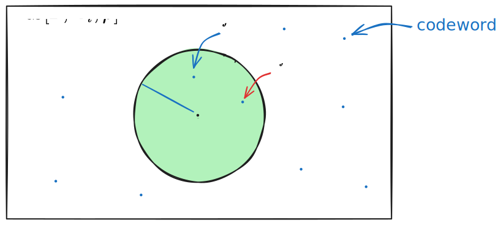
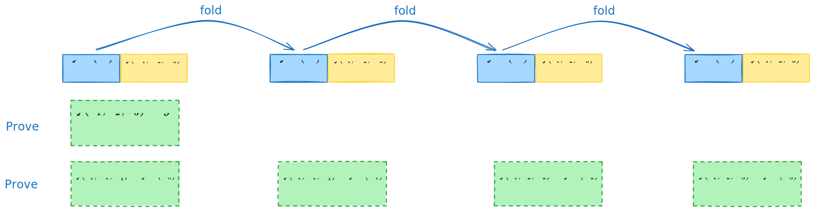
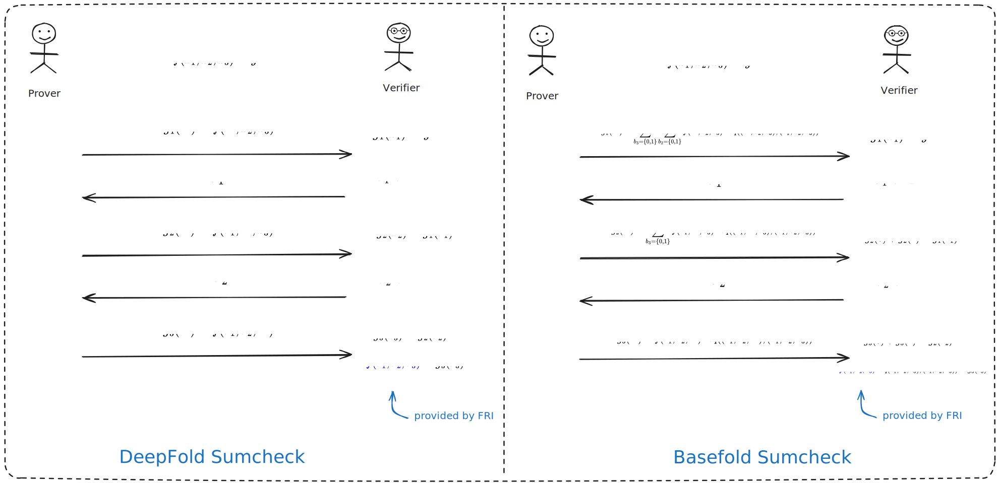
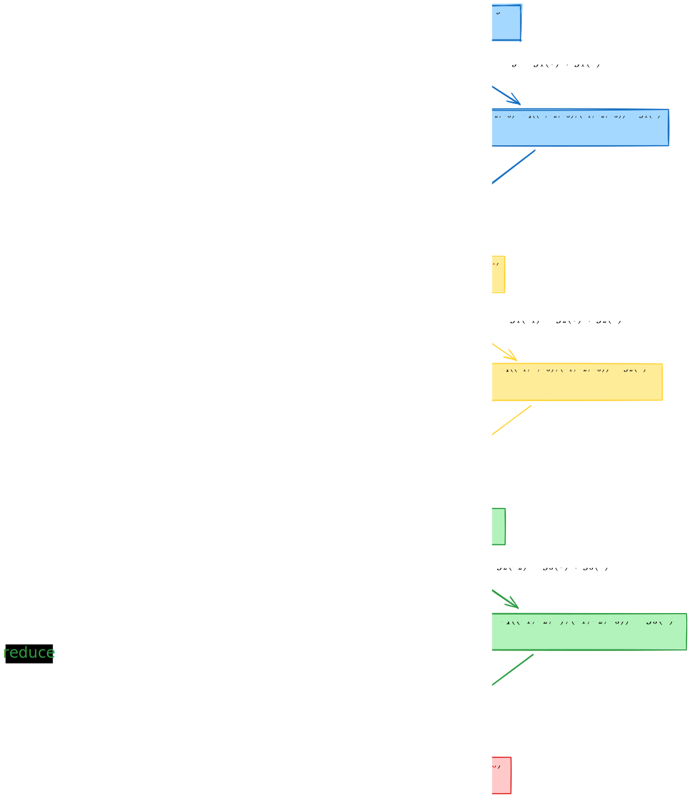
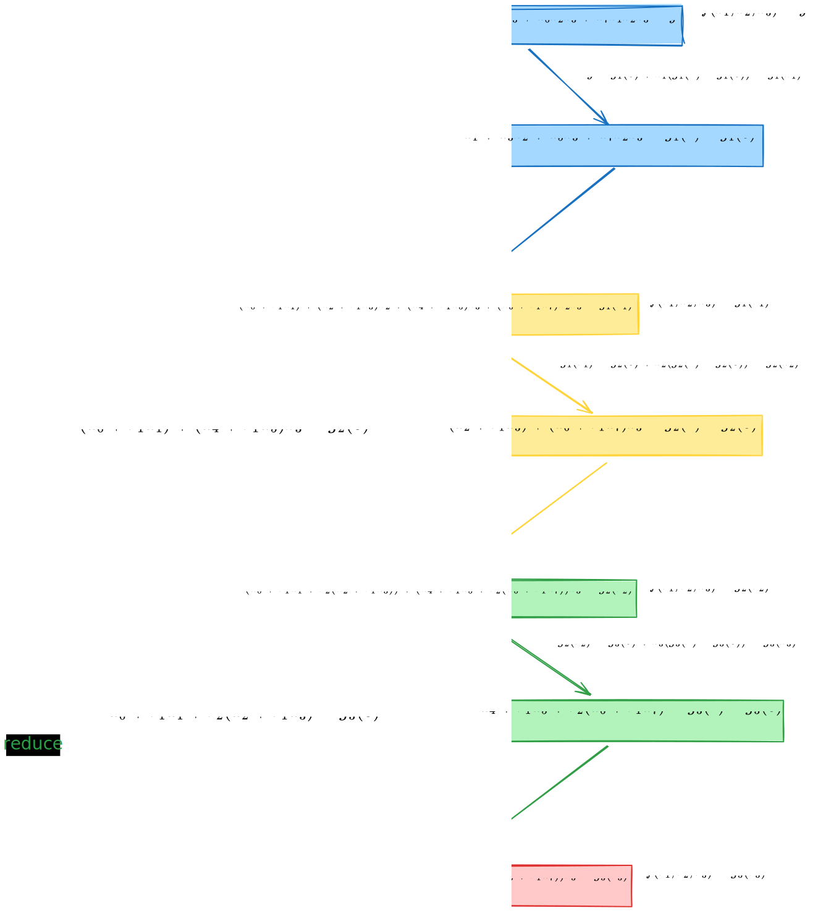

# DeepFold 笔记：协议概览

- Jade Xie  <jade@secbit.io>
- Yu Guo <yu.guo@secbit.io>

本篇文章主要介绍 DeepFold 协议 [GLHQTZ24] 的主要思想。DeepFold 协议是一个针对多元线性多项式的承诺方案(polynomial commitment scheme, PCS) ，其结合了 DEEP-FRI [BGKS20] 和 BaseFold [ZCF24] 的思想。BaseFold 协议 [ZCF24] 也是一个针对多元线性多项式的 PCS，其结合了 FRI 协议和 sumcheck 协议，不过在其原始论文中，其限制在 unique decoding 下，如果能将其优化到在 list decoding 下，那么在达到相同的安全参数 $\lambda$ 下， verifier 进行 query 的数量就能够变得更少，这样也能减少 verifier 的计算量和证明的大小。DeepFold 协议就采取了 DEEP-FRI 中的 DEEP 方法来实现这一点。不过在 [H24] 中，Haböck 证明了针对 Reed-Solomon 编码的 BaseFold 协议在 list decoding 下的安全性。另一方面，STIR 协议 [ACFY24a] 相比 DEEP-FRI 协议有更少的 query 数量，结合 STIR 协议和 BaseFold 协议得到的 WHIR 协议 [ACFY24b] ，相比 DeepFold 协议能实现更少的 query 数量，不过目前还没有严格证明其在 list decoding 下的安全性。

## DEEP 方法：从唯一解码到列表解码

首先，回顾下 BaseFold 协议。以一个三元(设 $\mu = 3$ )线性多项式为例，设

$$
\tilde{f}(X_1, X_2, X_3) = a_0 + a_1 X_1 + a_2 X_2 + a_3 X_1 X_2 + a_4 X_3 + a_5 X_1X_3 + a_6 X_2 X_3 + a_7 X_1 X_2 X_3
$$

其对应的单变量多项式为

$$
f(X) = a_0 + a_1 X + a_2 X^2 + a_3 X^3 + a_4 X^4 + a_5 X^5 + a_6 X^6 + a_7 X^7
$$

$f$  与 $\tilde{f}$ 在 [GLHQTZ24] 论文中被称为互为 *twin polynomials* ，它们共享相同的系数 $\vec{a} = (a_0, a_1, \cdots, a_7)$ 。假设查询的点为 $\vec{z} = \{z_1, z_2, z_3\}$ ，prover 要承诺 $\tilde{f}$ 在该点的值为 $\tilde{f}(\vec{z})$ 。BaseFold 协议先将承诺的值 $\tilde{f}(\vec{z})$ 转换为在一个 hypercube $\{0,1\}^3$ 上的求和形式，即

$$
\tilde{f}(\vec{z}) = \sum_{\vec{b} \in \{0,1\}^3} \tilde{f}(\vec{b}) \cdot \tilde{eq}(\vec{b}, \vec{z}) \tag{1}
$$

其中 $\tilde{eq}(\vec{b}, \vec{z}) = \prod_{i = 1}^3((1 - \vec{b}[i])(1 - \vec{z}[i]) + \vec{b}[i] \cdot \vec{z}[i])$ 。要证明 $(1)$ 式正确，可以用 sumcheck 协议，不过在 sumcheck 协议的最后一步会要求得到 $\tilde{f}$ 在一个随机点的值 $\tilde{f}(r_1, r_2, r_3)$ 。该点的值可以通过对 $f$ 进行 FRI 协议得到。对于诚实的 prover，可以用 Merkle 树来承诺一个向量 $\vec{v} = f^{(0)}(X)|_{L_0} \in \mathrm{RS}[\mathbb{F}, L_0, \rho]$ ，其中 $f^{(0)}(X) = f(X)$ ，码率 $\rho = 2^{3} / |L_0|$ ，求值 domain  $L_{i + 1} = \{x^2: x \in L_i\}$ 。将 $f^{(0)}(X)$ 表示成偶数项和奇数项多项式

$$
\begin{aligned}
    f^{(0)}(X) & = f_E^{(1)}(X^2) + X \cdot f_O^{(1)}(X^2) \\
    & = (a_0 + a_2 X^2 + a_4 X^4 + a_6 X^6) + X \cdot (a_1 + a_3 X^2 + a_5 X^4 + a_7 X^6)
\end{aligned}
$$

再用和 sumcheck 同样的随机数 $r_1 \in \mathbb{F}$ 对 $f_E^{(1)}$ 和 $f_O^{(1)}$ 进行折叠得到新的多项式 $f^{(1)}(X)$

$$
\begin{aligned}
    f^{(1)}(X) & = f_E^{(1)}(X) + r_1 \cdot f_O^{(1)}(X) \\
    & = (a_0 + a_2 X + a_4 X^2 + a_6 X^3) + r_1 \cdot (a_1 + a_3 X + a_5 X^2 + a_7 X^3)
\end{aligned}
$$

可以发现 $f^{(1)}(X)$ 对应的多元线性多项式就为

$$
\begin{aligned}
    \tilde{f}(r_1, X_2, X_3) & = a_0 + a_1 r_1 + a_2 X_2 + a_3 \cdot r_1 X_2 + a_4 X_3 + a_5 \cdot  r_1X_3 + a_6 X_2 X_3 + a_7 \cdot r_1 X_2 X_3 \\
    & = (a_0 + a_2 X_2 + a_4 X_3 + a_6 X_2X_3) + r_1 \cdot (a_1 + a_3 X_2 + a_5 X_3 + a_7 X_2X_3)
\end{aligned}
$$

prover 发送 Merkle 承诺 $\vec{v}^{(1)} = f^{(1)}|_{L_1}$ 给 verifier 。一般地，继续上述步骤，将 $f^{(i - 1)}(X)$ 分为奇偶项，

$$
f^{(i - 1)}(X) = f_E^{(i)}(X^2) + X \cdot f_O^{(i)}(X^2) \tag{2}
$$

然后用随机数 $r_i$ 进行折叠，

$$
f^{(i)}(X) = f_E^{(i)}(X) + r_i \cdot f_O^{(i)}(X) \tag{3}
$$

prover 发送 Merkle 承诺 $\vec{v}^{(i)} = f^{(i)}|_{L_i}$ 给 verifier 。在 FRI 协议的最后一步，就可以得到 $f^{(3)}(X) = \tilde{f}(r_1, r_2, r_3)$ 是一个常数，刚好就是 sumcheck 最后一步想得到的值，这样同步进行 sumcheck 协议与 FRI 协议就完成了多元线性多项式的承诺，这也就是 BaseFold 协议的思想。

可以发现，在 BaseFold 协议中，FRI 协议的作用除了其协议本身的作用，即确保 $\vec{v}$ 距离对应的 RS 编码空间 $\mathrm{RS}[\mathbb{F}, L_0, \rho]$ 有 $\Delta$ 那么近之外，还担任着提供 $f^{(3)}$ 的值，来确保 $\tilde{f}(r_1, r_2, r_3)$ 的正确性。在 [GLHQTZ24] 中提到，原始的 FRI 协议只要求提供的向量 $\vec{v}$ 距离某些 RS 码比较近，但在第 $i$ 轮中，并没有特别要求 $\vec{v}^{(i)}$ 应该距离哪些码比较近。如果是在唯一解码下，在第 $i$ 轮最多有一个码 $f^{(i)}$ 距离对应的 $\vec{v}^{(i)}$ 比较近。如果是列表解码，就意味着可以有多个码 $f^{(i)}$ 距离 $\vec{v}^{(i)}$ 比较近，作恶的 prover 可以选择 $f^{(i)^{'}}$ 来进行协议，也能通过后续的检查，在最后一轮得到的就是 $f^{(3)^{'}}$ ，提供的就不是一个正确的值。

因此现在需要一个方法来确保在列表解码下保证 $f^{(\mu)} = f^{(3)}$ 的正确性，也就是在第 $i$ 轮，要确保距离 $\vec{v}^{(i)}$ 有 $\Delta$ 近的只能是 $f^{(i)}$ ，$f^{(i)}$ 对应的才是正确的多元多项式 $\tilde{f}(r_1, \ldots, r_i, X_{i + 1}, \ldots, X_{\mu})$ 。DeepFold 协议使用了 DEEP-FRI 协议 [BGKS20] 中的 DEEP (Domain Extending for Eliminating Pretenders) 技巧来解决这个问题。在第 $i$ 轮，从 $\mathbb{F}$ 中选取随机数 $\alpha_i$，而不是在 $L_i$ 中选取。若 prover 向 verifier 发送两个值 $f^{(i - 1)}(\pm \alpha_i)$ ，那么 verifier 可以自己计算出 $f^{(i)}(\alpha_i^2)$ 的值。由于

$$
f^{(i)}_E(X^2) = \frac{f^{(i - 1)}(X) + f^{(i - 1)}(- X)}{2}, \quad f^{(i)}_O(X^2) = \frac{f^{(i - 1)}(X) - f^{(i - 1)}(- X)}{2X}
$$

因此 

$$
\begin{aligned}
    f^{(i)}(X^2) & = f^{(i)}_E(X^2) + r_i \cdot f^{(i)}_O(X^2) \\
    & = \frac{f^{(i - 1)}(X) + f^{(i - 1)}(- X)}{2} + r_i \cdot \frac{f^{(i - 1)}(X) - f^{(i - 1)}(- X)}{2X}
\end{aligned}
$$

代入 $X = \alpha_i$ 就可以得到 

$$
f^{(i)}(\alpha_i^2) = \frac{f^{(i - 1)}(\alpha_i) + f^{(i - 1)}(- \alpha_i)}{2} + r_i \cdot \frac{f^{(i - 1)}(\alpha_i) - f^{(i - 1)}(- \alpha_i)}{2 \cdot \alpha_i}
$$

verifier 能根据上式计算出 $f^{(i)}(\alpha_i^2)$ 的值。由于 $\alpha_i$ 是从整个 $\mathbb{F}$ 中选取的随机数，那么在列表解码下，以极大的概率，不会在 $\vec{v}^{(i)}$ 的 $\Delta$ 范围内选到有两个不同的多项式 $f^{(i)}$ 满足在 $f^{(i)}(\alpha_i^2)$ 处的值相等，这样就通过 $\alpha_i$ 的选取限制了列表解码选到的只能是唯一的多项式 $f^{(i)}$ 了。

这里解释下为什么以极大概率只能有唯一的多项式 $f^{(i)}$ 满足在 $f^{(i)}(\alpha_i^2)$ 处的值相等。假设有两个不同的多项式 $f_1^{(i)}$ 与 $f_2^{(i)}$ 都在一个随机点 $\alpha \in \mathbb{F}$ 处的值相同，即 $f_1^{(i)}(\alpha) = f_2^{(i)}(\alpha)$ ，同时它们都在 $\vec{v}^{(i)}$ 的 $\Delta$ 范围内，设 $|\vec{v}^{(i)}| = n$ ， $\Delta = 1 - \rho - \varepsilon$ ，$\vec{v}^{(i)}$ 的 $\Delta$ 范围内的码字不超过 $\mathcal{L}$ 个码字，那么根据 [BGKS20] 中的猜想知 $|\mathcal{L}| \le \mathrm{poly}(n)$ 。由于 $f_1^{(i)}(\alpha) = f_2^{(i)}(\alpha)$ ，那么多项式 $f_1^{(i)} - f_2^{(i)}$ 在 $\alpha$ 处的值为 $0$ ，而 $f_1^{(i)}$ 和 $f_2^{(i)}$ 的多项式次数不会超过 $n$ ，因此 $f_1^{(i)} - f_2^{(i)}$ 的次数也不会超过 $n$ ，在 $\mathbb{F}$ 中最多有 $n$ 个零点。由于 $\alpha \in \mathbb{F}$ ，因此这样的 $f_1^{(i)} - f_2^{(i)}$ 在 $\alpha$ 点为 $0$ 的概率不会超过 $n / |\mathbb{F}|$ 。在 $\vec{v}^{(i)}$ 的 $\Delta$ 范围内选取不同的 $f_1^{(i)}$ 与 $f_2^{(i)}$ 的取法有 $\binom{|\mathcal{L}|}{2}$ 种，因此整体的概率不会超过 $n \cdot \binom{|\mathcal{L}|}{2} / |\mathbb{F}|$ ，$|\mathbb{F}|$ 足够的大，这个概率就非常小。因此对于 $\alpha_i^2$ 也是一样的，以极大概率只有一个多项式 $f^{(i)}$ 满足在 $f^{(i)}(\alpha_i^2)$ 处的值相等。

现在通过 DEEP 的技巧就能将列表解码转换成唯一解码了，解决了列表解码下可能出现 $\vec{v}^{(i)}$ 的 $\Delta$ 范围内有多个多项式，而 prover 可以选取不同的多项式导致 $f^{(\mu)}$ 不一致的问题。现在剩下一个问题是要让 verifier 在每一轮验证 $f^{(i)}(\alpha_i^2)$ 值的正确性。

## 确保 DEEP 方法求值的正确性

[GLHQTZ24] 论文中提到了在 DEEP-FRI 论文 [BGKS20] 中可以使用 quotient 方法来验证 $f^{(i)}(\alpha_i^2)$ 的正确性。根据折叠关系 $(3)$ 式，

$$
f^{(i)}(X) = f_E^{(i)}(X) + r_i \cdot f_O^{(i)}(X)
$$

可以构造出新的形式，即

$$
f^{(i)}(X) = \frac{(f_E^{(i)}(X) + r_i \cdot f_O^{(i)}(X)) - (f_E^{(i)}(\alpha_i^2) + r_i \cdot f_O^{(i)}(\alpha_i^2))}{X - \alpha_i^2} \tag{4}
$$

如果 $f^{(i)}(\alpha_i^2)$ 是正确的，那么上面新构造的 $f^{(i)}(X)$ 就是一个多项式，这样就将验证 $f^{(i)}(\alpha_i^2)$ 正确性的问题转换成了关于 $f^{(i)}$ 的 IOPP 问题。不过，该方法并不适用在现在多元线性多项式的 PCS 方案中，原因是通过 $(4)$ 式的方式虽然能确保每一轮 $f^{(i)}(\alpha_i^2)$ 的正确性，但是协议进行到最后得到的 $f^{(\mu)}$ 并不与 $\tilde{f}(\vec{r})$ 相等。

DeepFold 协议中给出了一个新的方法来确保在这些点处 $\{\alpha_i\}$ 的正确性。下面还是以 $\mu = 3$ 的情况来说明该方法。假设现在 verifier 在第 $i = 1$ 轮选取了随机数 $\alpha_1 \leftarrow \$ \mathbb{F}$ ，现在 verifier 想要确保 $f^{(1)}(\alpha_1^2)$ 的正确性。首先 verifier 可以向 prover 查询 $f^{(0)}(\pm \alpha_1)$ 的值，代入 $f(X)$ 的表达式可以得到

$$
\begin{aligned}
    f^{(0)}(\pm \alpha_1) & = a_0 + a_1 \cdot (\pm \alpha_1) + a_2 \cdot (\pm \alpha_1)^2 + a_3 \cdot (\pm \alpha_1)^3 \\
    & \quad + a_4 \cdot (\pm \alpha_1)^4 + a_5 \cdot (\pm \alpha_1)^5 + a_6 \cdot (\pm \alpha_1)^6 + a_7 \cdot (\pm \alpha_1)^7 \\
    & = a_0 + a_1 \cdot (\pm \alpha_1) + a_2 \cdot \alpha_1^2 + a_3 \cdot (\pm \alpha_1)\cdot \alpha_1^2 \\
    & \quad + a_4 \cdot \alpha_1^4 + a_5 \cdot (\pm \alpha_1) \cdot \alpha_1^4 + a_6 \cdot \alpha_1^2 \cdot \alpha_1^4 + a_7 \cdot (\pm \alpha_1) \cdot \alpha_1^2 \cdot \alpha_1^4
\end{aligned}
$$

其正好对应多元线性多项式 $\tilde{f}(X_1, X_2, X_3)$ 在点 $(\pm \alpha_1, \alpha_1^2, \alpha_1^4)$ 处的值，

$$
\begin{aligned}
    \tilde{f}(\pm \alpha_1, \alpha_1^2, \alpha_1^4)  & = a_0 + a_1 X_1 + a_2 X_2 + a_3 X_1 X_2 + a_4 X_3 + a_5 X_1X_3 + a_6 X_2 X_3 + a_7 X_1 X_2 X_3 \\
    & = a_0 + a_1 \cdot (\pm \alpha_1) + a_2 \cdot \alpha_1^2 + a_3 \cdot (\pm \alpha_1)\cdot \alpha_1^2 \\
    & \quad + a_4 \cdot \alpha_1^4 + a_5 \cdot (\pm \alpha_1) \cdot \alpha_1^4 + a_6 \cdot \alpha_1^2 \cdot \alpha_1^4 + a_7 \cdot (\pm \alpha_1) \cdot \alpha_1^2 \cdot \alpha_1^4
\end{aligned}
$$

因此 $f^{(0)}(\pm \alpha_1) = \tilde{f}(\pm \alpha_1, \alpha_1^2, \alpha_1^4)$ 。verifier 拿到 $f^{(0)}(\pm \alpha_1)$ 后可以自己计算出 $f^{(1)}(\alpha_1^2)$ ，即通过下面这个式子进行计算

$$
f^{(i)}(\alpha_i^2) = \frac{f^{(i - 1)}(\alpha_i) + f^{(i - 1)}(- \alpha_i)}{2} + r_i \cdot \frac{f^{(i - 1)}(\alpha_i) - f^{(i - 1)}(- \alpha_i)}{2 \cdot \alpha_i} \tag{5}
$$

与上面推导 $f^{(0)}(\pm \alpha_1)$ 类似，此时得到的 $f^{(1)}(\alpha_1^2)$ 与对应的多元线性多项式的关系应该为：

$$
f^{(1)}(\alpha_1^2) = \tilde{f}(r_1, \alpha_1^2, \alpha_1^4) 
$$

现在为了确保 $f^{(1)}(\alpha_1^2)$ 的正确性，verifier 可以向 prover 查询 $f^{(1)}(-\alpha_1^2)$ ，verifier 通过 $(5)$ 式能自己计算出 $f^{(2)}(\alpha_1^4)$ ，此时

$$
f^{(2)}(\alpha_1^4) = \tilde{f}(r_1, r_2, \alpha_1^4) 
$$

现在就将 $f^{(1)}(\alpha_1^2)$ 的正确性转换为了证明 $f^{(2)}(\alpha_1^4)$ 的正确性。同样地，verifier 向 prover 查询 $f^{(2)}(-\alpha_1^4)$ ，verifier 能计算出 $f^{(3)}(\alpha_1^8)$ ，此时其应该等于

$$
f^{(3)}(\alpha_1^8) = \tilde{f}(r_1, r_2, r_3) 
$$

这样 $f^{(2)}(\alpha_1^4)$ 的正确性最后转换为 $f^{(3)}(\alpha_1^8)$ 值的正确性，而其应该等于 $\tilde{f}(r_1, r_2, r_3)$ ，这恰好是在 FRI 的最后一步会得到的值。

通过上述过程也能发现，如果 $i \neq 1$ ，一般地，在第 $i$ 轮提供的 $f^{(i-1)}(\pm \alpha_i)$ 的值的正确性，转换为验证 $f^{(i)}(\alpha_i^2)$ 的正确性，通过 prover 额外发送 $f^{(i)}(-\alpha_i^2)$ ，转换为验证 $f^{(i + 1)}(\alpha_i^4)$ ，直到最后都转换为验证 $f^{(\mu)} = \tilde{f}(r_1, r_2, \ldots, r_{\mu})$ 的正确性，这正好是 FRI 协议所提供的。

## DeepFold 协议

总结下上面 DEEP 方法的介绍，为了能避免在 list decoding 下，作恶的 prover 可能选取在 $\vec{v}^{(i)}$ 的 $\Delta$ 范围内错误的多项式 $f^{(i)'}$ 来通过验证， verifier 在每一轮中都在 $\mathbb{F}$ 的范围内选取 $\alpha_i$ ，迫使 prover 只能提供唯一的多项式 $f^{(i)}$ ，使其在 $f^{(i)}(\alpha_i^2)$ 处的值是正确的。为了验证 $f^{(i)}(\alpha_i^2)$ 处值的正确性，通过 prover 提供 $f^{(i)}(-\alpha_i^2)$ ，verifier 自行计算 $f^{(i + 1)}(\alpha_i^4)$ ，直到最后转换为验证 $f^{(\mu)} = \tilde{f}(r_1, \ldots, r_{\mu})$ 的正确性。下面以三元线性多项式的 PCS 为例，完整走一遍 DeepFold 协议 [GLHQTZ24]，尽管协议流程步骤比较多，但核心思想还是上面提到的两点。

在对 $\tilde{f}$ 进行承诺阶段，prover 发送给 verifier 的多项式承诺为 $\mathcal{C} = \langle rt_0, \alpha, c \rangle$ 。

1. prover 计算 $\vec{v} = f^{(0)}|_{L_0}$ ，并用 Merkle 树承诺该向量，也就是将 $\mathsf{MT.Commit}(\vec{v}) \rightarrow rt_0$ 发送给 verifier。
2. verifier 发送一个随机点 $\alpha \stackrel{\$}{\leftarrow}\mathbb{F}$ 。
3. prover 计算 $c := f^{(0)}(\alpha)$ 并将 $c$ 发送给 verifier 。

prover 想向 verifier 证明的是: 在查询点 $\vec{z} = \{z_1, z_2, z_3\}$ 处 $\tilde{f}(z_1, z_2, z_3) = y$ 。同时 verifier 有 prover 在多项式承诺阶段接收到的 $\mathcal{C} = \langle rt_0, \alpha, c \rangle$ 。prover 和 verifier 进行如下的协议流程：

**第 1 步**：令 $A_0:= \{\vec{z}, \vec{\alpha}\}$ ， 其中 $\vec{\alpha} = (\alpha, \alpha^2, \alpha^4)$ 。

**第 2 步**： 对每一轮 $i \in [3]$ ，进行如下步骤:

**2.1 当 $i = 1$ 时**

a. verifier 向 prover 发送 $\alpha_1 \stackrel{\$}{\leftarrow} \mathbb{F}$ 。令 $A_0 := \{A_0, \vec{\alpha_1}\} = \{\vec{z}, \vec{\alpha}, \vec{\alpha_1}\}$ ，其中 $\vec{\alpha_1} = (\alpha_1, \alpha_1^2, \alpha_1^4)$ 。

> 这一步发送的 $\alpha_1$ 就是使用 DEEP 方法的在 $L_0$ 之外的随机数，用于限定 prover 只能发送唯一的多项式 $f^{(1)}$ 。向量 $\vec{\alpha_1} = (\alpha_1, \alpha_1^2, \alpha_1^4)$ 就是为了后续不断验证 $f^{(1)}(\alpha_1^2) = \tilde{f}(r_1, \alpha_1^2, \alpha_1^4)$ 的正确性。

b. 令 $A_1 := \emptyset$ ，对每一个 $\vec{\omega} \in A_0 = \{\vec{z}, \vec{\alpha}, \vec{\alpha_1}\}$ ，prover 向 verifier 发送多项式：
    
$$
\begin{aligned}
    & g_{\vec{z}_{[2:]}} = g_{(z_2, z_3)} := \tilde{f}(X, z_2, z_3) \\
    & g_{\vec{\alpha}_{[2:]}} =g_{(\alpha^2, \alpha^4)} := \tilde{f}(X, \alpha^2, \alpha^4) \\
    & g_{\vec{\alpha_1}_{[2:]}} =g_{(\alpha_1^2, \alpha_1^4)} := \tilde{f}(X, \alpha_1^2, \alpha_1^4)
\end{aligned}
$$

令 $A_1 := \{A_1, \vec{w}_{[2:]}\} = \{(z_2, z_3), (\alpha^2, \alpha^4), (\alpha_1^2, \alpha_1^4)\}$ 。

> 这一步中的 $g(X)$ 多项式就是类似 sumcheck 协议中为了证明求和正确，构造的一元多项式。

c. verifier 向 prover 发送 $r_1 \stackrel{\$}{\leftarrow} \mathbb{F}$ .
d. prover 计算折叠后的多项式 $f^{(1)}(X) = f_E^{(1)}(X) + r_1 \cdot f_O^{(1)}(X)$ ，其中 $f_E^{(1)}(X)$ 与 $f_O^{(1)}(X)$ 应该满足

$$
f^{(0)}(X) = f_E^{(1)}(X^2) + X \cdot f_O^{(1)}(X^2)
$$

> 满足这个等式的含义是确保 $f_E^{(1)}(X^2)$ 和 $f_O^{(1)}(X^2)$ 是 $f^{(0)}(X)$ 的偶项和奇项函数。

e. 令 $\vec{v}^{(1)} = f^{(1)}|_{L_1}$ ，prover 向 verifier 发送关于向量 $\vec{v}^{(1)}$ 的 Merkle 树承诺，即 $\mathsf{MT.Commit}(\vec{v}^{(1)}) \rightarrow rt_1$ 。

**2.2 当 $i = 2$ 时**

a. verifier 向 prover 发送 $\alpha_2 \stackrel{\$}{\leftarrow} \mathbb{F}$ 。令 $A_1 := \{A_1, \vec{\alpha_2}\} = \{(z_2, z_3), (\alpha^2, \alpha^4), (\alpha_1^2, \alpha_1^4), (\alpha_2, \alpha_2^2)\}$ ，其中 $\vec{\alpha_2} = (\alpha_2, \alpha_2^2)$ 。

> 注意这里 $A_1$ 中的每个向量的长度此时都变为了 $2$ 。这里选取的 $\alpha_2$ 是为了在第 $2$ 轮时使用 DEEP 方法，限制 prover 只能发送唯一的多项式 $f^{(2)}(X)$ ，并确保多项式 $f^{(2)}(X)$ 在点 $\alpha_2^2$ 满足 $f^{(2)}(\alpha_2^2) = \tilde{f}(r_1, r_2, \alpha_2^2)$ 。

b. 令 $A_2 := \emptyset$ ，对每一个 $\vec{\omega} \in A_1 = \{(z_2, z_3), (\alpha^2, \alpha^4), (\alpha_1^2, \alpha_1^4), (\alpha_2, \alpha_2^2)\}$ ，prover 向 verifier 发送多项式：
    
$$
\begin{aligned}
    & g_{\vec{z}_{[2:]}} = g_{(z_3)} := \tilde{f}(r_1, X, z_3) \\
    & g_{\vec{\alpha}_{[2:]}} =g_{(\alpha^4)} := \tilde{f}(r_1, X, \alpha^4) \\
    & g_{\vec{\alpha_1}_{[2:]}} =g_{(\alpha_1^4)} := \tilde{f}(r_1, X, \alpha_1^4) \\
    & g_{\vec{\alpha_2}_{[2:]}} =g_{(\alpha_2^2)} := \tilde{f}(r_1, X, \alpha_2^2)
\end{aligned}
$$

令 $A_2 := \{A_2, \vec{w}_{[2:]}\} = \{(z_3), (\alpha^4), (\alpha_1^4), (\alpha_2^2)\}$ 。

c. verifier 向 prover 发送 $r_2 \stackrel{\$}{\leftarrow} \mathbb{F}$ .
d. prover 计算折叠后的多项式 $f^{(2)}(X) = f_E^{(2)}(X) + r_2 \cdot f_O^{(2)}(X)$ ，其中 $f_E^{(2)}(X)$ 与 $f_O^{(2)}(X)$ 应该满足

$$
f^{(1)}(X) = f_E^{(2)}(X^2) + X \cdot f_O^{(2)}(X^2)
$$

e. 令 $\vec{v}^{(2)} = f^{(2)}|_{L_2}$ ，prover 向 verifier 发送关于向量 $\vec{v}^{(2)}$ 的 Merkle 树承诺，即 $\mathsf{MT.Commit}(\vec{v}^{(2)}) \rightarrow rt_2$ 。

**2.3 当 $i = 3$ 时**

a. verifier 向 prover 发送 $\alpha_3 \stackrel{\$}{\leftarrow} \mathbb{F}$ 。令 $A_2 := \{A_2, \vec{\alpha_3}\} = \{(z_3), (\alpha^4), (\alpha_1^4), (\alpha_2^2), (\alpha_3)\}$ ，其中 $\vec{\alpha_3} = (\alpha_3)$ 。

b. prover 向 verifier 发送线性函数 

$$
g(X) := \tilde{f}(r_1, r_2, X)
$$

> 现在是最后一轮，直接发送函数 $g(X)$ 。

c. verifier 向 prover 发送 $r_3 \stackrel{\$}{\leftarrow} \mathbb{F}$ .
d. prover 计算折叠后的多项式 $f^{(3)}(X) = f_E^{(3)}(X) + r_3 \cdot f_O^{(3)}(X)$ ，其中 $f_E^{(3)}(X)$ 与 $f_O^{(3)}(X)$ 应该满足

$$
f^{(2)}(X) = f_E^{(3)}(X^2) + X \cdot f_O^{(3)}(X^2)
$$

e. 令 $\vec{v}^{(3)} = f^{(3)}|_{L_3}$ ，prover 向 verifier 发送 $f^{(3)} \in \mathbb{F}$ 。

> 进行到最后一轮时，FRI 最后会折叠成一个常数多项式，因此这里直接发送一个值 $f^{(3)}$ 。

> 接下来的步骤是 verifier 进行验证检查的过程。

**第 3 步**： verifier 检查 

$$
\begin{aligned}
    & g_{\vec{z}_{[2:]}}(z_1)  = y \\
    & g_{\vec{\alpha}_{[2:]}}(\alpha) = c \\
    & g(r_{3}) = f^{(3)}
\end{aligned}
$$

> 根据 $i = 1$ 和 $i = 3$ 时 $g(X)$ 函数的构造，对于诚实的 prover ，上面三个等式是成立的，因为
>
> $$
> \begin{aligned}
>     & g_{\vec{z}_{[2:]}}(z_1) = \tilde{f}(z_1, z_2, z_3) = y\\
>     & g_{\vec{\alpha}_{[2:]}}(\alpha) = \tilde{f}(\alpha, \alpha^2, \alpha^4) = c\\
>     & g(r_3) = \tilde{f}(r_1, r_2, r_3) = f^{(3)}
> \end{aligned}
> $$

接着，对每一轮，verifier 还要进行如下检查。

**3.1 当 $i = 1$ 时**

a. 对每一个 $\vec{w} \in A_0 = \{\vec{z}, \vec{\alpha}, \vec{\alpha_1}\}$ ，检查 $g_{\vec{w}}(r_0) = g_{\vec{w}_{[2:]}}(w_1)$ ，即检查

$$
\begin{aligned}
    & g_{(z_1, z_2, z_3)}(r_0) = g_{(z_2, z_3)}(z_1) \\
    & g_{(\alpha, \alpha^2, \alpha^4)}(r_0) = g_{(\alpha^2, \alpha^4)}(\alpha) \\
    & g_{(\alpha_1, \alpha_1^2, \alpha_1^4)}(r_0) = g_{(\alpha_1^2, \alpha_1^4)}(\alpha_1)
\end{aligned}
$$

> 🐞**fix**
> 我认为原论文中的第 3 步中 
> > For each round $i$, where $i \in [\mu]$ ,
> > a. For each $\vec{w} \in A_{i - 1}$, if $i < \mu$, $\mathcal{V}$ checks  $g_{\vec{w}}(r_i) = g_{\vec{w}_{[2:]}}(w_1)$ ; otherwise, $\mathcal{V}$ checks $g_{\vec{w}}(r_i) = g(w_1)$ .
> 
> 应该改为，当 $i < \mu$ 时，verifier 检查 $g_{\vec{w}}(r_{i - 1}) = g_{\vec{w}_{[2:]}}(w_1)$，否则检查 $g_{\vec{w}}(r_{i - 1}) = g(w_1)$ 。 原因是例如当 $i = 2$ 时，$g_{\vec{w}}(r_1) = g_{\vec{w}_{[2:]}}(w_1)$ 代入之前 prover 发送的函数构造不成立。

> 其实上面最后一个式子是不需要检查的，即 $g_{(\alpha_1, \alpha_1^2, \alpha_1^4)}(r_0) = g_{(\alpha_1^2, \alpha_1^4)}(\alpha_1)$ 。可以验证上面几个式子是正确的，因为代入第 $1$ 轮 $g(X)$ 的式子可以得到
> $$
> \begin{aligned}
>     & g_{(z_1, z_2, z_3)}(r_0) = \tilde{f}(z_1, z_2, z_3) = y & g_{(z_2, z_3)}(z_1) = \tilde{f}(z_1, z_2, z_3)\\
>     & g_{(\alpha, \alpha^2, \alpha^4)}(r_0) = \tilde{f}(\alpha, \alpha^2, \alpha^4) = c & g_{(\alpha^2, \alpha^4)}(\alpha) = \tilde{f}(\alpha, \alpha^2, \alpha^4)
> \end{aligned}
> $$

**3.2 当 $i = 2$ 时**

a. 对每一个 $\vec{w} \in A_1 = \{(z_2, z_3), (\alpha^2, \alpha^4), (\alpha_1^2, \alpha_1^4), (\alpha_2, \alpha_2^2)\}$ ，检查 $g_{\vec{w}}(r_1) = g_{\vec{w}_{[2:]}}(w_1)$ ，即检查

$$
\begin{aligned}
    & g_{(z_2, z_3)}(r_1) = g_{(z_3)}(z_2) \\
    & g_{(\alpha^2, \alpha^4)}(r_1) = g_{(\alpha^4)}(\alpha^2) \\
    & g_{(\alpha_1^2, \alpha_1^4)}(r_1) = g_{(\alpha_1^4)}(\alpha_1^2) \\
    & g_{(\alpha_2, \alpha_2^2)}(r_1) = g_{(\alpha_2^2)}(\alpha_2)
\end{aligned}
$$

> 最后一个式子并不需要检查 $g_{(\alpha_2, \alpha_2^2)}(r_1) = g_{(\alpha_2^2)}(\alpha_2)$ 。 可以验证上面几个式子是成立的，因为代入第 $1,2$ 轮 $g(X)$ 的式子可以得到
> $$
> \begin{aligned}
>     & g_{(z_2, z_3)}(r_1) = \tilde{f}(r_1, z_2, z_3) &  g_{(z_3)}(z_2) = \tilde{f}(r_1, z_2, z_3)\\
>     & g_{(\alpha^2, \alpha^4)}(r_1) = \tilde{f}(r_1, \alpha^2, \alpha^4) & g_{(\alpha^4)}(\alpha^2) = \tilde{f}(r_1, \alpha^2, \alpha^4)\\
>     & g_{(\alpha_1^2, \alpha_1^4)}(r_1) = \tilde{f}(r_1, \alpha_1^2, \alpha_1^4) & g_{(\alpha_1^4)}(\alpha_1^2) = \tilde{f}(r_1, \alpha_1^2, \alpha_1^4) 
> \end{aligned}
> $$

**3.2 当 $i = 3$ 时**

a. 对每一个 $\vec{w} \in A_2 = \{(z_3), (\alpha^4), (\alpha_1^4), (\alpha_2^2), (\alpha_3)\}$ ，检查 $g_{\vec{w}}(r_2) = g(w_1)$ ，即检查

$$
\begin{aligned}
    & g_{(z_3)}(r_2) = g(z_3) \\
    & g_{(\alpha^4)}(r_2) = g(\alpha^4) \\
    & g_{(\alpha_1^4)}(r_2) = g(\alpha_1^4) \\
    & g_{(\alpha_2^2)}(r_2) = g(\alpha_2^2) \\
     & g_{(\alpha_3)}(r_2) = g(\alpha_3) 
\end{aligned}
$$

> 同样地，上面最后一个式子不需要进行检查，即检查 $g_{(\alpha_3)}(r_2) = g(\alpha_3)$  。可以验证上面 $4$ 个式子是成立的，因为代入第 $2,3$ 轮 $g(X)$ 的式子可以得到
> $$
> \begin{aligned}
>     & g_{(z_3)}(r_2) = \tilde{f}(r_1, r_2, z_3) &  g(z_3) = \tilde{f}(r_1, r_2, z_3)\\
>     & g_{(\alpha^4)}(r_2) = \tilde{f}(r_1, r_2, \alpha^4) & g(\alpha^4) = \tilde{f}(r_1, r_2, \alpha^4)\\
>     & g_{(\alpha_1^4)}(r_2) = \tilde{f}(r_1, r_2, \alpha_1^4) & g(\alpha_1^4) = \tilde{f}(r_1, r_2, \alpha_1^4) \\
>     & g_{(\alpha_2^2)}(r_2) = \tilde{f}(r_1, r_2, \alpha_2^2)  & g(\alpha_2^2) = \tilde{f}(r_1, r_2, \alpha_2^2)
> \end{aligned}
> $$

**第 4 步**：重复查询 $s$ 次：
a. verifier 向 prover 发送 $\beta_0 \stackrel{\$}{\leftarrow} L_0$ 。对于 $i \in [3]$ ，定义 $\beta_i := \beta_{i - 1}^2$ 。
b. 对于每一个 $i \in [3]$ ，prover 用 $\mathsf{MT.Open}$ 打开 $f^{(i - 1)}(\beta_{i - 1})$ 以及 $f^{(i - 1)}(-\beta_{i - 1})$ 。
c. verifier 检查 prover 发送的结果是否正确，调用 $\mathsf{MT.Verify}$ 。
d. 对于每一个 $i \in [3]$，verifier 需要检查下面三个点是否在一条直线上:

$$
\left(\beta_{i - 1}, f^{(i - 1)}(\beta_{i - 1})\right), \quad \left(-\beta_{i - 1}, f^{(i - 1)}(-\beta_{i - 1})\right), \quad \left(r_i, f^{(i)}(\beta_{i})\right)
$$

> 这一步 verifier 就是在进行 FRI 折叠的查询，随机检查折叠是否正确，重复查询 $s$ 次。

**第 5 步**：如果上面所有的检查都通过，那么 verifier 输出 $1$ ，表示接受；否则输出 $0$ ，表示拒绝。

## DeepFold 与 sumcheck 的联系

由于 DEEP-FRI 的引入，DeepFold 整个协议在每一轮中都需要多引入证明多元线性多项式 $\tilde{f}$ 在一个点处的值正确，依然以 $n = 3$ 为例，如下图所示，Prover 需要证明值为图中绿色的部分。

这些值的证明隐式地调用了 sumcheck 协议，直到都进行到 sumcheck 最后一步，需要获得 $\tilde{f}(r_1, r_2, r_3)$ 的值来结束 sumcheck 协议，而这个值由 FRI 协议的最后一步来提供。

下面以证明 $\tilde{f}(z_1, z_2, z_3) = y$ 为例来说明在 DeepFold 协议中类似 sumcheck 的证明过程。这个过程和 Basefold 中调用的 sumcheck 协议有一些区别，如下图所示。

可以发现两个协议在构造一元多项式的方式上有所不同，同时 Verifier 检查的式子也有所不同。Basefold 协议中的 sumcheck 协议比较好理解，因为它的求和的形式比较明显。先将 $\tilde{f}(z_1, z_2, z_3)$ 转换为在 boolean hypercube $\{0,1\}^3$ 上求和，即

$$
\tilde{f}(z_1, z_2, z_3) = \sum_{b_3 = \{0,1\}}\sum_{b_2= \{0,1\}} \sum_{b_1= \{0,1\}} \tilde{f}(b_1, b_2, b_3) \cdot \tilde{eq}((b_1,b_2,b_3), (z_1, z_2, z_3))
$$

证明 $\tilde{f}(z_1, z_2, z_3) = y$  就转换为证明

$$
\sum_{b_3 = \{0,1\}}\sum_{b_2= \{0,1\}} \sum_{b_1= \{0,1\}} \tilde{f}(b_1, b_2, b_3) \cdot \tilde{eq}((b_1,b_2,b_3), (z_1, z_2, z_3)) = y \tag{6}
$$

上式是对 $8$ 个数进行求和的形式，先将 $8$ 个数求和问题转换为两个 $4$ 个数求和问题，分解成两个小问题，接着再用随机数 $r_1$ 将这两个 $4$ 个数的求和问题转换为一个 $4$ 个数求和问题，这个过程为：

1. split: 求和分解

$$
\begin{align}
 & \sum_{b_3 = \{0,1\}}\sum_{b_2= \{0,1\}} \sum_{b_1= \{0,1\}} \tilde{f}(b_1, b_2, b_3) \cdot \tilde{eq}((b_1,b_2,b_3), (z_1, z_2, z_3))  \\
  =  & \sum_{b_3 = \{0,1\}}\sum_{b_2= \{0,1\}}  \tilde{f}(0, b_2, b_3) \cdot \tilde{eq}((0,b_2,b_3), (z_1, z_2, z_3)) \\
 & + \sum_{b_3 = \{0,1\}}\sum_{b_2= \{0,1\}}  \tilde{f}(1, b_2, b_3) \cdot \tilde{eq}((1,b_2,b_3), (z_1, z_2, z_3)) \\  \\
 := & g_1(0) + g_1(1)
\end{align}
$$
因此证明

$$
\sum_{b_3 = \{0,1\}}\sum_{b_2= \{0,1\}} \sum_{b_1= \{0,1\}} \tilde{f}(b_1, b_2, b_3) \cdot \tilde{eq}((b_1,b_2,b_3), (z_1, z_2, z_3)) = y
$$

可以转换为证明

$$
\begin{align}
\sum_{b_3 = \{0,1\}}\sum_{b_2= \{0,1\}}  \tilde{f}(0, b_2, b_3) \cdot \tilde{eq}((0,b_2,b_3), (z_1, z_2, z_3)) = g_1(0) \\
\sum_{b_3 = \{0,1\}}\sum_{b_2= \{0,1\}}  \tilde{f}(1, b_2, b_3) \cdot \tilde{eq}((1,b_2,b_3), (z_1, z_2, z_3)) = g_1(1)
\end{align}
$$

以及证明 split 是正确的，即证明

$$
g_1(0) + g_1(1) = y
$$
总结下将原来的求和问题进行 split 后需要证明 3 项：

(1) split 分解正确：$g_1(0) + g_1(1) = y$

(2) 第一部分求和正确：$\sum_{b_3 = \{0,1\}}\sum_{b_2= \{0,1\}}  \tilde{f}(0, b_2, b_3) \cdot \tilde{eq}((0,b_2,b_3), (z_1, z_2, z_3)) = g_1(0)$

(3) 第二部分求和正确：$\sum_{b_3 = \{0,1\}}\sum_{b_2= \{0,1\}}  \tilde{f}(1, b_2, b_3) \cdot \tilde{eq}((1,b_2,b_3), (z_1, z_2, z_3)) = g_1(1)$

可以发现分解之后，证明 (2) 和 (3) 都相比证明原来的问题 $(6)$ 式规模减半，而且它们都有相同的形式。如果分别再证明 (2) 和 (3) 并不比直接证明 $(6)$ 式更优，若能将 (2) 和 (3) 合并，证明一个规模减半的求和问题就能比直接证明 $(6)$ 式更优了。如何做到这一点呢？好在可以向 Verifer 要一个随机数 $r_1$ ，将 (2) 和 (3) fold 成一个规模减半的问题。

2. fold：通过随机数将证明 (2) 和 (3) 转换为证明

$$
\sum_{b_3 = \{0,1\}}\sum_{b_2= \{0,1\}}  \tilde{f}(r_1, b_2, b_3) \cdot \tilde{eq}((r_1,b_2,b_3), (z_1, z_2, z_3)) = g_1(r_1) \tag{7}
$$

上式相比证明 $(6)$ 式，问题的规模减半了，原来要证明 8 个数求和等于某一个值，现在只需要证明 4 个数求和等于某一个值，而且 $(6)$ 式和 $(7)$ 式证明的求和形式也是一样的。

至此总结下证明 $(6)$ 式就转换为证明：

1. split 正确：$g_1(0) + g_1(1) = y$
2. 规模减半的子问题：

$$
\sum_{b_3 = \{0,1\}}\sum_{b_2= \{0,1\}}  \tilde{f}(r_1, b_2, b_3) \cdot \tilde{eq}((r_1,b_2,b_3), (z_1, z_2, z_3)) = g_1(r_1) 
$$

下面就可以对上式继续用 split 以及 fold 的过程，不断将问题的规模减小到一个 Verfier 更容易验证的问题。因此 sumcheck 协议的整个过程可以用这种 split-and-fold 的视角来重新看待，整个流程如下图所示。

DeepFold 中的 sumcheck 协议，同样也是这种 split-and-fold 的思想来证明 $\tilde{f}(z_1, z_2, z_3) = y$ ，不过，其分解的方式与 Basefold 中的 sumcheck 协议有所不同。设

$$
\tilde{f}(X_1, X_2, X_3) = a_0 + a_1 X_1 + a_2 X_2 + a_3 X_1 X_2 + a_4 X_3 + a_5 X_1X_3 + a_6 X_2 X_3 + a_7 X_1 X_2 X_3
$$

则上面的求和式可以变为

$$
\begin{align}
\tilde{f}(X_1, X_2, X_3)  & = a_0 + a_1 X_1 + a_2 X_2 + a_3 X_1 X_2 + a_4 X_3 + a_5 X_1X_3 + a_6 X_2 X_3 + a_7 X_1 X_2 X_3 \\
 & = (a_0 + a_2 X_2 + a_4 X_3 + a_6 X_2X_3) + X_1 \cdot (a_1X_1 + a_3 X_2 + a_5  X_3 + a_7 X_2 X_3) \\
& : = \tilde{f}_{even}(X_2, X_3) + X_1 \cdot \tilde{f}_{odd}(X_2, X_3)
\end{align} \tag{8}
$$

由于

$$
\tilde{f}(z_1, z_2, z_3) = a_0 + a_1 z_1 + a_2 z_2 + a_3 z_1 z_2 + a_4 z_3 + a_5 z_1z_3 + a_6 z_2 z_3 + a_7 z_1 z_2 z_3
$$

那么证明 $\tilde{f}(z_1, z_2, z_3) = y$ 就是证明

$$
a_0 + a_1 z_1 + a_2 z_2 + a_3 z_1 z_2 + a_4 z_3 + a_5 z_1z_3 + a_6 z_2 z_3 + a_7 z_1 z_2 z_3 = y \tag{9}
$$

1. split ：对上面的求和式按照 $(8)$ 式进行分解

$$
\begin{align}
 & a_0 + a_1 z_1 + a_2 z_2 + a_3 z_1 z_2 + a_4 z_3 + a_5 z_1z_3 + a_6 z_2 z_3 + a_7 z_1 z_2 z_3  \\
 = & (a_0 + a_2 z_2 + a_4 z_3 + a_6 z_2z_3) + z_1 \cdot (a_1  + a_3 z_2 + a_5 z_3 + a_7 z_2 z_3)  \\
=  & \tilde{f}_{even}(z_2, z_3) + z_1 \cdot \tilde{f}_{odd}(z_2, z_3)
\end{align}
$$

这样分解之后，证明 $\tilde{f}(z_1, z_2, z_3) = y$ 就转换为证明

(1) split 分解正确：$\tilde{f}_{even}(z_2, z_3) + z_1 \cdot \tilde{f}_{odd}(z_2, z_3) = y$

(2) 第一部分求和正确：$a_0 + a_2 z_2 + a_4 z_3 + a_6 z_2z_3 = \tilde{f}_{even}(z_2, z_3)$

(3) 第二部分求和正确：$a_1  + a_3 z_2 + a_5 z_3 + a_7 z_2 z_3 = \tilde{f}_{odd}(z_2, z_3)$

2. fold：用随机数 $r_1$ 将证明 (2) 和 (3) 转换为证明

$$
(a_0 + r_1 a_1) + (a_2 + r_1 a_3) z_2 + (a_4 + r_1 a_5) z_3 + (a_6 + r_1 a_7) z_2z_3 = \tilde{f}_{even}(z_2, z_3) + r_1 \cdot \tilde{f}_{odd}(z_2, z_3)
$$

若令 $y' = \tilde{f}_{even}(z_2, z_3) + r_1 \cdot \tilde{f}_{odd}(z_2, z_3)$ 以及

$$
\begin{align}
a_0' = a_0 + r_1 a_1 \quad a_1' = a_2 + r_1 a_3 \quad a_2' = a_4 + r_1 a_5 \quad a_3' = a_6 + r_1 a_7
\end{align}
$$
可以看到证明的问题规模减半，即证明

$$
a_0' + a_1' z_2 + a_2' z_3 + a_3' z_2z_3 = y'
$$
并且该求和形式与 $(9)$ 式有相同形式。

至此总结下证明 $(9)$ 式转换为证明

1. split 证明：$\tilde{f}_{even}(z_2, z_3) + z_1 \cdot \tilde{f}_{odd}(z_2, z_3) = y$
2. 规模减半的子问题：

$$
(a_0 + r_1 a_1) + (a_2 + r_1 a_3) z_2 + (a_4 + r_1 a_5) z_3 + (a_6 + r_1 a_7) z_2z_3 = \tilde{f}_{even}(z_2, z_3) + r_1 \cdot \tilde{f}_{odd}(z_2, z_3)
$$

通过 $\tilde{f}(X_1, X_2, X_3)$ 的表示形式可以对上面的式子进行化简。

$$
\begin{align}
 & \tilde{f}_{even}(z_2, z_3) + r_1 \cdot \tilde{f}_{odd}(z_2, z_3)  \\
 = & (a_0 + a_2 z_2 + a_4 z_3 + a_6 z_2z_3) + r_1 \cdot (a_1  + a_3 z_2 + a_5 z_3 + a_7 z_2 z_3)  \\
=  & a_0 + a_1 r_1 + a_2 z_2 + a_3 r_1 z_2 + a_4 z_3 + a_5 r_1z_3 + a_6 z_2 z_3 + a_7 r_1 z_2 z_3 \\
=  & \tilde{f}(r_1, z_2, z_3)
\end{align}
$$

令 $g_1(X) = \tilde{f}(X, z_2, z_3)$ ，则 $\tilde{f}_{even}(z_2, z_3) + r_1 \cdot \tilde{f}_{odd}(z_2, z_3) = g_1(r_1)$ ，并且可以得到

$$
\begin{align} 
 & \tilde{f}_{even}(z_2, z_3) = g_1(0) \\
 & \tilde{f}_{odd}(z_2, z_3) = g_1(1) - g_1(0) \\
 & \tilde{f}_{even}(z_2, z_3) + z_1 \cdot \tilde{f}_{odd}(z_2, z_3) = g_1(0) + z_1(g_1(1) - g_1(0)) = g_1(z_1)
\end{align}
$$

那么这个证明可以写为

1. split 证明：$g_1(0) + z_1(g_1(1) - g_1(0)) = y$
2. 规模减半的子问题：

$$
(a_0 + r_1 a_1) + (a_2 + r_1 a_3) z_2 + (a_4 + r_1 a_5) z_3 + (a_6 + r_1 a_7) z_2z_3 = g_1(r_1)
$$

接着用同样的方式对上式用 split-and-fold 。DeepFold 协议中的 sumcheck 流程如下图所示。

## References

- [GLHQTZ24] Yanpei Guo, Xuanming Liu, Kexi Huang, Wenjie Qu, Tianyang Tao, and Jiaheng Zhang. "DeepFold: Efficient Multilinear Polynomial Commitment from Reed-Solomon Code and Its Application to Zero-knowledge Proofs." _Cryptology ePrint Archive_ (2024).
- [ACFY24a] Gal Arnon, Alessandro Chiesa, Giacomo Fenzi, and Eylon Yogev. "STIR: Reed-Solomon proximity testing with fewer queries." In _Annual International Cryptology Conference_, pp. 380-413. Cham: Springer Nature Switzerland, 2024.
- [ACFY24b] Gal Arnon, Alessandro Chiesa, Giacomo Fenzi, and Eylon Yogev. "WHIR: Reed–Solomon Proximity Testing with Super-Fast Verification." _Cryptology ePrint Archive_ (2024).
- [BCIKS20] Eli Ben-Sasson, Dan Carmon, Yuval Ishai, Swastik Kopparty, and Shubhangi Saraf. Proximity Gaps for Reed–Solomon Codes. In *Proceedings of the 61st Annual IEEE Symposium on Foundations of Computer Science*, pages 900–909, 2020.
- [ZCF24] Hadas Zeilberger, Binyi Chen, and Ben Fisch. "BaseFold: efficient field-agnostic polynomial commitment schemes from foldable codes." Annual International Cryptology Conference. Cham: Springer Nature Switzerland, 2024.
- [BGKS20] Eli Ben-Sasson, Lior Goldberg, Swastik Kopparty, and Shubhangi Saraf. "DEEP-FRI: sampling outside the box improves soundness." _arXiv preprint arXiv:1903.12243_ (2019).
- [H24] Ulrich Haböck. "Basefold in the List Decoding Regime." _Cryptology ePrint Archive_(2024).