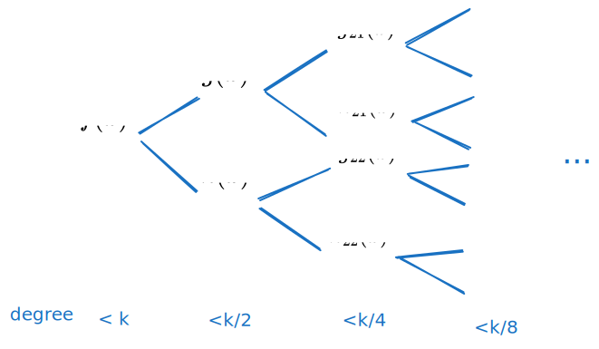
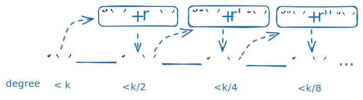
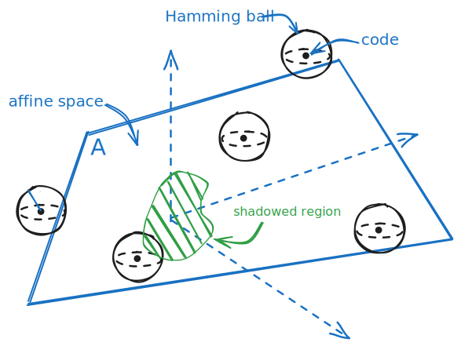
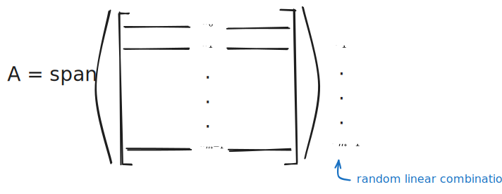
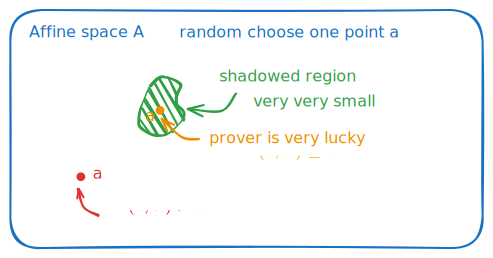
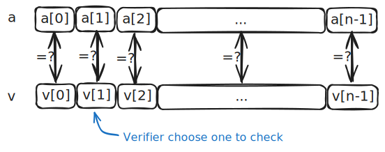
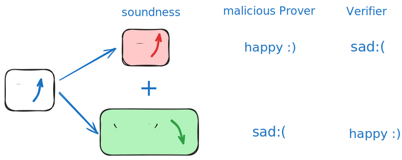
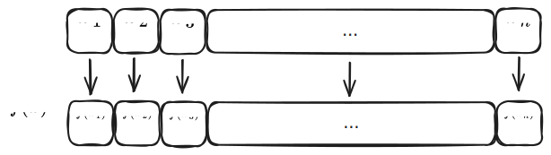
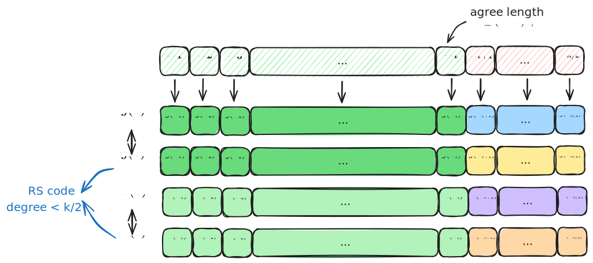
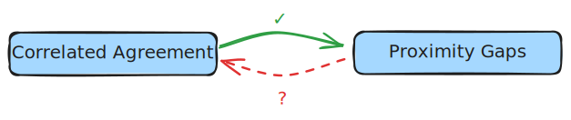

# Proximity Gaps 与 Correlated Agreement：FRI 安全性证明的核心

- Jade Xie  <jade@secbit.io>
- Yu Guo <yu.guo@secbit.io>

本文主要受 [Proximity Gaps & Applications to Succinct Proofs](https://www.youtube.com/watch?v=8AMiZdWA1eM) 视频中的启发，结合论文[BCIKS20] ，介绍 Proximity Gaps 的概念，以及与 Proximity Gaps 有着紧密联系的 Correlated Agreement 定理，其在 FRI 安全性证明中起了非常重要的作用。

在 FRI 协议中，对于一个多项式 $f: \mathcal{D} \rightarrow \mathbb{F}_q$ ，设 $f(x) = a_0 + a_1 x + a_2 x^2 + \ldots + a_{k-1}x^{k-1}$ ，其是一个次数小于 $k$ 的多项式，将其在域 $\mathcal{D}$ 上进行求值，其中 $|\mathcal{D}| = n$ ，则 $f \in \mathrm{RS}[\mathbb{F}_q, \mathcal{D}, k]$ 。Prover 想向 Verifier 证明 $f(x)$ 的次数确实是小于 $k$ 的。如果 $f \in \mathrm{RS}[\mathbb{F}_q, \mathcal{D}, k]$ ，则 Verifier 输出 `accept` ，如果 $f$ 距离对应的编码空间 $\mathrm{RS}[\mathbb{F}_q, \mathcal{D}, k]$ 有 $\delta$ 远，则输出 `reject` 。Verifier 能够获得的是关于一系列函数的 oracle ，FRI 协议想要实现的就是 Verifier 查询 oracle 尽可能的少，并能区分出 $f$ 属于上述哪一种情况。

不妨设 $k-1$ 为偶数，那么

$$
\begin{aligned}
    f(x) & = a_0 + a_1 x + a_2 x^2 + \ldots + a_{k-1}x^{k-1} \\
    & = (a_0 + a_2 x^2 + \cdots + a_{k-1}x ^{k-1}) + x (a_1 + a_3 x^2 + \cdots + a_{k-2}x^{k-3}) \\
    & := g(x^2) + xh(x^2) 
\end{aligned}
$$

可以发现函数 

$$
\begin{aligned}
    g(x) = a_0 + a_2 x + \cdots + a_{k-1}x ^{\frac{k-1}{2}} \\
    h(x) = a_1 + a_3 x + \cdots + a_{k-2}x^{\frac{k-3}{2}}
\end{aligned}
$$

开始 Prover 想向 Verifier 证明 $f(x)$ 的次数小于 $k$ ，现在可以分解成三个子问题：

1. 证明函数 $g(x)$ 的次数小于 $k/2$ ，即 $g(x) \in \mathrm{RS}[\mathbb{F}_q, \mathcal{D}^{(1)}, k/2]$
2. 证明函数 $h(x)$ 的次数小于 $k/2$ ，即 $h(x) \in \mathrm{RS}[\mathbb{F}_q, \mathcal{D}^{(1)}, k/2]$
3. 证明 $f(x) = g(x^2) + x \cdot h(x^2)$

其中 $|{D}^{(1)}| = n/2$ 。第三项是证明奇偶拆分是正确的。同样可以分别对 $g(x)$ 和 $h(x)$ 进行类似 $f(x)$ 那样奇偶项的分解，分别分解成两个次数小于 $k/4$ 的多项式，这样就要证明 4 个多项式的次数小于 $k/4$ ，直到最后分解到证明常数多项式。这个过程如下图所示，可以发现要证明的多项式在以 $2$ 的指数的形式增长。在这个过程中，为了证明奇偶拆分是没有问题的，需要发送关于所有这些多项式的 oracle 给 Verifier ，可以想象发送的多项式实在是太多了，随着 $k$ 的增加是爆炸性增长的。

既然我们的目的是证明多项式的次数小于某一个数，我们的想法是不希望对 $f(x)$ 分解问题时像上面那样分叉，分成两个多项式，我们想要下一步证明一个多项式次数小于 $k/2$ ，这样能大大减少发送的多项式。怎么做到这一点呢？我们可以向 Verifer 要一个随机数 $r \in \mathbb{F}$ ，将 $g(x)$ 和 $h(x)$ 作线性组合，得到 $g(x) + r \cdot h(x)$ ，将 $f(x)$ 的次数小于 $k$ 的问题分解为：

1. $f^{(1)}(x) = g(x) + r \cdot h(x)$ 的次数小于 $k/2$ ，即 $f^{(1)}(x) \in \mathrm{RS}[\mathbb{F}_q, \mathcal{D}^{(1)}, k/2]$

这时发送的多项式的图形就变成下图这样了，可以看到要发送的多项式的 oracle 大大减少了。

那么现在剩下一个问题是，这样做是否和原来的方式等价呢？当然如果 Prover 是诚实的，根据 RS 编码的线性性，$g(x),h(x) \in \mathrm{RS}[\mathbb{F}_q, \mathcal{D}^{(1)}, k/2]$ ，那么其线性组合之后依然是在 $\mathrm{RS}[\mathbb{F}_q, \mathcal{D}^{(1)}, k/2]$ 中的。但如果 Prover 作弊呢？例如 $g(x)$ 距离编码空间 $\mathrm{RS}[\mathbb{F}_q, \mathcal{D}^{(1)}, k/2]$ 有 $\delta$ 远，我们希望用随机数 $r$ 进行线性组合之后的 $g(x) + r \cdot h(x)$ 还是有 $\delta$ 这么远，这样 Verifier 能够发现 Prover 作弊。我们不希望的是折叠之后的 $g(x) + r \cdot h(x)$ 距离对应的编码空间变得更近了。Proximity Gaps 告诉我们发生这样的概率是非常小的，和中彩票一样，这样我们就可以大胆的用随机数进行折叠了。

## Proximity Gaps

上面我们考虑的是两个多项式折叠的情况，实际中我们会用到随机数一次进行多折或者对多个多项式进行 batch。这里我们不妨考虑一般的情况，假设有 $m$ 个向量 $(u_0, \ldots, u_{m-1})$ ，对每一个 $u_i \in \mathbb{F}_q^{\mathcal{D}}$ ，可以看作是 $\mathcal{D} \rightarrow \mathbb{F}$ 上的多项式，也可以看作是 $|\mathcal{D}| = n$ 维的向量。对这 $m$ 个向量进行线性组合，记作 $A = \mathrm{span}\{u_0, \ldots, u_{m-1}\}$ ，这里的 $A$ 是 $\mathbb{F}^{\mathcal{D}}$ 中的 affine space ，记编码空间 $V := \mathrm{RS}[\mathbb{F}, \mathcal{D},k]$ 。

我们关心 $A$ 中的元素与编码空间 $V$ 之间的距离关系是怎样的。如下图所示，将编码空间 $V$ 中的所有 code 表示为点，以这些点为圆心，以 $\delta$  为半径画一个球体。$A$ 形成的空间用一个二维平面表示，如果 $A$ 中的元素距离 $V$ 中的某些 code 之间的相对 Hamming 距离小于等于 $\delta$ ，就说明与图中的某些 Hamming 球之间有交集，将所有的这些交集并起来就形成了图中绿色的阴影区域。换句话说，对于阴影区域 $S \subset A$ 的每一个元素 $a$ ，一定存在一个 $v \in V$ ，使得 $\Delta(a, v) \leq \delta$ 。

我们将 $\mathbb{F}^{\mathcal{D}}$ 中的所有的 affine space 组成一个集合 $\mathrm{C}_{\mathrm{Affine}}$ ，Proximity Gaps 结论[BCIKS20, Theorem 1.2]告诉对于任意一个 $A \in \mathrm{C}_{\mathrm{Affine}}$ （如 $A = \mathrm{span}\{u_0, \ldots, u_{m-1}\}$），都有要么 $A$ 中的所有的元素都在阴影区域里面，要么 $A$ 中只有很少的一部分元素在阴影区域中。不可能说 $A$ 中一半的元素在阴影区域，而另一半的元素不在阴影区域中。用公式表达就是只能符合下面两种情况之一：

1. $\Pr_{a \in A}[\Delta(a, V) \le \delta] \le \epsilon$
2. $\Pr_{a \in A}[\Delta(a, V) \le \delta] = 1$

我们称 $\delta$ 为 proximity 参数(proximity parameter)， $\epsilon$ 为误差参数(error parameter)，它是一个非常小的数。当然关于 $\epsilon$ 有具体表达式的，其和 $q,n,\rho,\delta$  是相关的，即 $\epsilon = \epsilon(q,n,\rho,\delta)$ ，其中 $\rho$ 表示码率， $\rho = \frac{k}{n}$ 。

那么这里的阴影区域代表什么呢？这个结论与 FRI 的安全性分析之间有什么关系呢？下面针对诚实的 Prover 和作弊的 Prover 这两种情况来应用 Proximity Gaps 结论进行分析。

### 诚实的 Prover

如果是诚实的 Prover ，那么对 $(u_0, \ldots, u_{m-1})$ 中的每一个向量都有 $u_i \in V$ 。

由 RS 编码的线性性，我们知道线性组合之后一定还在编码空间 $V$ 中，因此 $A \subset V$ ，此时 $A$ 中所有的元素都在 $V$ 中，那么 Verifier 进行随机线性组合之后，任意选取一点 $a \in A$ ，都能得到 $a \in V$ ，此时 Verifier 一定会接受。这种情况对应 Proximity Gaps 中的第二种情况，取 $\delta = 0$ ，此时

$$
    \Pr_{a \in A}[\Delta(a, V) = 0] = 1
$$

### 恶意的 Prover

如果 Prover 作弊，假设在 Prover 发送给 Verifier 的 $m$ 个向量 $\vec{u} = (u_0, \ldots, u_{m-1})$ 中混入了一个向量距离 $V$ 有 $\delta$ 远，即

$$
\exists u_i^* \in \vec{u}, \quad \Delta(u_i^*, V) > \delta
$$

那么在 $A = \mathrm{span}\{u_0,u_1, \ldots,u_{m-1}\}$ 中，取 $a^* = u_i^* \in A$ ，肯定有

$$
\exists a^* \in A, \quad \Delta(a^*, V) > \delta
$$

此时根据 Proximity Gaps 结论，已经有 $A$ 中的一个元素不在阴影区域内了，因此排除 $\Pr_{a \in A}[\Delta(a, V) \le \delta] = 1$ 这种情况，只能是 $\Pr_{a \in A}[\Delta(a, V) \le \delta] \le \epsilon$ 。这也说明哪怕 $m$ 个向量中只有一个向量距离对应的编码空间有 $\delta$ 那么远， $A$ 中大部分元素都距离 $V$ 有 $\delta$ 那么远。换句话说，随机从 $A$ 中选取的一点 $a$ ，其与 $V$ 之间的距离能代表 $m$ 个向量中距离 $V$ 的最远距离。

现在 Verifier 就从 $A$ 中随机选取一点 $a \in A$ ，来检查 $\Delta(a,V)$ 是否大于 $\delta$ ，会出现两种情况。一种是选到了图中的阴影区域，另一种是选到阴影区域之外。

**情况 1 ： $\Delta(a, V) \le \delta$ 。** 此时 Verifier 选取的点 $a$ 在阴影区域内。我们说此时 Prover 非常幸运，虽然 Prover 提供了的错误的 witness ，即距离编码空间 $\delta$ 远，但是随机线性组合之后距离编码空间变得有 $\delta$ 那么近了，此时 Prover 能成功骗过 Verifer 。出现这种情况对 Verifier 来说不是好事，好在 Proximity Gaps 结论告诉我们 $\Pr_{a \in A}[\Delta(a, V) \le \delta] \le \epsilon$ ，也就是随便选一点能进入阴影区域的概率是非常非常小的，Prover 需要像中彩票那么幸运才行，也就是此时 Prover 能成功骗过 Verifier 的概率不会超过 $\epsilon$ 。

**情况 2 ： $\Delta(a, V) > \delta$ 。** 此时 Verifier 选取的点 $a$ 在阴影区域外。Prover 还有可能作弊成功吗？还是有的，因为 Verifer 收到了关于 $a$ 的 oracle ，但是不会去检查 $a$ 中的所有值，只想查询某一些值来看是否在 $V$ 中。如果 Verifier 只查询一次，由于 $\Delta(a, V) > \delta$ ，那么 $a$ 中有大于 $\delta$ 比例的分量与 $v$ 对应的分量不等，此时 Verifier 有大于 $\delta$ 的概率抓到 Prover 作弊，也就是说此时 Prover 能作弊成功的概率不超过 $1 - \delta$ 。

如果 Verifier 重复查询 $\kappa$ 次，此时 Prover 能作弊成功的概率不会超过 $(1 - \delta)^{\kappa}$ 。

那么，作弊的 Prover 能够成功的概率是上述两种情况的联合概率，即不会超过 

$$
\epsilon + (1 - \delta)^{\kappa}
$$

上面分析的思路其实就是一般 FRI 协议 soundness 分析的思路，论文中会将发生情况 1 叫做发生了一些“坏”的事件(“bad” event) ，然后假设“坏”的事件没有发生的情况下，估计情况 2 的概率，最后再将两个结合起来进行分析。

我们知道 FRI 协议分为两个阶段，一个是 Commit 阶段，另一个是 Query 阶段。我们可以将上述两种情况与这两个阶段对应起来：

1. 上述情况 1 发生在 Commit 阶段，Verifier 会选取随机数让 Prover 对多项式进行折叠。
2. 上述情况 2 对应发生在 Query 阶段，此时 Verifier 会随机选取一些点进行 query 检查。

如果是 batched 版本的 FRI 协议，想证明多个多项式 $f_0^{(0)}, f_1^{(0)}, \ldots, f_t^{(0)}$ ，都是小于 $k$ 次的多项式，可以先用随机数 $\{x_1,\ldots, x_t\}$ 进行聚合，得到

$$
f^{(0)}(x) = f_0^{(0)} + \sum_{i = 1}^{t} x_i \cdot f_i^{(0)}
$$

然后再对 $f^{(0)}(x)$ 应用一般的 FRI 协议，证明其是小于 $k$ 次的多项式。这里分析 soundness 也是对应上述情况 1 ，即可能存在由于随机数的选取导致 $f^{(0)}(x)$ 距离对应的 RS 编码空间变得不再有 $\delta$ 远。

## $\delta$ 增加带来的影响

下面分析下 proximity 参数 $\delta$ 的增加会带来什么影响？我们已经分析出作弊的 Prover 能成功骗过 Verifier 的概率不超过

$$
\epsilon + (1 - \delta)^{\kappa}
$$

这个概率由两部分组成， $\delta$ 的增加会导致：

1. $\epsilon \uparrow$。从图形上来理解，$\delta$ 控制了每个 Hamming 球的半径，如果 $\delta$ 增大，那么 Hamming 球变大，其与 affine space $A$ 之间的交集按理说就会更大，也就是阴影区域增大，这就意味着 $\epsilon$ 会变大。
   - 对作弊的 Prover 来说是好事 :） 。因为此时 Prover 变得比之前更加幸运了，有更大的概率进入绿色的阴影区域，能成功骗过 Verifier 了。
   - 自然，对 Verifier 来说是坏事 :( 。
2. $(1 - \delta)^{\kappa} \downarrow$。这个式子是直接和 $\delta$ 相关的，$\delta$ 增大，那么 $(1 - \delta)^{\kappa}$ 会变小。
   - 对作弊的 Prover 来说是坏事 :( 。因为此时 Prover 作弊成功的概率会变小。
   - 对 Verifier 来说是好事 :) 。 此时有更大的概率抓住 Prover 作弊。在达到相同的安全性要求下， Verifier 只需要更少的轮询次数就能达到要求了。
  
可以看到，$\delta$ 的增加使得 $\epsilon$ 变大， $(1 - \delta)^{\kappa}$ 变小，在实际中，$\epsilon$ 是非常小的，$(1 - \delta)^{\kappa}$ 在整个和式中所占比例更大，因此整体还是会变小的，这对于整个 FRI 协议来说，soundness 变小，也说明会更加安全。

上面是从 soundness 角度分析的，视频 [Proximity Gaps & Applications to Succinct Proofs](https://www.youtube.com/watch?v=8AMiZdWA1eM) 中还提到一点，$\delta$ 的增大会使得 Correlated Agreement 结论变得更弱， Correlated Agreement 是一个比 Proximity Gaps 更强的结论（到目前为止，还没有证明出它们等价）。下面就介绍下 Correlated Agreement 结论。

<!-- 我理解是从整个协议层面考虑，此时 Prover 能向 Verifier 确保的存在码字 $v_{i} \in V$ ，使得 $v_{i}$ 与 $u_{i}$ 一致的区域 $\mathcal{D}'$ 变得比原来更小了，说明协议能够承诺或者确保的事情比原来更弱了。举个例子，协议原来能确保的是一个数 $x > 100$ ，现在只能确保这个数 $x > 1$ 了。 -->

## Correlated Agreement

前面提到的 affine space $A = \mathrm{span}\{u_0,u_1, \ldots,u_{m-1}\}$ ，为保持和 [BCIKS20, Theorem 1.6] 结论一致，在第一个向量 $u_0$ 前不使用随机数，设 $A = u_0 + \mathrm{span}\{u_1, \ldots,u_{m-1}\}$ 。

Correlated Agreement 定理 ([BCIKS20, Theorem 1.6]) 说的是如果 $\delta \in (0, 1 - \sqrt{\rho})$ 并且

$$
\Pr_{a \in A}[\Delta(a, V) \le \delta] > \epsilon,
$$

其中，$\epsilon$ 就是 Proximity Gaps 结论中给出的 $\epsilon$ ，那么存在 $\mathcal{D}' \subset \mathcal{D}$ ，以及 $v_0, \ldots, v_{m-1} \in V$ 使得

1. **Density** ： $\frac{|\mathcal{D}'|}{|\mathcal{D}|} \ge 1 - \delta$ ，
2. **Agreement** ：对任意的 $i \in \{0, \ldots, m - 1\}$ ，有 $u_i|_{\mathcal{D}'} = v_i|_{\mathcal{D}'}$ 。

意思是如果落入阴影区域的元素很多，占比比 Proximity Gaps 结论中的 $\epsilon$ 还大的话，那么在 $V$ 中存在码字 $v_0, \ldots, v_{m-1}$ ，会在区域 $\mathcal{D}$ 中存在一个占比很大(超过 $1 - \delta$ )的子集 $\mathcal{D}'$ ，在这里每个 $u_i$ 都能与对应的 $v_i$ 在 $\mathcal{D}'$ 上是一致的。根据 Proximity Gaps 的结论，$A$ 中的元素分为以下两种情况：

1. $\Pr_{a \in A}[\Delta(a, V) \le \delta] \le \epsilon$
2. $\Pr_{a \in A}[\Delta(a, V) \le \delta] = 1$

现在落入阴影区域的元素占比比 $\epsilon$ 还大，那么自然排除第一种情况，得出 $A$ 中所有的元素都落在阴影区域中，即

$$\Pr_{a \in A}[\Delta(a, V) \le \delta] = 1 .$$

而 Correlated Agreement 定理给出了更加具体的结论，说的是在折叠之前的元素 $u_{i}$ 与在编码空间 $V$ 中找到的码字 $v_{i}$ 之间的关系。

例如，Prover 想证明的是一个多项式 $f \in \mathrm{RS}[\mathbb{F}_q, \mathcal{D}^{(0)}, k]$ ，设 $\mathcal{D}^{(0)} = \{x_1, \ldots, x_n\}$ ，计算 $\{f(x_1), \ldots, f(x_n)\}$ ，Prover 就会将这些值的 oracle 发送给 Verifier ，实际中会采用 Merkle 树的方式来实现 oracle。

将 $f$ 通过拆分得到两个多项式 $g(x)$ 与 $h(x)$ 。诚实的情况下 $g,h \in \mathrm{RS}[\mathbb{F}_q, \mathcal{D}^{(1)}, k/2]$ ，其中 $|\mathcal{D}^{(1)}| = |\mathcal{D}^{(0)}| / 2 = n/2$ 。

Correlated Agreement 结论告诉我们，对于 $g(x)$ 与 $h(x)$ 形成的 affine space $A = \{g + z \cdot h : z \in \mathbb{F}\}$ ，如果 $A$ 中有超过 Proximity Gaps 结论中的 $\epsilon$ 的比例的元素都落入了“阴影区域”，即满足 $\Delta(a, V) \ge \delta$ ，那么就存在如下图所示的 $\mathcal{D}'$ ，以及 $\bar{g},\bar{h} \in \mathrm{RS}[\mathbb{F}_q, \mathcal{D}^{(1)}, k/2]$ 。不妨设 $\mathcal{D}' = \{\alpha_1, \alpha_2, \ldots, \alpha_i\}$ ，那么根据结论 $|\mathcal{D}'| / |\mathcal{D}^{(1)}| \ge 1 - \delta$ ，有指标 $i \ge (1 - \delta)n/2$ 。在所有的 $\mathcal{D}'$ 上，$g$ 与 $\bar{g}$ 一致，$h$ 与 $\bar{h}$ 一致，在图中用绿色表示，意思就是在这些 $\mathcal{D}'$ 集合中的点上求值，它们的值是一样的。

回到 $\delta$ 增大的分析，可以看到随着 $\delta$ 的增大，Correlated Agreement 结论里的第一条 **Density** 中的 $1 - \delta$ 就会变小，这使得结论中能确保的存在 $V$ 中的 $v_i$ 与 $u_i$ 一致的子集 $\mathcal{D}'$ 就变小了，使得得到的结论更弱了。

在 [BCIKS20] 论文中说到， Proximity Gap 定理([BCIKS20, 定理 1.2]) 就是通过 Correlated Agreement 定理([BCIKS20, 定理 1.6]) 推导得出的，但是 Proximity Gap 定理目前还不知道能否推出 Correlated Agreement 。如果 Proximity Gap 不能推出 Correlated Agreement 定理的话，说明 Correlated Agreement 定理是一个比 Proximity Gap 定理更强的结论。那如果能推出的话，说明这两个定理就等价了。

其实 Correlated Agreement 定理的版本很多，取不同的 $A$ 就能得到不同的定理，$A$ 可以是：

1. 线(lines)：$A = \{u_0 + z u_1: z \in \mathbb{F}\}$
2. 低次参数化曲线(low-degree parameterized curves)：$\mathrm{curve}(\mathbf{u}) = \left\{u_z: = \sum_{i = 0}^{m-1}z^i \cdot u_i  | z \in \mathbb{F}_q   \right\}$
3. affine space：$u_0 + \mathrm{span}\{u_1, \cdots, u_{m-1}\}$

同时，关于 Correlated Agreement 定理的条件

$$
\Pr_{a \in A}[\Delta(a, V) \le \delta] > \epsilon,
$$

这里我们测量的是 $a$ 与 $V$ 之间的相对 Hamming 距离，我们还可以将这个测度变得更一般化，加上权重，给一个权重函数 $\mu: \mathcal{D} \rightarrow [0,1]$ ，定义两个向量 $u$ 与 $v$ 之间的相对 *$\mu$ -agreement* 为

$$
\mathrm{agree}_{\mu}(u,v) := \frac{1}{|\mathcal{D}|} \sum_{x: u(x) = v(x)} \mu(x)
$$

当取 $\mu \equiv 1$ 时，

$$
\mathrm{agree}_{\mu}(u,v) = \frac{1}{|\mathcal{D}|} \sum_{x: u(x) = v(x)} \mu(x) = \frac{1}{|\mathcal{D}|} \sum_{x: u(x) = v(x)} 1 = 1 - \Delta(u,v) 
$$
这个测度的值就完全等于用 $1$ 减去相对 Hamming 距离了。同样定义一个向量 $u$ 与编码空间 $V$ 之间的最大 agreement 为

$$
\mathrm{agree}_{\mu}(u,V):= \max_{v \in V} \mathrm{agree}_{\mu}(u,v)
$$

将定理中的条件变为：

$$
\Pr_{a \in A}[\mathrm{agree}_{\mu} \le \alpha] > \epsilon,
$$

就会得到对应的 Weighted correlated agreement 定理(见[BCIKS20, Section 7])。可见 Correlated agreement 定理是非常灵活的。在论文[BCIKS20, Theorem 8.3]中关于 batched FRI 协议的 soundness 证明，就先定义了需要的权重函数 $\mu$ ，使用 Weighted Correlated Agreement 定理来证明，而不是用  Proximity Gap 定理来进行证明。且该定理一般都出现在反证法中，它能有力的帮我们找到编码空间的码字 $v_{i}$ ，且满足定理结论中说到的性质，能够通过推导帮助我们找到矛盾。

## Correlated Agreement 定理在 soundness 中的应用

这里简单描述下 Correlated Agreement 定理在 soundness 证明中的应用，没有那么严谨，实际的安全性分析会更加复杂。

前面说过 FRI 协议的 soundness 分析分为两个部分：

1. 在batch 阶段 或者 Commit 阶段，由于随机数的选择不当，使得原本距离编码空间很远的多项式，经过折叠之后距离相应的编码空间变得更近了，也就是进入了“阴影区域”。
2. 在 Query 阶段，由于随机进行检查，导致没抓住 Prover 作弊。

Correlated Agreement 定理主要就是应用在第一部分中的概率分析，会先定义“坏”的事件 $E^{(i)}$ ：折叠之前 $\Delta^*(f^{(i)}, \mathrm{RS}^{(i)}) > \delta$ ，将 $f^{(i)}$ 拆分为 $g^{(i+1)}$ 与 $h^{(i+1)}$ ，再用随机数 $r \in \mathbb{F}$ 进行折叠之后得到 $\mathrm{fold}_{r}(f^{(i)})$ ，发生了 

$$
\Delta(\mathrm{fold}_{r}(f^{(i)}), \mathrm{RS}^{(i+1)}) \le \delta
$$

这里用到了 $\Delta^*$ ，它的定义与 Hamming 距离有所区别，其联系了 FRI 的 Query 阶段的随机查询，这里就不详细展开了。假设发生一个“坏”的事件 $E^{(i)}$ 的概率不超过 $\epsilon$ ，即

$$
\Pr[E^{(i)}] = \Pr_{r \in \mathbb{F}}[\Delta(\mathrm{fold}_{r}(f^{(i)}), \mathrm{RS}^{(i+1)}) \le \delta] \le \epsilon \tag{1}
$$

如果 FRI 协议中折叠 $d$ 次，那么发生一些“坏”的事件的概率不超过 $d \cdot \epsilon$ ，即

$$
\bigcup_{i = 0}^{d} \Pr[E^{(i)}] \le d \cdot \epsilon
$$

这样就将第一部分的概率分析出来了，接着再假设没有这些“坏”的事件发生，来分析第二部分的概率，最终结合两部分概率就能得到 soundness 的结论。

现在剩下的一个关键问题是如何证明 $(1)$ 式，即证明如果 $\Delta^*(f^{(i)}, \mathrm{RS}^{(i)}) > \delta$ ，有

$$
\Pr_{r \in \mathbb{F}}[\Delta(\mathrm{fold}_{r}(f^{(i)}), \mathrm{RS}^{(i+1)}) \le \delta] \le \epsilon \tag{2}
$$

思路就是用反证法，假设 $(2)$ 式不成立，即

$$
\Pr_{r \in \mathbb{F}}[\Delta(\mathrm{fold}_{r}(f^{(i)}), \mathrm{RS}^{(i+1)}) \le \delta] > \epsilon
$$

这就满足了 Correlated Agreement 定理的条件了，说明此时存在 $\mathcal{D}' \subset \mathcal{D}^{(i+1)}$ ，以及 $\bar{g}^{(i+1)}, \bar{h}^{(i+1)} \in \mathrm{RS}^{(i+1)}$ 满足

$$
\bar{g}^{(i+1)}|_{\mathcal{D}'} = {g}^{(i+1)}|_{\mathcal{D}'} , \quad \bar{h}^{(i+1)}|_{\mathcal{D}'} = {h}^{(i+1)}|_{\mathcal{D}'}
$$

并且 $|\mathcal{D}'| \ge (1-\delta) |\mathcal{D}^{(i+1)}|$ 。拿着这编码空间中的码字 $\bar{g}^{(i+1)}$ 与 $\bar{h}^{(i+1)}$ ，能得到一个多项式 $\bar{f}^{(i)}$ ，

$$
\bar{f}^{(i)}(x) = \bar{g}^{(i+1)}(x^2) + x \cdot \bar{h}^{(i+1)}(x^2)
$$

由于编码的线性性，那么 $\bar{f}^{(i)}$ 肯定也是一个码字，且 $\bar{f}^{(i)} \in \mathrm{RS}^{(i)}$ ，同时有

$$
\bar{f}^{(i)}|_{\mathcal{D}'} = {f}^{(i)}|_{\mathcal{D}'} 
$$

由于 $|\mathcal{D}'| \ge (1-\delta) |\mathcal{D}^{(i+1)}|$ ，我们可以得到 $\Delta^*(f^{(i)}, \mathrm{RS}^{(i)}) \le \Delta^*(f^{(i)}, \bar{f}^{(i)}) \le \delta$ ，这与假设矛盾，因此 $(2)$ 式成立。

## 总结

Proximity gap 在 FRI 协议中起着至关重要的作用，它能让我们放心的用随机数对多项式进行折叠，这大大减少了 Prover 发送 oracle 的数量，同时也减少了 Verifier 查询的数量。此外，Proximity gap 和 Correlated Agreement 定理密切相关，并且在 FRI 的 soundness 分析中起到了关键作用。

## References

- [BCIKS20] Eli Ben-Sasson, Dan Carmon, Yuval Ishai, Swastik Kopparty, and Shubhangi Saraf. Proximity Gaps for Reed–Solomon Codes. In *Proceedings of the 61st Annual IEEE Symposium on Foundations of Computer Science*, pages 900–909, 2020.
- 视频：[Proximity Gaps & Applications to Succinct Proofs](https://www.youtube.com/watch?v=8AMiZdWA1eM)
