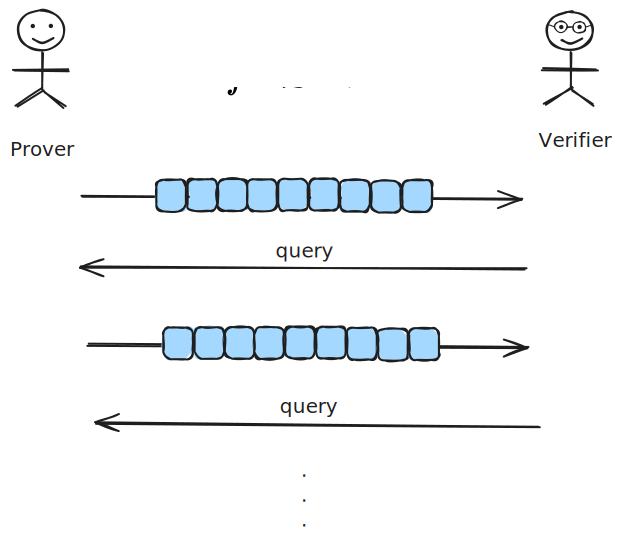
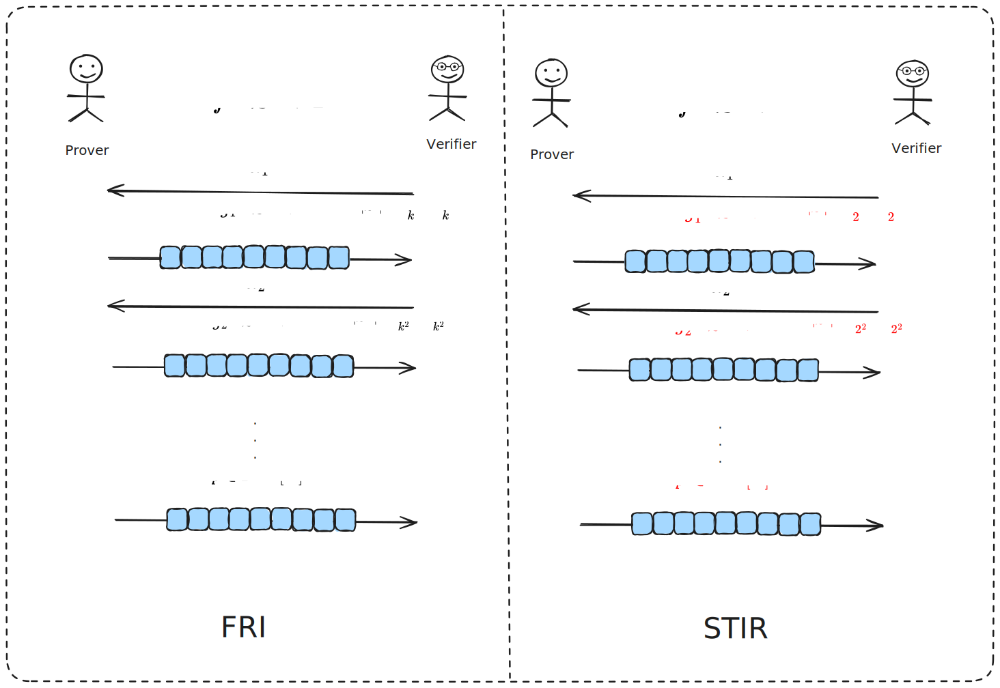
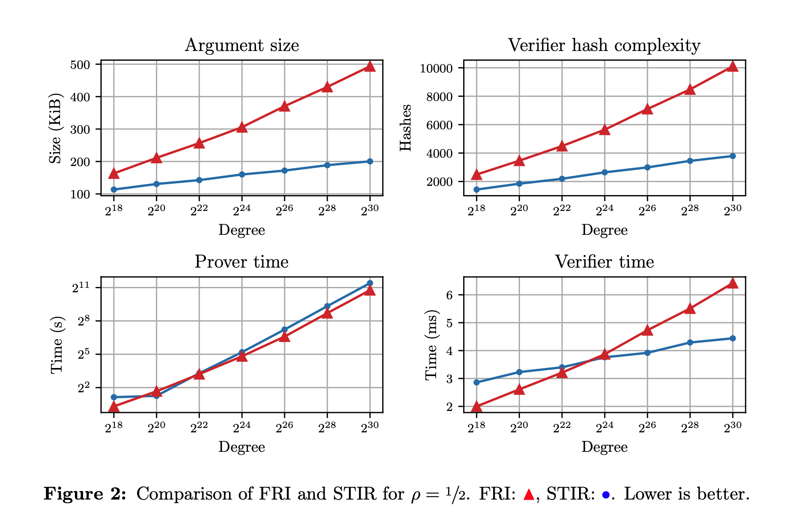
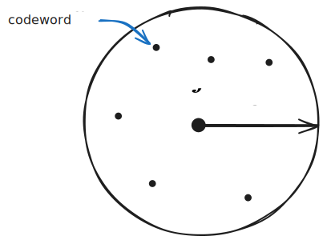
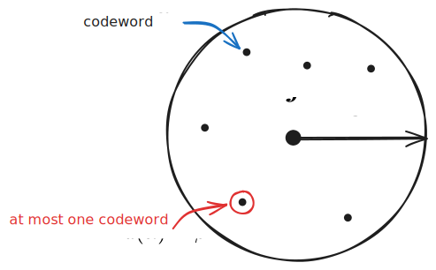
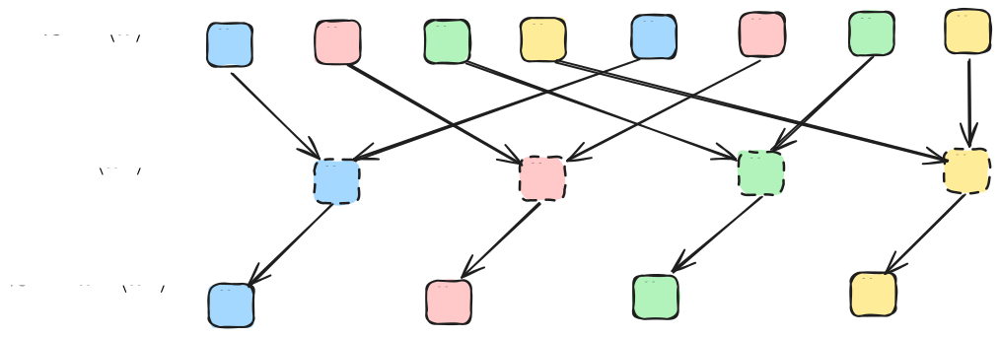
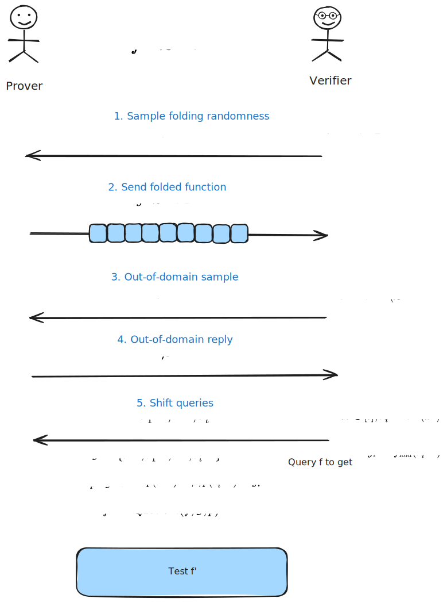

# STIR: Improving Rate to Reduce Query Complexity

- Jade Xie  <jade@secbit.io>
- Yu Guo <yu.guo@secbit.io>

This article is mainly inspired by the blog post [STIR: Reed–Solomon Proximity Testing with Fewer Queries](https://gfenzi.io/papers/stir/) by the authors of the [STIR paper](https://eprint.iacr.org/2024/390) and the presentation [ZK11: STIR: Reed–Solomon Proximity Testing with Fewer Queries - Gal Arnon & Giacomo Fenzi](https://www.youtube.com/watch?v=OLklJjp8KB4&ab_channel=ZeroKnowledge), introducing the STIR protocol.

Like FRI, STIR also solves the Reed-Solomon Proximity Testing problem, but compared to FRI, it has lower query complexity, which reduces the size of the argument and the hash complexity of the Verifier. So how does STIR achieve this? The answer is in the name itself, STIR stands for **S**hift **T**o **I**mprove **R**ate, and the core idea of STIR is to improve the rate by shifting the evaluation domain in each round. Intuitively, the rate actually characterizes the proportion of true information contained in the codeword. As the rate decreases, the true information decreases, corresponding to an increase in redundancy in the codeword, making it easier for the Verifier to test the proximity of a received message to the encoding space. In other words, the Verifier's testing ability becomes stronger. This means that the Verifier only needs fewer queries to achieve the target security. Let's look at how STIR reduces the rate by comparing FRI and STIR.

## FRI v.s. STIR

For a finite field $\mathbb{F}$, let $\mathcal{L} \subseteq \mathbb{F}$ be the evaluation domain, with size $|\mathcal{L}| = n$, and let $d$ denote the degree bound (assume both $n$ and $d$ are powers of 2). Then the Reed-Solomon encoding space $\mathrm{RS}[\mathbb{F},\mathcal{L},d]$ contains all functions $f: \mathcal{L} \rightarrow \mathbb{F}$ such that $f$ is consistent with the evaluation of a polynomial of degree strictly less than $d$ on $\mathcal{L}$. The rate is $\rho := d/|\mathcal{L}|$.

The goal of the protocol is to solve the Reed-Solomon Proximity Testing problem, where the Verifier can obtain a function $f: \mathcal{L} \rightarrow \mathbb{F}$ through queries. The Verifier's goal is to query the values of $f$ at as few locations as possible to distinguish which of the following cases $f$ belongs to:
1. $f$ is a Reed-Solomon codeword, i.e., $f \in \mathrm{RS}[\mathbb{F},\mathcal{L},d]$;
2. $f$ is $\delta$-far from all codewords in the Reed-Solomon encoding space $\mathrm{RS}[\mathbb{F},\mathcal{L},d]$ in relative Hamming distance, i.e., $\Delta(f, \mathrm{RS}[\mathbb{F},\mathcal{L},d]) > \delta$.

We consider the above Reed-Solomon Proximity Testing problem under the IOPP (Interactive Oracle Proofs of Proximity) model, where the Verifier can interact with the Prover and obtain the Prover's messages through an oracle, as shown in the following figure.

After a series of interactions with the Prover, the Verifier has two situations:
* If $f \in \mathrm{RS}[\mathbb{F},\mathcal{L},d]$, the Verifier accepts :)
* If $\Delta(f, \mathrm{RS}[\mathbb{F},\mathcal{L},d]) > \delta$, the Verifier rejects with high probability :(

We compare the FRI protocol and the STIR protocol in the case of $k$-fold, as shown in the following figure.

In the FRI protocol, assume that $g_1$ is obtained by $k$-fold using the random number $\alpha_1$, where $\mathcal{L}^{k} = \{x^k,x\in \mathcal{L}\}$. Therefore, testing $f \in \mathrm{RS}[\mathbb{F},\mathcal{L},d]$ is converted to testing $g_1 \in \mathrm{RS}[\mathbb{F},\mathcal{L}^k,d/k]$, and recursively testing $g_i \in \mathrm{RS}[\mathbb{F},\mathcal{L}^{k^i},d/k^i]$. Thus, in the $i$-th round, its rate is

$$
\rho_i = \frac{\frac{d}{k^i}}{|\mathcal{L}_i|} = \frac{d}{k^i} \cdot \frac{k^i}{n} = \frac{d}{n} = \rho
$$

We can see that in each round, the rate $\rho_i$ remains constant at $\rho$.

In the STIR protocol, note that $g_1'$ is still $k$-folded, but the size of its evaluation domain $\mathcal{L}'$ is not reduced by $k$ times, but by 2 times. At this time, testing $f \in \mathrm{RS}[\mathbb{F},\mathcal{L},d]$ is converted to testing $g_1' \in \mathrm{RS}[\mathbb{F},\mathcal{L}',d/k]$. Then in the $i$-th round, we need to test $g_i' \in \mathrm{RS}[\mathbb{F},\mathcal{L}_{i}',d/k^i]$. Now

$$
\rho_i = \frac{\frac{d}{k^i}}{|\mathcal{L}'_i|} = \frac{d}{k^i} \cdot \frac{2^i}{n} = \left( \frac{2}{k}\right)^i \cdot \frac{d}{n} = \left( \frac{2}{k}\right)^i \cdot \rho
$$

If $\frac{2}{k} < 1$, i.e., $k > 2$, we can see that the rate $\rho_{i}$ decreases in each round, which is the key to STIR's reduction in query complexity. In other words, because the Verifier's testing ability becomes stronger, it only needs fewer queries to achieve the target security.

When we compile the above IOPP into a SNARK, we need to use the BCS transformation ([BCS16], BCS transformation), which consists of two steps:

1. Merkle commit the Prover's messages, and when the Verifier wants to query, open these commitments. This step transforms the IOPP into a succinct interactive argument.
2. Use the Fiat-Shamir transform to convert the succinct interactive argument obtained in the first step into a non-interactive one.

In the BCS transformation, the IOPP needs to have a strong soundness property called round-by-round soundness, which requires the IOPP to have a relatively small soundness error in each round, which is a stronger requirement than requiring the entire IOPP to have a relatively small soundness error. Let's assume that the bound for the round-by-round soundness error is $2^{-\lambda}$. Each round can be queried $t_{i}$ times repeatedly, and the entire IOPP protocol goes through $M$ rounds, so the total query complexity of the entire proof is $\sum_{i = 0}^M t_i$. For $\delta$ reaching the Johnson bound, i.e., $\delta = 1 - \sqrt{\rho}$, we can calculate that

1. The query complexity of FRI is:

    $$
        O \left( \lambda \cdot \frac{\log d}{- \log \sqrt{\rho}} \right)
    $$

2. The query complexity of STIR is:

    $$
        O \left( \lambda \cdot \log \left( \frac{\log d}{- \log \sqrt{\rho}} \right) + \log d \right)
    $$
    
In the query complexity of STIR, $d$ is usually not large, so the first term $\lambda \cdot \log \left( \frac{\log d}{- \log \sqrt{\rho}} \right)$ accounts for a larger proportion. We can see that it is at the $\log \log$ level, while the original FRI is only at the $\log$ level.

Figure 2 in Section 6.4 of the paper [ACFY24] gives the experimental results comparing FRI and STIR. We can see that the reduction in query complexity of STIR results in better performance in terms of argument size and the number of hashes computed by the Verifier compared to FRI. This is understandable, as fewer query complexity means:

1. A reduction in the overall argument size is obvious.
2. With fewer queries, the Verifier needs to open fewer Merkle commitments, resulting in fewer hash computations.

## Powerful Tools for RS Encoding

Here we first introduce several powerful tools for RS encoding, which can help us understand the specific STIR protocol construction.

### Folding

For a function $f: \mathcal{L} \rightarrow \mathbb{F}$, given a random number $r \in \mathbb{F}$, its $k$-fold function is denoted as $f_r := \mathrm{Fold}(f,r) : \mathcal{L}^{k} \rightarrow \mathbb{F}$. It is defined as, for each $x \in \mathcal{L}^{k}$, we can find $k$ $y$ in $\mathcal{L}$ satisfying $y^k = x$. From $k$ pairs of $(y, f(y))$, we can obtain a unique polynomial $\hat{p}$ of degree less than $k$ satisfying $\hat{p}(y) = f(y)$, then $\hat{p}(r)$ is the value of the function $f_r(x)$. This definition of the Fold function is completely consistent with the definition of the Fold function in the FRI protocol, and it has two good properties.

The first property is distance preservation.

1. If the function $f$ before folding is in $\mathrm{RS}[\mathbb{F}, \mathcal{L}, d]$, then for any randomly chosen $r \in \mathbb{F}$, the folded function is still an RS code, i.e., $f_r \in \mathrm{RS}[\mathbb{F}, \mathcal{L}^k, d/k]$.
2. For $\delta \in (0, 1 - \sqrt{\rho})$, if $f$ is $\delta$-far from $\mathrm{RS}[\mathbb{F}, \mathcal{L}, d]$, then with probability at least $1 - \mathrm{poly}(|\mathcal{L}|)/\mathbb{F}$ over the choice of random $r$, $f_r$ is $\delta$-far from $\mathrm{RS}[\mathbb{F}, \mathcal{L}^k, d/k]$.

This property ensures that we can boldly perform folding. If the Prover cheats and provides a function that is $\delta$-far from the encoding space, the folded function will still be $\delta$-far from the corresponding encoding space with high probability.

The second property is called Local, which means that to obtain the value of the folded function at any point, we only need to query the values of $f$ at $k$ points to calculate it, because at this time we can obtain a unique polynomial $\hat{p}$ of degree less than $k$, and then substitute $r$ to calculate $\hat{p}(r)$, which is the value at that point. At this time, the Prover does not need to provide an oracle for $\mathrm{Fold}(f,r)$ separately, the Verifier can obtain it by accessing the oracle of $f$, which reduces the argument size.

### Quotienting

For functions $f: \mathcal{L} \rightarrow \mathbb{F}$ and $p: S \rightarrow \mathbb{F}$, where $S \subseteq \mathbb{F}$, the quotient with respect to function $f$ is defined as:

$$
\mathrm{Quotient}(f, S, p)(x) := \frac{f(x) - \hat{p}(x)}{\prod_{a \in S}(X - a)},
$$

where $\hat{p}$ is the unique polynomial of degree less than $|S|$ satisfying $\hat{p}(a) = p(a)$ for all $a \in S$.

An important property of this function is Consistency. Assuming $S$ and $\mathcal{L}$ are disjoint (actually they can intersect, the conclusion will be more complex, see [ACFY24] Lemma 4.4), then

1. If $f \in \mathrm{RS}[\mathbb{F}, \mathcal{L}, d]$, it is an evaluation of a polynomial of degree less than $d$ on $\mathcal{L}$, and this polynomial is consistent with $p$ on $S$, then $\mathrm{Quotient}(f, S, p) \in \mathrm{RS}[\mathbb{F}, \mathcal{L}, d - |S|]$.
2. If for any polynomial $\hat{u}$ of degree less than $d$ that is $\delta$-close to $f$, $\hat{u}$ is not completely consistent with $p$ on $S$, i.e., for some $a \in S$, $\hat{u}(a) \neq p(a)$, then $\mathrm{Quotient}(f, S, p)$ is $\delta$-far from $\mathrm{RS}[\mathbb{F}, \mathcal{L}, d - |S|]$.

Regarding point 2 above, for codewords $\hat{u}$ within $\delta$ range of $f$, the set of these codewords is denoted as $\mathrm{List}(f,d,\delta)$. For any $\hat{u} \in \mathrm{List}(f,d,\delta)$, as long as there is a point on $S$ where $\hat{u}(a) \neq p(a)$, the distance of the quotient polynomial $\mathrm{Quotient}(f, S, p)$ is amplified and becomes $\delta$-far. In other words, if an incorrect value $f(a) - p(a)$ is divided here, the quotient polynomial becomes very far from the RS encoding space of low-degree polynomials.

Note that here we require that for any $\hat{u} \in \mathrm{List}(f,d,\delta)$, $\hat{u}$ is inconsistent with $p$ on $S$. Using the Out of Domain Sampling method, we can limit the codewords within $\delta$ range of $f$ to at most one with high probability, which makes it easier for the Verifier to detect. We will discuss this method in detail in the next section.

The $\mathrm{Quotient}$ function can help us add constraints on the function $f$. For example, if we want to restrict the value of $f$ at point $a$ to be $b$, we can achieve this through $\mathrm{Quotient}(f, \{a\}, p)$, where $p(a) = b$, i.e.,

$$
\mathrm{Quotient}(f, \{a\}, p) = \frac{f(x) - p(x)}{x - a} 
$$

Then we just need to prove $\mathrm{Quotient}(f, \{a\}, p) \in \mathrm{RS}[\mathbb{F}, \mathcal{L}, d - 1]$. If the $f$ provided by the Prover does not have a value of $b$ at point $a$, i.e., $f(a) \neq b$, then $f(a) \neq p(a)$, which will cause $\mathrm{Quotient}(f, \{a\}, p)$ to be $\delta$-far from $\mathrm{RS}[\mathbb{F}, \mathcal{L}, d - 1]$, making it easy for the Verifier to detect. Here we only added one constraint, of course we can add multiple constraints, so we can add constraints to $f$ while converting the test of $f$ to testing whether the $\mathrm{Quotient}$ function is $\delta$-close to the corresponding RS encoding space.

The $\mathrm{Quotient}$ function, like the folding function, has the Local property. To calculate the value of the $\mathrm{Quotient}$ function at a point $x \in \mathcal{L}\backslash\mathcal{S}$, it can be calculated by querying the value of function $f$ at point $x$.

### Out of Domain Sampling

Out of Domain Sampling is a powerful tool that can help us limit the number of codewords within $\delta$ range of the function $f$ provided by the Prover, thus converting List Decoding to Unique Decoding.

Generally, for a function $f: \mathcal{L} \rightarrow \mathbb{F}$, the Verifier randomly selects a number $\alpha \in \mathbb{F} \backslash \mathcal{L}$ from outside the domain $\mathcal{L}$, and the Prover returns a value $\beta$. Then in the list of codewords $\mathrm{List}(f,d,\delta)$ within $\delta$ range of $f$, with high probability, there is at most one codeword $\hat{u}$ satisfying $\hat{u}(\alpha) = \beta$.

This can be explained using the fundamental theorem of algebra. We only need to prove that the probability of two different codewords $\hat{u}'$ and $\hat{u}$ in $\mathrm{List}(f,d,\delta)$ having the same value at point $\alpha$ is relatively small, which implies that with high probability, there is at most one codeword satisfying $\hat{u}(\alpha) = \beta$.

First, fix two different codewords $\hat{u}'$ and $\hat{u}$. Since they are different codewords and both have degree less than $d$, by the fundamental theorem of algebra, we have

$$
\Pr_{\alpha \leftarrow \mathbb{F} \backslash \mathcal{L}} [\hat{u}'(\alpha) = \hat{u}(\alpha)] \le \frac{d - 1}{|\mathbb{F}| - |\mathcal{L}|}
$$

Suppose $\mathrm{RS}[\mathbb{F}, \mathcal{L},d]$ is $(\delta, l)$ list-decodable, meaning that there are at most $l$ codewords within $\delta$ range. Then there are $\binom{l}{2}$ ways to choose two different codewords $\hat{u}'$ and $\hat{u}$. Therefore, the probability of any two different codewords $\hat{u}'$ and $\hat{u}$ having the same value at point $\alpha$ does not exceed $\binom{l}{2} \cdot \frac{d - 1}{|\mathbb{F}| - |\mathcal{L}|}$. This probability is very small, thus proving the point.

How to restrict that the $\beta$ sent by the Prover is really the value of $f$ at point $a$? This can be achieved using the Quotient tool introduced in the previous section.

## Deep Dive into One Iteration of the STIR Protocol

In this section, we will apply the three tools mentioned earlier to delve into one iteration of the STIR protocol.

Objective:

- Initially given a function $f$, we want to prove that it is in $\mathrm{RS}[\mathbb{F},\mathcal{L},d]$, where $\mathcal{L} =\langle \omega \rangle$.
- After one iteration, prove that function $f' \in \mathrm{RS}[\mathbb{F},\mathcal{L}',d/k]$, where $\mathcal{L}' = \omega \cdot \langle \omega^2 \rangle$.

That is, function $f$ is $k$-folded, its degree is reduced to $d/k$, but the size of the evaluation domain $\mathcal{L}'$ of function $f'$ after one iteration is not reduced by $k$ times, but by 2 times. This is the core idea of the STIR protocol mentioned earlier, reducing query complexity by improving the rate.

Regarding the evaluation domains $\mathcal{L} =\langle \omega \rangle$ and $\mathcal{L}' = \omega \cdot \langle \omega^2 \rangle$, here's an example to illustrate. Suppose $\omega^8 = 1$.

The $\mathcal{L}'$ constructed in this way is half the size of $\mathcal{L}$, but actually $\langle \omega^2 \rangle$ can also satisfy the requirement of halving. Why not choose $\mathcal{L}' = \langle \omega^2 \rangle$? Suppose we perform $k = 4$ folds, we can ensure that $\mathcal{L}^4 = \{\omega^4, \omega^8\}$ and $\mathcal{L}' = \{\omega^1, \omega^3,\omega^5, \omega^7\}$ are disjoint. The advantage of doing this is to avoid constructing the function $\mathrm{Fill}$ defined by the intersection points in $\mathcal{L}^4 \cap \mathcal{L}'$, so the Verifier doesn't need to additionally check if the function values of $\mathrm{Fill}$ are correct (as explained in [ACFY24] Remark 5.3).

The protocol flow for one iteration is shown in the following figure:

1. Sample folding randomness: The Verifier first randomly selects a number $r^{\mathrm{fold}}$ from $\mathbb{F}$, which will be used to fold function $f$.
2. Send folded function: The Prover sends the folded function $g: \mathcal{L}' \rightarrow \mathbb{F}$. If the Prover is honest, then function $g$ is the evaluation of polynomial $\hat{g}$ on $\mathcal{L}'$. Here, evaluation means that $g$ is completely consistent with $\hat{g}$ on $\mathcal{L}'$, and polynomial $\hat{g}$ is obtained through $\mathrm{Fold}(f, r^{\mathrm{fold}})$. First, use the random number $r^{\mathrm{fold}}$ to perform $k$-fold on function $f$, obtaining $\mathrm{Fold}(f, r^{\mathrm{fold}}) : \mathcal{L}^k \rightarrow \mathbb{F}$. At this time, the range of the folded function is $\mathcal{L}^k$, but we want it to take values on $\mathcal{L}'$. We just need to extend the domain of $\mathrm{Fold}(f, r^{\mathrm{fold}})$ to $\mathcal{L}'$, obtaining polynomial $\hat{g}: \mathcal{L}' \rightarrow \mathbb{F}$, which has degree less than $d/k$.
3. Out-of-domain sample: The Verifier takes a random number $r^{\mathrm{out}}$ from $\mathbb{F}\backslash \mathcal{L}'$ and sends it to the Prover.
4. Out-of-domain reply: The Prover replies with $\beta \in \mathbb{F}$. If the Prover is honest, then $\beta := \hat{g}(r^{\mathrm{out}})$.

> 📝 **Notes**
> The purpose of steps 3 and 4 here is to use Out of Domain Sampling to convert list decoding to unique decoding, that is, the Verifier selects a random number $r^{\mathrm{out}}$ from $\mathbb{F} \backslash \mathcal{L}$ and requires the Prover to reply with $\beta$.

5. Shift queries: The Verifier selects $t$ random numbers from $\langle \omega^k \rangle$, i.e., $\forall i \in [t],r_i^{\mathrm{shift}} \leftarrow \langle \omega^k \rangle$. According to the Local property of the folding function, the Verifier can calculate $y_i := f_{\mathrm{fold}}(r_i^{\mathrm{shift}})$ by querying $f$, where $f_{\mathrm{fold}} :=\mathrm{Fold}(f, r^{\mathrm{fold}})$.

In step 2, the Prover sent $g: \mathcal{L}' \rightarrow \mathbb{F}$ and claims that it is consistent with $\mathrm{Fold}(f, r^{\mathrm{fold}})$ on $\mathcal{L}'$, but the Verifier cannot directly query the values of the folded function on $\mathcal{L}'$. The Verifier can only calculate the values of $\mathrm{Fold}(f, r^{\mathrm{fold}})$ on $\mathcal{L}^k$ by querying $f$. Fortunately, we can use the Quotient tool here to ensure consistency.

In steps 3 and 4, the Out-of-domain Sampling method is first used to limit the number of codewords within $\delta$ range of $g$ to at most one, denoted as $\hat{u}$. Then in step 5, query the values of $\mathrm{Fold}(f, r^{\mathrm{fold}})$ on $\mathcal{L}^k$, which is convenient for subsequent verification of whether $\hat{u}$ is consistent with the folded function on $\mathcal{L}^k$. The verification of consistency is left to the Quotient function.

Let's form a set $\mathcal{G} := \{r^{\mathrm{out}},r_1^{\mathrm{shift}}, \ldots, r_t^{\mathrm{shift}}\}$ of all these points that need to ensure consistency, and then define a function $p: \mathcal{G}\rightarrow \mathbb{F}$ that satisfies:

$$
p(r^{\mathrm{out}}) = \beta,
$$

$$
p(r_i^{\mathrm{shift}}) = y_i.
$$

Define the next function $f'$ as

$$
f' := \mathrm{Quotient}(f, \mathcal{G}, p) = \frac{g(x) - \hat{p}(x)}{\prod_{a \in \mathcal{G}}(X - a)}.
$$

Due to the Local property of the Quotient function, to calculate the values of $f'$ on $\mathcal{L}'$, we only need to query the values of $g$ on $\mathcal{L}'$.

At this point, we just need to test whether $f'$ is $\delta$-close to $\mathrm{RS}[\mathbb{F},\mathcal{L}',d/k]$.

Looking closely at the formula for $f'$, we can see that if the Prover is honest, $f' \in \mathrm{RS}[\mathbb{F}, \mathcal{L}', d/k - |\mathcal{G}|]$. There is actually a reduction in the degree of the polynomial here, and degree correction is needed to correct the degree of $f'$ to $d/k$. This point will be discussed in the following text.

## Soundness Analysis

In this section, we will perform a soundness analysis for one iteration, that is, if the Prover cheats and $f$ is $\delta$-far from $\mathrm{RS}[\mathbb{F},\mathcal{L},d]$, we analyze the probability that $f'$ is also relatively far from $\mathrm{RS}[\mathbb{F},\mathcal{L}',d/k- |\mathcal{G}|]$. [ACFY24] Lemma 1 gives the following conclusion:

**Proposition 1** [ACFY24, Lemma 1] If $f$ is $\delta$-far from $\mathrm{RS}[\mathbb{F},\mathcal{L},d]$, then except with probability $(1 - \delta)^t +  \mathrm{poly}(|\mathcal{L}|)/|\mathbb{F}|$, $f'$ is (approximately) $(1 - \sqrt{\rho'})$-far from $\mathrm{RS}[\mathbb{F},\mathcal{L}',d/k- |\mathcal{G}|]$.

Proof idea:

1. According to the distance-preserving property of the folding function, the function $f_{r^{\mathrm{fold}}} := \mathrm{Fold}(f, r^{\mathrm{fold}})$ obtained after folding $f$ with the random number $r^{\mathrm{fold}}$ is $\delta$-far from $\mathrm{RS}[\mathbb{F},\mathcal{L}^k,d/k]$ with probability greater than $1 - \mathrm{poly}(|\mathcal{L}|/|\mathbb{F}|)$.
2. According to the property of Out-of-domain Sampling, the probability that $g$ has at most one codeword $\hat{u}$ within $1 - \sqrt{\rho'}$ range satisfying $\hat{u}(r^{\mathrm{out}}) = \beta$ is greater than $1 - \mathrm{poly}(|\mathcal{L}|)/|\mathbb{F}|$.

Now let's analyze point 2. The function $g: \mathcal{L}' \rightarrow \mathbb{F}$, now consider its distance from the encoding space $\mathrm{RS}[\mathbb{F}, \mathcal{L}', d/k]$. According to the Johnson bound, $\mathrm{RS}[\mathbb{F}, \mathcal{L}', d/k]$ is $(\gamma, l)$-list-decodable, where $\gamma \approx 1 - \sqrt{\rho'}$, $l = \mathrm{poly}(|\mathcal{L}'|) =\mathrm{poly}(|\mathcal{L}|)$, which means there are at most $l$ polynomials of degree less than $d/k$ that are not more than $\gamma$ away from $g$. Then for any two different polynomials $\hat{u}'$ and $\hat{u}$ chosen from these $l$ polynomials, when randomly selecting $r^{\mathrm{out}}$ from $\mathbb{F} \backslash \mathcal{L}'$, the probability that their values at point $r^{\mathrm{out}}$ are both equal to $\beta$ does not exceed $\frac{d/k - 1}{|\mathbb{F}| - |\mathcal{L}'|}$. There are $\binom{l}{2}$ ways to choose these two polynomials, so this probability does not exceed

$$
\binom{l}{2} \cdot \frac{d/k - 1}{|\mathbb{F}| - |\mathcal{L}'|} = O\left(\frac{l^2 \cdot (d/k - 1)}{|\mathbb{F}| - |\mathcal{L}'|}\right) = \mathrm{poly}(|\mathcal{L}|)/|\mathbb{F}|.
$$

Therefore, the probability that $g$ has at most one codeword $\hat{u}$ within $1 - \sqrt{\rho'}$ range satisfying $\hat{u}(r^{\mathrm{out}}) = \beta$ is greater than $1 - \mathrm{poly}(|\mathcal{L}|)/|\mathbb{F}|$.

If both item 1 and item 2 hold, this probability is greater than $1 - \mathrm{poly}(|\mathcal{L}|)/|\mathbb{F}|$. Now we only need to prove that the probability that $f'$ is (approximately) $(1 - \sqrt{\rho'})$-far from $\mathrm{RS}[\mathbb{F},\mathcal{L}',d/k- |\mathcal{G}|]$ is at least $1 - (1 - \delta)^t$.

Let's discuss two cases:

* If there is no codeword satisfying the requirement in item 2, that is, there is no codeword satisfying $\hat{u}(r^{\mathrm{out}}) = \beta$ within $1 - \sqrt{\rho'}$ range of $g$, and according to the construction of the protocol, $p(r^{\mathrm{out}}) = \beta$. Therefore, for any codeword within $1 - \sqrt{\rho'}$ range of $g$, we have $\hat{u}(r^{\mathrm{out}}) \neq p(r^{\mathrm{out}})$. Since

    $$
    f' := \mathrm{Quotient}(g, \mathcal{G}, p) = \frac{g(x) - \hat{p}(x)}{\prod_{a \in \mathcal{G}}(X - a)}.
    $$

    According to the consistency of the Quotient function, at this time $\hat{u}$ and $p$ are not completely consistent on $\mathcal{G}$, so $f' = \mathrm{Quotient}(f, \mathcal{G}, p)$ is $(1 - \sqrt{\rho'})$-far from $\mathrm{RS}[\mathbb{F},\mathcal{L}',d/k- |\mathcal{G}|]$.

* If there exists a codeword $\hat{u}$ satisfying the requirement in item 2, there is already a codeword satisfying $\hat{u}(r^{\mathrm{out}}) = \beta$ within $1 - \sqrt{\rho'}$ range of $g$. According to

    $$
    f' := \mathrm{Quotient}(g, \mathcal{G}, p) = \frac{g(x) - \hat{p}(x)}{\prod_{a \in \mathcal{G}}(X - a)}.
    $$

    Now $\hat{u}(r^{\mathrm{out}}) = \beta = p(r^{\mathrm{out}})$ is already satisfied. If for all $i \in [t]$, we have $\hat{u}(r_i^{\mathrm{shift}}) = y_i = p(r_i^{\mathrm{shift}})$, then $f' = \mathrm{Quotient}(f, \mathcal{G}, p)$ is not more than $(1 - \sqrt{\rho'})$-far from $\mathrm{RS}[\mathbb{F},\mathcal{L}',d/k- |\mathcal{G}|]$. Otherwise, according to the consistency of the Quotient function, as long as for some $i$ we have $\hat{u}(r_i^{\mathrm{shift}}) \neq y_i$, at this time $\hat{u}(r_i^{\mathrm{shift}}) \neq p(r_i^{\mathrm{shift}})$, it will cause $f'$ to be $(1 - \sqrt{\rho'})$-far from $\mathrm{RS}[\mathbb{F},\mathcal{L}',d/k- |\mathcal{G}|]$.
    
    Since item 1 holds, we have $\Delta(f_{r^{\mathrm{fold}}}, \mathrm{RS}[\mathbb{F}, \mathcal{L}^k, d/k]) \ge \delta$ for the folded function, so

    $$
    \begin{aligned}
         \Pr \left[\forall i \in [t], \hat{u}(r_i^{\mathrm{shift}}) = y_i \right] & =  \Pr \left[\forall i \in [t], \hat{u}(r_i^{\mathrm{shift}}) = f_{r^{\mathrm{fold}}}(r_i^{\mathrm{shift}}) \right] \\
         & \le (1 - \delta)^t.
    \end{aligned}
    $$

    Therefore, the probability that $f'$ is (approximately) $(1 - \sqrt{\rho'})$-far from $\mathrm{RS}[\mathbb{F},\mathcal{L}',d/k- |\mathcal{G}|]$ is at least $1 - (1 - \delta)^t$.

Thus, Proposition 1 is proved.  $\Box$ 

In fact, the round-by-round soundness error of the protocol is approximately $\max \{\frac{\mathrm{poly}(|\mathcal{L}|)}{|\mathbb{F}|}, (1 - \delta)^t\}$.

## Degree correction

Now there's a small problem left to solve. According to the definition of function $f'$

$$
    f' := \mathrm{Quotient}(g, \mathcal{G}, p) = \frac{g(x) - \hat{p}(x)}{\prod_{a \in \mathcal{G}}(X - a)}.  
$$

We can see that, strictly speaking, this converts the test of $f$ to testing the distance of $f'$ from $\mathrm{RS}[\mathbb{F},\mathcal{L}',d/k- |\mathcal{G}|]$, rather than $\mathrm{RS}[\mathbb{F},\mathcal{L}',d/k]$, which requires degree correction.

Generally, let's assume that the function we want to perform degree correction on is $f: \mathcal{L} \rightarrow \mathbb{F}$, its initial degree is $d$, and the target corrected degree is $d^* \ge d$. We want to construct an efficient degree correction algorithm that can output a function $f^*$ satisfying:

1. If $f \in \mathrm{RS}[\mathbb{F},\mathcal{L},d]$, then $f^* \in \mathrm{RS}[\mathbb{F},\mathcal{L},d^*]$.
2. If $f$ is $\delta$-far from $\mathrm{RS}[\mathbb{F},\mathcal{L},d]$, then with high probability, $f^*$ is also $\delta$-far from $\mathrm{RS}[\mathbb{F},\mathcal{L},d^*]$.
3. Queries to $f^*$ can be efficiently computed through queries to $f$.

The STIR paper ([ACFY24], Section 2.3) proposes a method that not only satisfies the above three conditions but also uses the method of summing geometric series to make the calculation in item 3 more efficient.

The method is to randomly sample an element $r \leftarrow \mathbb{F}$ from the field and define

$$
f^*(x) = \sum_{i=0}^{e} r^i \cdot f_i(x) \tag{1}
$$

where $f_i(x) := x^i \cdot f(x)$, $e = d^* - d$. Expanding equation (1), we get

$$
f^*(x) = r^0 \cdot x^0 \cdot f(x) + r^1 \cdot x^1 \cdot f(x) + \cdots + r^e \cdot x^e \cdot f(x) \tag{2}
$$

According to the construction of $f^*$, item 1 naturally holds.

For $\delta < \min \{ 1 - \sqrt{\rho}, 1 - (1 + 1/d^*) \cdot \rho\}$, item 2 also holds. This can be obtained from the Correlated Agreement theorem in [BCIKS20], which we won't elaborate on here.

Next, let's analyze item 3. From equation (2), we can see that to calculate the value of $f^*$ at point $x$, after querying the value of $f(x)$, we need to sum $e + 1$ terms, which takes $O(e)$ time. If $e = \Omega(d)$, this is inefficient, but by using the method of summing geometric series, we can reduce the computational complexity to $O(\log e)$.

$$
\begin{aligned}
    f^*(x) & = \sum_{i=0}^{e} r^i \cdot f_i(x) \\
    & = \sum_{i=0}^{e} r^i \cdot x^i \cdot f(x)\\
    & = f(x) \cdot \sum_{i=0}^{e} (r \cdot x)^i \\
\end{aligned}
$$

Using the geometric series sum formula for $\sum_{i=0}^{e} (r \cdot x)^i$, we can get

$$
f^*(x) = \begin{cases}
    f(x) \cdot \frac{1 - (r \cdot x)^{e+1}}{1 - r \cdot x} &  \text{if} \quad r \cdot x \neq 1 \\
    f(x) \cdot (e + 1) & \text{if} \quad r \cdot x = 1
    \end{cases}
$$

For the more complex $f(x) \cdot \frac{1 - (r \cdot x)^{e+1}}{1 - r \cdot x}$, the term $(r \cdot x)^{e+1}$ can be calculated using the repeated squaring method, which takes $O(\log e)$ calculations. Then by querying the value of $f$ at point $x$ to get $f(x)$, it takes $O(\log e)$ operations in total to calculate $f^*(x)$.

This method can be extended to multiple functions of different degrees. For $m$ functions $f_1, \ldots, f_m: \mathcal{L} \rightarrow \mathbb{F}$ and degrees $d_1, \ldots, d_m$, we want to perform batch-degree-correction, finally obtaining a function $f^*$ with degree $d^*$. Randomly sample a random number $r \leftarrow \mathbb{F}$, define $e_i = d^* - d_i$ and

$$
f^*(x) = \sum_{i = 0}^{e_1} r^i \cdot x^i \cdot f_1(x) + r^{1 + e_1} \sum_{i = 0}^{e_2} r^i \cdot x^i \cdot f_2(x) + \cdots + r^{m - 1 + \sum_{j = 1}^{m - 1}e_j} \sum_{i = 0}^{e_m} r^i \cdot x^i \cdot f_m(x).
$$

Similar to the degree correction of a single function above, for $\delta < \min \{ 1 - \sqrt{\rho}, 1 - (1 + 1/d^*) \cdot \rho\}$, if any $f_i$ is $\delta$-far from $\mathrm{RS}[\mathbb{F},\mathcal{L},d_i]$, then $f^*$ is $\delta$-far from $\mathrm{RS}[\mathbb{F},\mathcal{L},d^*]$. Similarly, using the method of summing geometric series, by querying $f_1, \ldots, f_m$, it takes $O(\sum_i \log e_i) = O(m \cdot \log d^*)$ operations to calculate the value of $f^*$ at point $x$.

## Summary

STIR changes the evaluation domain of the function in each round, changing the original $\mathcal{L}^k$ in the FRI protocol to $\mathcal{L}'$. The function is still $k$-folded, but $\mathcal{L}'$ is only half the size of the original. This reduces the rate of the encoding space, which can reduce the number of queries by the Verifier, and this is the core idea of STIR.

In the construction of the STIR protocol, several powerful tools for RS encoding are used, making the entire protocol efficient and secure.

1. First, consistent with the FRI protocol, the function $f$ is $k$-folded, but the resulting function needs to extend its evaluation domain from $\mathcal{L}^k$ to $\mathcal{L}'$. According to the distance-preserving property of the folding function, we can confidently perform this folding.
2. Then, to reduce the Verifier's work, the Out of Domain Sampling method is used to convert list decoding to unique decoding. This is where the Verifier selects a random number $r^{\mathrm{out}}$ from $\mathbb{F} \backslash \mathcal{L}$ and requires the Prover to reply with $\beta$ in the protocol.
3. At this point, after changing the evaluation domain to $\mathcal{L}'$, the problem faced is that the Verifier can only query the values of the $k$-folded function $\mathrm{f}_{r^{\mathrm{fold}}}$ on $\mathcal{L}^k$. Fortunately, the powerful Quotient tool can be used to constrain the function sent by the Prover to be consistent with the folded function on $\mathcal{L}^k$. At this time, the Verifier selects $t$ random numbers $r_{i}^{\mathrm{shift}}$ from $\mathcal{L}^k$ for querying.
4. Finally, combine $r^{\mathrm{out}}$ and $r_{i}^{\mathrm{shift}}$, and use the Quotient tool to constrain the values sent by the Prover at these points to be correct.

Combining these tools, a soundness analysis of one iteration of the STIR protocol was performed. In fact, we can obtain that the round-by-round soundness error of STIR is $\max \{\frac{\mathrm{poly}(|\mathcal{L}|)}{|\mathbb{F}|}, (1 - \delta)^t\}$.

Finally, to raise the degree of $f'$ after iteration from $d/k - |\mathcal{G}|$ to $d/k$, a degree correction method using geometric series summation that can be efficiently calculated was introduced.

## References

- [ACFY24] Gal Arnon, Alessandro Chiesa, Giacomo Fenzi, and Eylon Yogev. "STIR: Reed-Solomon proximity testing with fewer queries." In _Annual International Cryptology Conference_, pp. 380-413. Cham: Springer Nature Switzerland, 2024.
- [BCIKS20] Eli Ben-Sasson, Dan Carmon, Yuval Ishai, Swastik Kopparty, and Shubhangi Saraf. Proximity Gaps for Reed–Solomon Codes. In *Proceedings of the 61st Annual IEEE Symposium on Foundations of Computer Science*, pages 900–909, 2020.
- [BCS16] Eli Ben-Sasson, Alessandro Chiesa, and Nicholas Spooner. "Interactive Oracle Proofs". In: *Proceedings of the 14th Theory of Cryptography Conference*. TCC '16-B. 2016, pp. 31–60.
- [BGKS20] Eli Ben-Sasson, Lior Goldberg, Swastik Kopparty, and Shubhangi Saraf. "DEEP-FRI: Sampling Outside the Box Improves Soundness". In: *Proceedings of the 11th Innovations in Theoretical Computer Science Conference*. ITCS '20. 2020, 5:1–5:32.
- [STIR: Reed–Solomon Proximity Testing with Fewer Queries](https://gfenzi.io/papers/stir/)
- Video: [ZK11: STIR: Reed–Solomon Proximity Testing with Fewer Queries - Gal Arnon & Giacomo Fenzi](https://www.youtube.com/watch?v=OLklJjp8KB4&ab_channel=ZeroKnowledge)