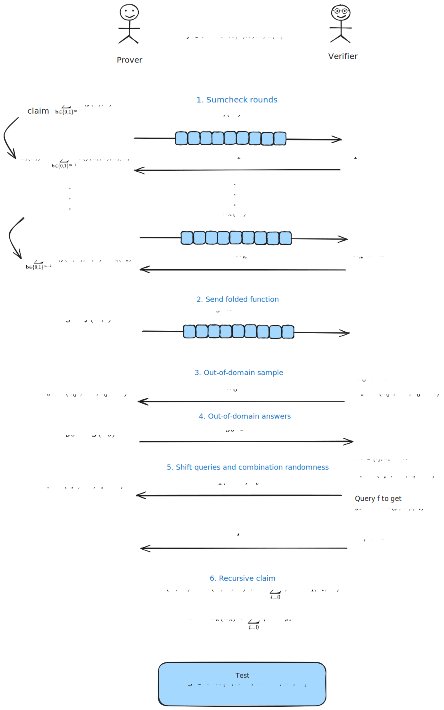
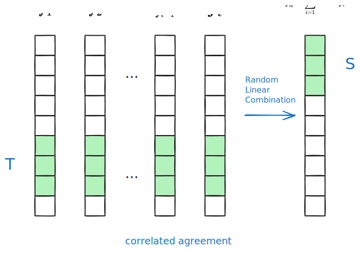
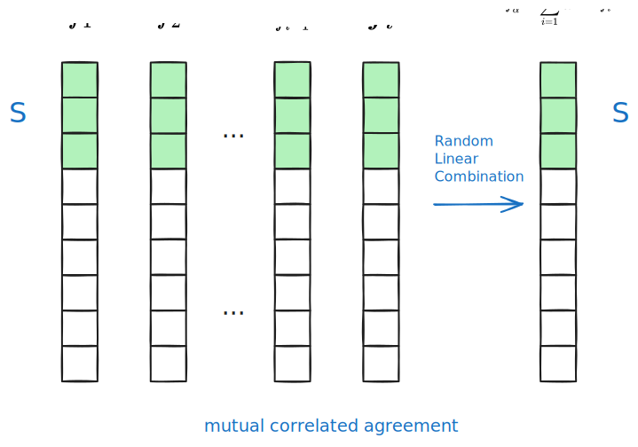

# Note on WHIR: Reed-Solomon Proximity Testing with Super-Fast Verification

- Jade Xie  <jade@secbit.io>
- Yu Guo <yu.guo@secbit.io>

This article mainly introduces the WHIR (Weights Help Improving Rate) protocol [ACFY24b]. Like the FRI [BBHR18], STIR [ACFY24a], and BaseFold [ZCF24] protocols, WHIR is also an IOPP protocol, but it has a smaller query complexity and a faster verification time. The paper [ACFY24b] mentions that WHIR's verifier typically runs in hundreds of microseconds (1 microsecond = $10^{-6}$ seconds), while other protocols' verifiers take a few milliseconds (1 millisecond = $10^{-3}$ seconds). Additionally, WHIR is an IOPP protocol for *constrained Reed-Solomon codes* (CRS), which allows WHIR to support queries for both multivariate linear polynomials and univariate polynomials, which is why WHIR can be compared simultaneously with BaseFold, FRI, and STIR [ACFY24b]. Overall, WHIR combines the ideas of BaseFold and STIR, enabling the WHIR protocol to support multivariate linear polynomials without sacrificing Prover efficiency and argument size, while also having a smaller query complexity.

## From Univariate Polynomials to Multivariate Linear Polynomials

For a finite field $\mathbb{F}$, evaluation domain $\mathcal{L} \subseteq \mathbb{F}$, and Reed-Solomon encoding of degree $d \in \mathbb{N}$, it represents the set of evaluations of all univariate polynomials over $\mathbb{F}$ with degree strictly less than $d$ on $\mathcal{L}$, denoted as $\mathrm{RS}[\mathbb{F}, \mathcal{L}, d]$. Assuming $\mathcal{L}$ is a multiplicative coset of $\mathbb{F}^*$, and its order is a power of 2 (called "smooth" $\mathcal{L}$), and also assuming the degree $d = 2^m$ is in the form of a power of 2, then we can view the univariate polynomial as a multivariate linear polynomial with $m$ variables. (From [ACFY24b, 1.1 Constrained Reed-Solomon codes])

Let's first give a simple example with $d = 2^3$, let

$$
f(x) = a_0 + a_1 x + a_2 x^2 + a_3 x^3 + a_4 x^4 + a_5 x^5 + a_6 x^6 + a_7 x^7 
$$

Let $X_1 = x, X_2 = x^2 , X_3 = x^4$, then $f(x)$ can be represented as:

$$
\begin{aligned}
    f(x) & = a_0 + a_1 x + a_2 x^2 + a_3 x^3 + a_4 x^4 + a_5 x^5 + a_6 x^6 + a_7 x^7 \\
    & = a_0 + a_1 X_1 + a_2 X_2 + a_3 X_1X_2 + a_4 X_3 + a_5 X_1 X_2 + a_6 X_1 X_3 + a_7 X_1 X_2 X_3
\end{aligned}
$$

Denote the new multivariate linear polynomial as

$$
\hat{f}(X_1, X_2, X_3) = a_0 + a_1 X_1 + a_2 X_2 + a_3 X_1X_2 + a_4 X_3 + a_5 X_1 X_2 + a_6 X_1 X_3 + a_7 X_1 X_2 X_3
$$

In this way, $f(x)$ can be viewed as a univariate polynomial, or as a multivariate linear polynomial after variable substitution $X_1 = x, X_2 = x^2 , X_3 = x^4$.

For univariate polynomials in the RS code $\mathrm{RS}[\mathbb{F}, \mathcal{L}, d]$, it's similar, they can be viewed from the perspective of multivariate linear polynomials, i.e.,

$$
\begin{aligned}
    \mathrm{RS}[\mathbb{F}, \mathcal{L}, d] & := \{f: \mathcal{L} \rightarrow \mathbb{F}: \exists \hat{g} \in \mathbb{F}^{< 2^m}[X] \text{ s.t. } \forall x \in \mathcal{L}, f(x) = \hat{g}(x)\} \\
    & = \{f: \mathcal{L} \rightarrow \mathbb{F}: \exists \hat{f} \in \mathbb{F}^{< 2}[X_1, \ldots, X_m] \text{ s.t. } \forall x \in \mathcal{L}, f(x) = \hat{f}(x^{2^0}, x^{2^1},\ldots, x^{2^{m-1}})\}
\end{aligned}
$$

In the above equation, $\hat{g}(x)$ is the univariate polynomial, while $\hat{f}(X_1, \ldots, X_m)$ is the multivariate linear polynomial with $m$ variables. The idea used here appears in BaseFold. (From [ACFY24b, 1.1 Constrained Reed-Solomon codes])

Furthermore, consistent with the FRI protocol, folding a univariate polynomial with a random number $\alpha_1$ can be equivalently viewed as substituting $\alpha_1$ for one of the variables in the multivariate linear polynomial.

For example, for the above $f(x) = a_0 + a_1 x + a_2 x^2 + a_3 x^3 + a_4 x^4 + a_5 x^5 + a_6 x^6 + a_7 x^7$, first fold with $\alpha_1$, then

$$
\begin{aligned}
    f(x) & = a_0 + a_2 x^2 + a_4 x^4 + a_6 x^6 + x (a_1 + a_3 x^2 + a_5 x^4 + a_7 x^6) \\
    & := f_1(x^2) + x f_2(x^2)
\end{aligned}
$$

The folded polynomial is

$$
\begin{aligned}
    f^{(1)}(x) & = f_1(x) + \alpha_1 f_2(x) \\
    & = a_0 + a_2 x + a_4 x^2 + a_6 x^3 + \alpha_1 (a_1 + a_3 x + a_5 x^2 + a_7 x^3) \\
    & = a_0 + a_2 X_1 + a_4 X_2 + a_6 X_1X_2 + \alpha_1 (a_1 + a_3 X_1 + a_5 X_2 + a_7 X_1X_2)
\end{aligned}
$$

This is equivalent to directly substituting values and replacing variables in the original multivariate polynomial $\hat{f}(X_1,X_2,X_3)$, specifically:

1. First, substitute $X_1$ with $\alpha_1$, we get

$$
\begin{aligned}
    \hat{f}(\alpha_1,X_2,X_3) & = a_0 + a_1 \cdot \alpha_1 + a_2 X_2 + a_3 \cdot  \alpha_1 X_2 + a_4 X_3 + a_5 \cdot \alpha_1 X_2 + a_6 X_2 X_3 + a_7 \cdot \alpha_1 X_2 X_3 \\
    & = a_0 + a_2 X_2 + a_4 X_3 + a_6 X_2 X_3 + \alpha_1 (a_1 + a_3 X_2 + a_5 X_2 + a_7 X_2 X_3) 
\end{aligned}
$$

2. Let the new variables $X_1 = X_2$, and $X_2 = X_3$, we get the folded polynomial as

$$
\begin{aligned}
    \hat{f}^{(1)}(X_1, X_2) & = a_0 + a_2 X_1 + a_4 X_2 + a_6 X_1 X_2 + \alpha_1 (a_1 + a_3 X_1 + a_5 X_2 + a_7 X_1 X_2) \\
    & = f^{(1)}(x)
\end{aligned}
$$

We can see that the polynomials obtained by the two folding methods are equivalent, except that $f^{(1)}(x)$ is in the form of a univariate polynomial, while $\hat{f}^{(1)}(X_1, X_2)$ is in the form of a multivariate linear polynomial.

If we want to perform a 4-fold on the original polynomial $f(x)$, from the perspective of univariate polynomials, we can perform a 2-fold on the polynomial $f^{(1)}(x)$ after the 2-fold, i.e.,

$$
\begin{aligned}
    f^{(1)}(x) & = a_0 + a_2 x + a_4 x^2 + a_6 x^3 + \alpha_1 (a_1 + a_3 x + a_5 x^2 + a_7 x^3) \\
    & = (a_0 + \alpha_1 a_1) + (a_2 + \alpha_1 a_3) \cdot x + (a_4 + \alpha_1 a_5) \cdot x^2 + (a_6 + \alpha_1 a_7) \cdot x^3 \\
    & = ((a_0 + \alpha_1 a_1) + (a_4 + \alpha_1 a_5) \cdot x^2) + x \cdot ((a_2 + \alpha_1 a_3) + (a_6 + \alpha_1 a_7) \cdot x^2) \\
    & := f_1^{(1)}(x^2) + x f_2^{(1)}(x^2)
\end{aligned}
$$

Folding with a random number $\alpha_2$, we get the folded polynomial as

$$
\begin{aligned}
    f^{(2)}(x) & = f_1^{(1)}(x) + \alpha_2 f_2^{(1)}(x) \\
    & = ((a_0 + \alpha_1 a_1) + (a_4 + \alpha_1 a_5)  x) + \alpha_2 ((a_2 + \alpha_1 a_3) + (a_6 + \alpha_1 a_7) x) \\
    & = ((a_0 + \alpha_1 a_1) + (a_4 + \alpha_1 a_5) X_1) + \alpha_2 ((a_2 + \alpha_1 a_3) + (a_6 + \alpha_1 a_7)  X_1)
\end{aligned}
$$

From the perspective of multivariate linear polynomials, we can perform a 2-fold on the multivariate linear polynomial $\hat{f}^{(1)}(X_1, X_2)$ after the 2-fold, i.e.,

1. Substitute $X_1$ with $\alpha_2$, we get

$$
\begin{aligned}
    \hat{f}^{(1)}(\alpha_2, X_2) & = a_0 + a_2 \alpha_2 + a_4 X_2 + a_6 \alpha_2 X_2 + \alpha_1 (a_1 + a_3 \alpha_2 + a_5 X_2 + a_7 \alpha_2 X_2) \\
    & = ((a_0 + \alpha_1 a_1) + (a_4 + \alpha_1 a_5) X_2) + \alpha_2 ((a_2 + \alpha_1 a_3) + (a_6 + \alpha_1 a_7)  X_2)
\end{aligned}
$$

2. Let the new variable $X_1 = X_2$, we get the folded polynomial as

$$
\hat{f}^{(2)}(X_1) = ((a_0 + \alpha_1 a_1) + (a_4 + \alpha_1 a_5) X_1) + \alpha_2 ((a_2 + \alpha_1 a_3) + (a_6 + \alpha_1 a_7)  X_1)
$$

We can find that for multiple folds, folding using univariate polynomials and directly folding using multivariate linear polynomials are equivalent. The process of folding a multivariate linear polynomial with random numbers $(\alpha_1, \alpha_2)$ is just the process of direct variable substitution, i.e., we get $\hat{f}^{(2)}(X_1) = \hat{f}(\alpha_1, \alpha_2, X_1)$.

Below we introduce the definition of the folding function given in the paper [ACFY24b], which is consistent with the folding method in the FRI protocol.

**Definition 1** [ACFY24b, Definition 4.14] Let $f: \mathcal{L} \rightarrow \mathbb{F}$ be a function, $\alpha \in \mathbb{F}$. Define $\mathrm{Fold}(f, \alpha): \mathcal{L}^2 \rightarrow \mathbb{F}$ as follows:

$$
\forall x \in \mathcal{L}^2, \; \mathrm{Fold}(f, \alpha)(x^2) = \frac{f(x) + f(-x)}{2} + \alpha \cdot \frac{f(x) - f(-x)}{2 \cdot x}
$$

To calculate $\mathrm{Fold}(f, \alpha)(x^2)$, it's sufficient to query the values of $f$ at $x$ and $-x$.

For $k \le m$ and $\boldsymbol{\alpha} = (\alpha_1, \alpha_2, \ldots, \alpha_k) \in \mathbb{F}^k$, define $\mathrm{Fold}(f, \boldsymbol{\alpha}) : \mathcal{L}^{(2^k)} \rightarrow \mathbb{F}$, denote $\mathrm{Fold}(f, \boldsymbol{\alpha}) := f_k$, recursively define: $f_0 := f$ and $f_i := \mathrm{Fold}(f_{i-1}, \alpha_i)$.

The following proposition tells us that folding a Reed-Solomon code on any set of points still results in a Reed-Solomon code. ([ACFY24b])

**Proposition 1** [ACFY24b, Claim 4.15] Let $f: \mathcal{L} \rightarrow \mathbb{F}$ be a function, $\boldsymbol{\alpha} \in \mathbb{F}^k$ represent folding random numbers, let $g:= \mathrm{Fold}(f, \boldsymbol{\alpha})$. If $f \in \mathrm{RS}[\mathbb{F}, \mathcal{L}, m]$ and $k \le m$, then $g \in \mathrm{RS}[\mathbb{F}, \mathcal{L}^{(2^k)}, m-k]$, and the multilinear extension of $g$ is $\hat{g}(X_k, \ldots, X_m) := \hat{f}(\boldsymbol{\alpha}, X_k, \ldots, X_m)$, where $\hat{f}$ is the multilinear extension of $f$.

The $\hat{g}(X_k, \ldots, X_m) := \hat{f}(\boldsymbol{\alpha}, X_k, \ldots, X_m)$ given in the proposition is consistent with the folding of the univariate polynomial $f$ and the direct folding of the multivariate linear polynomial $\hat{f}$ with random numbers mentioned above. From the perspective of multivariate linear polynomials, it is just direct variable substitution with random numbers $\boldsymbol{\alpha}$, i.e., $\hat{f}(\boldsymbol{\alpha}, X_k, \ldots, X_m)$.

Recalling the FRI protocol, it continuously folds the univariate polynomial $f$ with random numbers $(\alpha_1, \ldots, \alpha_m)$ until finally obtaining a constant polynomial. From the perspective of multivariate linear polynomials, we would eventually get $\hat{f}(\alpha_1, \ldots, \alpha_m)$ as a constant. Connecting to the Sumcheck protocol, the last step also requires obtaining the value of a multivariate polynomial at a certain random point, and the verifier needs to obtain this value for verification. This step is usually implemented using an oracle. Now the FRI protocol can also provide the value of $\hat{f}(\alpha_1, \ldots, \alpha_m)$ at a random point at the end. If the Sumcheck protocol and the FRI protocol choose the same random point $(\alpha_1, \ldots, \alpha_m)$, then the FRI protocol can directly provide the value needed for the last step of the Sumcheck protocol when it reaches the end. Combining the FRI protocol and the Sumcheck protocol in this way is the idea of the BaseFold protocol [ZCF24].

## CRS: Constrained Reed-Solomon codes

Below is the definition of constrained Reed-Solomon codes given in the WHIR paper [ACFY24b]. It is a subset of Reed-Solomon codes, but with an additional constraint similar to Sumcheck.

**Definition 2** [ACFY24b, Definition 1] For a field $\mathbb{F}$, smooth evaluation domain $\mathcal{L} \subseteq \mathbb{F}$, number of variables $m \in \mathbb{N}$, weight polynomial $\hat{w} \in \mathbb{F}[Z, X_1, \ldots, X_m]$, and target $\sigma \in \mathbb{F}$, the **constrained Reed-Solomon code** is defined as

$$
\mathrm{CRS}[\mathbb{F}, \mathcal{L}, m, \hat{w}, \sigma] := \left\{ f \in \mathrm{RS}[\mathbb{F}, \mathcal{L}, m]: \sum_{\mathbf{b} \in \{0,1\}^m} \hat{w}(\hat{f}(\mathbf{b}), \mathbf{b}) = \sigma \right\}.
$$

From the definition, we can see that CRS (constrained Reed-Solomon code) is first a RS code, i.e., $f \in \mathrm{RS}[\mathbb{F}, \mathcal{L}, m]$ in the definition, but on top of this, it needs to satisfy a summation constraint similar to Sumcheck $\sum_{\mathbf{b} \in \{0,1\}^m} \hat{w}(\hat{f}(\mathbf{b}), \mathbf{b}) = \sigma$.

The paper [ACFY24b] mentions that the weight polynomial $\hat{w}$ in the definition can be defined by oneself and has wide applications. The paper gives such an example: an evaluation constraint $\hat{f}(\mathbf{z}) = \sigma$, which constrains the value of the multivariate polynomial $\hat{f}$ at point $\mathbf{z} \in \mathbb{F}^m$ to be the target value $\sigma$. First, perform a multilinear extension on $f \in \mathrm{RS}[\mathbb{F}, \mathcal{L}, m]$ to get

$$
\hat{f}(\mathbf{X}) = \sum_{\mathbf{b} \in \{0,1\}^m} f(\mathbf{b}) \cdot \mathrm{eq}(\mathbf{b}, \mathbf{X})
$$

where $\mathrm{eq}(\mathbf{b}, \mathbf{X}) = \prod_{i=1}^m (b_i X_i + (1 - b_i) \cdot (1 - X_i))$. Therefore, when $\mathbf{b},\mathbf{X} \in \{0,1\}^m$, if $\mathbf{b} = \mathbf{X}$, then $\mathrm{eq}(\mathbf{b}, \mathbf{X}) = 1$, if $\mathbf{b} \neq \mathbf{X}$, then $\mathrm{eq}(\mathbf{b}, \mathbf{X}) = 0$. Thus

$$
\hat{f}(\mathbf{z}) = \sum_{\mathbf{b} \in \{0,1\}^m} f(\mathbf{b}) \cdot \mathrm{eq}(\mathbf{b}, \mathbf{z}) = \sum_{\mathbf{b} \in \{0,1\}^m} \hat{w}(\hat{f}(\mathbf{b}), \mathbf{b})
$$

The weight polynomial $\hat{w}(Z, \mathbf{X})$ can be defined as

$$
\hat{w}(Z, \mathbf{X}) = Z \cdot \mathrm{eq}(\mathbf{X}, \mathbf{z}).
$$

In this way, an evaluation constraint can be represented using the weight polynomial. Based on this, the corresponding PCS can be constructed (from [ACFY24b, 1.1 Hash-based PCS from CRS codes]), in two cases:
1. Constrain the value of the multivariate linear polynomial $\hat{f}$ at $\mathbf{z} \in \mathbb{F}^m$ to be $\sigma$, let the weight polynomial be
    $$
        \hat{w}(Z, \mathbf{X}) = Z \cdot \mathrm{eq}(\mathbf{X}, \mathbf{z}).
    $$
2. Constrain the value of a univariate polynomial $f$ at $z \in \mathbb{F}$ to be $\sigma$, convert this case to the case of multivariate linear polynomials, consider the evaluation point as $\mathbf{z} = (z^{2^0}, \ldots, z^{2^{m-1}})$, then the weight polynomial is
    $$
        \hat{w}(Z, X) = Z \cdot \mathrm{eq}(\mathbf{X}, (z^{2^0}, \ldots, z^{2^{m-1}})).
    $$

## One Iteration of WHIR

As mentioned earlier, BaseFold combined the Sumcheck and FRI protocols, while the WHIR protocol combines the ideas of BaseFold and STIR, replacing the FRI protocol in BaseFold with the STIR protocol. Compared to the FRI protocol, the STIR protocol has a smaller query complexity. The core idea of the STIR protocol is to reduce the rate of each iteration, increasing the redundancy in the messages sent by the Prover, thereby reducing the Verifier's query complexity.

Let's delve into one iteration of the WHIR protocol (from [ACFYb, 2.1.3 WHIR protocol]) to see how WHIR specifically combines BaseFold and the STIR protocol. After one iteration, the problem of testing the proximity of $f \in \mathcal{C} := \mathrm{CRS}[\mathbb{F}, \mathcal{L}, m, \hat{w}, \sigma]$ is transformed into testing $f' \in \mathcal{C}' := \mathrm{CRS}[\mathbb{F}, \mathcal{L}^{(2)}, m - k, \hat{w}', \sigma']$.

1. Sumcheck rounds. Prover and Verifier interact for $k$ rounds of Sumcheck for the constraint in $\mathrm{CRS}[\mathbb{F}, \mathcal{L}, m, \hat{w}, \sigma]$

    $$
    \sum_{\mathbf{b} \in \{0,1\}^m} \hat{w}(\hat{f}(\mathbf{b}), \mathbf{b}) = \sigma
    $$

    where $\hat{f}$ is the multivariate linear polynomial corresponding to $f$.

    a. Prover sends a univariate polynomial $\hat{h}_1(X) := \sum_{\mathbf{b} \in \{0,1\}^{m-1}} \hat{w}(\hat{f}(X, \mathbf{b}), X, \mathbf{b})$ to Verifier, Verifier checks $\hat{h}_1(0) + \hat{h}_1(1) = \sigma$, selects a random number $\alpha_1 \leftarrow \mathbb{F}$ and sends it, the sumcheck claim becomes $\hat{h}_1(\alpha_1) := \sum_{\mathbf{b} \in \{0,1\}^{m-1}} \hat{w}(\hat{f}(\alpha_1, \mathbf{b}), \alpha_1, \mathbf{b})$.
    b. For the $i$-th round, $i$ from $2$ to $k$, Prover sends a univariate polynomial

    $$
    \hat{h}_i(X) := \sum_{\mathbf{b} \in \{0,1\}^{m-i}} \hat{w}(\hat{f}(\alpha_1, \ldots, \alpha_{i - 1}, X, \mathbf{b}), \alpha_1, \ldots, \alpha_{i - 1}, X, \mathbf{b})
    $$

    Verifier checks $\hat{h}_{i}(0) + \hat{h}_{i}(1) = \hat{h}_{i-1}(\alpha_{i-1})$, selects a random number $\alpha_i \leftarrow \mathbb{F}$, the sumcheck claim becomes 

    $$
    \sum_{\mathbf{b} \in \{0,1\}^{m-i}} \hat{w}(\hat{f}(\alpha_1, \ldots, \alpha_{i - 1}, \alpha_i, \mathbf{b}), \alpha_1, \ldots, \alpha_{i - 1}, \alpha_i, \mathbf{b}) = \hat{h}_i(\alpha_i)
    $$

    Therefore, after the above $k$ rounds of sumcheck, prover has sent polynomials $(\hat{h}_1, \ldots, \hat{h}_k)$, verifier has selected random numbers $\boldsymbol{\alpha} = (\alpha_1, \ldots, \alpha_k) \in \mathbb{F}^k$. The initial claim becomes the following statement

    $$
    \sum_{\mathbf{b} \in \{0,1\}^{m-k}} \hat{w}(\hat{f}(\boldsymbol{\alpha}, \mathbf{b}), \boldsymbol{\alpha}, \mathbf{b}) = \hat{h}_k(\alpha_k)
    $$

2. Send folded function. Prover sends function $g: \mathcal{L}^{(2)} \rightarrow \mathbb{F}$. In the case of an honest Prover, $\hat{g} \equiv \hat{f}(\boldsymbol{\alpha}, \cdot)$, $g$ is defined as the evaluation of $\hat{g}$ on domain $\mathcal{L}^{(2)}$.

    This means first folding $\hat{f}$ $2^k$ times with random numbers $\boldsymbol{\alpha}$ to get $\hat{g} = \hat{f}(\boldsymbol{\alpha}, \cdot)$, at this point $\hat{g} : \mathcal{L}^{(2^k)} \rightarrow \mathbb{F}$, with its domain range as $\mathcal{L}^{(2^k)}$. Since $\hat{g}$ is essentially a polynomial, we can change the domain of its variables to $\mathcal{L}^{(2)}$, the function $g$ is consistent with the evaluation of $\hat{g}$ on $\mathcal{L}^{(2)}$.

3. Out-of-domain sample. Verifier selects a random number $z_0 \leftarrow \mathbb{F}$ and sends it to Prover. Let $\boldsymbol{z}_0 := (z_0^{2^0}, \ldots, z_0^{2^{m-k - 1}})$.

4. Out-of-domain answers. Prover sends $y_0 \in \mathbb{F}$. In the honest case, $y_0 := \hat{g}(\boldsymbol{z}_0)$.

5. Shift queries and combination randomness. For Verifier, for each $i \in [t]$, select random numbers $z_i \leftarrow \mathcal{L}^{(2^k)}$ and send, obtain $y_i := \mathrm{Fold}(f, \boldsymbol{\alpha})(z_i)$ by querying $f$. Let $\boldsymbol{z}_i := (z_i^{2^0}, \ldots, z_i^{2^{m- k - 1}})$. Verifier also selects a random number $\gamma \leftarrow \mathbb{F}$ and sends.

6. Recursive claim. Prover and Verifier define new weight polynomial and target value:

$$
\hat{w}'(Z, \boldsymbol{X}) := \hat{w}(Z, \boldsymbol{\alpha}, \boldsymbol{X}) + Z \cdot \sum_{i = 0}^t \gamma^{i+1} \cdot \mathrm{eq}(\boldsymbol{z}_i, \boldsymbol{X})
$$

$$
\sigma' := \hat{h}_k(\alpha_k) + \sum_{i = 0}^t \gamma^{i+1} \cdot y_i,
$$

Then, recursively test $g \in \mathrm{CRS}[\mathbb{F}, \mathcal{L}^{(2)}, m - k, \hat{w}', \sigma']$.

First, let's explain that the constraint in $g \in \mathrm{CRS}[\mathbb{F}, \mathcal{L}^{(2)}, m - k, \hat{w}', \sigma']$ is correct, i.e., prove

$$
\sum_{\boldsymbol{b} \in \{0,1\}^{m-k}} \hat{w}'(g(\boldsymbol{b}), \boldsymbol{b}) = \sigma'
$$

Substituting $\hat{w}'$ and $\sigma'$, we get

$$
\sum_{\boldsymbol{b} \in \{0,1\}^{m-k}} \hat{w}(g(\boldsymbol{b}), \boldsymbol{\alpha}, \boldsymbol{b}) + \sum_{\boldsymbol{b} \in \{0,1\}^{m-k}}  g(\boldsymbol{b}) \cdot \sum_{i = 0}^t \gamma^{i+1} \cdot \mathrm{eq}(\boldsymbol{z}_i, \boldsymbol{b}) = \hat{h}_k(\alpha_k) + \sum_{i = 0}^t \gamma^{i+1} \cdot y_i
$$

We prove this in two parts:
1. Prove
$$
\sum_{\boldsymbol{b} \in \{0,1\}^{m-k}} \hat{w}(g(\boldsymbol{b}), \boldsymbol{\alpha}, \boldsymbol{b}) = \hat{h}_k(\alpha_k)
$$

From step 2 of the protocol, we know $g(\boldsymbol{b}) = \hat{f}(\boldsymbol{\alpha}, \boldsymbol{b})$, therefore

$$
\begin{aligned}
    \sum_{\boldsymbol{b} \in \{0,1\}^{m-k}} \hat{w}(g(\boldsymbol{b}), \boldsymbol{\alpha}, \boldsymbol{b}) & = \sum_{\boldsymbol{b} \in \{0,1\}^{m-k}} \hat{w}(\hat{f}(\boldsymbol{\alpha}, \boldsymbol{b}), \boldsymbol{\alpha}, \boldsymbol{b}) \\
    & = \hat{h}_k(\alpha_k)
\end{aligned}
$$

The last equation is obtained from the final claim of the sumcheck in step 1 of the protocol.

2. Prove

$$
\sum_{\boldsymbol{b} \in \{0,1\}^{m-k}}  g(\boldsymbol{b}) \cdot \sum_{i = 0}^t \gamma^{i+1} \cdot \mathrm{eq}(\boldsymbol{z}_i, \boldsymbol{b}) = \sum_{i = 0}^t \gamma^{i+1} \cdot y_i
$$

Proof:

$$
\begin{aligned}
    \sum_{\boldsymbol{b} \in \{0,1\}^{m-k}}  g(\boldsymbol{b}) \cdot \sum_{i = 0}^t \gamma^{i+1} \cdot \mathrm{eq}(\boldsymbol{z}_i, \boldsymbol{b}) & =  \sum_{i = 0}^t \gamma^{i+1} \cdot \sum_{\boldsymbol{b} \in \{0,1\}^{m-k}} g(\boldsymbol{b}) \cdot  \mathrm{eq}(\boldsymbol{z}_i, \boldsymbol{b}) \\
    & = \sum_{i = 0}^t \gamma^{i+1} \cdot g(\boldsymbol{z}_i) \\
    & = \sum_{i = 0}^t \gamma^{i+1} \cdot y_i
\end{aligned}
$$

Where $\sum_{\boldsymbol{b} \in \{0,1\}^{m-k}} g(\boldsymbol{b}) \cdot  \mathrm{eq}(\boldsymbol{z}_i, \boldsymbol{b}) = g(\boldsymbol{z}_i)$ is precisely what we mentioned earlier about using the weight polynomial $\hat{w}(Z, \mathbf{X}) = Z \cdot \mathrm{eq}(\mathbf{X}, \mathbf{z})$ to constrain the value of a multivariate linear polynomial at a certain point.

This also explains that the constraint definition in $g \in \mathrm{CRS}[\mathbb{F}, \mathcal{L}^{(2)}, m - k, \hat{w}', \sigma']$ is correct.

The definition of the new weight polynomial $\hat{w}'$ is

$$
\hat{w}'(Z, \boldsymbol{X}) := \hat{w}(Z, \boldsymbol{\alpha}, \boldsymbol{X}) + Z \cdot \sum_{i = 0}^t \gamma^{i+1} \cdot \mathrm{eq}(\boldsymbol{z}_i, \boldsymbol{X})
$$

It consists of two parts:
1. The first part $\hat{w}(Z, \boldsymbol{\alpha}, \boldsymbol{X})$ constrains the correctness of $k$ rounds of sumcheck in step 1 of the protocol.
2. The second part $Z \cdot \sum_{i = 0}^t \gamma^{i+1} \cdot \mathrm{eq}(\boldsymbol{z}_i, \boldsymbol{X})$ constrains that the values of $g$ at $\boldsymbol{z}_i$ are correct, and uses random number $\gamma$ to linearly combine these $t + 1$ constraints.
   a. The constraint $g(\boldsymbol{z}_0) = y_0$ is actually verifying the correctness of out-of-domain answers.
   b. For $i \in [t]$, the constraint $g(\boldsymbol{z}_i) = y_i$ is requiring the correctness of shift queries.

This also shows the flexibility of the weight polynomial definition, which can implement multiple constraints at once.

### Connection between WHIR and BaseFold

WHIR adopts the idea of BaseFold, and the definition of CRS itself introduces a constraint similar to sumcheck. In step 1 of the protocol, it first performs $k$ rounds of sumcheck, where the random numbers $\boldsymbol{\alpha} = (\alpha_1, \ldots, \alpha_k)$ selected for sumcheck are completely consistent with the random numbers used for folding $\hat{f}$ later, i.e., in step 2 of the protocol $\hat{g} = \hat{f}(\boldsymbol{\alpha}, \cdot)$, where $\hat{f}$ is folded $2^k$ times.

### Connection between WHIR and STIR

After using sumcheck in step 1 of the protocol, the subsequent steps 2-5 are similar to the STIR protocol. The following figure shows one iteration of the STIR protocol.

The core idea of the STIR protocol is to reduce the rate in each iteration. Specifically, in the next iteration, the folded polynomial $\hat{g}$ is not evaluated on $\mathcal{L}^{(2^k)}$, but instead chooses to evaluate on a domain $\mathcal{L}^{(2)}$ that is only half the size of the original domain $\mathcal{L}$. This corresponds to step 2 of the WHIR protocol. The benefit of doing this is that it greatly increases the redundancy of the sent messages, reducing the query complexity of the verifier.

For $f \in \mathcal{C} := \mathrm{CRS}[\mathbb{F}, \mathcal{L}, m, \hat{w}, \sigma]$, its rate is $\rho = \frac{2^m}{|\mathcal{L}|}$, and after one WHIR iteration $f' \in \mathcal{C}' := \mathrm{CRS}[\mathbb{F}, \mathcal{L}^{(2)}, m - k, \hat{w}', \sigma']$, its rate is

$$
\rho' = \frac{2^{m - k}}{|\mathcal{L}^{(2)}|} = \frac{2^{m - k}}{\frac{|\mathcal{L}|}{2}} = \frac{2^{m - k + 1}}{|\mathcal{L}|} = 2^{1 - k} \cdot \rho = \left(\frac{1}{2}\right)^{k - 1} \cdot \rho
$$

When $k \ge 2$, we can see that $\rho'$ will be smaller than $\rho$, the rate decreases.

## Mutual correlated agreement

The correlated agreement theorem given in the [BCIKS20] paper is a key theorem for proving the security of FRI and STIR protocols, which ensures that the process of folding the original function with random numbers in the FRI protocol or STIR protocol is secure. In the security analysis of WHIR, a new concept of mutual correlated agreement is introduced, which has a stronger conclusion than correlated agreement.

[ACFYb, 1.2 Mutual correlated agreement] gives the related definitions of correlated agreement and mutual correlated agreement. A code $\mathcal{C} := \text{RS}[\mathbb{F}, \mathcal{L}, m]$ has $(\delta, \varepsilon)$-correlated agreement means: for every $f_1, \ldots, f_\ell$, under the uniform selection of $\alpha \leftarrow \mathbb{F}$, with probability $1 - \varepsilon$: if there exists a set $S \subseteq \mathcal{L}$, where $|S| \geq (1 - \delta) \cdot |\mathcal{L}|$, $f^*_\alpha := \sum_{i=1}^\ell \alpha^{i-1} \cdot f_i$ is consistent with $\mathcal{C}$ on $S$, then there exists a set $T \subseteq \mathcal{L}$, where $|T| \geq (1 - \delta) \cdot |\mathcal{L}|$, each $f_i$ is consistent with $\mathcal{C}$ on $T$.

In the above definition, describing a function $f$ as "consistent" with a code $\mathcal{C}$ on a set $S$ means that there exists a codeword $u \in \mathcal{C}$ in the encoding space such that for any $x \in S$, $f(x) = u(x)$.

The definition of correlated agreement is shown in the following figure (refer to the video [ZK12: WHIR: Reed-Solomon Proximity Testing with Super-Fast Verification](https://www.youtube.com/watch?v=iPKzmxLDdII&ab_channel=ZeroKnowledge)).

The [BCIKS20] paper shows that a Reed-Solomon code with rate $\rho$ has $(\delta, \varepsilon)$-correlated agreement, where $\delta \in (0, 1 - \sqrt{\rho})$, $\varepsilon := \frac{\text{poly}(2^m, 1/\rho)}{|\mathbb{F}|}$. In other words, if $\delta \in (0, 1 - \sqrt{\rho})$ and

$$
\Pr_{\alpha \in \mathbb{F}} \left[ \Delta(f^*_\alpha, \mathcal{C}) \le \delta \right] > \varepsilon = \frac{\text{poly}(2^m, 1/\rho)}{|\mathbb{F}|} 
$$

then, there exist sets $T \subseteq \mathcal{L}$, and codes $c_0, \ldots, c_l \in \mathcal{C}$ such that 
1. $|T| \geq (1 - \delta) \cdot |\mathcal{L}|$
2. Each $f_i$ is consistent with $c_i$ on $T$

It can be found that the definition of $(\delta, \varepsilon)$-correlated agreement does not require the sets $S$ and $T$ to be the same set, while in WHIR, a concept stronger than correlated agreement is introduced, called *mutual correlated agreement*, which requires the sets $S$ and $T$ to be the same set. As shown in the following figure (refer to the video [ZK12: WHIR: Reed-Solomon Proximity Testing with Super-Fast Verification](https://www.youtube.com/watch?v=iPKzmxLDdII&ab_channel=ZeroKnowledge)):

The WHIR paper gives the following conjecture about mutual correlated agreement.

**Conjecture 1** [ACFY24b, Conjecture 1] (informal). For every Reed-Solomon code $\mathcal{C} = \text{RS}[\mathbb{F}, \mathcal{L}, m]$, if it has $(\delta, \varepsilon)$-correlated agreement, where $\varepsilon = \frac{\text{poly}(2^m, 1/\rho)}{|\mathbb{F}|}$, then it has $(\delta, \varepsilon')$-mutual correlated agreement, where $\varepsilon' = \frac{\text{poly}(2^m, 1/\rho)}{|\mathbb{F}|}$.

The WHIR paper proves that in the case of unique decoding, i.e., when $\delta \in (0, \frac{1 - \rho}{2})$, Conjecture 1 holds with $\varepsilon' = \varepsilon$. This also connects correlated agreement with mutual correlated agreement.

## Summary

The WHIR protocol combines the ideas of BaseFold and STIR. First, for univariate polynomials in RS encoding, they can be viewed as equivalent multivariate linear polynomials through variable substitution, and the folding of univariate polynomials is also equivalent to folding the corresponding multivariate linear polynomials. This allows WHIR to support both univariate polynomials and multivariate linear polynomials.

Secondly, a new CRS encoding definition is given, adding a constraint similar to sumcheck on the basis of RS encoding, which is a constraint similar to sumcheck on the weight polynomial $\hat{w}$. The flexibility of the weight polynomial definition allows multiple constraints to be required at once in the protocol, including constraining the correctness of sumcheck, the correctness of out-of-domain answers, and the correctness of shift queries.

Then, by delving into one iteration of the WHIR protocol, we can see its connection with BaseFold and STIR protocols. The key here is still to build a bridge between univariate polynomials and multivariate linear polynomials, allowing free switching between the univariate function $f$ and the multivariate linear polynomial $\hat{f}$. Through the introduction of CRS, the goal of the protocol is increased to verify the correctness of a constraint similar to sumcheck,

$$
\sum_{\mathbf{b} \in \{0,1\}^m} \hat{w}(\hat{f}(\mathbf{b}), \mathbf{b}) = \sigma
$$

Therefore, combining the idea of BaseFold, first perform $k$ rounds of sumcheck, replacing $k$ variables in the multivariate linear polynomial $\hat{f}$ with the random numbers $\boldsymbol{\alpha}$ from the sumcheck protocol. The folding of $\hat{f}$ still uses the same random numbers $\boldsymbol{\alpha}$. Combining the idea of STIR, to reduce the rate, the folded function is evaluated on a larger domain $\mathcal{L}^{(2)}$. The subsequent steps of out-of-domain sample and shift queries in the WHIR protocol are similar to the STIR protocol.

Finally, we introduced the mutual correlated agreement conclusion used in the security proof of the WHIR protocol, which is stronger than the correlated agreement conclusion.

## References

- [ACFY24a] Gal Arnon, Alessandro Chiesa, Giacomo Fenzi, and Eylon Yogev. "STIR: Reed-Solomon proximity testing with fewer queries." In _Annual International Cryptology Conference_, pp. 380-413. Cham: Springer Nature Switzerland, 2024.
- [ACFY24b] Gal Arnon, Alessandro Chiesa, Giacomo Fenzi, and Eylon Yogev. "WHIR: Reed–Solomon Proximity Testing with Super-Fast Verification." _Cryptology ePrint Archive_ (2024).
- [BBHR18] Eli Ben-Sasson, Iddo Bentov, Yinon Horesh, and Michael Riabzev. "Fast Reed–Solomon Interactive Oracle Proofs of Proximity". In: *Proceedings of the 45th International Colloquium on Automata, Languages and Programming (ICALP)*, 2018.
- [BCIKS20] Eli Ben-Sasson, Dan Carmon, Yuval Ishai, Swastik Kopparty, and Shubhangi Saraf. Proximity Gaps for Reed–Solomon Codes. In *Proceedings of the 61st Annual IEEE Symposium on Foundations of Computer Science*, pages 900–909, 2020.
- [ZCF24] Hadas Zeilberger, Binyi Chen, and Ben Fisch. "BaseFold: efficient field-agnostic polynomial commitment schemes from foldable codes." Annual International Cryptology Conference. Cham: Springer Nature Switzerland, 2024.
- Blog: [WHIR: Reed–Solomon Proximity Testing with Super-Fast Verification](https://gfenzi.io/papers/whir/)
- video: [ZK12: WHIR: Reed-Solomon Proximity Testing with Super-Fast Verification](https://www.youtube.com/watch?v=iPKzmxLDdII&ab_channel=ZeroKnowledge)