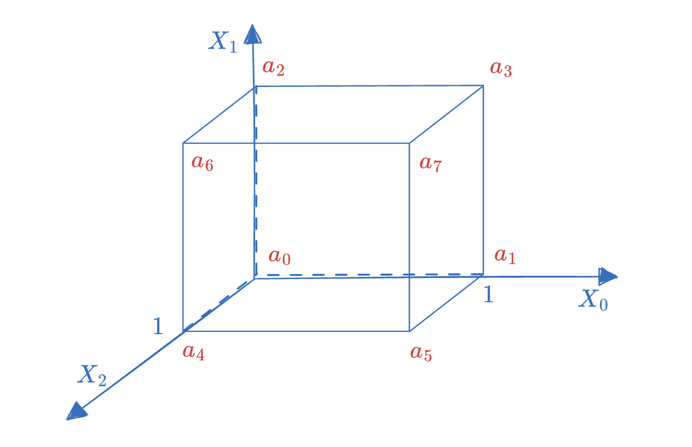
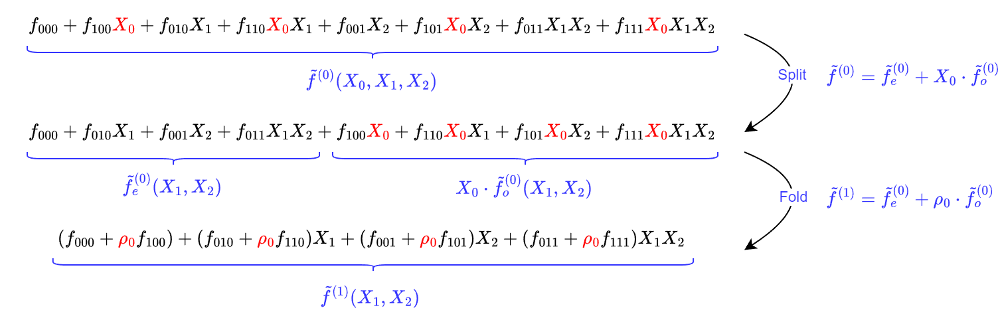
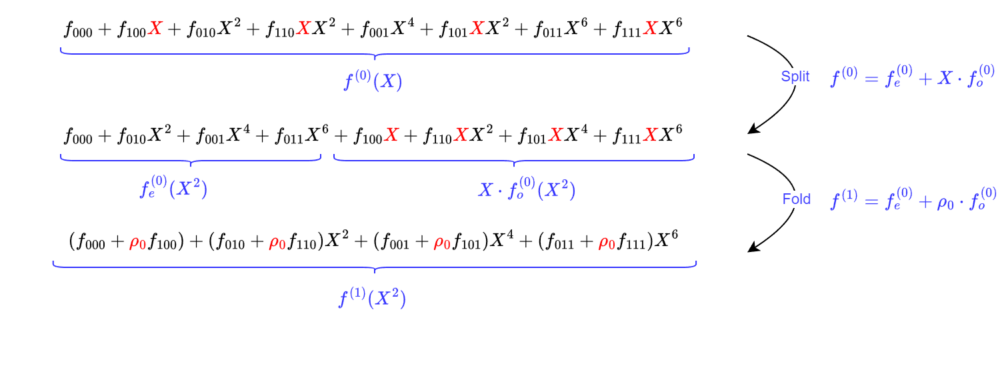
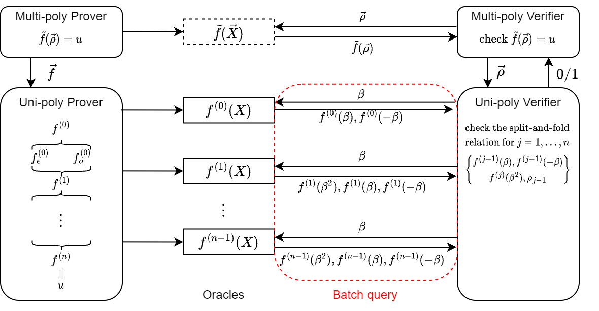

# Gemini-PCS (Part I)

- Tianyu ZHENG <tian-yu.zheng@connect.polyu.hk>

Gemini [BCH+22] is an elastic SNARK, where "elastic" means that the prover can balance between proof time and memory by setting parameters to meet the requirements of different usage scenarios.

As the core algorithm of Gemini, Tensor Product Check provides us with a method to prove the evaluation of multilinear polynomials, such as $\tilde{f}(\vec{\rho}) = u$. In other words, this method realizes the conversion from multivariate polynomials to univariate polynomials, thus inspiring us to construct a new multivariate polynomial commitment scheme.

In terms of specific construction, Tensor Product Check adopts the split-and-fold idea similar to previous work (Sumcheck, Bulletproofs, FRI), achieving relatively efficient communication and verifier complexity, while its prover algorithm can achieve elastic properties.

# MLE and Tensor Product

In the Zeromorph notes, we mentioned that a Multilinear Extension uniquely corresponds to a function mapping from Boolean vectors to finite fields, in the form of $f: \{0,1\}^n \rightarrow \mathbb{F}_q$. The figure below is an example of a three-dimensional MLE polynomial $\tilde{f}(X_0,X_1,X_2)$, which can be uniquely represented by the "point-value vector" $(a_0, a_1,...,a_7)$.

Similarly, an MLE polynomial can also be represented using a "coefficient form". For example, the above figure can be written as

$$
\tilde{f}(X_0,X_1,X_2) = f_0+f_1X_0+f_2X_1+f_3X_2+f_4X_0X_1+f_5X_0X_2 + f_6X_1X_2 + f_7X_0X_1X_2
$$

The ordering of monomials in this expression is based on Lexicographic Order.

In addition to the "point-value form" and "coefficient form", we will now introduce a new form of expression - the expression based on "tensor product".

Simply put, tensor product is a special "multiplication" between two vectors, denoted as $\vec{a} \otimes \vec{b}$. Specifically, we can first calculate $a b^T$ (assuming $\vec{a}, \vec{b}$ are both column vectors), then concatenate the resulting matrix into a vector column by column, and this vector is the result of the tensor product. For example, for $\vec{a}=(a_1,a_2)$ and $\vec{b}=(b_1, b_2, b_3)$:

$$
\begin{bmatrix}a_1 \\ a_2\end{bmatrix} \cdot \begin{bmatrix}b_1, b_2,b_3\end{bmatrix} = \begin{bmatrix}a_1b_1, a_1b_2, a_1b_3 \\ a_2b_1, a_2b_2, a_2b_3\end{bmatrix}
$$

We get $\vec{a} \otimes \vec{b} = (a_1b_1, a_2b_1, a_1b_2, a_2b_2, a_1b_3, a_2b_3)$.

Comparing with the MLE polynomial expressed in "coefficient form" that we mentioned earlier, we will find that all its monomials can be obtained by a continuous tensor product:

$$
(1,X_0)\otimes(1,X_1)\otimes(1,X_2) = (1, X_0, X_1, X_0X_1, X_2, X_0X_2, X_1X_2, X_0X_1X_2)
$$

We abbreviate the left-hand side as $\otimes_{j=0}^2 (1,X_j)$. Then an MLE polynomial can be written in inner product form:

$$
\tilde{f}(X_0,X_1,X_2) = \langle \vec{f}, \otimes_{j=0}^2 (1,X_j) \rangle
$$

where the left element is the coefficient vector $\vec{f}$, and the right element is a monomial vector $\otimes_{j=0}^2 (1,X_j)$.

# Split-and-Fold Method

In Gemini, the authors present a protocol for checking the correctness of tensor products based on a univariate polynomial commitment scheme (such as KZG10). Based on this protocol, we can further construct a conversion from multivariate to univariate polynomials. We will first use the three-dimensional MLE polynomial mentioned earlier as an example to explain the main idea of Tensor Product Check.

Suppose the prover wants to prove the instance: $\vec{f} = (f_0,...,f_7)$, satisfying the relation $\langle\vec{f}, \otimes_{j=0}^{2}(1,\rho_j) \rangle = u$, where $\rho_0,\rho_1, \rho_2$ are in the finite field $F$.

For convenience, we rewrite the subscripts of elements in vector $\vec{f}$ into binary representation in little-endian order, i.e.,

$$
f_i = f_{i_0i_1i_2}, i = \langle (2^0, 2^1, 2^2), (i_0,i_1,i_2) \rangle
$$

where $i_0,i_1,i_2 \in \{0,1\}$.

After expanding the renumbered tensor product, we get the following equation

$$
\begin{matrix} &&\langle\vec{f}, \otimes_{j=0}^{2}(1,\rho_j) \rangle & \\ & = & f_{000}\rho_0^{0}\rho_1^{0}\rho_2^{0}& + &f_{100}\rho_0^{1}\rho_1^{0}\rho_2^{0}& + &f_{010}\rho_0^{0}\rho_1^{1}\rho_2^{0}& + &f_{110}\rho_0^{1}\rho_1^{1}\rho_2^{0} \\ & + & f_{001}\rho_0^{0}\rho_1^{0}\rho_2^{1}& + &f_{101}\rho_0^{1}\rho_1^{0}\rho_2^{1}& + &f_{011}\rho_0^{0}\rho_1^{1}\rho_2^{1}& + &f_{111}\rho_0^{1}\rho_1^{1}\rho_2^{1} \end{matrix}
$$

We will find that the subscripts of each coefficient $f_{i_0i_1i_2}$ correspond one-to-one with the exponents of the multiplied $\rho_0,\rho_1,\rho_2$, i.e.,

$$
f_{i_0i_1i_2} \cdot \rho_0^{i_0}\rho_1^{i_1} \rho_2^{i_2}, \text{ for all } i_0,i_1,i_2 \in \{ 0,1 \}
$$

Therefore, we can always divide $\vec{f}$ into two equal-length parts according to the exponent $i_j$ of $\rho_j$, and the two parts satisfy a tensor product subproblem respectively. For example, after dividing $\vec{f}$ according to $\rho_0$, we can obtain two tensor product relations about $\vec{f}_1, \vec{f}_2$:

$$
\langle\vec{f}, \otimes_{j=0}^{2}(1,\rho_j) \rangle =  \langle\vec{f}_1, \otimes_{j=1}^{2}(1,\rho_j) \rangle + \rho_0 \langle\vec{f}_2, \otimes_{j=1}^{2}(1,\rho_j) \rangle
$$

Note that in these two subproblems, the right elements of the inner product are the same: both are $\otimes_{j=1}^2 (1,\rho_j)$, so they can be further combined into one $\langle\vec{f}_1 + \rho_0 \vec{f}_2, \otimes_{j=1}^{2}(1,\rho_j) \rangle$.

It can be seen that for a vector $\vec{f}$ of length $N$, we divide it into two vectors of length $N/2$, and then combine them into one vector. Through this round of operation, we turn a tensor product problem of size $N$ into a problem of size $N/2$.

By analogy, this problem can eventually be reduced to size $1$.

**[Multivariate Polynomial Split-and-fold]**

As mentioned earlier, we can view a tensor product relation as a multivariate polynomial evaluation relation, i.e.,

$$
\langle\vec{f}, \otimes_{j=0}^{2}(1,\rho_j) \rangle = u \quad \Leftrightarrow \quad \tilde{f}(\rho_0,\rho_1,\rho_2) = u
$$

For the multivariate polynomial $\tilde{f}^{(0)} = \tilde{f}$, its split-and-fold process in the $j$-th round ($j\in[1,3]$) is as follows:

- **split:** The prover divides the multivariate polynomial $\tilde{f}^{(j-1)}$ into two parts: the first part contains any monomial that includes $X_j$ of order 0 (denoted as $\tilde{f}_e^{(j-1)}$), the second part contains any monomial that includes $X_{j-1}$ of order 1 (denoted as $X_{j-1} \cdot \tilde{f}_o^{(j-1)}$), satisfying

$$
\tilde{f}^{(j-1)} = \tilde{f}_{e}^{(j-1)} + X_{j-1} \cdot \tilde{f}_{o}^{(j-1)}
$$

- **fold:** The prover linearly combines the two separated polynomials $\tilde{f}_e^{(j-1)}, \tilde{f}_o^{(j-1)}$, using $\rho_{j-1}$ as the weight for combination, resulting in a new multivariate polynomial denoted as $\tilde{f}^{(j)}(X) = \tilde{f}_e^{(j-1)}(X) + \rho_{j-1} \cdot \tilde{f}_o^{(j-1)}(X)$.

The figure below shows the calculation process when $j=1$:

# Tensor Product Check Protocol

Through the above recursive algorithm, we reduce the correctness check of a tensor product relation of length $N$ to checking the correctness of $n = \left \lceil \log N \right \rceil$ split-and-fold processes.

In fact, this divide-and-conquer problem-solving idea (split-and-fold) has appeared in many previous protocols, such as Sumcheck, Bulletproofs, and FRI. The difference is that Gemini provides a protocol based on KZG10 to prove the split-and-fold process, which requires $n= \log(|\vec{f}|)$ interactions.

We present the PIOP protocol for proving tensor product relations as follows:

**[Tensor-product Check Protocol]**

Target relation: $\langle\vec{f}, \otimes_{j=0}^{n-1}(1,\rho_j) \rangle = u$

Prover input: Public parameters, instance $x = (\rho_0,...,\rho_{n-1}, u)$, secret $w = \vec{f}$

Verifier input: Public parameters, instance $x = (\rho_0,...,\rho_{n-1}, u)$

1. The prover constructs a univariate polynomial $f^{(0)}(X) = f(X)$.
2. For $j \in 1,...,n$, the prover calculates

$$
f^{(j)}(X) = f_e^{(j-1)}(X) + \rho_{j-1} \cdot f_o^{(j-1)}(X)
$$

where $f_e^{(j-1)}, f_o^{(j-1)}$ are polynomials composed of even-order terms and odd-order terms of $f^{(j-1)}$ respectively, satisfying $f^{(j-1)}(X) = f_e^{(j-1)}(X^2) + X \cdot f_o^{(j-1)}(X^2)$.

3. The prover sends Oracles of $f^{(0)},f^{(1)},...,f^{(n-1)}$ to the verifier.
4. The verifier randomly selects a challenge value $\beta \leftarrow \mathbb{F}$ and makes the following queries to the Oracles:

$$
e^{(j-1)}:= f^{(j-1)}(\beta), \bar{e}^{(j-1)} := f^{(j-1)}(-\beta), \hat{e}^{(j-1)} := f^{(j)}(\beta^2)
$$

where $j=1,...,n$, when $j=n$, ignore the query $f^{(n)}(\beta^2)$, and directly set $\hat{e}^{(n-1)} := u$.

5. For $j = 0,...,n-1$, the verifier checks 

$$
\hat{e}^{(j)} = \frac{e^{(j)} + \bar{e}^{(j)}}{2} + \rho_j \cdot \frac{e^{(j)}-\bar{e}^{(j)}}{2\beta}
$$

In each round, the prover will generate Oracles for the polynomials before split and after fold respectively. Specifically, a split-and-fold relation can be written as:

> Given $f(X), f_e(X), f_o(X),f'(X)$, weight $\rho$, they satisfy the following relations
> 
> 
> $$
> f(X)=f_e(X^2)+X\cdot f_o(X^2) \qquad \% \ \text{split} \\ f'(X) = f_e(X)+\rho \cdot f_o(X)\qquad \% \ \text{fold}
> $$
> 

Since even and odd polynomials satisfy (1) $f_e(X^2)=(f(X)+f(-X))/2$, (2) $f_o(X^2)=(f(X)-f(-X))/2X$ respectively, we can further write the above two equations into one, i.e.,

$$
f'(X^2)=\frac{f(X)+f(-X)}{2} + \rho \cdot \frac{f(X)-f(-X)}{2X}
$$

To check if this equation holds, the verifier only needs to randomly select a challenge value $\beta$ in the finite field $F$, and check if the values of $f,f'$ satisfy the relation when $X=\beta$.

# Multivariate to Univariate Conversion

Before introducing the protocol for multivariate to univariate conversion, let's delve deeper into some principles hidden in the tensor product protocol. Although the goal of the tensor product protocol is to prove the value of a multivariate polynomial, apart from inputting the coefficient vector of the multivariate polynomial, all polynomials involved in the protocol are univariate.

Let's write out the Split-and-fold process using univariate polynomials:

**[Univariate Polynomial Split-and-fold]** In the $j$-th round:

- **split:** The prover divides the univariate polynomial $f^{(j-1)}$ into two parts: the first part contains any monomial that includes $X$ of even order (denoted as $f_e^{(j-1)}$), the second part contains any monomial that includes $X$ of odd order (denoted as $X \cdot f_o^{(j-1)}$), satisfying

$$
f^{(j-1)}(X) = f_e^{(j-1)}(X^2) + X \cdot f_o^{(j-1)}(X^2)
$$

- **fold:** The prover linearly combines the two separated polynomials $f_e^{(j-1)}, f_o^{(j-1)}$, using $\rho_{j-1}$ as the weight for combination, resulting in a new univariate polynomial denoted as $f^{(j)}(X) = f_e^{(j-1)}(X) + \rho_{j-1} \cdot f_o^{(j-1)}(X)$. [Note] Here we need to introduce an additional mapping $X^2 \mapsto X$ to obtain $f_e^{(j-1)}(X), f_o^{(j-1)}(X)$.

Therefore, the tensor product protocol can be seen as the prover simultaneously executing a recursive algorithm on the univariate polynomial $f$ to simulate the calculation process of $\tilde{f}$.

We use a three-dimensional polynomial as an example to describe the calculation process in the $j=1$ round:

The split-and-fold calculation of univariate polynomials is as follows:

Compared with the split-and-fold of multivariate polynomials, the variable $X$ in the first round of univariate polynomials corresponds to $X_0$ in the multivariate, and in the second round, $X^2$ corresponds to $X_1$. In fact, these two processes are calculations on the coefficient vector $\vec{f}$ in different "bases".

When we need to calculate the value of a multivariate polynomial on the basis $\{X_0,X_1,X_2\}$, we only need to perform the same operation synchronously on $\{X^1,X^2,X^4\}$ (i.e., on univariate polynomials) to simulate the evaluation process of multivariate polynomials using univariate polynomials.

More formally, we get a mapping relation from the multivariate basis vector space to the univariate basis vector space:

$$
\iota: \{ X_0,X_1,X_2 \} \rightarrow \{ X^1, X^2, X^4\}
$$

Therefore, we say that the tensor product protocol provides us with a proof method from multivariate to univariate, i.e., multi-to-uni IOP. As shown in the figure below, ideally, we hope that the prover can directly generate an Oracle of a multivariate polynomial and send it to the verifier. However, in engineering, there is a lack of efficient multivariate polynomial commitment schemes, so the prover can only construct a proof protocol for Tensor Product Check (i.e., Multi-Uni-IOP) to simulate the calculation process of multivariate polynomial evaluation on univariate polynomials.

The prover needs to send Oracles of $n$ univariate polynomials, allowing the verifier to make queries and checks respectively. Since these checks are independent of each other, the verifier can make queries on all Oracles at a certain point $\beta$ at once, without needing $O(n)$ points.

# Implementation Based on KZG

For the IOP protocol given above, we can deploy a univariate polynomial commitment scheme (KZG10) to compile it into an AoK (Argument of Knowledge). KZG10 can support the evaluation proof of a polynomial at a certain point, with the advantage of constant-sized proofs and support for batch proofs. The disadvantage is that it requires trusted initialization, and the proof complexity is relatively high (requiring FFT computation).

[Note] Since we compile IOP into Argument of Knowledge, KZG10 needs to satisfy extractability, the proof of which is given in Marlin [CHM+19].

Let's briefly review the proof principle of KZG10: Given public parameters: $\mathbb{G}_1, \mathbb{G}_2, \mathbb{G}_T, G, H, e$. In the initialization phase, randomly select $\tau \in \mathbb{}F$ and calculate $\tau H \in \mathbb{G}_2$ and vector

$$
(G,\tau G,\ldots \tau^{D-1}G,\tau^{D}G)\in \mathbb{G}_1^{D+1}
$$

We use bracket notation $[a]_1$ to represent scalar multiplication $a \cdot G$ on an elliptic curve group element. The KZG proof process is as follows:

1. The prover calculates the commitment of the univariate polynomial $f(X)$ of degree $d$: $[f(\tau)]_1 = \sum_{j=0}^d f_j \cdot \tau^j G$.
2. The prover publicly announces the value of the polynomial at point $\rho$ as $f(\rho)=u$, and calculates the quotient polynomial

$$
q(X) = \frac{f(X)-f(\rho)}{X-\rho}
$$

Generate evaluation proof $[q(\tau)]_1$.

3. The verifier checks the evaluation proof $e([f(\tau)]_1-[u]_1, [1]_2) = e([q(\tau)]_1, [\tau-\rho]_2)$.

Therefore, to compile the IOP protocol, we only need to commit to the polynomials $f^{(1)},...,f^{(n-1)}$ produced in the protocol respectively, and open them at specified points $\beta, -\beta, \beta^2$. However, there are two points that still need our attention: (1) The degrees of these polynomials are not the same. To prevent the prover from cheating using polynomials that do not satisfy the degree requirements, we need to use the method in Marlin, Zeromorph [CHM+19, KT23] to limit the Degree Bound of polynomials. (2) Most polynomials need to be opened at three points $\beta, -\beta, \beta^2$. If we generate evaluation proofs for each point separately, it will increase the proof size and verification complexity. Multi-point evaluation proof techniques can be used to optimize this problem.

**Degree Bound Proof:** To prove $deg(f)\leq d$

- The prover provides $[f(\tau)]_1$ and additionally sends $[\tau^{D-d}\cdot f(\tau)]_1$ to the verifier
- The verifier checks the equation $e([f(\tau)]_1, [\tau^{D-d}]_2) = e([\tau^{D-d}\cdot f(\tau)]_1, [1]_2)$

**Multi-point Evaluation Proof:** To prove that $f(X)$ is opened as $u_1,u_2,u_3$ at $\beta_1, \beta_2, \beta_3$

- The prover randomly generates a polynomial $g(X)$ of the same degree as $f(X)$, which needs to pass through points $(\beta, u_1),(-\beta, u_2),(\beta^2, u_3)$
- The prover provides $[f(\tau)]_1$ and the evaluation proof $[q(\tau)]_1 = \frac{f(\tau)-g(\tau)}{(\tau-\beta_1)(\tau-\beta_2)(\tau-\beta_3)}$
- The verifier checks the equation $e([f(\tau)]_1 - [g(\tau)]_1, [1]_2) = e([q(\tau)]_1, [(\tau-\beta_1)(\tau-\beta_2)(\tau-\beta_3)]_2)$

[Note] Both of the above techniques require additional generation of $(H,\tau H,\ldots \tau^{D-1}H,\tau^{D}H)\in \mathbb{G}_2^{D+1}$ in the Setup phase.

**[Protocol Description]**

Below we first give the Multi-to-Uni AoK scheme compiled based on KZG:

**Instance**

- Univariate polynomial commitment $[f(\tau)]_1$ of vector $\vec{f}$, length $N$
- Evaluation point vector $\vec{\rho}$
- Evaluation result $\tilde{f}(\rho) = u$

**Witness**

- Coefficient vector $\vec{f}$ of the multivariate polynomial

**Interaction Process**

1. The prover generates polynomials $f^{(1)},...,f^{(n-1)}$ and calculates and sends their commitments $[f^{(1)}(\tau)]_1,\ldots,[f^{(n-1)}(\tau)]_1$
2. The prover calculates and sends degree bound proofs of polynomials $f^{(0)},...,f^{(n-1)}$: $[\tau^{D-N\cdot 2^{-j} + 1}\cdot f^{(j)}(\tau)]_1, j = 0,\ldots n-1$
3. The verifier randomly selects point $\beta$ and sends it to the prover
4. The prover calculates the evaluation proof for each polynomial, where
- $[q^{(0)}(\tau)]_1 = \frac{f^{(0)}(\tau)-g^{(0)}(\tau)}{(\tau-\beta)(\tau+\beta)}$                    % $f^{(0)}(\beta), f^{(0)}(-\beta)$
- $[q^{(j)}(\tau)]_1 = \frac{f^{(j)}(\tau)-g^{(j)}(\tau)}{(\tau-\beta)(\tau+\beta)(\tau-\beta^2)}$              % $f^{(j)}(\beta), f^{(j)}(-\beta), f^{(j)}(\beta^2), j=1,...,n-1$
1. The verifier checks:
- The correctness of degree bound proofs $[\tau^{D-N\cdot 2^{-j} + 1}\cdot f^{(j)}(\tau)]_1, j = 0,\ldots n-1$ for $f^{(0)},...,f^{(n-1)}$
- The correctness of multi-point evaluation proofs $[q^{(0)}(\tau)]_1,\ldots [q^{(n-1)}(\tau)]_1$ for $f^{(0)},...,f^{(n-1)}$
- The correctness of split-and-fold relations, i.e., for $j = 0,...,n-1$, whether the following equation holds:

$$
\hat{e}^{(j)} = \frac{e^{(j)} + \bar{e}^{(j)}}{2} + \rho_j \cdot \frac{e^{(j)}-\bar{e}^{(j)}}{2\beta}
$$

**[Performance Analysis]**

- Proof size: $3\log N \ \mathbb{G}_1$ elements
- Verifier computation: $4 \log N \ \mathsf{Pairing},\ O(\log N) \ \mathsf{EccMul}^{\mathbb{G}_1 \text{ or } \mathbb{G}_2}$

# References

[BCH+22] Bootle, Jonathan, Alessandro Chiesa, Yuncong Hu, **et al. "Gemini: Elastic SNARKs for Diverse Environments." *Cryptology ePrint Archive* (2022). [https://eprint.iacr.org/2022/420](https://eprint.iacr.org/2022/420)

[KT23] Kohrita, Tohru, and Patrick Towa. "Zeromorph: Zero-knowledge multilinear-evaluation proofs from homomorphic univariate commitments." Cryptology ePrint Archive (2023). [https://eprint.iacr.org/2023/917](https://eprint.iacr.org/2023/917) 

[CHM+19] Chiesa, Alessandro, Yuncong Hu, Mary Maller, et al. "Marlin: Preprocessing zkSNARKs with Universal and Updatable SRS." *Cryptology ePrint Archive* (2019). [https://eprint.iacr.org/2019/1047](https://eprint.iacr.org/2019/1047)