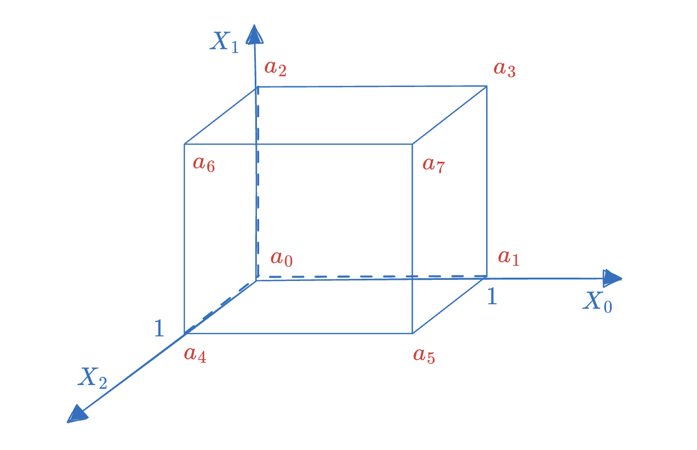

# Gemini-PCS (Part I)

- Tianyu ZHENG <tian-yu.zheng@connect.polyu.hk>

Gemini [BCH+22] 是一种 elastic SNARK，所谓 elastic 是指证明者可以通过设置参数在证明时间和内存之间权衡，以满足不同使用场景的要求。

作为 Gemini 的核心算法，Tensor Product Check 为我们提供了一种证明多元线性多项式（Multilinear Polynomial）求值的方法，如 $\tilde{f}(\vec{\rho}) = u$。换句话说，该方法实现了从多元多项式到一元多项式的转换，从而启发我们构造一种新的多元多项式承诺方案。

在具体构造上，Tensor Product Check 采用了与之前的工作（Sumcheck, Bulletproofs, FRI）类似的 split-and-fold 思想，达到了比较高效的通信和验证者复杂度，同时其证明者算法能够实现 elastic 性质。

## MLE and Tensor Product

在 Zeromorph 笔记中我们提到，一个 Multilinear Extension 唯一地对应到一个从 Boolean 向量映射到有限域的函数，形如 $f: \{0,1\}^n \rightarrow \mathbb{F}_q$。下图是一个三维的 MLE 多项式 $\tilde{f}(X_0,X_1,X_2)$ 的示例，这个多项式可以唯一地被 $(a_0, a_1,...,a_7)$ 这个 「点值向量」来表示。

同样地，一个 MLE 多项式也可以采用「系数式」来表示，例如上图可以写成

$$
\tilde{f}(X_0,X_1,X_2) = f_0+f_1X_0+f_2X_1+f_3X_2+f_4X_0X_1+f_5X_0X_2 + f_6X_1X_2 + f_7X_0X_1X_2
$$

该表达式中单项式的排序基于 Lexicographic Order.

除了「点值式」和「系数式」之外，接下来我们介绍一种新的表达形式——基于「张量积」（Tensor product）的表达式。

简单来说，张量积是两个向量之间的一种特殊”乘法”，记作 $\vec{a} \otimes \vec{b}$。具体来说，我们可以先计算 $a b^T$（假设 $\vec{a}, \vec{b}$ 均为列向量），接着将得到的矩阵按列相接成一个向量，该向量即为张量积的结果。例如 $\vec{a}=(a_1,a_2)$ 和 $\vec{b}=(b_1, b_2, b_3)$： 

$$
\begin{bmatrix}a_1 \\ a_2\end{bmatrix} \cdot \begin{bmatrix}b_1, b_2,b_3\end{bmatrix} = \begin{bmatrix}a_1b_1, a_1b_2, a_1b_3 \\ a_2b_1, a_2b_2, a_2b_3\end{bmatrix}
$$

可得 $\vec{a} \otimes \vec{b} = (a_1b_1, a_2b_1, a_1b_2, a_2b_2, a_1b_3, a_2b_3)$。

对比我们之前提到的「系数式」表达的 MLE 多项式， 我们会发现它的所有单项式都可以由一个连续的张量积得到：

$$
(1,X_0)\otimes(1,X_1)\otimes(1,X_2) = (1, X_0, X_1, X_0X_1, X_2, X_0X_2, X_1X_2, X_0X_1X_2)
$$

我们将左式简记为 $\otimes_{j=0}^2 (1,X_j)$。那么一个 MLE 多项式可以写成内积形式：

$$
\tilde{f}(X_0,X_1,X_2) = \langle \vec{f}, \otimes_{j=0}^2 (1,X_j) \rangle
$$

其中左边元素是系数向量 $\vec{f}$ ，右边元素则是一个单项式向量 $\otimes_{j=0}^2 (1,X_j)$。

## Split-and-Fold 方法

在 Gemini 中，作者给出了一个基于一元多项式承诺方案（例如 KZG10）来检查张量积正确性的协议，基于该协议我们可以进一步构造实现多元到一元多项式转换。我们首先以提到的三维 MLE 多项式为例，解释 Tensor Product Check 的主要思路。

假设证明者想要证明实例： $\vec{f} = (f_0,...,f_7)$，满足关系 $\langle\vec{f}, \otimes_{j=0}^{2}(1,\rho_j) \rangle = u$，其中 $\rho_0,\rho_1, \rho_2$ 在 $F$ 有限域上。

方便起见，我们将向量 $\vec{f}$ 中元素的下标改写成小端序的二进制表示，即

$$
f_i = f_{i_0i_1i_2}, i = \langle (2^0, 2^1, 2^2), (i_0,i_1,i_2) \rangle
$$

其中 $i_0,i_1,i_2 \in \{0,1\}$。

将重新编号后的 tensor product 展开后，会得到下边这个等式

$$
\begin{matrix} &&\langle\vec{f}, \otimes_{j=0}^{2}(1,\rho_j) \rangle & \\ & = & f_{000}\rho_0^{0}\rho_1^{0}\rho_2^{0}& + &f_{100}\rho_0^{1}\rho_1^{0}\rho_2^{0}& + &f_{010}\rho_0^{0}\rho_1^{1}\rho_2^{0}& + &f_{110}\rho_0^{1}\rho_1^{1}\rho_2^{0} \\ & + & f_{001}\rho_0^{0}\rho_1^{0}\rho_2^{1}& + &f_{101}\rho_0^{1}\rho_1^{0}\rho_2^{1}& + &f_{011}\rho_0^{0}\rho_1^{1}\rho_2^{1}& + &f_{111}\rho_0^{1}\rho_1^{1}\rho_2^{1} \end{matrix}
$$

我们会发现每个系数 $f_{i_0i_1i_2}$ 的下标与相乘的 $\rho_0,\rho_1,\rho_2$ 的指数是一一对应的，即

$$
f_{i_0i_1i_2} \cdot \rho_0^{i_0}\rho_1^{i_1} \rho_2^{i_2}, \text{ for all } i_0,i_1,i_2 \in \{ 0,1 \}
$$

因此，我们总能够将 $\vec{f}$ 按 $\rho_j$ 的指数 $i_j$ 分成等长的两部分，且两部分分别满足一个 tensor product 子问题。例如 $\vec{f}$ 根据 $\rho_0$ 划分后，可以得到关于 $\vec{f}_1, \vec{f}_2$ 的两个 tensor product 关系：

$$
\langle\vec{f}, \otimes_{j=0}^{2}(1,\rho_j) \rangle =  \langle\vec{f}_1, \otimes_{j=1}^{2}(1,\rho_j) \rangle + \rho_0 \langle\vec{f}_2, \otimes_{j=1}^{2}(1,\rho_j) \rangle
$$

注意到，这两个子问题中，内积的右边元素相同：均为 $\otimes_{j=1}^2 (1,\rho_j)$，因此它们可以进一步合并成一个 $\langle\vec{f}_1 + \rho_0 \vec{f}_2, \otimes_{j=1}^{2}(1,\rho_j) \rangle$。

可以看到，对于一个 $N$ 长度的向量 $\vec{f}$，我们将其分开为两个 $N/2$ 长度的向量，再合并成一个向量。通过这一轮操作，我们把一个 $N$ 大小的 tensor product 问题变成了 $N/2$ 大小的问题。

以此类推，该问题可以最终被减少到 $1$ 大小。

**【多元多项式 Split-and-fold】**

之前提到过，我们可以将一个 tensor product 关系看作多元多项式的求值关系，即

$$
\langle\vec{f}, \otimes_{j=0}^{2}(1,\rho_j) \rangle = u \quad \Leftrightarrow \quad \tilde{f}(\rho_0,\rho_1,\rho_2) = u
$$

对于多元多项式 $\tilde{f}^{(0)} = \tilde{f}$，其在第 $j\in[1,3]$ 轮时 split-and-fold 过程如下：

- **split:** 证明者将多元多项式 $\tilde{f}^{(j-1)}$ 分成两部分：第一部分的任意单项式中包含阶数为 0 的 $X_j$（记作 $\tilde{f}_e^{(j-1)}$），第二部分的任意单项式中包含阶数为 1 的 $X_{j-1}$（记作 $X_{j-1} \cdot \tilde{f}_o^{(j-1)}$），三者满足

$$
\tilde{f}^{(j-1)} = \tilde{f}_{e}^{(j-1)} + X_{j-1} \cdot \tilde{f}_{o}^{(j-1)}
$$

- **fold:** 证明者将分开的两个多项式 $\tilde{f}_e^{(j-1)}, \tilde{f}_o^{(j-1)}$ 线性组合，组合时使用的权重为 $\rho_{j-1}$, 得到新的多元多项式记作 $\tilde{f}^{(j)}(X) = \tilde{f}_e^{(j-1)}(X) + \rho_{j-1} \cdot \tilde{f}_o^{(j-1)}(X)$。

下图我们给出 $j=1$ 时的计算过程：

## Tensor Product 检查协议

通过上述递归算法，我们将检查 $N$ 长度的 tensor product 关系的正确性归约到检查 $n = \left \lceil \log N \right \rceil$  次 split-and-fold 过程的正确性。

实际上，这一分治解决问题的思想（split-and-fold）在很多之前的协议中出现过，如Sumcheck，Bulletproofs 和 FRI。不同的是 Gemini 给出了基于 KZG10 来证明 split-and-fold 过程的协议，该协议需要 $n= \log(|\vec{f}|)$ 次交互。

我们给出证明 tensor product 关系的 PIOP 协议如下：

**【Tensor-product 检查协议】**

目标关系：$\langle\vec{f}, \otimes_{j=0}^{n-1}(1,\rho_j) \rangle = u$

证明者输入：公共参数，实例 $x = (\rho_0,...,\rho_{n-1}, u)$, 秘密 $w = \vec{f}$

验证者输入：公共参数，实例 $x = (\rho_0,...,\rho_{n-1}, u)$

1. 证明者构造一元多项式 $f^{(0)}(X) = f(X)$。
2. 对 $j \in 1,...,n$，证明者计算

$$
f^{(j)}(X) = f_e^{(j-1)}(X) + \rho_{j-1} \cdot f_o^{(j-1)}(X)
$$

其中 $f_e^{(j-1)}, f_o^{(j-1)}$ 分别为 $f^{(j-1)}$ 的偶数阶项和奇数阶项构成的多项式，满足 $f^{(j-1)}(X) = f_e^{(j-1)}(X^2) + X \cdot f_o^{(j-1)}(X^2)$。

1. 证明者向验证者发送 $f^{(0)},f^{(1)},...,f^{(n-1)}$ 的 Oracles。
2. 验证者随机选取挑战值  $\beta \leftarrow \mathbb{F}$ 并对 Oracles 进行以下查询：

$$
e^{(j-1)}:= f^{(j-1)}(\beta), \bar{e}^{(j-1)} := f^{(j-1)}(-\beta), \hat{e}^{(j-1)} := f^{(j)}(\beta^2)
$$

其中 $j=1,...,n$, 当 $j=n$ 时，忽略查询 $f^{(n)}(\beta^2)$ ，并直接令 $\hat{e}^{(n-1)} := u$。

1. 对 $j = 0,...,n-1$，验证者检查 

$$
\hat{e}^{(j)} = \frac{e^{(j)} + \bar{e}^{(j)}}{2} + \rho_j \cdot \frac{e^{(j)}-\bar{e}^{(j)}}{2\beta}
$$

在每一轮中，证明者会分别为 split 之前，和 fold 之后得到的多项式生成 Oracles，具体来说，一个 split-and-fold 关系可以写成：

> 给定 $f(X), f_e(X), f_o(X),f'(X)$，权重 $\rho$，它们满足如下关系
> 
> 
> $$
> f(X)=f_e(X^2)+X\cdot f_o(X^2) \qquad \% \ \text{split} \\ f'(X) = f_e(X)+\rho \cdot f_o(X)\qquad \% \ \text{fold}
> $$
> 

又因为偶次、奇次多项式分别满足（1） $f_e(X^2)=(f(X)+f(-X))/2$，（2）$f_o(X^2)=(f(X)-f(-X))/2X$，我们可以进一步地将上述两个等式写成一个，即

$$
f'(X^2)=\frac{f(X)+f(-X)}{2} + \rho \cdot \frac{f(X)-f(-X)}{2X}
$$

要检查该等式成立，验证者只需要在 $F$ 有限域上随机选取一个挑战值 $\beta$，并检查 $X=\beta$ 时 $f,f'$ 的值是否满足关系即可。

# 多元到一元转换

在介绍多元到一元转换的协议的之前，我们再深入分析一下 tensor product 协议中隐藏的一些原理。虽然 tensor product 协议的目标是证明一个多元多项式的取值，但除了输入多元多项式的系数向量以外，协议中涉及的多项式均为一元的。

我们不妨将 Split-and-fold 过程用一元多项式写出来：

**【一元多项式 Split-and-fold】** 在第 $j$ 轮时：

- **split:** 证明者将一元多项式 $f^{(j-1)}$ 分成两部分：第一部分的任意单项式中包含阶数为偶数的 $X$（记作 $f_e^{(j-1)}$），第二部分的任意单项式中包含阶数为奇数的 $X$（记作 $X \cdot f_o^{(j-1)}$），三者满足

$$
f^{(j-1)}(X) = f_e^{(j-1)}(X^2) + X \cdot f_o^{(j-1)}(X^2)
$$

- **fold:** 证明者将分开的两个多项式 $f_e^{(j-1)}, f_o^{(j-1)}$ 线性组合，组合时使用的权重为 $\rho_{j-1}$, 得到新的一元多项式记作 $f^{(j)}(X) = f_e^{(j-1)}(X) + \rho_{j-1} \cdot f_o^{(j-1)}(X)$。【注】这里我们需要引入一个额外的映射 $X^2 \mapsto X$来得到 $f_e^{(j-1)}(X), f_o^{(j-1)}(X)$。

因此，tensor product 协议可以看作是证明者同步地在一元多项式 $f$ 上执行一个递归算法来模拟 $\tilde{f}$ 的计算过程，

我们以三维多项式为例，描述第 $j=1$ 轮时的计算过程：

一元多项式中 split-and-fold 计算如下：

与多元多项式 split-and-fold 对比，一元多项式第一轮中的自变量 $X$ 就对应多元中的 $X_0$，在第二轮中则是 $X^2$ 对应 $X_1$。实际上，这两个过程分别是对系数向量 $\vec{f}$ 在不同「基」上的计算。

当我们需要在基 $\{X_0,X_1,X_2\}$ 上计算多元多项式的值时，我们只需要对应地在 $\{X^1,X^2,X^4\}$ 上（即一元多项式上）同步地进行相同操作，便可以用一元多项式模拟出多元多项式的求值过程。

更正式地说，我们就得到了一个多元基向量空间到一元基向量空间的映射关系：

$$
\iota: \{ X_0,X_1,X_2 \} \rightarrow \{ X^1, X^2, X^4\}
$$

因此，我们说 tensor product 协议为我们提供了一个从多元到一元的证明方法，即 multi-to-uni IOP。如下图所示，在理想情况下，我们希望证明者能够直接生成一个多元多项式的 Oracle 并发送给验证者。然而在工程中缺少高效的多元多项式承诺方案，证明者只能构造一个对 Tensor Product Check 的证明协议（也就是 Multi-Uni-IOP）来在一元多项式上模拟多元多项式求值的计算过程。

证明者需要发送 $n$ 个一元多项式的 Oracles，分别让验证者进行查询并检查。由于这些检查彼此独立，验证者可以一次性对所有 Oracles 在某个点 $\beta$ 上进行查询，而不需要 $O(n)$ 个点。

# 基于KZG实现

对前文给出的 IOP 协议，我们可以部署一元多项式承诺方案（KZG10）将其编译为一个 AoK（Argument of Knowledge）。KZG10 能够支持一个多项式在某个点上的求值证明，其优点是拥有常数大小的证明，且支持批量证明。缺点是需要可信初始化，且证明复杂度相对较高（需要 FFT 运算）。

【注】由于我们将 IOP 编译为 Argument of Knowledge，因此 KZG10 需要满足 extractability，该性质的证明在 Marlin [CHM+19] 中给出。

我们先简单回顾一下 KZG10 的证明原理：给定公共参数：$\mathbb{G}_1, \mathbb{G}_2, \mathbb{G}_T, G, H, e$。在初始化阶段随机选取 $\tau \in \mathbb{}F$ 并计算 $\tau H \in \mathbb{G}_2$ 和向量

$$
(G,\tau G,\ldots \tau^{D-1}G,\tau^{D}G)\in \mathbb{G}_1^{D+1}
$$

我们用中括号记号 $[a]_1$ 来表示一个椭圆曲线群元素的上的标量乘法 $a \cdot G$。KZG 证明过程如下：

1. 证明者计算 $d$ 阶一元多项式 $f(X)$ 的承诺 $[f(\tau)]_1 = \sum_{j=0}^d f_j \cdot \tau^j G$。
2. 证明者在 $\rho$ 点上公开多项式的值为 $f(\rho)=u$，并计算商多项式

$$
q(X) = \frac{f(X)-f(\rho)}{X-\rho}
$$

生成求值证明 $[q(\tau)]_1$。

1. 验证者检查求值证明 $e([f(\tau)]_1-[u]_1, [1]_2) = e([q(\tau)]_1, [\tau-\rho]_2)$。

因此，要编译 IOP 协议只需要分别对协议中产生的多项式 $f^{(1)},...,f^{(n-1)}$ 进行承诺，并在指定点 $\beta, -\beta, \beta^2$ 上打开即可。但有两点仍然需要我们注意：（1）这些多项式的阶数并不相同，为了防止证明者作弊使用不满足满足阶数要求的多项式，需要采用 Marlin，Zeromorph [CHM+19, KT23] 中的方法来限制多项式的 Degree Bound。（2）大部分多项式都需要在 $\beta, -\beta, \beta^2$ 这三个点上公开，如果对每个点分别生成求值证明会增加证明大小以及验证复杂度。多点求值证明技巧可以用来优化这个问题。

**Degree Bound 证明:** 为了证明 $deg(f)\leq d$

- 证明者提供 $[f(\tau)]_1$ 并附加上 $[\tau^{D-d}\cdot f(\tau)]_1$  发送给验证者
- 验证者检查等式 $e([f(\tau)]_1, [\tau^{D-d}]_2) = e([\tau^{D-d}\cdot f(\tau)]_1, [1]_2)$

**多点求值证明：**为了证明 $f(X)$ 在 $\beta_1, \beta_2, \beta_3$ 公开为 $u_1,u_2,u_3$

- 证明者随机生成一个阶数与 $f(X)$ 相同的多项式 $g(X)$，该多项式需要经过点 $(\beta, u_1),(-\beta, u_2),(\beta^2, u_3)$
- 证明者提供 $[f(\tau)]_1$ 和求值证明 $[q(\tau)]_1 = \frac{f(\tau)-g(\tau)}{(\tau-\beta_1)(\tau-\beta_2)(\tau-\beta_3)}$
- 验证者检查等式 $e([f(\tau)]_1 - [g(\tau)]_1, [1]_2) = e([q(\tau)]_1, [(\tau-\beta_1)(\tau-\beta_2)(\tau-\beta_3)]_2)$

【注】上述两个技巧都需要在 Setup 阶段额外生成 $(H,\tau H,\ldots \tau^{D-1}H,\tau^{D}H)\in \mathbb{G}_2^{D+1}$。

**【协议描述】**

下面我们先给出基于 KZG 编译的 Multi-to-Uni AoK 方案：

**Instance**

- 向量 $\vec{f}$  的一元多项式承诺 $[f(\tau)]_1$，长度 $N$
- 求值点向量 $\vec{\rho}$
- 求值结果 $\tilde{f}(\rho) = u$

**Witness**

- 多元多项式的系数向量 $\vec{f}$

**交互过程**

1. 证明者生成多项式 $f^{(1)},...,f^{(n-1)}$ 并计算和发送它们的承诺 $[f^{(1)}(\tau)]_1,\ldots,[f^{(n-1)}(\tau)]_1$
2. 证明者计算并发送多项式 $f^{(0)},...,f^{(n-1)}$ 的 degree bound 证明 $[\tau^{D-N\cdot 2^{-j} + 1}\cdot f^{(j)}(\tau)]_1, j = 0,\ldots n-1$
3. 验证者随机选取点 $\beta$ 并发送给证明者
4. 证明者计算每个多项式的求值证明，其中
- $[q^{(0)}(\tau)]_1 = \frac{f^{(0)}(\tau)-g^{(0)}(\tau)}{(\tau-\beta)(\tau+\beta)}$                    % $f^{(0)}(\beta), f^{(0)}(-\beta)$
- $[q^{(j)}(\tau)]_1 = \frac{f^{(j)}(\tau)-g^{(j)}(\tau)}{(\tau-\beta)(\tau+\beta)(\tau-\beta^2)}$              % $f^{(j)}(\beta), f^{(j)}(-\beta), f^{(j)}(\beta^2), j=1,...,n-1$
1. 验证者检查：
- $f^{(0)},...,f^{(n-1)}$ 的 degree bound 证明 $[\tau^{D-N\cdot 2^{-j} + 1}\cdot f^{(j)}(\tau)]_1, j = 0,\ldots n-1$ 的正确性
- $f^{(0)},...,f^{(n-1)}$ 的多点求值证明 $[q^{(0)}(\tau)]_1,\ldots [q^{(n-1)}(\tau)]_1$ 的正确性
- split-and-fold 关系的正确性，即对 $j = 0,...,n-1$，下列等式是否成立：

$$
\hat{e}^{(j)} = \frac{e^{(j)} + \bar{e}^{(j)}}{2} + \rho_j \cdot \frac{e^{(j)}-\bar{e}^{(j)}}{2\beta}
$$

**【性能分析】**

- 证明大小：$3\log N \ \mathbb{G}_1$元素
- 验证者计算量： $4 \log N \ \mathsf{Pairing},\ O(\log N) \ \mathsf{EccMul}^{\mathbb{G}_1 \text{ or } \mathbb{G}_2}$

# 参考文献

[BCH+22] Bootle, Jonathan, Alessandro Chiesa, Yuncong Hu, **et al. "Gemini: Elastic SNARKs for Diverse Environments." *Cryptology ePrint Archive* (2022). [https://eprint.iacr.org/2022/420](https://eprint.iacr.org/2022/420)

[KT23] Kohrita, Tohru, and Patrick Towa. "Zeromorph: Zero-knowledge multilinear-evaluation proofs from homomorphic univariate commitments." Cryptology ePrint Archive (2023). [https://eprint.iacr.org/2023/917](https://eprint.iacr.org/2023/917) 

[CHM+19] Chiesa, Alessandro, Yuncong Hu, Mary Maller, et al. "Marlin: Preprocessing zkSNARKs with Universal and Updatable SRS." *Cryptology ePrint Archive* (2019). [https://eprint.iacr.org/2019/1047](https://eprint.iacr.org/2019/1047)