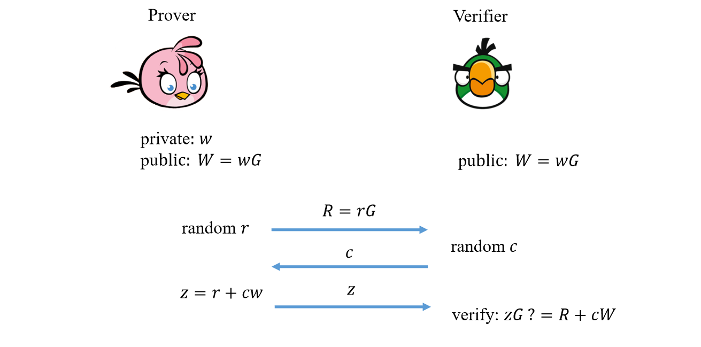
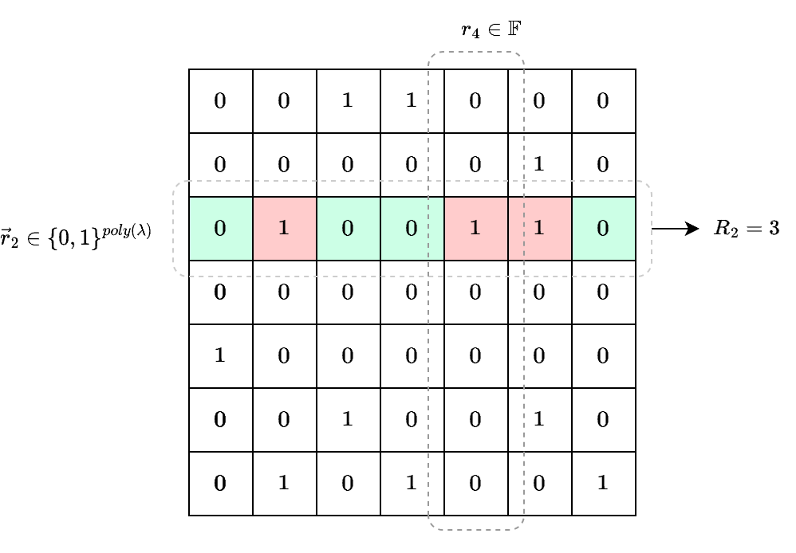

# KZG Extractability based on ROM

KZG10 等多项式承诺证明多用于构造 SNARK，通常我们会将一个 Interactive Oracle Proof 中的多项式 Oracle 用 PCS 编译。

考虑到安全性，IOP 本身的 Knowledge Soundness 是容易保证的。然而，对于 IOP 用 PCS 编译之后得到的 SNARK，要证明它的 Knowledge Soundness 性质就没有那么容易了。

相比较于 IOP 中证明者发送包含一整个多项式的 Oracle 在 IOP 模型中，oracle 的长度和多项式是相同的，只不过验证者没有完全读取它），SNARK 中证明者只发送了多项式的承诺，该承诺只包含很少一部分信息：仅仅是多项式在几个点上的取值。

因此，我们只有保证多项式承诺本身是“可提取的“（Extractable），才能够保证 SNARK 的 Knowledge Soundness。（详细论证可以参考 Interactive Oracle Proofs by Eli Ben-Sasson et al.）

不幸的是，Kate 等人并没有证明 KZG10 协议具有 extractability，因此，要把 KZG10 用在构造 SNARK 上，我们必须对其安全性进行重新证明。

一系列之前的工作，包括 Sonic [MBK+19], Plonk [GWC19], Marlin [CHM+19] 提出了基于 non-falsifiable 假设（Knowledge Assumptions）或者基于理想群模型（Idealized Group Model）如GGM，AGM，证明 KZG10 方案 满足 extractability 的方案。可以说，目前大部分基于 KZG 方案构造的 SNARK 系统都间接地依赖理想群模型。

与此同时，SNARK 系统在实现非交互式证明的时候还使用了 Fiat-Shamir 变换，这意味着它们还依赖于另一个强理想化模型，即随机预言机模型（ROM）。这种现状使我们处于一个相当糟糕的境地：我们的 SNARK 系统会同时具有两个模型的缺陷！近些年来，一些论文分别对它们进行了攻击。

而相对于理想群模型来说，ROM 的模型假设更弱（也就意味着安全性更强）。如果能够在 ROM 模型下证明 KZG 方案的安全性，就能够移除 SNARK 系统对理想群模型的依赖，从而增加我们对其安全性的信心。

在这个背景下，Lipmaa，Parisella，Siim 在今年发表了他们的工作 “Constant-Size zk-SNARKs in ROM from Falsifiable Assumptions”（下文简称 [LPS24]），向我们的目标推进了一大步。他们的贡献包括：

1. 基于一个新提出的 falsifiable 假设证明了 KZG 方案在 ROM 模型下的 special soundness 性质
2. 进一步证明了 KZG 方案满足 black-box extractability，以用于编译 IOP
3. 在证明 Plonk 在 ROM 模型下的 knowledge soundness 性质上取得了部分进展

本文中，我们将着重介绍第一点的工作。

# Special Soundness

要介绍 special soundness，我们首先需要了解交互式证明以及其安全定义。

### **Interactive Proofs and Knowledge Soundness**

**【定义1：Public-coin Interactive Proofs】**

一个证明目标关系 $R$，并由两方参与（证明者和验证者）的交互式协议被称为交互式证明（Interactive Proofs) ，记作 $\Pi = (P, V)$，其中 $P,V$ 分别是证明者和验证者算法。具体地，

- 证明者输入：公共 statement（记作 $x$），秘密 witness（记作 $w$）
- 验证者输入：公共 statement（记作 $x$）
- 证明者和验证者进行经过一系列交互，将所有交互的消息合集称为一个 transcript
- 验证者输出 1 表示接受，0 表示拒绝。

如果在交互中，所有验证者使用的随机数均为公开的，那么我们称该交互式协议为 Public-coin Interactive Proof。此外，假设在整个交互中证明者的发送了 $k$ 条消息，验证者发送了 $k-1$ 条消息，那么我们称其为 $(2k-1)$-步协议。

众所周知，要保证一个交互式证明是安全的，它需要满足两个安全性质：

- **Completeness：**对于任意一个诚实执行协议的证明者 $P$，且**存在** $w$ 令 $(x,w)$ 满足关系 $R$，那么 $P$ 能够通过执行协议令验证者输出接受。
- **Soundness：**对于任意一个可能恶意的证明者，且**不存在** $w$ 令 $(x,w)$ 满足关系 $R$，那么 $P$ 不能通过执行协议令验证者输出接受。

上面两个安全性质保证了交互式证明基本的安全性，然而 Soundness 的定义只能够保证某个statement $x$ 的确是属于关系 $R$ 的，并不能达到一部分应用场景的安全需求。例如，在身份认证系统中，我们要求证明者证明其身份：即 ”拥有” 对应公钥 $pk$ 的私钥 $sk$ 满足 $pk = sk\cdot G$。如果该证明只保证了 Soundness 性质，那么验证者只知道了 “$pk$ 属于生成元 $G$ 所构成的循环群 $\mathbb{G}$” 这一结论。但这个结论并不能保证证明者就一定拥有私钥 $sk$。实际上，我们可以在不知道 $sk$ 的情况下证明 $pk \in \mathbb{G}$，例如用费马小定理。

因此我们需要一个更强的安全定义，即 **“**Knowledge Soundness”

**【定义2：Knowledge Soundness】**

对于一个交互式证明 $\Pi = (P, V)$，如果存在多项式时间算法 $P^*$ 在不知道 $x$ 对应 $w$ 的情况下，能够以一个不可忽略的概率 $\epsilon$ 伪造证明令验证者接受，那么一定存在一个多项式时间提取器算法 $E$，该提取器将 $P^*$ 作为一个可倒带的（rewindable）Oracle 调用，能够以不可忽略的概率 $\epsilon'$ 提取出一个满足 $x$ 的 $w$。我们将 $|\epsilon'-\epsilon|$ 称作 soundness error，如果该 error 的大小可忽略不计，那么 $\Pi$ 满足 Knowledge Soundness 性质。

【注】如果一个 Public-coin Interactive Proof 对任意敌手都满足 Completeness 和 Soundness，那么我们称其为 Proof of Knowledge，如果Soundness只对多项式时间敌手满足，那么称其为 Argument of Knowledge。

可以看出，Knowledge Soundness 定义的关键在于强调构造提取器算法的可行性，也就是说，如果一个恶意证明者声称在不知道 $w$ 的情况下伪造合法证明是可行的，那么基于该恶意证明者构造一个提取 $w$ 提取器同样是可行的，这就与恶意证明者的声称是相矛盾的。从而保证，任何能输出合法证明的证明者，一定是“拥有”秘密值 $w$ 的。

### **Knowledge Soundness 证明（以 Schnorr 协议为例）**

前文已经给出了较为具体的 Knowledge Soundness 定义，那么我们该如何证明一个交互式证明协议满足该性质呢？显然，最直接的答案是构造一个提取器即可，但如何构造提取器是又是一门很深的学问（直白地说，LPS24 就是在做这件事）。为了方便解释 LPS24 的工作，我们先从一个相对简单的例子入手，来解释 knowledge soundness 的证明思路。

如下图所示 Schnorr 协议 [Sch90] 是一个 3步的交互式证明，在证明者和验证者两方之间进行，通过执行该协议，证明者能够向验证者证明她拥有一个满足离散对数关系 $W=wG$ 的秘密值 $w$ 

他们的交互过程如下

- 证明者生成随机值 $r \leftarrow \mathbb{F}$，并计算 $R=rG$ 发送给验证者
- 验证者生成随机值 $c \leftarrow \mathbb{F}$ 作为挑战值发送给证明者
- 证明者计算公开值 $z = r+cw$ 并发送给验证者

最后验证者根据在协议中收到的消息检查 $zG \overset{?}{=} R +cW$，方便起见，我们将 Schnorr 协议的 transcript 记作 $(R,c,z)$。

很容易证明，Schnorr 协议满足 Completeness 性质，我们在次不过多赘述。

接下来我们重点考虑 Knowledge Soundness 性质：

根据定义2，我们先给出结论：如果存在多项式时间算法 $P^*$ 能够伪造合法的 Schnorr 证明，那么一定存在一个多项式时间提取器算法 $E$ 通过倒带 $P^*$，能够提取出满足的秘密值 $w$。

那么该如何构造一个 $E$ 来完成证明呢？要直接写出算法可能有些困难，我们不妨将该工作拆分成下面几步：

- 首先，我们构造一个子算法 $E_{ss}$，给定两个关于 $W$ 的 transcripts 作为输入，记作 $(R,c_1,z_1), (R,c_2,z_2)$，要求 $R$ 相同，$c_1,c_2$ 不同，该子算法能够输出 $w$ 满足 $W=wG$
- 接着，我们构造另一个子算法 $E_{rw}$，$E_{rw}$ 将 $P^*$ 作为 Oracle 进行调用，先获取一个合法的 transcript $(R, c_1, z_1)$，之后 $E_{rw}$ 倒带 $P^*$ 到 Schnorr 协议的第二步，尝试在相同 $R$ 的情况下向 $P^*$ 发送与 $c_1$ 不同的挑战值，直到 $P^*$ 输出另一个合法的 transcript $(R, c_2, z_2)$
- 最后， $E$ 算法先运行  $E_{rw}$ 获取两个满足条件的 transcripts 之后，再运行 $E_{ss}$ 获得 $w$

【实现子算法 $E_{ss}$】

子算法 $E_{ss}$ 的实现经常在各种论文的安全证明中出现，简单来说，$E_{ss}$ 从两个输入 transcripts 中可以得到的公开值 $z_1, z_2$，假设 $P^*$ 诚实地计算了这两个值，那么它们应该满足如下形式：

$$
z_1 = r + c_1 w' \\ z_2 = r+c_2w'
$$

解方程能够计算出 $w' = (z_1-z_2)/(c_1-c_2)$ 作为一个可能的秘密值，只需要检查 $w'G\overset{?}{=}W$ 即可得知其是否合法。如果相等，那么 $E'$ 直接输出合法的秘密值 $w=w'$，算法完成。如果不相等，那么 $E'$ 可以利用得到的结果构造一个归约来破解离散对数假设：

$$
\frac{(z_1-z_2)}{c_1-c_2} G = W
$$

由于破解离散对数假设的概率是可以忽略的，可以得到 $E_{ss}$ 成功的概率和 $P^*$ 成功的概率之差也是可以忽略的。

【获取 transcripts】

我们已经实现了第一步，接下来看第二步，其中要求算法 $E_{rw}$ 调用 $P^*$ 获取两个合法的 transcripts，需要注意的是，定义2中假设 $P^*$ 每次运行只能以概率 $\epsilon$ 成功输出合法证明，也就是说 $P^*$ 并不能每次都一定成功，此外，$P^*$ 的运行时间假设在多项式时间内，这也就限制了 $E_{rw}$ 不可能无限地调用 $P^*$，因为考虑算法的可行性，$E_{rw}$ 的总运行时间也需要在多项式时间内。

所以，要顺利完成第二步，我们必须证明以下两点

1. $E_{rw}$ 是一个多项式时间算法
2. $E_{rw}$ 同样以一个不可忽略的概率成功输出 $w$

### 从 Knowledge Soundness 到 **Special Soundness**

论文 [Cra96] 对 $E_{rw}$ 算法的性质给出了相当优雅的证明，由于其过程比较长，且和之后要介绍的 [LPS24] 内容类似，我们不在这此描述。总之，上述过程被归纳为一个引理：

【Rewinding Lemma】

对于一个3-步交互式证明 $\Pi = (P, V)$，如果存在多项式时间算法 $P^*$ 能够以一个不可忽略的概率伪造合法 transcript，那么一定存在一个多项式时间的提取器算法 $E_{rw}$ 通过倒带 $P^*$ 得到另一个合法的 transcript（满足 $R$ 相同，$c$ 不同），$E_{rw}$ 成功的概率同样是不可忽略的。

Rewinding Lemma 并不局限于 Schnorr-协议，实际上对任何3-步 Sigma 协议，提取器算法 $E_{rw}$ 都可以倒带得到额外 $k-1$ 个（多项式数量）合法的 transcripts。

因此，Rewinding Lemma 实际上为构建具体协议的研究者们简化了证明 Knowledge Soundness 的过程，对于基于 Sigma 模型下设计的协议，我们通常只需要在安全证明中给出子算法 $E_{ss}$ 的构造即可。为了形式化描述这一过程，密码学家们提出了一个新的定义，即 Special Soundness

**定义3：Special Soundness**

对于一个3-步交互式证明 $\Pi = (P, V)$，如果存在一个多项式时间提取算法 $E_{ss}$，给定其输入为 $x$ 和两个合法的 transcript，记作 $(R,c_1,z_1), (R,c_2,z_2)$，能够输出秘密值 $w$，那么我们称 $\Pi$ 满足Special Soundness。

【注】上面的定义也称作 2-special soundness，如果提取算法 $E$ 的输入包含 $k$ 个 transcripts，那么称作 $k$-special soundness

随着交互式证明的发展，研究者们也并不局限于只构造3-步协议，为了满足这一需求，Special Soundness 被进一步拓展到 $(2n-1)$-步交互式证明上，即，对于第 $j\in[1,n]$ 轮，提取器算法 $E_{rw}$ 需要通过倒带 $P^*$ 获取额外 $k_j-1$ 个 transcripts，最终子算法 $E_{ss}$ 的输入不再是一个简单的 transcript 向量，而是一个高度为 $n$ 的 transcript 树，记作 $(k_1,...,k_n)-$transcript tree。相应的该协议满足的性质被称为 $(k_1,...,k_n)-$special soundness。关于这部分的具体定义，感兴趣的读者可以去阅读 [BCC+16] 和 [ACK21]，本篇介绍的 [LPS24] 只用到了 $k$-special soundness。

# LPS24: KZG10 with Special Soundness

我们在之前的文章中已经介绍了 KZG10 多项式承诺方案的基本流程，在 [LPS24] 中，作者首先将 KZG10 方案写成符合交互式证明的形式，其中证明者拥有公共输入 $ck = (p, [(\sigma^i)_{i=0}^n]_1, [1,\sigma]_2)$（即参数 $p \leftarrow Pgen(1^{\lambda})$ 和 $SRS$），秘密输入为 $f(X)$ 多项式，验证者只拥有公开输入 $ck$，两方进行如下交互协议：

- 证明者计算多项式承诺 $C = [f(\sigma)]_1$ 并发送给验证者
- 验证者选择随机 $r$ 作为求值点发送给证明者
- 证明者计算并发送取值 $v = f(r)$，证明 $\pi = [q(\sigma)]_1$ ，其中 $q(X) = (f(X)-v)/(X-r)$

验证者根据交互数据检查 $e(C-[v]_1, [1]_2) \overset{?}{=} e(\pi, [\sigma-r]_2)$ 

类似的我们将双方之间的交互消息集合称作 transcript，如果某个transcript $tr$ 能够通过验证，则称它是 accepting。进一步地，如果一个包含了 $n+1$ 个 transcripts 的向量 $\vec{tr}$ 满足下边两个要求，则它是 admissible 的：

1. $\vec{tr}$ 中的所有 transcript 包含的多项式承诺 $C$ 相同
2. 对任意两个 transcript $tr_i, tr_j, i,j\in [0,n]$，他们的求值点不相同，即 $r_i \neq r_j$ 

除了定义交互形式的 KZG10 方案，[LPS24] 的作者还提出了一种新的困难问题假设，名为 Adaptive Rational Strong Diffie-Hellman 假设，简称 ARSDH 假设，其定义如下

【$(n+1)$-ARSDH 假设】

如果对于任何多项式时间敌手算法 $A$，给定参数 $p \leftarrow Pgen(1^{\lambda})$，由随机值 $\sigma$ 生成的 SRS，$([(\sigma^i)_{i=0}^n]_1, [1,\sigma]_2)$，要求 $A$ 输出一对 $[g]_1, [\varphi]_1$，以及一个 $n+1$ 大小的集合 $S$，满足如下关系：

$$
[g]_1 \neq [0]_1 \wedge e([g]_1, [1]_2) = e([\varphi]_1, [Z_S(\sigma)]_2)
$$

如果 $A$ 成功的概率是可以忽略的，那么称 $(n+1)$-ARSDH 假设对于双线性群参数生成算法 $p \leftarrow Pgen(1^{\lambda})$成立。

ARSDH 是对一个已知的假设 RSDH 的放宽，RSDH 中要求 $A$ 不能够自行选择集合 $S$。此外，[LPS24] 中还证明了 $(n+1)$-ARSDH 能够推出 $(n+1)$-SDH 假设（ARSDH implies SDH），即如果SDH 可以被破解，那么 ARSDH 也能够被破解。因为 SDH 能够推出 KZG10 的 evaluation binding 性质，所以我们得到如下结论

$$
(n+1)\text{-ARSDH} \rightarrow (n+1)\text{-SDH} \rightarrow \text{KZG10's binding}
$$

预备知识已经介绍完毕，接下来，我们按照前文介绍的 Schnorr 协议的证明思路，首先给出基于 transcripts 的提取器算法 $E_{ss}$ 的构造，即证明 KZG 满足 special soundness，然后证明 rewinding lemma。

# Special Soundness of KZG

首先给出定义：

对于一个多项式承诺方案 $PC$，如果存在一个多项式时间提取算法 $E_{ss}$，给定其输入为 $ck$ 和一个长度为 $n+1$ 的 transcript 向量 $\vec{tr}$，满足

1. 任意 $tr_j \in \vec{tr}$ 满足 accepting（验证通过）
2. $\vec{tr}$ 满足 admissible（$C$ 相同， $r$ 不同）

$E$ 能够输出秘密值 $f(X)$，满足 $C = \mathrm{Com}(ck; f) \wedge f(r_j) = v_j, \forall j \in [0,n]$，那么我们称 $PC$ 满足 $(n+1)$-Special Soundness

显然，设计 $E_{ss}$ 算法的思路是，尝试 $\vec{tr}$ 中提取出一个多项式 $f'(X)$，且 $f'(X)$ 要么是一个合法的秘密值，要么是一个破解 $(n+1)\text{-ARSDH}$ 假设的实例。

我们不妨将每个 $tr_j$ 对应的验证关系写出来：

$$
e({\color{red} C-[v_0]_1}, [1]_2) = e({\color{blue}\pi_0}, [\sigma-r_0]_2) \\ \vdots \\ e({\color{red}C-[v_n]_1}, [1]_2) = e({\color{blue}\pi_n}, [\sigma-r_n]_2)
$$

令 $I = [0,n]$，$L_0(X),\ldots,L_n(X)$ 是在集合 $I$ 上对取值 $S=\{v_i\}_{i\in I}$ 插值的 Lagrange 多项式，$L_j(X)$ 的表达式为

$$
\color{purple} L_j(X) = \frac{\prod_{i\in I/\{j\}} (X-r_i)}{\prod_{i\in I/\{j\}} (r_j-r_i)}
$$

现在，将每个验证关系等式两边同时乘上 Lagrange 多项式在 $\sigma$ 上的取值，例如第 $j\in[0,n]$ 个等式为

$$
e({\color{red}C-[v_j]_1}, [1]_2)\cdot {\color{purple}L_j(\sigma)} = e({\color{blue}\pi_j}, [\sigma-r_j]_2) \cdot {\color{purple}L_j(\sigma)}
$$

$$
e({\color{red}C-[v_j]_1}, [1]_2)\cdot {\color{purple}L_j(\sigma)} = e({\color{blue}\pi_j} \cdot {\color{purple} \frac{\prod_{i\in I/\{j\}} (\sigma-r_i)}{\prod_{i\in I/\{j\}} (r_j-r_i)}}, [\sigma-r_j]_2) $$

$$

e({\color{red}C-[v_j]_1}, [1]_2)\cdot {\color{purple}L_j(\sigma)} = e({\color{blue}\pi_j} \cdot {\color{purple} \frac{1}{\prod_{i\in I/\{j\}} (r_j-r_i)}}, [Z_S(\sigma)]_2) $$

并将所有 $n+1$ 个等式相加，可以得到

$$
e(\sum_{j \in I}{\color{red}(C-[v_j]_1)}\cdot {\color{purple}L_j(\sigma)}, [1]_2) = e(\sum_{j \in I} {\color{blue}\pi_j} \cdot {\color{purple} \frac{1}{\prod_{i\in I/\{j\}} (r_j-r_i)}}, [Z_S(\sigma)]_2)
$$

令 $\sum_{j \in I} {\color{red} [v_j]_1} \cdot {\color{purple} L_j(\sigma)} = [{\color{purple} L(\sigma)}]_1$，左式为

$$
LHS = e({\color{red}C}-\sum_{j \in I}{\color{red} [v_j]_1}\cdot {\color{purple}L_j(\sigma)}, [1]_2)  \\ = e({\color{red}C}-{\color{purple}[L(\sigma)]_1}, [1]_2) 
$$

令 $\sum_{j\in I} \left( {\color{blue} \pi_j} / {\color{purple} \prod_{i\in I/\{j\}}(r_j -r_i)} \right) = {\color{blue} \varphi}$， 右式为

$$
RHS  = e(\sum_{j \in I} {\color{blue}\pi_j} \cdot {\color{purple} \frac{1}{\prod_{i\in I/\{j\}} (r_j-r_i)}}, [Z_S(\sigma)]_2) \\ = e([\sum_{j\in I} \frac{\color{blue} q_j(\sigma)}{\color{purple} \prod_{i \in I/\{j\}}(r_j-r_i)}]_1, [Z_S(\sigma)]_2) \\ = e([{\color{blue} \varphi}]_1, [Z_S(\sigma)]_2)
$$

最终得到等式

$$
LHS = e({\color{red}C}-{\color{purple}[L(\sigma)]_1}, [1]_2) = e([{\color{blue} \varphi}]_1, [Z_S(\sigma)]_2) = RHS
$$

基于该等式，提取算法 $E_{ss}$ 首先从 $n+1$ 个 transcripts 中获得 $v_0,\ldots,v_n$，并计算 ${\color{purple} L(X)}$ 以及 $[{\color{purple} L(\sigma)}]_1 = [\sum_{j\in I}v_j \cdot L_j(\sigma)]_1$。对比 $[{\color{purple} L(\sigma)}]_1 \overset{?}{=} {\color{red} C}$，并根据结果进行如下操作

- 如果 $[{\color{purple} L(\sigma)}]_1 = {\color{red} C}$，$E_{ss}$ 直接输出 ${\color{purple} L(X)}$ 作为秘密多项式，算法完成。
- 如果 $[{\color{purple} L(\sigma)}]_1 \neq {\color{red} C}$，$E_{ss}$ 利用 ${\color{purple} L(X)}$ 构造一个归约来破解 $(n+1)\text{-ARSDH}$ 假设：
    - $E_{ss}$ 计算 ${\color{red} [g]_1} = {\color{red} C}-[{\color{purple} L(\sigma)}]_1,$ 并输出 ${\color{red} [g]_1}, [{\color{blue} \varphi}]_1$ 作为破解 $(n+1)\text{-ARSDH}$ 的实例
    - 显然，上述实例满足
    
    $$
    e({\color{red} [g]_1}, [1]_2) = e([{\color{blue} \varphi}]_1, [Z_S(\sigma)]_2)
    $$
    

证明完毕。

# Rewinding Lemma

上述证明保证了 KZG10 满足 $(n+1)$-special soundness，但要进一步保证 knowledge soundness，我们还需要证明 $E_{rw}$ 通过倒带获取 $n+1$ 个满足的 transcripts 是可行的，即 rewinding lemma。

具体来说，对于如下 $E_{rw}$ 算法，需要证明其再多项式时间内能够以不可忽略的概率成功

1. $E_{rw}$ 随机选取 $r$ 并调用 $P^*$ 获得 $tr_0$
2. 检查 $tr_0$ 的合法性，如果合法，则继续；如果不合法，则回到第 1 步选择另一个 $r'$
3. $E_{rw}$ 运行循环算法，每一轮选取一个新的 $r$，并倒带 $P^*$ 获得新的 transcript，终止条件为
    1. $E_{rw}$ 得到 $(n+1)$ 个符合要求的 transcripts（即满足 accepting 和 admissible）→ 算法成功
    2. $E_{rw}$ 遍历了所有可能的 $r$，但仍没有得到 $(n+1)$ 个符合要求 transcripts → 算法失败

[LPS24] 论文中采取了和 [ACK21] 相同的证明思路，令 $H$  为一个布尔矩阵，其行索引为集合 $\{ \vec{r} = ( r_p, r_{ck}, r_A) \in \{ 0,1 \}^{poly(\lambda)} \}$，其中 $r_p, r_{ck},r_A$ 分别是 $Pgen$ 算法，$SRS$ 和敌手使用的随机数。$H$  的列索引为挑战值空间 $\mathbb{F}$。当 $P^*$ 在某个随机数设置 $\vec{r}$ 下对挑战值 $r$  生成了合法的 transcript，我们便讲 $H$   中所对应的元素置为 1，即 $H[\vec{r}][r] = 1$。

接下来，我们分别对 $E_{rw}$ 算法的成功概率和运行时间进行分析

【概率分析】

定义事件如下：

- 事件 A：$tr_0$ 验证通过
- 事件 B：$\forall j \in [1,n]$，$tr_j$ 验证通过

那么 $E_{rw}$ 成功的概率计算即 $A \rightarrow B$ 的概率，即 

$$
Pr[A \rightarrow B] = Pr[A \wedge (A \rightarrow B)] + Pr[\neg{A} \wedge (A \rightarrow B)] \\ = Pr[A \wedge B] + Pr(\neg{A})
$$

【注】：$A \rightarrow B$ 的真值表为

| $A$ | $B$ | $A \rightarrow B$ |
| --- | --- | --- |
| T | T | T |
| T | F | F |
| F | T | T |
| F | F | T |

考虑概率 $Pr[A \wedge B]$， $A \wedge B$ 事件发生当且仅当 $P^*$ 在随机参数 $\vec{r}$ 设置下输出合法 $tr_0$，且 $\vec{r}$ 所在行 $H[\vec{r}]$ 中至少有 $n+1$ 个 “1” 元素。

不妨设 $R_j$ 为 $H$ 中所有包含 $j$ 个 “1” 元素的行的数量，例如上图中 $R_2 = 3$，所有包含 $\ge n+1$ 个 “1” 元素的行的数量可以计算为 $\sum_{j=n+1}^{|\mathbb{F}|} j \cdot R_j$ ，概率 $Pr[A \wedge B]$ 计算如下

$$
Pr[A \wedge B]=\frac{\sum_{j=n+1}^{|\mathbb{F}|} j \cdot R_j }{|\vec{r}|\cdot |\mathbb{F}|} \\ =\frac{\sum_{j=0}^{|\mathbb{F}|} j \cdot R_j }{|\vec{r}|\cdot |\mathbb{F}|} - \frac{\sum_{j=0}^{n} j \cdot R_j }{|\vec{r}|\cdot |\mathbb{F}|} \\= Pr[A] - \frac{\sum_{j=0}^{n} j \cdot R_j }{|\vec{r}|\cdot |\mathbb{F}|}
$$

又因为 $\sum_{j=0}^{n} j \cdot R_j = \sum_{j=1}^{n} j \cdot R_j \leq \sum_{j=1}^{n} n \cdot R_j \leq n|\vec{r}|$

可以得到 $Pr[A \wedge B]$ 的下界

$$
Pr[A \wedge B] \ge Pr[A] - \frac{n|\vec{r}|}{|\vec{r}||\mathbb{F}|} = Pr[A] - \frac{n}{|\mathbb{F}|} 
$$

最后得到 $E_{rw}$ 成功概率的下界

$$
Pr[A \rightarrow B] = Pr[A \wedge B] + Pr(\neg{A}) \\ \ge Pr[A] - \frac{n}{|\mathbb{F}|} + Pr[\neg A]  \\ = 1-\frac{n}{|\mathbb{F}|}
$$

【运行时间分析】

对于 $E_{rw}$ 算法，可以认为它的运行时间主要与调用 $P^*$ 算法的时间相关，又因为 $P^*$ 是多项式时间算法，因此我们只需要计算 $E_{rw}$ 调用 $P^*$ 算法的次数，记作 $Q$，就可以得出 $E_{rw}$ 算法时间复杂度为 $poly(\lambda)\cdot Q$。

考虑 $E_{rw}$ 第 2 步中成功获得合法的 $tr_0$（即事件 $A$ 发生），$E_{rw}$ 继续运行第 3 步中的循环，由于在每一轮循环中 $E_{rw}$ 需要调用一次 $P^*$ 算法，因此通过计算循环次数的期望即得到 $Q$。

我们先单独讨论计算循环次数这个问题：给定一个随机参数 $\vec{r}$，假设 $H$ 中对应行向量 $H[\vec{r}]$ 包含 $\delta_{\vec{r}}|\mathbb{F}|$ 个 “1” 元素，$|\mathbb{F}|$ 是向量 $H[\vec{r}]$ 的长度。在已经选取 $H[\vec{r}]$ 中某一个 “1” 元素的前提下（即 $tr_0$），求解$E_{rw}$ 再从剩余 $|\mathbb{F}|-1$ 项中选取出 $n$ 个 “1” 元素的期望次数。

要计算 $Q$ 的期望，需要引入 Negative HyperGeometric distribution （NHG 分布）的概念

**NHG 分布：**给定一个包含 $N$ 个球的盲盒，其中有 $K$ 个球被标记，要求每次只摸出一个球，且不放回，直到摸出 $k\leq K$ 个被标记的球结束。将摸球结束时一共摸出的所有球的数量记作 $X$，$X$ 的期望为 $E[NHG_{N,K,k}] = k(N+1)/(K+1)$。

相应的，当 $H[\vec{r}]$ 中包含的 “1” 元素大于 $n$ 时，$Q$ 符合 NHG 分布。假设每个 $H[\vec{r}]$ 中包含 $\delta_{\vec{r}}|\mathbb{F}|$ 个 “1” 元素，我们可以计算 $Q$ 的期望如下：

- $H[\vec{r}]$ 至少包含 $n+1$  个 “1” 元素，$E[Q|A \wedge \vec{r}] = E[NHG_{N,K,k}] + 1 = n/\delta_{\vec{r}} + 1$，其中 $N = \mathbb{F}-1, K = \delta_{\vec{r}}|\mathbb{F}|-1, k=n$
- $H[\vec{r}]$ 包含少于 $n+1$  个 “1” 元素，即 $\delta_{\vec{r}}|\mathbb{F}| \leq n$，算法 $E_{rw}$ 会不停执行循环直到遍历 $H[\vec{r}]$ 中所有元素，显然 $E[Q|A \wedge \vec{r}] = |\mathbb{F}| \leq n/\delta_{\vec{r}}$

上面考虑的是事件 $A$ 发生的情况下，由于对任意 $\vec{r}$，$H[\vec{r}]$ 中包含 $\delta_{\vec{r}}|\mathbb{F}|$ 个 “1” 元素，因此 $A$ 发生的概率为 $Pr[A] = \delta_{\vec{r}}$，计算 

$$
E[Q|\vec{r}] = E[Q|A \wedge \vec{r}]\cdot Pr[A] + E[Q|\neg A \wedge \vec{r}]\cdot Pr[\neg A] \\ \leq \frac{n}{\delta_{\vec{r}}}\cdot \delta_{\vec{r}} + 1\cdot (1-\delta_{\vec{r}}) = n+1- \delta_{\vec{r}} \leq n+1
$$

对于所有 $\vec{r} \in \{ 0,1 \}^{poly(\lambda)}$，计算 $Q$ 的期望如下

$$
E[Q] = \sum_{\vec{r}} E[Q|\vec{r}]\cdot Pr[\vec{r}] \leq \sum_{1}^{|\vec{r}|} \frac{n+1}{|\vec{r}|} = n+1
$$

证明完毕。

# 参考文献

[CHM+19] Chiesa, Alessandro, Yuncong Hu, Mary Maller, et al. "Marlin: Preprocessing zkSNARKs with Universal and Updatable SRS." *Cryptology ePrint Archive* (2019). [https://eprint.iacr.org/2019/1047](https://eprint.iacr.org/2019/1047)

[MBK+19] Maller Mary, Sean Bowe, Markulf Kohlweiss, et al. "Sonic: Zero-Knowledge SNARKs from Linear-Size Universal and Updatable Structured Reference Strings.” *Cryptology ePrint Archive* (2019). [https://eprint.iacr.org/2019/099](https://eprint.iacr.org/2019/099)

[GWC19] Ariel Gabizon, Zachary J. Williamson, Oana Ciobotaru. “PLONK: Permutations over Lagrange-bases for Oecumenical Noninteractive arguments of Knowledge.” *Cryptology ePrint Archive* (2019). [https://eprint.iacr.org/2019/953](https://eprint.iacr.org/2019/953)

[LPS24] Helger Lipmaa, Roberto Parisella, Janno Siim. “Constant-Size zk-SNARKs in ROM from Falsifiable Assumptions.” Cryptology ePrint Archive (2024). [https://eprint.iacr.org/2024/173](https://eprint.iacr.org/2024/173)

[ACK21] *Thomas Attema, Ronald Cramer, and Lisa Kohl* “A Compressed Sigma-Protocol Theory for Lattices” Cryptology ePrint Archive (2021). [https://eprint.iacr.org/2021/307](https://eprint.iacr.org/2021/307)

[Sch90] Claus-Peter Schnorr. “Efficient identification and signatures for smart cards.” In Gilles Brassard, editor, CRYPTO’89, volume 435 of LNCS, pages 239–252. Springer, Heidelberg, August 1990.

[Cra96] Ronald Cramer. “Modular Design of Secure yet Practical Cryptographic Protocols”. PhD thesis, CWI and University of Amsterdam, 1996.