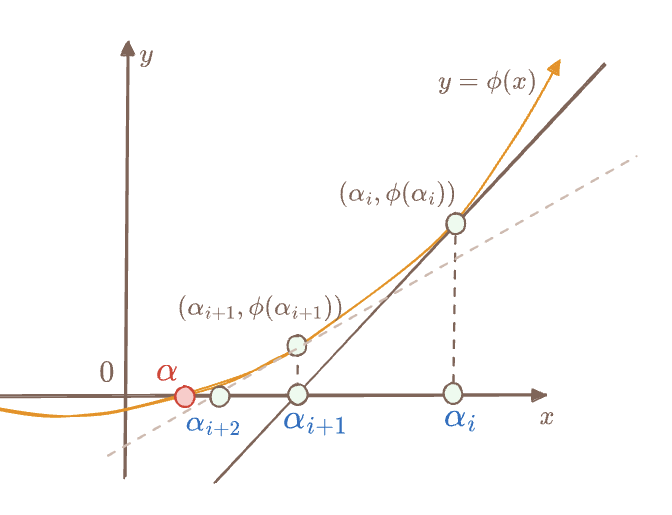

# Fast Polynomial Division Based on Newton Iteration

Yu Guo <yu.guo@secbit.io>

*Last updated: 2025-06-24*

---

Traditional polynomial division with remainder [Synthetic Division](https://en.wikipedia.org/wiki/Synthetic_division) requires $O(n^2)$ computational complexity. This section introduces a fast division algorithm using Newton Iteration, with complexity matching polynomial multiplication at only $O(M(n))$, where $M(n)$ represents the complexity of polynomial multiplication. This algorithm is described in Chapter 9.1 of "Modern Computer Algebra".

Before introducing Newton's method, we'll first discuss the simple concept of **reversed polynomials**, and then examine their relationship with **power series**.

## Reversed Polynomials

Given a finite field $F$, for polynomials $f(X)$ and $g(X)$ in $F[X]$, since $F[X]$ is a Euclidean Domain, $f(X)$ and $g(X)$ satisfy the following division with remainder equation:

$$
f(X) = g(X)\cdot q(X) + r(X), \qquad\text{and} \deg(r)<\deg(g)
$$

For convenience, we denote $n-1$ as the length of the coefficient vector of $f(X)$, with $\deg(f)=n-1$, and $m-1$ as the length of the coefficient vector of $g(X)$, with $\deg(g)=m-1$.

Let's first introduce what a **reversed polynomial** is. If $f(X)$ is expressed in coefficient form as:

$$
f(X) = a_0 + a_1X + \cdots + a_{n-1}X^{n-1}
$$

Then its reversed polynomial is:

$$
\mathsf{rev}(f) = a_{n-1} + a_{n-2}X + \cdots + a_1X^{n-2} + a_0X^{n-1}
$$

Simply put, $\mathsf{rev}(f)$ reverses the order of coefficients in $f$, making the highest degree coefficient of the original polynomial the constant term of the reversed polynomial; likewise, the second-highest coefficient becomes the $X$ term coefficient, and so on. Here's the formal definition of the reversal transformation: $\mathsf{rev}_k(f):F[X]\to F[X]$:

$$
\mathsf{rev}_k(f): f(X) \longmapsto X^kf\left(\frac{1}{X}\right)
$$

If $k=m=\deg(f)+1$, then $\mathsf{rev}_k(f)$ represents $f$'s reversed polynomial, and we omit the subscript $k$, denoting it as $\mathsf{rev}_k(f)$. Let's expand the definition of $\mathsf{rev}_k(f)$:

$$
\begin{aligned}
\mathsf{rev}_k(f) & = X^kf\left(\frac{1}{X}\right) \\
& = X^k\left(a_0 + \frac{a_{1}}{X} + \cdots + \frac{a_{n-2}}{X^{n-2}} + \frac{a_{n-1}}{X^{n-1}}\right) \\
& = a_0X^k + a_1X^{k-1} + \cdots + a_{n-1}X^{k-n+1}  \\
& = X^{k-n+1}\big( a_{n-1} + a_{n-2}X + \cdots + a_1X^{n-2} + a_0X^{n-1} \big)
\end{aligned}
$$

If $k=n-1$, then $\mathsf{rev}_k(f)$ is exactly the reversed polynomial of $f$. It's easy to verify that $\mathsf{rev}_k$ satisfies additive homomorphism:

$$
\mathsf{rev}_k(f+g) = \mathsf{rev}_k(f) + \mathsf{rev}_k(g)
$$

And $\mathsf{rev}_k$ also satisfies these two multiplicative relational equations:

$$
\mathsf{rev}_k(f\cdot g) = \mathsf{rev}_j(f)\cdot \mathsf{rev}_{k-j}(g)
$$

$$
\mathsf{rev}_k(f) = X^d \cdot \mathsf{rev}_{k-d}(f)
$$

Substituting $f(X)$'s divisional decomposition equation into the definition of $\mathsf{rev}(f)$, we get:

$$
\begin{aligned}
\mathsf{rev}_{n}(f) & = \mathsf{rev}_{n}(q\cdot g + r) \\
& = \mathsf{rev}_{n}(q\cdot g) + \mathsf{rev}_{n}(r) \\
& = \mathsf{rev}_{n-m}(q)\cdot \mathsf{rev}_{m}(g) + X^{n-m+1}\mathsf{rev}_{m-1}(r)
\end{aligned}
$$

Then we can derive the following equation:

$$
\mathsf{rev}_{n}(f) \equiv \mathsf{rev}_{n-m}(q)\cdot \mathsf{rev}_{m}(g) \mod{X^{n-m+1}}
$$

Note that in the above equation, the reversed polynomial of the remainder polynomial $r(X)$ is lifted by $X^{n-m+1}$ to become a higher-degree term, so we can eliminate it using polynomial **modular arithmetic**.

The purpose of this treatment is that polynomial division operations no longer need to consider the remainder polynomial $r(X)$; we only need to calculate the reversed polynomial $\mathsf{rev}(q)$ of the quotient polynomial $q(X)$ using the equation above.

We can further transform the modular equation to get a formula for $\mathsf{rev}_{n-m}(q)$:

$$
\mathsf{rev}_{n-m}(q) \equiv \mathsf{rev}_{n}(f)\cdot \mathsf{rev}_{m}(g)^{-1} \mod{X^{n-m+1}}
$$

This way, calculating the quotient polynomial $q(X)$ further depends on a polynomial inverse operation under modular arithmetic, specifically how to calculate $\mathsf{rev}_{m}(g)^{-1}$ such that $\mathsf{rev}_{m}(g)\cdot \mathsf{rev}_{m}(g)^{-1} \equiv 1\mod{X^{n-m+1}}$.

If we can successfully calculate $\mathsf{rev}_{n-m}(q)$, then $q(X)$ can be solved as:

$$
q = \mathsf{rev}_{n-m}(\mathsf{rev}_{n-m}(q))
$$

The next question is, is it easier to compute a polynomial's multiplicative inverse in a polynomial equation with modular arithmetic? In other words, how do we calculate the multiplicative inverse in the quotient ring $F[X]/\langle X^{n-m+1} \rangle$?

For convenience, let's introduce a new constant: $l=n-m+1$.

## Existence of Multiplicative Inverses in Quotient Rings

We know that only unit elements in a ring have multiplicative inverses. So for elements in the quotient ring $F[X]/\langle X^l\rangle$, which polynomials have multiplicative inverses? 

We can deduce that polynomials with non-zero constant terms in $F[X]/\langle X^l\rangle$ definitely have multiplicative inverses. This is because for any Euclidean Domain $R$, if two coprime elements $a, m\in R$ exist, i.e., $\gcd(a, m)=1$, then using the *Extended Euclidean Algorithm* we can find $s, t\in R$ that satisfy the Bezout equation:

$$
s a + t m = 1
$$

or equivalently:

$$
\begin{aligned}
s &\equiv a^{-1} \mod{m} \\
t &\equiv m^{-1} \mod{a}
\end{aligned}
$$

For any polynomial $f\in F[X]/\langle X^l\rangle$ modulo $X^l$, as long as its constant term is non-zero, it satisfies $\gcd(f, X^l)=1$, meaning we can calculate the Inverse of $f$ mod $X^l$ using the Extended Euclidean Algorithm, though this requires $O(n^2)$ complexity.

For the problem we need to solve, calculating $h$ in $g\cdot h \equiv 1 \mod{X^l}$, since $g$ is the reversed polynomial of some polynomial, its constant term must be non-zero, especially if the original polynomial is Monic (leading coefficient is one), then its constant term is $1$, i.e., $g(0)=1$.

## Power Series Rings and Polynomial Inversion

To calculate the multiplicative inverse of a polynomial, we need to introduce an important concept, the **Formal Power Series Ring**. If we extend polynomials in $F[X]$ by adding infinitely many non-zero higher-degree terms to any polynomial, we get a formal power series ring $F[[X]]$:

$$
p(X) = \sum_{i=0}^{\infty} a_iX^i \in F[[X]]
$$

For any $p_1, p_2\in F[[X]]$, the ring's addition and multiplication are defined as follows:

$$
p_1(X) + p_2(X) = \sum_{i=0}^{\infty}(a_i + b_i)X^i
$$

$$
p_1(X)\cdot p_2(X) = \sum_{i=0}^{\infty}\Big(\sum_{j=0}^{i}a_j b_{i-j}\Big)X^i
$$

Additionally, any non-zero $p(X)$ can be uniquely factored as $X^n p_0(X)$, where $p_0(X)$ has a non-zero constant term. $F[[X]]$ is a Unique Factorization Domain (UFD). Defining function $\delta(p) = n$, $F[[X]]$ is a Euclidean Domain.

For any polynomial $f(X)\in F[X]$, we can view it as a power series with higher-degree term coefficients of zero, i.e.,

$$
f(X) = \sum_{i=0}^{d}a_iX^i + \sum_{i=d+1}^{\infty}0X^i \in F[[X]]
$$

We can also map any power series $p(X)\in F[[X]]$ to a polynomial in $F[X]$ through polynomial modular arithmetic:

$$
p(X) = \sum_{i=0}^{d}a_iX^i + O(X^{d+1}) \equiv f(X) \mod{X^d}
$$

Here $O(X^{d+1})$ represents all terms of $X^{d+1}$ and higher. By marking terms higher than $X^d$ as unconcerned tail terms, we get an approximate representation of power series $p(X)$, where $d$ indicates the precision of the approximation.

Thus, $F[X]$ is a subring of $F[[X]]$, and we can embed elements from $F[X]$ into $F[[X]]$ through a monomorphism:

$$
\begin{aligned}
\iota: & F[X] \to F[[X]] \\
& f(X) \mapsto \sum_{i=0}^{d}a_iX^i + \sum_{i=d+1}^{\infty}0X^i
\end{aligned}
$$

Why introduce power series rings? Because they have a very useful **property**:

- Any power series $p(X)$ with a non-zero constant term has a multiplicative inverse $\tilde{p}(X)$ such that $p(X)\cdot \tilde{p}(X) = 1$

This conclusion seems a bit magical. Let's look at a concrete example:

$$
p_1(X) = 1 + 2X + 3X^2 + 2X^3 \in \mathbb{F}_7[X]
$$

Its multiplicative inverse is a potentially infinite power series. For convenience, we'll take only its first ten terms, i.e., with precision $10$:

$$
\tilde{p}_1(X) = 1 + 5X + X^2 + 2X^3 + 4X^4 + 5X^5 + 2X^6 + X^7 + 3X^8 + X^9 + O(X^{10})
$$

The tail term $O(X^{10})$ represents the sum of all higher-degree terms after $X^{10}$.

Let's try to take $\tilde{p}_1(X)$ without the tail term as a polynomial and multiply it by $p_1(X)$ to see the result:

$$
\begin{aligned}
& p_1(X)\cdot (1 + 5X + X^2 + 2X^3 + 4X^4 + 5X^5 + 2X^6 + X^7 + 3X^8 + X^9) \\
= & 1 + 6X^{10} + 2X^{11} + 2X^{12}
\end{aligned}
$$

As we can see, this is a polynomial approximately equal to *one*. In other words, the product result only has terms with degrees greater than or equal to $10$. If we consider precision $10$, this product result is approximately equal to one.

How do we calculate this potentially infinite $\tilde{p}(X)$? Let's derive the calculation formula. Assume the multiplicative inverse $\tilde{p}(X)$ of $p(X)$ is:
 
$$
\tilde{p}(X)=\sum_{i=0}^{\infty}b_iX^i
$$

satisfying:

$$
\Big(\sum_{i=0}^{\infty}b_iX^i\Big)\Big(\sum_{i=0}^{\infty}a_iX^i\Big) = 1
$$

Since $a_0\neq 0$, we have $b_0 = \frac{1}{a_0}$, because $a_0b_0 = 1$. Then considering the coefficient of the first-degree term in the product, since the coefficient of $X$ is zero:

$$
a_1b_0 + a_0b_1 = 0
$$

So we can get:

$$
b_1 = -\frac{a_1b_0}{a_0}
$$

Through similar derivation, we can get the expression for $b_2$:

$$
b_2 = -\frac{a_1b_1 + a_2b_0}{a_0}
$$

This pattern can be generalized to any $b_k$, resulting in a recursive calculation formula:

$$
b_k = -\frac{a_1b_{k-1} + a_2b_{k-2} + \cdots a_kb_0 }{a_0} = \frac{-1}{a_0}\Big(\sum_{j=1}^{k}a_{j}b_{k-j}\Big)
$$

This recursion can continue, calculating from low-degree coefficient to high-degree coefficient of $\tilde{p}(X)$, until the required computational precision is reached.

The formal power series ring $F[[X]]$ is actually a local ring, meaning it has only one maximal ideal $\langle X\rangle$. All power series outside this maximal ideal (elements with non-zero constant terms) are *unit elements*, meaning they have multiplicative inverses.

Back to our problem: given a polynomial $g\in F[X]$, we need to find its multiplicative inverse $h\in F[X]$ satisfying $g\cdot h \equiv 1 \mod X^l$. Since $g$ is the reversed polynomial of some polynomial, we can be sure its constant term is non-zero. Thus, according to the algorithm above, we can find a $\tilde{g}\in F[[X]]$ satisfying $\tilde{g}\cdot g = 1$. Of course, we don't need the exact result of $\tilde{g}$, since $\tilde{g}$ is an infinitely long power series; we just need its approximate solution, where the approximation precision only needs to be greater than $X^l$ to stop the recursive calculation.

$$
h(X) = b_0 + b_1X + b_2X^2 + \cdots + b_{l-1}X^{l-1}
$$

At this point, we already have an algorithm for polynomial division, but its complexity is still $O(l^2)$.

Next, we'll introduce how to use Newton's method (Newton Iteration) to accelerate the calculation of a polynomial's multiplicative inverse, with algorithm complexity $O(M(l))$, where $M(l)$ represents the computational cost of polynomial multiplication. If the finite field $F$ is Algebraic-FFT friendly (meaning $F$ contains a multiplicative subgroup of size $2^\kappa$ large enough), then the complexity of $O(M(l))$ is $O(l\log{l})$.

## Newton's Method

Newton's method is an iterative algorithm in mathematical analysis for finding polynomial roots by successive approximation. For example, for a differentiable function $\phi: \mathbb{R}\to \mathbb{R}$ in the real domain, to find $\alpha$ satisfying $\phi(\alpha)=0$, we first guess an initial value $x=\alpha_0$, then successively solving for $\alpha_1, \alpha_2, \cdots, \alpha_k$, until $\alpha_k\cong\alpha$, or until the precision meets requirements. The idea of successive approximation can be simply illustrated by the figure:



Assume the slope of $\phi(x)$ at $x=\alpha_i$ is $\phi'(\alpha_i)$, and the intersection of the tangent line with the x-axis is denoted as $\alpha_{i+1}$, then they satisfy:

$$
\frac{\phi(\alpha_i)}{
\alpha_i - \alpha_{i+1}
} = \phi'(\alpha_{i})
$$

After simple formula transformation, we get the recursive expression for $\alpha_{i+1}$:

$$
\alpha_{i+1} = \alpha_i - \frac{\phi(\alpha_i)}{\phi'(\alpha_i)}
$$

Starting from $\alpha_0$, through repeated iterations $k$ times, we can get a fast converging approximate solution $\alpha_k\cong\alpha$.

Similarly, to solve $g\cdot h \equiv 1 \mod X^l$, we can construct a function $\Phi: F[[X]] \to F[[X]]$ mimicking the real function $\phi(x)$:

$$
\Phi(Y) = \frac{1}{Y} - g
$$

Its derivative function is denoted as $\Phi'(Y)$:

$$
\Phi'(Y) = (\frac{1}{Y} - g)' = -\frac{1}{Y^2}
$$

The root $Y = \tilde{g}\in F[[X]]$ of this function will satisfy $\tilde{g}\cdot g = 1$:

$$
\Phi(\tilde{g}) = \frac{1}{\tilde{g}} - g = g - g = 0
$$

Please note again that since $\tilde{g}$ is a power series with infinitely many terms, we only need an approximate solution $h\approx\tilde{g}$, meaning:

$$
\Phi(h) = \frac{1}{h} - g \approx 0
$$

This exact solution $\tilde{g}$ has non-zero coefficients for $X^l$ or higher terms $X^{>l}$, while the approximate solution $h$ only needs to have the same coefficients as $\tilde{g}$ for lower-degree terms:

$$
\tilde{g} = h + O(X^l)
$$

Then clearly $h$ only needs to include all terms lower than $X^l$, making $h$ an element of the polynomial ring $F[X]/\langle X^l \rangle$:

$$
h = \sum_{i=0}^{l-1}b_iX^i \quad \in F[X]/\langle X^l \rangle
$$

and satisfying:

$$
 g\cdot h = g \cdot (\tilde{g} - O(X^l)) = 1 - g\cdot O(X^l) \equiv 1 \mod{X^l}
$$

Now let's try using Newton's method to solve for h, with the recursive formula:

$$
h_{i+1} = h_i - \frac{\Phi(h_i)}{\Phi'(h_i)} = h_i - \frac{\frac{1}{h_i} - g}{-\frac{1}{h_i^2}} = 2h_i - g\cdot h_i^2
$$

First, let's assume the constant term of $g$ is one, so $g=1+O(X)$. Then let's guess an initial value for iteration $h_0 = 1$. When we substitute $Y=h_0$ into $\Phi(Y)$:

$$
\Phi(h_0) = \frac{1}{h_0} - g = 1 - g = O(X)
$$

We can use $(\bmod{X})$ modular arithmetic to **eliminate** the tail term $O(X)$ on the right side of the equation, yielding:

$$
\Phi(h_0) = O(X) \equiv 0 \mod{X}
$$

This equation can be interpreted as: $h_0$ is an approximate root of $\Phi(Y)$ with **precision** $X$.

Then using Newton's iterative formula for the first step, we get $h_1$:

$$
h_1 = h_0 - \frac{\Phi(h_0)}{\Phi'(h_0)} = 2h_0 - g\cdot h_0^2 = 2 - g
$$

Let's check how far $g\cdot h_1$ is from $1$:

$$
1 - g\cdot h_1 = 1- g(2-g) = (1 - g)^2 = (O(X))^2 = O(X^2) \equiv 0 \mod{X^2}
$$

Now we can consider: $h_1$ is an approximate root of the $\Phi(Y)$ function with **precision** $X^2$.

Continuing with the iteration for $h_2$:

$$
h_2 = h_1 - \frac{\Phi(h_1)}{\Phi'(h_1)} = 2h_1 - g\cdot h_1^2 = 4 - 2g - g(2-g)^2 = 4 - 2g - 4g + 4g^2 - g^3
$$

Continuing to test how far $g\cdot h_2$ is from one, assuming $g = 1 + e_0X + e_1X^2 + e_2X^3 + O(X^4)$, then:

$$
\begin{aligned}
1 - g\cdot h_2 &= 1- g(4-6g+4g^2-g^3) \\
& = 1 - 4g + 6g^2 - 4g^3 + g^4 \\
\end{aligned}
$$

Substituting $g = 1 + e_0X + e_1X^2 + e_2X^3 + O(X^4)$ into the right side, skipping the tedious calculation steps, we find that all coefficients of $X$, $X^2$, $X^3$ terms are eliminated to zero, finally getting:
$$
1 - g\cdot h_2 = \cdots = O(X^4) \equiv 0 \mod{X^4}
$$
So, $h_2$ is an approximate root of $\Phi(X)$ with precision $X^4$.

Through observation, it's not hard to see that each time Newton's method is used, the calculation result progressively approaches the root of $\Phi(Y)$, and $(1-g\cdot h_i)$ only retains terms of $X^{2^i}$ and higher. We can conjecture:

$$
g\cdot h_i \equiv 1 \mod{X^{2^i}}
$$

where $h_i$ is calculated as follows:

$$
h_{i} = h_{i-1} - \frac{\Phi(h_{i-1})}{\Phi'(h_{i-1})} \equiv 2\cdot h_{i-1} - g\cdot h_{i-1}^2 \mod{X^{2^{i}}}
$$

We use mathematical induction to prove this conjecture more rigorously:

- If $i = 0$, then $h_0 = 1$, clearly $g\cdot h_0 = 1 + O(X) \equiv 1 \mod X$, so the theorem holds when $i=0$.
- Assuming $g\cdot h_i \equiv 1 \mod X^{2^i}$ holds, let's consider $h_{i+1}$, expand $1-g\cdot h_{i+1}$, and similarly prove that $h_{i+1}$ satisfies the theorem equation:

$$
\begin{aligned}
1 - g\cdot h_{i+1} & = 1 - g\cdot \Big(2\cdot h_{i} - g\cdot h_{i}^2\Big) \\
& = 1 - 2g\cdot h_{i} + g^2\cdot h_{i}^2 \\
& = (1 - g\cdot h_{i})^2 \\
& \equiv 0 \mod{(X^{2^{i}})^2}
\end{aligned}
$$

Now we can understand why we initially wanted to use the $\mathsf{rev}(g)$ function to get $g$'s reversed polynomial: this is because when computing with the reversed polynomial as a power series, its constant term is stable. Though high-degree terms produce many cross-terms, they can be eliminated by modular arithmetic.

## Polynomial Inversion Algorithm

Let's detail the calculation process for $h_k$:

$$
\begin{aligned}
h_{k+1}(X) & \equiv 2\cdot h_k(X) - f(X)\cdot h^2_{k}(X) \mod X^{2^k} \\
h_{k}(X) & \equiv 2\cdot h_{k-1}(X) - f(X)\cdot h^2_{k-1}(X) \mod X^{2^{k-1}}\\
\vdots \quad & \equiv \qquad \vdots \\
h_{2}(X) & \equiv 2\cdot h_{1}(X) - f(X)\cdot h^2_{1}(X) \mod X^{2}\\
h_{1}(X) & \equiv 2\cdot h_{0}(X) - f(X)\cdot h^2_{0}(X) \mod X\\
\end{aligned}
$$

If we assume $l$ is a power of two, i.e., $l=2^k$, then we can get the following polynomial inversion algorithm (Python code), where the first parameter is a known polynomial $g(X)\in F[X]$, and the algorithm returns a polynomial $h\in F[X]/\langle X^l \rangle$ satisfying $g\cdot h \equiv 1 \mod X^l$:

```python
def poly_inverse(g: list[F], l: int):
    assert (g[0] == F.one())
    r = log_2_floor(l)
    h = [F(1)]
    for i in range(1, k+1):
        h_sq = poly_mul(h, h)
        g_h_sq = poly_mul(h_sq, g)
        h = poly_sub(poly_smul(h, F(2)), g_h_sq[:2**i])
    return h

def poly_sub(f, g):
    return [f[i] - g[i] for i in range(len(f))]

def poly_smul(f, c):
    return [f[i] * c for i in range(len(f))]

def poly_mul(f, g):
    ''' skip the implementation '''
    ...
```

What if $l$ is not a power of two? How should we handle it?

We have two methods. The first is from book [GG13] Exercise 9.6 (page 287). The second, from paper [CC11], is simpler and more straightforward: if $k$ is the power of two rounding up of $l$, so $l\leq k$, we can have:

$$
X^k\mid (1 - gh) \Rightarrow  X^l\mid (1 - gh)
$$

This is easy to prove. Intuitively, if a power series computes to zero at precision $X^k$, it must also be zero at lower precision, just like $(1 + O(X^k))$ can certainly be expressed as $(1 + O(X^l))$. So we only need to calculate $h^*$ polynomial satisfying $X^k|1-gh^*$, then through modular arithmetic get $h = h^* \mod X^l$, which certainly satisfies:

$$
X^l\mid (1 - gh)
$$

Another detail to handle is considering that $g(0)$'s constant term may not be one. This is common since $g$'s reversed polynomial is likely not a monic polynomial (leading coefficient is one). Although we have simple ways to convert a non-monic polynomial into a monic one, this conversion requires $O(l)$ additional finite field multiplications. However, we can directly remove this constraint by setting the initial guess $h_0$ to $g(0)^{-1}$, then continue with Newton's method.

A third improvement is that in each polynomial multiplication operation, we can first truncate polynomials based on precision to reduce length and computational cost. For example, when calculating $g\cdot h_{i-1}^2$, we need only compute $(g \mod X^{2^i})\cdot h_{i-1}^2$, first truncating polynomial $g$ to precision, then performing multiplication.

Here's the modified Python code:

```python
def poly_inverse_rev1(g: list[F], l: int):
    k = log_2_floor(l)
    h = [g[0].inverse()]
    for i in range(1, k+1):
        h_sq = poly_mul(h[:2**(i-1)], h[:2**(i-1)])
        g_h_sq = poly_mul(h_sq, g[:2**i])
        h = poly_sub(poly_smul(h, 2), g_h_sq[:2**i])
    
    h_sq = poly_mul(h, h)
    g_h_sq = poly_mul(h_sq[:l+1], g[:l+1])
    h = poly_sub(poly_smul(h[:l+1], 2), g_h_sq[:l+1])
    return h
```

### Complexity Analysis

The time complexity of this polynomial inversion algorithm is $3M(l) + 2l$.

First, each round of polynomial multiplication has two operations: one for $h_i^2$, with complexity $M(2^{i-1})$, and one for $h_i^2\cdot g$, with complexity $M(2^i)$. Computing $(2h_i - g\cdot h_i^2)$ has complexity $2^i$.

The total cost of one iteration is:

$$
M(2^i) + M(2^{i-1}) + 2^i \leq = \frac{3}{2}M(2^{i}) + 2^i
$$

The total cost of r iterations is:

$$
\sum_{1\leq i \leq r} \Big(\frac{3}{2}M(2^i) + 2^i\Big) \lt 3M(2^r) + 2^{r+1}
$$

## Fast Polynomial Division Algorithm

Now that we know how to calculate a polynomial's multiplicative inverse, let's outline the steps for the polynomial division algorithm. Given two polynomials $f(X), g(X)\in F[X]$, where $f$ has degree $n-1$, $g$ has degree $m-1$, and $n\geq m$, the algorithm returns the quotient polynomial $q$ of degree $n-m$ and the remainder polynomial $r$ of degree strictly less than $m-1$, satisfying:

$$
f(X) = q(X)\cdot g(X) + r(X)
$$

Step 1: Check that the highest degree coefficients of parameters $f(X)$ and $g(X)$ are non-zero, then calculate their degree difference, denoted as $d=\deg(f)-\deg(g)$, assuming $\deg(f)\geq\deg(g)$.

Step 2: Calculate the reversed polynomials of $f(X)$ and $g(X)$, denoted as $\mathsf{rev}_n(f)$ and $\mathsf{rev}_m(g)$, where $\deg(f)=n-1$, $\deg(g)=m-1$.

Step 3: Calculate the multiplicative inverse of $\mathsf{rev}_m(g)$ in the power series ring $F[[X]]$ with precision $X^{d+1}$, denote the result as $\tilde{g}_d=\mathsf{rev}_m(g)^{-1}$.

Step 4: Calculate $q^* \equiv \mathsf{rev}_m(f)\cdot \tilde{g}_d \mod X^{d+1}$, denoted as $\mathsf{rev}_m(q)$.

Step 5: Calculate $\mathsf{rev}_{n-m}(q^*)=\mathsf{rev}_{n-m}(\mathsf{rev}_{n-m}(q))=q(X)$.

Step 6: Calculate the remainder polynomial $r(X) = f(X) - q(X)\cdot g(X)$.

Here's the Python code implementation, followed by complexity analysis:

```python
def poly_div_rem(f: list[F], g: list[F]):
    assert(f[-1] != Fp(0))
    assert(g[-1] != Fp(0))
    f_deg = len(f) - 1
    g_deg = len(g) - 1
    if f_deg < g_deg:
        return [Fp(0)], f
    
    d = f_deg - g_deg
    
    rev_g = g[::-1]
    rev_f = f[::-1]

    rev_g_inv_prec_d_plus_1 = poly_inverse_rev1(rev_g, d+1)

    q = poly_mul(rev_f[:d+1], rev_g_inv_prec_d_plus_1)
    q = q[:d+1]

    q.reverse()

    r = poly_sub(f, poly_mul(q,g))
    remove_leading_zeros(r)
    return q, r
```

### Complexity Analysis

In step 3, $3M(l) + 2l$ polynomial multiplication operations are needed; step 4 requires one polynomial multiplication with complexity $M(l)$; step 6 requires one polynomial multiplication with complexity $M(l)$ and one polynomial subtraction with complexity $n$. Thus, the total time complexity is:

$$
5M(l) + 2l + n
$$

## Conclusion

This is a beautiful algorithm that reduces the time complexity of polynomial division from $O(l^2)$ to $O(l\log{l})$. Newton's method is a classic and powerful technique; [GG13] has more examples of algorithms using Newton iteration, recommended for readers interested in deeper exploration.

## References

- [GG13] Von Zur Gathen, Joachim, and Jürgen Gerhard. Modern computer algebra. Cambridge university press, 2003.
- [CC11] Zhengjun Cao, Hanyue Cao. Note on fast division algorithm for polynomials using Newton iteration. 2011. https://arxiv.org/pdf/1112.4014
- https://cs.uwaterloo.ca/~r5olivei/courses/2021-winter-cs487/lec5-ref.pdf
- https://math.stackexchange.com/questions/710252/multiplicative-inverse-of-a-power-series