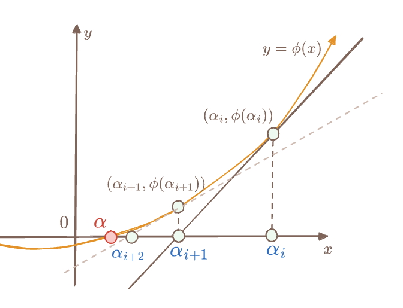

# 基于 Newton Iteration 的快速多项式除法

Yu Guo <yu.guo@secbit.io>

*最后更新日期：2025-06-24*

---

传统的多项式的带余除法 [Synthetic Division](https://en.wikipedia.org/wiki/Synthetic_division) 需要 $O(n^2)$ 的计算复杂度。本节介绍一种利用 Newton Iteration 的快速除法算法，算法复杂度与多项式乘法一致，仅为 $O(M(n))$。其中 $M(n)$ 表示多项式乘法的复杂度。这个算法描述来自于 "Modern Computer Algebra" 一书的 9.1 节。

在介绍牛顿迭代法之前，我们先介绍一个简单的概念，**逆序多项式**，然后讨论与 **幂级数** 的关系。

## 逆序多项式

假设 $F$ 是一个有限域，对于 $F[X]$ 上的多项式 $f(X)$ 以及任意非零多项式 $g(X)$，根据 Euclidian Division 定理，存在唯一的 $q(X)$ 与 $r(X)$ 满足：

$$
f(X) = g(X)\cdot q(X) + r(X), \qquad\text{and} \deg(r)<\deg(g)
$$

为了方便后续的描述，我们记 $n$ 为 $f(X)$ 系数向量的长度，$\deg(f)=n-1$，$m$ 为 $g(X)$ 系数向量的长度，$\deg(g)=m-1$。

下面我们先介绍什么是 **逆序多项式**。假设 $f(X)$ 表示为如下的系数形式：

$$
f(X) = a_0 + a_1X + \cdots + a_{n-1}X^{n-1}
$$

那么它的逆序多项式为：

$$
\mathsf{rev}(f) = a_{n-1} + a_{n-2}X + \cdots + a_1X^{n-2} + a_0X^{n-1}
$$

简单来说，$\mathsf{rev}(f)$ 就是把 $f$ 的系数按顺序倒转，原多项式最高次项系数作为逆序多项式的常数项；同理次高项系数作为逆序多项式的 $X$ 项系数，依此类推。下面我们给出逆序变换的定义：$\mathsf{rev}_k(f):F[X]\to F[X]$:

$$
\mathsf{rev}_k(f): f(X) \longmapsto X^kf\left(\frac{1}{X}\right)
$$

如果 $k=m=\deg(f)+1$，那么 $\mathsf{rev}_k(f)$ 就表示 $f$ 的逆序多项式，这时我们省略下标 $k$ ，记为 $\mathsf{rev}(f)$。下面展开下 $\mathsf{rev}_k(f)$ 的定义：

$$
\begin{aligned}
\mathsf{rev}_k(f) & = X^kf\left(\frac{1}{X}\right) \\
& = X^k\left(a_0 + \frac{a_{1}}{X} + \cdots + \frac{a_{n-2}}{X^{n-2}} + \frac{a_{n-1}}{X^{n-1}}\right) \\
& = a_0X^k + a_1X^{k-1} + \cdots + a_{n-1}X^{k-n+1}  \\
& = X^{k-n+1}\big( a_{n-1} + a_{n-2}X + \cdots + a_1X^{n-2} + a_0X^{n-1} \big)
\end{aligned}
$$

如果 $k=n-1$，那么 $\mathsf{rev}_k(f)$ 正是 $f$ 的逆序多项式。容易验证，$\mathsf{rev}_k$ 满足加法同态：

$$
\mathsf{rev}_k(f+g) = \mathsf{rev}_k(f) + \mathsf{rev}_k(g)
$$

并且 $\mathsf{rev}_k$ 也满足下面的两个乘法关系等式：

$$
\mathsf{rev}_k(f\cdot g) = \mathsf{rev}_j(f)\cdot \mathsf{rev}_{k-j}(g)
$$

$$
\mathsf{rev}_k(f) = X^d \cdot \mathsf{rev}_{k-d}(f)
$$

我们把 $f(X)$ 的除法分解的等式代入 $\mathsf{rev}(f)$ 的定义，可得：

$$
\begin{aligned}
\mathsf{rev}_{n}(f) & = \mathsf{rev}_{n}(q\cdot g + r) \\
& = \mathsf{rev}_{n}(q\cdot g) + \mathsf{rev}_{n}(r) \\
& = \mathsf{rev}_{n-m}(q)\cdot \mathsf{rev}_{m}(g) + X^{n-m+1}\mathsf{rev}_{m-1}(r)
\end{aligned}
$$

然后我们可以得到下面的等式：

$$
\mathsf{rev}_{n}(f) \equiv \mathsf{rev}_{n-m}(q)\cdot \mathsf{rev}_{m}(g) \mod{X^{n-m+1}}
$$

注意到，上面的等式中余数多项式 $r(X)$ 的逆序多项式被 $X^{n-m+1}$ 提升变成了高次项，因此我们可以通过多项式 **模运算** 将其抹掉。

这么处理的目的是，多项式除法运算不再需要考虑余数多项式 $r(X)$，我们只要通过上面的等式来计算商多项式 $q(X)$ 的逆序多项式 $\mathsf{rev}(q)$ 即可。

然后我们再对上面模运算等式进行变换，得到 $\mathsf{rev}_{n-m}(q)$ 的计算式：

$$
\mathsf{rev}_{n-m}(q) \equiv \mathsf{rev}_{n}(f)\cdot \mathsf{rev}_{m}(g)^{-1} \mod{X^{n-m+1}}
$$

这样一来，商多项式 $q(X)$ 计算进一步依赖一个模运算下的多项式求逆运算，即如何计算 $\mathsf{rev}_{m}(g)^{-1}$，使得 $\mathsf{rev}_{m}(g)\cdot \mathsf{rev}_{m}(g)^{-1} \equiv 1\mod{X^{n-m+1}}$。


如果我们能顺利计算出 $\mathsf{rev}_{n-m}(q)$，那么 $q(X)$ 就可以求解出：

$$
q = \mathsf{rev}_{n-m}(\mathsf{rev}_{n-m}(q))
$$


接下来一个疑问是，在带有模运算的多项式等式中，计算一个多项式的乘法逆（Multiplicative Inverse）会更容易计算吗？换句话说，我们如何计算商环 $F[X]/\langle X^{n-m+1} \rangle$ 中的乘法逆元？

为了方便起见，我们引入一个新的常数记号：$l=n-m+1$。


## 商环中乘法逆元的存在性

我们知道环中只有 Unit Element 才有乘法逆元，那么对于商环 $F[X]/\langle X^l \rangle$ 中的元素，哪些多项式才存在乘法逆元？

但是常数项不为零的多项式 $f(X)$ 在 $F[X]/\langle X^l \rangle$ 一定存在乘法逆元。这是因为对于任何一个 Euclidean Domain $R$，如果其中任意两个互素元素 $a, m\in R$，即 $\gcd(a, m)=1$，那么通过 Extended Euclidean Algorithm 可以计算得到 $s, t\in R$ ，
它们满足下面的 Bezout 等式：

$$
s a + t m = 1
$$

或者换成下面的两个等式：

$$
\begin{aligned}
s &\equiv a^{-1} \mod{m} \\
t &\equiv m^{-1} \mod{a}
\end{aligned}
$$

而对于任何一个模 $X^l$ 的多项式 $f(X)\in F[X]/\langle X^l \rangle$，只要它的常数项不为零，那么满足 $\gcd(f(X), X^l)=1$，即我们可以通过 Extended Euclidean Algorithm 计算得到 $f(X)\bmod{X^l}$ 的乘法逆元，不过这需要 $O(n^2)$ 的复杂度。

而对于我们要解决的问题，计算 $g\cdot h \equiv 1\mod{X^l}$ 中的 $h$ 来说，因为 $g$ 为某个多项式的逆序多项式，所以它的常数项一定不为零，特别是如果原多项式为 Monic （首项为一）多项式，那么它的常数项为 1，即 $g(0)=1$。

## 幂级数环与多项式求逆

为了计算多项式的乘法逆元，我们需要介绍一个重要概念，**形式幂级数环**（Formal Power Series Ring）。对于多项式环 $F[X]$ 中的多项式，如果我们对其扩充，对任意的多项式都加上具有无限非零高次项，那么我们就可以得到一个形式幂级数环 $F[[X]]$：

$$
p(X) = \sum_{i=0}^{\infty} a_iX^i \in F[[X]]
$$

对于任意的 $p_1, p_2\in F[[X]]$，环的加法和乘法定义如下：

$$
p_1(X) + p_2(X) = \sum_{i=0}^{\infty}(a_i + b_i)X^i
$$

$$
p_1(X)\cdot p_2(X) = \sum_{i=0}^{\infty}\Big(\sum_{j=0}^{i}a_j b_{i-j}\Big)X^i
$$

另外任何一个非零的 $p(X)$ 都可以唯一地分解为 $X^n p_0(X)$，其中 $p_0(X)$ 的常数项非零。$F[[X]]$ 是一个 Unique Factorization Domain （UFD，即唯一分解环）。定义函数 $\delta(p) = n$，那么 $F[[X]]$ 是一个 Euclidean Domain。

而对于任意多项式 $f(X)\in F[X]$，我们可以把它看成高次项系数为零的幂级数，即 

$$
f(X) = \sum_{i=0}^{d}a_iX^i + \sum_{i=d+1}^{\infty}0X^i \in F[[X]]
$$

我们也可以通过多项式的模运算，把任何一个幂级数 $p(X)\in F[[X]]$ 映射到 $F[X]$ 中的多项式，即

$$
p(X) = \sum_{i=0}^{d}a_iX^i + O(X^{d+1}) \equiv f(X) \mod{X^d}
$$

这里 $O(X^{d+1})$ 表示的是所有 $X^{d+1}$ 及更高次项，通过把高于 $X^d$ 的项标记为不关心的尾项，我们就可以得到幂级数 $p(X)$ 的近似表示，其中 $d$ 表示近似的精度。

由此可见，$F[X]$ 是 $F[[X]]$ 的子环，我们可以通过一个单同态映射将 $F[X]$ 中的元素嵌入到 $F[[X]]$ 中：
$$
\begin{aligned}
\iota: & F[X] \to F[[X]] \\
& f(X) \mapsto \sum_{i=0}^{d}a_iX^i + \sum_{i=d+1}^{\infty}0X^i
\end{aligned}
$$
为何我们要引入幂级数环？因为幂级数环还有一个非常有用的**性质**：

- 任何一个常数项非零的幂级数 $p(X)$ 都存在一个乘法逆元 $\tilde{p}(X)$，使得 $p(X)\cdot \tilde{p}(X) = 1$

这个结论看起来有点神奇，我们先看一个具体的例子：

$$
p_1(X) = 1 + 2X + 3X^2 + 2X^3 \in \mathbb{F}_7[X]
$$

那么它的乘法逆元素为一个幂级数（可能无限长）。为了方便表示，我们仅取其前十项，即精度为 $10$：

$$
\tilde{p}_1(X) = 1 + 5X + X^2 + 2X^3 + 4X^4 + 5X^5 + 2X^6 + X^7 + 3X^8 + X^9 + O(X^{10})
$$

而它的尾项 $O(X^{10})$ 则表示的是所有 $X^{10}$ 及以后的高次项总和。

我们可以试着再将去掉尾项的 $\tilde{p}_1(X)$ 作为一个多项式，乘上 $p_1(X)$，看看计算结果：

$$
\begin{aligned}
& p_1(X)\cdot (1 + 5X + X^2 + 2X^3 + 4X^4 + 5X^5 + 2X^6 + X^7 + 3X^8 + X^9) \\
= & 1 + 6X^{10} + 2X^{11} + 2X^{12}
\end{aligned}
$$

可以看出，这是一个近似等于 $1$ 的多项式，乘积结果的尾巴上只带有未知数次数大于等于 10 的项。换句话说，如果考虑精度为 $10$，那么这个乘积结果约等于 $1$。

那我们如何计算这个可能无限长的 $\tilde{p}(X)$ 呢？下面我们推导下计算公式。假设 $p(X)$ 的乘法逆元 $\tilde{p}(X)$ 为：

$$
\tilde{p}(X)=\sum_{i=0}^{\infty}b_iX^i
$$

满足：

$$
\Big(\sum_{i=0}^{\infty}b_iX^i\Big)\Big(\sum_{i=0}^{\infty}a_iX^i\Big) = 1
$$

因为 $a_0\neq 0$，所以 $b_0 = \frac{1}{a_0}$，这是因为 $a_0b_0 = 1$。然后我们再考虑乘积的一次项，因为 $X$ 项的系数为零，所以

$$
a_1b_0 + a_0b_1 = 0
$$

所以我们可以得到 

$$
b_1 = -\frac{a_1b_0}{a_0}
$$

通过类似的推导，我们可以得到 $b_2$ 的表达式：

$$
b_2 = -\frac{a_1b_1 + a_2b_0}{a_0}
$$

这个规律可以推广到任意 $b_k$，得到一个递推计算公式：

$$
b_k = -\frac{a_1b_{k-1} + a_2b_{k-2} + \cdots a_kb_0 }{a_0} = \frac{-1}{a_0}\Big(\sum_{j=1}^{k}a_{j}b_{k-j}\Big)
$$

这个递推式可以一直持续下去，依次从 $\tilde{p}(X)$ 的低次项系数计算到高次项系数，直到达到所要求的计算精度为止。

形式幂级数环 $F[[X]]$ 实际上是一个局部环（Local Ring），即它只有一个极大理想 $\langle X \rangle$ 。所有这个极大理想之外的幂级数（常数项非零的元素）都是 Unit Element，即存在乘法逆元。

回到我们的问题，已知一个常数项非零的逆序多项式 $g(X)\in F[X]$，然后我们需要求解它的乘法逆元 $h(X)\in F[X]$ 满足 $g(X)\cdot h(X) \equiv 1 \mod{X^l}$。那么根据上面的算法，我们可以求出一个 $\tilde{g}(X)\in F[[X]]$ 满足 $\tilde{g}(X)\cdot g(X) = 1$ 。当然，我们不需要求出 $\tilde{g}(X)$ 的精确结果，因为 $\tilde{g}(X)$ 是一个无限长的幂级数，我们只需要求出它的近似解即可，近似精度只需要大于 $X^l$ 即可停止递推计算。
$$
h(X) = b_0 + b_1X + b_2X^2 + \cdots + b_{l-1}X^{l-1}
$$
到这里，我们已经有了一个多项式除法的算法，但是这个算法的复杂度仍然是 $O(l^2)$。

下面我们将介绍如何采用牛顿迭代法（Newton Iteration）来加速计算多项式的乘法逆元，算法复杂度为 $O(M(l))$，其中 $M(l)$ 表示多项式乘法的计算量，假如有限域 $F$ 为 Algebraic-FFT 友好（即 $F$ 中存在一个足够大的大小为 $2^\kappa$ 的乘法子群），那么 $O(M(l))$ 的复杂度为 $O(l\log l)$。

## 牛顿迭代法

牛顿迭代法是数学分析中求解多项式根的一种逐步逼近的迭代算法，比如对于一个实数域上的可导函数 $\phi: \mathbb{R}\to \mathbb{R}$ ，求解 $\alpha$ 满足 $\phi(\alpha)=0$ 。首先我们猜测一个初始值 $x=\alpha_0$ ，然后逐步求解 $\alpha_1, \alpha_2, \cdots, \alpha_k$，直至 $\alpha_k\cong\alpha$，或者说精度满足要求为止。逐步逼近的思路可以简单用下图表示：



假设 $\phi(x)$ 在 $x=\alpha_i$ 处的切线斜率为 $\phi'(\alpha_i)$，将切线与 $x$ 轴的交点记为 $\alpha_{i+1}$，那么它们满足下面的等式：

$$
\frac{\phi(\alpha_i)}{
\alpha_i - \alpha_{i+1}
} = \phi'(\alpha_{i})
$$

经过简单的公式变换，我们可以得到 $\alpha_{i+1}$ 的递推表达式：

$$
\alpha_{i+1} = \alpha_i - \frac{\phi(\alpha_i)}{\phi'(\alpha_i)}
$$
从 $\alpha_0$ 开始，通过反复迭代 $k$ 次，我们可以得到一个快速收敛的近似解 $\alpha_k\cong\alpha$。

同样，如果求解 $g\cdot h \equiv 1 \mod{X^l}$，我们可以仿造上面的实数函数 $\phi(x)$ 构造一个形式幂级数环上的函数 $\Phi: F[[X]] \to F[[X]]$，

$$
\Phi(Y) = \frac{1}{Y} - g
$$

其导数函数记为 $\Phi'(Y)$：

$$
\Phi'(Y) = (\frac{1}{Y} - g)' = -\frac{1}{Y^2}
$$

该函数的根 $Y = \tilde{g}\in F[[X]]$ 将满足 $\tilde{g}\cdot g = 1$：

$$
\Phi(\tilde{g}) = \frac{1}{\tilde{g}} - g = g - g = 0
$$

请再次注意，因为 $\tilde{g}$ 是一个无限多项的幂级数，而我们只需要得到一个近似解 $h\approx \tilde{g}$ ，即

$$
\Phi(h) = \frac{1}{h} - g \approx 0
$$

精确解 $\tilde{g}$ 在 $X^l$ 或更高次项 $X^{> l}$ 的系数可能不为零，而近似解 $h$ 只需要满足低次项系数与 $\tilde{g}$ 的低次项系数相同即可：

$$
\tilde{g} = h + O(X^l)
$$

那么显然 $h$ 只需要包含所有低于 $X^l$ 的项，这样一来，$h$ 是多项式环 $F[X]/\langle X^l \rangle$ 中的元素：
$$
h = \sum_{i=0}^{l-1}b_iX^i \quad \in F[X]/\langle X^l \rangle
$$
并且满足
$$
 g\cdot h = g \cdot (\tilde{g} - O(X^l)) = 1 - g\cdot O(X^l) \equiv 1 \mod{X^l}
$$
下面我们尝试用牛顿迭代法来求解 $h$ ，其递推公式如下：
$$
h_{i+1} = h_i - \frac{\Phi(h_i)}{\Phi'(h_i)} = h_i - \frac{\frac{1}{h_i} - g}{-\frac{1}{h_i^2}} = 2h_i - g\cdot h_i^2
$$


首先我们不妨设 $g$ 的常数项为 $1$，所以 $g=1+O(X)$ 。 然后我们再猜测一个迭代计算的初始值 $h_0 = 1$，当代入 $Y=h_0$ 到 $\Phi(Y)$ 中，

$$
\Phi(h_0) = \frac{1}{h_0} - g = 1 - g = O(X)
$$
我们可以用 $\bmod{X}$ 模运算来**去除**上面等式右边的尾项 $O(X)$，于是可以得到下面的等式：
$$
\Phi(h_0) = O(X) \equiv 0 \mod{X}
$$
上面这个等式可以解读为：$h_0$ 是**精度**为 $X$ 的 $\Phi(Y)$ 函数的近似根。

然后我们利用牛顿迭代递推公式法来进行第一步的迭代计算，得到 $h_1$：

$$
h_1 = h_0 - \frac{\Phi(h_0)}{\Phi'(h_0)} = 2h_0 - g\cdot h_0^2 = 2 - g
$$

我们再测下 $g\cdot h_1$ 距离 $1$ 有多远，

$$
1 - g\cdot h_1 = 1- g(2-g) = (1 - g)^2 = (O(X))^2 = O(X^2) \equiv 0 \mod{X^2}
$$

这时我们可以认为： $h_1$ 是**精度**为 $X^2$ 的 $\Phi(Y)$ 函数的近似根。

再继续尝试迭代计算 $h_2$：

$$
h_2 = h_1 - \frac{\Phi(h_1)}{\Phi'(h_1)} = 2h_1 - g\cdot h_1^2 = 4 - 2g - g(2-g)^2 = 4 - 2g - 4g + 4g^2 - g^3
$$

继续测试 $g\cdot h_2$ 距离 $1$ 有多远，假设 $g = 1 + e_0X + e_1X^2 + e_2X^3 + O(X^4)$，那么

$$
\begin{aligned}
1 - g\cdot h_2 &= 1- g(4-6g+4g^2-g^3) \\
& = 1 - 4g + 6g^2 - 4g^3 + g^4 \\
\end{aligned}
$$

代入 $g = 1 + e_0X + e_1X^2 + e_2X^3 + O(X^4)$ 到上式右边，略去中间的繁琐计算步骤，我们可以发现所有 $X, X^2, X^3$ 项的系数都被消除为零，最终得到

$$
1 - g\cdot h_2 = \cdots = O(X^4) \equiv 0 \mod{X^4}
$$

那么，$h_2$ 是精度为 $X^4$ 的 $\Phi(X)$ 函数的近似根。

通过观察不难发现，每次采用牛顿迭代法都会使计算结果逐步接近 $\Phi(Y)$ 的根，并且 $(1-g\cdot h_i)$ 的尾项上只带有 $X^{2^i}$ 及更高次项的项。我们可以猜测下面的结论：

$$
g\cdot h_i \equiv 1 \mod{X^{2^i}}
$$

这里 $h_i$ 通过下面的方式计算：

$$
h_{i} = h_{i-1} - \frac{\Phi(h_{i-1})}{\Phi'(h_{i-1})} \equiv 2\cdot h_{i-1} - g\cdot h_{i-1}^2 \mod{X^{2^{i}}}
$$

我们用数学归纳法来更严谨地证明上面的猜想：

- 如果 $i = 0$， 那么 $h_0 = 1$，显然 $g\cdot h_0 = 1 + O(X) \equiv 1 \mod{X}$，所以 $i=0$ 时，定理成立。
- 假设 $g\cdot h_i \equiv 1 \mod{X^{2^i}}$ 成立，那么考虑 $h_{i+1}$ ，展开 $1-gh_{i+1}$，同样证明 $h_{i+1}$ 满足定理等式：

$$
\begin{aligned}
1 - g\cdot h_{i+1} & = 1 - g\cdot \Big(2\cdot h_{i} - g\cdot h_{i}^2\Big) \\
& = 1 - 2g\cdot h_{i} + g^2\cdot h_{i}^2 \\
& = (1 - g\cdot h_{i})^2 \\
& \equiv 0 \mod{(X^{2^{i}})^2}
\end{aligned}
$$

现在我们可以理解到最初为何我们要采用 $\mathsf{rev}(g)$ 函数要得到 $g$ 的逆序多项式，这是由于逆序多项式被当作幂级数运算时，其常数项稳定，高次项虽然出现大量的交叉项，但是可以通过模运算抹除精度。

## 多项式求逆算法

下面我们再详细列出来 $h_k$ 的计算过程

$$
\begin{aligned}
h_{k+1}(X) & \equiv 2\cdot h_k(X) - g(X)\cdot h^2_{k}(X) \mod X^{2^k} \\
h_{k}(X) & \equiv 2\cdot h_{k-1}(X) - g(X)\cdot h^2_{k-1}(X) \mod X^{2^{k-1}}\\
\vdots \quad & \equiv \qquad \vdots \\
h_{2}(X) & \equiv 2\cdot h_{1}(X) - g(X)\cdot h^2_{1}(X) \mod X^{2}\\
h_{1}(X) & \equiv 2\cdot h_{0}(X) - g(X)\cdot h^2_{0}(X) \mod X\\
\end{aligned}
$$

如果假设 $l$ 是2的整数次幂，即 $l=2^k$，那么我们可以得到如下的多项式求逆算法（Python 代码），其中参数为某个已知的多项式 $g(X)\in F[X]$ 的系数向量，算法返回多项式 $h(X)\in F[X]/\langle X^l \rangle$ 的系数向量，满足 $g(X)\cdot h(X)\equiv 1 \mod{X^l}$ ：

```python
def poly_inverse(g: list[F], l: int):
    assert (g[0] == F.one())
    r = log_2_floor(l)
    h = [F(1)]
    for i in range(1, k+1):
        h_sq = poly_mul(h, h)
        g_h_sq = poly_mul(h_sq, g)
        h = poly_sub(poly_smul(h, F(2)), g_h_sq[:2**i])
    return h

def poly_sub(f, g):
    return [f[i] - g[i] for i in range(len(f))]

def poly_smul(f, c):
    return [f[i] * c for i in range(len(f))]

def poly_mul(f, g):
    ''' skip the implementation '''
    ...
```

接下来考虑如果 $l$ 不是2的整数次幂的情况，应该如何应对呢？

我们有两种方法。第一种方法参考 [GG13] 一书的 Exercise 9.6 (page 287)。下面介绍第二种更简单直接的方法，出自论文 [CC11]。假设 $k$ 是不小于 $l$ 的最小的 2 的整数次幂，那么 $l\leq k$
，我们可以有下面的结论：

$$
X^k\mid (1 - g(X)h(X)) \Rightarrow  X^l\mid (1 - g(X)h(X))
$$

这个结论非常容易证明，在这里略过。我们只要思考下直觉上它为什么成立。如果一个幂级数按照 $X^k$ 的精度计算得到零，那么它在更低的精度进行抹除后也一定是零，这好比是 $1 + O(X^k)$ 一定可以表示为 $1 + O(X^l)$。因此我们只需要计算满足 $X^k\mid (1 - g(X)h^*(X))$ 等式的具有更高精度的 $h^*(X)$ 多项式，然后通过模运算得到较低精度的多项式 $h(X) = h^*(X)\mod{X^l}$，它一定满足：

$$
X^l\mid (1 - g(X)h(X))
$$

另外一个需要处理的细节是，考虑到 $g(0)$ 的常数项可能不是 1。这个情况其实非常常见，因为 $g$ 的逆序多项式很可能不是一个首项为一的 Monic 多项式。虽然我们有简单的办法把一个非 Monic 多项式转换成 Monic 多项式，但是这个转换过程需要引入较多的有限域除法。不过我们可以想办法去除这个限制条件，让最初始的猜测 $h_0$ 设置为 $g(0)^{-1}$，然后再继续进行后续的牛顿迭代法的计算。

第三个可以改进的点是，在每一次多项式乘法运算中，我们都可以事先针对精度进行多项式的截断，提前缩短多项式的长度，从而降低后续的计算量。比如每一次计算 $g\cdot h_{i-1}^2$ 时，我们只需计算 $(g\bmod{X^{2^i}})\cdot h_{i-1}^2$，即先对 $g(X)$ 多项式进行精度截断，再进行乘法运算。

下面是修改过后的 Python 代码：

```python
def poly_inverse_rev1(g: list[F], l: int):
    k = log_2_floor(l)
    h = [g[0].inverse()]
    for i in range(1, k+1):
        h_sq = poly_mul(h[:2**(i-1)], h[:2**(i-1)])
        g_h_sq = poly_mul(h_sq, g[:2**i])
        h = poly_sub(poly_smul(h, 2), g_h_sq[:2**i])
    
    h_sq = poly_mul(h, h)
    g_h_sq = poly_mul(h_sq[:l+1], g[:l+1])
    h = poly_sub(poly_smul(h[:l+1], 2), g_h_sq[:l+1])
    return h
```

### 复杂度分析

这个多项式求逆的算法时间复杂度为 $3M(l) + 2l$。

首先每一轮的多项式乘法有两次，一次是 $h_i^2$，时间复杂度为 $M(2^{i-1})$，一次是 $h_i^2\cdot g$，时间复杂度为 $M(2^i)$，计算 $(2h_i - g\cdot h_i^2)$ 的时间复杂度为 $2^i$。

一次迭代的总的开销如下：

$$
M(2^i) + M(2^{i-1}) + 2^i \leq = \frac{3}{2}M(2^{i}) + 2^i
$$

迭代 $r$ 轮的总开销为：

$$
\sum_{1\leq i \leq r} \Big(\frac{3}{2}M(2^i) + 2^i\Big) \lt 3M(2^r) + 2^{r+1}
$$

## 快速多项式除法算法

我们现在已经掌握了如何计算多项式的乘法逆元，那么接下来我们梳理下多项式除法的算法步骤。假设我们有两个非零多项式 $f(X), g(X)\in F[X]$，其中 $f$ 的次数为 $n-1$，$g(X)$ 的次数为 $m-1$，并且 $n\geq m$，算法的返回商多项式 $q(X)$，其次数为 $n-m$，余数多项式 $r(X)$ ，其次数 **严格小于** $m-1$，它们满足下面的等式：

$$
f(X) = q(X)\cdot g(X) + r(X)
$$

算法第一步检查参数 $f(X)$ 与 $g(X)$ 的最高次项的系数不能为零，然后计算得到两者的次数之差，记为 $d=\deg{f}-\deg{g}$，这里假设 $\deg{f}\geq \deg{g}$。

第二步计算 $f(X)$ 和 $g(X)$ 的逆序多项式，记为 $\mathsf{rev}_n(f)$ 和 $\mathsf{rev}_m(g)$，这里 $\deg{f}=n-1$，$\deg{g}=m-1$。

第三步计算 $\mathsf{rev}_m(g)$ 在幂级数环 $F[[X]]$ 上的乘法逆元，精度为 $X^{d+1}$，计算结果记为 $\tilde{g}_{d}=\mathsf{rev}_m(g)^{-1}$。

第四步计算 $q^* \equiv \mathsf{rev}_m(f)\cdot \tilde{g}_d \mod X^{d+1}$，记为 $\mathsf{rev}_m(q)$。

第五步计算 $\mathsf{rev}_{n-m}(q^*)=\mathsf{rev}_{n-m}(\mathsf{rev}_{n-m}(q))=q(X)$。

第六步计算余数多项式 $r(X) = f(X) - q(X)\cdot g(X)$。

下面给出除法的 Python 代码实现，然后我们再分析它的复杂度。

```python
def poly_div_rem(f: list[F], g: list[F]):
    assert(f[-1] != Fp(0))
    assert(g[-1] != Fp(0))
    f_deg = len(f) - 1
    g_deg = len(g) - 1
    if f_deg < g_deg:
        return [Fp(0)], f
    
    d = f_deg - g_deg
    
    rev_g = g[::-1]
    rev_f = f[::-1]

    rev_g_inv_prec_d_plus_1 = poly_inverse_rev1(rev_g, d+1)

    q = poly_mul(rev_f[:d+1], rev_g_inv_prec_d_plus_1)
    q = q[:d+1]

    q.reverse()

    r = poly_sub(f, poly_mul(q,g))
    remove_leading_zeros(r)
    return q, r
```


### 复杂度分析

算法的第三步，需要 $3M(l) + 2l$ 次多项式乘法运算；而在第四步需要一次多项式乘法，时间复杂度为 $M(l)$；第六步需要一次多项式乘法运算，时间复杂度为 $M(l)$，还需要一次多项式的减法，时间复杂度为 $n$。那么总共的时间复杂度为

$$
5M(l) + 2l + n
$$

## 总结

这是一个非常漂亮的算法，它将多项式除法的时间复杂度从 $O(l^2)$ 降低到 $O(l\log l)$。牛顿迭代法是一个比较经典且强大的方法，[GG13] 中有更多的利用牛顿迭代法的算法例子，推荐有兴趣的读者去深入读下。

## References

- [GG13] Von Zur Gathen, Joachim, and Jürgen Gerhard. Modern computer algebra. Cambridge university press, 2003.
- [CC11] Zhengjun Cao, Hanyue Cao. Note on fast division algorithm for polynomials using Newton iteration. 2011. https://arxiv.org/pdf/1112.4014
- https://cs.uwaterloo.ca/~r5olivei/courses/2021-winter-cs487/lec5-ref.pdf
- https://math.stackexchange.com/questions/710252/multiplicative-inverse-of-a-power-series


