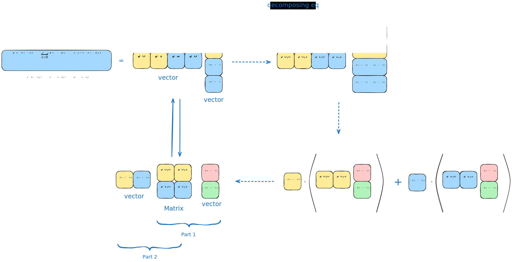
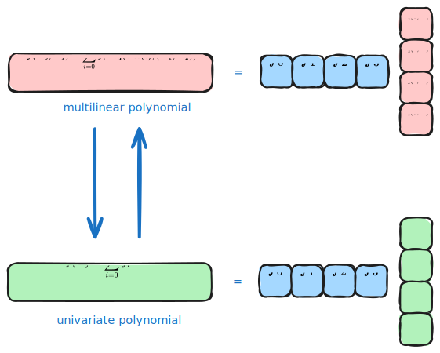
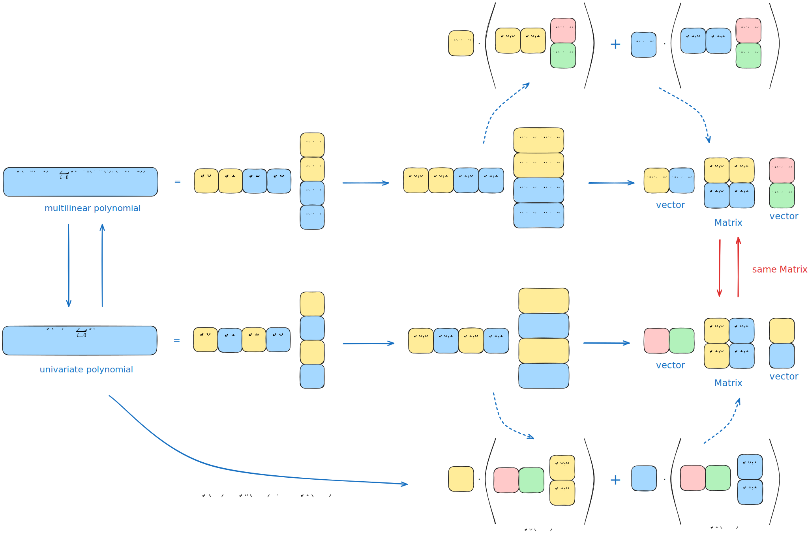
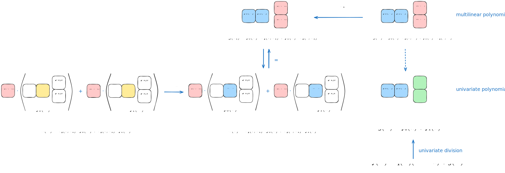

# Mercury Notes: Implementing Constant Proof Size

- Jade Xie <jade@secbit.io>
- Yu Guo <yu.guo@secbit.io>

Mercury [EG25] is a multivariate linear polynomial commitment scheme based on KZG10, where the Prover proves to the Verifier that a multivariate linear polynomial $\tilde{f}(X_0,X_1,\ldots,X_{n-1})$ evaluates to $v$ at a public point $\vec{u} = (u_0,u_1,\ldots,u_{n-1})$. Let $N = 2^n$, which represents the size of $\tilde{f}$. Compared to other KZG10-based schemes like ph23 [PH23], zeromorph [BCHO23], and gemini [KT23], Mercury achieves constant proof size while maintaining the Prover's linear $O(N)$ finite field operations, rather than the logarithmic $O(\log N)$ size of other approaches. A concurrent work, SamaritanPCS [GPS25], also achieves similar performance. These two protocols share similar ideas and both represent significant breakthroughs in pairing-based multivariate linear polynomial commitment schemes. This series of articles will explain in detail how Mercury achieves this.

Mercury's ability to achieve constant proof size stems from its insight into the relationship between univariate polynomial decomposition and multivariate linear polynomial evaluation. It can transform the evaluation of a univariate polynomial at a random point into the evaluation of a multivariate linear polynomial at a specific point, which can be converted into an inner product proof with constant proof size, while the univariate polynomial decomposition proof also requires only constant proof size.

Mercury's overall approach shares some similarities with the Hyrax [WTSTW16] protocol. It first arranges the $N$ values of $\tilde{f}$ on the boolean hypercube $\mathbf{B} = \{0,1\}^n$ into a $\sqrt{N} \times \sqrt{N}$ matrix, then "flattens" this matrix column by column. Let $b = \sqrt{N}, t = \log b$. This "flattening" operation is equivalent to first substituting the first half of values from $\vec{u}$ and summing, which means computing $\tilde{h}(X_t, \ldots, X_{n - 1}):=\tilde{f}(u_0, \ldots, u_{t - 1}, X_t, \ldots, X_{n - 1})$, and then computing $\tilde{h}(u_t, \ldots, u_{n - 1}) = \tilde{f}(u_0, \ldots, u_{t - 1}, u_t, \ldots, u_{n - 1})$ to prove it equals $v$. This two-part division has the advantage of reducing the computation scale from $N$ to $\sqrt{N}$. Some of the Prover's computation complexity was originally $N \log N$, but with the reduced scale, the complexity becomes at most $\sqrt{N} \log \sqrt{N} = O(N)$, which is an important reason why Mercury maintains the Prover's linear $O(N)$ complexity.

## Representation of Multivariate Linear Polynomials

A multivariate linear polynomial $\tilde{f}(X_0, X_1,\ldots, X_{n-1})$ can be represented by its values on the boolean hypercube $\mathbf{B}_n = \{0,1\}^n$:

$$
\tilde{f}(X_0,X_1,\ldots, X_{n-1}) = \sum_{i=0}^{2^n - 1} f_i \cdot \tilde{eq}(\mathsf{bits}(i),(X_0, X_1, \ldots, X_{n-1}))
$$
where $\mathsf{bits}(i) = (i_0, i_1, \ldots, i_{n-1})$ is the binary representation of $i$, with $i_0$ being the least significant bit, satisfying $i = \sum_{j = 0}^{n - 1}i_j \cdot 2^j$. $\tilde{eq}(\mathsf{bits}(i),(X_0, X_1, \ldots, X_{n-1}))$ can be thought of as a Lagrange interpolation function on $\mathbf{B} = \{0,1\}^n$, with the specific expression:

$$
\tilde{eq}(\mathsf{bits}(i),(X_0, X_1, \ldots, X_{n-1})) = \prod_{j = 0}^{n-1} ((1- i_j)(1- X_j) + i_j \cdot X_j)
$$

When $(X_0, X_1, \ldots, X_{n-1}) \in \mathbf{B}_n$, if $\mathsf{bits}(i) = (X_0, X_1, \ldots, X_{n-1})$, then each component of these two vectors is equal, so $(1- i_j)(1- X_j) + i_j \cdot X_j = 1$, and the result of the $\tilde{eq}$ function is $1$. When $\mathsf{bits}(i) \neq (X_0, X_1, \ldots, X_{n-1})$, the result of the $\tilde{eq}$ function is $0$.

Since the $\tilde{eq}$ function is actually a product of $n$ terms, and products have associative property, we can decompose the $\tilde{eq}$ function. Let $n = 2 \cdot t, b = 2^t = \sqrt{N}$. Divide the vector $\mathsf{bits}(i)$ into two equal parts, $\mathsf{bits}(i) = ((i_0,\ldots,i_{t-1}), (i_t,\ldots,i_{n-1}))$, and similarly divide $(X_0, X_1, \ldots, X_{n-1})$ into two parts, $(X_0, X_1, \ldots, X_{n-1}) = ((X_0, \ldots, X_{t-1}), (X_t, \ldots, X_{n-1})) := (\vec{X}_1, \vec{X}_2)$. Then:

$$
\begin{align}
\tilde{eq}(\mathsf{bits}(i),(X_0, X_1, \ldots, X_{n-1})) & = \prod_{j = 0}^{n-1} ((1- i_j)(1- X_j) + i_j \cdot X_j) \\
 & = \left(\prod_{j = 0}^{t-1} ((1- i_j)(1- X_j) + i_j \cdot X_j) \right)  \cdot \left(\prod_{j = t}^{n-1} ((1- i_j)(1- X_j) + i_j \cdot X_j) \right)  \\
 & = \tilde{eq}((i_0,\ldots,i_{t-1}),\vec{X}_1) \cdot \tilde{eq}((i_t,\ldots,i_{n-1}),\vec{X}_2)
\end{align}
$$

Because the $\tilde{eq}$ function has this decomposition property, we can more conveniently decompose the evaluation of $\tilde{f}$.

## Decomposition

Now we want to prove that the value of $\tilde{f}$ at point $\vec{u} = (u_0, u_1, \ldots, u_{n-1})$ is $v$, i.e., prove:

$$
\tilde{f}(u_0,u_1,\ldots, u_{n-1}) = \sum_{i=0}^{2^n - 1} f_i \cdot \tilde{eq}(\mathsf{bits}(i),(u_0, u_1, \ldots, u_{n-1})) = v \tag{1}
$$

This involves summing $N$ terms, which we'll divide into two calculation steps.

We split the variable $\vec{u} = (\vec{u}_1, \vec{u}_2)$ into two equal-length vectors, $\vec{u}_1 = (u_0,\ldots,u_{t-1}), \vec{u_2} = (u_t,\ldots,u_{n - 1})$. We also divide the values of $\tilde{f}$ on $\mathbf{B}_n$, $(f_0,f_1, \ldots, f_{2^n - 1})$, into $b$ groups, representing them with two subscripts:

$$
(f_0,f_1, \ldots, f_{2^n - 1}) = (f_{0,0}, f_{0,1}, \ldots, f_{0,b-1}, \ldots, f_{b-1,0}, \ldots, f_{b-1,b-1})
$$

Arranged in a matrix form:

$$
M_f = \begin{bmatrix}
 f_{0,0} &  f_{0,1}   & \cdots  & f_{0,b-1} \\
 f_{1,0} &  f_{1,1}   & \cdots  & f_{1,b-1} \\
 \vdots &  \vdots   & \  & \vdots  \\
f_{b-1,0} &  f_{b-1,1}   & \cdots  & f_{b-1,b-1}
\end{bmatrix}
$$

Based on the previously introduced decomposition of the $\tilde{eq}$ function, we get:

$$
\begin{align}
\tilde{f}(\vec{u}_1, \vec{u}_2)  & = \sum_{i=0}^{2^n - 1} f_i \cdot \tilde{eq}(\mathsf{bits}(i),(\vec{u}_1, \vec{u}_2)) \\
 & = \sum_{i=0}^{2^t - 1} \sum_{j=0}^{2^t - 1} f_{i,j} \cdot \tilde{eq}((\mathsf{bits}(j),\mathsf{bits}(i)),(\vec{u}_1, \vec{u}_2))\\
 & = \sum_{i=0}^{2^t - 1} \sum_{j=0}^{2^t - 1} f_{i,j} \cdot \tilde{eq}(\mathsf{bits}(j),\vec{u}_1) \cdot \tilde{eq}(\mathsf{bits}(i),\vec{u}_2)  \\
 & = \sum_{i=0}^{2^t - 1} \left(\tilde{eq}(\mathsf{bits}(i),\vec{u}_2)  \cdot\left(\sum_{j=0}^{2^t - 1} f_{i,j} \cdot \tilde{eq}(\mathsf{bits}(j),\vec{u}_1) \right) \right)
\end{align}
$$

This is more intuitive in matrix form:

$$
\begin{align}
& \tilde{f}(\vec{u}_1, \vec{u}_2)  \\
& =\begin{bmatrix}
\tilde{eq}(\mathsf{bits}(0), \vec{u}_2)  & \tilde{eq}(\mathsf{bits}(1), \vec{u}_2)  & \cdots  & \tilde{eq}(\mathsf{bits}(b-1), \vec{u}_2) 
\end{bmatrix}
\begin{bmatrix}
 f_{0,0} &  f_{0,1}   & \cdots  & f_{0,b-1} \\
 f_{1,0} &  f_{1,1}   & \cdots  & f_{1,b-1} \\
 \vdots &  \vdots   & \  & \vdots  \\
f_{b-1,0} &  f_{b-1,1}   & \cdots  & f_{b-1,b-1}
\end{bmatrix} 
\begin{bmatrix}
\tilde{eq}(\mathsf{bits}(0), \vec{u}_1)   \\
 \tilde{eq}(\mathsf{bits}(1), \vec{u}_1)   \\
\cdots   \\
\tilde{eq}(\mathsf{bits}(b-1), \vec{u}_1) 
\end{bmatrix} \\
& \stackrel{\triangle}{=}  \vec{v}_2^{\intercal} \cdot (M_f \cdot \vec{v}_1)
\end{align}
$$

For example, with $n = 2$, the decomposition process is shown in the following figure:

To prove $\tilde{f}(\vec{u}_1, \vec{u}_2) = v$, we can divide it into two parts:

1. Prove $M_f \cdot \vec{v}_1 = \vec{b}$, corresponding to first calculating a multivariate linear polynomial $\tilde{h}(\vec{X}_2) := \tilde{f}(\vec{u}_1, \vec{X}_2)$
2. Prove $\vec{v}_2^{\intercal} \cdot \vec{b} = v$, corresponding to calculating $\tilde{h}(\vec{u}_2) = \tilde{f}(\vec{u}_1, \vec{u_2})$ and proving its result is $v$.

So far, we have transformed the summation of $N$ terms in equation (1) into two calculation steps: first substituting $\vec{u}_1$ for partial summation, then substituting $\vec{u_2}$ to get the final result $v$. Next, we'll introduce the conversion of multivariate linear polynomials to univariate polynomials, and then use the KZG10 commitment scheme for univariate polynomials to conduct the proof.

## From Multivariate Linear Polynomials to Univariate Polynomials

For a multivariate linear polynomial:

$$
\tilde{f}(X_0,X_1,\ldots, X_{n-1}) = \sum_{i=0}^{2^n - 1} f_i \cdot \tilde{eq}(\mathsf{bits}(i),(X_0, X_1, \ldots, X_{n-1}))
$$
We directly use its values $f_i$ on the boolean hypercube $\mathbf{B}_n$ as the coefficients of a univariate polynomial, resulting in:

$$
f(X) = \sum_{i = 0}^{2^n - 1} f_i \cdot X^i
$$

For any multivariate linear polynomial, we convert it to a univariate polynomial in this way, by directly using the values of the multivariate linear polynomial on the boolean hypercube as the coefficients of the univariate polynomial.

Using $n = 2$ as an example, the conversion from multivariate linear polynomial to univariate polynomial can be understood as simply changing the basis. The basis for the multivariate linear polynomial is the Lagrange basis, $(\tilde{eq}(\mathsf{bits}(0), \vec{X}), \tilde{eq}(\mathsf{bits}(1), \vec{X}), \tilde{eq}(\mathsf{bits}(2), \vec{X}), \tilde{eq}(\mathsf{bits}(3), \vec{X}))$, while the basis for the univariate polynomial is $(1, X, X^2, X^3)$.

For the previously mentioned $\tilde{h}(\vec{X}_2) = \tilde{f}(\vec{u}_1, \vec{X}_2)$, expressed in matrix form:

$$
\begin{align}
& \tilde{h}(\vec{X}_2) = \tilde{f}(\vec{u}_1, \vec{X}_2)  \\
& =\begin{bmatrix}
\tilde{eq}(\mathsf{bits}(0), \vec{X}_2)  & \tilde{eq}(\mathsf{bits}(1), \vec{X}_2)  & \cdots  & \tilde{eq}(\mathsf{bits}(b-1), \vec{X}_2) 
\end{bmatrix}
\begin{bmatrix}
 f_{0,0} &  f_{0,1}   & \cdots  & f_{0,b-1} \\
 f_{1,0} &  f_{1,1}   & \cdots  & f_{1,b-1} \\
 \vdots &  \vdots   & \  & \vdots  \\
f_{b-1,0} &  f_{b-1,1}   & \cdots  & f_{b-1,b-1}
\end{bmatrix} 
\begin{bmatrix}
\tilde{eq}(\mathsf{bits}(0), \vec{u}_1)   \\
 \tilde{eq}(\mathsf{bits}(1), \vec{u}_1)   \\
\cdots   \\
\tilde{eq}(\mathsf{bits}(b-1), \vec{u}_1) 
\end{bmatrix} \\
& = \begin{bmatrix}
\tilde{eq}(\mathsf{bits}(0), \vec{X}_2)  & \tilde{eq}(\mathsf{bits}(1), \vec{X}_2)  & \cdots  & \tilde{eq}(\mathsf{bits}(b-1), \vec{X}_2) 
\end{bmatrix}
\begin{bmatrix}
 f_{0,0} \cdot \tilde{eq}(\mathsf{bits}(0), \vec{u}_1) + f_{0,1} \cdot \tilde{eq}(\mathsf{bits}(1), \vec{u}_1) + \ldots +  f_{0,b-1} \cdot \tilde{eq}(\mathsf{bits}(b-1), \vec{u}_1)\\
 f_{1,0} \cdot \tilde{eq}(\mathsf{bits}(0), \vec{u}_1) + f_{1,1} \cdot \tilde{eq}(\mathsf{bits}(1), \vec{u}_1) + \ldots +  f_{1,b-1} \cdot \tilde{eq}(\mathsf{bits}(b-1), \vec{u}_1) \\
 \vdots   \\
f_{b-1,0} \cdot \tilde{eq}(\mathsf{bits}(0), \vec{u}_1) + f_{b-1,1} \cdot \tilde{eq}(\mathsf{bits}(1), \vec{u}_1) + \ldots +  f_{b-1,b-1} \cdot \tilde{eq}(\mathsf{bits}(b-1), \vec{u}_1)
\end{bmatrix}  
\end{align}
$$

We can see that each item in the right column vector is actually the value of $\tilde{h}(\vec{X}_2)$ on the boolean hypercube $\mathbf{B}_t = \{0,1\}^t$, corresponding to the univariate polynomial $h(X)$. The $i$-th row of the right column vector is the coefficient before the $X^i$ term in $h(X)$.

$$
h(X) = \sum_{i = 0}^{b - 1} \left(\left( \sum_{j = 0}^{b - 1} f_{i,j} \cdot \tilde{eq}(\mathsf{bits}(j), \vec{u}_1)\right) \cdot X^i \right)
$$
We can see that the coefficient of each term in $h(X)$, $\sum_{j = 0}^{b - 1} f_{i,j} \cdot \tilde{eq}(\mathsf{bits}(j), \vec{u}_1)$, is also in the form of a number multiplied by $\tilde{eq}$. We can also use $f_{i,j}$ as coefficients of univariate polynomials, with each column of the $M_f$ matrix serving as coefficients for a univariate polynomial:

$$
\begin{align}
 & f_0(X) = f_{0,0} + f_{1,0}  X + \ldots + f_{b-1, 0} X^{b-1} \\
 & f_1(X) = f_{0,1} + f_{1,1}  X + \ldots + f_{b-1, 1} X^{b-1} \\
 & \qquad \qquad \qquad \qquad \ldots \\
 & f_{b-1}(X) = f_{0,b-1} + f_{1,b-1}  X + \ldots + f_{b-1, b-1} X^{b-1}
\end{align}
$$

The advantage of using each column of $M_f$ as coefficients for univariate polynomials is that elements in the $i$-th row of the $M_f$ matrix correspond exactly to the coefficients of $X^i$. For example, for the first row of matrix $M_f$, its elements $(f_{1,0}, f_{1,1}, \ldots, f_{1,b-1})$ are the coefficients of $X^1$ in $f_0(X), f_1(X), \ldots, f_{b-1}(X)$ respectively.

$f_i(X)$ can also be seen as a decomposition of $f(X)$:

$$
\begin{align}
f(X)  & = \sum_{i = 0}^{2^n - 1} f_i \cdot X^i = \sum_{i = 0}^{b - 1} \sum_{j = 0}^{b - 1} f_{i,j} \cdot X^{i \cdot b + j} \\
 & = \sum_{i = 0}^{b - 1} \sum_{j = 0}^{b - 1} f_{i,j} \cdot (X^{b})^i \cdot X^{j}  \\
& = \sum_{j = 0}^{b - 1} \sum_{i = 0}^{b - 1} f_{i,j} \cdot (X^{b})^i \cdot X^{j} \\
& = \sum_{j = 0}^{b - 1} f_j(X^b) \cdot X^j \\
& = \sum_{i = 0}^{b - 1} f_i(X^b) \cdot X^i
\end{align}
$$
That is, $f(X)$ is decomposed into the sum of $b$ polynomials:

$$
f(X) = f_0(X^b) + X \cdot f_1(X^b) + \ldots + X^{b-1} \cdot f_{b-1}(X^b) \tag{2}
$$

This decomposition of the univariate polynomial is consistent with the decomposition of the multivariate polynomial evaluation $\tilde{f}(\vec{u}_1,\vec{u}_2)$ discussed in the previous section. The multivariate linear polynomial utilizes the decomposability of the $\tilde{eq}$ function, while $X^i$ in the univariate polynomial can also be decomposed. Using $n = 2$ as an example, comparing the two:

Now $h(X)$ can be expressed as:

$$
\begin{align}
h(X)  & = \sum_{i = 0}^{b - 1} \left(\left( \sum_{j = 0}^{b - 1} f_{i,j} \cdot \tilde{eq}(\mathsf{bits}(j), \vec{u}_1)\right) \cdot X^i \right) \\
 & = \sum_{j = 0}^{b - 1} \left(\left( \sum_{i = 0}^{b - 1} f_{i,j} \cdot X^i \right) \cdot \tilde{eq}(\mathsf{bits}(j), \vec{u}_1) \right) \\
 & = \sum_{j = 0}^{b - 1} \tilde{eq}(\mathsf{bits}(j), \vec{u}_1) \cdot f_j(X) \\
& = \sum_{i = 0}^{b - 1} \tilde{eq}(\mathsf{bits}(i), \vec{u}_1) \cdot f_i(X)
\end{align}
$$

Using $n = 2$ as an example, the following figure shows the decomposition process of $h(X)$:

So $h(X)= \sum_{i = 0}^{b - 1} \tilde{eq}(\mathsf{bits}(i), \vec{u}_1) \cdot f_i(X)$ corresponds to the multivariate linear polynomial $\tilde{h}(\vec{X}) = \tilde{f}(\vec{u}_1, \vec{X})$. This is equivalent to replacing the first $t$ variables in $\tilde{f}$ at once. We can commit to the univariate polynomial $\mathsf{cm}(h(X))$ corresponding to $\tilde{f}(\vec{u}_1, \vec{X})$, and then prove $\tilde{h}(\vec{u}_2) = v$ to complete the proof. This corresponds to the two parts of the proof discussed in the previous section:

1. Prove $M_f \cdot \vec{v}_1 = \vec{b}$, corresponding to first calculating a multivariate linear polynomial $\tilde{h}(\vec{X}_2) := \tilde{f}(\vec{u}_1, \vec{X}_2)$
2. Prove $\vec{v}_2^{\intercal} \cdot \vec{b} = v$, corresponding to calculating $\tilde{h}(\vec{u}_2) = \tilde{f}(\vec{u}_1, \vec{u_2})$ and proving its result is $v$.

Part 2 is actually proving the inner product of two vectors, which can be transformed into an inner product proof.

Is this proof complete? How do we achieve constant-sized proof? There's a key aspect that needs to be proven: the Verifier must believe that the construction of $h(X)$ is correct, that is:

$$
h(X)= \sum_{i = 0}^{b - 1} \tilde{eq}(\mathsf{bits}(i), \vec{u}_1) \cdot f_i(X) \tag{3}
$$

The Prover needs to prove to the Verifier that $h(X)$ is indeed constructed this way, not just arbitrarily sent. To prove equation (3) is correctly constructed, the Verifier can randomly issue a challenge value $r$, and the Prover must prove:

$$
h(r^b)= \sum_{i = 0}^{b - 1} \tilde{eq}(\mathsf{bits}(i), \vec{u}_1) \cdot f_i(r^b) \tag{4}
$$

$f_i(r^b)$ is related to the values of $f$. According to the decomposition formula (2) of $f(X)$:

$$
f(X) = f_0(X^b) + X \cdot f_1(X^b) + \ldots + X^{b-1} \cdot f_{b-1}(X^b) ,
$$

Let $\omega^b = 1$, then:

$$
\begin{align}
 & f(r) = f_0(r^b) + r \cdot f_1(r^b) + \ldots + r^{b-1} \cdot f_{b-1}(r^b) \\
 & f(\omega r) = f_0(r^b) + \omega r \cdot f_1(r^b) + \ldots + (\omega r)^{b-1} \cdot f_{b-1}(r^b)  \\
 & \ldots \\
 & f(\omega^{b-1} r) = f_0(r^b) + \omega^{b-1} r \cdot f_1(r^b) + \ldots + (\omega^{b-1} r)^{b-1} \cdot f_{b-1}(r^b)
\end{align}
$$

This is equivalent to a linear system of equations with $b$ unknowns $f_i(r^b)$ and $b$ equations. By solving this system, we can calculate the values of $f_i(r^b)$ from $\{f(r), f(\omega r), \ldots, f(\omega^{b - 1} r) \}$. The Prover could send $h(r^b)$ and $\{f(r), f(\omega r), \ldots, f(\omega^{b - 1} r) \}$ along with corresponding opening proofs, letting the Verifier calculate the values of $f_i(r^b)$ themselves to verify if equation (4) holds. The problem with this approach is that the proof size would be $O(b)$, not constant.

Is there a method that can achieve both constant proof size and prove the correctness of equation (4)? Mercury cleverly transforms the proof of evaluating a univariate polynomial $h(r^b)$ in equation (4) into a proof of evaluating a multivariate linear polynomial at a point.

## Achieving Constant Proof Size

The Prover's goal is to prove with constant proof size:

$$
h(r^b)= \sum_{i = 0}^{b - 1} \tilde{eq}(\mathsf{bits}(i), \vec{u}_1) \cdot f_i(r^b) \tag{4}
$$
Let's set $\alpha = r^b$.

Define $g(X) = f(X) \mod{X^b - \alpha}$, with the quotient polynomial $q(X)$, then:

$$
f(X) = q(X) \cdot (X^b - \alpha) + g(X) \tag{5}
$$
Substituting the condition $X^b = \alpha$ into this equation, we get:

$$
g(X) = f(X) = \sum_{i = 0}^{b - 1} f_i(X^b) \cdot X^i = \sum_{i = 0}^{b - 1} f_i(\alpha) \cdot X^i
$$

We can see that the coefficients of $g(X)$ are $f_i(\alpha)$, and the corresponding multivariate linear polynomial would be:

$$
\tilde{g}(X_0, \ldots , X_{b-1}) = \sum_{i = 0}^{b - 1} f_i(\alpha) \cdot \tilde{eq}(\mathsf{bits}(i), (X_0, \ldots , X_{b-1}))
$$

So equation (4) is transformed into:

$$
h(\alpha)= \sum_{i = 0}^{b - 1} \tilde{eq}(\mathsf{bits}(i), \vec{u}_1) \cdot f_i(\alpha) = \tilde{g}(\vec{u}_1) 
$$
To prove equation (4) is correct now means proving:

$$
h(\alpha) = \tilde{g}(\vec{u}_1) \tag{6}
$$

Using $n = 2$ as an example, the proof transformation process is shown in the following figure:

This transforms the evaluation of a univariate polynomial $h(\alpha)$ into the evaluation of a multivariate linear polynomial at a point $\tilde{g}(\vec{u}_1)$. Now we need to prove that the construction of $g(X)$ corresponding to $\tilde{g}$ is correct, i.e., that equation (5) holds. The Prover can commit to $q(X)$ and $g(X)$, and the Verifier can select a random point $\zeta$ to verify that equation (5) holds. This only requires constant proof size, which is the core of how the Mercury protocol achieves constant proof size.

Additionally, to prevent the Prover from cheating, we need to restrict $\deg(g) < b$.

Thus, the two proofs mentioned in the previous section:

1. Prove $M_f \cdot \vec{v}_1 = \vec{b}$, corresponding to first calculating a multivariate linear polynomial $\tilde{h}(\vec{X}_2) := \tilde{f}(\vec{u}_1, \vec{X}_2)$
2. Prove $\vec{v}_2^{\intercal} \cdot \vec{b} = v$, corresponding to calculating $\tilde{h}(\vec{u}_2) = \tilde{f}(\vec{u}_1, \vec{u_2})$ and proving its result is $v$.

Are transformed into four proofs:

1. $f(X) = q(X) \cdot (X^b - \alpha) + g(X)$
2. $\deg(g) < b$
3. $\tilde{g}(\vec{u}_1) = h(\alpha)$
4. $\tilde{h}(\vec{u}_2) = v$

For the first proof, the Prover can first send commitments to $q(X)$ and $g(X)$, then the Verifier sends a random point $\zeta$, asking the Prover to open at that point by sending $q(\zeta)$ and $g(\zeta)$. The Prover just needs to prove that the quotient polynomial 

$$
\frac{f(X) - q(\zeta) \cdot (\zeta^b - \alpha) + g(\zeta)}{X - \zeta}
$$
exists, which proves that the equation in item 1 holds. This proof requires only constant proof size.

For the second item, it's a degree bound proof, which can also be implemented with constant proof size.

For the third and fourth items, both involve proving the evaluation of multivariate linear polynomials with $b$ variables at certain points, which can be transformed into inner product proofs. For example, for the multivariate linear polynomial $\tilde{g}$:

$$
\begin{align}
\tilde{g}(\vec{u}_1)  & = \sum_{i = 0}^{b - 1} \tilde{eq}(\mathsf{bits}(i), \vec{u}_1) \cdot f_i(\alpha)  \\
\end{align}
$$

This is actually calculating the inner product of vectors $\vec{a}_1 = (\tilde{eq}(\mathsf{bits}(0),\vec{u}_1),\ldots, \tilde{eq}(\mathsf{bits}(b-1), \vec{u}_1)$ and $\vec{b}_1 = (f_0(\alpha),\ldots, f_{b-1}(\alpha))$. A similar approach applies to $\tilde{h}(\vec{u}_2)$. Thus, the third and fourth items can be transformed into two inner product proofs, which can be aggregated into one proof using random numbers, also achieving constant proof size.

Therefore, all four parts of Mercury's proof have constant proof size. Since the length of the multivariate linear polynomials in the third and fourth items is $b$, even if some calculations require $O(b \log b)$ complexity for the Prover, this is still within $O(N)$ complexity, maintaining the Prover's linear computational complexity.

This article has explained how Mercury achieves constant proof size while maintaining the Prover's linear complexity. In the next article, we will detail how Mercury proves these four items.

## References
- [EG25] Eagen, Liam, and Ariel Gabizon. "MERCURY: A multilinear Polynomial Commitment Scheme with constant proof size and no prover FFTs." Cryptology ePrint Archive (2025). https://eprint.iacr.org/2025/385
- [GPS25] Ganesh, Chaya, Sikhar Patranabis, and Nitin Singh. "Samaritan: Linear-time Prover SNARK from New Multilinear Polynomial Commitments." _Cryptology ePrint Archive_ (2025). https://eprint.iacr.org/2025/419
- [PH23] Papini, Shahar, and Ulrich Haböck. "Improving logarithmic derivative lookups using GKR." Cryptology ePrint Archive (2023). https://eprint.iacr.org/2023/1284
- [BCHO23] Bootle, Jonathan, Alessandro Chiesa, Yuncong Hu, and Michele Orru. "Gemini: Elastic SNARKs for diverse environments." In _Annual International Conference on the Theory and Applications of Cryptographic Techniques_, pp. 427-457. Cham: Springer International Publishing, 2022. [https://eprint.iacr.org/2022/420](https://eprint.iacr.org/2022/420)
- [KT23] Kohrita, Tohru, and Patrick Towa. "Zeromorph: Zero-knowledge multilinear-evaluation proofs from homomorphic univariate commitments." Cryptology ePrint Archive (2023). https://eprint.iacr.org/2023/917 
- [WTSTW16] Riad S. Wahby, Ioanna Tzialla, abhi shelat, Justin Thaler, and Michael Walfish. "Doubly-efficient zkSNARKs without trusted setup."  In 2018 IEEE Symposium on Security and Privacy (SP), pp. 926-943. IEEE, 2018.  https://eprint.iacr.org/2016/263