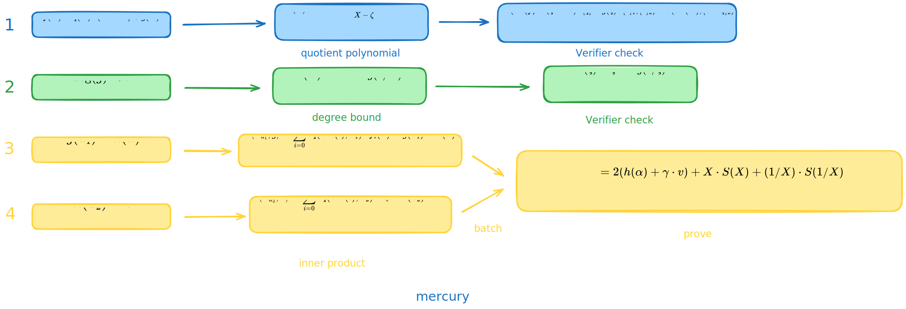
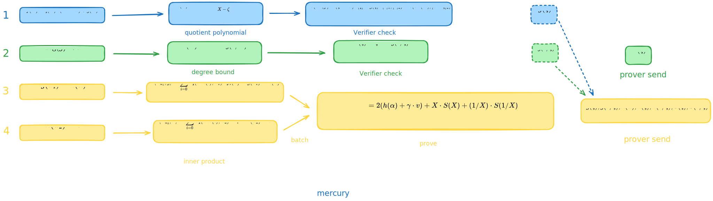

# Mercury Notes: Integration with KZG

- Jade Xie  <jade@secbit.io>
- Yu Guo <yu.guo@secbit.io>

In the previous article, we introduced the fundamental reason why the Mercury protocol can achieve constant proof size while maintaining the Prover's linear complexity. We also explained that proving the value of a multivariate linear polynomial $\tilde{f}$ at a point $(\vec{u}_1, \vec{u}_2)$ is $v$ can be converted into the following four proofs:

This article will detail these four proofs performed by Mercury and provide the complete protocol description for Mercury's integration with the univariate polynomial commitment scheme KZG.

## Inner Product Proof

First, let's look at proving the third item $\tilde{g}(\vec{u}_1) = h(\alpha)$ and the fourth item $\tilde{h}(\vec{u}_2) = v$, which essentially requires proving two inner products.

$$
\begin{align}
\tilde{g}(\vec{u}_1)  & = \sum_{i = 0}^{b - 1} \tilde{eq}(\mathsf{bits}(i), \vec{u}_1) \cdot f_i(\alpha)  \\
\end{align}
$$
Let $\vec{a}_1 = (\tilde{eq}(\mathsf{bits}(0),\vec{u}_1),\ldots, \tilde{eq}(\mathsf{bits}(b-1), \vec{u}_1))$ and $\vec{b}_1 = (f_0(\alpha),\ldots, f_{b-1}(\alpha))$, then we need to prove $\tilde{g}_1(\vec{u_1}) = \langle \vec{a}_1, \vec{b}_1\rangle$, which is the inner product of two vectors.

$$
\tilde{h}(\vec{u}_2) = \sum_{i = 0}^{b - 1} \tilde{eq}(\mathsf{bits}(i), \vec{u}_2) \cdot h_i
$$
Where $h_i$ represents the coefficients of $h(X)$, satisfying $h(X) = \sum_{i = 0}^{b-1} h_i \cdot X^i$. Let $\vec{a}_2 = (\tilde{eq}(\mathsf{bits}(0),\vec{u}_2),\ldots, \tilde{eq}(\mathsf{bits}(b-1), \vec{u}_2))$ and $\vec{b}_2 = (h_0,\ldots, h_{b-1})$, then we need to prove $\tilde{h}(\vec{u_2}) = \langle \vec{a}_2, \vec{b}_2\rangle$, which is the inner product of two vectors.

We can observe that in both inner products, the components of the first vector $\vec{a}_i$ are all in the form of $\tilde{eq}(\mathsf{bits}(j),\vec{u}_i)$, and the second vector $\vec{b}_i$ consists of coefficients of a univariate polynomial: $\vec{b}_1$ contains the coefficients of $g(X)$, and $\vec{b}_2$ contains the coefficients of $h(X)$. Similarly, we can represent the components of vector $\vec{a}_i$ as coefficients of a univariate polynomial by defining:

$$
P_{u_1}(X) = \sum_{i = 0}^{b-1} \tilde{eq}(\mathsf{bits}(i),\vec{u}_1) \cdot X^i
$$
$$
P_{u_2}(X) = \sum_{i = 0}^{b-1} \tilde{eq}(\mathsf{bits}(i),\vec{u}_2) \cdot X^i
$$
We define the inner product of two univariate polynomials as the inner product of their coefficient vectors. For simplicity, we'll only consider cases where both polynomials have the same degree. Then the two inner products we need to prove can be transformed into:

$$
\langle P_{u_1}, g\rangle = \sum_{i = 0}^{b - 1} \tilde{eq}(\mathsf{bits}(i), \vec{u}_1) \cdot f_i(\alpha) = \tilde{g}(\vec{u}_1) = h(\alpha) \tag{1}
$$
$$
\langle P_{u_2}, h\rangle = \sum_{i = 0}^{b - 1} \tilde{eq}(\mathsf{bits}(i), \vec{u}_2) \cdot h_i = \tilde{h}(\vec{u}_2) = v\tag{2}
$$

Let's first introduce how to prove the inner product of two polynomials of the same degree in the general case, then discuss how to apply this method to proving equations (1) and (2).

Generally, for two polynomials of degree less than $n$:

$$
a(X) = \sum_{i = 0}^{n - 1} a_i \cdot X^i
$$

$$
b(X) = \sum_{i = 0}^{n - 1} b_i \cdot X^i
$$

We want to prove that their inner product is:

$$
\langle a, b \rangle = \sum_{i = 0}^{n - 1} a_i \cdot b_i = c
$$

Inner product proofs can use various methods, such as univariate sumcheck or grand sum methods. Here, we'll introduce the method provided in the Mercury paper.

From the expressions of $a(X)$ and $b(X)$, we can observe:

$$
\begin{aligned}
a(X) b(1/X) & = (a_0 + a_1 X + \ldots + a_{n - 1} X^{n - 1})(b_0 + b_1 X^{-1} + \ldots + b_{n-1} X^{-(n - 1)}) \\
& = {\color{blue}{a_0b_0}} + {\color{orange}a_0\cdot (b_1 X^{-1} + \ldots + b_{n-1} X^{-( n - 1)})} \\
& \quad + {\color{red}a_1 b_0 \cdot X} + {\color{blue}a_1 b_1} + {\color{orange}a_1 (b_2 X^{-1} + \ldots + b_{n - 1}X^{-(n - 1) + 1})} \\
& \quad + {\color{red} a_2b_0 \cdot X^2 + a_2 b_1 X} + {\color{blue} a_2b_2} + {\color{orange} a_2 \cdot (b_3 X^{-1} + \ldots + b_{n - 1} X^{-(n - 1) + 2})} \\
& \quad + \ldots \\
& = {\color{red} X \cdot S_1(X)}  + {\color{blue} a_0b_0 + a_1 b_1 + \ldots + a_{n-1}b_{n-1}} + {\color{orange} 1/X \cdot S_2(1/X)}
\end{aligned}
$$
The constant term of $a(X)b(1/X)$ is exactly the inner product $\langle a, b \rangle$. Therefore, proving $\langle a, b \rangle = c$ is equivalent to proving there exist $S_1(X)$ and $S_2(X)$ satisfying:

$$
a(X) b(1/X) = X \cdot S_1(X) + c + 1/X \cdot S_2(1/X) \tag{3}
$$

In this case, the Prover sends commitments to $S_1(X)$ and $S_2(X)$. The Verifier selects a random value $\zeta$ and asks the Prover to open $a(\zeta), b(1/\zeta), S_1(\zeta), S_2(1/\zeta)$ and send the corresponding opening proofs. The Verifier can then use these values to verify if equation (3) holds, thereby completing the inner product proof with a constant-sized proof.

The construction in equation (3) requires sending commitments to two polynomials, $S_1(X)$ and $S_2(X)$. However, we can observe that the constant term of $a(1/X)b(X)$ is also the inner product $\langle a, b \rangle$, which is symmetric to $a(X)b(1/X)$. By substituting $X$ with $1/X$ in equation (3), we get:

$$
a(1/X)b(X) = 1/X \cdot S_1(1/X) + c + X \cdot S_2(X) \tag{4}
$$

Adding equations (3) and (4), we obtain:

$$
a(X) b(1/X) + a(1/X)b(X) = X \cdot (S_1(X) + S_2(X)) + 2c + 1/X \cdot (S_1(1/X) + S_2(1/X)) 
$$
Let $S(X) := S_1(X) + S_2(X)$, then:

$$
a(X) b(1/X) + a(1/X)b(X) = X \cdot S(X) + 2c + 1/X \cdot S(1/X) \tag{5}
$$

Proving the inner product $\langle a, b \rangle = c$ is now equivalent to proving there exists a polynomial $S(X)$ satisfying equation (5). This optimization reduces the construction from committing to two polynomials $S_1(X)$ and $S_2(X)$ to just one polynomial $S(X)$, thus decreasing the proof size.

If we have another inner product proof $\langle a', b' \rangle = c'$ where $a'(X) = \sum_{i = 0}^{n-1} a'_i \cdot X^i$ and $b'(X) = \sum_{i = 0}^{n-1} b'_i \cdot X^i$, we can aggregate these two inner product proofs into one. The Verifier can select a random number $\gamma \stackrel{\$}{\leftarrow} \mathbb{F}$, and the Prover proves there exists a polynomial $S(X)$ satisfying:

$$
a(X) b(1/X) + a(1/X)b(X) + \gamma \cdot (a'(X) b'(1/X) + a'(1/X)b'(X)) = X \cdot S(X) + 2(c + \gamma \cdot c') + 1/X \cdot S(1/X) 
$$

Returning to the Mercury protocol, the two inner products we want to prove are:

$$
\langle P_{u_1}, g\rangle = \sum_{i = 0}^{b - 1} \tilde{eq}(\mathsf{bits}(i), \vec{u}_1) \cdot f_i(\alpha) = \tilde{g}(\vec{u}_1) = h(\alpha) \tag{6}
$$
$$
\langle P_{u_2}, h\rangle = \sum_{i = 0}^{b - 1} \tilde{eq}(\mathsf{bits}(i), \vec{u}_2) \cdot h_i = \tilde{h}(\vec{u}_2) = v \tag{7}
$$
Using the inner product proof method described above, the Verifier sends a random number $\gamma$, and these two inner product proofs can be batched into one. The Prover proves there exists a polynomial $S(X)$ satisfying:

$$
\begin{aligned}
g(X) P_{u_1}(1/X) & + g(1/X) P_{u_1}(X) + \gamma \cdot (h(X) P_{u_2}(1/X) + h(1/X) P_{u_2}(X)) \\
& = 2(h(\alpha) + \gamma \cdot v) + X \cdot S(X) + (1/X) \cdot S(1/X)  
\end{aligned} \tag{8}
$$

The Prover first commits to $g(X), h(X), S(X)$. The Verifier randomly selects an opening point $\zeta$. The Prover sends the values $g(\zeta), g(1/\zeta), h(\zeta), h(1/\zeta), S(\zeta), S(1/\zeta)$ and corresponding opening proofs. Since $\vec{u}_1$ and $\vec{u}_2$ are public, the Verifier can calculate $P_{u_1}(X)$ and $P_{u_2}(X)$ themselves and compute $P_{u_1}(\zeta), P_{u_1}(1/\zeta)$, and $P_{u_2}(\zeta), P_{u_2}(1/\zeta)$ to verify equation (3)'s correctness.

We now understand that proofs for items 3 and 4 can be transformed into two inner product proofs, which can be batched together using equation (3) for a constant-sized proof.

## Correct Decomposition

For the proof of the first item:

1. $f(X) = q(X) \cdot (X^b - \alpha) + g(X)$ 

This can be directly interfaced with the univariate polynomial KZG commitment scheme. Since the Prover has already sent the value $g(\zeta)$ when proving items 3 and 4, we can verify the correctness of the first item at the same random point. The Prover constructs a quotient polynomial:

$$
H(X) = \frac{f(X) - (\zeta^b - \alpha)q(X) - g(\zeta)}{X - \zeta}
$$

The Prover commits to this quotient polynomial $[H] = \mathsf{cm}(H)$ and sends it to the Verifier. Since $f(\zeta) = (\zeta^b - \alpha) \cdot q(\zeta) - g(\zeta)$, this quotient polynomial exists. Conversely, the existence of this quotient polynomial confirms that the first item's construction is correct. After receiving $\mathsf{cm}(H)$, the Verifier can verify using pairing:

$$
e(\mathsf{cm}(f) - (\zeta^b - \alpha) \cdot [q] - g(\zeta) \cdot [1]_1 , [1]_2) \stackrel{?}{=} e(\mathsf{cm}(H), [x - \zeta]_2)
$$

In summary, to prove the correctness of the first item, the Prover needs to prove the existence of a quotient polynomial $H(X)$, and the Verifier verifies the correctness of this quotient polynomial at a random point.

## Degree Bound

For the proof of the second item:

2. $\deg(g) < b$

We can also use the $g(1/X)$ function. To prove $\deg(g(X)) < b$, it's equivalent to proving that:

$$
D(X) = X^{b - 1} \cdot g(1/X) \tag{9}
$$

is a polynomial. Assuming $\deg(g) = d$:

$$
\begin{aligned}
D(X) & = X^{b-1} \cdot g(1/X) \\
& = X^{b - 1}(g_0  + g_1 \cdot X^{-1} + \ldots + g_{d} \cdot X^{-d}) \\
& = g_{d} \cdot X^{b - d - 1} + \ldots + g_1 \cdot X^{b - 2} + g_0 \cdot X^{b - 1}
\end{aligned}
$$

We can see that only when $d < b$ is the degree of the first term $g_d \cdot X^{b-d-1}$ non-negative ($b-d-1 \geq 0$). Otherwise, this term would have a negative degree, which can't form a polynomial. Assuming the random number selected in the KZG Setup phase is $\tau$, the SRS is:

$$
\{[1], [\tau], \ldots, [\tau^{N-1}], [1]_2, [\tau]_2\}
$$

It doesn't include negative powers of $\tau$. So only when $D(X)$ is a polynomial can it be correctly committed, indicating that the degree of $g(X)$ is less than $b$. The Prover first commits to polynomial $D(X)$ and sends $\mathsf{cm}(D(X)) = [D]$. To verify equation (9)'s correctness, the Verifier needs to select a random point to open values of $D(X)$ and $g(1/X)$ at that point. To reduce the proof size, since the value of $g(1/\zeta)$ was already sent during the inner product proof, we can choose to open at point $\zeta$ for the degree bound proof as well. The Prover sends the value of $D(\zeta)$ and its opening proof, and the Verifier verifies:

$$
D(\zeta) \stackrel{?}{=} \zeta^{b-1} \cdot g(1/\zeta)
$$

The proof for the second item is shown in the following diagram:

Now we understand how to prove all four items mentioned earlier.

## Aggregating Multiple Polynomials Opening Proofs at Multiple Points

The four items to be proven are:

1. $f(X) = q(X) \cdot (X^b - \alpha) + g(X)$ 
2. $\deg(g) < b$
3. $\tilde{g}(\vec{u}_1) = h(\alpha)$
4. $\tilde{h}(\vec{u}_2) = v$

Let's review the values of polynomials that the Prover sends during the process of proving these four items:

The values sent by the Prover are:

$$
g(\zeta), g(1/\zeta), h(\alpha), h(\zeta), h(1/\zeta), S(\zeta), S(1/\zeta), D(\zeta)
$$

The Prover needs to use KZG10 to prove that these values are correct. For a value like $g(\zeta)$, the Prover can construct a quotient polynomial:

$$
q_{g_\zeta} = \frac{g(X) - g(\zeta)}{X - \zeta}
$$

The Prover first commits to this quotient polynomial $\mathsf{cm}(q_{g_\zeta})$, and the Verifier can verify using a pairing operation on the elliptic curve:

$$
e(\mathsf{cm}(g) - g(\zeta) \cdot [1]_1 , [1]_2) \stackrel{?}{=} e(\mathsf{cm}(q_{g_\zeta}), [\tau - \zeta]_2)
$$

However, we have 8 values to prove here. If each value is proven as above, it would increase the proof size and the Verifier's computational load. We observe that there are 4 different polynomials involved, and the opening points for each polynomial are not entirely consistent, making it inappropriate to use schemes for opening multiple polynomials at the same point. Section 4 of [BDFG20] provides a scheme that can prove openings of different polynomials at different points, with a proof size of just 2 points on the elliptic curve $\mathbb{G}_1$. The Verifier only needs to compute two pairing operations on the elliptic curve. Let's introduce this scheme.

Let sets $S_1, S_2, S_3, S_4$ represent the sets of points where polynomials $g(X), h(X), S(X), D(X)$ need to be opened:

$$
\begin{align}
S_1 = \{\zeta, 1/\zeta\},  & \qquad S_2 = \{\alpha, \zeta, 1/\zeta\} \\
S_3 = \{\zeta, 1/\zeta\},  & \qquad S_4 = \{\zeta\}
\end{align}
$$

Construct a set $T$ that can include all elements in $S_i$:

$$
T = \{\zeta, 1/\zeta, \alpha\}
$$

So $S_i \subset T \subset \mathbb{F}$.

Taking set $S_1$ and polynomial $g(X)$ as an example, the vanishing polynomials on sets $S_1, T, T \setminus S_1$ are:

$$
\begin{align}
 & Z_{S_1}(X) = (X - \zeta)(X - 1/\zeta) \\
 & Z_{T}(X) = (X - \zeta)(X - 1 /\zeta)(X -\alpha) \\
 & Z_{T \setminus S_{1}}(X) = X - \alpha 
\end{align}
$$

Let $g^*(X)$ be the interpolation polynomial of $(g(\zeta), g(1/\zeta))$ on $(\zeta, 1/\zeta)$, satisfying $\deg(g^*) = 1$ and:

$$
g^*(\zeta) = g(\zeta), \qquad g^*(1/\zeta) = g(1/\zeta)
$$

Then we can find that the vanishing polynomial $Z_{S_1}(X)$ divides the polynomial $g(X) - g^*(X)$, i.e., there exists a quotient polynomial:

$$
q_g(X) = \frac{g(X) - g^*(X)}{Z_{S_1}(X)}
$$

Since:

$$
Z_{S_1}(X) = \frac{Z_T(X)}{Z_{T \setminus S_1}(X)}
$$

Then:

$$
q_g(X) = \frac{Z_{T \setminus S_1}(X)(g(X) - g^*(X))}{Z_T(X)}
$$

This means that $Z_{S_1}(X)$ dividing polynomial $g(X) - g^*(X)$ is equivalent to $Z_T(X)$ dividing polynomial $Z_{T \setminus S_1}(X)(g(X) - g^*(X))$. The benefit of converting from $Z_{S_1}(X)$ division to $Z_{T}(X)$ division is that $Z_T(X)$ is the same for all other polynomials $h(X), S(X), D(X)$, allowing us to aggregate the proofs of opening different polynomials at different points. Let's see the specific proof process.

1. Verifier sends a random number $\beta \stackrel{\$}{\leftarrow} \mathbb{F}$
2. Prover calculates interpolation polynomials:
   - $g^*(X)$ is the interpolation polynomial of $(g(\zeta), g(1/\zeta))$ on $(\zeta, 1/\zeta)$
   - $h^*(X)$ is the interpolation polynomial of $(h(\alpha), h(\zeta), h(1/\zeta))$ on $(\alpha, \zeta, 1/\zeta)$
   - $S^*(X)$ is the interpolation polynomial of $(S(\zeta), S(1/\zeta))$ on $(\zeta, 1/\zeta)$
   - $D^*(X)$ is the interpolation polynomial of $(D(\zeta))$ on $(\zeta)$
3. Prover calculates the polynomial:

$$
\begin{align}
 m(X)  & = Z_{T \setminus S_1}(X)(g(X) - g^*(X)) + \beta \cdot Z_{T \setminus S_2}(X)(h(X) - h^*(X))  \\
 & \quad + \beta^2 \cdot Z_{T \setminus S_3}(X)(S(X) - S^*(X)) +  \beta^3 \cdot Z_{T \setminus S_4}(X)(D(X) - D^*(X))
\end{align}
$$

4. Prover calculates and sends the commitment to $q_m(X) = m(X) / Z_T(X)$:

$$
C_{q_{m}} = [q_m(\tau)]_1
$$

5. Verifier sends a random opening point $z \stackrel{\$}{\leftarrow} \mathbb{F}$
6. Prover calculates the linearization polynomial:

$$
L(X) = m_z(X) - Z_T(z) \cdot q_{\mathsf{batch}}(X)
$$

Where:

$$
\begin{align}
 m_z(X)  & = Z_{T \setminus S_1}(z)(g(X) - g^*(z)) + \beta \cdot Z_{T \setminus S_2}(z)(h(X) - h^*(z))  \\
 & \quad + \beta^2 \cdot Z_{T \setminus S_3}(z)(S(X) - S^*(z)) +  \beta^3 \cdot Z_{T \setminus S_4}(z)(D(X) - D^*(z))
\end{align}
$$

Then $L(z) = m_z(z) - Z_T(z) \cdot q_m(z) = 0$, so $(X - z)$ divides $L(X)$.

7. Prover calculates and sends the commitment to $L(X)/(X - z)$:

$$
C_{q_L} = \left[\frac{L(\tau)}{\tau - z}\right]_1
$$

8. Verifier calculates interpolation polynomials:
   - $g^*(X)$ is the interpolation polynomial of $(g(\zeta), g(1/\zeta))$ on $(\zeta, 1/\zeta)$
   - $h^*(X)$ is the interpolation polynomial of $(h(\alpha), h(\zeta), h(1/\zeta))$ on $(\alpha, \zeta, 1/\zeta)$
   - $S^*(X)$ is the interpolation polynomial of $(S(\zeta), S(1/\zeta))$ on $(\zeta, 1/\zeta)$
   - $D^*(X)$ is the interpolation polynomial of $(D(\zeta))$ on $(\zeta)$
9. Verifier calculates the values of interpolation polynomials at $z$ by computing $g^*(z), h^*(z), S^*(z), D^*(z)$
10. Verifier calculates the values of vanishing polynomials at $z$ by computing $Z_T(z), Z_{T \setminus S_1}(z), Z_{T \setminus S_2}(z), Z_{T \setminus S_3}(z), Z_{T \setminus S_4}(z)$
11. Verifier calculates:

$$
\begin{align}
 F & = Z_{T \setminus S_1}(z) \cdot C_g + \beta \cdot Z_{T \setminus S_2}(z) \cdot C_h + \beta^2 \cdot Z_{T \setminus S_3}(z) \cdot C_S  +  \beta^3 \cdot Z_{T \setminus S_4}(z) \cdot C_D \\
 & \quad - (Z_{T \setminus S_1}(z) \cdot g^*(z) + \beta \cdot Z_{T \setminus S_2}(z) \cdot h^*(z) + \beta^2 \cdot Z_{T \setminus S_3}(z) \cdot S^*(z)  +  \beta^3 \cdot Z_{T \setminus S_4}(z) \cdot D^*(z)) \cdot [1]_1 \\
 & \quad - Z_T(z) \cdot C_{q_m}
\end{align}
$$

12. Verifier verifies:

$$
e(F + z \cdot C_{q_L}, [1]_2) \stackrel{?}{=} e(C_{q_L}, [\tau]_2)
$$

Now we have clarified all the proof parts for integrating with KZG commitments.

![Mercury Full Diagram]

Let's combine all these parts to see the complete Mercury protocol.

## Protocol

### Setup

Choose a random number $\tau \in \mathbb{F}$ and generate SRS parameters:

$$
\{[1], [\tau], \ldots, [\tau^{N-1}], [1]_2, [\tau]_2\}
$$

### Commit

For a multivariate linear polynomial:

$$
\tilde{f}(X_0,X_1,\ldots, X_{n-1}) = \sum_{i=0}^{2^n - 1} f_i \cdot \tilde{eq}(\mathsf{bits}(i),(X_0, X_1, \ldots, X_{n-1}))
$$

Let $N = 2^n$. Divide its coefficients $f_i$ into $b = \sqrt{N}$ groups: $(f_0,f_1, \ldots, f_{2^n - 1}) = (f_{0,0}, f_{0,1}, \ldots, f_{0,b-1}, \ldots, f_{b-1,0}, \ldots, f_{b-1,b-1})$. The univariate polynomial corresponding to $\tilde{f}$ is:

$$
f(X) = \sum_{i = 0}^{b - 1} \sum_{j = 0}^{b - 1} f_{i,j} \cdot X^{i \cdot b + j}
$$

The commitment to the multivariate linear polynomial is the commitment to $f(X)$:

$$
C_f = \sum_{i = 0}^{b - 1} \sum_{j = 0}^{b - 1} f_{i,j} \cdot [\tau^{i \cdot b + j}]
$$

### Evaluation

The Prover wants to prove to the Verifier that the value of $\tilde{f}(X_0, \ldots, X_{n-1})$ at a public point $\vec{u} = (u_0, \ldots, u_{n-1})$ is $v$, namely:

$$
\tilde{f}(\vec{u}) = v
$$

#### Common Input

1. Commitment $C_f$ to the multivariate linear polynomial $\tilde{f}$
2. Evaluation point $\vec{u}$
3. Value $v$ of $\tilde{f}$ at $\vec{u}$

#### Witness

Coefficients $(f_{0,0}, f_{0,1}, \ldots, f_{0,b-1}, \ldots, f_{b-1,0}, \ldots, f_{b-1,b-1})$ of the multivariate linear polynomial $\tilde{f}$.

#### Round 1

This round commits to the summing function $h(X)$.

1. Split $\vec{u}$ into two equal-length vectors. Let $n = 2t$, then $b = 2^t$, so:

$$
\vec{u}_1 = (u_0, \ldots, u_{t - 1})
$$

$$
\vec{u}_2 = (u_t, \ldots, u_{n - 1})
$$

2. Prover calculates $h(X)$:

$$
h(X) = \sum_{i = 0}^{b - 1} \tilde{eq}(\mathsf{bits}(i), \vec{u}_1) \cdot f_i(X) 
$$

Where:

$$
\begin{align}
 & f_0(X) = f_{0,0} + f_{1,0}  X + \ldots + f_{b-1, 0} X^{b-1} \\
 & f_1(X) = f_{0,1} + f_{1,1}  X + \ldots + f_{b-1, 1} X^{b-1} \\
 & \qquad \qquad \qquad \qquad \ldots \\
 & f_{b-1}(X) = f_{0,b-1} + f_{1,b-1}  X + \ldots + f_{b-1, b-1} X^{b-1}
\end{align}
$$

3. Prover calculates and sends the commitment to $h(X)$: $C_h = [h(\tau)]_1$

#### Round 2

This round commits to the "folded" polynomial $g(X)$.

1. Verifier sends a random number $\alpha \stackrel{\$}{\leftarrow} \mathbb{F}$
2. Prover calculates polynomials $g(X)$ and $q(X)$, satisfying:

$$
f(X) = q(X) \cdot (X^b - \alpha) + g(X)
$$

And $\deg(g) < b$, where:

$$
g(X) = \sum_{i = 0}^{b - 1} f_i(\alpha) \cdot X^i
$$

3. Prover calculates and sends commitments to $g(X)$ and $q(X)$: $C_g = [g(\tau)]_1, C_q = [q(\tau)]_1$
4. Prover calculates and sends $h(\alpha)$

#### Round 3

This round sends two inner product proofs and the degree bound proof for $g(X)$.

1. Verifier sends a random number $\gamma \stackrel{\$}{\leftarrow} \mathbb{F}$
2. Prover calculates $S(X)$, satisfying:

$$
\begin{aligned}
g(X) P_{u_1}(1/X) & + g(1/X) P_{u_1}(X) + \gamma \cdot (h(X) P_{u_2}(1/X) + h(1/X) P_{u_2}(X)) \\
& = 2(h(\alpha) + \gamma \cdot v) + X \cdot S(X) + (1/X) \cdot S(1/X)  
\end{aligned}
$$

Where:

$$
P_{u_1}(X) = \sum_{i = 0}^{b-1} \tilde{eq}(\mathsf{bits}(i),\vec{u}_1) \cdot X^i
$$

$$
P_{u_2}(X) = \sum_{i = 0}^{b-1} \tilde{eq}(\mathsf{bits}(i),\vec{u}_2) \cdot X^i
$$

3. Prover sends the commitment to $S(X)$: $C_S = [S(\tau)]_1$
4. Prover calculates polynomial $D(X)$:

$$
D(X) = X^{b - 1} g(1/X)
$$

5. Prover sends the commitment to $D(X)$: $C_D = [D(\tau)]_1$

#### Round 4

1. Verifier sends a random number $\zeta \stackrel{\$}{\leftarrow} \mathbb{F}$
2. Prover calculates and sends $g(\zeta), g(1/\zeta), h(\zeta), h(1/\zeta), S(\zeta), S(1/\zeta), D(\zeta)$
3. Prover calculates the quotient polynomial:

$$
H(X) = \frac{f(X) - (\zeta^b - \alpha)q(X) - g(\zeta)}{X - \zeta}
$$

4. Prover calculates and sends the commitment to $H(X)$: $C_H = [H(\tau)]_1$

#### Round 5

This round sends the aggregated proof of opening $g(X), h(X), S(X), D(X)$ at multiple points.

1. Verifier sends a random number $\beta \stackrel{\$}{\leftarrow} \mathbb{F}$
2. Prover calculates interpolation polynomials:
   - $g^*(X)$ is the interpolation of $(g(\zeta), g(1/\zeta))$ on $(\zeta, 1/\zeta)$
   - $h^*(X)$ is the interpolation of $(h(\alpha), h(\zeta), h(1/\zeta))$ on $(\alpha, \zeta, 1/\zeta)$
   - $S^*(X)$ is the interpolation of $(S(\zeta), S(1/\zeta))$ on $(\zeta, 1/\zeta)$
   - $D^*(X)$ is the interpolation of $(D(\zeta))$ on $(\zeta)$
3. Prover calculates the polynomial:

$$
\begin{align}
 m(X)  & = Z_{T \setminus S_1}(X)(g(X) - g^*(X)) + \beta \cdot Z_{T \setminus S_2}(X)(h(X) - h^*(X))  \\
 & \quad + \beta^2 \cdot Z_{T \setminus S_3}(X)(S(X) - S^*(X)) +  \beta^3 \cdot Z_{T \setminus S_4}(X)(D(X) - D^*(X))
\end{align}
$$

Where:

$$
\begin{align}
S_1 = \{\zeta, 1/\zeta\},  & \qquad S_2 = \{\alpha, \zeta, 1/\zeta\} \\
S_3 = \{\zeta, 1/\zeta\},  & \qquad S_4 = \{\zeta\}
\end{align}
$$

$$
T = \{\zeta, 1/\zeta, \alpha\}
$$

$Z_T(X), Z_{T \setminus S_1}(X), Z_{T \setminus S_2}(X), Z_{T \setminus S_3}(X), Z_{T \setminus S_4}(X)$ are the vanishing polynomials on sets $T, T \setminus S_1, T \setminus S_2, T \setminus S_3, T \setminus S_4$.

4. Prover calculates and sends the commitment to $q_m(X) = m(X) / Z_T(X)$:

$$
C_{q_{m}} = [q_m(\tau)]_1
$$

#### Round 6

1. Verifier sends a random opening point $z \stackrel{\$}{\leftarrow} \mathbb{F}$
2. Prover calculates the linearization polynomial:

$$
L(X) = m_z(X) - Z_T(z) \cdot q_m(X)
$$

Where:

$$
\begin{align}
 m_z(X)  & = Z_{T \setminus S_1}(z)(g(X) - g^*(z)) + \beta \cdot Z_{T \setminus S_2}(z)(h(X) - h^*(z))  \\
 & \quad + \beta^2 \cdot Z_{T \setminus S_3}(z)(S(X) - S^*(z)) +  \beta^3 \cdot Z_{T \setminus S_4}(z)(D(X) - D^*(z))
\end{align}
$$

Then $L(z) = m_z(z) - Z_T(z) \cdot q_m(z) = 0$, so $(X - z)$ divides $L(X)$.

3. Prover calculates and sends the commitment to $L(X)/(X - z)$:

$$
C_{q_L} = \left[\frac{L(\tau)}{\tau - z}\right]_1
$$

#### Proof Representation

The proof sent by the Prover is:

$$
\pi = (C_h, C_g, C_q, C_S, C_D, C_H, C_{q_m}, C_{q_L}, g(\zeta), g(1/\zeta), h(\zeta), h(1/\zeta), h(\alpha), S(\zeta), S(1/\zeta), D(\zeta))
$$

The proof size is $8 ~ \mathbb{G}_1 + 8~ \mathbb{F}$.

#### Verification

1. Verifier calculates $P_{u_1}(\zeta), P_{u_1}(1/\zeta), P_{u_2}(\zeta), P_{u_2}(1/\zeta)$. The Verifier can calculate these values in $O(\log N)$ time using:

$$
P_{u_1} (X) = \prod_{i = 0}^{t - 1} (u_i X^{2^{i}} + 1 - u_i)
$$

$$
P_{u_2} (X) = \prod_{i = t}^{n - 1} (u_i X^{2^{i-t}} + 1 - u_i)
$$

2. Verifier verifies the two inner product proofs:

$$
\begin{aligned}
g(\zeta) P_{u_1}(1/\zeta) & + g(1/\zeta) P_{u_1}(\zeta) + \gamma \cdot (h(\zeta) P_{u_2}(1/\zeta) + h(1/\zeta) P_{u_2}(\zeta)) \\
& \stackrel{?}{=} 2(h(\alpha) + \gamma \cdot v) + \zeta \cdot S(\zeta) + (1/\zeta) \cdot S(1/\zeta)  
\end{aligned}
$$

3. Verifier verifies if the degree of $g(X)$ is less than $b$:

$$
D(\zeta) \stackrel{?}{=} \zeta^{b - 1} g(1/\zeta)
$$

4. Verifier verifies if the construction of $g(X)$ is correct:

$$
e(C_f - (\zeta^b - \alpha) \cdot C_q - g(\zeta) \cdot [1]_1, [1]_2) \stackrel{?}{=} e(C_H, [\tau - \zeta]_2)
$$

5. Verifier calculates interpolation polynomials:
   - $g^*(X)$ is the interpolation of $(g(\zeta), g(1/\zeta))$ on $(\zeta, 1/\zeta)$
   - $h^*(X)$ is the interpolation of $(h(\alpha), h(\zeta), h(1/\zeta))$ on $(\alpha, \zeta, 1/\zeta)$
   - $S^*(X)$ is the interpolation of $(S(\zeta), S(1/\zeta))$ on $(\zeta, 1/\zeta)$
   - $D^*(X)$ is the interpolation of $(D(\zeta))$ on $(\zeta)$
6. Verifier calculates values of interpolation polynomials at $z$: $g^*(z), h^*(z), S^*(z), D^*(z)$
7. Verifier calculates values of vanishing polynomials at $z$: $Z_T(z), Z_{T \setminus S_1}(z), Z_{T \setminus S_2}(z), Z_{T \setminus S_3}(z), Z_{T \setminus S_4}(z)$
8. Verifier calculates:

$$
\begin{align}
 F & = Z_{T \setminus S_1}(z) \cdot C_g + \beta \cdot Z_{T \setminus S_2}(z) \cdot C_h + \beta^2 \cdot Z_{T \setminus S_3}(z) \cdot C_S  +  \beta^3 \cdot Z_{T \setminus S_4}(z) \cdot C_D \\
 & \quad - (Z_{T \setminus S_1}(z) \cdot g^*(z) + \beta \cdot Z_{T \setminus S_2}(z) \cdot h^*(z) + \beta^2 \cdot Z_{T \setminus S_3}(z) \cdot S^*(z)  +  \beta^3 \cdot Z_{T \setminus S_4}(z) \cdot D^*(z)) \cdot [1]_1 \\
 & \quad - Z_T(z) \cdot C_{q_m}
\end{align}
$$

9. Verifier verifies:

$$
e(F + z \cdot C_{q_L}, [1]_2) \stackrel{?}{=} e(C_{q_L}, [\tau]_2)
$$

## References

- [EG25] Eagen, Liam, and Ariel Gabizon. "MERCURY: A multilinear Polynomial Commitment Scheme with constant proof size and no prover FFTs." Cryptology ePrint Archive (2025). https://eprint.iacr.org/2025/385
- [BDFG20] Boneh, Dan, Justin Drake, Ben Fisch, and Ariel Gabizon. "Efficient polynomial commitment schemes for multiple points and polynomials." _Cryptology ePrint Archive_ (2020). https://eprint.iacr.org/2020/081