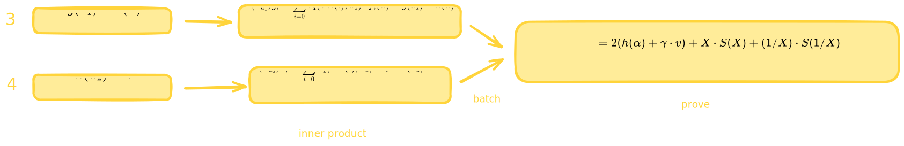
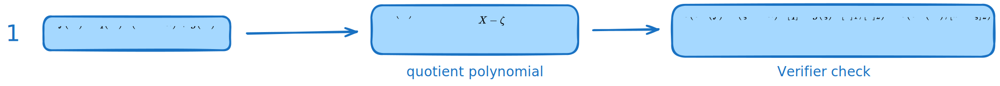
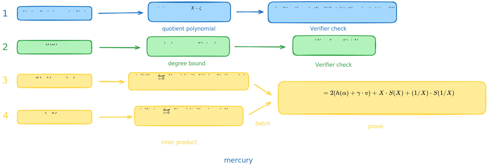

# Mercury 笔记：对接 KZG

- Jade Xie  <jade@secbit.io>
- Yu Guo <yu.guo@secbit.io>

在上一篇文章中介绍了 mercury 协议能在保持 Prover 线性复杂度的同时达到常数证明尺寸的根本原因，同时说明了可以将一个多元线性多项式 $\tilde{f}$ 在点 $(\vec{u}_1, \vec{u}_2)$ 处的取值为 $v$ 的证明转换下面四项证明：

本文将详细介绍 mercury 进行的这四个证明，并给出 mercury 对接一元多项式承诺 KZG 的完整协议描述。

## 内积证明

先来看证明第 3 项 $\tilde{g}(\vec{u}_1) = h(\alpha)$ 和第 4 项 $\tilde{h}(\vec{u}_2) = v$ ，这其实是要对两个内积进行证明。

$$
\begin{align}
\tilde{g}(\vec{u}_1)  & = \sum_{i = 0}^{b - 1} \tilde{eq}(\mathsf{bits}(i), \vec{u}_1) \cdot f_i(\alpha)  \\
\end{align}
$$
令 $\vec{a}_1 = (\tilde{eq}(\mathsf{bits}(0),\vec{u}_1),\ldots, \tilde{eq}(\mathsf{bits}(b-1), \vec{u}_1)$ ，$\vec{b}_1 = (f_0(\alpha),\ldots, f_{b-1}(\alpha))$ ，则要证明 $\tilde{g}_1(\vec{u_1}) = \langle \vec{a}_1, \vec{b}_1\rangle$ ，为两个向量的内积。

$$
\tilde{h}(\vec{u}_2) = \sum_{i = 0}^{b - 1} \tilde{eq}(\mathsf{bits}(i), \vec{u}_2) \cdot h_i
$$
其中 $h_i$ 表示 $h(X)$ 的系数，满足 $h(X) = \sum_{i = 0}^{b-1} h_i \cdot X^i$ 。令 $\vec{a}_2 = (\tilde{eq}(\mathsf{bits}(0),\vec{u}_2),\ldots, \tilde{eq}(\mathsf{bits}(b-1), \vec{u}_2)$ ，$\vec{b}_1 = (h_0,\ldots, h_{b-1})$ ，则要证明 $\tilde{h}(\vec{u_2}) = \langle \vec{a}_2, \vec{b}_2\rangle$ ，为两个向量的内积。

可以发现上述两个内积中，第一个向量 $\vec{a}_i$ 的分量形式都为 $\tilde{eq}(\mathsf{bits}(j),\vec{u}_i)$ ，第二个向量 $\vec{b}_i$ 都是一个一元多项式的系数，$\vec{b}_1$ 的分量是 $g(X)$ 的系数，$\vec{b}_2$ 的分量是 $h(X)$ 的系数。类似地，我们可以令向量 $\vec{a}_i$ 的分量也表示一个一元多项式的系数，令

$$
P_{u_1}(X) = \sum_{i = 0}^{b-1} \tilde{eq}(\mathsf{bits}(i),\vec{u}_1)
$$
$$
P_{u_2}(X) = \sum_{i = 0}^{b-1} \tilde{eq}(\mathsf{bits}(i),\vec{u}_2)
$$
定义两个一元多项式的内积为它们的系数向量进行内积，为叙述简单，这里只考虑两个一元多项式的次数都相同的情况，则要证明的两个内积转换为下面的形式：

$$
\langle P_{u_1}, g\rangle = \sum_{i = 0}^{b - 1} \tilde{eq}(\mathsf{bits}(i), \vec{u}_1) \cdot f_i(\alpha) = \tilde{g}(\vec{u}_1) = h(\alpha) \tag{1}
$$
$$
\langle P_{u_2}, h\rangle = \sum_{i = 0}^{b - 1} \tilde{eq}(\mathsf{bits}(i), \vec{u}_2) \cdot h_i = \tilde{h}(\vec{u}_2) = v\tag{2}
$$

下面先介绍在一般情况下，对于任意两个次数相同的多项式，如何来证明它们的内积，稍后再介绍如何将该方法用在证明 $(1)$ 式与 $(2)$ 式。

一般地，对于两个次数小于 $n$ 的多项式，

$$
a(X) = \sum_{i = 0}^{n - 1} a_i \cdot X^i
$$

$$
b(X) = \sum_{i = 0}^{n - 1} b_i \cdot X^i
$$

现在要证明内积

$$
\langle a, b \rangle = \sum_{i = 0}^{n - 1} a_i \cdot b_i = c
$$

内积证明可以采用多种方法，如 univariate sumcheck、grand sum 方法（这两种方法具体描述可参考 [ph23 博客文章](https://github.com/sec-bit/mle-pcs/blob/main/ph23/ph23-pcs-01.zh.md#3-%E8%AF%81%E6%98%8E-inner-product)）。这里介绍 mercury 论文中给出的方法。

通过 $a(X)$ 与 $b(X)$ 的表达式，可以发现

$$
\begin{aligned}
a(X) b(1/X) & = (a_0 + a_1 X + \ldots + a_{n - 1} X^{n - 1})(b_0 + b_1 X^{-1} + \ldots + b_{n-1} X^{-(n - 1)}) \\
& = {\color{blue}{a_0b_0}} + {\color{orange}a_0\cdot (b_1 X^{-1} + \ldots + b_{n-1} X^{-( n - 1)})} \\
& \quad + {\color{red}a_1 b_0 \cdot X} + {\color{blue}a_1 b_1} + {\color{orange}a_1 (b_2 X^{-1} + \ldots + b_{n - 1}X^{-(n - 1) + 1})} \\
& \quad + {\color{red} a_2b_0 \cdot X^2 + a_2 b_1 X} + {\color{blue} a_2b_2} + {\color{orange} a_2 \cdot (b_3 X^{-1} + \ldots + b_{n - 1} X^{-(n - 1) + 2})} \\
& \quad + \ldots \\
& = {\color{red} X \cdot S_1(X)}  + {\color{blue} a_0b_0 + a_1 b_1 + \ldots + a_{n-1}b_{n-1}} + {\color{orange} 1/X \cdot S_2(1/X)}
\end{aligned}
$$
$a(X)b(1/X)$ 的常数项恰好就是内积 $\langle a, b \rangle$ 。因此要证明 $\langle a, b \rangle = c$ 就等价于证明存在 $S_1(X)$ 和 $S_2(X)$ 满足

$$
a(X) b(1/X) = X \cdot S_1(X) + c + 1/X \cdot S_2(1/X) \tag{3}
$$

此时 Prover 发送关于 $S_1(X)$ 和 $S_2(X)$ 的承诺，Verifier 选取一个随机值 $\zeta$ ，让 Prover 打开 $a(\zeta),b(1/\zeta), S_1(\zeta), S_2(1/\zeta)$ ，并发送这些值对应的打开证明，Verifier 此时就可以用这些值来验证 $(3)$ 式是否成立，这样就完成了内积的证明，而且这个过程中 proof size 也是常数大小的。

$(3)$ 式这样的构造需要发送两个多项式的承诺，即 $S_1(X), S_2(X)$ ，但可以观察到 $a(1/X)b(X)$ 的常数项也是内积 $\langle a, b \rangle$ ，这与 $a(X)b(1/X)$ 是具有对称性的，将 $(3)$ 式中的 $X$ 换成 $1/X$ 就可以得到

$$
a(1/X)b(X) = 1/X \cdot S_1(1/X) + c + X \cdot S_2(X) \tag{4}
$$

将 $(3)$ 式与 $(4)$ 式相加，得到

$$
a(X) b(1/X) + a(1/X)b(X) = X \cdot (S_1(X) + S_2(X)) + 2c + 1/X(S_1(1/X) + S_2(1/X)) 
$$
记 $S(X) := S_1(X) + S_2(X)$ ，那么

$$
a(X) b(1/X) + a(1/X)b(X) = X \cdot S(X) + 2c + 1/X \cdot S(1/X) \tag{5}
$$

证明内积 $\langle a, b \rangle = c$ 就可以等价于证明存在一个多项式 $S(X)$ ，满足 $(5)$ 式。这样就将上面 $(3)$ 式的构造中要承诺两个多项式 $S_1(X)$ 与 $S_2(X)$ 优化为只需要承诺一个多项式 $S(X)$ 了，这也就减少了证明的大小。

若还有一组内积证明 $\langle a', b' \rangle = c'$ ，其中 $a'(X) = \sum_{i = 0}^{n-1} a'_i \cdot X^i, b'(X) = \sum_{i = 0}^{n-1} b'_i \cdot X^i$ 。可以用随机数将这两组内积证明聚合成一个证明。Verifier 可选取一个随机数 $\gamma \stackrel{\$}{\leftarrow} \mathbb{F}$ ，Prover 证明存在多项式 $S(X)$ 满足

$$
a(X) b(1/X) + a(1/X)b(X) + \gamma \cdot (a'(X) b'(1/X) + a'(1/X)b'(X))= X \cdot S(X) + 2(c + \gamma \cdot c') + 1/X \cdot S(1/X) 
$$

回到 mercury 协议本身，我们想证明的两个内积是

$$
\langle P_{u_1}, g\rangle = \sum_{i = 0}^{b - 1} \tilde{eq}(\mathsf{bits}(i), \vec{u}_1) \cdot f_i(\alpha) = \tilde{g}(\vec{u}_1) = h(\alpha) \tag{6}
$$
$$
\langle P_{u_2}, h\rangle = \sum_{i = 0}^{b - 1} \tilde{eq}(\mathsf{bits}(i), \vec{u}_2) \cdot h_i = \tilde{h}(\vec{u}_2) = v \tag{7}
$$
采用上面内积证明的方法，Verifier 发送一个随机数 $\gamma$ ，可以将这两个内积证明 batch 成一个。证明存在多项式 $S(X)$ 满足

$$
\begin{aligned}
g(X) P_{u_1}(1/X) & + g(1/X) P_{u_1}(X) + \gamma \cdot (h(X) P_{u_2}(1/X) + h(1/X) P_{u_2}(X)) \\
& = 2(h(\alpha) + \gamma \cdot v) + X \cdot S(X) + (1/X) \cdot S(1/X)  
\end{aligned} \tag{8}
$$

Prover 先承诺 $g(X), h(X), S(X)$ ，Verifier 随机选取一个打开点 $\zeta$ ，Prover 发送值 $g(\zeta), g(1/\zeta), h(\zeta), h(1/\zeta), S(\zeta), S(1/\zeta)$ 及对应的打开证明，由于 $\vec{u}_1$ 和 $\vec{u}_2$ 是公开的，因此 Verifier 可以自己算出 $P_{u_1}(X)$ 和 $P_{u_2}(X)$ ，从而自己计算出 $P_{u_1}(\zeta), P_{u_1}(1/\zeta)$ 和 $P_{u_2}(\zeta), P_{u_2}(1/\zeta)$ ，来验证 $(3)$ 式的正确性。

现在已经明白了第 3 项和第 4 项的证明可以转换为两个内积证明，它们可以用 $(3)$ 式这样的方式 batch 在一起来进行证明，该证明只需要常数的证明大小。

## 分解正确

对于第 1 项的证明，

1. $f(X) = q(X) \cdot (X^b - \alpha) + g(X)$ 

可以直接对接一元多项式 KZG 承诺方案来进行证明。由于在证明第 3 项和第 4 项时，Prover 已经发送了 $g(\zeta)$ 的值，因此可以在同一个随机点处来验证第 1 项的正确性。Prover 构造一个商多项式

$$
H(X) = \frac{f(X) - (\zeta^b - \alpha)q(X) - g(\zeta)}{X - \zeta}
$$

对该商多项式进行承诺 $[H] = \mathsf{cm}(H)$ ，发送给 Verifier 。由于 $f(\zeta) = (\zeta^b - \alpha) \cdot q(\zeta) - g(\zeta)$ ，那么该商多项式是存在的，另一方面，该商多项式存在，也能说明第 1 项的构造正确。Verifier 在收到 $\mathsf{cm}(H)$ 后，可以用 pairing 来进行验证

$$
e(\mathsf{cm}(f) - (\zeta^b - \alpha) \cdot [q] - g(\zeta) \cdot [1]_1 , [1]_2) \stackrel{?}{=} e(\mathsf{cm}(H), [x - \zeta]_2)
$$

总结下证明第一项的正确性，Prover 需要证明存在商多项式 $H(X)$ ，Verfier 在随机点验证该商多项式的正确性。

## Degree bound

对于第 2 项的证明，

2. $\deg(g) < b$

也可以利用 $g(1/X)$ 函数，要证明 $\deg(g(X)) < b$ ，等价于证明

$$
D(X) = X^{b - 1} \cdot g(1/X) \tag{9}
$$

是一个多项式。假设 $\deg(g) = d$ ，

$$
\begin{aligned}
D(X) & = X^{b-1} \cdot g(1/X) \\
& = X^{b - 1}(g_0  + g_1 \cdot X^{-1} + \ldots + g_{d} \cdot X^{-d}) \\
& = g_{d} \cdot X^{b - d - 1} + \ldots + g_1 \cdot X^{b - 2} + g_0 \cdot X^{b - 1}
\end{aligned}
$$
可以发现只有当 $d < b$ 时，第一项 $g_d \cdot X^{b-d-1}$ 的次数 $b-d - 1 \ge 0$ ，否则该项的次数为负数，不能构成一个多项式。假设 KZG Setup 阶段选取的随机数为 $\tau$ ，srs 为

$$
\{[1], [\tau], \ldots, [\tau^{N-1}], [1]_2, [\tau]_2\}
$$

不包含 $\tau$ 的负数次幂，那么只有当 $D(X)$ 是一个多项式时，其才能正确的进行多项式承诺，这也就说明了 $g(X)$ 的次数小于 $b$ 。Prover 先承诺多项式 $D(X)$ ，发送 $\mathsf{cm}(D(X)) = [D]$ 。为了验证 $(9)$ 式的正确性，Verifier 需要选取一个随机点，来打开 $D(X)$ 与 $g(1/X)$ 在随机点处的值，为了减少证明的大小，由于在内积证明中已经发送过 $g(1/\zeta)$ 的值，这里进行 degree bound 证明时，依然可以选择在 $\zeta$ 点进行打开。Prover 再发送 $D(\zeta)$ 的值及对应的打开证明，Verifier 来验证

$$
D(\zeta) \stackrel{?}{=} \zeta^{b-1} \cdot g(1/\zeta)
$$

第 2 项的证明如下图所示。

至此我们已经知道前面提到的四项如何来证明。

## 聚合多个多项式在多点的打开证明

四项证明：

1. $f(X) = q(X) \cdot (X^b - \alpha) + g(X)$ 
2. $\deg(g) < b$
3. $\tilde{g}(\vec{u}_1) = h(\alpha)$
4. $\tilde{h}(\vec{u}_2) = v$

回顾下在证明这四项的过程中，Prover 发送的多项式的值如下图所示。

Prover 发送的值有

$$
g(\zeta), g(1/\zeta), h(\alpha), h(\zeta), h(1/\zeta), S(\zeta), S(1/\zeta), D(\zeta)
$$

Prover 需要用 KZG10 来证明这些值发送的是正确的。对于一个值 $g(\zeta)$ ，Prover 可以构造商多项式

$$
q_{g_\zeta} = \frac{g(X) - g(\zeta)}{X - \zeta}
$$

Prover 先承诺该商多项式 $\mathsf{cm}(q_{g_\zeta})$ ，Verifier 可以通过一个椭圆曲线上的 pairing 操作来进行验证

$$
e(\mathsf{cm}(g) - g(\zeta) \cdot [1]_1 , [1]_2) \stackrel{?}{=} e(\mathsf{cm}(q_{g_\zeta}), [\tau - \zeta]_2)
$$

但这里有 $8$ 个值需要证明正确，如果每一个值都像上面这样去证明，会导致证明尺寸的增加，同时也会增加 Verifier 的计算量。可以发现这里涉及 $4$ 个不同的多项式，且每个多项式打开的点不完全一致，也不适合用多个多项式在同一个点打开的方案去证明。在 [BDFG20] Section 4 中给出了一种可以在不同的多项式打开多个不同的点的方案，证明的大小只需要 $2$ 个椭圆曲线 $\mathbb{G}_1$ 上的点，Verifier 也只需要计算两个椭圆曲线上的 pairing 操作，下面介绍下该方案。

令集合 $S_1,S_2, S_3, S_4$ 分别表示多项式 $g(X),h(X),S(X), D(X)$ 要打开的点的集合，即

$$
\begin{align}
S_1 = \{\zeta, 1/\zeta\},  & \qquad S_2 = \{\alpha, \zeta, 1/\zeta\} \\
S_3 = \{\zeta, 1/\zeta\},  & \qquad S_4 = \{\zeta\}
\end{align}
$$
构造集合 $T$ ，其能包含 $S_i$ 中所有的元素，令

$$
T = \{\zeta, 1/\zeta, \alpha\}
$$
则 $S_i \subset T \subset \mathbb{F}$ 。

以集合 $S_1$ 和多项式 $g(X)$ 为例，在集合 $S_1, T, T \setminus S_1$ 上的消失多项式分别为

$$
\begin{align}
 & Z_{S_1}(X) = (X - \zeta)(X - 1/\zeta) \\
 & Z_{T}(X) = (X - \zeta)(X - 1 /\zeta)(X -\alpha) \\
 & Z_{T \setminus S_{1}}(X) = X - \alpha 
\end{align}
$$

令 $g^*(X)$ 表示 $(g(\zeta), g(1/\zeta))$ 在 $(\zeta, 1/\zeta)$ 上的插值多项式，满足 $\deg(g^*) = 1$ ，且

$$
g^*(\zeta) = g(\zeta), \qquad g^*(1/\zeta) = g(1/\zeta)
$$

那么可以发现消失多项式 $Z_{S_1}(X)$ 能够整除多项式 $g(X) - g^*(X)$ ，即存在商多项式

$$
q_g(X) = \frac{g(X) - g^*(X)}{Z_{S_1}(X)}
$$

由于

$$
Z_{S_1}(X) = \frac{Z_T(X)}{Z_{T \setminus S_1}(X)}
$$
则

$$
q_g(X) = \frac{Z_{T \setminus S_1}(X)(g(X) - g^*(X))}{Z_T(X)}
$$

这也就意味着 $Z_{S_1}(X)$ 能够整除多项式 $g(X) - g^*(X)$ 等价于 $Z_T(X)$ 能够整除多项式 $Z_{T \setminus S_1}(X)(g(X) - g^*(X))$ 。将 $Z_{S_1}(X)$ 整除转换为 $Z_{T}(X)$ 整除的好处就是，$Z_T(X)$ 对其余的多项式 $h(X), S(X), D(X)$ 来说都是同一个，这样就可以将这几个不同的多项式在不同的点打开聚合在一起进行证明。下面来看下具体的证明过程。

1. Verifier 发送随机数 $\beta \stackrel{\$}{\leftarrow} \mathbb{F}$
2. Prover 计算插值多项式
	- $g^*(X)$ 为 $(g(\zeta), g(1/\zeta))$ 在 $(\zeta, 1/\zeta)$ 上的插值多项式
	- $h^*(X)$ 为 $(h(\alpha), h(\zeta), h(1/\zeta))$ 在 $(\alpha,\zeta, 1/\zeta)$ 上的插值多项式
	- $S^*(X)$ 为 $(S(\zeta), S(1/\zeta))$ 在 $(\zeta, 1/\zeta)$ 上的插值多项式
	- $D^*(X)$ 为 $(D(\zeta))$ 在 $(\zeta)$ 上的插值多项式
3. Prover 计算多项式

$$
\begin{align}
 m(X)  & = Z_{T \setminus S_1}(X)(g(X) - g^*(X)) + \beta \cdot Z_{T \setminus S_2}(X)(h(X) - h^*(X))  \\
 & \quad + \beta^2 \cdot Z_{T \setminus S_3}(X)(S(X) - S^*(X)) +  \beta^3 \cdot Z_{T \setminus S_4}(X)(D(X) - D^*(X))
\end{align}
$$

4. Prover 计算并发送 $q_m(X) = m(X) / Z_T(X)$ 的承诺

$$
C_{q_{m}} = [q_m(\tau)]_1
$$
5. Verifier 发送随机打开点 $z \stackrel{\$}{\leftarrow} \mathbb{F}$
6. Prover 计算线性化多项式

$$
L(X) = m_z(X) - Z_T(z) \cdot q_{\mathsf{batch}}(X)
$$

其中

$$
\begin{align}
 m_z(X)  & = Z_{T \setminus S_1}(z)(g(X) - g^*(z)) + \beta \cdot Z_{T \setminus S_2}(z)(h(X) - h^*(z))  \\
 & \quad + \beta^2 \cdot Z_{T \setminus S_3}(z)(S(X) - S^*(z)) +  \beta^3 \cdot Z_{T \setminus S_4}(z)(D(X) - D^*(z))
\end{align}
$$

那么 $L(z) = m_z(z) - Z_T(z) \cdot q_m(z) = 0$ ，因此 $(X - z)$ 能够整除 $L(X)$ 。

7. Prover 计算并发送 $L(X)/(X - z)$ 的承诺

$$
C_{q_L} = \left[\frac{L(\tau)}{\tau - z}\right]_1
$$
8. Verifier 计算插值多项式
	- $g^*(X)$ 为 $(g(\zeta), g(1/\zeta))$ 在 $(\zeta, 1/\zeta)$ 上的插值多项式
	- $h^*(X)$ 为 $(h(\alpha), h(\zeta), h(1/\zeta))$ 在 $(\alpha,\zeta, 1/\zeta)$ 上的插值多项式
	- $S^*(X)$ 为 $(S(\zeta), S(1/\zeta))$ 在 $(\zeta, 1/\zeta)$ 上的插值多项式
	- $D^*(X)$ 为 $(D(\zeta))$ 在 $(\zeta)$ 上的插值多项式
9. Verifier 计算插值多项式在 $z$ 处的取值，计算 $g^*(z), h^*(z), S^*(z), D^*(z)$
10. Verifier 计算消失多项式在 $z$ 处的取值，计算 $Z_T(z), Z_{T \setminus S_1}(z), Z_{T \setminus S_2}(z), Z_{T \setminus S_3}(z), Z_{T \setminus S_4}(z)$
11. Verifier 计算

$$
\begin{align}
 F & = Z_{T \setminus S_1}(z) \cdot C_g + \beta \cdot Z_{T \setminus S_2}(z) \cdot C_h + \beta^2 \cdot Z_{T \setminus S_3}(z) \cdot C_S  +  \beta^3 \cdot Z_{T \setminus S_4}(z) \cdot C_D \\
 & \quad - (Z_{T \setminus S_1}(z) \cdot g^*(z) + \beta \cdot Z_{T \setminus S_2}(z) \cdot h^*(z) + \beta^2 \cdot Z_{T \setminus S_3}(z) \cdot S^*(z)  +  \beta^3 \cdot Z_{T \setminus S_4}(z) \cdot D^*(z)) \cdot [1]_1 \\
 & \quad - Z_T(z) \cdot C_{q_m}
\end{align}
$$
12. Verifier 验证

$$
e(F + z \cdot C_{q_L}, [1]_2) \stackrel{?}{=} e(C_{q_L}, [\tau]_2)
$$

至此，对接 KZG 承诺的所有证明部分都比较清楚了。

下面将这些部分都组合在一起，看看完整的 mercury 协议。

## 协议

### Setup

选取随机数 $\tau \in \mathbb{F}$ ，生成 srs 参数

$$
\{[1], [\tau], \ldots, [\tau^{N-1}], [1]_2, [\tau]_2\}
$$

### Commit

对于多元线性多项式 

$$
\tilde{f}(X_0,X_1,\ldots, X_{n-1}) = \sum_{i=0}^{2^n - 1} f_i \cdot \tilde{eq}(\mathsf{bits}(i),(X_0, X_1, \ldots, X_{n-1}))
$$

令 $N = 2^n$ ，将其系数 $f_i$ 分成 $b = \sqrt{N}$ 组 $(f_0,f_1, \ldots, f_{2^n - 1}) = (f_{0,0}, f_{0,1}, \ldots, f_{0,b-1}, \ldots, f_{b-1,0}, \ldots, f_{b-1,b-1})$ 。与 $\tilde{f}$ 对应的一元多项式为

$$
f(X) = \sum_{i = 0}^{b - 1} \sum_{j = 0}^{b - 1} f_{i,j} \cdot X^{i \cdot b + j}
$$
对多元多线性多项式的承诺即为对 $f(X)$ 的承诺，

$$
C_f = \sum_{i = 0}^{b - 1} \sum_{j = 0}^{b - 1} f_{i,j} \cdot [\tau^{i \cdot b + j}]
$$

### Evaluation

Prover 要向 Verifier 证明 $\tilde{f}(X_0, \ldots , X_{n - 1})$ 在一个公开点 $\vec{u} = (u_0, \ldots, u_{n-1})$ 处的值为 $v$ ，即

$$
\tilde{f}(\vec{u}) = v
$$

#### 公共输入

1. 多元线性多项式 $\tilde{f}$ 的承诺 $C_f$
2. 求值点 $\vec{u}$
3. $\tilde{f}$ 在 $\vec{u}$ 处的取值 $v$

#### Witness

多元线性多项式 $\tilde{f}$ 的系数 $(f_{0,0}, f_{0,1}, \ldots, f_{0,b-1}, \ldots, f_{b-1,0}, \ldots, f_{b-1,b-1})$ 。

#### Round 1

这一轮承诺部分求和函数 $h(X)$ 。

1. 将 $\vec{u}$ 拆分成两个等长的向量，令 $n = 2t$ ，则 $b = 2^t$ ，那么

$$
\vec{u}_1 = (u_0, \ldots, u_{t - 1})
$$

$$
\vec{u}_2 = (u_t, \ldots, u_{n - 1})
$$

2. Prover 计算 $h(X)$ ，

$$
h(X) = \sum_{i = 0}^{b - 1} \tilde{eq}(\mathsf{bits}(i), \vec{u}_1) \cdot f_i(X) 
$$

其中 

$$
\begin{align}
 & f_0(X) = f_{0,0} + f_{1,0}  X + \ldots + f_{b-1, 0} X^{b-1} \\
 & f_1(X) = f_{0,1} + f_{1,1}  X + \ldots + f_{b-1, 1} X^{b-1} \\
 & \qquad \qquad \qquad \qquad \ldots \\
 & f_{b-1}(X) = f_{0,b-1} + f_{1,b-1}  X + \ldots + f_{b-1, b-1} X^{b-1}
\end{align}
$$

3. Prover 计算并发送 $h(X)$ 的承诺 $C_h = [h(\tau)]_1$

#### Round 2

这一轮承诺“折叠”多项式 $g(X)$。

1. Verifier 发送随机数 $\alpha \stackrel{\$}{\leftarrow} \mathbb{F}$
2. Prover 计算多项式 $g(X)$ 与 $q(X)$ ，满足

$$
f(X) = q(X) \cdot (X^b - \alpha) + g(X)
$$
并且 $\deg(g) < b$ 。其中

$$
g(X) = \sum_{i = 0}^{b - 1} f_i(\alpha) \cdot X^i
$$

3. Prover 计算并发送 $g(X)$ 与 $q(X)$ 的承诺 $C_g = [g(\tau)]_1, C_q = [q(\tau)]_1$
4. Prover 计算并发送 $h(\alpha)$

#### Round 3

这一轮发送两个内积证明以及 $g(X)$ 的 degree bound 证明。

1. Verifier 发送随机数 $\gamma \stackrel{\$}{\leftarrow} \mathbb{F}$
2. Prover 计算 $S(X)$ ，满足

$$
\begin{aligned}
g(X) P_{u_1}(1/X) & + g(1/X) P_{u_1}(X) + \gamma \cdot (h(X) P_{u_2}(1/X) + h(1/X) P_{u_2}(X)) \\
& = 2(h(\alpha) + \gamma \cdot v) + X \cdot S(X) + (1/X) \cdot S(1/X)  
\end{aligned}
$$

其中

$$
P_{u_1}(X) = \sum_{i = 0}^{b-1} \tilde{eq}(\mathsf{bits}(i),\vec{u}_1)
$$

$$
P_{u_2}(X) = \sum_{i = 0}^{b-1} \tilde{eq}(\mathsf{bits}(i),\vec{u}_2)
$$

3. Prover 发送 $S(X)$ 的承诺 $C_S = [S(\tau)]_1$
4. Prover 计算多项式 $D(X)$

$$
D(X) = X^{b - 1} g(1/X)
$$
5. Prover 发送 $D(X)$ 的承诺 $C_D = [D(\tau)]_1$

#### Round 4

1.  Verifier 发送随机数 $\zeta \stackrel{\$}{\leftarrow} \mathbb{F}$
2. Prover 计算并发送 $g(\zeta), g(1/\zeta), h(\zeta), h(1/\zeta), S(\zeta), S(1/\zeta), D(\zeta)$
3. Prover 计算商多项式

$$
H(X) = \frac{f(X) - (\zeta^b - \alpha)q(X) - g(\zeta)}{X - \zeta}
$$

4. Prover 计算并发送商多项式 $H(X)$ 的承诺 $C_H = [H(\tau)]_1$

#### Round 5

这一轮发送聚合 $g(X), h(X), S(X), D(X)$ 在多个点打开的证明。

1. Verifier 发送随机数 $\beta \stackrel{\$}{\leftarrow} \mathbb{F}$
2. Prover 计算插值多项式
	- $g^*(X)$ 为 $(g(\zeta), g(1/\zeta))$ 在 $(\zeta, 1/\zeta)$ 上的插值多项式
	- $h^*(X)$ 为 $(h(\alpha), h(\zeta), h(1/\zeta))$ 在 $(\alpha,\zeta, 1/\zeta)$ 上的插值多项式
	- $S^*(X)$ 为 $(S(\zeta), S(1/\zeta))$ 在 $(\zeta, 1/\zeta)$ 上的插值多项式
	- $D^*(X)$ 为 $(D(\zeta))$ 在 $(\zeta)$ 上的插值多项式
3. Prover 计算多项式

$$
\begin{align}
 m(X)  & = Z_{T \setminus S_1}(X)(g(X) - g^*(X)) + \beta \cdot Z_{T \setminus S_2}(X)(h(X) - h^*(X))  \\
 & \quad + \beta^2 \cdot Z_{T \setminus S_3}(X)(S(X) - S^*(X)) +  \beta^3 \cdot Z_{T \setminus S_4}(X)(D(X) - D^*(X))
\end{align}
$$
其中

$$
\begin{align}
S_1 = \{\zeta, 1/\zeta\},  & \qquad S_2 = \{\alpha, \zeta, 1/\zeta\} \\
S_3 = \{\zeta, 1/\zeta\},  & \qquad S_4 = \{\zeta\}
\end{align}
$$

$$
T = \{\zeta, 1/\zeta, \alpha\}
$$

$Z_T(X), Z_{T \setminus S_1}(X), Z_{T \setminus S_2}(X), Z_{T \setminus S_3}(X), Z_{T \setminus S_4}(X)$ 分别是对应集合 $T, T \setminus S_1, T \setminus S_2, T \setminus S_3, T \setminus S_4$ 上的消失多项式。

4. Prover 计算并发送 $q_m(X) = m(X) / Z_T(X)$ 的承诺

$$
C_{q_{m}} = [q_m(\tau)]_1
$$
#### Round 6

1. Verifier 发送随机打开点 $z \stackrel{\$}{\leftarrow} \mathbb{F}$
2. Prover 计算线性化多项式

$$
L(X) = m_z(X) - Z_T(z) \cdot q_{\mathsf{batch}}(X)
$$

其中

$$
\begin{align}
 m_z(X)  & = Z_{T \setminus S_1}(z)(g(X) - g^*(z)) + \beta \cdot Z_{T \setminus S_2}(z)(h(X) - h^*(z))  \\
 & \quad + \beta^2 \cdot Z_{T \setminus S_3}(z)(S(X) - S^*(z)) +  \beta^3 \cdot Z_{T \setminus S_4}(z)(D(X) - D^*(z))
\end{align}
$$

那么 $L(z) = m_z(z) - Z_T(z) \cdot q_m(z) = 0$ ，因此 $(X - z)$ 能够整除 $L(X)$ 。

3. Prover 计算并发送 $L(X)/(X - z)$ 的承诺

$$
C_{q_L} = \left[\frac{L(\tau)}{\tau - z}\right]_1
$$

#### 证明表示

Prover 发送的证明为

$$
\pi = (C_h, C_g, C_q, C_S, C_D, C_H, C_{q_m},C_{q_L},g(\zeta), g(1/\zeta), h(\zeta), h(1/\zeta), h(\alpha), S(\zeta), S(1/\zeta), D(\zeta))
$$

证明的大小为 $8 ~ \mathbb{G}_1 + 8~ \mathbb{F}$ 。

#### Verification

1. Verifier 计算 $P_{u_1}(\zeta) , P_{u_1}(1/\zeta), P_{u_2}(\zeta) , P_{u_2}(1/\zeta)$ ，Verifier 可以通过下面的方式在 $O(\log N)$ 时间计算这些值

$$
P_{u_1} (X) = \prod_{i = 0}^{t - 1} (u_i X^{2^{i}} + 1 - u_i)
$$

$$
P_{u_2} (X) = \prod_{i = t}^{n - 1} (u_i X^{2^{i}} + 1 - u_i)
$$

2. Verifier 验证两个内积证明

$$
\begin{aligned}
g(\zeta) P_{u_1}(1/\zeta) & + g(1/\zeta) P_{u_1}(\zeta) + \gamma \cdot (h(\zeta) P_{u_2}(1/\zeta) + h(1/\zeta) P_{u_2}(\zeta)) \\
& \stackrel{?}{=} 2(h(\alpha) + \gamma \cdot v) + \zeta \cdot S(\zeta) + (1/\zeta) \cdot S(1/\zeta)  
\end{aligned}
$$

3. Verifier 验证 $g(X)$ 的次数是否小于 $b$

$$
D(\zeta) \stackrel{?}{=} \zeta^{b - 1} g(1/\zeta)
$$

4. Verifier 验证  $g(X)$ 的构造是否正确

$$
e(C_f - (\zeta^b - \alpha) \cdot C_q - g(\zeta) \cdot [1]_1, [1]_2) \stackrel{?}{=} e(C_H, [\tau - \zeta]_2)
$$

5. Verifier 计算插值多项式
	- $g^*(X)$ 为 $(g(\zeta), g(1/\zeta))$ 在 $(\zeta, 1/\zeta)$ 上的插值多项式
	- $h^*(X)$ 为 $(h(\alpha), h(\zeta), h(1/\zeta))$ 在 $(\alpha,\zeta, 1/\zeta)$ 上的插值多项式
	- $S^*(X)$ 为 $(S(\zeta), S(1/\zeta))$ 在 $(\zeta, 1/\zeta)$ 上的插值多项式
	- $D^*(X)$ 为 $(D(\zeta))$ 在 $(\zeta)$ 上的插值多项式
6. Verifier 计算插值多项式在 $z$ 处的取值，计算 $g^*(z), h^*(z), S^*(z), D^*(z)$
7. Verifier 计算消失多项式在 $z$ 处的取值，计算 $Z_T(z), Z_{T \setminus S_1}(z), Z_{T \setminus S_2}(z), Z_{T \setminus S_3}(z), Z_{T \setminus S_4}(z)$
8. Verifier 计算

$$
\begin{align}
 F & = Z_{T \setminus S_1}(z) \cdot C_g + \beta \cdot Z_{T \setminus S_2}(z) \cdot C_h + \beta^2 \cdot Z_{T \setminus S_3}(z) \cdot C_S  +  \beta^3 \cdot Z_{T \setminus S_4}(z) \cdot C_D \\
 & \quad - (Z_{T \setminus S_1}(z) \cdot g^*(z) + \beta \cdot Z_{T \setminus S_2}(z) \cdot h^*(z) + \beta^2 \cdot Z_{T \setminus S_3}(z) \cdot S^*(z)  +  \beta^3 \cdot Z_{T \setminus S_4}(z) \cdot D^*(z)) \cdot [1]_1 \\
 & \quad - Z_T(z) \cdot C_{q_m}
\end{align}
$$

9. Verifier 验证

$$
e(F + z \cdot C_{q_L}, [1]_2) \stackrel{?}{=} e(C_{q_L}, [\tau]_2)
$$

## References

- [EG25] Eagen, Liam, and Ariel Gabizon. "MERCURY: A multilinear Polynomial Commitment Scheme with constant proof size and no prover FFTs." Cryptology ePrint Archive (2025). https://eprint.iacr.org/2025/385
- [BDFG20] Boneh, Dan, Justin Drake, Ben Fisch, and Ariel Gabizon. "Efficient polynomial commitment schemes for multiple points and polynomials." _Cryptology ePrint Archive_ (2020). https://eprint.iacr.org/2020/081