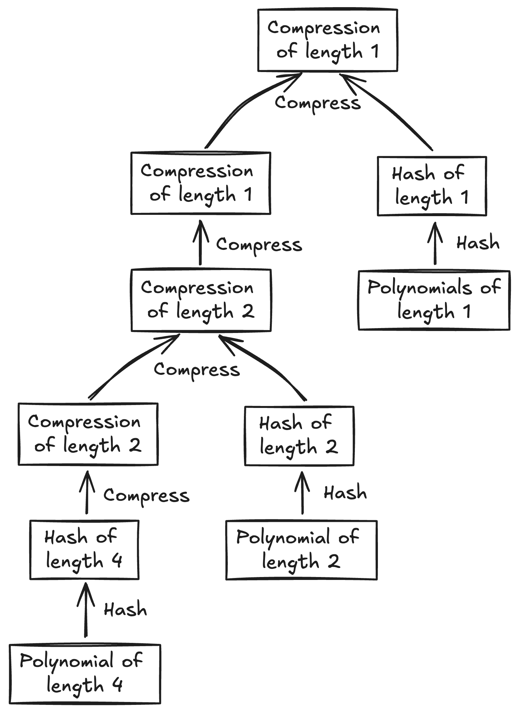

# Merkle Tree

Merkle tree is used in mmcs to commit a vector of matrices. It is a generalization of the Merkle Tree that allows more complex operations of building the tree.



<center>figure 1: merkle tree of mmcs</center><br>

As you can see in this example, the leaves are not in a single layer, but are instead distributed across multiple layers. Each layer can contain leaves that are half of the size of the layer below it, which equals to the number of hashes of this layer.

## Pre-Knowledge

Before we talk about the structure of the merkle tree, we need to introduce 'matrix', which is a batch of polynomials that have same length.

Matrix is the basic input structure for user to commit in mmcs, since there are more than one length of polynomials, we should devide different length of polynomials into different matrices.


<center>figure 2: matrices</center><br>

Polynomials are vertically packed into a matrix, which means each column of the matrix is a polynomial.

## Structure of Merkle Tree

This is the structure of merkle tree:

```rust,ignore
/// A binary Merkle tree for packed data. It has leaves of type `F` and digests of type
/// `[W; DIGEST_ELEMS]`.
///
/// This generally shouldn't be used directly. If you're using a Merkle tree as an MMCS,
/// see `MerkleTreeMmcs`.
#[derive(Debug, Serialize, Deserialize)]
pub struct MerkleTree<F, W, M, const DIGEST_ELEMS: usize> {
    pub(crate) leaves: Vec<M>,
    // Enable serialization for this type whenever the underlying array type supports it (len 1-32).
    #[serde(bound(serialize = "[W; DIGEST_ELEMS]: Serialize"))]
    // Enable deserialization for this type whenever the underlying array type supports it (len 1-32).
    #[serde(bound(deserialize = "[W; DIGEST_ELEMS]: Deserialize<'de>"))]
    pub(crate) digest_layers: Vec<Vec<[W; DIGEST_ELEMS]>>,
    _phantom: PhantomData<F>,
}
```

After defining the structure of the merkle tree, we need to implement a constructor and a `root` method for it.

```rust,ignore
impl<F: Clone + Send + Sync, W: Clone, M: Matrix<F>, const DIGEST_ELEMS: usize>
    MerkleTree<F, W, M, DIGEST_ELEMS>
{
    // implement methods here
}
```

The constructor of the merkle tree follows the process described below.

1. 找出所有高度最大的矩阵（这些矩阵的高度必须相等），将这些矩阵哈希，作为 merkle tree 最底层。
2. 首先，将 merkle tree 中最上层的结点两两合并哈希，得到一层长度减半的结点。然后判断：如果待哈希矩阵高度的 next_power_of_two 与当前层长度相同，则将这些矩阵与之前得到的结点两两合并哈希，得到的结果作为 merkle tree 当前层的结点；否则，将上一层合并哈希得到的结点作为当前层的结点。
3. 重复步骤 2，直到得到根节点。

You can refer to figure 1 to understand the process.

```rust,ignore
    /// Matrix heights need not be powers of two. However, if the heights of two given matrices
    /// round up to the same power of two, they must be equal.
    /// 
    /// Neil: commit a vector of matrices to merkle tree
    /// 
    /// # Arguments
    /// * `h` - Hash function for raw data.
    /// * `c` - Hash function for compressing several hashes.
    /// * `leaves` - A vector of matrices to be committed.
    /// 
    /// # Returns
    /// A merkle tree.
    #[instrument(name = "build merkle tree", level = "debug", skip_all,
                 fields(dimensions = alloc::format!("{:?}", leaves.iter().map(|l| l.dimensions()).collect::<Vec<_>>())))]
    pub fn new<P, PW, H, C>(h: &H, c: &C, leaves: Vec<M>) -> Self
    where
        P: PackedValue<Value = F>,
        PW: PackedValue<Value = W>,
        H: CryptographicHasher<F, [W; DIGEST_ELEMS]>,
        H: CryptographicHasher<P, [PW; DIGEST_ELEMS]>,
        H: Sync,
        C: PseudoCompressionFunction<[W; DIGEST_ELEMS], 2>,
        C: PseudoCompressionFunction<[PW; DIGEST_ELEMS], 2>,
        C: Sync,
    {
        // Neil: Step 0: security checks

        // Neil: check if the input is empty
        assert!(!leaves.is_empty(), "No matrices given?");

        // Neil: check if the packing width of the input matrices are the same
        assert_eq!(P::WIDTH, PW::WIDTH, "Packing widths must match");

        // Neil: Step 1: sort the input matrices by their height in descending order, hash them and get the first digest layer

        // Neil: sort the input matrices by their height in descending order
        let mut leaves_largest_first = leaves
            .iter()
            .sorted_by_key(|l| Reverse(l.height()))
            .peekable();

        // check height property
        assert!(
            leaves_largest_first
                .clone()
                .map(|m| m.height())
                .tuple_windows()
                .all(|(curr, next)| curr == next
                    || curr.next_power_of_two() != next.next_power_of_two()),
            "matrix heights that round up to the same power of two must be equal"
        );

        // Neil: get the height of the tallest matrix
        let max_height = leaves_largest_first.peek().unwrap().height();

        // Neil: get all matrices that have the same height as the tallest matrix
        let tallest_matrices = leaves_largest_first
            .peeking_take_while(|m| m.height() == max_height)
            .collect_vec();

        // Neil: get the first digest layer
        let mut digest_layers = vec![first_digest_layer::<P, PW, H, M, DIGEST_ELEMS>(
            h,
            tallest_matrices,
        )];

        // Neil: Step 2, 3: get the rest layers, loop until the last layer

        // Neil: get the rest layers, loop until the last layer
        loop {
            let prev_layer = digest_layers.last().unwrap().as_slice();
            if prev_layer.len() == 1 {
                break;
            }
            let next_layer_len = prev_layer.len() / 2;

            // The matrices that get injected at this layer.
            let matrices_to_inject = leaves_largest_first
                .peeking_take_while(|m| m.height().next_power_of_two() == next_layer_len)
                .collect_vec();

            // Neil: compress the previous layer and inject the matrices to the layer
            let next_digests = compress_and_inject::<P, PW, H, C, M, DIGEST_ELEMS>(
                prev_layer,
                matrices_to_inject,
                h,
                c,
            );
            digest_layers.push(next_digests);
        }

        Self {
            leaves,
            digest_layers,
            _phantom: PhantomData,
        }
    }
```

`root` method is a simple method only returns the root of the merkle tree, which is precomputed in the `new` method.

```rust,ignore
    /// Neil: return the root of the merkle tree
    #[must_use]
    pub fn root(&self) -> Hash<F, W, DIGEST_ELEMS>
    where
        W: Copy,
    {
        self.digest_layers.last().unwrap()[0].into()
    }
```

## Some Helper Methods

There are also some functions which is not methods of the struct `MerkleTree`, but are used in the `new` method, which are `first_digest_layer` and `compress_and_inject`. Let's take a look at them.

`first_digest_layer` works similarly as traditional merkle tree, however it deals with matrices rather than one vector.

```rust,ignore
/// Neil: digest the first layer of the merkle tree
/// 
/// # Arguments
/// * `h` - Hash function for raw data.
/// * `tallest_matrices` - The matrices that have the same height as the tallest matrix.
/// 
/// # Returns
/// A vector of digests.
#[instrument(name = "first digest layer", level = "debug", skip_all)]
fn first_digest_layer<P, PW, H, M, const DIGEST_ELEMS: usize>(
    h: &H,
    tallest_matrices: Vec<&M>,
) -> Vec<[PW::Value; DIGEST_ELEMS]>
where
    P: PackedValue,
    PW: PackedValue,
    H: CryptographicHasher<P::Value, [PW::Value; DIGEST_ELEMS]>,
    H: CryptographicHasher<P, [PW; DIGEST_ELEMS]>,
    H: Sync,
    M: Matrix<P::Value>,
{
    let width = PW::WIDTH;
    let max_height = tallest_matrices[0].height();
    let max_height_padded = max_height.next_power_of_two();

    let default_digest: [PW::Value; DIGEST_ELEMS] = [PW::Value::default(); DIGEST_ELEMS];
    let mut digests = vec![default_digest; max_height_padded];

    digests[0..max_height]
        .par_chunks_exact_mut(width)
        .enumerate()
        .for_each(|(i, digests_chunk)| {
            let first_row = i * width;
            let packed_digest: [PW; DIGEST_ELEMS] = h.hash_iter(
                tallest_matrices
                    .iter()
                    // Neil: retrieve first_row..(first_row + width) rows of matrices, pack them vertically
                    .flat_map(|m| m.vertically_packed_row(first_row)),
            );
            // Neil: unpack the packed digest type and store it in the digests
            for (dst, src) in digests_chunk.iter_mut().zip(unpack_array(packed_digest)) {
                *dst = src;
            }
        });

    // If our packing width did not divide max_height, fall back to single-threaded scalar code
    // for the last bit.
    #[allow(clippy::needless_range_loop)]
    for i in (max_height / width * width)..max_height {
        digests[i] = h.hash_iter(tallest_matrices.iter().flat_map(|m| m.row(i)));
    }

    // Everything has been initialized so we can safely cast.
    digests
}
```

Note: `vertically_packed_row` is a method of the struct `Matrix`, which is used in the `first_digest_layer` method.

```rust,ignore
/// Pack together a collection of adjacent rows from the matrix.
///
/// Returns an iterator whose i'th element is packing of the i'th element of the
/// rows r through r + P::WIDTH - 1. If we exceed the height of the matrix,
/// wrap around and include initial rows.
#[inline]
fn vertically_packed_row<P>(&self, r: usize) -> impl Iterator<Item = P>
where
    T: Copy,
    P: PackedValue<Value = T>,
{
    // Neil: get P::WIDTH rows starting from r
    let rows = (0..(P::WIDTH))
        .map(|c| self.row_slice((r + c) % self.height()))
        .collect_vec();
    // Neil: packed it vertically
    (0..self.width()).map(move |c| P::from_fn(|i| rows[i][c]))
}
```

`compress_and_inject` method compress the previous layer and inject matrices which has height that equals to this layer. It processes as follows:

1. If there are matrices to inject, it will compress the previous layer and the matrices to inject, and store the result in the next layer.
2. If there are no matrices to inject, it will compress the previous layer and store the result in the next layer.

You can refer to figure 1 to understand the process.

Compression will be processed in parallel at first, if there is data which is not processed in parallel, it will be processed in single thread.

```rust,ignore
/// Compress `n` digests from the previous layer into `n/2` digests, while potentially mixing in
/// some leaf data, if there are input matrices with (padded) height `n/2`.
/// 
/// Neil: compress the previous layer and inject matrices which has height that equals to this layer
/// 
/// # Arguments
/// * `prev_layer` - The previous layer of the merkle tree.
/// * `matrices_to_inject` - The matrices that has height that equals to this layer.
/// * `h` - Hash function for raw data.
/// * `c` - Hash function for compressing several hashes.
/// 
/// # Returns
/// A vector of digests.
fn compress_and_inject<P, PW, H, C, M, const DIGEST_ELEMS: usize>(
    prev_layer: &[[PW::Value; DIGEST_ELEMS]],
    matrices_to_inject: Vec<&M>,
    h: &H,
    c: &C,
) -> Vec<[PW::Value; DIGEST_ELEMS]>
where
    P: PackedValue,
    PW: PackedValue,
    H: CryptographicHasher<P::Value, [PW::Value; DIGEST_ELEMS]>,
    H: CryptographicHasher<P, [PW; DIGEST_ELEMS]>,
    H: Sync,
    C: PseudoCompressionFunction<[PW::Value; DIGEST_ELEMS], 2>,
    C: PseudoCompressionFunction<[PW; DIGEST_ELEMS], 2>,
    C: Sync,
    M: Matrix<P::Value>,
{
    // Neil: if there are no matrices to inject, compress the previous layer and return
    if matrices_to_inject.is_empty() {
        return compress::<PW, C, DIGEST_ELEMS>(prev_layer, c);
    }

    // Neil: get the width of the packed value
    let width = PW::WIDTH;
    // Neil: next_len is the height of matrices to inject
    let next_len = matrices_to_inject[0].height();
    // Neil: next_len_padded is the length of the next layer
    let next_len_padded = prev_layer.len() / 2;

    // Neil: notice that next_len is possiblely shorter than next_len_padded, which requires extra padding

    // Neil: default_digest is the default value for extra padding
    let default_digest: [PW::Value; DIGEST_ELEMS] = [PW::Value::default(); DIGEST_ELEMS];
    let mut next_digests = vec![default_digest; next_len_padded];

    // Neil: compress the previous layer and then compress the matrices to inject
    next_digests[0..next_len]
        .par_chunks_exact_mut(width)
        .enumerate()
        .for_each(|(i, digests_chunk)| {
            // Neil: First step: compress the previous layer
            let first_row = i * width;
            let left = array::from_fn(|j| PW::from_fn(|k| prev_layer[2 * (first_row + k)][j]));
            let right = array::from_fn(|j| PW::from_fn(|k| prev_layer[2 * (first_row + k) + 1][j]));
            let mut packed_digest = c.compress([left, right]);

            // Neil: Second step: compress the matrices to inject
            let tallest_digest = h.hash_iter(
                matrices_to_inject
                    .iter()
                    // Neil: retrieve first_row..(first_row + width) rows of matrices, pack them vertically
                    .flat_map(|m| m.vertically_packed_row(first_row)),
            );
            packed_digest = c.compress([packed_digest, tallest_digest]);

            // Neil: store the result in the next layer
            for (dst, src) in digests_chunk.iter_mut().zip(unpack_array(packed_digest)) {
                *dst = src;
            }
        });

    // If our packing width did not divide next_len, fall back to single-threaded scalar code
    // for the last bit.
    for i in (next_len / width * width)..next_len {
        let left = prev_layer[2 * i];
        let right = prev_layer[2 * i + 1];
        let digest = c.compress([left, right]);
        let rows_digest = h.hash_iter(matrices_to_inject.iter().flat_map(|m| m.row(i)));
        next_digests[i] = c.compress([digest, rows_digest]);
    }

    // At this point, we've exceeded the height of the matrices to inject, so we continue the
    // process above except with default_digest in place of an input digest.
    for i in next_len..next_len_padded {
        let left = prev_layer[2 * i];
        let right = prev_layer[2 * i + 1];
        let digest = c.compress([left, right]);
        next_digests[i] = c.compress([digest, default_digest]);
    }

    next_digests
}
```

The `compress` method which is mentioned several times in the `compress_and_inject` method is defined as follows:

```rust,ignore
/// Compress `n` digests from the previous layer into `n/2` digests.
/// 
/// Neil: compress two columns of digests into one column
/// 
/// # Arguments
/// * `prev_layer` - Two columns of digests.
/// * `c` - Hash function for compressing several hashes.
/// 
/// # Returns
/// A vector of digests.
fn compress<P, C, const DIGEST_ELEMS: usize>(
    prev_layer: &[[P::Value; DIGEST_ELEMS]],
    c: &C,
) -> Vec<[P::Value; DIGEST_ELEMS]>
where
    P: PackedValue,
    C: PseudoCompressionFunction<[P::Value; DIGEST_ELEMS], 2>,
    C: PseudoCompressionFunction<[P; DIGEST_ELEMS], 2>,
    C: Sync,
{
    debug_assert!(prev_layer.len().is_power_of_two());
    let width = P::WIDTH;
    let next_len = prev_layer.len() / 2;

    let default_digest: [P::Value; DIGEST_ELEMS] = [P::Value::default(); DIGEST_ELEMS];
    let mut next_digests = vec![default_digest; next_len];

    // Neil: compress two columns of digests in parallel
    next_digests[0..next_len]
        .par_chunks_exact_mut(width)
        .enumerate()
        .for_each(|(i, digests_chunk)| {
            let first_row = i * width;
            let left = array::from_fn(|j| P::from_fn(|k| prev_layer[2 * (first_row + k)][j]));
            let right = array::from_fn(|j| P::from_fn(|k| prev_layer[2 * (first_row + k) + 1][j]));
            let packed_digest = c.compress([left, right]);
            for (dst, src) in digests_chunk.iter_mut().zip(unpack_array(packed_digest)) {
                *dst = src;
            }
        });

    // If our packing width did not divide next_len, fall back to single-threaded scalar code
    // for the last bit.
    for i in (next_len / width * width)..next_len {
        let left = prev_layer[2 * i];
        let right = prev_layer[2 * i + 1];
        let digest = c.compress([left, right]);
        next_digests[i] = digest;
    }

    // Everything has been initialized so we can safely cast.
    next_digests
}
```

Note: `unpack_array` is a method of the struct `Matrix`, which is used to convert a packed digest into a vector of digests.

```rust,ignore
/// Converts a packed array `[P; N]` into its underlying `P::WIDTH` scalar arrays.
#[inline]
fn unpack_array<P: PackedValue, const N: usize>(
    packed_digest: [P; N],
) -> impl Iterator<Item = [P::Value; N]> {
    (0..P::WIDTH).map(move |j| packed_digest.map(|p| p.as_slice()[j]))
}
```

OK, that's all the methods of the merkle tree.

In the next section, we will talk about the `MerkleTreeMmcs` struct, which is the struct that implements the MMCS.
