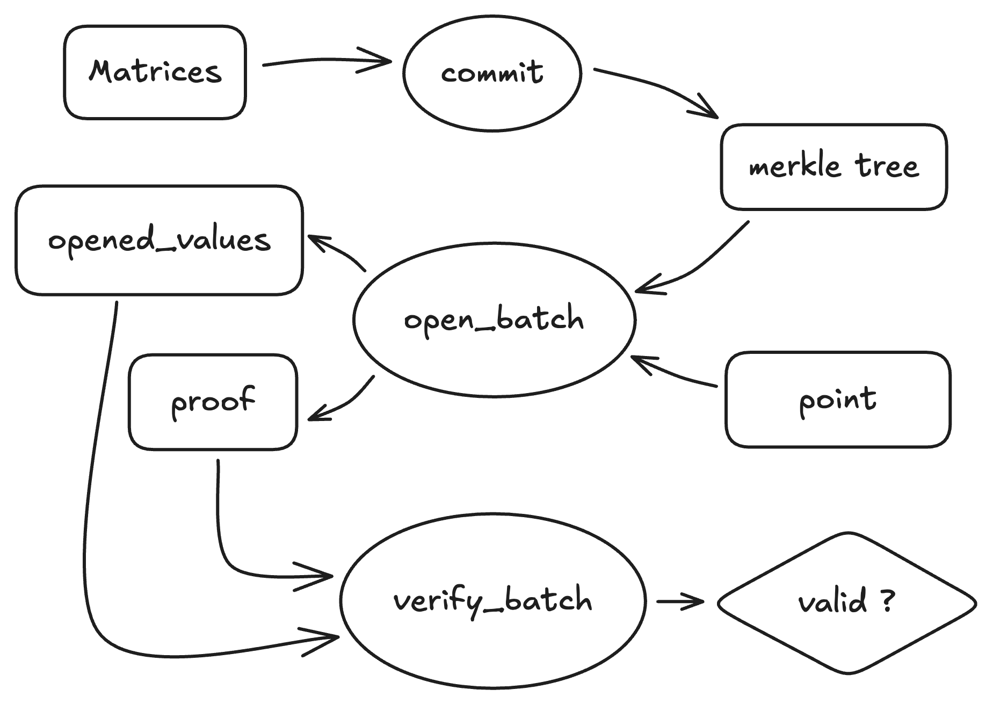

# MMCS

## Introduction

MMCS is a vector commitment scheme that is based on the merkle tree we introduced before. It is an optimized version of merkle tree commitment scheme.

The flow chart of MMCS is as follows:



<center>figure 1: flow chart of mmcs</center><br>

## Usage

```rust,ignore
# fn main() {
    let mut rng = thread_rng();
    let perm = Perm::new_from_rng_128(
        Poseidon2ExternalMatrixGeneral,
        DiffusionMatrixBabyBear::default(),
        &mut rng,
    );
    let hash = MyHash::new(perm.clone());
    let compress = MyCompress::new(perm);
    let mmcs = MyMmcs::new(hash, compress);

    // 4 mats with 1000 rows, 8 columns
    let large_mats = (0..4).map(|_| RowMajorMatrix::<F>::rand(&mut thread_rng(), 1000, 8));
    let large_mat_dims = (0..4).map(|_| Dimensions {
        height: 1000,
        width: 8,
    });

    // 5 mats with 70 rows, 8 columns
    let medium_mats = (0..5).map(|_| RowMajorMatrix::<F>::rand(&mut thread_rng(), 70, 8));
    let medium_mat_dims = (0..5).map(|_| Dimensions {
        height: 70,
        width: 8,
    });

    // 6 mats with 8 rows, 8 columns
    let small_mats = (0..6).map(|_| RowMajorMatrix::<F>::rand(&mut thread_rng(), 8, 8));
    let small_mat_dims = (0..6).map(|_| Dimensions {
        height: 8,
        width: 8,
    });

    let (commit, prover_data) = mmcs.commit(
        large_mats
            .chain(medium_mats)
            .chain(small_mats)
            .collect_vec(),
    );

    // open the 6th row of each matrix and verify
    let (opened_values, proof) = mmcs.open_batch(6, &prover_data);
    mmcs.verify_batch(
        &commit,
        &large_mat_dims
            .chain(medium_mat_dims)
            .chain(small_mat_dims)
            .collect_vec(),
        6,
        &opened_values,
        &proof,
    )
    .expect("expected verification to succeed");
# }
```

Now we can read some code to see how this is implemented.

## Trait Mmcs

First we define a trait that the Merkle Tree should implement.

```rust,ignore
/// A "Mixed Matrix Commitment Scheme" (MMCS) is a generalization of a vector commitment scheme.
///
/// It supports committing to matrices and then opening rows. It is also batch-oriented; one can commit
/// to a batch of matrices at once even if their widths and heights differ.
///
/// When a particular row index is opened, it is interpreted directly as a row index for matrices
/// with the largest height. For matrices with smaller heights, some bits of the row index are
/// removed (from the least-significant side) to get the effective row index. These semantics are
/// useful in the FRI protocol. See the documentation for `open_batch` for more details.
pub trait Mmcs<T: Send + Sync>: Clone {
    type ProverData<M>;
    type Commitment: Clone + Serialize + DeserializeOwned;
    type Proof: Clone + Serialize + DeserializeOwned;
    type Error: Debug;

    // We define operations here

}
```

We put a series of methods that the Merkle Tree should implement.

There are three methods to commit to a Merkle Tree.

- `commit` method is used to commit a vector of matrices to a Merkle Tree.
- `commit_matrix` method is used to commit a single matrix to a Merkle Tree, which calls the `commit` method.
- `commit_vec` method is used to commit a vector of elements to a Merkle Tree, which calls the `commit_matrix` method.

```rust,ignore
    fn commit<M: Matrix<T>>(&self, inputs: Vec<M>) -> (Self::Commitment, Self::ProverData<M>);

    fn commit_matrix<M: Matrix<T>>(&self, input: M) -> (Self::Commitment, Self::ProverData<M>) {
        self.commit(vec![input])
    }

    fn commit_vec(&self, input: Vec<T>) -> (Self::Commitment, Self::ProverData<RowMajorMatrix<T>>)
    where
        T: Clone + Send + Sync,
    {
        self.commit_matrix(RowMajorMatrix::new_col(input))
    }
```

An `open_batch` method used to open a batch of rows from committed matrices.

```rust,ignore
    /// Opens a batch of rows from committed matrices
    /// returns `(openings, proof)`
    /// where `openings` is a vector whose `i`th element is the `j`th row of the ith matrix `M[i]`,
    /// and `j = index >> (log2_ceil(max_height) - log2_ceil(M[i].height))`.
    fn open_batch<M: Matrix<T>>(
        &self,
        index: usize,
        prover_data: &Self::ProverData<M>,
    ) -> (Vec<Vec<T>>, Self::Proof);
```

There are three functions helping us to get informations about matrices committed to the Merkle Tree.

- `get_matrices` method is used to get the matrices that were committed to.
- `get_matrix_heights` method is used to get the heights of the matrices that were committed to.
- `get_max_height` method is used to get the largest height of the matrices that were committed to.

```rust,ignore
    /// Get the matrices that were committed to.
    fn get_matrices<'a, M: Matrix<T>>(&self, prover_data: &'a Self::ProverData<M>) -> Vec<&'a M>;

    fn get_matrix_heights<M: Matrix<T>>(&self, prover_data: &Self::ProverData<M>) -> Vec<usize> {
        self.get_matrices(prover_data)
            .iter()
            .map(|matrix| matrix.height())
            .collect()
    }

    /// Get the largest height of any committed matrix.
    fn get_max_height<M: Matrix<T>>(&self, prover_data: &Self::ProverData<M>) -> usize {
        self.get_matrix_heights(prover_data)
            .into_iter()
            .max()
            .unwrap_or_else(|| panic!("No committed matrices?"))
    }
```

The last method we needed is `verify_batch` method that used to batch verify the openings of commitments.

```rust,ignore
    /// Verify a batch opening.
    /// `index` is the row index we're opening for each matrix, following the same
    /// semantics as `open_batch`.
    /// `dimensions` is a slice whose ith element is the dimensions of the matrix being opened
    /// in the ith opening
    fn verify_batch(
        &self,
        commit: &Self::Commitment,
        dimensions: &[Dimensions],
        index: usize,
        opened_values: &[Vec<T>],
        proof: &Self::Proof,
    ) -> Result<(), Self::Error>;
```

## Merkle Tree

First we want to implement the `Mmcs` trait, so we need to define the structure `MerkleTreeMmcs`.

```rust,ignore
/// A vector commitment scheme backed by a `MerkleTree`.
///
/// Generics:
/// - `P`: a leaf value
/// - `PW`: an element of a digest
/// - `H`: the leaf hasher
/// - `C`: the digest compression function
#[derive(Copy, Clone, Debug)]
pub struct MerkleTreeMmcs<P, PW, H, C, const DIGEST_ELEMS: usize> {
    /// Neil: the leaf hasher
    hash: H,
    /// Neil: the compression function for non-leaf nodes
    compress: C,
    _phantom: PhantomData<(P, PW)>,
}
```

Then we define the constructor of `MerkleTreeMmcs`.

```rust,ignore
/// Neil: Constructor for MerkleTreeMmcs
impl<P, PW, H, C, const DIGEST_ELEMS: usize> MerkleTreeMmcs<P, PW, H, C, DIGEST_ELEMS> {
    /// Neil: Constructor for MerkleTreeMmcs
    /// 
    /// # Arguments
    /// 
    /// * `hash` - Hash function used to hash raw data into digests.
    /// * `compress` - Hash function used to compress digests.
    pub const fn new(hash: H, compress: C) -> Self {
        Self {
            hash,
            compress,
            _phantom: PhantomData,
        }
    }
}
```

We implement the trait `Mmcs` for `MerkleTreeMmcs`.

```rust, ignore
impl<P, PW, H, C, const DIGEST_ELEMS: usize> Mmcs<P::Value>
    for MerkleTreeMmcs<P, PW, H, C, DIGEST_ELEMS>
where
    P: PackedValue,
    PW: PackedValue,
    H: CryptographicHasher<P::Value, [PW::Value; DIGEST_ELEMS]>,
    H: CryptographicHasher<P, [PW; DIGEST_ELEMS]>,
    H: Sync,
    C: PseudoCompressionFunction<[PW::Value; DIGEST_ELEMS], 2>,
    C: PseudoCompressionFunction<[PW; DIGEST_ELEMS], 2>,
    C: Sync,
    PW::Value: Eq,
    [PW::Value; DIGEST_ELEMS]: Serialize + for<'de> Deserialize<'de>,
{
    type ProverData<M> = MerkleTree<P::Value, PW::Value, M, DIGEST_ELEMS>;
    type Commitment = Hash<P::Value, PW::Value, DIGEST_ELEMS>;
    type Proof = Vec<[PW::Value; DIGEST_ELEMS]>;
    type Error = MerkleTreeError;

    // Methods are implemented here
}
```

Implement the `commit` method, which is used to commit a vector of matrices to a Merkle Tree.

```rust,ignore
    /// Neil: Commit a vector of matrices to a merkle tree
    ///
    /// # Arguments
    /// * `inputs` - A vector of matrices to be committed
    ///
    /// # Returns
    /// A tuple containing the commitment and the prover data.
    fn commit<M: Matrix<P::Value>>(
        &self,
        inputs: Vec<M>,
    ) -> (Self::Commitment, Self::ProverData<M>) {
        // Neil: construct the merkle tree of the given matrices
        //       we'll dive into the implementation of MerkleTree later
        let tree = MerkleTree::new::<P, PW, H, C>(&self.hash, &self.compress, inputs);
        // Neil: get the root of the merkle tree
        let root = tree.root();
        (root, tree)
    }
```

Implement the `open_batch` method, which is used to open a batch of rows from committed matrices.

```rust,ignore
    /// Neil: Open a batch of matrices at a given index in the merkle tree
    ///
    /// # Arguments
    /// * `index` - The index of the batch to open
    /// * `prover_data` - The prover data for the merkle tree
    ///
    /// # Returns
    /// A tuple containing the leaves data and merkle paths
    fn open_batch<M: Matrix<P::Value>>(
        &self,
        index: usize,
        prover_data: &MerkleTree<P::Value, PW::Value, M, DIGEST_ELEMS>,
    ) -> (Vec<Vec<P::Value>>, Vec<[PW::Value; DIGEST_ELEMS]>) {
        let max_height = self.get_max_height(prover_data);
        let log_max_height = log2_ceil_usize(max_height);

        // Neil: get the leaf data from the merkle tree
        let openings = prover_data
            .leaves
            .iter()
            .map(|matrix| {
                // Neil: 首先将 index 右移 bits_reduced 位
                //      因为 index 是范围为 0..1<<log_max_height 的随机数
                //      本轮 query 需要的随机数范围为 0..1<<log2_height
                let log2_height = log2_ceil_usize(matrix.height());
                let bits_reduced = log_max_height - log2_height;
                let reduced_index = index >> bits_reduced;
                // Neil: get the reduced_index row of the matrix
                matrix.row(reduced_index).collect()
            })
            .collect_vec();

        // Neil: get the merkle path of the given index
        let proof: Vec<_> = (0..log_max_height)
            .map(|i| prover_data.digest_layers[i][(index >> i) ^ 1])
            .collect();

        (openings, proof)
    }
```

Implement `get_matrices` method, which is used to get the matrices that were committed to.

```rust,ignore
    /// Neil: get the matrices from the merkle tree
    /// 
    /// # Arguments
    /// * `prover_data` - The prover data for the merkle tree
    /// 
    /// # Returns
    /// A vector of matrices that were committed to.
    fn get_matrices<'a, M: Matrix<P::Value>>(
        &self,
        prover_data: &'a Self::ProverData<M>,
    ) -> Vec<&'a M> {
        prover_data.leaves.iter().collect()
    }
```

Implement `verify_batch` method, which is used to verify a batch opening.

```rust,ignore
    /// Neil: verifier 批量验证 commitment
    ///
    /// # Arguments
    /// * `commit` - commitment to be verified
    /// * `dimensions` - dimensions of the matrices to be verified
    /// * `index` - index of the query point
    /// * `opened_values` - opened values of the query point
    /// * `proof` - proof of the query point
    ///
    /// # Returns
    /// * Ok(()) if the commitment is valid
    /// * Err(RootMismatch) if the commitment is invalid
    fn verify_batch(
        &self,
        commit: &Self::Commitment,
        dimensions: &[Dimensions],
        mut index: usize,
        opened_values: &[Vec<P::Value>],
        proof: &Self::Proof,
    ) -> Result<(), Self::Error> {
        // Check that the openings have the correct shape.
        if dimensions.len() != opened_values.len() {
            return Err(WrongBatchSize);
        }

        // TODO: Disabled for now since TwoAdicFriPcs and CirclePcs currently pass 0 for width.
        // for (dims, opened_vals) in dimensions.iter().zip(opened_values) {
        //     if opened_vals.len() != dims.width {
        //         return Err(WrongWidth);
        //     }
        // }

        // TODO: Disabled for now, CirclePcs sometimes passes a height that's off by 1 bit.
        let max_height = dimensions.iter().map(|dim| dim.height).max().unwrap();
        let log_max_height = log2_ceil_usize(max_height);
        if proof.len() != log_max_height {
            return Err(WrongHeight {
                max_height,
                num_siblings: proof.len(),
            });
        }

        // Neil: sort the 'dimensions' by height in descending order
        let mut heights_tallest_first = dimensions
            .iter()
            .enumerate()
            .sorted_by_key(|(_, dims)| Reverse(dims.height))
            .peekable();

        // Neil: get the height of the tallest matrix
        let mut curr_height_padded = heights_tallest_first
            .peek()
            .unwrap()
            .1
            .height
            .next_power_of_two();

        // Neil: root 是 merkle path 上某个子树的根节点哈希值，初始值为叶子结点 opened_values
        let mut root = self.hash.hash_iter_slices(
            heights_tallest_first
                .peeking_take_while(|(_, dims)| {
                    dims.height.next_power_of_two() == curr_height_padded
                })
                .map(|(i, _)| opened_values[i].as_slice()),
        );

        // Neil: 遍历 merkle path 上的所有节点
        for &sibling in proof.iter() {
            let (left, right) = if index & 1 == 0 {
                (root, sibling)
            } else {
                (sibling, root)
            };

            // Neil: 计算 root 所在子树的根节点哈希值
            root = self.compress.compress([left, right]);
            index >>= 1;
            curr_height_padded >>= 1;

            // Neil: get the next height of the matrices
            let next_height = heights_tallest_first
                .peek()
                .map(|(_, dims)| dims.height)
                .filter(|h| h.next_power_of_two() == curr_height_padded);
            // Neil: 如果存在 height 为 curr_height_padded 的矩阵，那么需要将该矩阵和当前 root compress 为新的 root
            if let Some(next_height) = next_height {
                let next_height_openings_digest = self.hash.hash_iter_slices(
                    heights_tallest_first
                        .peeking_take_while(|(_, dims)| dims.height == next_height)
                        .map(|(i, _)| opened_values[i].as_slice()),
                );

                // Neil: 将当前 root 和高度为 next_height 的 matrices 压缩为新的 root
                root = self.compress.compress([root, next_height_openings_digest]);
            }
        }

        // Neil: if the root is the same as the commitment, then the commitment is valid
        if commit == &root {
            Ok(())
        } else {
            Err(RootMismatch)
        }
    }
```