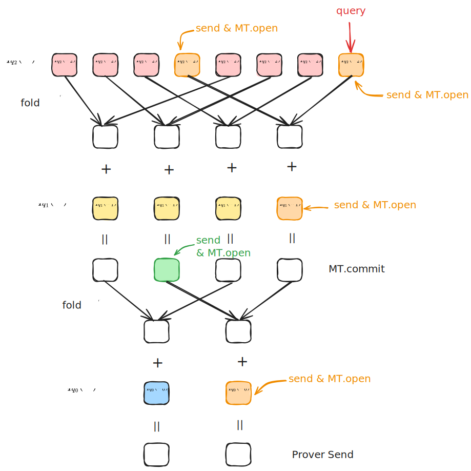
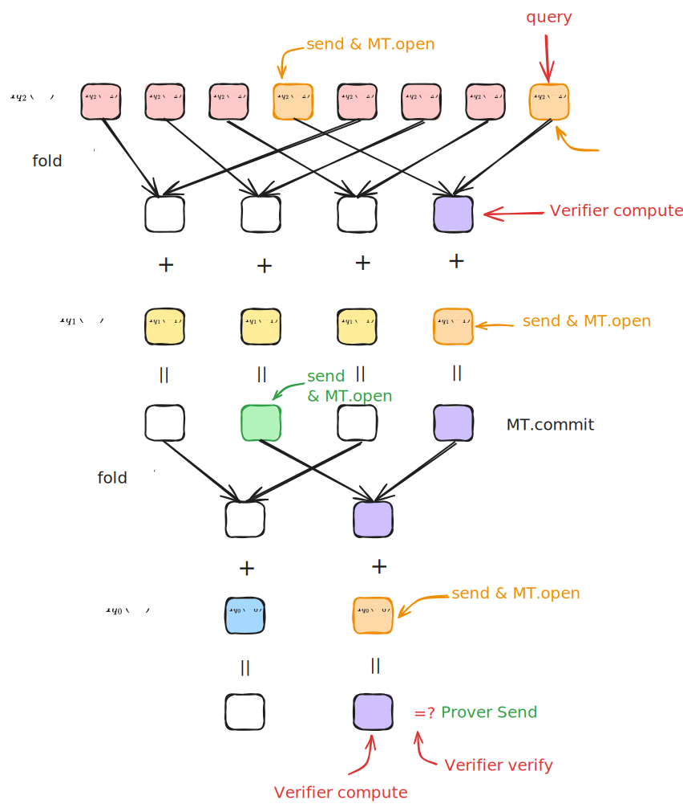

# Zeromorph-PCS: Integration with FRI

- Jade Xie <jade@secbit.io>
- Yu Guo <yu.guo@secbit.io>

In our previous article, we introduced how the zeromorph protocol can be integrated with KZG to create a Polynomial Commitment Scheme (PCS) for multilinear polynomials. This article discusses how the zeromorph protocol can be integrated with FRI to form another PCS.

## Integration with FRI

As previously explained, the zeromorph protocol ultimately reduces to proving a key equation:

$$
\hat{f}(X) - v\cdot\Phi_n(X) = \sum_{k = 0}^{n - 1} \Big(X^{2^k}\cdot \Phi_{n-k-1}(X^{2^{k+1}}) - u_k\cdot\Phi_{n-k}(X^{2^k})\Big)\cdot \hat{q}_k(X)
$$

Additionally, to prevent cheating by the Prover, the quotient polynomials $\hat{q}_k(X)$ must have degrees less than $2^k$.

To prove that the equation holds, the Verifier can randomly select a point $X = \zeta$ and ask the Prover to provide the values of $\hat{f}(\zeta)$ and $\hat{q}_k(\zeta)$, allowing the Verifier to check whether the following equation holds:

$$
\hat{f}(\zeta) - v\cdot\Phi_n(\zeta) = \sum_{k = 0}^{n - 1} \Big(\zeta^{2^k}\cdot \Phi_{n-k-1}(\zeta^{2^{k+1}}) - u_k\cdot\Phi_{n-k}(\zeta^{2^k})\Big)\cdot \hat{q}_k(\zeta)
$$

When integrating zeromorph with the FRI protocol, we can use FRI's PCS to provide the values of $\hat{f}(\zeta)$ and $\hat{q}_k(\zeta)$, and employ FRI's low degree test to prove that $\deg(\hat{q_k}) < 2^k$.

For example, if the Prover wants to prove the correctness of the provided value $\hat{f}(\zeta)$. Proving this value is correct is equivalent to proving that the quotient polynomial

$$
\frac{\hat{f}(X) - \hat{f}(\zeta)}{X - \zeta}
$$

exists. For this quotient polynomial to exist, its degree must be less than $2^{n} - 1$. To integrate with the FRI protocol for low degree testing, the degree needs to be aligned to a power of 2, requiring a degree correction. The Verifier can provide a random number $\lambda$, and we define:

$$
q_{\hat{f}_{\zeta}}(X) = \frac{\hat{f}(X) - \hat{f}(\zeta)}{X - \zeta} + \lambda \cdot X \cdot \frac{\hat{f}(X) - \hat{f}(\zeta)}{X - \zeta}
$$

Then we use the FRI protocol to prove that this quotient polynomial has degree less than $2^n$.

### Commitment Phase

To commit to a multilinear extension (MLE) polynomial with $n$ variables:

$$
\tilde{f}(X_0, X_1, \ldots, X_{n-1}) = \sum_{i=0}^{N-1} a_i \cdot \overset{\sim}{eq}(\mathsf{bits}(i), (X_0, X_1, \ldots, X_{n-1}))
$$

We first map its values on the hypercube $(a_0, \ldots, a_{N - 1})$ to a univariate polynomial $\hat{f}(X)$:

$$
\hat{f}(X) = a_0 + a_1 X + \cdots + a_{N-1} X^{N - 1}
$$

For the FRI protocol, we select a multiplicative subgroup $D = D_0$ in field $\mathbb{F}$ with size equal to a power of 2, where:

$$
D_n \subseteq D_{n - 1} \subseteq \ldots \subseteq D_0
$$

with $|D_{i - 1}|/|D_{i}| = 2$, and rate parameter $\rho = N / |D_0|$. In the following protocol, we describe folding $n$ times, resulting in a constant polynomial. In practice, we might fold to a polynomial with a small degree, with slight protocol adjustments. The FRI commitment to function $\hat{f}$ is a commitment to the Reed-Solomon encoding of $\hat{f}(X)$ over $D$:

$$
\mathsf{cm}(\hat{f}(X)) = \mathsf{cm}([\hat{f}(x)|_{x \in D}])
$$

In implementation, a Merkle tree is typically used to commit to $[\hat{f}(x)|_{x \in D}]$:

$$
\mathsf{cm}(\hat{f}(X)) = \mathsf{MT.Commit}([\hat{f}(x)|_{x \in D}])
$$

The Prover sends the root hash of this Merkle tree as the commitment to $[\hat{f}(x)|_{x \in D}]$.

### Evaluation Proof Protocol

#### Common Inputs

- Commitment to MLE polynomial $\tilde{f}$: $\mathsf{cm}([[\tilde{f}]]_n)$
- Evaluation point $\mathbf{u}=(u_0, u_1, \ldots, u_{n-1})$
- Evaluation result $v = \tilde{f}(\mathbf{u})$
- Rate parameter: $\rho$
- FRI low degree test query repetition parameter: $l$ (in practice, $l$ depends on security parameters, security assumptions, and rate)
- Multiplicative subgroups for FRI encoding: $D, D^{(0)}, \ldots, D^{(n - 1)}$

#### Witness

- Point value vector of MLE polynomial $\tilde{f}$ on the $n$-dimensional HyperCube: $\mathbf{a} = (a_0, a_1, \ldots, a_{2^n-1})$

#### Round 1

Prover sends commitments to remainder polynomials:

- Compute $n$ remainder MLE polynomials $\{\tilde{q}_k\}_{k=0}^{n-1}$, satisfying:

$$
\tilde{f}(X_0,X_1,\ldots, X_{n-1}) - v = \sum_{k=0}^{n-1} (X_k-u_k) \cdot \tilde{q}_k(X_0,X_1,\ldots, X_{k-1})
$$

- Construct the univariate polynomials corresponding to the remainder MLE polynomials: $\hat{q}_k=[[\tilde{q}_k]]_k, \quad 0 \leq k < n$
- Compute and send their commitments: $\mathsf{cm}(\hat{q}_0), \mathsf{cm}(\hat{q}_1), \ldots, \mathsf{cm}(\hat{q}_{n-1})$, where these commitments are FRI commitments to $\hat{q}_0, \ldots, \hat{q}_{n - 1}$ with multiplicative subgroup $D^{(k)} = D^{(k)}_0$ for $\hat{q}_k$:

$$
\mathsf{cm}(\hat{q}_k(X)) = \mathsf{cm}([\hat{q}_k(x)|_{x \in D^{(k)}}]) = \mathsf{MT.commit}([\hat{q}_k(x)|_{x \in D^{(k)}}])
$$

where $|D^{(k)}| = 2^k / \rho$.

#### Round 2

1. Verifier sends random value $\zeta \stackrel{\$}{\leftarrow} \mathbb{F} \setminus D$
2. Prover computes and sends $\hat{f}(\zeta)$
3. Prover computes and sends $\hat{q}_k(\zeta), \, 0 \le k < n$.

#### Round 3

1. Verifier sends random value $\lambda \stackrel{\$}{\leftarrow} \mathbb{F}$
2. Prover computes:

$$
q_{f_\zeta}(X) = \frac{\hat{f}(X) - \hat{f}(\zeta)}{X - \zeta} + \lambda \cdot X \cdot \frac{\hat{f}(X) - \hat{f}(\zeta)}{X - \zeta}
$$

at points in $D$:

$$
[q_{f_\zeta}(x)|_{x \in D}] = \big[\frac{\hat{f}(x) - \hat{f}(\zeta)}{x - \zeta} + \lambda \cdot x \cdot \frac{\hat{f}(x) - \hat{f}(\zeta)}{x - \zeta}\big|_{x \in D} \big]
$$

3. For $0 \le k < n$, Prover computes:

$$
q_{\hat{q}_k}(X) = \frac{\hat{q_k}(X) - \hat{q}_k(\zeta)}{X - \zeta} + \lambda \cdot X \cdot \frac{\hat{q_k}(X) - \hat{q}_k(\zeta)}{X - \zeta}
$$

at points in $D^{(k)}$.

#### Round 4

Prover and Verifier engage in the FRI protocol's low degree test to prove that $q_{f_\zeta}(X)$ has degree less than $2^n$:

$$
\pi_{q_{f_\zeta}} \leftarrow \mathsf{FRI.LDT}(q_{f_\zeta}(X), 2^n)
$$

This involves $n$ rounds of interaction, folding the original polynomial to a constant polynomial:

- Define $q_{f_\zeta}^{(0)}(x)|_{x \in D} := q_{f_\zeta}(x)|_{x \in D}$
- For $i = 1,\ldots, n$:
  - Verifier sends random value $\alpha^{(i)}$
  - For any $y \in D_i$, find $x \in D_{i - 1}$ such that $y = x^2$, Prover computes:

  $$
    q_{f_\zeta}^{(i)}(y) = \frac{q_{f_\zeta}^{(i - 1)}(x) + q_{f_\zeta}^{(i - 1)}(-x)}{2} + \alpha^{(i)} \cdot \frac{q_{f_\zeta}^{(i - 1)}(x) - q_{f_\zeta}^{(i - 1)}(-x)}{2x}
  $$

  - If $i < n$, Prover sends the Merkle Tree commitment to $[q_{f_\zeta}^{(i)}(x)|_{x \in D_{i}}]$:
  
  $$
  \mathsf{cm}(q_{f_\zeta}^{(i)}(X)) = \mathsf{MT.commit}([q_{f_\zeta}^{(i)}(x)|_{x \in D_{i}}])
  $$

  - If $i = n$, Prover selects any $x_0 \in D_{n}$ and sends the value $q_{f_\zeta}^{(i)}(x_0)$.

> 📝 **Notes**
>
> If the folding count $r < n$, the final result won't be a constant polynomial. In this case, the Prover would send a Merkle Tree commitment in round $r$ rather than a single value.

#### Round 5

This round continues the FRI protocol's low degree test query phase. The Verifier performs $l$ repeated queries, each time randomly selecting a value from $D_0$ and asking the Prover to send the values from each folding round along with their Merkle Paths to verify the correctness of each folding:

Repeat $l$ times:
- Verifier randomly selects $s^{(0)} \stackrel{\$}{\leftarrow} D_0$ 
- Prover sends $\hat{f}(s^{(0)}), \hat{f}(- s^{(0)})$ with their Merkle Paths:
  
  $$
  \{(\hat{f}(s^{(0)}), \pi_{\hat{f}}(s^{(0)}))\} \leftarrow \mathsf{MT.open}([\hat{f}(x)|_{x \in D_0}], s^{(0)})
  $$

  $$
  \{(\hat{f}(-s^{(0)}), \pi_{\hat{f}}(-s^{(0)}))\} \leftarrow \mathsf{MT.open}([\hat{f}(x)|_{x \in D_0}], -s^{(0)})
  $$
- Prover calculates $s^{(1)} = (s^{(0)})^2$ 
- For $i = 1, \ldots, n - 1$:
  - Prover sends $q_{f_\zeta}^{(i)}(s^{(i)}), q_{f_\zeta}^{(i)}(-s^{(i)})$ with their Merkle Paths:
  
  $$
  \{(q_{f_\zeta}^{(i)}(s^{(i)}), \pi_{q_{f_\zeta}^{(i)}}(s^{(i)}))\} \leftarrow \mathsf{MT.open}([q_{f_\zeta}^{(i)}(x)|_{x \in D_i}], s^{(i)})
  $$

  $$
  \{(q_{f_\zeta}^{(i)}(-s^{(i)}), \pi_{q_{f_\zeta}}^{(i)}(-s^{(i)}))\} \leftarrow \mathsf{MT.open}([q_{f_\zeta}^{(i)}(x)|_{x \in D_i}], -s^{(i)})
  $$
  - Prover calculates $s^{(i + 1)} = (s^{(i)})^2$

> If the folding count $r < n$, in the final step the Prover would send $q_{f_\zeta}^{(r)}(s^{(r)})$ with its Merkle Path.

#### Round 6

1. Prover and Verifier engage in the FRI protocol's low degree test to prove that for $0 \le k < n$, $q_{\hat{q}_k}(X)$ has degree less than $2^k$:

$$
\pi_{q_{\hat{q}_k}} \leftarrow \mathsf{FRI.LDT}(q_{\hat{q}_k}(X), 2^k)
$$

This involves folding rounds until reaching a constant polynomial:

- Define $q_{\hat{q}_k}^{(0)}(x)|_{x \in D^{(k)}} := q_{f_\zeta}(x)|_{x \in D^{(k)}}$
- For $i = 1,\ldots, k$:
  - Verifier sends random value $\beta_k^{(i)}$
  - For any $y \in D_i^{(k)}$, find $x \in D_{i - 1}^{(k)}$ such that $y = x^2$, Prover computes:

  $$
    q_{\hat{q}_k}^{(i)}(y) = \frac{q_{\hat{q}_k}^{(i - 1)}(x) + q_{\hat{q}_k}^{(i - 1)}(-x)}{2} + \beta_k^{(i)} \cdot \frac{q_{\hat{q}_k}^{(i - 1)}(x) - q_{\hat{q}_k}^{(i - 1)}(-x)}{2x}
  $$
  
  - If $i < k$, Prover sends the Merkle Tree commitment to $[q_{\hat{q}_k}^{(i)}(x)|_{x \in D_i^{(k)}}]$:
  
  $$
  \mathsf{cm}(q_{\hat{q}_k}^{(i)}(X)) = \mathsf{MT.commit}([q_{\hat{q}_k}^{(i)}(x)|_{x \in D_{i}^{(k)}}])
  $$

  - If $i = k$, Prover selects any $y_0^{(k)} \in D_{n}$ and sends the value $q_{\hat{q}_k}^{(i)}(y_0^{(k)})$.

> 📝 **Notes**
>
> If the folding count $r < k$, the final result won't be a constant polynomial. In this case, the Prover would send a Merkle Tree commitment in round $r$ rather than a single value.

#### Round 7

This round continues the FRI protocol's low degree test query phase for each quotient polynomial. For each $k$, the Verifier performs $l$ repeated queries:

For $k = 0, \ldots, n - 1$, repeat $l$ times:
- Verifier randomly selects $s_k^{(0)} \stackrel{\$}{\leftarrow} D_0^{(k)}$ 
- Prover sends $\hat{q}_k(s_k^{(0)}), \hat{q}_k(- s_k^{(0)})$ with their Merkle Paths:
  
  $$
  \{(\hat{q}_k(s_k^{(0)}), \pi_{\hat{q}_k}(s_k^{(0)}))\} \leftarrow \mathsf{MT.open}([\hat{q}_k(x)|_{x \in D_0^{(k)}}], s^{(0)})
  $$

  $$
  \{(\hat{q}_k(-s_k^{(0)}), \pi_{\hat{q}_k}(-s_k^{(0)}))\} \leftarrow \mathsf{MT.open}([\hat{q}_k(x)|_{x \in D_0^{(k)}}], -s^{(0)})
  $$
  
- Prover calculates $s_k^{(1)} = (s_k^{(0)})^2$ 
- For $i = 1, \ldots, k - 1$:
  - Prover sends $q_{\hat{q}_k}^{(i)}(s_k^{(i)}), q_{\hat{q}_k}^{(i)}(-s_k^{(i)})$ with their Merkle Paths:
  
  $$
  \{(q_{\hat{q}_k}^{(i)}(s_k^{(i)}), \pi_{q_{\hat{q}_k}^{(i)}}(s_k^{(i)}))\} \leftarrow \mathsf{MT.open}([q_{\hat{q}_k}^{(i)}(x)|_{x \in D_i^{(k)}}], s_k^{(i)})
  $$

  $$
  \{(q_{\hat{q}_k}^{(i)}(-s_k^{(i)}), \pi_{q_{\hat{q}_k}^{(i)}}(-s_k^{(i)}))\} \leftarrow \mathsf{MT.open}([q_{\hat{q}_k}^{(i)}(x)|_{x \in D_i^{(k)}}], -s_k^{(i)})
  $$
  - Prover calculates $s_k^{(i + 1)} = (s_k^{(i)})^2$

> If the folding count $r < k$, in the final step the Prover would send $q_{\hat{q}_k}^{(r)}(s^{(r)})$ with its Merkle Path.

#### Proof

The complete proof sent by the Prover is:

$$
\begin{aligned}
  \pi = \left(\mathsf{cm}(\hat{q}_0(X)), \ldots \mathsf{cm}(\hat{q}_{n - 1}(X)), \hat{f}(\zeta), \hat{q}_0(\zeta), \ldots, \hat{q}_{n - 1}(\zeta), \pi_{q_{f_\zeta}}, \pi_{q_{\hat{q}_0}}, \ldots, \pi_{q_{\hat{q}_{n - 1}}}\right)
\end{aligned}
$$

Using the notation $\{\cdot\}^l$ to represent the proofs generated by the $l$ repeated queries in the FRI low degree test query phase, the $n + 1$ proofs for the FRI low degree tests are:

$$
\begin{aligned}
  \pi_{q_{f_\zeta}} = &  ( \mathsf{cm}(q_{f_\zeta}^{(1)}(X)), \ldots, \mathsf{cm}(q_{f_\zeta}^{(n - 1)}(X)),q_{f_\zeta}^{(n)}(x_0),  \\
  & \, \{\hat{f}(s^{(0)}), \pi_{\hat{f}}(s^{(0)}), \hat{f}(- s^{(0)}), \pi_{\hat{f}}(-s^{(0)}), \\
  & \quad q_{f_\zeta}^{(1)}(s^{(1)}), \pi_{q_{f_\zeta}^{(1)}}(s^{(1)}),q_{f_\zeta}^{(1)}(-s^{(1)}), \pi_{q_{f_\zeta}^{(1)}}(-s^{(1)}), \ldots, \\
  & \quad q_{f_\zeta}^{(n - 1)}(s^{(n - 1)}), \pi_{q_{f_\zeta}^{(n - 1)}}(s^{(n - 1)}),q_{f_\zeta}^{(n - 1)}(-s^{(n - 1)}), \pi_{q_{f_\zeta}^{(i)}}(-s^{(n - 1)})\}^l)
\end{aligned}
$$

For $k = 0, \ldots, n - 1$:

$$
\begin{aligned}
  \pi_{q_{\hat{q}_k}} = &  ( \mathsf{cm}(q_{\hat{q}_k}^{(1)}(X)), \ldots, \mathsf{cm}(q_{\hat{q}_k}^{(k - 1)}(X)),q_{\hat{q}_k}^{(k)}(y_0^{(k)}),  \\
  & \, \{\hat{q}_k(s_k^{(0)}), \pi_{\hat{q}_k}(s_k^{(0)}), \hat{q}_k(-s_k^{(0)}), \pi_{\hat{q}_k}(-s_k^{(0)}),\\
  & \quad q_{\hat{q}_k}^{(1)}(s_k^{(1)}), \pi_{q_{\hat{q}_k}^{(1)}}(s_k^{(1)}), q_{\hat{q}_k}^{(1)}(-s_k^{(1)}), \pi_{q_{\hat{q}_k}^{(1)}}(-s_k^{(1)}) \ldots, \\
  & \quad q_{\hat{q}_k}^{(k - 1)}(s_k^{(k-1)}), \pi_{q_{\hat{q}_k}^{(k - 1)}}(s_k^{(k - 1)}), q_{\hat{q}_k}^{(k - 1)}(-s_k^{(k - 1)}), \pi_{q_{\hat{q}_k}^{(k - 1)}}(-s_k^{(k - 1)})\}^l)
\end{aligned}
$$

#### Verification

The Verifier performs the following steps:

1. Verify the low degree test proof for $q_{f_\zeta}(X)$:

$$
\mathsf{FRI.LDT.verify}(\pi_{q_{f_\zeta}}, 2^n) \stackrel{?}{=} 1
$$

The specific verification process repeats $l$ times:
- Verify the correctness of $\hat{f}(s^{(0)}), \hat{f}(-s^{(0)})$:

$$
\mathsf{MT.verify}(\mathsf{cm}(\hat{f}(X)), \hat{f}(s^{(0)}), \pi_{\hat{f}}(s^{(0)})) \stackrel{?}{=} 1
$$

$$
\mathsf{MT.verify}(\mathsf{cm}(\hat{f}(X)), \hat{f}(-s^{(0)}), \pi_{\hat{f}}(-s^{(0)})) \stackrel{?}{=} 1
$$

- Verifier calculates:
  $$
  q_{f_\zeta}^{(0)}(s^{(0)}) = (1 + \lambda \cdot s^{(0)}) \cdot \frac{\hat{f}(s^{(0)}) - \hat{f}(\zeta)}{s^{(0)} - \zeta} 
  $$

  $$
  q_{f_\zeta}^{(0)}(- s^{(0)}) = (1 - \lambda \cdot s^{(0)}) \cdot\frac{\hat{f}(-s^{(0)}) - \hat{f}(\zeta)}{-s^{(0)} - \zeta}
  $$

- Verify the correctness of $q_{f_\zeta}^{(1)}(s^{(1)}), q_{f_\zeta}^{(1)}(-s^{(1)})$:

$$
\mathsf{MT.verify}(\mathsf{cm}(q_{f_\zeta}^{(1)}(X)), q_{f_\zeta}^{(1)}(s^{(1)}), \pi_{q_{f_\zeta}^{(1)}}(s^{(1)})) \stackrel{?}{=} 1
$$

$$
\mathsf{MT.verify}(\mathsf{cm}(q_{f_\zeta}^{(1)}(X)), q_{f_\zeta}^{(1)}(-s^{(1)}), \pi_{q_{f_\zeta}^{(1)}}(-s^{(1)})) \stackrel{?}{=} 1
$$

- Verify the correctness of the first folding:

$$
q_{f_\zeta}^{(1)}(s^{(1)}) \stackrel{?}{=} \frac{q_{f_\zeta}^{(0)}(s^{(0)}) + q_{f_\zeta}^{(0)}(- s^{(0)})}{2} + \alpha^{(1)} \cdot \frac{q_{f_\zeta}^{(0)}(s^{(0)}) - q_{f_\zeta}^{(0)}(- s^{(0)})}{2 \cdot s^{(0)}}
$$

- For $i = 2, \ldots, n - 1$:
  - Verify the correctness of $q_{f_\zeta}^{(i)}(s^{(i)}), q_{f_\zeta}^{(i)}(-s^{(i)})$:

  $$
  \mathsf{MT.verify}(\mathsf{cm}(q_{f_\zeta}^{(i)}(X)), q_{f_\zeta}^{(i)}(s^{(i)}), \pi_{q_{f_\zeta}^{(i)}}(s^{(i)})) \stackrel{?}{=} 1
  $$

  $$
  \mathsf{MT.verify}(\mathsf{cm}(q_{f_\zeta}^{(i)}(X)), q_{f_\zeta}^{(i)}(-s^{(i)}), \pi_{q_{f_\zeta}^{(i)}}(-s^{(i)})) \stackrel{?}{=} 1
  $$

  - Verify the correctness of the $i$-th folding:
  $$
  q_{f_\zeta}^{(i)}(s^{(i)}) \stackrel{?}{=} \frac{q_{f_\zeta}^{(i-1)}(s^{(i - 1)}) + q_{f_\zeta}^{(i - 1)}(- s^{(i - 1)})}{2} + \alpha^{(i)} \cdot \frac{q_{f_\zeta}^{(i - 1)}(s^{(i - 1)}) - q_{f_\zeta}^{(i - 1)}(- s^{(i - 1)})}{2 \cdot s^{(i - 1)}}
  $$

- Verify that the final polynomial is constant:
  $$
  q_{f_\zeta}^{(n)}(x_0) \stackrel{?}{=} \frac{q_{f_\zeta}^{(n-1)}(s^{(n - 1)}) + q_{f_\zeta}^{(n - 1)}(- s^{(n - 1)})}{2} + \alpha^{(n)} \cdot \frac{q_{f_\zeta}^{(n - 1)}(s^{(n - 1)}) - q_{f_\zeta}^{(n - 1)}(- s^{(n - 1)})}{2 \cdot s^{(n - 1)}}
  $$

2. For $k = 0, \ldots, n - 1$, verify the low degree test proof for $q_{\hat{q}_k}(X)$:

$$
\mathsf{FRI.LDT.verify}(\pi_{q_{\hat{q}_k}}, 2^k) \stackrel{?}{=} 1
$$

The specific verification process repeats $l$ times:
- Verify the correctness of $\hat{q}_k(s_k^{(0)}), \hat{q}_k(-s_k^{(0)})$:

$$
\mathsf{MT.verify}(\mathsf{cm}(\hat{q}_k(X)), \hat{q}_k(s_k^{(0)}), \pi_{\hat{q}_k}(s_k^{(0)})) \stackrel{?}{=} 1
$$

$$
\mathsf{MT.verify}(\mathsf{cm}(\hat{q}_k(X)), \hat{q}_k(-s_k^{(0)}), \pi_{\hat{q}_k}(-s_k^{(0)})) \stackrel{?}{=} 1
$$

- Verifier calculates:
  $$
  q_{\hat{q}_k}^{(0)}(s_k^{(0)}) = (1 + \lambda \cdot s_k^{(0)}) \cdot \frac{\hat{q}_k(s_k^{(0)})- \hat{q}_k(\zeta)}{s_k^{(0)} - \zeta}
  $$

  $$
  q_{\hat{q}_k}^{(0)}(-s_k^{(0)}) = (1 - \lambda \cdot s_k^{(0)}) \cdot \frac{\hat{q}_k(-s_k^{(0)})- \hat{q}_k(\zeta)}{-s_k^{(0)} - \zeta}
  $$

- Verify the correctness of $q_{\hat{q}_k}^{(1)}(s_k^{(1)}),q_{\hat{q}_k}^{(1)}(-s_k^{(1)})$:

$$
\mathsf{MT.verify}(\mathsf{cm}(q_{\hat{q}_k}^{(1)}(X)), q_{\hat{q}_k}^{(1)}(s_k^{(1)}), \pi_{q_{\hat{q}_k}^{(1)}}(s_k^{(1)})) \stackrel{?}{=} 1
$$

$$
\mathsf{MT.verify}(\mathsf{cm}(q_{\hat{q}_k}^{(1)}(X)), q_{\hat{q}_k}^{(1)}(-s_k^{(1)}), \pi_{q_{\hat{q}_k}^{(1)}}(-s_k^{(1)})) \stackrel{?}{=} 1
$$

- Verify the correctness of the first folding:

$$
q_{\hat{q}_k}^{(1)}(s_k^{(1)}) \stackrel{?}{=} \frac{q_{\hat{q}_k}^{(0)}(s_k^{(0)}) + q_{\hat{q}_k}^{(0)}(- s_k^{(0)})}{2} + \beta_k^{(1)} \cdot \frac{q_{\hat{q}_k}^{(0)}(s_k^{(0)}) - q_{\hat{q}_k}^{(0)}(- s_k^{(0)})}{2 \cdot s_k^{(0)}}
$$

- For $i = 2, \ldots, k - 1$:
  - Verify the correctness of $q_{\hat{q}_k}^{(i)}(s_k^{(i)}), q_{\hat{q}_k}^{(i)}(-s_k^{(i)})$:
  
  $$
  \mathsf{MT.verify}(\mathsf{cm}(q_{\hat{q}_k}^{(i)}(X)), q_{\hat{q}_k}^{(i)}(s_k^{(i)}), \pi_{q_{\hat{q}_k}^{(i)}}(s_k^{(i)})) \stackrel{?}{=} 1
  $$

  $$
  \mathsf{MT.verify}(\mathsf{cm}(q_{\hat{q}_k}^{(i)}(X)), q_{\hat{q}_k}^{(i)}(-s_k^{(i)}), \pi_{q_{\hat{q}_k}^{(i)}}(-s_k^{(i)})) \stackrel{?}{=} 1
  $$
  
  - Verify the correctness of the $i$-th folding:
  
  $$
  q_{\hat{q}_k}^{(i)}(s_k^{(i)}) \stackrel{?}{=} \frac{q_{\hat{q}_k}^{(i - 1)}(s_k^{(i - 1)}) + q_{\hat{q}_k}^{(i - 1)}(- s_k^{(i - 1)})}{2} + \beta_k^{(i)} \cdot \frac{q_{\hat{q}_k}^{(i - 1)}(s_k^{(i - 1)}) - q_{\hat{q}_k}^{(i - 1)}(- s_k^{(i - 1)})}{2 \cdot s_k^{(i - 1)}}
  $$
  
- Verify that the final polynomial is constant:
  
  $$
  q_{\hat{q}_k}^{(k)}(y_0^{(k)}) \stackrel{?}{=} \frac{q_{\hat{q}_k}^{(k - 1)}(s_k^{(k - 1)}) + q_{\hat{q}_k}^{(k - 1)}(- s_k^{(k - 1)})}{2} + \beta_k^{(k)} \cdot \frac{q_{\hat{q}_k}^{(k - 1)}(s_k^{(k - 1)}) - q_{\hat{q}_k}^{(k - 1)}(- s_k^{(k - 1)})}{2 \cdot s_k^{(k - 1)}}
  $$

3. Calculate $\Phi_n(\zeta)$ and $\Phi_{n - k}(\zeta^{2^k})(0 \le k < n)$:

$$
\Phi_n(\zeta) = 1 + \zeta + \zeta^2 + \ldots + \zeta^{2^n-1}
$$

$$
\Phi_{n-k}(\zeta^{2^k}) = 1 + \zeta^{2^k} + \zeta^{2\cdot 2^k} + \ldots + \zeta^{(2^{n-k}-1)\cdot 2^k}
$$

4. Verify the correctness of the following equation:

$$
\hat{f}(\zeta) - v\cdot\Phi_n(\zeta) \stackrel{?}{=} \sum_{k = 0}^{n - 1} \Big(\zeta^{2^k}\cdot \Phi_{n-k-1}(\zeta^{2^{k+1}}) - u_k\cdot\Phi_{n-k}(\zeta^{2^k})\Big)\cdot \hat{q}_k(\zeta)
$$

## Optimized Zeromorph Integration with FRI

In the protocol described above, we commit to $n$ univariate polynomials $\hat{q}_k(X)$ and provide separate FRI low degree test proofs for each. In practice, since the degree bounds of consecutive polynomials $\hat{q}_{k}(X)$ and $\hat{q}_{k - 1}(X)$ differ by a factor of 2, we can use a rolling batch technique to perform only one low degree test for all $n$ polynomials. Additionally, since the degree bounds of $\hat{f}(X)$ and $\hat{q}_{n-1}(X)$ also differ by a factor of 2, we can use the rolling batch technique from [ZLGSCLD24] to perform just one low degree test for all $n + 1$ polynomials: $\hat{f}(X), \hat{q}_{n-1}(X), \ldots, \hat{q}_{0}(X)$.

When committing to the $n$ univariate polynomials $\hat{q}_k(X)$, since the sizes of $D^{(k)}$ and $D^{(k - 1)}$ also differ by a factor of 2, we can borrow the [mmcs](https://github.com/Plonky3/Plonky3/blob/main/merkle-tree/src/mmcs.rs) structure from plonky3 to make just one commitment for all $n$ polynomials.

Let's first explain the mmcs commitment process using the example of 3 polynomials: $\hat{q}_2(X), \hat{q}_1(X), \hat{q}_0(X)$. Setting $\rho = \frac{1}{2}$, the Prover commits to:

$$
\mathsf{cm}(\hat{q}_2(X)) = [\hat{q}_2(x)|_{x\in D^{(2)}}] = \{\hat{q}_2(\omega_2^0), \hat{q}_2(\omega_2^1), \hat{q}_2(\omega_2^2), \ldots, \hat{q}_2(\omega_2^7)\} 
$$

$$
\mathsf{cm}(\hat{q}_1(X)) = [\hat{q}_1(x)|_{x\in D^{(1)}}] = \{\hat{q}_1(\omega_1^0), \hat{q}_1(\omega_1^1), \hat{q}_1(\omega_1^2), \hat{q}_1(\omega_1^3)\}
$$

$$
\mathsf{cm}(\hat{q}_0(X)) = [\hat{q}_0(x)|_{x\in D^{(0)}}] = \{\hat{q}_0(\omega_0^0), \hat{q}_0(\omega_0^1)\}
$$

where $\omega_2, \omega_1, \omega_0$ are generators of $D^{(2)}, D^{(1)}, D^{(0)}$ satisfying:

$$
(\omega_2)^8 = 1, (\omega_1)^4 = 1, (\omega_0)^2 = 1
$$

In practice, we can choose a generator $g$ of $\mathbb{F}_p^*$ and set:

$$
\omega_2 = g^{\frac{p - 1}{8}}, \omega_1 = g^{\frac{p - 1}{4}},\omega_0 = g^{\frac{p - 1}{2}}
$$

By Fermat's Little Theorem, we can verify that $(\omega_2)^8 = 1, (\omega_1)^4 = 1, (\omega_0)^2 = 1$ holds, with the relationships $\omega^2 = \omega_1, \omega_1^2 = \omega_0$.

We can see that $\mathsf{cm}(\hat{q}_2(X))$ commits to 8 values, $\mathsf{cm}(\hat{q}_1(X))$ commits to 4 values, and $\mathsf{cm}(\hat{q}_0(X))$ commits to 2 values. Using separate Merkle Trees would require 3 trees with heights 3, 2, and 1 respectively. With the mmcs structure, we can place all 14 values in a single tree of height 6.

This commitment method is denoted:

$$
\mathsf{cm}(\hat{q}_2(X), \hat{q}_1(X), \hat{q}_0(X)) = \mathsf{MMCS.commit}(\hat{q}_2(X), \hat{q}_1(X), \hat{q}_0(X))
$$

Now let's illustrate the rolling batch technique with $n = 3$ as an example. For quotient polynomials $q_{\hat{q}_2}(X), q_{\hat{q}_1}(X), q_{\hat{q}_0}(X)$, instead of providing 3 separate FRI low degree test proofs, we can use the rolling batch technique to prove their degree bounds with just one low degree test, as shown in the following diagram.

After folding, we add the value with the next $q_{\hat{q}_{i - 1}}$ and continue with FRI folding until reaching a constant polynomial.

### Commitment Phase

The commitment phase is the same as in the non-optimized protocol. To commit to an MLE polynomial with $n$ variables:

$$
\tilde{f}(X_0, X_1, \ldots, X_{n-1}) = \sum_{i=0}^{N-1} a_i \cdot \overset{\sim}{eq}(\mathsf{bits}(i), (X_0, X_1, \ldots, X_{n-1}))
$$

First map it to a univariate polynomial $\hat{f}(X)$:

$$
\hat{f}(X) = a_0 + a_1 X + \cdots + a_{N-1} X^{N - 1}
$$

with commitment:

$$
\mathsf{cm}(\hat{f}(X)) = [\hat{f}(x)|_{x \in D}]
$$

using a Merkle Tree:

$$
\mathsf{cm}(\hat{f}(X)) = \mathsf{MT.Commit}([\hat{f}(x)|_{x \in D}])
$$

### Evaluation Proof Protocol

#### Common Inputs

- Commitment to MLE polynomial $\tilde{f}$: $\mathsf{cm}([[\tilde{f}]]_n)$
- Evaluation point $\mathbf{u}=(u_0, u_1, \ldots, u_{n-1})$
- Evaluation result $v = \tilde{f}(\mathbf{u})$
- Rate parameter: $\rho$
- FRI low degree test query repetition parameter: $l$
- Multiplicative subgroups for FRI encoding: $D, D^{(0)}, \ldots, D^{(n - 1)}$

#### Witness

- Point value vector of MLE polynomial $\tilde{f}$ on the $n$-dimensional HyperCube: $\mathbf{a} = (a_0, a_1, \ldots, a_{2^n-1})$

#### Round 1

Prover sends commitments to remainder polynomials:

- Compute $n$ remainder MLE polynomials $\{\tilde{q}_k\}_{k=0}^{n-1}$, satisfying:

$$
\tilde{f}(X_0,X_1,\ldots, X_{n-1}) - v = \sum_{k=0}^{n-1} (X_k-u_k) \cdot \tilde{q}_k(X_0,X_1,\ldots, X_{k-1})
$$

- Construct the univariate polynomials corresponding to the remainder MLE polynomials: $\hat{q}_k=[[\tilde{q}_k]]_k, \quad 0 \leq k < n$
- Compute and send their commitments using the mmcs structure. First calculate the values of these polynomials on their respective domains:

$$
\{[\hat{q}_k(x)|_{x \in D^{(k)}}]\}_{k = 0}^{n - 1}
$$

where $|D^{(k)}| = 2^k / \rho$, then commit to these $(2^{n - 1} + 2^{n - 2} + \ldots + 2^0)/\rho$ values all at once using mmcs:

$$
\mathsf{cm}(\hat{q}_{n - 1}, \hat{q}_{n - 2}, \ldots, \hat{q}_0) = \mathsf{MMCS.commit}(\hat{q}_{n - 1}, \hat{q}_{n - 2}, \ldots, \hat{q}_0)
$$

#### Round 2

1. Verifier sends random value $\zeta \stackrel{\$}{\leftarrow} \mathbb{F} \setminus D$
2. Prover computes and sends $\hat{f}(\zeta)$
3. Prover computes and sends $\{\hat{q}_k(\zeta)\}_{k = 0}^{n - 1}$.

#### Round 3

1. Verifier sends random value $\lambda \stackrel{\$}{\leftarrow} \mathbb{F}$
2. Prover computes:

$$
q_{f_\zeta}(X) = \frac{\hat{f}(X) - \hat{f}(\zeta)}{X - \zeta} + \lambda \cdot X \cdot \frac{\hat{f}(X) - \hat{f}(\zeta)}{X - \zeta}
$$

at points in $D$:

$$
[q_{f_\zeta}(x)|_{x \in D}] = \big[\frac{\hat{f}(x) - \hat{f}(\zeta)}{x - \zeta} + \lambda \cdot x \cdot \frac{\hat{f}(x) - \hat{f}(\zeta)}{x - \zeta}\big|_{x \in D} \big]
$$

3. For $0 \le k < n$, Prover computes:

$$
q_{\hat{q}_k}(X) = \frac{\hat{q_k}(X) - \hat{q}_k(\zeta)}{X - \zeta} + \lambda \cdot X \cdot \frac{\hat{q_k}(X) - \hat{q}_k(\zeta)}{X - \zeta}
$$

at points in $D^{(k)}$.

#### Round 4

Prover and Verifier engage in the FRI protocol's low degree test using the rolling batch technique to prove all quotient polynomials' degree bounds in one test. For convenience, denote:

$$
q_{\hat{q}_n}(X) := q_{f_\zeta}(X)
$$

so the low degree test proof is:

$$
\pi_{q_{\hat{q}_{n}},q_{\hat{q}_{n - 1}}, \ldots, q_{\hat{q}_{0}}} \leftarrow \mathsf{OPFRI.LDT}(q_{\hat{q}_{n}},q_{\hat{q}_{n - 1}}, \ldots, q_{\hat{q}_{0}}, 2^{n})
$$

This involves $n + 1$ rounds of interaction until reaching a constant polynomial:

1. Initialize $i = n$ and $D^{(n)} := D$. For $x \in D^{(n)}$, initialize:

$$
\mathsf{fold}^{(i)}(x) = q_{\hat{q}_{n}}(x)
$$

2. For $i = n - 1, \ldots, 0$:

- Verifier sends random value $\beta^{(i)}$

- For $y \in D^{(i)}$, find $x \in D^{(i + 1)}$ such that $x^2 = y$, Prover computes:

$$
\mathsf{fold}^{(i)}(y) = \frac{\mathsf{fold}^{(i + 1)}(x) + \mathsf{fold}^{(i + 1)}(-x)}{2} + \beta^{(i)} \cdot \frac{\mathsf{fold}^{(i + 1)}(x) - \mathsf{fold}^{(i + 1)}(-x)}{2x}
$$

- For $x \in D^{(i)}$, Prover updates $\mathsf{fold}^{(i)}(x)$:

$$
\mathsf{fold}^{(i)}(x) = \mathsf{fold}^{(i)}(x) + q_{\hat{q}_{i}}(x)
$$

- If $i > 0$:
  - Prover sends commitment to $\mathsf{fold}^{(i)}(x)$:

    $$
    \mathsf{cm}(\mathsf{fold}^{(i)}(X)) = \mathsf{MT.commit}([\mathsf{fold}^{(i)}(x)|_{x \in D^{(i)}}])
    $$
    
- If $i = 0$:
  - As the final result is a constant polynomial, Prover selects any point $y_0 \in D^{(0)}$ and sends the folded value $\mathsf{fold}^{(0)}(y_0)$.

#### Round 5

This round continues the FRI protocol's low degree test query phase. The Verifier performs $l$ repeated queries:
- Verifier randomly selects $t^{(n)} \stackrel{\$}{\leftarrow} D^{(n)}$
- Prover sends $\hat{f}(t^{(n)}), \hat{f}(- t^{(n)})$ with their Merkle Paths:
  
  $$
  \{(\hat{f}(t^{(n)}), \pi_{\hat{f}}(t^{(n)}))\} \leftarrow \mathsf{MT.open}([\hat{f}(x)|_{x \in D_0}], t^{(n)})
  $$

  $$
  \{(\hat{f}(-t^{(n)}), \pi_{\hat{f}}(-t^{(n)}))\} \leftarrow \mathsf{MT.open}([\hat{f}(x)|_{x \in D_0}], -t^{(n)})
  $$
  
- For $i = n - 1, \ldots, 1$:
  - Prover calculates $t^{(i)} = (t^{(i + 1)})^2$
  - Prover sends $\hat{q}_{i}(t^{(i)})$ and its Merkle Path:
      $$
      \{(\hat{q}_{i}(t^{(i)}), \pi_{\hat{q}_{i}}(t^{(i)}))\} \leftarrow \mathsf{MMCS.open}(\hat{q}_{i}, t^{(i)})
      $$

  - Prover sends $\mathsf{fold}^{(i)}(-t^{(i)})$ and its Merkle Path:
      $$
      \{(\mathsf{fold}^{(i)}(-t^{(i)}), \pi_{\mathsf{fold}^{(i)}}(-t^{(i)}))\} \leftarrow \mathsf{MT.open}(\mathsf{fold}^{(i)}, -t^{(i)})
      $$ 
      
- For $i = 0$:
  - Prover calculates $t^{(0)} = (t^{(1)})^2$
  - Prover sends $\hat{q}_0(t^{(0)})$ and its Merkle Path:
      $$
      \{(\hat{q}_0(t^{(0)}), \pi_{\hat{q}_0}(t^{(0)}))\} \leftarrow \mathsf{MMCS.open}(\hat{q}_0, t^{(0)})
      $$

> 📝 **Notes**
>
> For example, when querying 3 polynomials with the selected point being the last element of $q_{\hat{q}_2}(X)$, $\omega_2^7$, the Prover needs to send the values and Merkle Paths for the green portions in the diagram. The orange-bordered elements indicate that what's sent is not the value and Merkle Path of the quotient polynomial itself, but the Merkle Path of $\hat{q}_k(X)$. The Prover sends:
>
> $$
> \{\hat{q_2}(\omega_2^7), \hat{q_2}(\omega_2^3), \hat{q}_1(\omega_1^3), \mathsf{fold}^{(1)}(\omega_1^1),  \hat{q}_0(\omega_0^1)\}
> $$
>
> and their corresponding Merkle Paths.
> 
> 

#### Proof

The complete proof sent by the Prover is:

$$
\begin{aligned}
  \pi = \left(\mathsf{cm}(\hat{q}_{n - 1}, \hat{q}_{n - 2}, \ldots, \hat{q}_0), \hat{f}(\zeta), \hat{q}_0(\zeta), \ldots, \hat{q}_{n - 1}(\zeta), \pi_{q_{\hat{q}_{n}},q_{\hat{q}_{n - 1}}, \ldots, q_{\hat{q}_{0}}}\right)
\end{aligned}
$$

Using the notation $\{\cdot\}^l$ to represent the proofs generated by the $l$ repeated queries in the FRI low degree test query phase, the FRI low degree test proof is:

$$
\begin{aligned}
  \pi_{q_{\hat{q}_{n}}, \ldots, q_{\hat{q}_{0}}} = &  ( \mathsf{cm}(\mathsf{fold}^{(n - 1)}(X)), \ldots, \mathsf{cm}(\mathsf{fold}^{(1)}(X)),\mathsf{fold}^{(0)}(y_0),  \\
  & \, \{\hat{f}(t^{(n)}), \pi_{\hat{f}}(t^{(n)}), \hat{f}(- t^{(n)}), \pi_{\hat{f}}(- t^{(n)}),\\
  & \quad \hat{q}_{n - 1}(t^{(n - 1)}), \pi_{\hat{q}_{n - 1}}(t^{(n - 1)}), \mathsf{fold}^{(n - 1)}(-t^{(n - 1)}), \pi_{\mathsf{fold}^{(n - 1)}}(-t^{(n - 1)}), \ldots, \\
  & \quad \hat{q}_{1}(t^{(1)}), \pi_{\hat{q}_{1}}(t^{(1)}), \mathsf{fold}^{(1)}(-t^{(1)}), \pi_{\mathsf{fold}^{(1)}}(-t^{(1)}), \hat{q}_0(t^{(0)}), \pi_{\hat{q}_0}(t^{(0)})\}^l)
\end{aligned}
$$

#### Verification

The Verifier performs the following steps:

1. Verify the optimized FRI low degree test for $q_{f_{\zeta}}(X)$ and the $n$ quotient polynomials $\{q_{\hat{q}_k}\}_{k = 0}^{n - 1}$ all at once:

$$
\mathsf{OPFRI.verify}( \pi_{q_{\hat{q}_{n}},q_{\hat{q}_{n-1}}, \ldots, q_{\hat{q}_{0}}}, 2^{n}) \stackrel{?}{=} 1
$$

The specific verification process repeats $l$ times:

- Verify the correctness of $\hat{f}(t^{(n)}), \hat{f}(-t^{(n)})$:

$$
\mathsf{MT.verify}(\mathsf{cm}(\hat{f}(X), \hat{f}(t^{(n)}), \pi_{\hat{f}}(t^{(n)})) \stackrel{?}{=} 1
$$

$$
\mathsf{MT.verify}(\mathsf{cm}(\hat{f}(X), \hat{f}(-t^{(n)}), \pi_{\hat{f}}(-t^{(n)})) \stackrel{?}{=} 1
$$

- Verifier calculates:

$$
q_{\hat{q}_{n}}(t^{(n)}) = (1 + \lambda \cdot t^{(n)}) \cdot \frac{\hat{f}(t^{(n)}) - \hat{f}(\zeta)}{t^{(n)} - \zeta}
$$

$$
q_{\hat{q}_{n}}(-t^{(n)}) = (1 - \lambda \cdot t^{(n)}) \cdot \frac{\hat{f}(-t^{(n)}) - \hat{f}(\zeta)}{-t^{(n)} - \zeta}
$$

- Initialize the fold value:

    $$
        \mathsf{fold} = \frac{q_{\hat{q}_{n}}(t^{(n)}) + q_{\hat{q}_{n}}(-t^{(n)})}{2} + \beta^{(n - 1)} \cdot \frac{q_{\hat{q}_{n}}(t^{(n)}) - q_{\hat{q}_{n}}(-t^{(n)})}{2 \cdot t^{(n)}}
    $$

- For $i = n - 1, \ldots , 1$:
  - Verifier calculates $t^{(i)} = (t^{(i + 1)})^2$
  - Verify the correctness of $\hat{q}_{i}(t^{(i)})$:
  
      $$
      \mathsf{MMCS.verify}(\mathsf{cm}(\hat{q}_{n - 1}, \hat{q}_{n - 2}, \ldots, \hat{q}_0), \hat{q}_{i}(t^{(i)}), \pi_{\hat{q}_{i}}(t^{(i)})) \stackrel{?}{=} 1
      $$ 
      
  - Verifier calculates:
  
      $$
      q_{\hat{q}_{i}}(t^{(i)}) = (1 + \lambda \cdot t^{(i)}) \cdot \frac{\hat{q}_{i}(t^{(i)}) - \hat{q}_{i}(\zeta)}{t^{(i)} - \zeta}
      $$
      
  - Update the fold value:

    $$
    \mathsf{fold} = \mathsf{fold} + q_{\hat{q}_{i}}(t^{(i)})
    $$ 
    
  - Verify the correctness of $\mathsf{fold}^{(i)}(-t^{(i)})$:
  
      $$
      \mathsf{MT.verify}(\mathsf{cm}(\mathsf{fold}^{(i)}(X)), \mathsf{fold}^{(i)}(-t^{(i)}), \pi_{\mathsf{fold}^{(i)}}(-t^{(i)})) \stackrel{?}{=} 1
      $$

  - Update the fold value:
  
    $$
        \mathsf{fold} = \frac{\mathsf{fold}^{(i)}(-t^{(i)}) + \mathsf{fold}}{2} + \beta^{(i - 1)} \cdot \frac{\mathsf{fold}^{(i)}(-t^{(i)}) - \mathsf{fold}}{2 \cdot t^{(i)}}
    $$

- For $i = 0$:
  - Verifier calculates $t^{(0)} = (t^{(1)})^2$
  - Verify the correctness of $\hat{q}_0(t^{(0)})$:
  
      $$
      \mathsf{MMCS.verify}(\mathsf{cm}(\hat{q}_{n - 1}, \hat{q}_{n - 2}, \ldots, \hat{q}_0), \hat{q}_0(t^{(0)}), \pi_{\hat{q}_0}(t^{(0)})) \stackrel{?}{=} 1
      $$
      
  - Verifier calculates:
  
      $$
      q_{\hat{q}_0}(t^{(0)}) = (1 + \lambda \cdot t^{(0)}) \cdot \frac{\hat{q}_0(t^{(0)}) - \hat{q}_0(\zeta)}{t^{(0)} - \zeta}
      $$
      
  - Verify the correctness of the final equation:
  
    $$    
        \mathsf{fold}^{(0)}(y_0) \stackrel{?}{=} \mathsf{fold} + q_{\hat{q}_0}(t^{(0)})
    $$

> 📝 **Notes**
> 
> For the example query above, the Verifier uses the values sent by the Prover to calculate the purple values in the diagram and verifies the Merkle Tree proofs for the orange portions. Finally, the Verifier checks if the calculated final purple value equals the value previously sent by the Prover.
> 
> 

2. Calculate $\Phi_n(\zeta)$ and $\Phi_{n - k}(\zeta^{2^k})(0 \le k < n)$:

$$
\Phi_n(\zeta) = 1 + \zeta + \zeta^2 + \ldots + \zeta^{2^n-1}
$$

$$
\Phi_{n-k}(\zeta^{2^k}) = 1 + \zeta^{2^k} + \zeta^{2\cdot 2^k} + \ldots + \zeta^{(2^{n-k}-1)\cdot 2^k}
$$

3. Verify the correctness of the following equation:

$$
\hat{f}(\zeta) - v\cdot\Phi_n(\zeta) \stackrel{?}{=} \sum_{k = 0}^{n - 1} \Big(\zeta^{2^k}\cdot \Phi_{n-k-1}(\zeta^{2^{k+1}}) - u_k\cdot\Phi_{n-k}(\zeta^{2^k})\Big)\cdot \hat{q}_k(\zeta)
$$

## References

- [KT23] Kohrita, Tohru, and Patrick Towa. "Zeromorph: Zero-knowledge multilinear-evaluation proofs from homomorphic univariate commitments." Cryptology ePrint Archive (2023). https://eprint.iacr.org/2023/917 
- [H22] Haböck, Ulrich. "A summary on the FRI low degree test." _Cryptology ePrint Archive_ (2022).
- Plonky3. https://github.com/Plonky3/Plonky3
- [ZLGSCLD24] Zhang, Zongyang, Weihan Li, Yanpei Guo, Kexin Shi, Sherman SM Chow, Ximeng Liu, and Jin Dong. "Fast {RS-IOP} Multivariate Polynomial Commitments and Verifiable Secret Sharing." In _33rd USENIX Security Symposium (USENIX Security 24)_, pp. 3187-3204. 2024.