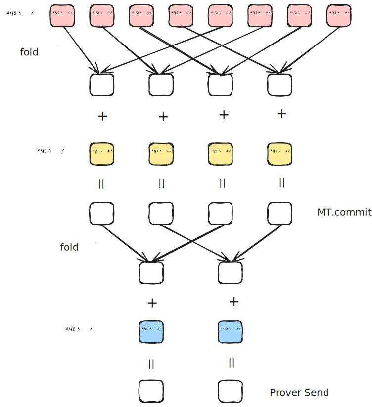

# Zeromorph-PCS : 对接 FRI 

- Jade Xie  <jade@secbit.io>
- Yu Guo <yu.guo@secbit.io>

之前的文章介绍了 zeromorph 协议对接 KZG 做多元线性多项式的 PCS 协议，这里介绍 zeromorph 协议接 FRI 对应的 PCS 协议。

## 对接 FRI

在之前的文章中已经介绍过，zeromorph 协议最后转换为证明一个关键的等式

$$
\hat{f}(X) - v\cdot\Phi_n(X) = \sum_{k = 0}^{n - 1} \Big(X^{2^k}\cdot \Phi_{n-k-1}(X^{2^{k+1}}) - u_k\cdot\Phi_{n-k}(X^{2^k})\Big)\cdot \hat{q}_k(X)
$$

以及要求商多项式 $\hat{q}_k(X)$ 的次数都小于 $2^k$ ，来防止 Prover 作弊。

为了证明上面的等式成立，Verifier 可以随机选取一个点 $X = \zeta$ ，然后让 Prover 提供 $\hat{f}(\zeta)$ 和 $\hat{q}_k(\zeta)$ 的值，以便于 Verifier 验证下面的等式是否成立：

$$
\hat{f}(\zeta) - v\cdot\Phi_n(\zeta) = \sum_{k = 0}^{n - 1} \Big(\zeta^{2^k}\cdot \Phi_{n-k-1}(\zeta^{2^{k+1}}) - u_k\cdot\Phi_{n-k}(\zeta^{2^k})\Big)\cdot \hat{q}_k(\zeta)
$$

用 zeromorph 对接 FRI 协议时，可以用 FRI 协议实现的 PCS 来提供 $\hat{f}(\zeta)$ 和 $\hat{q}_k(\zeta)$ 的值，并用 FRI 协议的 low degree test 来证明 $\deg(\hat{q_k}) < 2^k$ 。

例如 Prover 要证明发送的 $\hat{f}(\zeta)$ 值的正确性。证明该值正确，等价于证明商多项式

$$
\frac{\hat{f}(X) - \hat{f}(\zeta)}{X - \zeta}
$$

存在。要证明该商多项式存在，就等价要证明其次数小于 $2^{n} - 1$ 。为了对接 FRI 协议来进行 low degree test ，这里次数需要对齐到 $2$ 的幂次，因此还需要做 degree correction。这时可以向 Verifier 要一个随机数 $\lambda$ ，令

$$
q_{\hat{f}_{\zeta}}(X) = \frac{\hat{f}(X) - \hat{f}(\zeta)}{X - \zeta} + \lambda \cdot X \cdot \frac{\hat{f}(X) - \hat{f}(\zeta)}{X - \zeta}
$$
用 FRI 协议来证明该商多项式的次数小于 $2^n$ 。

### Commit 阶段

要承诺一个有 $n$ 个未知数的 MLE 多项式，

$$
\tilde{f}(X_0, X_1, \ldots, X_{n-1}) = \sum_{i=0}^{N-1} a_i \cdot \overset{\sim}{eq}(\mathsf{bits}(i), (X_0, X_1, \ldots, X_{n-1}))
$$

首先直接将其在 hypercube 上的取值 $(a_0, \ldots, a_{N - 1})$ 映射到一元多项式 $\hat{f}(X)$ ，

$$
\hat{f}(X) = a_0 + a_1 X + \cdots + a_{N-1} X^{N - 1}
$$

对于 FRI 协议，选取 $\mathbb{F}$ 中的一个大小为 $2$ 的幂次的乘法子群 $D = D_0$ ，并且有

$$
D_n \subseteq D_{n - 1} \subseteq \ldots \subseteq D_0
$$

其中 $|D_{i - 1}|/|D_{i}| = 2$ ，码率 $\rho = N / |D_0|$ 。下面的协议中以折叠 $n$ 次，即最后折叠到常数多项式来描述，实际中也可以折叠到一个次数比较小的多项式，协议流程会有细微差别。那么 FRI 协议对函数 $\hat{f}$ 的承诺为承诺 $\hat{f}(X)$ 在 $D$ 上的 Reed-Solomon 编码，即

$$
\mathsf{cm}(\hat{f}(X)) = \mathsf{cm}([\hat{f}(x)|_{x \in D}])
$$

实际实现中，一般用 Merkle 树来承诺 $[\hat{f}(x)|_{x \in D}]$ ，记为

$$
\mathsf{cm}(\hat{f}(X)) = \mathsf{MT.Commit}([\hat{f}(x)|_{x \in D}])
$$
Prover 发送的是这棵 Merkle 树的根哈希值，来作为 $[\hat{f}(x)|_{x \in D}]$ 的承诺。

### Evaluation 证明协议

#### 公共输入

- MLE 多项式 $\tilde{f}$ 的承诺 $\mathsf{cm}([[\tilde{f}]]_n)$
- 求值点 $\mathbf{u}=(u_0, u_1, \ldots, u_{n-1})$
- 求值结果 $v = \tilde{f}(\mathbf{u})$
- 码率参数：$\rho$
- FRI 协议中进行 low degree test 查询阶段的重复查询的次数参数: $l$ （实际中 $l$ 的取值与安全性参数，安全假设以及码率相关）
- FRI 协议中编码的乘法子群：$D, D^{(0)}, \ldots, D^{(n - 1)}$ 

#### Witness

- MLE 多项式 $\tilde{f}$ 在 $n$ 维 HyperCube 上的点值向量 $\mathbf{a} = (a_0, a_1, \ldots, a_{2^n-1})$

#### Round 1

Prover 发送余数多项式的承诺

- 计算 $n$ 个余数 MLE 多项式， $\{\tilde{q}_k\}_{k=0}^{n-1}$ ，其满足

$$
\tilde{f}(X_0,X_1,\ldots, X_{n-1}) - v = \sum_{k=0}^{n-1} (X_k-u_k) \cdot \tilde{q}_k(X_0,X_1,\ldots, X_{k-1})
$$
- 构造余数 MLE 多项式所映射到的 Univariate 多项式 $\hat{q}_k=[[\tilde{q}_k]]_k, \quad 0 \leq k < n$
- 计算并发送它们的承诺：$\mathsf{cm}(\hat{q}_0), \mathsf{cm}(\hat{q}_1), \ldots, \mathsf{cm}(\hat{q}_{n-1})$ ，这里承诺 $\mathsf{cm}(\hat{q}_0), \mathsf{cm}(\hat{q}_1), \ldots, \mathsf{cm}(\hat{q}_{n-1})$ 为 $\hat{q}_0, \ldots, \hat{q}_{n - 1}$ 的 FRI 承诺，取 $\hat{q}_k$ 的乘法子群为 $D^{(k)} = D^{(k)}_0$ ，对应的承诺为

$$
\mathsf{cm}(\hat{q}_k(X)) = \mathsf{cm}([\hat{q}_k(x)|_{x \in D^{(k)}}]) = \mathsf{MT.commit}([\hat{q}_k(x)|_{x \in D^{(k)}}])
$$

其中 $|D^{(k)}| = 2^k / \rho$ 。

#### Round 2

1. Verifier 发送随机数 $\zeta \stackrel{\$}{\leftarrow} \mathbb{F} \setminus D$ 
2. Prover 计算并发送 $\hat{f}(\zeta)$ 
3. Prover 计算并发送 $\hat{q}_k(\zeta), \, 0 \le k < n$ 。

#### Round 3

1. Verifier 发送随机数 $\lambda \stackrel{\$}{\leftarrow} \mathbb{F}$ 
2. Prover 计算 

$$
q_{f_\zeta}(X) = \frac{\hat{f}(X) - \hat{f}(\zeta)}{X - \zeta} + \lambda \cdot X \cdot \frac{\hat{f}(X) - \hat{f}(\zeta)}{X - \zeta}
$$
在 $D$ 上的值，即

$$
[q_{f_\zeta}(x)|_{x \in D}] = \big[\frac{\hat{f}(x) - \hat{f}(\zeta)}{x - \zeta} + \lambda \cdot x \cdot \frac{\hat{f}(x) - \hat{f}(\zeta)}{x - \zeta}\big|_{x \in D} \big]
$$

3. 对于 $0 \le k < n$ ，Prover 计算

$$
q_{\hat{q}_k}(X) = \frac{\hat{q_k}(X) - \hat{q}_k(\zeta)}{X - \zeta} + \lambda \cdot X \cdot \frac{\hat{q_k}(X) - \hat{q}_k(\zeta)}{X - \zeta}
$$

在 $D^{(k)}$ 上的值。

#### Round 4

Prover 与 Verifier 进行 FRI 协议的 low degree test 交互，证明 $q_{f_\zeta}(X)$ 的次数小于 $2^n$ ，

$$
\pi_{q_{f_\zeta}} \leftarrow \mathsf{FRI.LDT}(q_{f_\zeta}(X), 2^n)
$$

这里包含 $n$ 轮的交互，直到最后将原来的多项式折叠为常数多项式。下面用 $i$ 表示第 $i$ 轮，具体交互过程如下：

- 记 $q_{f_\zeta}^{(0)}(x)|_{x \in D} := q_{f_\zeta}(x)|_{x \in D}$
- 对于 $i = 1,\ldots, n$ ，
  - Verifier 发送随机数 $\alpha^{(i)}$
  - 对于任意的 $y \in D_i$ ，在 $D_{i - 1}$ 中找到 $x$ 满足 $y = x^2$，Prover 计算

  $$
    q_{f_\zeta}^{(i)}(y) = \frac{q_{f_\zeta}^{(i - 1)}(x) + q_{f_\zeta}^{(i - 1)}(-x)}{2} + \alpha^{(i)} \cdot \frac{q_{f_\zeta}^{(i - 1)}(x) - q_{f_\zeta}^{(i - 1)}(-x)}{2x}
  $$

  
  - 如果 $i < n$ ，Prover 发送 $[q_{f_\zeta}^{(i)}(x)|_{x \in D_{i}}]$ 的 Merkle Tree 承诺，
  
  $$
  \mathsf{cm}(q_{f_\zeta}^{(i)}(X)) = \mathsf{MT.commit}([q_{f_\zeta}^{(i)}(x)|_{x \in D_{i}}])
  $$

  - 如果 $i = n$ ，任选 $x_0 \in D_{n}$ ，Prover 发送 $q_{f_\zeta}^{(i)}(x_0)$ 的值。

> 📝 **Notes**
>
> 如果折叠次数 $r < n$ ，那么最后不会折叠到常数多项式，因此 Prover 在第 $r$ 轮时会发送一个 Merkle Tree 承诺，而不是发送一个值。

#### Round 5

这一轮是接着 Prover 与 Verifier 进行 FRI 协议的 low degree test 交互的查询阶段，Verifier 重复查询 $l$ 次，每一次 Verifier 都会从 $D_0$ 中选取一个随机数，让 Prover 发送在第 $i$ 轮折叠的值及对应的 Merkle Path，用来让 Verifier 验证每一轮折叠的正确性。

重复 $l$ 次：
- Verifier 从 $D_0$ 中随机选取一个数 $s^{(0)} \stackrel{\$}{\leftarrow} D_0$ 
- Prover 发送 $\hat{f}(s^{(0)}), \hat{f}(- s^{(0)})$ 的值，并附上 Merkle Path。
  
  $$
  \{(\hat{f}(s^{(0)}), \pi_{\hat{f}}(s^{(0)}))\} \leftarrow \mathsf{MT.open}([\hat{f}(x)|_{x \in D_0}], s^{(0)})
  $$

  $$
  \{(\hat{f}(-s^{(0)}), \pi_{\hat{f}}(-s^{(0)}))\} \leftarrow \mathsf{MT.open}([\hat{f}(x)|_{x \in D_0}], -s^{(0)})
  $$
- Prover 计算 $s^{(1)} = (s^{(0)})^2$ 
- 对于 $i = 1, \ldots, n - 1$
  - Prover 发送 $q_{f_\zeta}^{(i)}(s^{(i)}), q_{f_\zeta}^{(i)}(-s^{(i)})$ 的值，并附上 Merkle Path。
  
  $$
  \{(q_{f_\zeta}^{(i)}(s^{(i)}), \pi_{q_{f_\zeta}^{(i)}}(s^{(i)}))\} \leftarrow \mathsf{MT.open}([q_{f_\zeta}^{(i)}(x)|_{x \in D_i}], s^{(i)})
  $$

  $$
  \{(q_{f_\zeta}^{(i)}(-s^{(i)}), \pi_{q_{f_\zeta}}^{(i)}(-s^{(i)}))\} \leftarrow \mathsf{MT.open}([q_{f_\zeta}^{(i)}(x)|_{x \in D_i}], -s^{(i)})
  $$
  - Prover 计算 $s^{(i + 1)} = (s^{(i)})^2$

> 如果折叠次数 $r < n$ ，那么最后一步就要发送 $q_{f_\zeta}^{(r)}(s^{(r)})$ 的值，并附上 Merkle Path。

#### Round 6

1. Prover 与 Verifier 进行 FRI 协议的 low degree test 交互，对于 $0 \le k < n$ ，证明 $q_{\hat{q}_k}(X)$ 的次数小于 $2^k$ ，

$$
\pi_{q_{\hat{q}_k}} \leftarrow \mathsf{FRI.LDT}(q_{\hat{q}_k}(X), 2^k)
$$
这里包含 $n$ 轮的交互，直到最后将原来的多项式折叠为常数多项式。下面用 $i$ 表示第 $i$ 轮，具体交互过程如下：

- 记 $q_{\hat{q}_k}^{(0)}(x)|_{x \in D^{(k)}} := q_{f_\zeta}(x)|_{x \in D^{(k)}}$
- 对于 $i = 1,\ldots, k$ ，
  - Verifier 发送随机数 $\beta_k^{(i)}$
  - 对于任意的 $y \in D_i^{(k)}$ ，在 $D_{i - 1}^{(k)}$ 中找到 $x$ 满足 $y = x^2$，Prover 计算

  $$
    q_{\hat{q}_k}^{(i)}(y) = \frac{q_{\hat{q}_k}^{(i - 1)}(x) + q_{\hat{q}_k}^{(i - 1)}(-x)}{2} + \beta_k^{(i)} \cdot \frac{q_{\hat{q}_k}^{(i - 1)}(x) - q_{\hat{q}_k}^{(i - 1)}(-x)}{2x}
  $$
  - 如果 $i < k$ ，Prover 发送 $[q_{\hat{q}_k}^{(i)}(x)|_{x \in D_i^{(k)}}]$ 的 Merkle Tree 承诺，
  
  $$
  \mathsf{cm}(q_{\hat{q}_k}^{(i)}(X)) = \mathsf{MT.commit}([q_{\hat{q}_k}^{(i)}(x)|_{x \in D_{i}^{(k)}}])
  $$

  - 如果 $i = k$ ，任选 $y_0^{(k)} \in D_{n}$ ，Prover 发送 $q_{\hat{q}_k}^{(i)}(y_0^{(k)})$ 的值。

> 📝 **Notes**
>
> 如果折叠次数 $r < k$ ，那么最后不会折叠到常数多项式，因此 Prover 在第 $r$ 轮时会发送一个 Merkle Tree 承诺，而不是发送一个值。

#### Round 7

这一轮是接着 Prover 与 Verifier 进行 FRI 协议的 low degree test 交互的查询阶段，Verifier 重复查询 $l$ 次，每一次 Verifier 都会从 $D_0^{(k)}$ 中选取一个随机数，让 Prover 发送在第 $i$ 轮折叠的值及对应的 Merkle Path，用来让 Verifier 验证每一轮折叠的正确性。

对于 $k = 0, \ldots, n - 1$， Verifier 重复查询 $l$ 次：
- Verifier 从 $D_0^{(k)}$ 中随机选取一个数 $s_k^{(0)} \stackrel{\$}{\leftarrow} D_0^{(k)}$ 
- Prover 发送 $\hat{q}_k(s_k^{(0)}), \hat{q}_k(- s_k^{(0)})$ 的值，并附上 Merkle Path。
  
  $$
  \{(\hat{q}_k(s_k^{(0)}), \pi_{\hat{q}_k}(s_k^{(0)}))\} \leftarrow \mathsf{MT.open}([\hat{q}_k(x)|_{x \in D_0^{(k)}}], s^{(0)})
  $$

  $$
  \{(\hat{q}_k(-s_k^{(0)}), \pi_{\hat{q}_k}(-s_k^{(0)}))\} \leftarrow \mathsf{MT.open}([\hat{q}_k(x)|_{x \in D_0^{(k)}}], -s^{(0)})
  $$
- Prover 计算 $s_k^{(1)} = (s_k^{(0)})^2$ 
- 对于 $i = 1, \ldots, k - 1$
  - Prover 发送 $q_{\hat{q}_k}^{(i)}(s_k^{(i)}), q_{\hat{q}_k}^{(i)}(-s_k^{(i)})$ 的值，并附上 Merkle Path。
  
  $$
  \{(q_{\hat{q}_k}^{(i)}(s_k^{(i)}), \pi_{q_{\hat{q}_k}^{(i)}}(s_k^{(i)}))\} \leftarrow \mathsf{MT.open}([q_{\hat{q}_k}^{(i)}(x)|_{x \in D_i^{(k)}}], s_k^{(i)})
  $$

  $$
  \{(q_{\hat{q}_k}^{(i)}(-s_k^{(i)}), \pi_{q_{\hat{q}_k}^{(i)}}(-s_k^{(i)}))\} \leftarrow \mathsf{MT.open}([q_{\hat{q}_k}^{(i)}(x)|_{x \in D_i^{(k)}}], -s_k^{(i)})
  $$
  - Prover 计算 $s_k^{(i + 1)} = (s_k^{(i)})^2$

> 如果折叠次数 $r < k$ ，那么最后一步就要发送 $q_{\hat{q}_k}^{(r)}(s^{(r)})$ 的值，并附上 Merkle Path。

#### Proof

Prover 发送的证明为

$$
\begin{aligned}
  \pi = \left(\mathsf{cm}(\hat{q}_0(X)), \ldots \mathsf{cm}(\hat{q}_{n - 1}(X)), \hat{f}(\zeta), \hat{q}_0(\zeta), \ldots, \hat{q}_{n - 1}(\zeta), \pi_{q_{f_\zeta}}, \pi_{q_{\hat{q}_0}}, \ldots, \pi_{q_{\hat{q}_{n - 1}}}\right)
\end{aligned}
$$

用符号 $\{\cdot\}^l$ 表示在 FRI low degree test 的查询阶段重复查询 $l$ 次产生的证明，由于每次查询是随机选取的，因此花括号中的证明也是随机的。那么 FRI 进行 low degree test 的 $n + 1$ 个证明为

$$
\begin{aligned}
  \pi_{q_{f_\zeta}} = &  ( \mathsf{cm}(q_{f_\zeta}^{(1)}(X)), \ldots, \mathsf{cm}(q_{f_\zeta}^{(n - 1)}(X)),q_{f_\zeta}^{(n)}(x_0),  \\
  & \, \{\hat{f}(s^{(0)}), \pi_{\hat{f}}(s^{(0)}), \hat{f}(- s^{(0)}), \pi_{\hat{f}}(-s^{(0)}), \\
  & \quad q_{f_\zeta}^{(1)}(s^{(1)}), \pi_{q_{f_\zeta}^{(1)}}(s^{(1)}),q_{f_\zeta}^{(1)}(-s^{(1)}), \pi_{q_{f_\zeta}^{(1)}}(-s^{(1)}), \ldots, \\
  & \quad q_{f_\zeta}^{(n - 1)}(s^{(n - 1)}), \pi_{q_{f_\zeta}^{(n - 1)}}(s^{(n - 1)}),q_{f_\zeta}^{(n - 1)}(-s^{(n - 1)}), \pi_{q_{f_\zeta}^{(i)}}(-s^{(n - 1)})\}^l)
\end{aligned}
$$

对于 $k = 0, \ldots, n - 1$，

$$
\begin{aligned}
  \pi_{q_{\hat{q}_k}} = &  ( \mathsf{cm}(q_{\hat{q}_k}^{(1)}(X)), \ldots, \mathsf{cm}(q_{\hat{q}_k}^{(k - 1)}(X)),q_{\hat{q}_k}^{(k)}(y_0^{(k)}),  \\
  & \, \{\hat{q}_k(s_k^{(0)}), \pi_{\hat{q}_k}(s_k^{(0)}), \hat{q}_k(-s_k^{(0)}), \pi_{\hat{q}_k}(-s_k^{(0)}),\\
  & \quad q_{\hat{q}_k}^{(1)}(s_k^{(1)}), \pi_{q_{\hat{q}_k}^{(1)}}(s_k^{(1)}), q_{\hat{q}_k}^{(1)}(-s_k^{(1)}), \pi_{q_{\hat{q}_k}^{(1)}}(-s_k^{(1)}) \ldots, \\
  & \quad q_{\hat{q}_k}^{(k - 1)}(s_k^{(k-1)}), \pi_{q_{\hat{q}_k}^{(k - 1)}}(s_k^{(k - 1)}), q_{\hat{q}_k}^{(k - 1)}(-s_k^{(k - 1)}), \pi_{q_{\hat{q}_k}^{(k - 1)}}(-s_k^{(k - 1)})\}^l)
\end{aligned}
$$

#### Verification

Verifier

1. 验证 $q_{f_\zeta}(X)$ 的 low degree test 证明，

$$
\mathsf{FRI.LDT.verify}(\pi_{q_{f_\zeta}}, 2^n) \stackrel{?}{=} 1
$$

具体验证过程为，重复 $l$ 次：
- 验证 $\hat{f}(s^{(0)}), \hat{f}(-s^{(0)})$ 的正确性

$$
\mathsf{MT.verify}(\mathsf{cm}(\hat{f}(X)), \hat{f}(s^{(0)}), \pi_{\hat{f}}(s^{(0)})) \stackrel{?}{=} 1
$$

$$
\mathsf{MT.verify}(\mathsf{cm}(\hat{f}(X)), \hat{f}(-s^{(0)}), \pi_{\hat{f}}(-s^{(0)})) \stackrel{?}{=} 1
$$
- Verifier 计算
  $$
  q_{f_\zeta}^{(0)}(s^{(0)}) = (1 + \lambda \cdot s^{(0)}) \cdot \frac{\hat{f}(s^{(0)}) - \hat{f}(\zeta)}{s^{(0)} - \zeta} 
  $$

  $$
  q_{f_\zeta}^{(0)}(- s^{(0)}) = (1 - \lambda \cdot s^{(0)}) \cdot\frac{\hat{f}(-s^{(0)}) - \hat{f}(\zeta)}{-s^{(0)} - \zeta}
  $$
- 验证 $q_{f_\zeta}^{(1)}(s^{(1)}), q_{f_\zeta}^{(1)}(-s^{(1)})$ 的正确性

$$
\mathsf{MT.verify}(\mathsf{cm}(q_{f_\zeta}^{(1)}(X)), q_{f_\zeta}^{(1)}(s^{(1)}), \pi_{q_{f_\zeta}^{(1)}}(s^{(1)})) \stackrel{?}{=} 1
$$

$$
\mathsf{MT.verify}(\mathsf{cm}(q_{f_\zeta}^{(1)}(X)), q_{f_\zeta}^{(1)}(-s^{(1)}), \pi_{q_{f_\zeta}^{(1)}}(-s^{(1)})) \stackrel{?}{=} 1
$$

- 验证第 $1$ 轮的折叠是否正确

$$
q_{f_\zeta}^{(1)}(s^{(1)}) \stackrel{?}{=} \frac{q_{f_\zeta}^{(0)}(s^{(0)}) + q_{f_\zeta}^{(0)}(- s^{(0)})}{2} + \alpha^{(1)} \cdot \frac{q_{f_\zeta}^{(0)}(s^{(0)}) - q_{f_\zeta}^{(0)}(- s^{(0)})}{2 \cdot s^{(0)}}
$$
- 对于 $i = 2, \ldots, n - 1$
  - 验证 $q_{f_\zeta}^{(i)}(s^{(i)}), q_{f_\zeta}^{(i)}(-s^{(i)})$ 的正确性

  $$
  \mathsf{MT.verify}(\mathsf{cm}(q_{f_\zeta}^{(i)}(X)), q_{f_\zeta}^{(i)}(s^{(i)}), \pi_{q_{f_\zeta}^{(i)}}(s^{(i)})) \stackrel{?}{=} 1
  $$

  $$
  \mathsf{MT.verify}(\mathsf{cm}(q_{f_\zeta}^{(i)}(X)), q_{f_\zeta}^{(i)}(-s^{(i)}), \pi_{q_{f_\zeta}^{(i)}}(-s^{(i)})) \stackrel{?}{=} 1
  $$
  - 验证第 $i$ 轮的折叠是否正确
  $$
  q_{f_\zeta}^{(i)}(s^{(i)}) \stackrel{?}{=} \frac{q_{f_\zeta}^{(i-1)}(s^{(i - 1)}) + q_{f_\zeta}^{(i - 1)}(- s^{(i - 1)})}{2} + \alpha^{(i)} \cdot \frac{q_{f_\zeta}^{(i - 1)}(s^{(i - 1)}) - q_{f_\zeta}^{(i - 1)}(- s^{(i - 1)})}{2 \cdot s^{(i - 1)}}
  $$
- 验证最后是否折叠到常数多项式
  $$
  q_{f_\zeta}^{(n)}(x_0) \stackrel{?}{=} \frac{q_{f_\zeta}^{(n-1)}(s^{(n - 1)}) + q_{f_\zeta}^{(n - 1)}(- s^{(n - 1)})}{2} + \alpha^{(n)} \cdot \frac{q_{f_\zeta}^{(n - 1)}(s^{(n - 1)}) - q_{f_\zeta}^{(n - 1)}(- s^{(n - 1)})}{2 \cdot s^{(n - 1)}}
  $$

2. 对于 $k = 0, \ldots, n - 1$ ，验证 $q_{\hat{q}_k}(X)$ 的 low degree test 证明，

$$
\mathsf{FRI.LDT.verify}(\pi_{q_{\hat{q}_k}}, 2^k) \stackrel{?}{=} 1
$$

具体验证过程为，重复 $l$ 次：
- 验证 $\hat{q}_k(s_k^{(0)}), \hat{q}_k(-s_k^{(0)})$ 的正确性

$$
\mathsf{MT.verify}(\mathsf{cm}(\hat{q}_k(X)), \hat{q}_k(s_k^{(0)}), \pi_{\hat{q}_k}(s_k^{(0)})) \stackrel{?}{=} 1
$$

$$
\mathsf{MT.verify}(\mathsf{cm}(\hat{q}_k(X)), \hat{q}_k(-s_k^{(0)}), \pi_{\hat{q}_k}(-s_k^{(0)})) \stackrel{?}{=} 1
$$
- Verifier 计算
  $$
  q_{\hat{q}_k}^{(0)}(s_k^{(0)}) = (1 + \lambda \cdot s_k^{(0)}) \cdot \frac{\hat{q}_k(s_k^{(0)})- \hat{q}_k(\zeta)}{s_k^{(0)} - \zeta}
  $$

  $$
  q_{\hat{q}_k}^{(0)}(-s_k^{(0)}) = (1 - \lambda \cdot s_k^{(0)}) \cdot \frac{\hat{q}_k(-s_k^{(0)})- \hat{q}_k(\zeta)}{-s_k^{(0)} - \zeta}
  $$
- 验证 $q_{\hat{q}_k}^{(1)}(s_k^{(1)}),q_{\hat{q}_k}^{(1)}(-s_k^{(1)}),$ 的正确性

$$
\mathsf{MT.verify}(\mathsf{cm}(q_{\hat{q}_k}^{(1)}(X)), q_{\hat{q}_k}^{(1)}(s_k^{(1)}), \pi_{q_{\hat{q}_k}^{(1)}}(s_k^{(1)})) \stackrel{?}{=} 1
$$

$$
\mathsf{MT.verify}(\mathsf{cm}(q_{\hat{q}_k}^{(1)}(X)), q_{\hat{q}_k}^{(1)}(-s_k^{(1)}), \pi_{q_{\hat{q}_k}^{(1)}}(-s_k^{(1)})) \stackrel{?}{=} 1
$$

- 验证第 $1$ 轮的折叠是否正确

$$
q_{\hat{q}_k}^{(1)}(s_k^{(1)}) \stackrel{?}{=} \frac{q_{\hat{q}_k}^{(0)}(s_k^{(0)}) + q_{\hat{q}_k}^{(0)}(- s_k^{(0)})}{2} + \beta_k^{(1)} \cdot \frac{q_{\hat{q}_k}^{(0)}(s_k^{(0)}) - q_{\hat{q}_k}^{(0)}(- s_k^{(0)})}{2 \cdot s_k^{(0)}}
$$
- 对于 $i = 2, \ldots, k - 1$
  - 验证 $q_{\hat{q}_k}^{(i)}(s_k^{(i)}), q_{\hat{q}_k}^{(i)}(-s_k^{(i)})$ 的正确性
  
  $$
  \mathsf{MT.verify}(\mathsf{cm}(q_{\hat{q}_k}^{(i)}(X)), q_{\hat{q}_k}^{(i)}(s_k^{(i)}), \pi_{q_{\hat{q}_k}^{(i)}}(s_k^{(i)})) \stackrel{?}{=} 1
  $$

  $$
  \mathsf{MT.verify}(\mathsf{cm}(q_{\hat{q}_k}^{(i)}(X)), q_{\hat{q}_k}^{(i)}(-s_k^{(i)}), \pi_{q_{\hat{q}_k}^{(i)}}(-s_k^{(i)})) \stackrel{?}{=} 1
  $$
  
  - 验证第 $i$ 轮的折叠是否正确
  $$
  q_{\hat{q}_k}^{(i)}(s_k^{(i)}) \stackrel{?}{=} \frac{q_{\hat{q}_k}^{(i - 1)}(s_k^{(i - 1)}) + q_{\hat{q}_k}^{(i - 1)}(- s_k^{(i - 1)})}{2} + \beta_k^{(i)} \cdot \frac{q_{\hat{q}_k}^{(i - 1)}(s_k^{(i - 1)}) - q_{\hat{q}_k}^{(i - 1)}(- s_k^{(i - 1)})}{2 \cdot s_k^{(i - 1)}}
  $$
- 验证最后是否折叠到常数多项式
  $$
  q_{\hat{q}_k}^{(k)}(y_0^{(k)}) \stackrel{?}{=} \frac{q_{\hat{q}_k}^{(k - 1)}(s_k^{(k - 1)}) + q_{\hat{q}_k}^{(k - 1)}(- s_k^{(k - 1)})}{2} + \beta_k^{(k)} \cdot \frac{q_{\hat{q}_k}^{(k - 1)}(s_k^{(k - 1)}) - q_{\hat{q}_k}^{(k - 1)}(- s_k^{(k - 1)})}{2 \cdot s_k^{(k - 1)}}
  $$

3. 计算 $\Phi_n(\zeta)$ 以及 $\Phi_{n - k}(\zeta^{2^k})(0 \le k < n)$ ，满足

$$
\Phi_n(\zeta) = 1 + \zeta + \zeta^2 + \ldots + \zeta^{2^n-1}
$$

$$
\Phi_{n-k}(\zeta^{2^k}) = 1 + \zeta^{2^k} + \zeta^{2\cdot 2^k} + \ldots + \zeta^{(2^{n-k}-1)\cdot 2^k}
$$

4. 验证下述等式的正确性

$$
\hat{f}(\zeta) - v\cdot\Phi_n(\zeta) \stackrel{?}{=} \sum_{k = 0}^{n - 1} \Big(\zeta^{2^k}\cdot \Phi_{n-k-1}(\zeta^{2^{k+1}}) - u_k\cdot\Phi_{n-k}(\zeta^{2^k})\Big)\cdot \hat{q}_k(\zeta)
$$

## Zeromorph 对接 FRI 优化协议

在上述的协议中，会对 $n$ 个一元多项式 $\hat{q}_k(X)$ 进行承诺以及用 FRI 协议分别进行 low degree test 的证明，实际上，由于要证明的 $\hat{q}_{k}(X)$ 与 $\hat{q}_{k - 1}(X)$ 之间的 degree bound 刚好相差 $2$ 倍，因此可以用 rolling batch 的技巧对这 $n$ 个多项式只进行一次 low degree test。另外注意到，$\hat{f}(X)$ 与 $\hat{q}_{n-1}(X)$ 之间的 degree bound 也刚好相差 $2$ 倍，因此还可以用 rolling batch 的技巧对 $\hat{f}(X), \hat{q}_{n-1}(X), \ldots, \hat{q}_{0}(X)$ 这 $n + 1$ 个多项式只进行一次 low degree test。 

当对 $n$ 个一元多项式 $\hat{q}_k(X)$ 进行承诺时，由于 $D^{(k)}$ 与 $D^{(k - 1)}$ 之间的大小也正好相差 $2$ 倍，因此也可以借用 plonky3 中的 [mmcs](https://github.com/Plonky3/Plonky3/blob/main/merkle-tree/src/mmcs.rs) 结构对这 $n$ 个多项式放在一起只进行一次承诺。

这里先以 $3$ 个多项式 $\hat{q}_2(X), \hat{q}_1(X), \hat{q}_0(X)$ 为例来说明 mmcs 承诺的过程。设 $\rho = \frac{1}{2}$ ，Prover 要承诺的值为

$$
\mathsf{cm}(\hat{q}_2(X)) = [\hat{q}_2(x)|_{x\in D^{(2)}}] = \{\hat{q}_2(\omega_2^0), \hat{q}_2(\omega_2^1), \hat{q}_2(\omega_2^2), \ldots, \hat{q}_2(\omega_2^7)\} 
$$

$$
\mathsf{cm}(\hat{q}_1(X)) = [\hat{q}_1(x)|_{x\in D^{(1)}}] = \{\hat{q}_1(\omega_1^0), \hat{q}_1(\omega_1^1), \hat{q}_1(\omega_1^2), \hat{q}_1(\omega_1^3)\}
$$

$$
\mathsf{cm}(\hat{q}_0(X)) = [\hat{q}_0(x)|_{x\in D^{(0)}}] = \{\hat{q}_0(\omega_0^0), \hat{q}_0(\omega_0^1)\}
$$

其中 $\omega_2, \omega_1, \omega_0$ 分别是 $D^{(2)}, D^{(1)}, D^{(0)}$ 上的生成元，满足 

$$
(\omega_2)^8 = 1, (\omega_1)^4 = 1, (\omega_0)^2 = 1
$$

在实际实现中，可以选取 $\mathbb{F}_p^*$ 的生成元 $g$ 来生成 $\omega_2, \omega_1, \omega_0$ ，令

$$
\omega_2 = g^{\frac{p - 1}{8}}, \omega_1 = g^{\frac{p - 1}{4}},\omega_0 = g^{\frac{p - 1}{2}}
$$

由费马小定理可以验证 $(\omega_2)^8 = 1, (\omega_1)^4 = 1, (\omega_0)^2 = 1$ 是成立的，则它们之间满足关系式 $\omega^2 = \omega_1, \omega_1^2 = \omega_0$ 。

可以看到 $\mathsf{cm}(\hat{q}_2(X))$ 要承诺的有 8 个值，$\mathsf{cm}(\hat{q}_1(X))$ 要承诺的有 4 个值，而 $\mathsf{cm}(\hat{q}_0(X))$ 要承诺的有 2 个值。如果用 Merkle Tree 来承诺，需要 3 棵树来进行承诺，其高度分别是 3, 2, 1，而现在用 mmcs 结构，可以将这 14 个值放在同一棵树上，其高度为 6。

这种承诺方式记为

$$
\mathsf{cm}(\hat{q}_2(X), \hat{q}_1(X), \hat{q}_0(X)) = \mathsf{MMCS.commit}(\hat{q}_2(X), \hat{q}_1(X), \hat{q}_0(X))
$$

下面依然以 $n = 3$ 为例来说明 rolling batch 的技巧，对于商多项式 $q_{\hat{q}_2}(X), q_{\hat{q}_1}(X), q_{\hat{q}_0}(X)$ ，如果用 FRI 的 low degree test 来证明它们的 degree bound ，需要 3 个相应的证明，而 rolling batch 技巧可以让我们用一次 low degree test 来证明这 3 个多项式的 degree bound，协议过程如下图所示。
- [ ] rolling batch 加随机数，安全性如何？

将折叠之后的值与下一个 $q_{\hat{q}_{i - 1}}$ 的值相加，再进行 FRI 的折叠，直到最后折叠成常数多项式。

### Commit 阶段

这里承诺阶段与上述非优化版的承诺协议是一样的，承诺一个有 $n$ 个变量的 MLE 多项式，

$$
\tilde{f}(X_0, X_1, \ldots, X_{n-1}) = \sum_{i=0}^{N-1} a_i \cdot \overset{\sim}{eq}(\mathsf{bits}(i), (X_0, X_1, \ldots, X_{n-1}))
$$

先直接映射成一元多项式 $\hat{f}(X)$，为

$$
\hat{f}(X) = a_0 + a_1 X + \cdots + a_{N-1} X^{N - 1}
$$

其承诺为

$$
\mathsf{cm}(\hat{f}(X)) = [\hat{f}(x)|_{x \in D}]
$$

用一般的 Merkle Tree 来承诺，为

$$
\mathsf{cm}(\hat{f}(X)) = \mathsf{MT.Commit}([\hat{f}(x)|_{x \in D}])
$$

### Evaluation 证明协议

#### 公共输入

- MLE 多项式 $\tilde{f}$ 的承诺 $\mathsf{cm}([[\tilde{f}]]_n)$
- 求值点 $\mathbf{u}=(u_0, u_1, \ldots, u_{n-1})$
- 求值结果 $v = \tilde{f}(\mathbf{u})$
- 码率参数：$\rho$
- FRI 协议中进行 low degree test 查询阶段的重复查询的次数参数: $l$
- FRI 协议中编码的乘法子群：$D, D^{(0)}, \ldots, D^{(n - 1)}$ 
 
#### Witness

- MLE 多项式 $\tilde{f}$ 在 $n$ 维 HyperCube 上的点值向量 $\mathbf{a} = (a_0, a_1, \ldots, a_{2^n-1})$

#### Round 1

Prover 发送余数多项式的承诺

- 计算 $n$ 个余数 MLE 多项式， $\{\tilde{q}_k\}_{k=0}^{n-1}$ ，其满足

$$
\tilde{f}(X_0,X_1,\ldots, X_{n-1}) - v = \sum_{k=0}^{n-1} (X_k-u_k) \cdot \tilde{q}_k(X_0,X_1,\ldots, X_{k-1})
$$

- 构造余数 MLE 多项式所映射到的 Univariate 多项式 $\hat{q}_k=[[\tilde{q}_k]]_k, \quad 0 \leq k < n$
- 计算并发送它们的承诺，这里用 mmcs 结构对这 $n$ 个多项式的值放在同一棵树上进行承诺。先分别计算这些多项式在对应 $D^{(k)}$ 上的值，计算

$$
\{[\hat{q}_k(x)|_{x \in D^{(k)}}]\}_{k = 0}^{n - 1}
$$

其中 $|D^{(k)}| = 2^k / \rho$ ，再用 mmcs 对这 $(2^{n - 1} + 2^{n - 2} + \ldots + 2^0)/\rho$ 个值一次进行承诺，记为

$$
\mathsf{cm}(\hat{q}_{n - 1}, \hat{q}_{n - 2}, \ldots, \hat{q}_0) = \mathsf{MMCS.commit}(\hat{q}_{n - 1}, \hat{q}_{n - 2}, \ldots, \hat{q}_0)
$$

#### Round 2

1. Verifier 发送随机数 $\zeta \stackrel{\$}{\leftarrow} \mathbb{F} \setminus D$ 
2. Prover 计算并发送 $\hat{f}(\zeta)$ 
3. Prover 计算并发送  $\{\hat{q}_k(\zeta)\}_{k = 0}^{n - 1}$ 。

#### Round 3

1. Verifier 发送随机数 $\lambda \stackrel{\$}{\leftarrow} \mathbb{F}$ 
2. Prover 计算 

$$
q_{f_\zeta}(X) = \frac{\hat{f}(X) - \hat{f}(\zeta)}{X - \zeta} + \lambda \cdot X \cdot \frac{\hat{f}(X) - \hat{f}(\zeta)}{X - \zeta}
$$
在 $D$ 上的值，即

$$
[q_{f_\zeta}(x)|_{x \in D}] = \big[\frac{\hat{f}(x) - \hat{f}(\zeta)}{x - \zeta} + \lambda \cdot x \cdot \frac{\hat{f}(x) - \hat{f}(\zeta)}{x - \zeta}\big|_{x \in D} \big]
$$

3. 对于 $0 \le k < n$ ，Prover 计算

$$
q_{\hat{q}_k}(X) = \frac{\hat{q_k}(X) - \hat{q}_k(\zeta)}{X - \zeta} + \lambda \cdot X \cdot \frac{\hat{q_k}(X) - \hat{q}_k(\zeta)}{X - \zeta}
$$

在 $D^{(k)}$ 上的值。

#### Round 4

Prover 与 Verifier 进行 FRI 协议的 low degree test 交互，这里使用 rolling batch 技巧进行优化，对于 $k = 0, \ldots, n - 1$ ， 一次证明所有 $q_{\hat{q}_k}(X)$ 的次数小于 $2^k$ ，同时证明 $q_{f_\zeta}(X)$ 的次数小于 $2^n$ 。为了方便后续协议的叙述，这里记

$$
q_{\hat{q}_n}(X) := q_{f_\zeta}(X)
$$

因此 low degree test 的证明记为

$$
\pi_{q_{\hat{q}_{n}},q_{\hat{q}_{n - 1}}, \ldots, q_{\hat{q}_{0}}} \leftarrow \mathsf{OPFRI.LDT}(q_{\hat{q}_{n}},q_{\hat{q}_{n - 1}}, \ldots, q_{\hat{q}_{0}}, 2^{n})
$$

这里包含 $n + 1$ 轮的交互，直到最后折叠为常数多项式。下面用 $i$ 表示第 $i$ 轮，具体交互过程如下：

1. 初始化 $i = n$ ，记 $D^{(n)} := D$ ，对于 $x \in D^{(n)}$ ，初始化

$$
\mathsf{fold}^{(i)}(x) = q_{\hat{q}_{n}}(x)
$$

2. 当 $i = n - 1, \ldots, 0$ 时：

- Verifier 发送随机数 $\beta^{(i)}$

- 对于 $y \in D^{(i)}$ ，在 $D^{(i + 1)}$ 中找到 $x$ 满足 $x^2 = y$ ，Prover 计算

$$
\mathsf{fold}^{(i)}(y) = \frac{\mathsf{fold}^{(i + 1)}(x) + \mathsf{fold}^{(i + 1)}(-x)}{2} + \beta^{(i)} \cdot \frac{\mathsf{fold}^{(i + 1)}(x) - \mathsf{fold}^{(i + 1)}(-x)}{2x}
$$

-  对于 $x \in D^{(i)}$ ，Prover 更新 $\mathsf{fold}^{(i)}(x)$

$$
\mathsf{fold}^{(i)}(x) = \mathsf{fold}^{(i)}(x) + q_{\hat{q}_{i}}(x)
$$

- 当 $i > 0$ 时，
  - Prover 发送 $\mathsf{fold}^{(i)}(x)$ 的承诺，即

    $$
    \mathsf{cm}(\mathsf{fold}^{(i)}(X)) = \mathsf{MT.commit}([\mathsf{fold}^{(i)}(x)|_{x \in D^{(i)}}])
    $$
- 当 $i = 0$ 时，由于最后折叠到常数多项式，Prover 选取 $D^{(0)}$ 中的任意一个点 $y_0 \in D^{(0)}$，发送折叠到最后的值 $\mathsf{fold}^{(0)}(y_0)$ 。

#### Round 5

这一轮是接着 Prover 与 Verifier 进行 FRI 协议的 low degree test 交互的查询阶段，Verifier 重复查询 $l$ 次 ：
- Verifier 从 $D^{(n)}$ 中随机选取一个数 $t^{(n)} \stackrel{\$}{\leftarrow} D^{(n)}$
- Prover 发送 $\hat{f}(t^{(n)}), \hat{f}(- t^{(n)})$ 的值，并附上 Merkle Path。
  
  $$
  \{(\hat{f}(t^{(n)}), \pi_{\hat{f}}(t^{(n)}))\} \leftarrow \mathsf{MT.open}([\hat{f}(x)|_{x \in D_0}], t^{(n)})
  $$

  $$
  \{(\hat{f}(-t^{(n)}), \pi_{\hat{f}}(-t^{(n)}))\} \leftarrow \mathsf{MT.open}([\hat{f}(x)|_{x \in D_0}], -t^{(n)})
  $$
  
- 对于 $i = n - 1, \ldots, 1$，
  - Prover 计算 $t^{(i)} = (t^{(i + 1)})^2$
  - Prover 发送 $\hat{q}_{i}(t^{(i)})$ 及其 Merkle Path
      $$
      \{(\hat{q}_{i}(t^{(i)}), \pi_{\hat{q}_{i}}(t^{(i)}))\} \leftarrow \mathsf{MMCS.open}(\hat{q}_{i}, t^{(i)})
      $$

  - Prover 发送 $\mathsf{fold}^{(i)}(-t^{(i)})$ 及其 Merkle Path
      $$
      \{(\mathsf{fold}^{(i)}(-t^{(i)}), \pi_{\mathsf{fold}^{(i)}}(-t^{(i)}))\} \leftarrow \mathsf{MT.open}(\mathsf{fold}^{(i)}, -t^{(i)})
      $$ 
- 对于 $i = 0$ 时，
  - Prover 计算 $t^{(0)} = (t^{(1)})^2$
  - Prover 发送 $\hat{q}_0(s^{(0)})$ 及其 Merkle Path
      $$
      \{(\hat{q}_0(t^{(0)}), \pi_{\hat{q}_0}(t^{(0)}))\} \leftarrow \mathsf{MMCS.open}(\hat{q}_0, t^{(0)})
      $$

> 📝 **Notes**
>
> 例如对 3 个多项式进行 query，query 选取的是 $q_{\hat{q}_2}(X)$ 中的最后一个元素 $\omega_2^7$，那么 Prover 需要发送的值及其 Merkle Path 是下图中绿色部分，橙色边框标记的发送的并非商多项式本身的值和对应的 Merkle Path，而是 $\hat{q}_k(X)$ 的 Merkle Path，即 Prover 会发送
>
> $$
> \{\hat{q_2}(\omega_2^7), \hat{q_2}(\omega_2^3), \hat{q}_1(\omega_1^3), \mathsf{fold}^{(1)}(\omega_1^1),  \hat{q}_0(\omega_0^1)\}
> $$
>
> 以及这些值对应的 Merkle Path。
> 
> 

#### Proof

Prover 发送的证明为

$$
\begin{aligned}
  \pi = \left(\mathsf{cm}(\hat{q}_{n - 1}, \hat{q}_{n - 2}, \ldots, \hat{q}_0), \hat{f}(\zeta), \hat{q}_0(\zeta), \ldots, \hat{q}_{n - 1}(\zeta), \pi_{q_{\hat{q}_{n}},q_{\hat{q}_{n - 1}}, \ldots, q_{\hat{q}_{0}}}\right)
\end{aligned}
$$

用符号 $\{\cdot\}^l$ 表示在 FRI low degree test 的查询阶段重复查询 $l$ 次产生的证明，由于每次查询是随机选取的，因此花括号中的证明也是随机的。那么 FRI 进行 low degree test 的两个证明为

$$
\begin{aligned}
  \pi_{q_{\hat{q}_{n}}, \ldots, q_{\hat{q}_{0}}} = &  ( \mathsf{cm}(\mathsf{fold}^{(n - 1)}(X)), \ldots, \mathsf{cm}(\mathsf{fold}^{(1)}(X)),\mathsf{fold}^{(0)}(y_0),  \\
  & \, \{\hat{f}(t^{(n)}), \pi_{\hat{f}}(t^{(n)}), \hat{f}(- t^{(n)}), \pi_{\hat{f}}(- t^{(n)}),\\
  & \quad \hat{q}_{n - 1}(t^{(n - 1)}), \pi_{\hat{q}_{n - 1}}(t^{(n - 1)}), \mathsf{fold}^{(n - 1)}(-t^{(n - 1)}), \pi_{\mathsf{fold}^{(n - 1)}}(-t^{(n - 1)}), \ldots, \\
  & \quad \hat{q}_{1}(t^{(1)}), \pi_{\hat{q}_{1}}(t^{(1)}), \mathsf{fold}^{(1)}(-t^{(1)}), \pi_{\mathsf{fold}^{(1)}}(-t^{(1)}), \hat{q}_0(t^{(0)}), \pi_{\hat{q}_0}(t^{(0)})\}^l)
\end{aligned}
$$

#### Verification

Verifier

1. 对 $q_{f_{\zeta}}(X)$ 以及 $n$ 个商多项式 $\{q_{\hat{q}_k}\}_{k = 0}^{n - 1}$ 一次进行 low degree test 的验证，记为

$$
\mathsf{OPFRI.verify}( \pi_{q_{\hat{q}_{n}},q_{\hat{q}_{n-1}}, \ldots, q_{\hat{q}_{0}}}, 2^{n}) \stackrel{?}{=} 1
$$

具体过程为，Verifier 重复 $l$ 次：

- Verifier 验证 $\hat{f}(t^{(n)}), \hat{f}(-t^{(n)})$ 的正确性

$$
\mathsf{MT.verify}(\mathsf{cm}(\hat{f}(X), \hat{f}(t^{(n)}), \pi_{\hat{f}}(t^{(n)})) \stackrel{?}{=} 1
$$

$$
\mathsf{MT.verify}(\mathsf{cm}(\hat{f}(X), \hat{f}(-t^{(n)}), \pi_{\hat{f}}(-t^{(n)})) \stackrel{?}{=} 1
$$
- Verifier 计算

$$
q_{\hat{q}_{n}}(t^{(n)}) = (1 + \lambda \cdot t^{(n)}) \cdot \frac{\hat{f}(t^{(n)}) - \hat{f}(\zeta)}{t^{(n)} - \zeta}
$$

$$
q_{\hat{q}_{n}}(-t^{(n)}) = (1 - \lambda \cdot t^{(n)}) \cdot \frac{\hat{f}(-t^{(n)}) - \hat{f}(\zeta)}{-t^{(n)} - \zeta}
$$

- 初始化 $\mathsf{fold}$ 的值为 

    $$
        \mathsf{fold} = \frac{q_{\hat{q}_{n}}(t^{(n)}) + q_{\hat{q}_{n}}(-t^{(n)})}{2} + \beta^{(n - 1)} \cdot \frac{q_{\hat{q}_{n}}(t^{(n)}) - q_{\hat{q}_{n}}(-t^{(n)})}{2 \cdot t^{(n)}}
    $$

- 对于 $i = n - 1, \ldots , 1$
  - Verifier 计算 $t^{(i)} = (t^{(i + 1)})^2$
  - 验证 $\hat{q}_{i}(t^{(i)})$ 值的正确性，
  
      $$
      \mathsf{MMCS.verify}(\mathsf{cm}(\hat{q}_{n - 1}, \hat{q}_{n - 2}, \ldots, \hat{q}_0), \hat{q}_{i}(t^{(i)}), \pi_{\hat{q}_{i}}(t^{(i)})) \stackrel{?}{=} 1
      $$ 
  - Verifier 计算
  
      $$
      q_{\hat{q}_{i}}(t^{(i)}) = (1 + \lambda \cdot t^{(i)}) \cdot \frac{\hat{q}_{i}(t^{(i)}) - \hat{q}_{i}(\zeta)}{t^{(i)} - \zeta}
      $$
  - 更新 $\mathsf{fold}$ 的值为

    $$
    \mathsf{fold} = \mathsf{fold} + q_{\hat{q}_{i}}(t^{(i)})
    $$ 
  - Verifier 验证 $\mathsf{fold}^{(i)}(-t^{(i)})$ 值的正确性，
  
      $$
      \mathsf{MT.verify}(\mathsf{cm}(\mathsf{fold}^{(i)}(X)), \mathsf{fold}^{(i)}(-t^{(i)}), \pi_{\mathsf{fold}^{(i)}}(-t^{(i)})) \stackrel{?}{=} 1
      $$

  - 更新 $\mathsf{fold}$ 的值
  
    $$
        \mathsf{fold} = \frac{\mathsf{fold}^{(i)}(-t^{(i)}) + \mathsf{fold}}{2} + \beta^{(i - 1)} \cdot \frac{\mathsf{fold}^{(i)}(-t^{(i)}) - \mathsf{fold}}{2 \cdot t^{(i)}}
    $$

- 对于 $i = 0$ 时
  - Verifier 计算 $t^{(0)} = (t^{(1)})^2$
  - 验证 $\hat{q}_0(t^{(0)})$ 值的正确性，
  
      $$
      \mathsf{MMCS.verify}(\mathsf{cm}(\hat{q}_{n - 1}, \hat{q}_{n - 2}, \ldots, \hat{q}_0), \hat{q}_0(t^{(0)}), \pi_{\hat{q}_0}(t^{(0)})) \stackrel{?}{=} 1
      $$
  - Verifier 计算
  
      $$
      q_{\hat{q}_0}(t^{(0)}) = (1 + \lambda \cdot t^{(0)}) \cdot \frac{\hat{q}_0(t^{(0)}) - \hat{q}_0(\zeta)}{t^{(0)} - \zeta}
      $$
  - Verifier 验证下面式子的正确性
  
    $$    
        \mathsf{fold}^{(0)}(y_0) \stackrel{?}{=} \mathsf{fold} + q_{\hat{q}_0}(t^{(0)})
    $$

> 📝 **Notes**
> 
> 例如对于前面 Verifier 查询的例子，这里 Verifier 通过 Prover 发送的值，计算图中紫色的值，以及验证 Prover 发送的关于橙色部分的 Merkle Tree 的证明，最后 Verifier 验证自己计算得到的最后一个紫色部分的值是否等于 Prover 之前发送的值。
> 
> 

2. 计算 $\Phi_n(\zeta)$ 以及 $\Phi_{n - k}(\zeta^{2^k})(0 \le k < n)$ ，满足

$$
\Phi_n(\zeta) = 1 + \zeta + \zeta^2 + \ldots + \zeta^{2^n-1}
$$

$$
\Phi_{n-k}(\zeta^{2^k}) = 1 + \zeta^{2^k} + \zeta^{2\cdot 2^k} + \ldots + \zeta^{(2^{n-k}-1)\cdot 2^k}
$$

3. 验证下述等式的正确性

$$
\hat{f}(\zeta) - v\cdot\Phi_n(\zeta) \stackrel{?}{=} \sum_{k = 0}^{n - 1} \Big(\zeta^{2^k}\cdot \Phi_{n-k-1}(\zeta^{2^{k+1}}) - u_k\cdot\Phi_{n-k}(\zeta^{2^k})\Big)\cdot \hat{q}_k(\zeta)
$$

## References

- [KT23] Kohrita, Tohru, and Patrick Towa. "Zeromorph: Zero-knowledge multilinear-evaluation proofs from homomorphic univariate commitments." Cryptology ePrint Archive (2023). https://eprint.iacr.org/2023/917 
- [H22] Haböck, Ulrich. "A summary on the FRI low degree test." _Cryptology ePrint Archive_ (2022).
- Plonky3. https://github.com/Plonky3/Plonky3