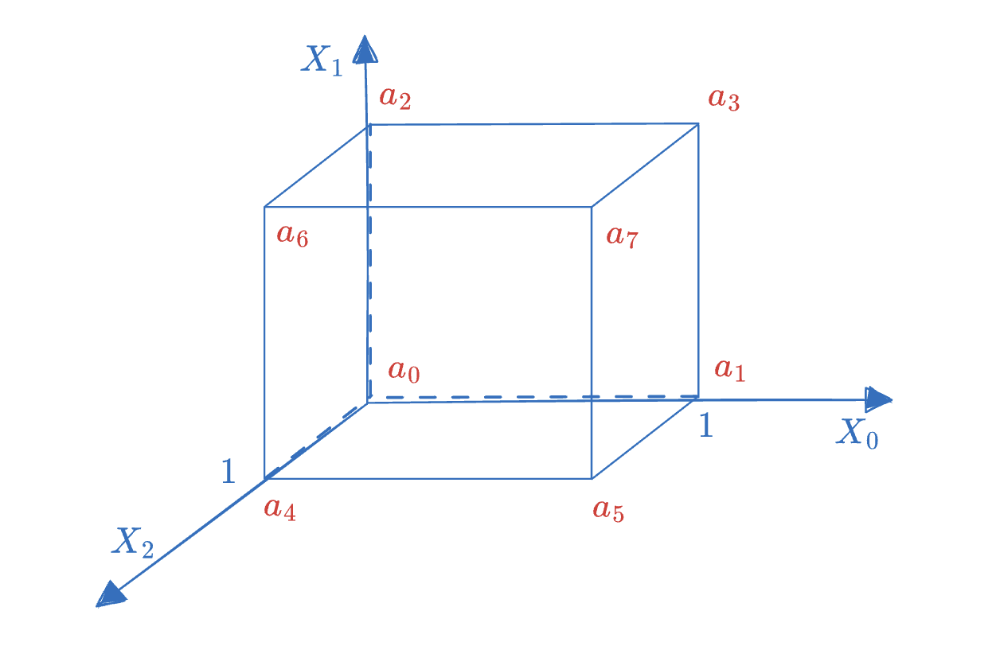
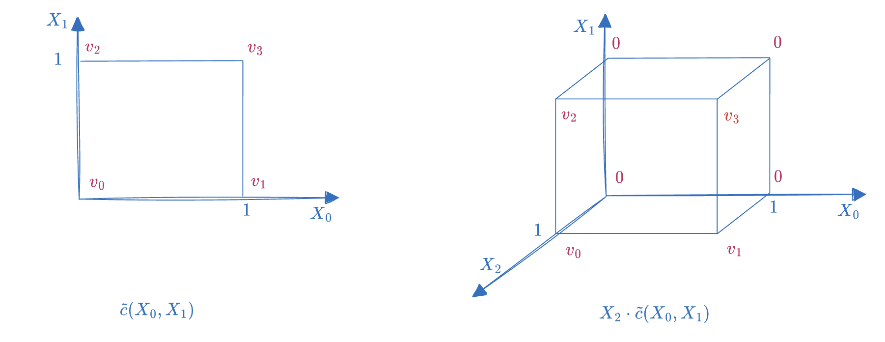
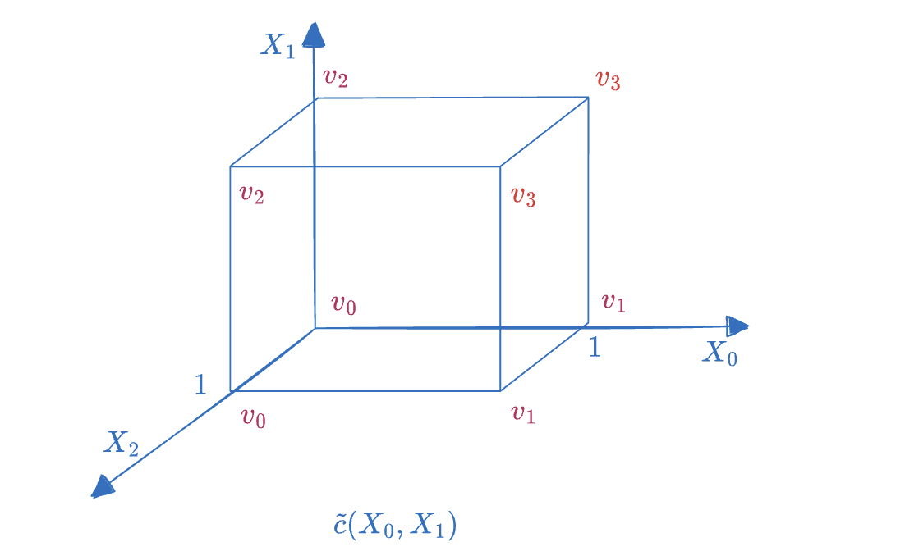
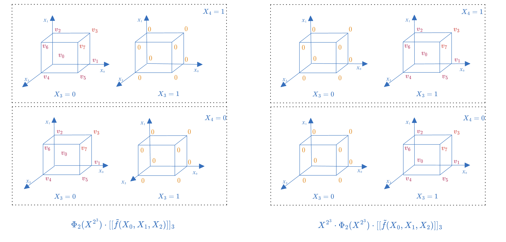

# ZeroMorph 笔记

- Yu Guo <yu.guo@secbit.io>

Zeromorph [KT23] 是一个基于 KZG10 的 MLE 多项式承诺方案。事实上，Zeromorph 方案是一个更一般性的框架，可以基于不同的 Univariate Polynomial Commitment 方案，比如 FRI-based Zeromorph 方案。

Zeromorph 的核心要点是将 MLE 多项式的 Evaluations 即「点值向量」作为 Univariate 多项式的「系数向量」。这个做法看起来有些奇怪，不过这个框架仍然不失清晰简洁性。

理解 Zeromorph 的关键在于对高维的 Boolean Hypercube 上取值的变换的理解，以及它们如何对应于 Univariate 多项式的运算。

## MLE 多项式

所谓的 MLE（Multilinear Extension） 多项式 $\tilde{f}$ 是定义在 Boolean Hypercube 上的一类 Multivariate 多项式。它的每一项中任何一个未知数的次数都不超过 $1$，例如 $\tilde{f}=1 + 2X_0 + 3X_1X_0$ 是一个 MLE 多项式，而 $\tilde{f}'=1 + 2X_0^2 + 3X_1X_0 + X_1$ 则不是，因为 $X_0^2$ 的次数大于 $1$。

一个 MLE 多项式可以对应到一个从 Boolean 向量到一个有限域的函数，即 $f:\{0,1\}^n\to \mathbb{F}_q$，我们则称其维度为 $n$ 。下图是一个三维的 MLE 多项式 $\tilde{f}(X_0, X_1, X_2)$ 的示例，这个多项式可以唯一地被 $(a_0, a_1, \ldots, a_7)$ 这个「点值向量」来表示。这对应于 Univariate 多项式中的「点值式」表示，即 Evaluations form。

当然一个 MLE 多项式也可以采用「系数式」来表示，即 Coefficients form ，表示如下：

$$
\tilde{f}(X_0, X_1, \ldots, X_{n-1}) = \sum_{i_0=0}^{1}\sum_{i_1=0}^{1}\cdots \sum_{i_{n-1}=0}^{1} f_{i_0i_1\cdots i_{n-1}} X_0^{i_0}X_1^{i_1}\cdots X_{n-1}^{i_{n-1}}
$$

对于上图三维 MLE 多项式的例子，我们可以将它写为：

$$
\tilde{f}(X_0, X_1, X_2) = f_0 + f_1X_0 + f_2X_1 + f_3X_2 + f_4X_0X_1 + f_5X_0X_2 + f_6X_1X_2 + f_7X_0X_1X_2
$$

其中 $(f_0, f_1, \ldots, f_7)$ 为 MLE 多项式的系数向量。注意因为 MLE 多项式属于多元多项式（Multivariate Polynomial），任何表示方式都需要事先确定多项式中的项的排序顺序，本文以及后续讨论我们都基于 Lexicographic Order。

对于 MLE 多项式的「点值式」表示，我们可以定义为：

$$
\tilde{f}(X_0, X_1, \ldots, X_{n-1}) = \sum_{i_0=0}^{1}\sum_{i_1=0}^{1}\cdots \sum_{i_{n-1}=0}^{1} a_{i_0i_1\cdots i_{n-1}}\cdot eq(i_0, i_1, \ldots, i_{n-1}, X_0, X_1, \ldots, X_{n-1})
$$

其中 $eq$ 为 一组关于 $n$ 维 Boolean Hypercube $\{0, 1\}^n$ 的 Lagrange Polynomial：

$$
eq(i_0, i_1, \ldots, i_{n-1}, X_0, X_1, \ldots, X_{n-1}) = \prod_{j=0}^{n-1} \Big((1-i_j)\cdot (1-X_j)+ i_j\cdot X_j\Big)
$$

MLE 多项式在「点值式」和「系数式」之间存在 $N\log(N)$ 的转换算法，这里不再深入讨论。

我们可以使用 ZeroMorph 将一个 MLE 多项式映射到一个 Univariate 多项式，具体一点说，是将 MLE 多项式在 Boolean Hypercube 上的「点值向量」映射到一个 Univariate 多项式 的「系数向量」。

## MLE 多项式到 Univariate 多项式

我们以一个简单的例子来快速了解下这个映射关系。考虑下面一个维度只有 2 的 MLE 多项式：

$$
\tilde{f}(X_0, X_1) = 2 + X_1 + X_0X_1
$$

容易验证，它在 Boolean Hypercube 上的点值表示为：

$$
\begin{split}
\tilde{f}(0,0) = 2 \\ 
\tilde{f}(1,0) = 2 \\
\tilde{f}(0,1) = 3 \\
\tilde{f}(1,1) = 4 \\
\end{split}
$$

如果采用 ZeroMorph 方案，它可以映射到如下的 Univariate 多项式：

$$
\hat{f}(X) = 2 + 2\cdot X + 3\cdot X^2 + 4\cdot X^3
$$

假设我们有一个 Univariate 多项式的承诺方案，那么我们就可以计算映射后的 Univariate 多项式的承诺。例如，假设我们有以下的 KZG10 承诺方案的 SRS：

$$
SRS = ([1]_1, [\tau]_1, [\tau^2]_1, [\tau^3]_1, \ldots, [\tau^{D}]_1, [1]_2, [\tau]_2, [\tau^2]_2, [\tau^3]_2, \ldots, [\tau^D]_2)
$$

根据 KZG10 的承诺算法，我们计算 $\hat{f}(X)$ 的承诺如下：

$$
\mathsf{cm}(\hat{f}) = 2\cdot [1]_1 + 2\cdot [\tau]_1 + 3\cdot [\tau^2]_1 + 4\cdot [\tau^3]_1
$$

后续我们用符号 $[[\tilde{f}]]$ 来表示 MLE 多项式 $\tilde{f}$ 映射所对应的 Univariate 多项式。

### 多项式映射

这一节，我们讨论下更多的映射情况。为了简化起见，我们先考虑三维 MLE 的情况，即 $\tilde{f}\in \mathbb{F}_q[X_0, X_1, X_2]^{\leq 1}$。

假设 $\tilde{f}$ 只是一个常数多项式，即它的系数向量只有第一项非零，其余元素都为零。多项式可以表示如下：

$$
\tilde{c}(X_0, X_1, X_2) = c_0
$$

我们考虑下这样一个常数多项式会映射到一个什么样的 Univariate 多项式。首先我们要把它转换成点值式，考虑在一个三维的 Boolean Hypercube 上，无论 $X_0,X_1,X_2\in\{0, 1\}$ 如何取值，这个多项式在 Boolean Hypercube 上的取值都为 $c_0$，那么这也意味着它的点值式为 $(c_0, c_0, c_0, \ldots, c_0)$，于是它所对应的 Univariate 多项式为：

$$
\begin{split}
    [[\tilde{c}]] &= c_0 + c_0X + c_0X^2 + c_0X^3 + \ldots + c_0X^{7} \\
    & = c_0 \cdot (1 + X + X^2 + X^3 + \ldots + X^{7}) \\
\end{split}
$$

那我们再考虑一个二维的 MLE 多项式 $\tilde{c}'(X_0, X_1)$，它同样是一个常数多项式，即 $\tilde{c}'(X_0, X_1) = c_0$，那么它对应的 Univariate 多项式为：

$$
\begin{split}
    [[\tilde{c}']] &= c_0 + c_0X + c_0X^2 + c_0X^3  \\
    & = c_0 \cdot (1 + X + X^2 + X^3) \\
\end{split}
$$

我们可以看到，虽然两个 MLE 多项式 $\tilde{c}$ 和 $\tilde{c}'$ 的系数式表示完全一样，但它们映射到的 Univariate 多项式并不一样。这是因为不管是 Univariate 还是 Multivariate 的多项式，它们的点值式表示都隐含了 Evaluation Domain 的选取。$\tilde{c}$ 的 Evaluation Domain 是 3 维的 Boolean Hypercube，而 $\tilde{c}'$ 的 Evaluation Domain 是 2 维的 Boolean Hypercube。因此，当我们计算多项式的点值式时，需要明确下 Evaluation Domain 的选择，对于 MLE 多项式来说，如果它的 Evaluation Domain 是 $n$ 维的 Boolean Hypercube，那么我们修改下映射记号表示，在映射括加上下标 $n$，即 $[[\tilde{f}]]_n$ 。下面是 $\tilde{c}$ 在两个不同的 Evaluation Domain 上的映射所产生的两个不同的 Univariate 多项式：

$$
\begin{split}
    [[\tilde{c}]]_2 &= c_0 + c_0X + c_0X^2 + c_0X^3  \\
    [[\tilde{c}]]_3 &= c_0 + c_0X + c_0X^2 + c_0X^3 + c_0X^4 + c_0X^5 + c_0X^6 + c_0X^7 \\
\end{split}
$$

### 映射的加法同态

对于任意两个维度相同的 MLE 多项式，比如 $\tilde{f}_1(X_0, X_1)$ 和 $\tilde{f}_2(X_0, X_1)$ ，假如两者的点值式表示为

$$
\tilde{f}_1(X_0, X_1) = v_0\cdot eq(0,0, X_0, X_1) + v_1\cdot eq(0,1, X_0, X_1) + v_2\cdot eq(1,0, X_0, X_1) + v_3\cdot eq(1,1, X_0, X_1)
$$

$$
\tilde{f}_2(X_0, X_1) = v_0'\cdot eq(0,0, X_0, X_1) + v_1'\cdot eq(0,1, X_0, X_1) + v_2'\cdot eq(1,0, X_0, X_1) + v_3'\cdot eq(1,1, X_0, X_1)
$$

那么它们的和为：$\tilde{f}_1(X_0, X_1) + \tilde{f}_2(X_0, X_1)$，其点值式为：

$$
\begin{split}
    \tilde{f}_1(X_0, X_1) + \tilde{f}_2(X_0, X_1) &= (v_0+v_0')\cdot eq(0,0, X_0, X_1) + (v_1+v_1')\cdot eq(0,1, X_0, X_1) \\
    & \ + (v_2+v_2')\cdot eq(1,0, X_0, X_1) + (v_3+v_3')\cdot eq(1,1, X_0, X_1) \\
\end{split}
$$

于是下面的等式成立：
> TODO: 这里要展开推导

$$
[[\tilde{f}_1(X_0, X_1) + \tilde{f}_2(X_0, X_1)]]_2 = [[\tilde{f}_1(X_0, X_1)]]_2 + [[\tilde{f}_2(X_0, X_1)]]_2
$$

同时不难证明，上面的等式对任意的维度相同的 MLE 多项式都成立。另外也不难证明：

$$
[[\alpha\cdot \tilde{f}]]_n = \alpha\cdot [[\tilde{f}]]_n,\quad \forall \alpha \in \mathbb{F}_q
$$

因此，我们说 $[[\tilde{f}]]_n$ 这个映射具有多项式加法同态性，并且是一个一一映射（Injective and Surjective）。

### 低维到高维的映射

我们考虑更一般多项式的情况，假设一个二维的 MLE 多项式 $\tilde{c}(X_0, X_1)$，它在二维 Boolean Hypercube 上的取值为 $(v_0, v_1, v_2, v_3)$，那么它对应的 Univariate 多项式为：

$$
\begin{split}
    [[\tilde{c}]]_2 &= v_0 + v_1X + v_2X^2 + v_3X^3 \\
\end{split}
$$

而 $X_2\cdot \tilde{c}(X_0, X_1)$ 也同样是一个 MLE 多项式，维度为 3 。它在三维 Boolean Hypercube 上的取值为： $(0, 0, 0, 0, v_0, v_1, v_2, v_3)$ ，即前四项为零，后四项等于 $\tilde{c}(X_0, X_1)$ 在二维 Boolean Hypercube 上的取值，如下图所示：

这个容易解释，因为当 $X_2=0$ 时，整体多项式取值为零，于是 $X_0, X_1$ 构成的二维正方形顶点上的值都为零，而当 $X_2=1$ 时，多项式 $X_2\cdot \tilde{c}(X_0, X_1)$ 等于 $\tilde{c}(X_0, X_1)$ 。因此 $X_2=1$ 的平面正方形的顶点上的值等于 $\tilde{c}(X_0, X_1)$ ，进一步我们可以有这样的结论：

$$
[[X_2\cdot \tilde{c}]]_3 = X^4 \cdot [[\tilde{c}]]_2
$$

快速推导如下 ：

$$
[[X_2\cdot \tilde{c}]]_3 = v_0X^4 + v_1X^5 + v_2X^6 + v_3X^7 = X^4\cdot (v_0 + v_1X + v_2X^2 + v_3X^3) = X^4 \cdot [[\tilde{c}]]_2
$$

这里的 $X^4$ 推高了 $[[\tilde{c}]]_2$ 的次数，使得它能够刚好放在三维的 Boolean Hypercube 的高位区域（即 $X_2=1$ 的区域）。

然后考虑下 $\tilde{c}(X_0, X_1)$ 在三维 Boolean Hypercube 上的取值，我们会发现新增加的未知数 $X_2$，不管取值为 0 还是 1，多项式的取值只和 $X_0, X_1$ 有关，因此，它的点值式等于二维点值向量复制一份，从而填满 3 维的 Hypercube，如下图所示：

换句话说，$\tilde{c}(X_0, X_1)$ 在三维 Hypercube 上的点值式为 $(v_0, v_1, v_2, v_3, v_0, v_1, v_2, v_3)$，因此它所映射到的 Univariate 多项式为：

$$
\begin{split}
    [[\tilde{c}]]_3 &= v_0 + v_1X + v_2X^2 + v_3X^3 + v_0X^4 + v_1X^5 + v_2X^6 + v_3X^7 \\
    & = (1 + X^4)\cdot (v_0 + v_1X + v_2X^2 + v_3X^3) \\
    & = (1 + X^4)\cdot [[\tilde{c}]]_2
\end{split}
$$

上面的等式可以这么解释：三维 Hypercube 上的取值由两部分拼接而成，$[[\tilde{c}]]_2$ 与由 $X^4$ 推高次数的 $[[\tilde{c}]]_2$。

同理可推，$\tilde{c}(X_0, X_1)$ 在四维 Hypercube 上的取值为 $(v_0, v_1, v_2, v_3, \quad v_0, v_1, v_2, v_3, \quad v_0, v_1, v_2, v_3, \quad v_0, v_1, v_2, v_3)$，那么它所映射到的 Univariate 多项式为：

$$
\begin{split}
    [[\tilde{c}]]_4 &= v_0 + v_1X + v_2X^2 + v_3X^3 + v_0X^4 + v_1X^5 + v_2X^6 + v_3X^7 + v_0X^8 + v_1X^9 + v_2X^{10} + v_3X^{11} + v_0X^{12} + v_1X^{13} + v_2X^{14} + v_3X^{15} \\
    & = (1 + X^4 + X^8 + X^{12})\cdot (v_0 + v_1X + v_2X^2 + v_3X^3) \\
    & = (1 + X^4 + X^8 + X^{12})\cdot [[\tilde{c}]]_2
\end{split}
$$

把低维的 MLE 拉升到一个高维的 Hypercube 上，就会出现低维 Hypercube 不断复制自己的现象。我们可以定义一个新的多项式函数，$\Phi_k(X)$，来表示这种周期性的复制操作：

$$
\Phi_k(X^h) = 1 + X^h + X^{2h} + \ldots + X^{(2^{k}-1)h}
$$

显然，$[[\tilde{c}]]_4=\Phi_1(X^4)\cdot [[\tilde{c}]]_2$。

## MLE 多项式的除法分解

接下来的问题是：如何利用这个 MLE 到 Unvariate 多项式映射来实现 MLE 的 Evaluation 证明协议。具体点说，如何利用 $\mathsf{cm}(\tilde{f})$ 来验证 $\tilde{f}$ 在某个点的取值的正确性，比如 $\tilde{f}(u_0, u_1)$？我们虽然已经有了一个基于 KZG10 的 Evaluation Argument 协议，可惜是基于 Univariate 多项式，而非 MLE 多项式。KZG10 利用了 Univariate 多项式的除法分解性质，如下公式

$$
\hat{f}(X) -  \hat{f}(z) = q(X)\cdot (X-z)
$$

将商多项式 $q(X)$ 的承诺 $\mathsf{cm}(q)$ 作为 Evaluation 的证明。那么我们如何将 MLE 在一个多维空间的点，比如 $(u_0, u_1, \ldots, u_{n-1})$ 上的 Evaluation 证明问题，转化为 Univariate 多项式在一个点或多个点上的 Evaluation 证明呢？

论文 [PST13] 给出了一个上述定理的多元多项式版本：

$$
f(X_0, X_1, \ldots, X_{n-1}) - f(u_0, u_1, \ldots, u_{n-1})= \sum_{k=0}^{n-1}q_k(X_0, X_1, \ldots, X_{n-1}) \cdot (X_k - u_k)
$$

如果 $f(X_0, X_1, \ldots, X_{n-1})$ 是一个 MLE 多项式，那么它可以被简化为下面的公式：

$$
\begin{split}
\tilde{f}(X_0, X_1, \ldots, X_{n-1}) - \tilde{f}(u_0, u_1, \ldots, u_{n-1}) & = \tilde{q}_{n-1}(X_0, X_1, \ldots, X_{\color{red}n-2}) \cdot (X_{n-1} - u_{n-1}) \\
& + \tilde{q}_{n-2}(X_0, X_1, \ldots, X_{\color{red}n-3}) \cdot (X_{n-2} - u_{n-2}) \\
& + \cdots \\
& + \tilde{q}_{1}(X_0) \cdot (X_{1} - u_{1}) \\
& + \tilde{q}_{0} \cdot (X_{0} - u_{0}) \\
\end{split}
$$

这是因为 MLE 多项式  $f(X_0, X_1, \ldots, X_{n-1})$ 中每一个未知数的最高次数为 $1$，对于 $f(X_0, X_1, \ldots, X_{k})$，它除以 $(X_k-u_k)$ 因式之后，余数多项式中将不再含有未知数 $X_k$ ，所以当 $f(X_0, X_1, \ldots, X_{n-1})$ 依次除以 $(X_{n-1} - u_{n-1})$ 到 $(X_0 - u_0)$ 这些因式，我们得到的商多项式和余数多项式中的未知数个数一直在逐个减少，直到最后得到一个常数的商多项式 $\tilde{q}_0$，当然还有一个常数的余数多项式，而后者正好是 MLE 多项式在 $(u_0, u_1, \ldots, u_{n-1})$ 处的求值。

我们假设这个最后的求值为 $v$ ，即

$$
\tilde{f}(u_0, u_1, \ldots, u_{n-1}) = v
$$

那么我们对余数定理等式的左右两边（都看成是一个 MLE 多项式）分别进行 Zeromorph 映射，得到对应的 Univariate 多项式。

$$
[[\tilde{f}(X_0, X_1, \ldots, X_{n-1}) - v]]_n= [[\sum_{k=0}^{n-1}\tilde{q}_k(X_0, X_1, \ldots, X_{\color{red}k-1}) \cdot (X_k - u_k)]]_n
$$

由于映射具有加法的同态性，因此我们可以继续化简上面的等式：

$$
\begin{split}
[[\tilde{f}(X_0, X_1, \ldots, X_{n-1})]]_n - [[v]]_n &= \sum_{k=0}^{n-1}[[\tilde{q}_k(X_0, X_1, \ldots, X_{k-1}) \cdot (X_k - u_k)]]_n \\
&= \sum_{k=0}^{n-1}\Big([[X_k\cdot \tilde{q}_k(X_0, X_1, \ldots, X_{k-1})]]_n - u_k[[\tilde{q}_k(X_0, X_1, \ldots, X_{k-1})]]_n\Big)
\end{split}
$$

先看等式左边的 $[[\tilde{f}(X_0,X_1,\ldots, X_{n-1})]]_n$ 这一项直接映射到 $\hat{f}(X)$，再看 $[[v]]_n$ 这一项，它映射到 $\hat{v}(X)$，

$$
[[v]]_n  = \hat{v}(X) = v + vX + vX^2 + \ldots + vX^{2^n-1}
$$

或者我们改用 $\Phi_n(X)$ 函数来表示：

$$
[[v]]_n = v\cdot\Phi_n(X)
$$

看下等式右边的 $[[\tilde{q}_k(X_0, X_1, \ldots, X_{k-1})]]_n$，这一项是将 $k$ 维的 Hypercube填充到 $n$ 维的 Hypercube 上，然后再进行映射。根据前面的讨论，我们需要将 $k$ 维的 Hypercube 连续复制 $2^{n-k}$ 次，从而填满 $n$ 维 Hypercube：

$$
[[\tilde{q}_k(X_0, X_1, \ldots, X_{k-1})]]_n = \Phi_{n-k}(X^{2^k})\cdot [[\tilde{q}_k(X_0, X_1, \ldots, X_{k-1})]]_{k}
$$

再解释下, $\Phi_{n-k}(X^{2^k})$ 定义展开如下：

$$
\Phi_{n-k}(X^{2^k}) = 1 + X^{2^k} + X^{2\cdot 2^k} + \ldots + X^{(2^{n-k}-1)\cdot 2^k}
$$

它的系数为一个若干个 $0,1$ 组成，并且每两个 $1$ 之间位置间隔为 $2^k$：

$$
(1, 0, 0 ,\ldots, 0, \quad 1, 0 ,\ldots, 0, \quad 1, 0 ,\ldots, 0, \quad 1)
$$

假设有一个次数受限的多项式 $g(X)\in\mathbb{F}_q[X]$，满足 $\deg(g)<2^k$ ，那么多项式 $\Phi_{n-k}(X^{2^k})\cdot g$ 就表示了一个 $2^k-1$ 次多项式 $g(X)$ 被 $2^k$ 间隔的系数向量重复了 $2^{n-k}$ 次，最终得到了一个 $2^n-1$ 次的多项式。

最后还剩下 $[[X_k\cdot \tilde{q}_k(X_0, X_1, \ldots, X_{k-1})]]_n$ 这项，如何继续化简它呢？

我们可以分两步来构造它的映射，首先看 $\tilde{q}_k(X_0, X_1, \ldots, X_{k-1})$ 可以由一个 k 维 Boolean Hypercube 表示，然后当乘以一个新的未知数 $X_k$，它就变成了一个需要 $k+1$ 维的 Boolean Hypercube 表示的 MLE 多项式。而这个新 Boolean Hypercube 可以分为两部分，一部分都是零（当 $X_k=0$ 时），另一部分正是 $\tilde{q}_k(X_0, X_1, \ldots, X_{k-1})$ （当 $X_k=1$ 时）。所以我们先利用 $\Phi_n(X)$ 函数，构造一个 Boolean Hypercube 的重复模式，其中间隔为 $2^{k+1}$，然后把 $k$ 维 Boolean Hypercube 进行 $2^{n-k-1}$ 次复制，于是我们得到了下面的多项式。

$$
\Phi_{n-k-1}(X^{2^{k+1}})\cdot [[\tilde{q}_k(X_0, X_1, \ldots, X_{k-1})]]_{k}
$$

不过这只是第一步。上面这个 Univariate 多项式和 $[[X_k\cdot \tilde{q}_k(X_0, X_1, \ldots, X_{k-1})]]_n$ 还不相等，因为前者在每一个重复的 $k+1$ 维 Boolean Hypercube 中，$X_k=1$ 部分为零，而 $X_k=0$ 部分放的则是 $k$ 维 Boolean Hybercube $\tilde{q}_k(X_0, X_1, \ldots, X_{k-1})$，这与我们想要的 Boolean Hypercube 不同。我们需要再为它补上 $X^{2^k}$ 这样的移位因子，这样就可以调换 $X_k$ 所对应的 $k$ 维的 Boolean Hypercube 的位置（从低位区域转移到高位区域）。映射后的结果为：

$$
[[X_k\cdot \tilde{q}_k(X_0, X_1, \ldots, X_{k-1})]]_n = X^{2^k}\cdot \Phi_{n-k-1}(X^{2^{k+1}})\cdot [[\tilde{q}_k(X_0, X_1, \ldots, X_{k-1})]]_{k}
$$

下图用一个特定的例子演示，其中 $k=3, n=5$， 左边为移位前的 $5$ 维 Boolean Hypercube，其中上下两半场表示第五个维度，每个半场有两个三维立方体，表示第四个维度。我们可以看到，仅当 $X_3=0$ 的三维立方体恰好对应 $\tilde{f}(X_0, X_1, X_2)$，而当 $X_3=1$ 时，三维立方体上全为零。而下图右边为移位后的 $5$ 维 Boolean Hypercube，其中的 $\tilde{f}(X_0, X_1, X_2)$ 立方体被移位到了右边，也就是 $X_3=1$ 所对应的区域。

到此，我们可以得到 Zeromorph 协议的关键等式：

$$
\begin{split}
[[\tilde{f}(X_0, X_1, \ldots, X_{n-1})]]_n - v\cdot\Phi_n(X) &=\sum_{k=0}^{n-1}\Big(X^{2^k}\cdot \Phi_{n-k-1}(X^{2^{k+1}}) - u_k\cdot\Phi_{n-k}(X^{2^k})\Big)\cdot [[\tilde{q}_k(X_0, X_1, \ldots, X_{k-1})]]_k
\end{split}
$$

## 基于 KZG10 的 Evaluation Argument

注意到上节我们推导出的 Zeromorph 等式是一个关于 Univariate 多项式的等式，我们简写为：

$$
\hat{f}(X) - v\cdot\Phi_n(X) = \sum_k \Big(X^{2^k}\cdot \Phi_{n-k-1}(X^{2^{k+1}}) - u_k\cdot\Phi_{n-k}(X^{2^k})\Big)\cdot \hat{q}_k(X)
$$

这里 $\hat{f}(X)$ 与 $\hat{q}_k(X)$ 定义如下：

$$
\begin{split}
\hat{f}(X) &= [[\tilde{f}(X_0, X_1, \ldots, X_{n-1})]]_n \\
\hat{q}_k(X) &= [[\tilde{q}_k(X_0, X_1, \ldots, X_{k-1})]]_k\\
\end{split}
$$

我们要证明 $\tilde{f}(X_0, X_1, \ldots, X_{n-1})$ 在点 $(u_0, u_1, \ldots, u_{n-1})$ 处的取值为 $v$，那么我们只需要检查上面的多项式是否相等即可。这里利用 Schwartz-Zippel 引理的思想，让 Verifier 随机挑选一个点 $X=\zeta$ ，然后让 Prover 提供 $\hat{f}(\zeta)$ 和 $\hat{q}_k(\zeta)$ 的值，以便于 Verifier 验证下面的等式是否成立：

$$
\hat{f}(\zeta) - v\cdot\Phi_n(\zeta) = \sum_k \Big(\zeta^{2^k}\cdot \Phi_{n-k-1}(\zeta^{2^{k+1}}) - u_k\cdot\Phi_{n-k}(\zeta^{2^k})\Big)\cdot \hat{q}_k(\zeta)
$$

不过这还不够，因为 Prover 实际上承诺的是 $\hat{q}_k(X)$，为了保证 MLE 余数多项式关系成立，我们要强制要求所有的商多项式 $\hat{q}_k(X)$ 的次数都小于 $2^k$，即 $\deg(\hat{q}_k)<2^k$，以确保 Prover 没有作弊的空间。

不管是 FRI 还是 KZG10，都提供了证明 $\deg(\hat{q}_k)<2^k$ 的方法。本文我们仅考虑基于 KZG10 的 Zeromorph 协议。一个简单的基于 KZG10 的 Degree Bound 证明协议如下：

- Prover 提供 $\mathsf{cm}(\hat{q}_k)$ 并附加上 $\mathsf{cm}(X^{D-2^k+1}\cdot \hat{q}_k(X))$ 发送给 Verifier，
-  Verifier 验证下面的等式：

$$
e\big(\mathsf{cm}(\hat{q}_k),\ [\tau^{D-2^k+1}]_2\big) = e\big(\mathsf{cm}(X^{D-2^k+1}\cdot \hat{q}_k(X)),\ [1]_2\big)
$$

这里  $X^{D-2^k+1}\cdot \hat{q}_k(X)$ 的作用是把 $\hat{q}_k(X)$ 的 Degree 对齐到 $D$。因为 KZG10 的 SRS 中，能承诺的多项式的 Degree 最多为 $D$，所以如果 $\hat{q}_k(X)$ 的 Degree 超过了 $2^k$，那么 $\deg(X^{D-2^k+1}\cdot \hat{q}) > D$，这样就无法用 KZG10 的 SRS 中进行承诺。反之如果 Prover 可以正确承诺 $X^{D-2^k+1}\cdot \hat{q}_k(X)$ ，那就证明了 $\deg(\hat{q}_k)<2^k$ 。

### Evaluation 证明协议

下面我们先给出一个简单朴素的协议实现，方便理解。

#### 公共输入

- MLE 多项式 $\tilde{f}$ 的承诺 $\mathsf{cm}([[\tilde{f}]]_n)$
- 求值点 $\mathbf{u}=(u_0, u_1, \ldots, u_{n-1})$
- 求值结果 $v = \tilde{f}(\mathbf{u})$

#### Witness

- MLE 多项式  $\tilde{f}$ 在 $n$ 维 Hypercube 上的点值向量 $\mathbf{a} = (a_0, a_1, \ldots, a_{2^n-1})$

#### Round 1

Prover 发送余数多项式的承诺

- 计算 $n$ 个余数 MLE 多项式， $\{\tilde{q}_k\}_{k=0}^{n-1}$ 
- 构造余数 MLE 多项式所映射到的 Univariate 多项式 $\hat{q}_k=[[\tilde{q}_k]]_k, \quad 0 \leq k < n$
- 计算并发送它们的承诺：$\mathsf{cm}(\hat{q}_0), \mathsf{cm}(\hat{q}_1), \ldots, \mathsf{cm}(\hat{q}_{n-1})$

$$
\tilde{f}(X_0,X_1,\ldots, X_{n-1}) - v = \sum_{k=0}^{n-1} (X_k-u_k) \cdot \tilde{q}_k(X_0,X_1,\ldots, X_{k-1})
$$

Prover 计算，$\pi_k=\mathsf{cm}(X^{D_{max}-2^k+1}\cdot \hat{q}_k), \quad 0\leq k<n$ ，作为 $\deg(\hat{q}_k)<2^k$ 的 Degree Bound 证明 ，一并发送给 Verifier

#### Round 2

1. Verifier 发送随机数 $\zeta\in \mathbb{F}_p^*$

2. Prover 计算辅助多项式 $r(X)$ 与商多项式 $h(X)$，并发送 $\mathsf{cm}(h)$ 
- 计算 $r(X)$ ，

$$
r(X) = [[\tilde{f}]]_{n} - v\cdot \Phi_{n}(\zeta) - \sum_{k=0}^{n-1} \Big(\zeta^{2^k}\cdot \Phi_{n-k-1}(\zeta^{2^{k+1}}) - u_k\cdot \Phi_{n-k}(\zeta^{2^{k}})\Big)\cdot \hat{q}_k(X)
$$

- 计算 $h(X)$ 及其承诺 $\mathsf{cm}(h)$， 作为 $r(X)$ 在 $X=\zeta$ 点取值为零的证明

$$
h(X) = \frac{r(X)}{X-\zeta}
$$

#### Verification 

Verifier 验证下面的等式

- 构造 $\mathsf{cm}(r)$ 的承诺：

$$
\mathsf{cm}(r) = \mathsf{cm}([[\tilde{f}]]_{n}) - \mathsf{cm}(v\cdot \Phi_{n}(\zeta)) - \sum_{i=0}^{n-1} \Big(\zeta^{2^i}\cdot \Phi_{n-i-1}(\zeta^{2^{i+1}}) - u_i\cdot \Phi_{n-i}(\zeta^{2^{i}})\Big)\cdot \mathsf{cm}(\hat{q}_i)
$$

- 验证 $r(\zeta) = 0$

$$
e(\mathsf{cm}(r), \ [1]_2) = e(\mathsf{cm}(h), [\tau]_2 - \zeta\cdot [1]_2)
$$

- 验证 $(\pi_0, \pi_1, \ldots, \pi_{n-1})$ 是否正确，即验证所有的余数多项式的 Degree Bound： $\deg(\hat{q}_i)<2^i$ ，对于 $0\leq i<n$

$$
e(\mathsf{cm}(\hat{q}_i), [\tau^{D_{max}-2^i+1}]_2) = e(\pi_i, [1]_2), \quad 0\leq i<n
$$

### 效率概述

- 证明尺寸： $(2n+1)\mathbb{G}_1$
- Verifier 计算量： $(2n +2) P$，$(n+2)\mathsf{EccMul}^{\mathbb{G}_1}$

## 优化协议

朴素协议中有 $n$ 个商多项式，它们的 Degree Bound 有 $2n$ 个 $\mathbb{G}_1$ ，这显然不够高效。不过，我们可以批量地证明这 $n$ 个 degree bound。下面是传统的批量证明的思路：

- Verifer 先发送一个随机数 $\beta$
- Prover 把 $n$ 个商多项式聚合在一起，得到 $\bar{q}(X)$，聚合的时候把这些商多项式的 Degree 补齐到同一个值，即  $2^n - 1$ ：

$$
\bar{q}(X) = \sum_{k=0}^{n-1} \beta^k \cdot X^{2^n-2^k}\cdot \hat{q}_k(X)
$$

- Prover 发送 $\bar{q}(X)$ 的承诺 $\mathsf{cm}(\bar{q})$
- Verifier 发送随机数 $\zeta$
- Prover 构造多项式 $s(X)$，它在 $X=\zeta$ 处取值为零，即 $s(\zeta)=0$

$$
s(X) = \bar{q}(X) - \sum_{k=0}^{n-1} \beta^k \cdot \zeta^{2^n-2^k}\cdot \hat{q}_k(X)
$$

- Prover 构造商多项式 $h_1(X)$ 并将其 Degree 对齐到最大的 Degree Bound $D$，然后证明 $s(\zeta)=0$ ，并发送承诺 $\mathsf{cm}(h_1)$ 

$$
h_1(X) = \frac{s(X)}{X-\zeta}\cdot X^{D-2^n+2}
$$

- Verifier 手里有 $\mathsf{cm}(\bar{q})$ 与 $\mathsf{cm}(\hat{q}_i)$，他可以根据下面的等式，还原出 $\mathsf{cm}(s)$ 的承诺：

$$
\mathsf{cm}(s) = \mathsf{cm}(\bar{q}) - \sum_{i=0}^{n-1} \beta^i \cdot \zeta^{2^n-2^k}\cdot \mathsf{cm}(\hat{q}_i)
$$

- Verifier 只需要两个 Pairing 运算即可验证 $s(\zeta)=0$，从而得到 $n$ 个 Degree Bound 证明成立

$$
e\big(\mathsf{cm}(s), \ [\tau^{D_{max}-2^n+2}]_2\big) = e\big(\mathsf{cm}(h_1), [\tau]_2 - \zeta\cdot [1]_2\big)
$$

此外，Verfier 还可以发一个随机数 $\alpha$，进一步聚合 $r(X)$ 与 $s(X)$ 的取值证明，因为它们两个在 $X=\zeta$ 处的取值都为零。

下面是优化版本的 Zeromorph 协议，参见 Zeromorph 论文 [KT23] Section 6。优化的技术主要是将多个 Degree Bound 证明聚合在一起，同时将 $r(X)$ 的求值证明也聚合在一起。这样可以仅使用两个 Pairing 运算来验证验证（这个版本暂时不考虑 Zero-knowledge 的性质）。

### Evaluation 证明协议

#### 公共输入

- MLE 多项式 $\tilde{f}$ 映射到 Univariate 多项式 $f(X)=[[\tilde{f}]]_n$ 的承诺 $\mathsf{cm}([[\tilde{f}]]_n)$
- 求值点 $\mathbf{u}=(u_0, u_1, \ldots, u_{n-1})$
- 求值结果 $v = \tilde{f}(\mathbf{u})$

#### Witness

- MLE 多项式  $\tilde{f}$ 的求值向量 $\mathbf{a} = (a_0, a_1, \ldots, a_{2^n-1})$

#### Round 1

第一轮：Prover 发送余数多项式的承诺

- 计算 $n$ 个余数 MLE 多项式， $\{q_i\}_{i=0}^{n-1}$ 
- 构造余数 MLE 多项式所映射到的 Univariate 多项式 $\hat{q}_i=[[q_i]]_i, \quad 0 \leq i < n$
- 计算并发送它们的承诺：$\mathsf{cm}(\hat{q}_0), \mathsf{cm}(\hat{q}_1), \ldots, \mathsf{cm}(\hat{q}_{n-1})$

$$
\tilde{f}(X_0,X_1,\ldots, X_{n-1}) - v = \sum_{i=0}^{n-1} (X_k-u_k) \cdot q_i(X_0,X_1,\ldots, X_{k-1})
$$
#### Round 2

1. Verifier 发送随机数 $\beta\in \mathbb{F}_p^*$ 用来聚合多个 Degree Bound 证明

2. Prover 构造 $\bar{q}(X)$ 作为聚合商多项式 $\{\hat{q}_i(X)\}$ 的多项式，并发送其承诺 $\mathsf{cm}(\bar{q})$ 

$$
\bar{q}(X) = \sum_{i=0}^{n-1} \beta^i \cdot X^{2^n-2^i}\hat{q}_i(X)
$$

#### Round 3

1. Verifier 发送随机数 $\zeta\in \mathbb{F}_p^*$ ，用来挑战多项式在 $X=\zeta$ 处的取值

2. Prover 计算 $h_0(X)$ 与 $h_1(X)$

- 计算 $r(X)$ ，

$$
r(X) = \hat{f}(X) - v\cdot \Phi_{n}(\zeta) - \sum_{i=0}^{n-1} \Big(\zeta^{2^i}\cdot \Phi_{n-i-1}(\zeta^{2^{i+1}}) - u_i\cdot \Phi_{n-i}(\zeta^{2^{i}})\Big)\cdot\hat{q}_i(X)
$$
- 计算 $s(X)$ ，

$$
s(X) = \bar{q}(X) - \sum_{k=0}^{n-1} \beta^k \cdot \zeta^{2^n-2^k}\cdot \hat{q}_k(X)
$$

- 计算商多项式 $h_0(X)$ 与 $h_1(X)$ 

$$
h_0(X) = \frac{r(X)}{X-\zeta}, \qquad h_1(X) = \frac{s(X)}{X-\zeta}
$$

#### Round 4

1. Verifier 发送随机数 $\alpha\in \mathbb{F}_p^*$ ，用来聚合 $h_0(X)$ 与 $h_1(X)$

2. Prover 计算 $h(X)$ 并发送其承诺 $\mathsf{cm}(h)$ 

$$
h(X)=(h_0(X) + \alpha\cdot h_1(X))\cdot X^{D_{max}-2^n+2}
$$

#### Verification 

Verifier

- 构造 $\mathsf{cm}(r)$ 的承诺：

$$
\mathsf{cm}(r) = \mathsf{cm}(f) - \mathsf{cm}(v\cdot \Phi_{n}(\zeta)) - \sum_{i=0}^{n-1} \Big(\zeta^{2^i}\cdot \Phi_{n-i-1}(\zeta^{2^{i+1}}) - u_i\cdot \Phi_{n-i}(\zeta^{2^{i}})\Big)\cdot \mathsf{cm}(\hat{q}_i)
$$

- 构造 $\mathsf{cm}(s)$ 的承诺：

$$
\mathsf{cm}(s) = \mathsf{cm}(\bar{q}) - \sum_{i=0}^{n-1} \beta^i \cdot \zeta^{2^n-2^i}\cdot \mathsf{cm}(\hat{q}_i)
$$
- 验证 $r(\zeta) = 0$ 与 $s(\zeta) = 0$

$$
e(\mathsf{cm}(r) + \alpha\cdot \mathsf{cm}(s), \ [\tau^{D-2^n+2}]_2) = e(\mathsf{cm}(h),\ [\tau]_2 - \zeta\cdot [1]_2)
$$

## 总结

Zeromorph 总体上来说是一个简洁的协议，它将 MLE 的点值式直接映射到 Univariate 多项式的系数，然后利用 KZG10 协议来完成 Evaluation 的证明。后续文章将讨论如何将 Zeromorph 结合 FRI 协议来实现 MLE PCS。

## Reference:

- [KT23] Kohrita, Tohru, and Patrick Towa. "Zeromorph: Zero-knowledge multilinear-evaluation proofs from homomorphic univariate commitments." Cryptology ePrint Archive (2023). https://eprint.iacr.org/2023/917 
- [PST13] Papamanthou, Charalampos, Elaine Shi, and Roberto Tamassia. "Signatures of correct computation." Theory of Cryptography Conference. Berlin, Heidelberg: Springer Berlin Heidelberg, 2013. https://eprint.iacr.org/2011/587

